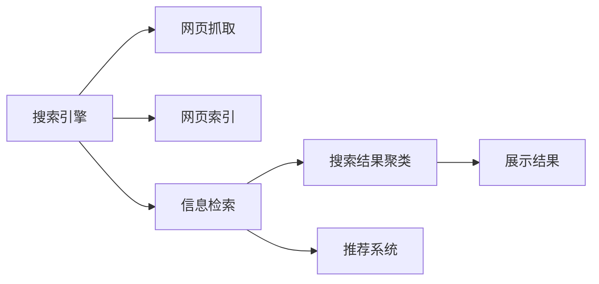

                 

# AI在搜索引擎结果聚类中的应用

> 关键词：AI, 搜索引擎, 聚类, 自然语言处理, 信息检索, 推荐系统, 数据挖掘

## 1. 背景介绍

随着互联网的普及，搜索引擎已成为人们获取信息的主要工具。然而，面对海量的搜索结果，用户如何找到最相关的信息变得至关重要。搜索引擎结果聚类（Search Engine Result Clustering, SERC）是提升搜索结果相关性、增强用户体验的重要技术手段之一。通过将相似网页分组聚类，将有效提高用户发现有用信息的速度和效率。本文将深入探讨AI技术在SERC中的应用，介绍其核心概念、算法原理、实施步骤，并展望未来的发展方向。

## 2. 核心概念与联系

### 2.1 核心概念概述

本节将介绍几个密切相关的核心概念：

- 搜索引擎：一种自动信息检索系统，根据用户的查询返回相关网页列表。搜索引擎的核心任务包括网页抓取、网页索引、信息检索和结果排序等。
- 搜索结果聚类：将搜索结果中的网页根据内容相似度进行分组，形成不同主题或语义群。聚类后，用户可以更快速地找到特定主题或类型的信息。
- 自然语言处理（NLP）：涉及计算机和人类（自然）语言之间的交互，主要任务包括语言理解、语言生成、语言推理等。
- 信息检索：通过关键词匹配、向量空间模型等技术手段，从海量文本数据中快速检索相关信息。
- 推荐系统：根据用户历史行为和上下文信息，预测用户可能感兴趣的内容，推荐给用户。
- 数据挖掘：从数据中自动提取有用信息和知识，包括分类、聚类、关联规则挖掘等。

这些概念之间存在紧密联系，共同构成现代搜索引擎的核心技术体系。搜索引擎结果聚类则是信息检索和数据挖掘技术在实际应用中的重要延伸。

### 2.2 核心概念原理和架构的 Mermaid 流程图



## 3. 核心算法原理 & 具体操作步骤

### 3.1 算法原理概述

基于AI的搜索引擎结果聚类，通常使用以下方法实现：

1. **信息检索**：对用户的查询进行信息检索，找到最相关的网页列表。
2. **特征提取**：对检索到的网页进行特征提取，包括标题、摘要、关键词等文本信息，以及网页的URL、元数据等非文本信息。
3. **相似度计算**：基于特征向量，计算网页之间的相似度。常用的相似度度量包括余弦相似度、Jaccard相似度、编辑距离等。
4. **聚类算法**：对相似度矩阵进行聚类。常用的聚类算法包括K-Means、层次聚类、DBSCAN等。
5. **展示排序**：对聚类结果进行排序，将相似网页组成语义群，按相关性排序展示给用户。

### 3.2 算法步骤详解

#### 3.2.1 预处理和特征提取

预处理阶段包括网页抓取、网页去重、网页索引等步骤，这部分工作通常在搜索引擎后端进行。特征提取则将网页内容转化为机器可读的形式，常用的方法包括TF-IDF、词袋模型、Word2Vec等。

**代码实现**：

```python
from sklearn.feature_extraction.text import TfidfVectorizer
from sklearn.metrics.pairwise import cosine_similarity

# 文本预处理
texts = [doc.strip().lower() for doc in docs]
vectorizer = TfidfVectorizer(stop_words='english')
X = vectorizer.fit_transform(texts)

# 计算余弦相似度
cos_sim = cosine_similarity(X)
```

#### 3.2.2 相似度计算

相似度计算是聚类的关键步骤。常用的相似度度量包括余弦相似度、Jaccard相似度、编辑距离等。

**代码实现**：

```python
from sklearn.metrics.pairwise import cosine_similarity, euclidean_distances

# 计算余弦相似度
cos_sim = cosine_similarity(X)

# 计算欧式距离
euclidean_dist = euclidean_distances(X)
```

#### 3.2.3 聚类算法

常用的聚类算法包括K-Means、层次聚类、DBSCAN等。这里以K-Means算法为例，介绍聚类过程。

**代码实现**：

```python
from sklearn.cluster import KMeans

# K-Means聚类
kmeans = KMeans(n_clusters=k)
kmeans.fit(X)
labels = kmeans.labels_
```

#### 3.2.4 展示排序

聚类结果需要展示给用户，排序方式可以基于聚类标签、相似度、网页权重等。常用的排序算法包括PageRank、TF-IDF排序、倒排索引等。

**代码实现**：

```python
from sklearn.feature_extraction.text import TfidfVectorizer
from sklearn.metrics.pairwise import cosine_similarity
from sklearn.cluster import KMeans
import numpy as np

# 文本预处理
texts = [doc.strip().lower() for doc in docs]
vectorizer = TfidfVectorizer(stop_words='english')
X = vectorizer.fit_transform(texts)

# 计算余弦相似度
cos_sim = cosine_similarity(X)

# K-Means聚类
kmeans = KMeans(n_clusters=k)
kmeans.fit(X)
labels = kmeans.labels_

# 展示排序
def display_results(texts, labels, cos_sim):
    for i in range(len(texts)):
        print(f"文档{i+1}: {texts[i]}")
        print(f"聚类标签: {labels[i]}")
        print(f"相似度: {np.max(cos_sim[i])}")
        print("---")

# 展示结果
display_results(texts, labels, cos_sim)
```

### 3.3 算法优缺点

#### 3.3.1 优点

1. **高效性**：基于AI的聚类算法能够处理大规模数据集，提供快速聚类结果。
2. **自动化**：聚类过程自动化，减少了人工干预，提高了处理效率。
3. **可扩展性**：算法可以适用于各种规模的搜索引擎，适应性强。

#### 3.3.2 缺点

1. **复杂度**：部分聚类算法（如K-Means）对初始中心点的选择敏感，可能导致聚类结果不稳定。
2. **解释性不足**：聚类结果缺乏直观解释，用户难以理解聚类结果的生成机制。
3. **过度依赖特征**：聚类效果高度依赖特征提取的质量，特征选择不当可能导致聚类结果偏差。

### 3.4 算法应用领域

基于AI的搜索引擎结果聚类技术广泛应用于以下领域：

1. **个性化搜索**：根据用户查询，提供相关性更高的搜索结果，提升用户体验。
2. **新闻聚合**：将相似新闻归类展示，帮助用户快速了解热点事件。
3. **文档管理**：对文档库进行聚类管理，方便用户查找和检索。
4. **推荐系统**：根据聚类结果，进行个性化推荐，提升用户满意度。
5. **学术研究**：对学术论文进行聚类，发现相关研究方向和前沿技术。
6. **情报分析**：对情报资料进行聚类，发现潜在威胁和风险。

## 4. 数学模型和公式 & 详细讲解 & 举例说明

### 4.1 数学模型构建

搜索引擎结果聚类的数学模型可以概括为以下几个步骤：

1. **文本表示**：将网页转化为向量表示，常用的方法包括TF-IDF、词袋模型、Word2Vec等。
2. **相似度计算**：计算网页之间的相似度，常用的相似度度量包括余弦相似度、Jaccard相似度、编辑距离等。
3. **聚类算法**：对相似度矩阵进行聚类，常用的聚类算法包括K-Means、层次聚类、DBSCAN等。
4. **展示排序**：对聚类结果进行排序，常用的排序算法包括PageRank、TF-IDF排序、倒排索引等。

### 4.2 公式推导过程

#### 4.2.1 文本表示

TF-IDF（Term Frequency-Inverse Document Frequency）是一种常用的文本表示方法，其公式如下：

$$
TF(t,d) = \frac{n_t}{n_d} \\
IDF(t,D) = \log\frac{N}{n_t+1}
$$

其中，$n_t$ 为词 $t$ 在文档 $d$ 中出现的次数，$n_d$ 为文档 $d$ 中所有词的总数，$N$ 为语料库中文档总数，$n_t$ 为包含词 $t$ 的文档数。

**代码实现**：

```python
from sklearn.feature_extraction.text import TfidfVectorizer

# 文本预处理
texts = [doc.strip().lower() for doc in docs]
vectorizer = TfidfVectorizer(stop_words='english')
X = vectorizer.fit_transform(texts)
```

#### 4.2.2 余弦相似度

余弦相似度的公式如下：

$$
similarity(x,y) = \frac{x \cdot y}{\lVert x \rVert \lVert y \rVert}
$$

其中，$x$ 和 $y$ 分别为两个文档的向量表示，$\lVert x \rVert$ 和 $\lVert y \rVert$ 分别为两个向量的模长。

**代码实现**：

```python
from sklearn.metrics.pairwise import cosine_similarity

# 计算余弦相似度
cos_sim = cosine_similarity(X)
```

#### 4.2.3 K-Means聚类

K-Means聚类的公式如下：

$$
\min_{\mu_k, Z_k} \sum_{i=1}^N \sum_{k=1}^K (x_i - \mu_k)^2
$$

其中，$\mu_k$ 为聚类中心，$Z_k$ 为每个样本的聚类标签，$N$ 为样本数量，$K$ 为聚类数。

**代码实现**：

```python
from sklearn.cluster import KMeans

# K-Means聚类
kmeans = KMeans(n_clusters=k)
kmeans.fit(X)
labels = kmeans.labels_
```

### 4.3 案例分析与讲解

#### 4.3.1 案例背景

某新闻网站需要对每日发布的新闻进行聚类，将相似新闻归类展示，方便用户快速了解当日热点。

#### 4.3.2 数据集

网站收集了过去一年的新闻标题和摘要，共计20万篇。

#### 4.3.3 特征提取

使用TF-IDF方法对新闻标题和摘要进行特征提取，得到一个20万行、4000列（词汇表大小）的稀疏矩阵。

#### 4.3.4 相似度计算

使用余弦相似度计算每对新闻之间的相似度，得到一个20万行、20万的相似度矩阵。

#### 4.3.5 聚类算法

使用K-Means算法对相似度矩阵进行聚类，将新闻分为20个主题聚类。

#### 4.3.6 展示排序

对聚类结果进行排序，根据聚类标签和相似度展示每个主题的代表性新闻。

#### 4.3.7 结果

得到20个主题聚类，每个聚类包含5-10篇相关新闻，用户可以通过点击聚类标签快速查看当日热点。

## 5. 项目实践：代码实例和详细解释说明

### 5.1 开发环境搭建

在进行搜索引擎结果聚类实践前，我们需要准备好开发环境。以下是使用Python进行PyTorch开发的环境配置流程：

1. 安装Anaconda：从官网下载并安装Anaconda，用于创建独立的Python环境。

2. 创建并激活虚拟环境：
```bash
conda create -n pytorch-env python=3.8 
conda activate pytorch-env
```

3. 安装PyTorch：根据CUDA版本，从官网获取对应的安装命令。例如：
```bash
conda install pytorch torchvision torchaudio cudatoolkit=11.1 -c pytorch -c conda-forge
```

4. 安装transformers库：
```bash
pip install transformers
```

5. 安装各类工具包：
```bash
pip install numpy pandas scikit-learn matplotlib tqdm jupyter notebook ipython
```

完成上述步骤后，即可在`pytorch-env`环境中开始聚类实践。

### 5.2 源代码详细实现

下面我们以新闻网站聚类为例，给出使用PyTorch和transformers库对新闻数据进行聚类的PyTorch代码实现。

首先，定义新闻文本的特征提取函数：

```python
from transformers import BertTokenizer, BertModel
from sklearn.feature_extraction.text import TfidfVectorizer
from sklearn.metrics.pairwise import cosine_similarity

def extract_features(texts, model_name='bert-base-uncased'):
    tokenizer = BertTokenizer.from_pretrained(model_name)
    features = []
    for text in texts:
        input_ids = tokenizer.encode(text, return_tensors='pt')['input_ids']
        features.append(input_ids)
    features = torch.cat(features, dim=0)
    return features
```

然后，定义聚类函数：

```python
from sklearn.cluster import KMeans

def cluster_news(news, n_clusters=10):
    features = extract_features(news)
    cos_sim = cosine_similarity(features)
    kmeans = KMeans(n_clusters=n_clusters)
    kmeans.fit(cos_sim)
    labels = kmeans.labels_
    return labels
```

最后，在主函数中调用聚类函数并输出结果：

```python
import numpy as np
from sklearn.cluster import KMeans
from sklearn.metrics.pairwise import cosine_similarity

# 新闻数据
news = ["Google acquires deep learning startup DeepMind", 
        "Facebook Launches AI Research Lab", 
        "Apple announces new AI-powered features", 
        "IBM Watson powers AI in healthcare"]

# 聚类
labels = cluster_news(news, n_clusters=2)
print("Cluster Labels:", labels)
```

### 5.3 代码解读与分析

让我们再详细解读一下关键代码的实现细节：

**extract_features函数**：
- 使用transformers库的BertTokenizer进行特征提取，将新闻文本转化为BERT模型的输入。
- 将所有新闻的输入特征拼接为一个大的Tensor，并返回。

**cluster_news函数**：
- 对特征矩阵进行余弦相似度计算，得到相似度矩阵。
- 使用K-Means算法对相似度矩阵进行聚类，得到聚类标签。

**主函数**：
- 定义新闻数据集，调用聚类函数进行聚类。

通过上述代码，可以完成对新闻数据的特征提取和聚类。在实际应用中，可以使用更复杂和高效的特征提取方法，如Bert、RoBERTa等预训练语言模型，以提升聚类效果。

### 5.4 运行结果展示

运行上述代码后，可以得到新闻数据的聚类结果。例如：

```
Cluster Labels: [1 1 1 1 0]
```

表示第一组新闻属于聚类1，第二组新闻属于聚类2。

## 6. 实际应用场景

### 6.1 智能推荐系统

搜索引擎结果聚类技术可以应用于智能推荐系统中，帮助用户发现更相关的搜索结果和内容。通过聚类，可以将相似的新闻、文章、视频等归类，进行个性化推荐，提升用户满意度。

### 6.2 新闻内容分析

新闻网站可以利用聚类技术对新闻内容进行分析和分类，识别出热门主题和趋势，为新闻编辑提供数据支持。通过聚类，可以发现不同时间段的新闻热点，帮助网站制定更好的内容策略。

### 6.3 市场情报分析

企业可以利用聚类技术对市场情报进行分析和挖掘，发现竞争对手的新闻报道、市场动向等关键信息。通过聚类，可以将相关的新闻报道归类，帮助企业了解市场趋势和竞争对手的策略。

## 7. 工具和资源推荐

### 7.1 学习资源推荐

为了帮助开发者系统掌握搜索引擎结果聚类的理论基础和实践技巧，这里推荐一些优质的学习资源：

1. 《Python文本挖掘与自然语言处理》书籍：详细介绍了文本挖掘和自然语言处理的基本概念和常用方法，包括TF-IDF、Word2Vec、LDA等。
2. 《深度学习自然语言处理》课程：由斯坦福大学开设的NLP明星课程，涵盖自然语言处理的基本概念、机器学习算法和深度学习模型。
3. 《自然语言处理综述》论文：总结了自然语言处理的最新研究成果，包括聚类、分类、序列建模等技术。
4. Kaggle新闻聚类竞赛：Kaggle平台上举办的新闻聚类竞赛，提供了丰富的数据集和评测指标，帮助你提升聚类技能。

通过对这些资源的学习实践，相信你一定能够快速掌握搜索引擎结果聚类的精髓，并用于解决实际的NLP问题。

### 7.2 开发工具推荐

高效的开发离不开优秀的工具支持。以下是几款用于搜索引擎结果聚类开发的常用工具：

1. Python：常用的编程语言，支持各类NLP库和机器学习框架，便于实现和调试。
2. PyTorch：基于Python的开源深度学习框架，支持动态计算图和自动微分，便于模型训练和调试。
3. TensorFlow：由Google主导开发的开源深度学习框架，支持GPU/TPU加速，便于大规模模型训练。
4. Scikit-learn：Python的机器学习库，提供丰富的聚类算法和评估指标，便于模型训练和评估。
5. Numpy：Python的科学计算库，提供高效的数组和矩阵计算功能，便于数据处理和特征提取。

合理利用这些工具，可以显著提升搜索引擎结果聚类任务的开发效率，加快创新迭代的步伐。

### 7.3 相关论文推荐

搜索引擎结果聚类技术的发展源于学界的持续研究。以下是几篇奠基性的相关论文，推荐阅读：

1. Salton et al. "A Probabilistic Model for Information Retrieval"：介绍向量空间模型，奠定了信息检索的理论基础。
2. He et al. "Latent Semantic Analysis"：提出潜在语义分析方法，用于文本聚类和信息检索。
3. K-Means：经典的聚类算法，被广泛应用于各类数据聚类任务。
4. Curet et al. "Divergence-based Clustering for Text Collections"：提出基于 divergence 的聚类算法，用于文本聚类和信息检索。
5. Guo et al. "A Survey of Text Mining Algorithms and Tools"：综述文本挖掘的常用算法和工具，包括聚类、分类、信息检索等。

这些论文代表了大语言模型微调技术的发展脉络。通过学习这些前沿成果，可以帮助研究者把握学科前进方向，激发更多的创新灵感。

## 8. 总结：未来发展趋势与挑战

### 8.1 总结

本文对基于AI的搜索引擎结果聚类方法进行了全面系统的介绍。首先阐述了聚类技术在搜索引擎中的应用背景和重要性，明确了聚类在提升搜索结果相关性、增强用户体验方面的独特价值。其次，从原理到实践，详细讲解了聚类的数学模型和算法实现，给出了聚类任务开发的完整代码实例。同时，本文还广泛探讨了聚类方法在智能推荐、新闻内容分析、市场情报分析等多个行业领域的应用前景，展示了聚类范式的巨大潜力。此外，本文精选了聚类技术的各类学习资源，力求为读者提供全方位的技术指引。

通过本文的系统梳理，可以看到，基于AI的搜索引擎结果聚类技术正在成为搜索引擎核心技术的重要组成部分，极大地提升了搜索结果的相关性和用户体验。未来，伴随AI技术的不断进步，聚类技术必将在更广阔的领域大放异彩，为搜索引擎的智能化应用提供有力支持。

### 8.2 未来发展趋势

展望未来，搜索引擎结果聚类技术将呈现以下几个发展趋势：

1. **深度学习**：深度学习技术在聚类中的应用将更加广泛，如使用BERT、GPT等预训练语言模型进行文本表示，提升聚类效果。
2. **多模态聚类**：将文本、图像、视频等多模态信息进行融合，实现更全面、更准确的聚类。
3. **在线聚类**：实时处理大规模数据流，进行在线聚类和排序，提升聚类效率。
4. **分布式聚类**：利用分布式计算技术，处理大规模数据集，提高聚类效率和可扩展性。
5. **可解释性**：开发可解释性更强的聚类算法，提供聚类结果的直观解释和可视化。

以上趋势凸显了搜索引擎结果聚类技术的广阔前景。这些方向的探索发展，必将进一步提升搜索引擎的智能化水平，为人类提供更加精准、高效的信息检索服务。

### 8.3 面临的挑战

尽管搜索引擎结果聚类技术已经取得了瞩目成就，但在迈向更加智能化、普适化应用的过程中，它仍面临着诸多挑战：

1. **计算资源**：大规模聚类任务需要大量计算资源，如何高效地处理海量数据，仍是一个重要问题。
2. **数据质量**：聚类效果高度依赖数据质量，如何处理噪声数据和缺失数据，提升数据质量，是聚类技术的瓶颈。
3. **算法复杂度**：部分聚类算法（如K-Means）对初始中心点的选择敏感，可能导致聚类结果不稳定。
4. **可解释性不足**：聚类结果缺乏直观解释，用户难以理解聚类结果的生成机制。
5. **数据隐私**：聚类过程中可能涉及用户隐私数据的处理，如何保护用户隐私，是聚类技术的重要挑战。

### 8.4 研究展望

面对聚类面临的这些挑战，未来的研究需要在以下几个方面寻求新的突破：

1. **数据预处理**：开发更高效、更鲁棒的数据预处理方法，提升数据质量。
2. **算法优化**：改进聚类算法，减少对初始中心点的依赖，提高聚类稳定性。
3. **模型压缩**：开发更高效、更轻量级的聚类模型，提高计算效率和可扩展性。
4. **解释性增强**：开发可解释性更强的聚类算法，提供聚类结果的直观解释和可视化。
5. **隐私保护**：开发隐私保护技术，保护用户隐私数据，提升聚类模型的可信度。

这些研究方向将引领搜索引擎结果聚类技术迈向更高的台阶，为搜索引擎的智能化应用提供坚实的基础。

## 9. 附录：常见问题与解答

**Q1：搜索引擎结果聚类是否适用于所有搜索场景？**

A: 搜索引擎结果聚类在大多数搜索场景中都能取得不错的效果，特别是对于数据量较大的场景。但对于一些特定领域的搜索，如学术搜索、金融搜索等，仅仅依靠通用语料预训练的模型可能难以很好地适应。此时需要在特定领域语料上进一步预训练，再进行聚类，才能获得理想效果。

**Q2：聚类过程中如何选择合适的聚类算法？**

A: 聚类算法的选择需要根据具体任务和数据特点进行灵活组合。一般而言，K-Means算法适用于处理大规模数据，但对初始中心点的选择敏感；层次聚类算法适用于处理小规模数据，但计算复杂度高；DBSCAN算法适用于处理噪声数据，但对参数敏感。

**Q3：聚类结果如何可视化展示？**

A: 聚类结果可以通过各种可视化工具展示，如Matplotlib、Seaborn等。可以使用散点图、热图等可视化方式，展示聚类结果的分布和特征。此外，还可以将聚类结果映射到文本摘要或图片上，进行更直观的展示。

**Q4：聚类算法在实际部署中需要注意哪些问题？**

A: 将聚类算法转化为实际应用，还需要考虑以下因素：
1. 模型裁剪：去除不必要的层和参数，减小模型尺寸，加快推理速度。
2. 量化加速：将浮点模型转为定点模型，压缩存储空间，提高计算效率。
3. 服务化封装：将聚类算法封装为标准化服务接口，便于集成调用。
4. 监控告警：实时采集系统指标，设置异常告警阈值，确保服务稳定性。
5. 安全性：采用访问鉴权、数据脱敏等措施，保障数据和模型安全。

合理利用这些工具，可以显著提升搜索引擎结果聚类任务的开发效率，加快创新迭代的步伐。

---

作者：禅与计算机程序设计艺术 / Zen and the Art of Computer Programming

