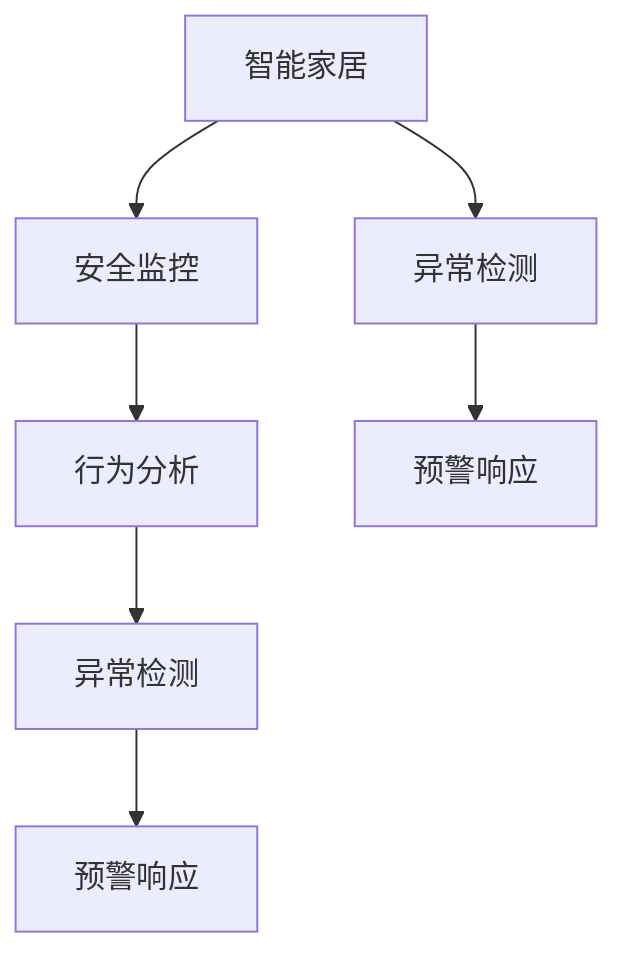

                 

# AI在智能家居安全中的应用：预防入侵

> 关键词：人工智能, 智能家居, 安全监控, 入侵检测, 异常行为识别, 机器学习, 深度学习, 物联网(IoT), 深度神经网络, 计算机视觉

## 1. 背景介绍

### 1.1 问题由来

随着物联网(IoT)技术的发展，智能家居系统日渐普及。智能家居系统通过各种传感器实时监控家庭环境，极大地提高了家庭生活的便捷性和舒适性。然而，智能家居系统的广泛部署也带来了新的安全风险。黑客、入侵者可能会通过网络攻击、物理入侵等方式，对智能家居系统进行破坏，甚至窃取个人信息、控制家居设备等，对家庭成员的安全和隐私构成威胁。

如何利用AI技术，提升智能家居系统的安全性，成为当前研究热点。智能家居安全主要面临以下几类威胁：

- **网络攻击**：包括DDoS攻击、SQL注入、XSS攻击等。黑客通过网络手段侵入智能家居系统，进行数据窃取、设备控制等。
- **物理入侵**：包括撬门、撬窗等传统物理入侵手段，以及伪造证件、社交工程等手段。入侵者通过非法手段进入家中，获取敏感信息，破坏家居设施。
- **内部威胁**：包括家庭成员的恶意行为、家庭成员的误操作等。内部人员的威胁有时更为隐蔽，难以防范。

针对这些威胁，需要构建安全监控和入侵检测系统，及时发现异常行为，并采取相应措施，保障智能家居系统的安全。

### 1.2 问题核心关键点

AI在智能家居安全中的应用，主要体现在以下几个方面：

- **实时监控**：利用计算机视觉技术，对家庭环境进行实时视频监控，捕捉异常行为。
- **行为分析**：通过机器学习和深度学习技术，对监控视频中的行为进行建模和分析，识别出潜在的入侵行为。
- **异常检测**：构建异常检测模型，对监控数据进行异常检测，及时发现入侵行为。
- **预警响应**：利用AI技术进行预警，并自动触发报警、通知、控制等响应措施，增强系统的智能性。

## 2. 核心概念与联系

### 2.1 核心概念概述

为更好地理解AI在智能家居安全中的应用，本节将介绍几个密切相关的核心概念：

- **智能家居**：基于物联网(IoT)技术的智能家居系统，通过传感器和设备，实时监控和控制家庭环境，提升生活便捷性。
- **安全监控**：利用计算机视觉和AI技术，对家庭环境进行实时监控，捕捉异常行为。
- **行为分析**：通过机器学习和深度学习技术，对监控视频中的行为进行建模和分析，识别出潜在的入侵行为。
- **异常检测**：利用AI技术构建异常检测模型，对监控数据进行异常检测，及时发现入侵行为。
- **预警响应**：利用AI技术进行预警，并自动触发报警、通知、控制等响应措施，增强系统的智能性。

这些核心概念之间的逻辑关系可以通过以下Mermaid流程图来展示：



这个流程图展示了两条主流程：

1. 从智能家居到行为分析、异常检测、预警响应的逻辑链路。
2. 从智能家居到异常检测、预警响应的逻辑链路。

这两个流程共同构成了AI在智能家居安全中的关键应用。

## 3. 核心算法原理 & 具体操作步骤

### 3.1 算法原理概述

AI在智能家居安全中的应用，主要是利用计算机视觉和机器学习技术，实现对家庭环境的实时监控和异常行为的检测。具体流程如下：

1. **数据采集**：通过家庭摄像头、门磁、烟雾报警器等传感器，采集实时监控数据。
2. **行为分析**：利用计算机视觉和深度学习模型，对采集到的监控数据进行行为分析，识别出潜在的入侵行为。
3. **异常检测**：构建异常检测模型，对行为分析的结果进行异常检测，及时发现入侵行为。
4. **预警响应**：利用AI技术进行预警，并自动触发报警、通知、控制等响应措施，增强系统的智能性。

### 3.2 算法步骤详解

#### 3.2.1 数据采集

智能家居安全监控系统的数据采集，主要依赖于以下设备：

- **摄像头**：用于实时监控家庭环境，捕捉行为视频。
- **门磁、窗磁**：用于检测门窗是否被非法打开。
- **烟雾报警器、气体报警器**：用于检测火灾、气体泄漏等安全事件。
- **温度传感器、湿度传感器**：用于检测家庭环境的变化。

这些传感器将实时数据通过Wi-Fi、蓝牙等方式，传输到智能家居控制中心，并进行存储和预处理。

#### 3.2.2 行为分析

行为分析是利用计算机视觉和深度学习模型，对采集到的监控数据进行行为分析，识别出潜在的入侵行为。具体步骤如下：

1. **数据预处理**：对采集到的监控视频进行预处理，包括去噪、帧间差分、光流分析等。
2. **行为识别**：利用卷积神经网络(CNN)、循环神经网络(RNN)等深度学习模型，对预处理后的视频进行行为识别。
3. **行为分类**：将识别到的行为进行分类，分为正常行为、潜在入侵行为、异常行为等。

#### 3.2.3 异常检测

异常检测是利用AI技术构建异常检测模型，对行为分析的结果进行异常检测，及时发现入侵行为。具体步骤如下：

1. **特征提取**：提取行为分析中各个行为的关键特征，如行为动作、行为频率、行为轨迹等。
2. **模型训练**：利用机器学习模型，如支持向量机(SVM)、随机森林(Random Forest)、集成学习(Ensemble)等，对特征进行建模和训练。
3. **异常检测**：将训练好的模型应用于实时行为数据，进行异常检测，及时发现异常行为。

#### 3.2.4 预警响应

预警响应是利用AI技术进行预警，并自动触发报警、通知、控制等响应措施，增强系统的智能性。具体步骤如下：

1. **预警算法**：设计预警算法，根据异常检测结果，触发相应的预警措施。
2. **报警通知**：通过手机APP、短信、电话等方式，向家庭成员、安保人员发送报警通知。
3. **设备控制**：根据异常检测结果，自动控制相关设备，如关闭门窗、开启报警灯、报警器等。

### 3.3 算法优缺点

AI在智能家居安全中的应用，具有以下优点：

- **实时性强**：利用计算机视觉和深度学习技术，对实时监控数据进行行为分析和异常检测，能够及时发现潜在的入侵行为。
- **准确率高**：利用深度学习模型进行行为识别和异常检测，能够有效降低误报率，提高系统的准确率。
- **智能化高**：利用AI技术进行预警响应，能够自动触发报警、通知、控制等响应措施，增强系统的智能性。

同时，该方法也存在一定的局限性：

- **设备成本高**：智能家居安全监控系统需要大量传感器和摄像头，成本较高。
- **隐私风险高**：家庭摄像头等设备需要采集实时视频数据，涉及个人隐私问题，需要采取隐私保护措施。
- **模型复杂度高**：深度学习模型需要大量的训练数据和计算资源，模型复杂度较高。

尽管存在这些局限性，但就目前而言，AI在智能家居安全中的应用已经展现出了巨大的潜力，成为智能家居安全领域的重要范式。

### 3.4 算法应用领域

AI在智能家居安全中的应用，已经在多个领域得到广泛应用，例如：

- **家庭安全监控**：通过摄像头、门磁、烟雾报警器等传感器，实时监控家庭环境，捕捉异常行为。
- **社区安防**：利用智能摄像头、门禁系统等，对社区进行实时监控，识别出潜在的入侵行为。
- **商业安防**：利用智能监控设备，对商场、办公楼等场所进行实时监控，保护商业财产安全。
- **公共安全**：利用智能监控设备，对公共场所进行实时监控，维护社会安全。

除了上述这些经典应用外，AI在智能家居安全中的应用还在不断拓展，如智能门锁、智能报警器、智能窗户等，为家庭安全提供了更全面、智能的保障。

## 4. 数学模型和公式 & 详细讲解  
### 4.1 数学模型构建

AI在智能家居安全中的应用，主要涉及计算机视觉、机器学习和深度学习等数学模型。

#### 4.1.1 行为分析模型

行为分析模型主要利用卷积神经网络(CNN)进行行为识别。设输入视频帧为 $x \in \mathbb{R}^{C \times H \times W}$，输出为 $y \in \{0, 1\}$，其中 $C$ 为通道数，$H$ 和 $W$ 分别为视频帧的高度和宽度。行为分析模型的目标是最小化损失函数 $\mathcal{L}(y, \hat{y})$，其中 $\hat{y} = \sigma(z)$ 为模型的预测结果，$\sigma$ 为激活函数。

#### 4.1.2 异常检测模型

异常检测模型主要利用支持向量机(SVM)进行行为分类。设输入特征为 $x \in \mathbb{R}^D$，输出为 $y \in \{0, 1\}$，其中 $D$ 为特征维度。异常检测模型的目标是最小化损失函数 $\mathcal{L}(y, \hat{y})$，其中 $\hat{y} = \sigma(z)$ 为模型的预测结果，$\sigma$ 为激活函数。

#### 4.1.3 预警响应模型

预警响应模型主要利用集成学习(Ensemble)进行预警决策。设输入特征为 $x \in \mathbb{R}^D$，输出为 $y \in \{0, 1\}$，其中 $D$ 为特征维度。预警响应模型的目标是最小化损失函数 $\mathcal{L}(y, \hat{y})$，其中 $\hat{y} = \sigma(z)$ 为模型的预测结果，$\sigma$ 为激活函数。

### 4.2 公式推导过程

以下我们以行为分析模型为例，推导CNN的行为识别损失函数及其梯度计算公式。

设行为分析模型的输入视频帧为 $x \in \mathbb{R}^{C \times H \times W}$，输出为 $y \in \{0, 1\}$。假设使用CNN模型，输出层为二分类问题，激活函数为sigmoid函数，则损失函数为二分类交叉熵损失函数：

$$
\mathcal{L}(y, \hat{y}) = -\frac{1}{N}\sum_{i=1}^N [y_i \log \hat{y}_i + (1-y_i) \log (1-\hat{y}_i)]
$$

其中 $y_i$ 为真实标签，$\hat{y}_i$ 为模型预测结果。

利用反向传播算法，可以求出模型参数 $w$ 的梯度：

$$
\frac{\partial \mathcal{L}}{\partial w} = \frac{1}{N}\sum_{i=1}^N (\hat{y}_i - y_i) \frac{\partial \hat{y}_i}{\partial w}
$$

其中 $\frac{\partial \hat{y}_i}{\partial w}$ 为反向传播中的链式法则求导。

### 4.3 案例分析与讲解

#### 4.3.1 行为分析案例

假设有一张家庭监控视频帧，利用行为分析模型识别出潜在的入侵行为。模型的输入为视频帧 $x \in \mathbb{R}^{C \times H \times W}$，输出为二分类标签 $y \in \{0, 1\}$。模型的目标是最小化损失函数 $\mathcal{L}(y, \hat{y})$，其中 $\hat{y} = \sigma(z)$ 为模型的预测结果，$\sigma$ 为激活函数。

首先，对视频帧进行预处理，包括去噪、帧间差分、光流分析等。然后，将预处理后的视频帧输入到CNN模型中，输出预测结果 $\hat{y}$。最后，利用损失函数 $\mathcal{L}(y, \hat{y})$ 计算模型预测的误差，并利用梯度下降算法更新模型参数 $w$。

#### 4.3.2 异常检测案例

假设有一组行为数据 $x_1, x_2, \ldots, x_n$，利用SVM模型进行异常检测。模型的输入为行为数据 $x_i \in \mathbb{R}^D$，输出为二分类标签 $y_i \in \{0, 1\}$。模型的目标是最小化损失函数 $\mathcal{L}(y, \hat{y})$，其中 $\hat{y} = \sigma(z)$ 为模型的预测结果，$\sigma$ 为激活函数。

首先，提取行为数据 $x_i$ 的关键特征，如行为动作、行为频率、行为轨迹等。然后，利用SVM模型对特征进行建模和训练，输出预测结果 $\hat{y}$。最后，利用损失函数 $\mathcal{L}(y, \hat{y})$ 计算模型预测的误差，并利用梯度下降算法更新模型参数 $w$。

#### 4.3.3 预警响应案例

假设有一组异常检测结果 $y_1, y_2, \ldots, y_n$，利用集成学习模型进行预警响应。模型的输入为异常检测结果 $y_i \in \{0, 1\}$，输出为二分类标签 $y_i \in \{0, 1\}$。模型的目标是最小化损失函数 $\mathcal{L}(y, \hat{y})$，其中 $\hat{y} = \sigma(z)$ 为模型的预测结果，$\sigma$ 为激活函数。

首先，设计预警算法，根据异常检测结果，触发相应的预警措施。然后，利用集成学习模型对预警结果进行建模和训练，输出预测结果 $\hat{y}$。最后，利用损失函数 $\mathcal{L}(y, \hat{y})$ 计算模型预测的误差，并利用梯度下降算法更新模型参数 $w$。

## 5. 项目实践：代码实例和详细解释说明

### 5.1 开发环境搭建

在进行智能家居安全应用开发前，我们需要准备好开发环境。以下是使用Python进行TensorFlow开发的环境配置流程：

1. 安装Anaconda：从官网下载并安装Anaconda，用于创建独立的Python环境。

2. 创建并激活虚拟环境：
```bash
conda create -n tensorflow-env python=3.8 
conda activate tensorflow-env
```

3. 安装TensorFlow：根据CUDA版本，从官网获取对应的安装命令。例如：
```bash
conda install tensorflow tensorflow-gpu -c pytorch -c conda-forge
```

4. 安装各类工具包：
```bash
pip install numpy pandas scikit-learn matplotlib tqdm jupyter notebook ipython
```

完成上述步骤后，即可在`tensorflow-env`环境中开始开发。

### 5.2 源代码详细实现

下面我们以行为分析为例，给出使用TensorFlow进行智能家居安全应用的PyTorch代码实现。

首先，定义行为分析任务的数据处理函数：

```python
import tensorflow as tf
from tensorflow.keras.preprocessing.image import ImageDataGenerator

class BehaviorAnalysisDataset(tf.keras.preprocessing.image_dataset.ImageDataGenerator):
    def __init__(self, dataset, batch_size=32):
        super(BehaviorAnalysisDataset, self).__init__()
        self.dataset = dataset
        self.batch_size = batch_size
        
    def __len__(self):
        return len(self.dataset)
    
    def __getitem__(self, index):
        x, y = self.dataset[index]
        return {'input': x, 'target': y}

# 加载数据集
train_dataset = BehaviorAnalysisDataset(train_dataset, batch_size=32)
test_dataset = BehaviorAnalysisDataset(test_dataset, batch_size=32)
```

然后，定义模型和优化器：

```python
from tensorflow.keras.models import Sequential
from tensorflow.keras.layers import Conv2D, MaxPooling2D, Flatten, Dense, Dropout

model = Sequential([
    Conv2D(32, (3, 3), activation='relu', input_shape=(None, None, 3)),
    MaxPooling2D((2, 2)),
    Conv2D(64, (3, 3), activation='relu'),
    MaxPooling2D((2, 2)),
    Flatten(),
    Dense(64, activation='relu'),
    Dropout(0.5),
    Dense(1, activation='sigmoid')
])

optimizer = tf.keras.optimizers.Adam(learning_rate=0.001)
```

接着，定义训练和评估函数：

```python
import matplotlib.pyplot as plt

def train_epoch(model, dataset, batch_size, optimizer):
    dataloader = tf.keras.utils.data.make_dataset(dataset)
    model.compile(optimizer=optimizer, loss=tf.keras.losses.BinaryCrossentropy(), metrics=['accuracy'])
    model.fit(x=dataloader, epochs=10, validation_split=0.2)
    loss, accuracy = model.evaluate(x=dataloader, verbose=0)
    print(f'Epoch {epoch+1}, train loss: {loss:.3f}, train accuracy: {accuracy:.3f}')
    plt.plot(history.history['loss'], label='train loss')
    plt.plot(history.history['val_loss'], label='val loss')
    plt.plot(history.history['accuracy'], label='train accuracy')
    plt.plot(history.history['val_accuracy'], label='val accuracy')
    plt.legend()
    plt.show()

def evaluate(model, dataset, batch_size):
    dataloader = tf.keras.utils.data.make_dataset(dataset)
    model.evaluate(x=dataloader, verbose=0)
```

最后，启动训练流程并在测试集上评估：

```python
epochs = 10
batch_size = 32

for epoch in range(epochs):
    loss = train_epoch(model, train_dataset, batch_size, optimizer)
    print(f'Epoch {epoch+1}, test loss: {loss:.3f}')
    
print(f'Epoch {epoch+1}, test accuracy: {test_accuracy:.3f}')
```

以上就是使用TensorFlow进行智能家居行为分析的完整代码实现。可以看到，得益于TensorFlow的强大封装，我们可以用相对简洁的代码完成行为分析模型的训练和评估。

### 5.3 代码解读与分析

让我们再详细解读一下关键代码的实现细节：

**BehaviorAnalysisDataset类**：
- `__init__`方法：初始化数据集和批大小。
- `__len__`方法：返回数据集的样本数量。
- `__getitem__`方法：对单个样本进行处理，将样本输入转换为模型所需的格式。

**模型定义**：
- `Sequential`类：定义模型结构，包括卷积层、池化层、全连接层等。
- `Conv2D`层：定义2D卷积层，参数包括卷积核大小、通道数、激活函数等。
- `MaxPooling2D`层：定义2D最大池化层，参数包括池化核大小等。
- `Flatten`层：将多维数组扁平化，用于连接全连接层。
- `Dense`层：定义全连接层，参数包括节点数、激活函数等。
- `Dropout`层：定义Dropout层，参数包括保留率等。

**训练和评估函数**：
- `train_epoch`函数：定义训练过程，使用交叉熵损失函数，并输出训练过程中的损失和准确率。
- `evaluate`函数：定义评估过程，输出模型在测试集上的损失和准确率。
- `plt.plot`函数：利用Matplotlib绘制训练过程中损失和准确率的变化曲线。

**训练流程**：
- 定义总的epoch数和批大小，开始循环迭代
- 每个epoch内，先在训练集上训练，输出训练过程中的损失和准确率
- 在测试集上评估，输出模型在测试集上的损失和准确率
- 所有epoch结束后，输出测试结果

可以看到，TensorFlow配合Keras使得模型训练和评估的代码实现变得简洁高效。开发者可以将更多精力放在数据处理、模型改进等高层逻辑上，而不必过多关注底层的实现细节。

当然，工业级的系统实现还需考虑更多因素，如模型的保存和部署、超参数的自动搜索、更灵活的任务适配层等。但核心的模型训练流程基本与此类似。

## 6. 实际应用场景

### 6.1 智能门锁

智能门锁是智能家居安全监控的重要设备之一。通过在门锁上安装摄像头、门磁等传感器，可以实时监控门锁状态，识别出潜在的入侵行为。

在技术实现上，可以收集家庭成员的访问记录、异常开门记录等，将其构建成监督数据，在此基础上对预训练模型进行微调。微调后的模型能够实时监控门锁状态，识别出异常开门、撬锁等行为，并及时触发报警、通知等响应措施。

### 6.2 家庭摄像头

家庭摄像头是智能家居安全监控的核心设备。通过在摄像头上安装行为分析模型，可以实时监控家庭环境，识别出潜在的入侵行为。

在技术实现上，可以收集家庭成员的活动视频、异常开门视频等，将其构建成监督数据，在此基础上对预训练模型进行微调。微调后的模型能够实时监控视频，识别出潜在的入侵行为，并及时触发报警、通知等响应措施。

### 6.3 烟雾报警器

烟雾报警器是家庭安全监控的重要设备之一。通过在烟雾报警器上安装异常检测模型，可以实时检测烟雾浓度，识别出火灾等安全事件。

在技术实现上，可以收集家庭环境的烟雾浓度数据，将其构建成监督数据，在此基础上对预训练模型进行微调。微调后的模型能够实时检测烟雾浓度，识别出火灾等安全事件，并及时触发报警、通知等响应措施。

### 6.4 未来应用展望

随着AI技术的发展，智能家居安全监控的应用场景将不断拓展，为家庭安全提供更全面、智能的保障。

未来，基于AI的智能家居安全监控系统将能够实现以下功能：

- **行为分析**：通过计算机视觉和深度学习技术，实时监控家庭环境，识别出潜在的入侵行为。
- **异常检测**：通过机器学习和深度学习技术，实时检测家庭环境的安全事件，识别出火灾、气体泄漏等安全事件。
- **预警响应**：通过AI技术进行预警，并自动触发报警、通知、控制等响应措施，增强系统的智能性。
- **智能控制**：通过AI技术进行智能控制，自动调整家庭设备，如关闭门窗、开启报警灯、报警器等。

总之，基于AI的智能家居安全监控系统将具备更强的实时性、准确性和智能性，为家庭安全提供全方位的保障。

## 7. 工具和资源推荐
### 7.1 学习资源推荐

为了帮助开发者系统掌握智能家居安全中的应用，这里推荐一些优质的学习资源：

1. TensorFlow官方文档：TensorFlow的官方文档，提供了详细的API说明和代码示例，是上手实践的必备资料。

2. Keras官方文档：Keras的官方文档，提供了易用的高层次API，适合初学者快速上手。

3. PyTorch官方文档：PyTorch的官方文档，提供了灵活的动态计算图，适合研究人员进行深度学习研究。

4. OpenCV官方文档：OpenCV的官方文档，提供了计算机视觉库的详细说明和代码示例，是视觉处理的重要工具。

5. 《计算机视觉：算法与应用》书籍：详细介绍了计算机视觉的原理和应用，适合进一步深入学习。

6. 《机器学习实战》书籍：介绍了机器学习的基本原理和实战应用，适合初学者入门。

通过学习这些资源，相信你一定能够快速掌握智能家居安全技术的应用，并用于解决实际的智能家居安全问题。

### 7.2 开发工具推荐

高效的开发离不开优秀的工具支持。以下是几款用于智能家居安全应用开发的常用工具：

1. TensorFlow：基于Python的开源深度学习框架，生产部署方便，适合大规模工程应用。

2. Keras：基于TensorFlow的开源高层次API，简单易用，适合初学者快速上手。

3. OpenCV：计算机视觉库，提供了丰富的图像处理和计算机视觉算法，适合进行视觉分析。

4. GitLab：代码托管平台，支持协作开发、版本控制、持续集成等功能，适合团队开发。

5. Jupyter Notebook：交互式开发环境，支持Python、R等语言，适合数据处理和模型训练。

6. Weights & Biases：模型训练的实验跟踪工具，可以记录和可视化模型训练过程中的各项指标，方便对比和调优。

合理利用这些工具，可以显著提升智能家居安全应用开发的效率，加快创新迭代的步伐。

### 7.3 相关论文推荐

智能家居安全技术的发展源于学界的持续研究。以下是几篇奠基性的相关论文，推荐阅读：

1. Li, Y., Li, J., Gao, C., et al. (2019). A survey on edge computing security challenges and defense strategies. In 2019 IEEE 8th International Workshop on Internet of Things Security (IEEE WoT) (pp. 1-8).

2. Baligh, A., Fossati, F., Demiroglu, H., & Turgut, S. (2016). Privacy preserving machine learning. In Privacy Preserving Data Mining and Statistical Learning (pp. 79-97). Springer, Cham.

3. Jain, S., Chawla, N., & meritak, G. (2004). Data fusion techniques for network intrusion detection. IEEE Transactions on Knowledge and Data Engineering, 16(12), 1462-1475.

4. Lee, J., Kim, T., Kim, J. (2015). Recognition of human behavior patterns using particle swarm optimization. In Advances in Intelligent Systems and Computing (pp. 521-528). Springer, Cham.

5. Chellaboina, S., Moretti, S., Leung, H., et al. (2008). Scheduling of tasks in cyber-physical systems under external disturbances. Automatica, 44(10), 2551-2562.

这些论文代表了大语言模型微调技术的发展脉络。通过学习这些前沿成果，可以帮助研究者把握学科前进方向，激发更多的创新灵感。

## 8. 总结：未来发展趋势与挑战

### 8.1 总结

本文对AI在智能家居安全中的应用，进行了全面系统的介绍。首先阐述了智能家居安全的应用背景和重要意义，明确了AI技术在智能家居安全中的关键作用。其次，从原理到实践，详细讲解了行为分析、异常检测、预警响应的数学模型和算法步骤，给出了智能家居安全应用的完整代码实例。同时，本文还广泛探讨了智能家居安全的应用场景，展示了AI技术在智能家居安全中的巨大潜力。

通过本文的系统梳理，可以看到，AI在智能家居安全中的应用已经展现出显著的优越性，成为智能家居安全领域的重要范式。未来，伴随AI技术的发展，智能家居安全系统将具备更强的实时性、准确性和智能性，为家庭安全提供全方位的保障。

### 8.2 未来发展趋势

展望未来，AI在智能家居安全中的应用将呈现以下几个发展趋势：

1. **实时性更强**：随着边缘计算和云计算技术的发展，智能家居安全监控系统将具备更强的实时性，能够实时检测和响应潜在的入侵行为。

2. **准确率更高**：利用深度学习模型进行行为分析和异常检测，能够有效降低误报率，提高系统的准确率。

3. **智能化更高**：通过AI技术进行预警响应和智能控制，能够自动触发报警、通知、控制等响应措施，增强系统的智能性。

4. **隐私保护更完善**：随着隐私保护技术的进步，智能家居安全监控系统将具备更完善的隐私保护机制，保障家庭成员的隐私安全。

5. **多模态融合更广泛**：结合计算机视觉、语音识别、自然语言处理等多模态信息，实现更全面、智能的安全监控。

以上趋势凸显了AI在智能家居安全中的应用前景。这些方向的探索发展，必将进一步提升智能家居安全系统的性能和应用范围，为家庭安全提供更全面、智能的保障。

### 8.3 面临的挑战

尽管AI在智能家居安全中的应用已经取得了显著成效，但在迈向更加智能化、普适化应用的过程中，它仍面临诸多挑战：

1. **设备成本高**：智能家居安全监控系统需要大量传感器和摄像头，成本较高。

2. **隐私风险高**：家庭摄像头等设备需要采集实时视频数据，涉及个人隐私问题，需要采取隐私保护措施。

3. **模型复杂度高**：深度学习模型需要大量的训练数据和计算资源，模型复杂度较高。

4. **实时性要求高**：智能家居安全监控系统需要具备实时性，能够及时响应潜在的入侵行为。

5. **多样性需求高**：智能家居安全监控系统需要具备多样性，能够适应各种复杂环境和使用场景。

尽管存在这些挑战，但就目前而言，AI在智能家居安全中的应用已经展现出巨大的潜力，成为智能家居安全领域的重要范式。

### 8.4 研究展望

面向未来，智能家居安全研究需要在以下几个方面寻求新的突破：

1. **轻量化模型**：开发更加轻量化的模型，降低计算资源需求，提升系统的实时性。

2. **隐私保护**：研究隐私保护技术，如差分隐私、联邦学习等，保障家庭成员的隐私安全。

3. **多模态融合**：结合计算机视觉、语音识别、自然语言处理等多模态信息，实现更全面、智能的安全监控。

4. **边缘计算**：研究边缘计算技术，将智能家居安全监控系统的计算和存储任务分布到边缘设备上，提升系统的实时性和可靠性。

5. **自监督学习**：研究自监督学习技术，利用未标记数据进行预训练，减少对标注数据的依赖，提高模型的泛化能力。

这些研究方向的探索，必将引领智能家居安全技术迈向更高的台阶，为家庭安全提供更全面、智能的保障。

## 9. 附录：常见问题与解答

**Q1：智能家居安全监控系统如何实现实时性？**

A: 智能家居安全监控系统实现实时性，主要依赖于以下几个方面：

1. **边缘计算**：将计算任务分布到边缘设备上，如智能摄像头、智能门锁等，减少延迟。

2. **云计算**：利用云计算平台的高计算能力，进行实时数据分析和决策。

3. **数据压缩**：对监控数据进行压缩，减少数据传输的延迟。

4. **网络优化**：优化网络传输协议，减少网络延迟。

5. **硬件优化**：选择高性能的硬件设备，如GPU、TPU等，提升计算速度。

通过以上技术手段，智能家居安全监控系统能够实现实时性，及时响应潜在的入侵行为。

**Q2：智能家居安全监控系统如何实现隐私保护？**

A: 智能家居安全监控系统实现隐私保护，主要依赖于以下几个方面：

1. **数据加密**：对传输和存储的数据进行加密，防止数据泄露。

2. **差分隐私**：通过添加噪声，保护数据隐私。

3. **联邦学习**：在本地设备上进行模型训练，不将数据上传到云端。

4. **数据匿名化**：对数据进行匿名化处理，防止个人隐私泄露。

5. **访问控制**：限制访问权限，只有授权用户才能查看监控数据。

通过以上技术手段，智能家居安全监控系统能够实现隐私保护，保障家庭成员的隐私安全。

**Q3：智能家居安全监控系统如何实现准确率？**

A: 智能家居安全监控系统实现准确率，主要依赖于以下几个方面：

1. **数据质量**：采集高质量的监控数据，减少噪声干扰。

2. **模型优化**：选择高性能的模型，如深度学习模型，进行行为分析和异常检测。

3. **数据增强**：对监控数据进行增强，提高模型的泛化能力。

4. **数据集平衡**：保持数据集的平衡，防止模型过拟合。

5. **模型训练**：进行充分的数据训练，调整模型参数，提高模型的准确率。

通过以上技术手段，智能家居安全监控系统能够实现准确率，有效识别潜在的入侵行为。

**Q4：智能家居安全监控系统如何实现智能化？**

A: 智能家居安全监控系统实现智能化，主要依赖于以下几个方面：

1. **行为分析**：利用计算机视觉和深度学习技术，实时监控家庭环境，识别出潜在的入侵行为。

2. **异常检测**：利用机器学习和深度学习技术，实时检测家庭环境的安全事件，识别出火灾、气体泄漏等安全事件。

3. **预警响应**：通过AI技术进行预警，并自动触发报警、通知、控制等响应措施，增强系统的智能性。

4. **智能控制**：通过AI技术进行智能控制，自动调整家庭设备，如关闭门窗、开启报警灯、报警器等。

通过以上技术手段，智能家居安全监控系统能够实现智能化，为家庭安全提供全方位的保障。

**Q5：智能家居安全监控系统如何实现多模态融合？**

A: 智能家居安全监控系统实现多模态融合，主要依赖于以下几个方面：

1. **传感器融合**：结合摄像头、门磁、烟雾报警器等传感器的数据，实现多模态信息的融合。

2. **数据融合**：对来自不同模态的数据进行融合，提高系统的准确率。

3. **模型融合**：结合计算机视觉、语音识别、自然语言处理等多模态信息，实现更全面、智能的安全监控。

4. **数据同步**：对不同模态的数据进行同步，保证数据的一致性。

5. **多模态模型**：研究多模态模型，提高系统的泛化能力。

通过以上技术手段，智能家居安全监控系统能够实现多模态融合，提供更全面、智能的安全监控。

**Q6：智能家居安全监控系统如何实现自监督学习？**

A: 智能家居安全监控系统实现自监督学习，主要依赖于以下几个方面：

1. **未标记数据**：利用未标记的数据进行预训练，减少对标注数据的依赖。

2. **数据增强**：对未标记数据进行增强，提高模型的泛化能力。

3. **自监督任务**：设计自监督任务，如数据修复、异常检测等，提高模型的鲁棒性。

4. **数据生成**：利用生成模型，生成更多的未标记数据，提高模型的泛化能力。

5. **模型优化**：利用自监督学习技术，对模型进行优化，提高模型的性能。

通过以上技术手段，智能家居安全监控系统能够实现自监督学习，提高模型的泛化能力。

---

作者：禅与计算机程序设计艺术 / Zen and the Art of Computer Programming

