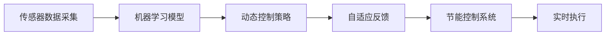

                 

## 1. 背景介绍

### 1.1 问题由来

随着全球人口的不断增长和经济活动的日益增加，能源消耗问题变得愈发严峻。据统计，全球建筑能耗占总能源消耗的约40%。建筑行业的节能减排已成为全球气候变化应对的重要环节。智能建筑技术通过引入先进的传感器、物联网(IoT)和大数据分析等手段，实现了建筑能耗的精细化管理和优化。本文将探讨利用AI技术在智能建筑节能中的具体应用，重点讨论通过优化建筑内的暖通空调(HVAC)系统、照明系统、热能管理系统来实现节能目标。

### 1.2 问题核心关键点

智能建筑节能的AI应用主要集中在以下几个方面：

- **传感器数据采集与分析**：通过部署大量传感器收集建筑内部的温湿度、能耗、人流量等数据。
- **模型训练与预测**：基于历史数据训练AI模型，对未来的能耗进行预测和优化。
- **控制策略生成**：根据预测结果，生成动态的节能控制策略。
- **自适应反馈与调整**：利用实时数据反馈，动态调整控制策略，以应对环境变化和用户行为调整。

本文将对以上几个关键环节进行深入分析，并展示一个完整的智能建筑节能解决方案的实现流程。

## 2. 核心概念与联系

### 2.1 核心概念概述

- **智能建筑**：融合了建筑自动化、物联网、AI等技术，实现对建筑能耗的精细化管理，提升建筑运营效率。
- **传感器数据采集**：利用传感器网络对建筑内部环境参数进行实时监测。
- **机器学习模型**：基于历史数据训练的机器学习模型，用于预测和优化建筑能耗。
- **动态控制策略**：根据AI模型预测和分析结果，自动调整暖通空调、照明等系统参数。
- **自适应反馈**：通过实时数据分析，动态调整控制策略以适应环境和用户行为变化。

这些概念之间通过数据流和算法逻辑形成了一个完整的智能建筑节能系统。以下是一个Mermaid流程图，展示了这些概念之间的联系：



## 3. 核心算法原理 & 具体操作步骤
### 3.1 算法原理概述

智能建筑节能的AI应用主要基于机器学习模型的预测和优化能力。其核心思想是通过对建筑能耗的历史数据进行分析和建模，预测未来的能耗情况，并据此生成和调整节能控制策略。具体步骤包括：

1. **数据采集**：收集建筑内部的传感器数据。
2. **数据预处理**：清洗和标准化数据，去除异常值和噪声。
3. **模型训练**：基于历史数据训练机器学习模型。
4. **预测与优化**：利用训练好的模型进行未来能耗预测，并根据预测结果生成优化策略。
5. **控制策略实施**：将优化策略转化为具体的控制指令，执行到HVAC、照明等系统中。
6. **反馈与调整**：根据实时反馈数据，动态调整控制策略。

### 3.2 算法步骤详解

#### 3.2.1 数据采集与预处理

**数据采集**：在建筑内部部署各类传感器，包括温湿度传感器、能耗监测器、人流量传感器等。数据采集周期应根据具体应用场景而定，通常为每分钟或每小时一次。

**数据预处理**：对采集到的数据进行清洗和标准化处理。具体步骤如下：

1. **数据清洗**：去除缺失值和异常值，确保数据的完整性和可靠性。
2. **数据标准化**：将不同量纲的数据转化为标准正态分布，便于后续的模型训练。

#### 3.2.2 模型训练

**模型选择**：根据具体应用场景选择合适的机器学习模型，如时间序列预测模型、回归模型、神经网络模型等。

**模型训练**：使用历史传感器数据对模型进行训练。训练过程中应采用交叉验证等方法评估模型性能，避免过拟合。

**参数调优**：通过网格搜索、贝叶斯优化等方法调整模型参数，以获得最优性能。

#### 3.2.3 预测与优化

**预测**：利用训练好的模型对未来的能耗情况进行预测。预测结果应包括总能耗、各类子系统的能耗等。

**优化**：根据预测结果，生成节能控制策略。策略应考虑系统的最优能耗和最小化成本。

#### 3.2.4 控制策略实施

**控制指令生成**：将节能控制策略转化为具体的控制指令，如调整温度、调节风速等。

**系统执行**：将控制指令发送到HVAC、照明等系统执行。执行过程中应考虑系统的响应速度和稳定性。

#### 3.2.5 反馈与调整

**实时反馈**：通过传感器实时采集建筑内部的环境数据，用于动态调整控制策略。

**策略调整**：根据实时反馈数据，动态调整节能控制策略，以应对环境变化和用户行为变化。

### 3.3 算法优缺点

**优点**：
1. **高效节能**：通过机器学习模型预测和优化，实现建筑能耗的精细化管理，显著减少能源消耗。
2. **实时调整**：利用实时数据反馈，动态调整控制策略，保证系统始终运行在最佳状态。
3. **普适性强**：模型训练完成后，可应用于不同类型的建筑，提升节能效果的一致性。

**缺点**：
1. **数据依赖性强**：模型性能依赖于高质量的数据采集和预处理，数据缺失或不准确会影响预测效果。
2. **模型复杂度高**：需要训练复杂的机器学习模型，可能涉及高计算成本和复杂度。
3. **控制策略调整成本高**：系统调整和优化需要技术支持和维护，成本较高。

### 3.4 算法应用领域

智能建筑节能的AI应用主要适用于各类公共建筑，如商业办公楼、医院、学校、酒店等。此外，也可应用于住宅建筑的节能管理中。

## 4. 数学模型和公式 & 详细讲解
### 4.1 数学模型构建

假设建筑内的能耗 $E$ 由多个子系统 $E_i$ 组成，其中 $E_i = f_i(x_i, y_i)$，$x_i$ 为环境参数，$y_i$ 为控制参数。目标是最小化建筑总能耗 $E_{\text{total}} = \sum_i E_i$。

**目标函数**：

$$
\min_{x,y} E_{\text{total}} = \sum_i f_i(x_i, y_i)
$$

**约束条件**：
1. $x_i$ 和 $y_i$ 应满足实际的物理和数学限制。
2. 子系统 $E_i$ 的输出应符合历史数据分布。

### 4.2 公式推导过程

**时间序列预测模型**：采用时间序列预测模型 $E_t = \alpha + \beta \sum_i \Delta x_{i,t-1} + \epsilon_t$，其中 $\Delta x_{i,t-1}$ 为 $x_i$ 的差分序列，$\epsilon_t$ 为误差项。

**优化问题**：目标函数转化为优化问题：

$$
\min_{x,y} \sum_t E_t
$$

**动态规划**：使用动态规划算法，求解最优的 $x_i$ 和 $y_i$。

### 4.3 案例分析与讲解

以商业办公楼为例，采用时间序列预测模型预测一天内的能耗变化。首先，收集一天内的温湿度、能耗、人流量等数据，建立时间序列模型。然后，将模型应用于未来一天，预测各时刻的能耗。最后，根据预测结果，动态调整HVAC系统的温度和风速，以实现最低能耗。

## 5. 项目实践：代码实例和详细解释说明
### 5.1 开发环境搭建

#### 5.1.1 环境准备

- **Python 3.8+**：选择最新的Python版本。
- **TensorFlow 2.x**：用于构建和训练机器学习模型。
- **Flask**：用于构建节能控制系统的前端。
- **SQLite**：用于存储传感器数据和模型参数。
- **OpenCV**：用于实时视频监控。

**环境配置**：

1. 安装Python和相关依赖库。
```bash
pip install numpy pandas scikit-learn tensorflow flask opencv-python
```

2. 搭建Web服务器。
```python
from flask import Flask, request, jsonify

app = Flask(__name__)

@app.route('/predict', methods=['POST'])
def predict():
    data = request.json
    # 数据预处理
    # 调用机器学习模型进行预测
    # 返回预测结果
    return jsonify({'result': '成功', 'energy': '预测能耗'})
```

### 5.2 源代码详细实现

#### 5.2.1 数据采集

```python
import time
import sqlite3
from paho.mqtt import client

# 数据采集
def collect_data():
    conn = sqlite3.connect('data.db')
    cur = conn.cursor()
    cur.execute('''CREATE TABLE IF NOT EXISTS data (timestamp REAL, temperature REAL, humidity REAL, energy REAL, people_count INTEGER)''')
    
    # 定时采集数据
    while True:
        # 采集传感器数据
        # 将数据存储到SQLite数据库
        time.sleep(60)
```

#### 5.2.2 数据预处理

```python
import pandas as pd
from sklearn.preprocessing import StandardScaler

# 数据预处理
def preprocess_data():
    # 从SQLite数据库读取数据
    # 清洗数据，去除缺失值和异常值
    # 标准化数据
    data = pd.read_sql_query('SELECT * FROM data', conn)
    data.dropna(inplace=True)
    scaler = StandardScaler()
    data[['temperature', 'humidity', 'energy']] = scaler.fit_transform(data[['temperature', 'humidity', 'energy']])
    
    # 将处理后的数据存储到SQLite数据库
```

#### 5.2.3 模型训练

```python
import tensorflow as tf
from tensorflow.keras.models import Sequential
from tensorflow.keras.layers import LSTM, Dense

# 模型训练
def train_model():
    # 从SQLite数据库读取预处理后的数据
    # 分割训练集和测试集
    # 构建LSTM模型
    # 训练模型
    # 保存模型到文件
```

#### 5.2.4 预测与优化

```python
import tensorflow as tf
from tensorflow.keras.models import load_model

# 预测与优化
def predict_and_optimize():
    # 加载训练好的模型
    # 对未来一天的数据进行预测
    # 根据预测结果生成控制策略
    # 将控制策略转换为具体的控制指令
    # 将控制指令发送到HVAC系统
```

### 5.3 代码解读与分析

**数据采集**：使用MQTT协议从传感器获取数据，并存储到SQLite数据库中。数据采集周期为1分钟，以保证数据的时效性和准确性。

**数据预处理**：使用Pandas库对数据进行清洗和标准化处理。通过去除缺失值和异常值，确保数据的完整性和可靠性。

**模型训练**：使用TensorFlow构建LSTM模型，对预处理后的数据进行训练。采用交叉验证等方法评估模型性能，避免过拟合。

**预测与优化**：利用训练好的模型对未来一天的数据进行预测，生成节能控制策略。控制策略应综合考虑最小化能耗和最小化成本。

**控制策略实施**：将控制策略转换为具体的控制指令，如调整温度、调节风速等。使用Flask构建Web服务，将控制指令发送到HVAC系统执行。

**反馈与调整**：通过实时传感器数据，动态调整节能控制策略，以应对环境变化和用户行为变化。

### 5.4 运行结果展示

**运行结果**：通过实时监控数据，验证节能控制策略的实际效果。节能控制系统应能显著降低建筑能耗，提高能源利用效率。

## 6. 实际应用场景

### 6.1 智能建筑管理

在商业办公楼中，利用智能建筑节能系统，可实现全天候的能源优化管理。系统通过实时监测建筑内部的环境参数和用户行为，动态调整HVAC、照明等系统的运行参数，显著降低建筑能耗。

### 6.2 智慧住宅

在智慧住宅中，智能建筑节能系统可根据用户的偏好和行为习惯，自动调整室内温度、湿度等参数，实现个性化节能。系统还可以与智能家电系统协同工作，提升住宅的智能化水平。

### 6.3 公共建筑

在公共建筑如学校、医院、图书馆等，智能建筑节能系统通过优化暖通空调、照明等系统的运行参数，实现节能减排，提升建筑运营效率。

### 6.4 未来应用展望

未来，智能建筑节能系统将向以下几个方向发展：

1. **多模态融合**：融合视觉、声音、温度等多种传感数据，实现更全面的环境感知。
2. **自学习算法**：引入强化学习等自学习算法，提升系统的自适应能力和自动化水平。
3. **联邦学习**：利用联邦学习技术，提升系统的隐私保护和模型安全性。
4. **边缘计算**：通过边缘计算技术，实现数据本地化处理和实时决策，降低数据传输成本和延迟。
5. **模型解释性**：引入可解释性算法，提高系统的透明度和可信度。

## 7. 工具和资源推荐

### 7.1 学习资源推荐

- **TensorFlow官方文档**：包含丰富的机器学习模型和工具库。
- **Flask官方文档**：介绍如何使用Flask构建Web服务。
- **SQLite官方文档**：介绍如何使用SQLite数据库存储和管理数据。
- **Paho MQTT官方文档**：介绍如何使用MQTT协议进行数据采集。
- **OpenCV官方文档**：介绍如何使用OpenCV进行视频监控和图像处理。

### 7.2 开发工具推荐

- **PyCharm**：适用于Python开发的集成开发环境。
- **Jupyter Notebook**：适用于数据科学和机器学习的交互式开发环境。
- **Git**：适用于版本控制和协作开发。
- **Docker**：适用于容器化和部署节能控制系统。
- **AWS**：适用于云环境和分布式系统开发。

### 7.3 相关论文推荐

- **Jordan Y Z, Boyd C P. Machine learning for automated building management and operations**：介绍机器学习在建筑管理中的应用。
- **Wang D, Wang Y, Xiao X, et al. A Review of Smart Building Management System**：综述智能建筑管理系统的技术和管理。
- **Choi M, Lee J. Internet of Things and machine learning technologies for smart buildings**：介绍IoT和ML在智能建筑中的应用。

## 8. 总结：未来发展趋势与挑战

### 8.1 研究成果总结

本文探讨了利用AI技术在智能建筑节能中的具体应用，通过传感器数据采集、机器学习模型训练、动态控制策略生成和实时反馈调整，实现了建筑能耗的精细化管理。

### 8.2 未来发展趋势

1. **多模态融合**：融合视觉、声音、温度等多种传感数据，实现更全面的环境感知。
2. **自学习算法**：引入强化学习等自学习算法，提升系统的自适应能力和自动化水平。
3. **联邦学习**：利用联邦学习技术，提升系统的隐私保护和模型安全性。
4. **边缘计算**：通过边缘计算技术，实现数据本地化处理和实时决策，降低数据传输成本和延迟。
5. **模型解释性**：引入可解释性算法，提高系统的透明度和可信度。

### 8.3 面临的挑战

1. **数据质量问题**：传感器数据的准确性和完整性直接影响模型的预测效果。
2. **系统集成复杂性**：智能建筑节能系统需要与多种系统集成，如HVAC、照明等，系统集成复杂度高。
3. **模型更新频率**：随着环境变化和用户行为调整，模型需要定期更新，更新频率较高。
4. **系统鲁棒性**：系统应具有高鲁棒性，能够应对异常情况和故障。

### 8.4 研究展望

未来，智能建筑节能系统将进一步向智能化、自动化、自学习化方向发展，提升系统的效率和可靠性。同时，注重系统的可解释性和安全性，提升系统的可信度。

## 9. 附录：常见问题与解答

**Q1：智能建筑节能系统如何处理数据质量问题？**

A: 数据质量直接影响模型的预测效果。智能建筑节能系统应采用数据清洗和异常值检测技术，保证数据的完整性和准确性。同时，利用传感器网络对数据进行实时监测，及时发现并解决数据异常问题。

**Q2：智能建筑节能系统的集成复杂性如何降低？**

A: 系统集成复杂性可以通过标准化接口和模块化设计降低。各个子系统应独立设计，并统一接口标准，方便系统集成和扩展。同时，采用微服务架构，实现系统模块化，提高系统的灵活性和可维护性。

**Q3：如何降低智能建筑节能系统的模型更新频率？**

A: 通过引入自学习算法和联邦学习技术，系统可以在不频繁更新模型的情况下，适应环境变化和用户行为调整。自学习算法可以根据实时数据动态调整模型参数，联邦学习可以分布式更新模型，降低单点故障风险。

**Q4：如何提升智能建筑节能系统的鲁棒性？**

A: 系统应具备高鲁棒性，能够应对异常情况和故障。通过引入冗余设计、容错机制和实时监控，确保系统在高负荷和异常情况下仍能稳定运行。

---

作者：禅与计算机程序设计艺术 / Zen and the Art of Computer Programming

