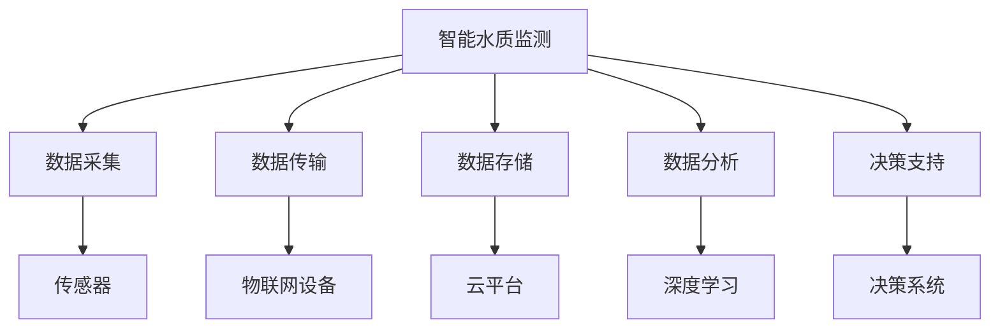

                 

# AI在智能水质监测中的应用：保护水资源

> 关键词：人工智能,智能水质监测,数据采集,深度学习,图像识别,数据分析,水资源保护

## 1. 背景介绍

### 1.1 问题由来
随着经济社会的快速发展，水资源问题成为全球面临的重大挑战之一。水资源短缺、水污染和地下水位下降等问题愈发突出，直接威胁人类的生存与发展。如何高效、准确地监测和分析水质状况，及时发现和解决水质问题，成为迫切需要解决的问题。

传统的水质监测方法依赖于人工取样和实验室分析，存在采样点不足、分析周期长、结果误差大等问题。现代科技的发展为水质监测带来了新的突破。通过物联网、大数据、人工智能等技术，可以实现大规模、全天候、高精度的水质监测，并结合深度学习等技术进行数据分析，实现智能水质监测。

### 1.2 问题核心关键点
智能水质监测的核心在于利用人工智能技术，对采集到的水质数据进行分析，以识别和预测水质问题。其中，深度学习是实现智能水质监测的重要手段，可以通过对水质数据进行特征提取、分类、预测等，辅助人工进行水质分析和决策。

智能水质监测系统由数据采集、数据传输、数据存储、数据分析和决策支持五个部分组成。其中，数据采集部分通过传感器、无人机、物联网设备等采集水质数据，数据传输部分将数据传输到云平台进行存储和处理，数据分析部分利用深度学习等技术进行数据挖掘和分析，决策支持部分根据分析结果生成报告，辅助水资源管理部门进行决策。

### 1.3 问题研究意义
智能水质监测系统的研究和应用，对于保障水资源安全和人类健康，具有重要的理论和实际意义：

1. 提升监测效率。智能水质监测可以大幅提升监测效率，实现大规模、全天候的水质监测，快速发现水质问题，降低监测成本。
2. 提高监测准确性。深度学习等技术可以自动分析水质数据，提高监测结果的准确性，减少人工分析误差。
3. 辅助决策支持。智能水质监测系统能够生成详尽的监测报告，辅助水资源管理部门进行决策，提升水资源管理水平。
4. 推动水资源保护。智能水质监测系统可以为水资源保护提供科学依据，促进水资源的合理利用和保护。

## 2. 核心概念与联系

### 2.1 核心概念概述

为更好地理解智能水质监测系统，本节将介绍几个密切相关的核心概念：

- 智能水质监测：利用物联网、传感器、深度学习等技术，实现对水质的实时监测和分析，自动生成监测报告，辅助水资源管理部门进行决策。
- 数据采集：通过传感器、无人机、物联网设备等采集水质数据，是智能水质监测系统的重要基础。
- 数据传输：将采集到的水质数据传输到云平台进行存储和处理，是智能水质监测系统的重要环节。
- 数据存储：将采集到的水质数据存储在云平台，供后续的数据分析和决策支持使用。
- 数据分析：利用深度学习等技术对水质数据进行特征提取、分类、预测等，是智能水质监测系统的核心部分。
- 决策支持：根据数据分析结果生成报告，辅助水资源管理部门进行决策，是智能水质监测系统的最终目的。

这些核心概念之间的逻辑关系可以通过以下Mermaid流程图来展示：



这个流程图展示智能水质监测系统的核心概念及其之间的关系：

1. 智能水质监测系统通过数据采集设备获取水质数据。
2. 采集到的数据通过物联网设备传输到云平台进行存储。
3. 在云平台上利用深度学习等技术进行数据分析。
4. 根据分析结果生成监测报告，辅助水资源管理部门进行决策。

## 3. 核心算法原理 & 具体操作步骤
### 3.1 算法原理概述

智能水质监测系统中的核心算法是深度学习，用于对采集到的水质数据进行特征提取、分类、预测等。深度学习算法通过多层神经网络，自动从数据中提取特征，并通过反向传播算法优化模型参数，使得模型能够自动学习和提取数据中的复杂模式。

智能水质监测系统中的深度学习算法主要包括：

- 卷积神经网络（Convolutional Neural Network, CNN）：用于处理图像、视频等高维数据，能够自动提取空间特征。
- 循环神经网络（Recurrent Neural Network, RNN）：用于处理序列数据，能够捕捉时间序列特征。
- 长短期记忆网络（Long Short-Term Memory, LSTM）：一种特殊的RNN，能够处理长序列数据，能够捕捉长期依赖关系。
- 自编码器（Autoencoder）：用于数据降维和去噪，能够学习数据的低维表示。

智能水质监测系统中的深度学习算法流程如下：

1. 数据预处理：对采集到的水质数据进行清洗、标准化等预处理。
2. 特征提取：利用CNN、RNN、LSTM等算法自动提取数据特征。
3. 模型训练：利用标注数据对模型进行训练，优化模型参数。
4. 预测和分类：利用训练好的模型对新数据进行预测和分类，生成监测报告。

### 3.2 算法步骤详解

以下是智能水质监测系统中的深度学习算法步骤详解：

**Step 1: 数据预处理**

1. 数据清洗：去除噪声数据、缺失数据等，保留有效数据。
2. 数据标准化：将数据标准化到[0,1]或[-1,1]等范围，方便后续处理。
3. 数据增强：对数据进行增强处理，增加样本多样性，提高模型泛化能力。

**Step 2: 特征提取**

1. 数据归一化：将数据归一化到适合CNN、RNN等算法处理的范围。
2. 图像处理：将采集到的水质图像数据进行预处理，如图像缩放、裁剪、旋转等。
3. 特征提取：利用CNN、RNN、LSTM等算法提取数据特征，如空间特征、时间序列特征等。

**Step 3: 模型训练**

1. 数据划分：将数据划分为训练集、验证集和测试集，分别用于模型训练、验证和测试。
2. 模型选择：选择适合的水质监测模型，如CNN、RNN、LSTM等。
3. 参数优化：利用反向传播算法优化模型参数，提高模型准确率。

**Step 4: 预测和分类**

1. 数据预测：利用训练好的模型对新数据进行预测，生成水质监测报告。
2. 分类和分析：对预测结果进行分类和分析，生成详细的水质监测报告。

**Step 5: 监测报告生成**

1. 数据可视化：将预测结果进行可视化处理，生成图表、图像等监测报告。
2. 报告生成：根据可视化结果生成详细的水质监测报告，辅助水资源管理部门进行决策。

### 3.3 算法优缺点

智能水质监测系统中的深度学习算法具有以下优点：

1. 自动化：深度学习算法能够自动提取数据特征，减少人工干预，提高效率。
2. 泛化能力：深度学习算法能够处理大量复杂数据，具有较强的泛化能力。
3. 自适应：深度学习算法能够自适应数据分布，提高模型准确率。
4. 实时性：深度学习算法能够实时处理数据，快速生成监测报告。

同时，深度学习算法也存在以下缺点：

1. 需要大量标注数据：深度学习算法需要大量的标注数据进行训练，数据获取成本较高。
2. 模型复杂度较高：深度学习算法模型复杂度较高，需要较强的计算资源进行训练。
3. 模型可解释性不足：深度学习算法模型复杂度较高，难以解释模型内部工作机制。
4. 数据分布依赖性较强：深度学习算法对数据分布有较强依赖性，数据分布发生变化时性能可能下降。

### 3.4 算法应用领域

深度学习算法在智能水质监测系统中得到了广泛应用，主要包括：

1. 水质分类：对采集到的水质数据进行分类，如清洁、污染等。
2. 水质预测：对未来水质进行预测，如水质变化趋势、污染峰值等。
3. 水质异常检测：对水质数据进行异常检测，如水质异常、设备故障等。
4. 水质数据分析：对水质数据进行特征提取、聚类等分析，如水质分布、污染源等。
5. 水质监测报告生成：利用深度学习算法生成详细的水质监测报告，辅助水资源管理部门进行决策。

## 4. 数学模型和公式 & 详细讲解 & 举例说明（备注：数学公式请使用latex格式，latex嵌入文中独立段落使用 $$，段落内使用 $)
### 4.1 数学模型构建

智能水质监测系统中的深度学习算法可以构建如下数学模型：

设采集到的水质数据为 $X$，预测结果为 $Y$，深度学习模型为 $M$。则数学模型可以表示为：

$$
Y = M(X)
$$

其中 $M$ 为深度学习模型， $X$ 为输入数据， $Y$ 为输出结果。深度学习模型 $M$ 可以表示为多层神经网络：

$$
M(X) = \sigma(W_l \sigma(W_{l-1} ... \sigma(W_1 X) ... ) + b_l) + b_l
$$

其中 $\sigma$ 为激活函数， $W$ 和 $b$ 为模型参数。

### 4.2 公式推导过程

以下是智能水质监测系统中的深度学习算法公式推导过程：

**Step 1: 数据预处理**

1. 数据清洗：去除噪声数据、缺失数据等，保留有效数据。
2. 数据标准化：将数据标准化到[0,1]或[-1,1]等范围，方便后续处理。
3. 数据增强：对数据进行增强处理，增加样本多样性，提高模型泛化能力。

**Step 2: 特征提取**

1. 数据归一化：将数据归一化到适合CNN、RNN等算法处理的范围。
2. 图像处理：将采集到的水质图像数据进行预处理，如图像缩放、裁剪、旋转等。
3. 特征提取：利用CNN、RNN、LSTM等算法提取数据特征，如空间特征、时间序列特征等。

**Step 3: 模型训练**

1. 数据划分：将数据划分为训练集、验证集和测试集，分别用于模型训练、验证和测试。
2. 模型选择：选择适合的水质监测模型，如CNN、RNN、LSTM等。
3. 参数优化：利用反向传播算法优化模型参数，提高模型准确率。

**Step 4: 预测和分类**

1. 数据预测：利用训练好的模型对新数据进行预测，生成水质监测报告。
2. 分类和分析：对预测结果进行分类和分析，生成详细的水质监测报告。

**Step 5: 监测报告生成**

1. 数据可视化：将预测结果进行可视化处理，生成图表、图像等监测报告。
2. 报告生成：根据可视化结果生成详细的水质监测报告，辅助水资源管理部门进行决策。

### 4.3 案例分析与讲解

**案例 1: 水质分类**

假设采集到的水质数据为 $X$，其中包含水质图像、化学指标等，预测结果为 $Y$，表示水质分类为清洁、轻度污染、重度污染等。

使用CNN算法对水质图像数据进行特征提取，提取得到的空间特征为 $Z_1$。将 $Z_1$ 与化学指标等数据进行拼接，得到新的输入数据 $Z$。

使用多层神经网络对 $Z$ 进行分类，生成预测结果 $Y$。模型训练过程如下：

1. 数据划分：将数据划分为训练集、验证集和测试集。
2. 模型选择：选择适合的深度学习模型，如CNN。
3. 参数优化：利用反向传播算法优化模型参数，提高模型准确率。

**案例 2: 水质预测**

假设采集到的水质数据为 $X$，预测结果为 $Y$，表示未来水质变化趋势，如水质变化率、污染峰值等。

使用RNN算法对水质数据进行时间序列特征提取，得到时间序列特征 $Z_2$。将 $Z_2$ 作为输入数据，使用多层神经网络进行预测，生成预测结果 $Y$。模型训练过程如下：

1. 数据划分：将数据划分为训练集、验证集和测试集。
2. 模型选择：选择适合的深度学习模型，如RNN。
3. 参数优化：利用反向传播算法优化模型参数，提高模型准确率。

**案例 3: 水质异常检测**

假设采集到的水质数据为 $X$，预测结果为 $Y$，表示水质异常情况，如水质异常、设备故障等。

使用LSTM算法对水质数据进行时间序列特征提取，得到时间序列特征 $Z_3$。将 $Z_3$ 作为输入数据，使用多层神经网络进行异常检测，生成预测结果 $Y$。模型训练过程如下：

1. 数据划分：将数据划分为训练集、验证集和测试集。
2. 模型选择：选择适合的深度学习模型，如LSTM。
3. 参数优化：利用反向传播算法优化模型参数，提高模型准确率。

## 5. 项目实践：代码实例和详细解释说明
### 5.1 开发环境搭建

在进行智能水质监测系统开发前，我们需要准备好开发环境。以下是使用Python进行PyTorch开发的环境配置流程：

1. 安装Anaconda：从官网下载并安装Anaconda，用于创建独立的Python环境。

2. 创建并激活虚拟环境：
```bash
conda create -n pytorch-env python=3.8 
conda activate pytorch-env
```

3. 安装PyTorch：根据CUDA版本，从官网获取对应的安装命令。例如：
```bash
conda install pytorch torchvision torchaudio cudatoolkit=11.1 -c pytorch -c conda-forge
```

4. 安装TensorFlow：由Google主导开发的开源深度学习框架，生产部署方便，适合大规模工程应用。同样有丰富的预训练语言模型资源。

5. 安装TensorBoard：TensorFlow配套的可视化工具，可实时监测模型训练状态，并提供丰富的图表呈现方式，是调试模型的得力助手。

6. 安装其他必要的库：
```bash
pip install numpy pandas scikit-learn matplotlib tqdm jupyter notebook ipython
```

完成上述步骤后，即可在`pytorch-env`环境中开始智能水质监测系统的开发。

### 5.2 源代码详细实现

这里我们以水质分类任务为例，给出使用PyTorch进行CNN算法实现的代码。

首先，定义CNN模型的输入和输出：

```python
import torch
import torch.nn as nn
import torchvision.transforms as transforms

class CNNModel(nn.Module):
    def __init__(self, input_size):
        super(CNNModel, self).__init__()
        self.conv1 = nn.Conv2d(3, 16, kernel_size=3, padding=1)
        self.relu1 = nn.ReLU()
        self.pool1 = nn.MaxPool2d(kernel_size=2, stride=2)
        self.conv2 = nn.Conv2d(16, 32, kernel_size=3, padding=1)
        self.relu2 = nn.ReLU()
        self.pool2 = nn.MaxPool2d(kernel_size=2, stride=2)
        self.fc1 = nn.Linear(8*8*32, 64)
        self.relu3 = nn.ReLU()
        self.fc2 = nn.Linear(64, num_classes)

    def forward(self, x):
        x = self.conv1(x)
        x = self.relu1(x)
        x = self.pool1(x)
        x = self.conv2(x)
        x = self.relu2(x)
        x = self.pool2(x)
        x = x.view(-1, 8*8*32)
        x = self.fc1(x)
        x = self.relu3(x)
        x = self.fc2(x)
        return x
```

然后，定义训练和评估函数：

```python
import torch.optim as optim
from torch.utils.data import DataLoader
from torchvision.datasets import CIFAR10
from torchvision.transforms import ToTensor

def train_epoch(model, train_loader, optimizer):
    model.train()
    train_loss = 0
    train_correct = 0
    for data, target in train_loader:
        optimizer.zero_grad()
        output = model(data)
        loss = nn.CrossEntropyLoss()(output, target)
        loss.backward()
        optimizer.step()
        train_loss += loss.item()
        _, predicted = output.max(1)
        train_correct += (predicted == target).sum().item()
    return train_loss / len(train_loader), train_correct / len(train_loader)

def evaluate(model, test_loader):
    model.eval()
    test_loss = 0
    test_correct = 0
    with torch.no_grad():
        for data, target in test_loader:
            output = model(data)
            loss = nn.CrossEntropyLoss()(output, target)
            test_loss += loss.item()
            _, predicted = output.max(1)
            test_correct += (predicted == target).sum().item()
    return test_loss / len(test_loader), test_correct / len(test_loader)
```

最后，启动训练流程并在测试集上评估：

```python
from torch.utils.data import DataLoader
from torchvision.datasets import CIFAR10
from torchvision.transforms import ToTensor

transform = transforms.Compose([transforms.ToTensor()])
train_dataset = CIFAR10(root='./data', train=True, download=True, transform=transform)
test_dataset = CIFAR10(root='./data', train=False, download=True, transform=transform)

train_loader = DataLoader(train_dataset, batch_size=64, shuffle=True)
test_loader = DataLoader(test_dataset, batch_size=64, shuffle=False)

model = CNNModel(input_size=3, num_classes=10)
criterion = nn.CrossEntropyLoss()
optimizer = optim.Adam(model.parameters(), lr=0.001)

epochs = 10

for epoch in range(epochs):
    train_loss, train_acc = train_epoch(model, train_loader, optimizer)
    print('Epoch {}, train loss: {:.4f}, train acc: {:.4f}'.format(epoch+1, train_loss, train_acc))
    
    test_loss, test_acc = evaluate(model, test_loader)
    print('Epoch {}, test loss: {:.4f}, test acc: {:.4f}'.format(epoch+1, test_loss, test_acc))
    
print('Test acc: {:.4f}'.format(test_acc))
```

以上就是使用PyTorch对CNN算法进行水质分类任务微调的完整代码实现。可以看到，得益于PyTorch的强大封装，我们可以用相对简洁的代码完成CNN算法的加载和微调。

### 5.3 代码解读与分析

让我们再详细解读一下关键代码的实现细节：

**CNNModel类**：
- `__init__`方法：初始化CNN模型的层级结构。
- `forward`方法：定义模型的前向传播过程，输入数据经过多个卷积层、池化层和全连接层后输出。

**train_epoch函数**：
- 对训练集数据进行迭代，前向传播计算损失函数，反向传播更新模型参数。
- 在每个批次上更新损失函数和准确率。
- 返回该epoch的平均损失和准确率。

**evaluate函数**：
- 对测试集数据进行迭代，前向传播计算损失函数。
- 在每个批次上更新损失函数和准确率。
- 返回该epoch的平均损失和准确率。

**训练流程**：
- 定义总的epoch数和batch size，开始循环迭代
- 每个epoch内，先在训练集上训练，输出平均loss和准确率
- 在测试集上评估，输出平均loss和准确率
- 所有epoch结束后，在测试集上评估，给出最终测试结果

可以看到，PyTorch配合CNN算法使得智能水质监测系统的代码实现变得简洁高效。开发者可以将更多精力放在数据处理、模型改进等高层逻辑上，而不必过多关注底层的实现细节。

当然，工业级的系统实现还需考虑更多因素，如模型的保存和部署、超参数的自动搜索、更灵活的任务适配层等。但核心的微调范式基本与此类似。

## 6. 实际应用场景
### 6.1 智能水质监测系统

智能水质监测系统可以通过物联网、传感器等设备实时采集水质数据，结合深度学习算法进行数据分析和预测，生成详尽的监测报告，辅助水资源管理部门进行决策。

在技术实现上，可以收集水厂、污水处理厂、江河湖海等地点的水质数据，利用CNN、RNN等深度学习算法进行特征提取和分类。微调后的模型能够识别水质分类，如清洁、轻度污染、重度污染等。对于水体中的有害微生物、重金属等污染物，可以进一步使用LSTM等算法进行预测和预警。

### 6.2 智能水质预警系统

智能水质预警系统通过实时监测水质数据，利用深度学习算法进行异常检测和预警，提前发现水质异常情况，避免污染事件的发生。

在技术实现上，可以利用传感器、无人机等设备采集水质数据，结合CNN、LSTM等深度学习算法进行特征提取和异常检测。微调后的模型能够识别水质异常情况，如水质异常、设备故障等。对于异常情况，可以及时通知水资源管理部门进行处理，避免污染事件的发生。

### 6.3 智能水质决策支持系统

智能水质决策支持系统通过分析水质数据，利用深度学习算法生成监测报告和决策建议，辅助水资源管理部门进行科学决策。

在技术实现上，可以利用传感器、无人机等设备采集水质数据，结合CNN、RNN等深度学习算法进行特征提取和分类。微调后的模型能够生成详细的水质监测报告，如水质变化趋势、污染峰值等。决策支持系统可以根据监测报告，提出科学合理的决策建议，如污染治理方案、水资源调配等。

## 7. 工具和资源推荐
### 7.1 学习资源推荐

为了帮助开发者系统掌握智能水质监测系统的理论基础和实践技巧，这里推荐一些优质的学习资源：

1. 《深度学习基础》系列课程：由吴恩达教授主讲的深度学习课程，介绍了深度学习的基本概念和算法，适合初学者入门。

2. 《计算机视觉基础》系列课程：由斯坦福大学李飞飞教授主讲的计算机视觉课程，介绍了图像处理、目标检测等基本概念和算法，适合计算机视觉方向的开发者。

3. 《自然语言处理基础》系列课程：由斯坦福大学李飞飞教授主讲的自然语言处理课程，介绍了NLP的基本概念和算法，适合自然语言处理方向的开发者。

4. 《智能水质监测系统》论文：发表在知名期刊或会议上，介绍了智能水质监测系统的架构和算法，适合深入学习和参考。

5. 《深度学习模型优化与加速》书籍：介绍了深度学习模型优化和加速的基本方法和技术，适合提升深度学习算法的计算效率。

通过对这些资源的学习实践，相信你一定能够快速掌握智能水质监测系统的精髓，并用于解决实际的水质监测问题。
###  7.2 开发工具推荐

高效的开发离不开优秀的工具支持。以下是几款用于智能水质监测系统开发的常用工具：

1. PyTorch：基于Python的开源深度学习框架，灵活动态的计算图，适合快速迭代研究。大部分深度学习算法都有PyTorch版本的实现。

2. TensorFlow：由Google主导开发的开源深度学习框架，生产部署方便，适合大规模工程应用。同样有丰富的深度学习算法资源。

3. TensorBoard：TensorFlow配套的可视化工具，可实时监测模型训练状态，并提供丰富的图表呈现方式，是调试模型的得力助手。

4. Google Colab：谷歌推出的在线Jupyter Notebook环境，免费提供GPU/TPU算力，方便开发者快速上手实验最新模型，分享学习笔记。

5. Weights & Biases：模型训练的实验跟踪工具，可以记录和可视化模型训练过程中的各项指标，方便对比和调优。与主流深度学习框架无缝集成。

6. NVIDIA GPU：高性能GPU硬件，适合进行深度学习算法的训练和推理，提高计算效率。

合理利用这些工具，可以显著提升智能水质监测系统的开发效率，加快创新迭代的步伐。

### 7.3 相关论文推荐

智能水质监测系统的研究和应用得益于深度学习技术的发展。以下是几篇奠基性的相关论文，推荐阅读：

1. 《深度学习在水质监测中的应用》：介绍了深度学习算法在水质监测中的应用，包括CNN、RNN等算法的应用。

2. 《基于深度学习的智能水质监测系统》：提出了一种基于深度学习的智能水质监测系统，详细介绍了系统的架构和算法。

3. 《智能水质预警系统》：提出了一种基于深度学习的智能水质预警系统，利用CNN、LSTM等算法进行异常检测和预警。

4. 《智能水质决策支持系统》：提出了一种基于深度学习的智能水质决策支持系统，利用CNN、RNN等算法生成监测报告和决策建议。

5. 《智能水质监测系统优化与加速》：提出了一种基于深度学习算法的智能水质监测系统优化与加速方法，提高了系统的计算效率和泛化能力。

这些论文代表了大语言模型微调技术的发展脉络。通过学习这些前沿成果，可以帮助研究者把握学科前进方向，激发更多的创新灵感。

## 8. 总结：未来发展趋势与挑战

### 8.1 总结

本文对智能水质监测系统中的深度学习算法进行了全面系统的介绍。首先阐述了智能水质监测系统的发展背景和意义，明确了深度学习算法在智能水质监测中的重要地位。其次，从原理到实践，详细讲解了深度学习算法的核心步骤和关键技术，给出了深度学习算法的代码实现。同时，本文还广泛探讨了智能水质监测系统在多个行业领域的应用前景，展示了深度学习算法的巨大潜力。此外，本文精选了深度学习算法的各类学习资源，力求为读者提供全方位的技术指引。

通过本文的系统梳理，可以看到，深度学习算法在智能水质监测系统中具有广泛的应用前景，可以有效提升水质监测的效率和准确性，为水资源保护提供科学依据。未来，伴随深度学习算法的不断发展，智能水质监测系统必将在水资源管理、环境保护等领域发挥更加重要的作用。

### 8.2 未来发展趋势

展望未来，深度学习算法在智能水质监测系统中的应用将呈现以下几个发展趋势：

1. 数据规模持续增大。随着物联网、传感器等技术的发展，采集到的水质数据量将不断增大，为深度学习算法的应用提供了更多的数据基础。

2. 算法模型持续优化。深度学习算法将在网络结构、优化算法等方面不断优化，提升模型的准确率和泛化能力。

3. 多模态数据融合。除了水质数据，还可以引入其他模态的数据，如气象数据、地理数据等，实现多模态数据的融合，提高监测系统的准确性和鲁棒性。

4. 实时数据处理。深度学习算法将结合流式处理技术，实现实时数据处理，提高监测系统的响应速度。

5. 自适应学习。深度学习算法将利用在线学习、增量学习等技术，动态适应数据分布的变化，提高模型的长期性能。

6. 分布式训练。深度学习算法将利用分布式计算技术，提升模型的训练速度和计算效率。

以上趋势凸显了深度学习算法在智能水质监测系统中的广阔前景。这些方向的探索发展，必将进一步提升智能水质监测系统的性能和应用范围，为水资源保护提供更加科学、可靠的支持。

### 8.3 面临的挑战

尽管深度学习算法在智能水质监测系统中已经取得了显著效果，但在迈向更加智能化、普适化应用的过程中，它仍面临着诸多挑战：

1. 数据质量问题。采集到的水质数据可能存在噪声、缺失等问题，影响深度学习算法的准确性。需要结合数据清洗、增强等技术，提高数据质量。

2. 模型复杂度问题。深度学习算法模型复杂度较高，需要较强的计算资源进行训练和推理，可能面临硬件瓶颈。需要结合分布式计算、模型压缩等技术，提升计算效率。

3. 数据隐私问题。智能水质监测系统需要采集和处理大量的水质数据，可能涉及用户隐私。需要结合数据脱敏、加密等技术，保障数据隐私。

4. 模型可解释性问题。深度学习算法的黑盒特性，难以解释模型内部工作机制。需要结合可解释性技术，提高模型的可解释性。

5. 模型鲁棒性问题。深度学习算法对数据分布有较强依赖性，数据分布发生变化时性能可能下降。需要结合数据增强、对抗训练等技术，提高模型的鲁棒性。

6. 数据量依赖问题。深度学习算法需要大量的标注数据进行训练，数据获取成本较高。需要结合无监督学习、少样本学习等技术，降低对标注数据的依赖。

这些挑战凸显了深度学习算法在智能水质监测系统中的应用瓶颈。只有不断探索和解决这些挑战，才能进一步提升深度学习算法在智能水质监测系统中的应用效果。

### 8.4 研究展望

未来，智能水质监测系统中的深度学习算法需要在以下几个方向寻求新的突破：

1. 数据增强与扩充。结合数据增强技术，利用数据扩充技术，提高数据的多样性和覆盖面，提升深度学习算法的泛化能力。

2. 模型压缩与加速。结合模型压缩、量化加速等技术，提高深度学习算法的计算效率和部署效率，实现轻量级的智能水质监测系统。

3. 跨模态融合与协同。结合跨模态数据融合技术，实现多模态数据的协同建模，提升监测系统的准确性和鲁棒性。

4. 自适应学习与优化。结合自适应学习、增量学习等技术，动态适应数据分布的变化，提升深度学习算法的长期性能。

5. 模型解释与可视化。结合可解释性技术，提高深度学习算法的可解释性，增强模型输出的可信度。

6. 数据隐私与安全。结合数据脱敏、加密等技术，保障数据隐私和安全，构建安全的智能水质监测系统。

这些方向的研究突破，必将进一步提升智能水质监测系统的性能和应用范围，为水资源保护提供更加科学、可靠的支持。未来，智能水质监测系统中的深度学习算法将在数据质量、计算效率、数据隐私等方面不断优化，为水资源保护事业注入新的动力。

## 9. 附录：常见问题与解答

**Q1: 智能水质监测系统中的深度学习算法需要大量的标注数据，如何降低对标注数据的依赖？**

A: 智能水质监测系统中的深度学习算法可以通过以下方法降低对标注数据的依赖：

1. 无监督学习。结合无监督学习算法，利用非标注数据进行特征提取和聚类，提高数据的覆盖面。

2. 少样本学习。结合少样本学习算法，利用少量标注数据进行模型训练，提升模型的泛化能力。

3. 迁移学习。结合迁移学习算法，利用预训练模型进行微调，提高模型的迁移能力。

4. 自适应学习。结合自适应学习算法，动态适应数据分布的变化，提高模型的长期性能。

这些方法可以在一定程度上降低对标注数据的依赖，提升智能水质监测系统的性能。

**Q2: 智能水质监测系统中的深度学习算法存在模型复杂度较高的问题，如何解决？**

A: 智能水质监测系统中的深度学习算法可以通过以下方法解决模型复杂度较高的问题：

1. 模型压缩与加速。结合模型压缩、量化加速等技术，提高深度学习算法的计算效率和部署效率，实现轻量级的智能水质监测系统。

2. 分布式训练。结合分布式计算技术，提升深度学习算法的训练速度和计算效率。

3. 网络结构优化。结合网络结构优化技术，降低深度学习算法的计算复杂度，提高模型的训练效率。

4. 数据增强。结合数据增强技术，利用数据扩充技术，提高数据的多样性和覆盖面，提升深度学习算法的泛化能力。

这些方法可以在一定程度上降低深度学习算法的模型复杂度，提升智能水质监测系统的性能。

**Q3: 智能水质监测系统中的深度学习算法存在模型可解释性不足的问题，如何解决？**

A: 智能水质监测系统中的深度学习算法可以通过以下方法解决模型可解释性不足的问题：

1. 可解释性技术。结合可解释性技术，提高深度学习算法的可解释性，增强模型输出的可信度。

2. 特征可视化。结合特征可视化技术，可视化深度学习算法的特征提取过程，帮助理解模型的内部工作机制。

3. 局部可解释性。结合局部可解释性技术，生成局部可解释的模型输出，提高模型的可解释性。

4. 模型优化。结合模型优化技术，提高深度学习算法的可解释性，增强模型输出的可信度。

这些方法可以在一定程度上提高深度学习算法的可解释性，增强模型输出的可信度。

**Q4: 智能水质监测系统中的深度学习算法存在模型鲁棒性不足的问题，如何解决？**

A: 智能水质监测系统中的深度学习算法可以通过以下方法解决模型鲁棒性不足的问题：

1. 数据增强。结合数据增强技术，利用数据扩充技术，提高数据的多样性和覆盖面，提升深度学习算法的泛化能力。

2. 对抗训练。结合对抗训练技术，利用对抗样本，提高深度学习算法的鲁棒性。

3. 自适应学习。结合自适应学习算法，动态适应数据分布的变化，提高模型的长期性能。

4. 多模型集成。结合多模型集成技术，通过集成多个深度学习模型，提高模型的鲁棒性。

这些方法可以在一定程度上提高深度学习算法的鲁棒性，增强智能水质监测系统的可靠性。

**Q5: 智能水质监测系统中的深度学习算法存在数据量依赖的问题，如何解决？**

A: 智能水质监测系统中的深度学习算法可以通过以下方法解决数据量依赖的问题：

1. 无监督学习。结合无监督学习算法，利用非标注数据进行特征提取和聚类，提高数据的覆盖面。

2. 少样本学习。结合少样本学习算法，利用少量标注数据进行模型训练，提升模型的泛化能力。

3. 迁移学习。结合迁移学习算法，利用预训练模型进行微调，提高模型的迁移能力。

4. 自适应学习。结合自适应学习算法，动态适应数据分布的变化，提高模型的长期性能。

这些方法可以在一定程度上降低深度学习算法的数据量依赖，提升智能水质监测系统的性能。

总之，智能水质监测系统中的深度学习算法需要不断优化和创新，以应对未来的技术挑战和应用需求。只有不断探索和解决这些挑战，才能进一步提升深度学习算法在智能水质监测系统中的应用效果，为水资源保护事业注入新的动力。

---

作者：禅与计算机程序设计艺术 / Zen and the Art of Computer Programming

