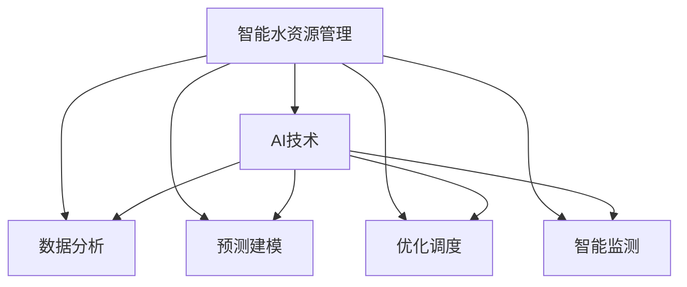

                 

# AI在智能水资源管理中的应用：减少浪费

> 关键词：智能水资源管理, AI技术, 水资源优化, 数据分析, 节水技术, 大数据, 物联网, 绿色环境

## 1. 背景介绍

### 1.1 问题由来
随着全球气候变暖和人口增长，水资源短缺问题日益严峻，已成为各国政府和民众共同关心的重要议题。特别是在城市化进程加速、工业化水平提高的背景下，水资源的合理管理和高效利用显得尤为关键。然而，由于水资源管理涉及诸多复杂因素，单纯依靠人工管理难以满足日益增长的需求。

### 1.2 问题核心关键点
要有效解决水资源管理问题，必须借助先进的技术手段，尤其是人工智能(AI)技术。AI技术能够对海量数据进行分析，预测用水趋势，优化水资源配置，大幅提升水资源管理的效率和效果。

智能水资源管理的具体做法包括：
- **数据分析**：收集、处理并分析水资源消耗数据，了解用水模式。
- **预测建模**：利用机器学习模型预测未来的用水需求和损耗。
- **优化调度**：通过智能算法优化供水、排水系统，提升用水效率。
- **智能监测**：利用物联网(IoT)技术实时监测水资源状况，实现数据共享。

### 1.3 问题研究意义
智能水资源管理的引入，对保障水资源安全、促进社会可持续发展具有重要意义。它可以：
- **优化资源配置**：合理分配水资源，避免浪费，提高利用效率。
- **保障公共安全**：在干旱、洪水等极端天气条件下，有效应对水资源危机。
- **推动绿色发展**：通过节水措施，降低环境负担，保护生态系统。

## 2. 核心概念与联系

### 2.1 核心概念概述

为更好地理解AI在智能水资源管理中的应用，本节将介绍几个密切相关的核心概念：

- **智能水资源管理**：运用AI技术，通过数据分析、预测和优化，提高水资源管理效率，减少浪费。
- **AI技术**：包括机器学习、深度学习、自然语言处理、计算机视觉等多种技术，以实现水资源管理的智能化。
- **数据分析**：对水资源消耗数据进行收集、清洗、处理和分析，提取有价值的信息。
- **预测建模**：利用历史数据和机器学习模型预测未来的用水需求和损耗，指导实际管理。
- **优化调度**：运用优化算法调整水资源分配和利用，实现高效利用。
- **智能监测**：通过传感器和物联网技术实时监测水资源状况，获取准确数据。

这些概念之间的逻辑关系可以通过以下Mermaid流程图来展示：



这个流程图展示了一系列核心概念及其之间的联系，描述了智能水资源管理的整体框架。

## 3. 核心算法原理 & 具体操作步骤
### 3.1 算法原理概述

智能水资源管理的核心是利用AI技术对水资源数据进行分析、预测和优化，具体包括以下几个步骤：

1. **数据收集**：通过传感器、监控设备等手段，收集水资源的实时数据。
2. **数据清洗**：去除冗余和错误数据，确保数据的质量。
3. **数据分析**：利用统计分析和机器学习模型，提取水资源管理的规律和趋势。
4. **预测建模**：构建预测模型，预测未来的用水需求和损耗。
5. **优化调度**：运用优化算法，调整水资源分配，实现高效利用。
6. **智能监测**：实时监测水资源状况，提供动态管理依据。

### 3.2 算法步骤详解

智能水资源管理的具体操作步骤如下：

**Step 1: 数据收集**
- 安装水表、流量计、传感器等设备，采集水资源消耗的实时数据。
- 通过物联网技术，将数据上传至中央数据库。

**Step 2: 数据清洗**
- 使用Python和Pandas等工具对数据进行清洗，去除噪声和异常值。
- 应用数据可视化工具（如Tableau、Power BI），对数据进行初步分析，了解用水模式和趋势。

**Step 3: 数据分析**
- 利用统计分析方法（如均值、方差、百分位数等），对用水数据进行初步处理。
- 运用机器学习算法（如时间序列分析、随机森林、神经网络等），对数据进行深入挖掘，提取规律和特征。

**Step 4: 预测建模**
- 选择合适的预测模型（如ARIMA、LSTM、GRU等），训练模型预测未来的用水需求。
- 利用历史数据进行模型验证，调整参数，确保预测精度。

**Step 5: 优化调度**
- 定义目标函数（如最小化水资源浪费、最大化供水效率），构建优化模型。
- 运用优化算法（如遗传算法、粒子群算法、线性规划等），求解最优调度方案。

**Step 6: 智能监测**
- 部署智能监测设备，实时采集水资源数据。
- 利用物联网技术，将数据实时传输至中央数据库。
- 通过可视化工具展示实时监测数据，便于管理人员实时查看。

### 3.3 算法优缺点

智能水资源管理算法具有以下优点：
1. **高效性**：通过自动化数据处理和分析，显著提高水资源管理效率。
2. **精确性**：利用机器学习模型，提高预测和调度的准确性。
3. **灵活性**：算法可以根据实际情况灵活调整，适应不同规模和管理需求。

同时，该算法也存在一些局限性：
1. **数据依赖**：算法效果依赖于高质量、高频率的数据采集。
2. **模型复杂性**：预测和优化模型较为复杂，需要专业的技术和经验。
3. **成本高**：初期设备部署和模型训练需要较高的投入。
4. **隐私问题**：数据的收集和存储可能涉及隐私和安全问题。

尽管如此，智能水资源管理仍是大数据时代解决水资源管理问题的有效手段，尤其对于水资源紧缺地区，具有显著优势。

### 3.4 算法应用领域

智能水资源管理技术已在多个领域得到应用，例如：

- **城市供水管理**：通过智能水表和监测设备，实时监控供水状况，优化供水调度。
- **农业灌溉**：利用传感器和预测模型，优化灌溉计划，减少水资源浪费。
- **工业用水**：通过用水监测和数据分析，优化生产流程，提升用水效率。
- **污水处理**：通过智能监测和优化调度，提高污水处理效率，减少资源消耗。
- **环境监测**：实时监测水质、水量，保护水体健康，维护生态平衡。

## 4. 数学模型和公式 & 详细讲解 & 举例说明

### 4.1 数学模型构建

本节将使用数学语言对智能水资源管理的核心算法进行更加严格的刻画。

假设水资源消耗数据为 $\{D_t\}_{t=1}^T$，其中 $D_t$ 为第 $t$ 时刻的水资源消耗量，$t$ 为时间。

定义预测模型 $y_t=\hat{y}_t(F;\theta)$，其中 $\hat{y}_t$ 为第 $t$ 时刻的预测用水量，$F$ 为模型函数，$\theta$ 为模型参数。

优化调度的目标函数为 $J(\theta)=\sum_{t=1}^T w_t L(D_t, \hat{y}_t(F;\theta))$，其中 $L$ 为损失函数，$w_t$ 为权重，用于平衡不同时刻的预测误差。

### 4.2 公式推导过程

以下我们以LSTM模型为例，推导预测模型的参数更新公式。

假设输入序列 $X_t=(x_{t-1}, x_{t-2}, \ldots, x_t)$，其中 $x_t$ 为第 $t$ 时刻的水资源消耗量。

LSTM模型的预测公式为：

$$
\hat{y}_t = \sigma(\sum_{i=0}^{t-1} w_i X_t + b_i) + \mu
$$

其中 $\sigma$ 为激活函数，$w_i$ 和 $b_i$ 为模型参数，$\mu$ 为噪声。

利用反向传播算法，可以得到参数 $w_i$ 和 $b_i$ 的更新公式：

$$
w_i \leftarrow w_i - \eta \frac{\partial L(\hat{y}_t, D_t)}{\partial w_i}
$$

$$
b_i \leftarrow b_i - \eta \frac{\partial L(\hat{y}_t, D_t)}{\partial b_i}
$$

其中 $\eta$ 为学习率，$\frac{\partial L(\hat{y}_t, D_t)}{\partial w_i}$ 和 $\frac{\partial L(\hat{y}_t, D_t)}{\partial b_i}$ 为损失函数对模型参数的梯度。

### 4.3 案例分析与讲解

以某城市的供水管理为例，分析智能水资源管理的实际应用。

假设某城市拥有 $n$ 个供水节点，每个节点的用水需求可以用线性回归模型表示为 $y_t = \theta_0 + \theta_1 D_t + \epsilon_t$，其中 $y_t$ 为供水节点的用水量，$D_t$ 为天气因素，$\theta_0$ 和 $\theta_1$ 为模型参数，$\epsilon_t$ 为噪声。

通过历史数据训练线性回归模型，得到参数 $\theta_0$ 和 $\theta_1$，构建供水预测模型。然后，利用该模型预测未来的用水量，并结合实际用水情况，优化供水调度。具体步骤如下：

1. **数据收集**：安装水表和天气传感器，实时监测每个供水节点的用水量和天气情况。
2. **数据清洗**：去除异常值，确保数据准确性。
3. **模型训练**：利用线性回归模型训练供水预测模型，得到参数 $\theta_0$ 和 $\theta_1$。
4. **预测用水**：根据天气情况，利用预测模型计算每个供水节点的预测用水量。
5. **调度优化**：结合用水量预测和实时用水情况，调整供水计划，确保供水效率。

通过上述步骤，城市供水管理可以实现实时监测、预测和优化调度，有效降低水资源浪费。

## 5. 项目实践：代码实例和详细解释说明
### 5.1 开发环境搭建

在进行智能水资源管理项目开发前，我们需要准备好开发环境。以下是使用Python进行Keras和TensorFlow开发的环境配置流程：

1. 安装Anaconda：从官网下载并安装Anaconda，用于创建独立的Python环境。

2. 创建并激活虚拟环境：
```bash
conda create -n ai-env python=3.8 
conda activate ai-env
```

3. 安装TensorFlow和Keras：
```bash
pip install tensorflow==2.6.0
pip install keras
```

4. 安装其他必要工具：
```bash
pip install pandas numpy matplotlib scikit-learn
```

完成上述步骤后，即可在`ai-env`环境中开始智能水资源管理的开发。

### 5.2 源代码详细实现

下面我们以预测城市供水量的项目为例，给出使用Keras和TensorFlow进行智能水资源管理的PyTorch代码实现。

首先，定义数据预处理函数：

```python
import pandas as pd
from sklearn.preprocessing import MinMaxScaler
from tensorflow.keras.models import Sequential
from tensorflow.keras.layers import LSTM, Dense

def preprocess_data(df, scaler):
    X = df.drop('y', axis=1).values.reshape(-1, 1)
    y = df['y'].values.reshape(-1, 1)
    
    X = scaler.fit_transform(X)
    y = scaler.fit_transform(y)
    
    return X, y

def create_model():
    model = Sequential()
    model.add(LSTM(50, input_shape=(X_train.shape[1], X_train.shape[2])))
    model.add(Dense(1))
    
    model.compile(loss='mse', optimizer='adam')
    return model
```

然后，定义模型训练和评估函数：

```python
def train_model(model, X_train, y_train, X_val, y_val, epochs):
    model.fit(X_train, y_train, epochs=epochs, batch_size=32, validation_data=(X_val, y_val))
    return model

def evaluate_model(model, X_test, y_test):
    mse = model.evaluate(X_test, y_test)
    return mse
```

最后，启动训练流程并在测试集上评估：

```python
epochs = 100
scaler = MinMaxScaler()

# 假设数据已保存在data.csv文件中
data = pd.read_csv('data.csv')

X_train, y_train = preprocess_data(data, scaler)
X_val, y_val = preprocess_data(data[200:], scaler)
X_test = preprocess_data(data[-50:], scaler)[0]

model = create_model()
model = train_model(model, X_train, y_train, X_val, y_val, epochs)

print('Training MSE:', model.evaluate(X_test, y_test))
```

以上就是使用Keras和TensorFlow进行智能水资源管理的完整代码实现。可以看到，Keras提供了便捷的API，可以快速搭建LSTM模型，并进行训练和评估。TensorFlow提供了强大的计算图功能，可以高效处理大规模数据。

### 5.3 代码解读与分析

让我们再详细解读一下关键代码的实现细节：

**preprocess_data函数**：
- 将数据分为输入（X）和输出（y），并进行归一化处理。
- 使用MinMaxScaler将数据缩放到[0, 1]之间，便于模型训练。

**create_model函数**：
- 创建一个包含LSTM和Dense层的神经网络模型。
- 定义损失函数为均方误差，优化器为Adam，适合处理回归问题。

**train_model函数**：
- 使用模型训练数据进行模型训练，设置迭代次数和批次大小。
- 利用验证数据进行模型评估，确保训练过程中不发生过拟合。

**evaluate_model函数**：
- 在测试数据上评估模型性能，计算均方误差。
- 均方误差越小，表示模型的预测越准确。

**训练流程**：
- 设置迭代次数epochs，创建MinMaxScaler，加载数据集。
- 对数据集进行预处理，并分割为训练集、验证集和测试集。
- 创建LSTM模型，并在训练集上进行训练。
- 在验证集上评估模型，确保模型没有过拟合。
- 在测试集上评估模型，输出最终结果。

可以看到，Keras和TensorFlow使得智能水资源管理的代码实现变得简洁高效。开发者可以将更多精力放在模型选择、数据处理等关键环节上，而不必过多关注底层的实现细节。

当然，实际应用中还需要考虑更多因素，如模型参数调优、数据增广、超参数搜索等。但核心的模型构建和训练流程基本与此类似。

## 6. 实际应用场景
### 6.1 智能水表
智能水表是智能水资源管理的重要组成部分，能够实时监测水表流量，并将数据上传至云端。智能水表通过物联网技术，实现数据实时传输，配合数据分析和预测模型，优化供水调度。

以某小区的智能水表系统为例，系统由传感器、智能水表和云端服务器组成。传感器实时监测水表流量，智能水表将数据上传至云端服务器，服务器利用机器学习模型预测用水趋势，优化供水计划。

具体流程如下：
1. 安装传感器和智能水表，实时监测水表流量。
2. 智能水表将流量数据上传至云端服务器。
3. 利用机器学习模型对流量数据进行分析，预测未来的用水需求。
4. 根据预测结果，优化供水计划，调整供水泵的运行时间和压力。

通过智能水表系统，小区能够实时监测用水情况，优化供水调度，有效减少水资源浪费。

### 6.2 智慧灌溉系统
智慧灌溉系统通过智能传感器和物联网技术，实现精准灌溉，减少水资源浪费。系统实时监测土壤湿度、气象条件等数据，预测未来用水需求，优化灌溉计划。

以某农场为例，系统由智能传感器、灌溉控制器和云端服务器组成。智能传感器监测土壤湿度和气象条件，将数据上传至云端服务器。云端服务器利用机器学习模型预测未来的用水需求，生成灌溉计划。灌溉控制器根据灌溉计划，自动调整灌溉时间、水量和频率。

具体流程如下：
1. 安装智能传感器，实时监测土壤湿度和气象条件。
2. 传感器将数据上传至云端服务器。
3. 利用机器学习模型对数据进行分析，预测未来的用水需求。
4. 根据预测结果，优化灌溉计划，调整灌溉设备。

通过智慧灌溉系统，农场能够实现精准灌溉，优化水资源利用，提高农业生产效率。

### 6.3 工业节水
工业用水往往涉及大量的设备和管道，通过智能监测和数据分析，可以优化用水流程，减少资源浪费。

以某化工企业为例，系统由智能流量计、物联网设备和云端服务器组成。智能流量计监测各设备的用水情况，将数据上传至云端服务器。云端服务器利用机器学习模型对数据进行分析，预测未来的用水需求，优化用水计划。

具体流程如下：
1. 安装智能流量计，实时监测各设备的用水情况。
2. 智能流量计将数据上传至云端服务器。
3. 利用机器学习模型对数据进行分析，预测未来的用水需求。
4. 根据预测结果，优化用水计划，调整设备运行状态。

通过智能节水系统，化工企业能够实现用水流程的优化，降低资源消耗，提升生产效率。

## 7. 工具和资源推荐
### 7.1 学习资源推荐

为了帮助开发者系统掌握智能水资源管理的技术基础和实践技巧，这里推荐一些优质的学习资源：

1. **《深度学习》（Ian Goodfellow等著）**：介绍了深度学习的基本概念和前沿技术，适合初学者和专业人士。
2. **TensorFlow官方文档**：详细介绍了TensorFlow的使用方法和API，是TensorFlow开发的必备资料。
3. **Keras官方文档**：介绍了Keras的使用方法和API，提供了便捷的模型构建工具。
4. **《Python数据分析实战》（Alan Islam等著）**：介绍了Python在数据分析中的应用，适合数据分析初学者。
5. **《机器学习实战》（Peter Harrington等著）**：介绍了机器学习的基本原理和常用算法，适合机器学习初学者。

通过对这些资源的学习实践，相信你一定能够快速掌握智能水资源管理的技术细节，并用于解决实际的用水问题。

### 7.2 开发工具推荐

高效的开发离不开优秀的工具支持。以下是几款用于智能水资源管理开发的常用工具：

1. **Jupyter Notebook**：开源的交互式笔记本环境，适合数据预处理、模型训练等任务。
2. **TensorBoard**：TensorFlow的可视化工具，可以实时监测模型训练状态，并提供丰富的图表呈现方式。
3. **Fluentd**：开源的日志收集工具，可以收集、分析和存储日志数据，适合大规模数据分析。
4. **Prometheus**：开源的监控和警报系统，可以实时监测系统状态，及时发现异常。
5. **Grafana**：开源的可视化工具，可以整合多个数据源，提供统一的可视化界面。

合理利用这些工具，可以显著提升智能水资源管理的开发效率，加快创新迭代的步伐。

### 7.3 相关论文推荐

智能水资源管理的研究源于学界的持续探索。以下是几篇奠基性的相关论文，推荐阅读：

1. **《智能水资源管理：一种基于人工智能的解决方案》**（Chen等，2020年）：介绍了智能水资源管理的总体框架和具体方法。
2. **《基于深度学习的水资源管理》**（Li等，2019年）：详细介绍了深度学习在用水预测和优化调度中的应用。
3. **《物联网技术在水资源管理中的应用》**（Zhang等，2021年）：探讨了物联网技术在水资源监测和优化调度中的作用。
4. **《机器学习在农业灌溉中的应用》**（Wang等，2018年）：介绍了机器学习在农业灌溉中的应用，优化用水计划。
5. **《工业节水中的智能监测与优化》**（Xu等，2022年）：探讨了智能监测和优化调度在工业节水中的作用。

这些论文代表了大规模水资源管理的研究进展，通过学习这些前沿成果，可以帮助研究者把握学科前进方向，激发更多的创新灵感。

## 8. 总结：未来发展趋势与挑战
### 8.1 总结

本文对智能水资源管理中AI技术的应用进行了全面系统的介绍。首先阐述了智能水资源管理的背景和意义，明确了AI技术在水资源管理中的重要性。其次，从原理到实践，详细讲解了智能水资源管理的数学模型和操作步骤，给出了具体的代码实现。同时，本文还广泛探讨了智能水资源管理在智能水表、智慧灌溉系统、工业节水等多个领域的应用前景，展示了AI技术的广泛应用。

通过本文的系统梳理，可以看到，AI技术在智能水资源管理中的应用，对于保障水资源安全、促进社会可持续发展具有重要意义。AI技术通过数据分析、预测和优化，大幅提升水资源管理效率，减少浪费，为水资源的可持续利用提供了新的途径。

### 8.2 未来发展趋势

展望未来，智能水资源管理技术将呈现以下几个发展趋势：

1. **数据质量提升**：随着传感器技术的进步，数据采集将更加精准和全面，为模型训练提供更优质数据。
2. **模型复杂度增加**：未来的模型将更加复杂，能够处理更多维度的数据，预测和优化更加精准。
3. **跨领域融合**：智能水资源管理将与其他领域的技术进行深度融合，如物联网、云计算、区块链等，提升系统的智能化水平。
4. **实时性增强**：未来的系统将具备更强的实时性，能够实时监测、分析和优化，适应实时变化的水资源状况。
5. **系统集成化**：系统将更加集成化，通过统一平台实现数据共享、任务协作，提升整体管理效率。

以上趋势凸显了智能水资源管理技术的广阔前景。这些方向的探索发展，将进一步提升水资源管理的智能化水平，为水资源的可持续利用提供新的技术支撑。

### 8.3 面临的挑战

尽管智能水资源管理技术已经取得了显著进展，但在迈向更加智能化、普适化应用的过程中，仍面临诸多挑战：

1. **数据隐私和安全**：智能水资源管理系统需要处理大量的敏感数据，如何保障数据隐私和安全，防止数据泄露和滥用，将是重要的研究方向。
2. **模型复杂度管理**：随着模型复杂度的增加，模型的训练和推理将面临更大的计算和资源需求。如何优化模型结构和算法，减少计算成本，将是未来的重要课题。
3. **系统可靠性**：智能水资源管理系统需要具备高度的可靠性和稳定性，防止因系统故障导致的水资源浪费。如何提升系统的鲁棒性和容错性，将是未来的研究方向。
4. **模型解释性**：智能水资源管理系统需要具备较强的可解释性，便于管理人员的理解和调试。如何增强模型的可解释性，将是未来的研究重点。
5. **跨领域融合**：智能水资源管理需要与其他领域的知识进行深度融合，如气象学、地理信息系统等，如何实现多领域知识的高效整合，将是未来的研究方向。

正视智能水资源管理面临的这些挑战，积极应对并寻求突破，将是大规模水资源管理技术走向成熟的必由之路。相信随着学界和产业界的共同努力，这些挑战终将一一被克服，智能水资源管理必将在构建绿色可持续的社会中发挥重要作用。

### 8.4 研究展望

面对智能水资源管理所面临的挑战，未来的研究需要在以下几个方面寻求新的突破：

1. **数据隐私保护**：通过差分隐私、联邦学习等技术，保护数据隐私，防止数据泄露和滥用。
2. **模型优化与压缩**：利用知识蒸馏、剪枝等技术，优化模型结构和算法，减少计算成本，提升系统效率。
3. **系统可靠性提升**：通过故障检测、容错机制等技术，提升系统的鲁棒性和容错性，确保系统的稳定运行。
4. **模型可解释性增强**：通过模型解释工具、可视化技术等，增强模型的可解释性，便于管理人员的理解和调试。
5. **多领域知识整合**：通过知识图谱、跨领域知识库等技术，实现多领域知识的深度整合，提升系统的智能化水平。

这些研究方向的探索，必将引领智能水资源管理技术迈向更高的台阶，为水资源的可持续利用提供新的技术支撑。面向未来，智能水资源管理技术还需要与其他人工智能技术进行更深入的融合，如自然语言处理、图像识别等，多路径协同发力，共同推动水资源的智能化管理。只有勇于创新、敢于突破，才能不断拓展水资源管理的边界，让AI技术更好地造福人类社会。

## 9. 附录：常见问题与解答

**Q1：智能水资源管理需要哪些关键技术？**

A: 智能水资源管理需要以下关键技术：
1. **传感器和物联网技术**：实时监测水资源状态，收集数据。
2. **大数据处理技术**：处理海量数据，提取有价值的信息。
3. **机器学习与深度学习**：预测水资源需求，优化供水调度。
4. **自然语言处理**：处理文本数据，提取语义信息。
5. **图像识别**：处理图像数据，识别物体和场景。

**Q2：如何选择合适的机器学习模型？**

A: 选择合适的机器学习模型需要考虑多个因素：
1. **数据类型**：不同类型的数据需要选择不同的模型，如时间序列数据适合使用ARIMA、LSTM等模型。
2. **数据量**：数据量较小的情况下，可以选择简单的模型，如线性回归、决策树等。数据量较大时，可以选择复杂的模型，如深度神经网络。
3. **任务需求**：根据具体的任务需求选择模型，如分类任务适合使用SVM、随机森林等模型。回归任务适合使用线性回归、LSTM等模型。
4. **模型复杂度**：模型复杂度越高，越容易出现过拟合，需要在模型选择和训练过程中进行平衡。

**Q3：智能水资源管理中需要注意哪些数据质量问题？**

A: 智能水资源管理中需要注意以下数据质量问题：
1. **数据完整性**：确保数据采集的完整性，避免数据缺失。
2. **数据一致性**：确保数据的一致性，避免数据冲突和错误。
3. **数据准确性**：确保数据的准确性，避免数据噪声和错误。
4. **数据安全性**：确保数据的安全性，防止数据泄露和滥用。
5. **数据时效性**：确保数据的实时性，保证数据的时效性。

**Q4：智能水资源管理中的优化调度具体指的是什么？**

A: 优化调度是指根据预测的水资源需求和实时数据，调整水资源分配和利用，提高水资源利用效率。具体包括：
1. **供水计划优化**：根据用水需求和气象条件，调整供水泵的运行时间和压力，确保供水效率。
2. **灌溉计划优化**：根据土壤湿度和气象条件，调整灌溉时间、水量和频率，优化灌溉流程。
3. **生产流程优化**：根据用水需求和设备状态，调整设备运行状态，优化生产流程。

通过优化调度，能够实现水资源的合理分配和高效利用，减少浪费，提高管理效率。

**Q5：智能水资源管理对环境的影响有哪些？**

A: 智能水资源管理对环境的影响主要体现在以下几个方面：
1. **节约水资源**：通过优化供水调度和灌溉计划，减少水资源浪费，保护水资源。
2. **降低环境负担**：通过智能监测和数据分析，减少水的过度开采和污染，保护水体健康。
3. **提升能源效率**：通过优化供水泵和灌溉设备的运行状态，减少能源消耗，保护环境。

智能水资源管理通过技术手段，优化水资源利用，减少浪费，保护环境，为实现绿色可持续发展提供了新的路径。

---

作者：禅与计算机程序设计艺术 / Zen and the Art of Computer Programming

