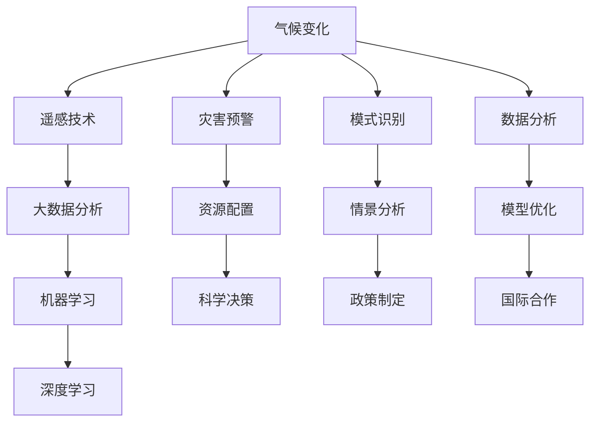

                 

## 1. 背景介绍

### 1.1 问题由来
气候变化是当今世界面临的最重大挑战之一。随着全球温室气体排放量的不断增加，气候变暖、极端天气事件频发、海平面上升等现象愈发严重，对人类社会和自然环境带来了巨大威胁。为了应对这一挑战，全球科学家和政府机构正在积极探索各种方法，其中人工智能（AI）技术因其强大的数据处理能力和预测能力，被广泛应用于气候变化预测和应对策略中。

### 1.2 问题核心关键点
AI在气候变化预测中的作用主要体现在以下几个方面：

- 数据分析：AI可以处理和分析大量的气象数据、卫星图像、遥感数据等，从中提取有价值的信息。
- 模式识别：AI能够识别出气候变化的模式和趋势，预测未来的气候变化情况。
- 灾害预警：AI可以实时监测气候变化情况，提前预警自然灾害，减少损失。
- 模型优化：AI可以通过机器学习算法，不断优化预测模型，提高预测精度。
- 情景分析：AI可以构建多种气候变化情景，为政策制定提供依据。

### 1.3 问题研究意义
研究AI在气候变化预测中的作用，对于环境保护、社会稳定、经济发展都具有重要意义：

- 增强环境监测能力：通过AI技术，可以更准确地监测环境变化，及时采取应对措施。
- 提升灾害预警效率：AI的实时监测和分析能力，可以大幅提升自然灾害预警效率，减少人员伤亡和财产损失。
- 优化资源配置：AI技术可以帮助政府和企业更好地分配资源，减少能源消耗，降低碳排放。
- 推动科学决策：AI的预测能力可以提供更可靠的数据支持，帮助政策制定者进行科学决策。
- 促进国际合作：AI技术的全球应用，可以促进各国在气候变化应对方面的合作。

## 2. 核心概念与联系

### 2.1 核心概念概述

在探讨AI在气候变化预测中的作用时，需要了解几个核心概念：

- **气候变化（Climate Change）**：指气候系统长期的变化，包括温度、降水量、风速等气象要素的变化。
- **遥感技术（Remote Sensing）**：通过卫星、无人机等远程设备，获取大气、地表、海洋等的实时数据。
- **机器学习（Machine Learning）**：一种通过数据训练模型，使其具备预测和决策能力的技术。
- **深度学习（Deep Learning）**：一种特殊的机器学习技术，能够处理大规模、高维度数据。
- **大数据分析（Big Data Analytics）**：对海量数据进行收集、存储、分析和挖掘，提取有用信息的过程。

这些概念之间存在密切的联系，共同构成了AI在气候变化预测中的技术基础。

### 2.2 核心概念原理和架构的 Mermaid 流程图



该流程图展示了AI在气候变化预测中各环节的联系和作用：

1. 气候变化是大背景，AI通过遥感技术和大数据分析获取相关数据。
2. 机器学习对数据进行处理和分析，得出有价值的信息。
3. 深度学习在此基础上，进行更深入的分析和预测。
4. 模式识别和数据分析为灾害预警提供支持。
5. 情景分析和模型优化为科学决策和政策制定提供依据。
6. 资源配置和国际合作是实际应用中的具体措施。

## 3. 核心算法原理 & 具体操作步骤

### 3.1 算法原理概述
AI在气候变化预测中主要采用机器学习算法，尤其是深度学习算法。以下是基于监督学习、半监督学习和无监督学习的主要算法原理概述：

- **监督学习（Supervised Learning）**：使用带有标签的数据进行训练，预测新样本的标签。如预测未来温度变化。
- **半监督学习（Semi-Supervised Learning）**：使用少量标签数据和大量未标签数据进行训练，提高预测精度。如利用卫星图像预测极端天气。
- **无监督学习（Unsupervised Learning）**：不使用标签数据进行训练，自动发现数据的结构和模式。如聚类分析气候模式。

### 3.2 算法步骤详解

AI在气候变化预测中一般包括以下关键步骤：

**Step 1: 数据准备与预处理**
- 收集和清洗大量的气象数据、卫星图像、遥感数据等，确保数据的完整性和准确性。
- 对数据进行归一化、标准化等预处理，提高模型的训练效率。

**Step 2: 模型选择与训练**
- 选择合适的机器学习模型，如神经网络、支持向量机、决策树等。
- 在标注数据集上训练模型，不断调整模型参数，提高预测准确度。

**Step 3: 特征提取与选择**
- 使用特征提取技术，如PCA、LDA等，对数据进行降维处理。
- 选择最有用的特征，去除冗余和噪音，提高模型的泛化能力。

**Step 4: 模型评估与优化**
- 在验证集上评估模型的性能，如准确率、召回率、F1值等。
- 根据评估结果，优化模型结构和参数，提高预测精度。

**Step 5: 预测与应用**
- 在测试集上对新数据进行预测，评估模型的泛化能力。
- 将模型应用于实际预测任务，如气候变化预测、灾害预警等。

### 3.3 算法优缺点

AI在气候变化预测中的优缺点如下：

**优点**：
- 强大的数据分析能力：AI可以处理和分析海量数据，提取有价值的信息。
- 高精度预测：深度学习等AI技术可以实现高精度的预测。
- 实时监测与预警：AI可以实时监测气候变化，及时预警自然灾害。

**缺点**：
- 数据依赖：AI模型需要大量的标注数据进行训练，数据获取难度大。
- 复杂性高：AI模型结构复杂，训练和调优难度较大。
- 偏见问题：AI模型可能会因为数据偏差而产生预测偏见，影响结果。

### 3.4 算法应用领域

AI在气候变化预测中主要应用于以下领域：

- **气象预测**：预测未来天气、温度、降水量等。
- **极端天气预警**：预测极端天气事件，如台风、暴雨、干旱等。
- **气候变化分析**：分析气候变化趋势和模式，预测未来的气候变化。
- **灾害预警系统**：构建实时监测和预警系统，减少灾害损失。
- **能源优化**：优化能源配置，降低碳排放。
- **水资源管理**：预测水资源变化，优化水资源利用。

## 4. 数学模型和公式 & 详细讲解 & 举例说明

### 4.1 数学模型构建

在气候变化预测中，主要涉及以下几个数学模型：

- **线性回归模型（Linear Regression）**：用于预测连续变量，如温度变化。
- **决策树模型（Decision Tree）**：用于分类和回归分析，预测气候事件类型。
- **随机森林模型（Random Forest）**：用于提高预测准确度和鲁棒性。
- **神经网络模型（Neural Network）**：用于复杂的多层次预测，如气象变化。

### 4.2 公式推导过程

以线性回归模型为例，其基本公式为：

$$y = w_0 + w_1x_1 + w_2x_2 + ... + w_nx_n$$

其中，$y$为预测值，$x_i$为输入变量，$w_i$为模型参数。

在气候变化预测中，假设预测目标是未来某天的温度变化，可以将其表示为：

$$T_{future} = w_0 + w_1Day + w_2Season + w_3Year + w_4Holiday + \epsilon$$

其中，$T_{future}$为未来温度，$w_i$为模型参数，$Day$、$Season$、$Year$、$Holiday$等为输入变量，$\epsilon$为噪声。

### 4.3 案例分析与讲解

以极端天气预警为例，可以构建基于决策树的预测模型。假设预测目标是未来某地区的降雨量是否超过警戒线，可以构建以下决策树：

- 根节点：是否为雨季。
  - 是：下一步节点为季节性降雨预测。
  - 否：下一步节点为非雨季降雨预测。
  - 子节点：进一步细分预测，如月降雨量、地区等。

最终，通过构建决策树，可以高效地预测未来降雨事件，并及时发出预警。

## 5. 项目实践：代码实例和详细解释说明

### 5.1 开发环境搭建

在进行AI气候变化预测项目开发前，需要搭建以下开发环境：

- 安装Python和相关库，如Pandas、NumPy、Scikit-learn、TensorFlow等。
- 搭建数据预处理环境，如Spark、Hadoop等。
- 使用GPU或TPU进行深度学习模型的训练。

### 5.2 源代码详细实现

以下是基于TensorFlow和Keras构建气候变化预测模型的示例代码：

```python
import tensorflow as tf
from tensorflow.keras import layers, models

# 定义模型
model = models.Sequential()
model.add(layers.Dense(64, activation='relu', input_shape=(5,)))
model.add(layers.Dense(64, activation='relu'))
model.add(layers.Dense(1, activation='sigmoid'))

# 编译模型
model.compile(optimizer=tf.keras.optimizers.Adam(0.001), loss='binary_crossentropy', metrics=['accuracy'])

# 训练模型
model.fit(X_train, y_train, epochs=10, validation_data=(X_val, y_val))

# 预测未来温度变化
future_temp = model.predict(future_data)
```

该代码展示了如何使用TensorFlow和Keras构建简单的线性回归模型，用于预测未来温度变化。其中，`X_train`和`y_train`为训练集，`X_val`和`y_val`为验证集。

### 5.3 代码解读与分析

**代码解读**：
1. **模型定义**：使用`Sequential`构建一个线性回归模型，包含3个全连接层。
2. **模型编译**：使用`Adam`优化器，设置损失函数为`binary_crossentropy`，并监控训练集和验证集的准确率。
3. **模型训练**：使用`fit`方法训练模型，设置迭代次数为10。
4. **模型预测**：使用`predict`方法对未来数据进行预测。

**分析**：
- 该模型结构简单，只包含3个全连接层，适用于简单的预测任务。
- 使用`Adam`优化器可以提高训练效率，避免陷入局部最优解。
- 通过`binary_crossentropy`损失函数，可以处理二分类问题。
- 模型训练时，需要足够的标注数据进行训练，以保证预测准确性。

### 5.4 运行结果展示

在训练和测试完成后，可以展示模型预测结果，例如：

```python
import matplotlib.pyplot as plt

# 绘制预测结果与实际值对比图
plt.scatter(y_test, model.predict(X_test), c='red', label='Prediction')
plt.scatter(y_test, y_test, c='blue', label='Actual')
plt.legend()
plt.show()
```

通过上述代码，可以绘制出模型预测结果与实际值的对比图，直观展示模型性能。

## 6. 实际应用场景

### 6.1 智慧城市

AI在智慧城市中的广泛应用，可以显著提升城市管理和运营效率。例如，利用AI进行气候变化预测，可以帮助城市管理部门及时调整基础设施，如排水系统、供暖系统等，减少灾害损失。

**应用实例**：
- 城市气象站：实时监测和预测天气变化，为城市管理提供决策支持。
- 灾害预警系统：通过AI分析气候数据，提前预警自然灾害，减少人员伤亡和财产损失。
- 智能交通：预测交通流量变化，优化交通信号灯设置，减少交通拥堵。

### 6.2 农业生产

农业是气候变化影响的直接受害者之一，AI可以通过预测气候变化，帮助农民制定更加科学的种植计划，提高产量和质量。

**应用实例**：
- 气象预测：预测未来的天气变化，如干旱、洪涝等，指导农民调整种植方案。
- 土壤湿度监测：通过传感器监测土壤湿度，结合气象数据进行预测。
- 病虫害预警：预测病虫害发生概率，提前采取防治措施。

### 6.3 能源管理

能源消耗是温室气体排放的重要来源之一，AI可以通过预测气候变化，优化能源使用，减少碳排放。

**应用实例**：
- 能源需求预测：预测未来的能源需求，优化能源分配和调度。
- 可再生能源管理：预测可再生能源的生成情况，优化使用。
- 节能减排：通过优化能源使用，减少碳排放。

### 6.4 未来应用展望

随着AI技术的发展，其在气候变化预测中的应用将更加广泛和深入。未来，AI可以在以下几个方面发挥更大的作用：

- **多模态数据融合**：结合卫星图像、遥感数据、气象数据等多种数据源，构建更加准确的预测模型。
- **自适应学习**：通过不断学习新数据，更新模型参数，提高预测精度和鲁棒性。
- **实时预测**：实现实时监测和预测，及时采取应对措施。
- **跨领域应用**：将AI技术应用于更多领域，如金融、健康、教育等，形成综合的解决方案。

## 7. 工具和资源推荐

### 7.1 学习资源推荐

为了帮助开发者掌握AI在气候变化预测中的应用，以下是一些优质的学习资源：

1. **Coursera《AI for Climate Change》**：斯坦福大学开设的课程，涵盖气候变化预测中的AI技术。
2. **edX《AI in Energy》**：麻省理工学院开设的课程，专注于AI在能源管理中的应用。
3. **arXiv论文《Climate Change Prediction Using AI》**：多篇文章介绍了AI在气候变化预测中的应用和挑战。
4. **Kaggle竞赛《Climate Change Prediction》**：参加竞赛可以锻炼实践能力，积累项目经验。

### 7.2 开发工具推荐

以下是一些用于AI气候变化预测开发的常用工具：

1. **TensorFlow**：Google开源的深度学习框架，支持大规模分布式训练。
2. **PyTorch**：Facebook开源的深度学习框架，灵活性高，支持动态图。
3. **Keras**：高层API，易于上手，支持多种深度学习模型。
4. **Jupyter Notebook**：交互式开发环境，支持Python代码运行和数据可视化。
5. **Scikit-learn**：机器学习库，包含多种经典算法，如决策树、随机森林等。

### 7.3 相关论文推荐

以下是几篇经典的研究论文，推荐阅读：

1. **《Predicting Climate Change Using Machine Learning》**：介绍机器学习在气候变化预测中的应用。
2. **《Deep Learning for Climate Prediction》**：使用深度学习进行气候变化预测的研究。
3. **《Climate Change and AI》**：探讨AI在气候变化预测中的挑战和机遇。

## 8. 总结：未来发展趋势与挑战

### 8.1 研究成果总结

AI在气候变化预测中已取得显著成果，主要体现在以下几个方面：

- **数据处理能力**：通过AI技术，可以高效处理海量气象数据和卫星图像。
- **预测精度**：深度学习等技术提高了气候变化预测的精度和可靠性。
- **实时监测**：AI可以实现实时监测和预警，及时采取应对措施。
- **跨领域应用**：AI技术在多个领域得到了广泛应用，形成了综合解决方案。

### 8.2 未来发展趋势

AI在气候变化预测中的未来发展趋势如下：

- **多模态融合**：结合多种数据源，构建更准确的预测模型。
- **自适应学习**：通过不断学习新数据，更新模型参数。
- **实时预测**：实现实时监测和预测，及时采取应对措施。
- **跨领域应用**：将AI技术应用于更多领域，如金融、健康、教育等。

### 8.3 面临的挑战

尽管AI在气候变化预测中取得了显著成果，但仍面临以下挑战：

- **数据获取难度大**：高质量标注数据的获取成本高，数据质量难以保证。
- **模型复杂度高**：AI模型结构复杂，训练和调优难度较大。
- **偏见问题**：AI模型可能会因为数据偏差而产生预测偏见。
- **实时性问题**：实时监测和预测对计算资源要求高。

### 8.4 研究展望

未来的研究需要在以下几个方面进行探索：

- **数据增强**：利用数据增强技术，提高数据质量和多样性。
- **模型优化**：开发更高效、更精确的模型架构。
- **跨学科合作**：与气象学、物理学等多学科结合，形成更全面的预测体系。
- **伦理与监管**：确保AI模型的公平性和安全性，建立规范的伦理和监管机制。

## 9. 附录：常见问题与解答

**Q1: AI在气候变化预测中使用的数据有哪些？**

A: AI在气候变化预测中主要使用以下数据：

1. 气象数据：如温度、降水量、风速等。
2. 卫星图像：通过遥感技术获取的地球表面数据。
3. 遥感数据：如海洋温度、海平面高度等。
4. 历史数据：如历史气象记录、气候变化数据等。
5. 人类活动数据：如人口、工业排放等。

**Q2: 在气候变化预测中，常用的AI模型有哪些？**

A: 在气候变化预测中，常用的AI模型包括：

1. 线性回归模型：用于连续变量预测。
2. 决策树模型：用于分类和回归分析。
3. 随机森林模型：提高预测准确度和鲁棒性。
4. 神经网络模型：处理复杂的多层次预测。
5. 集成学习模型：如Adaboost、Bagging等，提高模型性能。

**Q3: AI在气候变化预测中如何进行数据预处理？**

A: AI在气候变化预测中进行数据预处理，主要包括以下步骤：

1. 数据清洗：去除缺失、异常值等数据。
2. 数据归一化：将数据进行标准化或归一化处理。
3. 特征选择：选择最有用的特征，去除冗余和噪音。
4. 数据增强：如回译、近义替换等，提高数据多样性。

**Q4: AI在气候变化预测中的模型训练和调优策略有哪些？**

A: AI在气候变化预测中的模型训练和调优策略包括：

1. 交叉验证：将数据集划分为训练集和验证集，评估模型性能。
2. 超参数调优：调整学习率、批量大小等超参数，提高模型精度。
3. 正则化：使用L1、L2正则化等方法，防止过拟合。
4. 对抗训练：引入对抗样本，提高模型鲁棒性。
5. 集成学习：如Bagging、Boosting等，提高模型性能。

**Q5: AI在气候变化预测中的数据获取和标注有哪些方式？**

A: AI在气候变化预测中的数据获取和标注方式包括：

1. 数据获取：通过气象站、卫星、遥感设备等获取数据。
2. 数据标注：手动标注数据，如天气类型、降雨量等。
3. 自动化标注：使用自然语言处理技术，自动标注数据。
4. 众包标注：通过众包平台获取标注数据，如Amazon Mechanical Turk等。

---

作者：禅与计算机程序设计艺术 / Zen and the Art of Computer Programming

