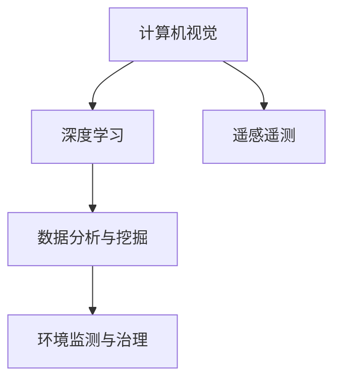

                 

## 1. 背景介绍

### 1.1 问题由来
海洋是地球上最重要的生态系统之一，其健康的维持对全球气候、生物多样性和人类社会福祉至关重要。然而，随着工业化和城市化进程的加快，海洋污染问题日益严重。海洋中的塑料微粒、重金属、氮磷营养盐等污染物不仅威胁海洋生物的生存，还通过食物链影响人类的健康。

传统的海洋污染监测主要依赖于人工采样和实验室分析，耗时长、成本高、覆盖面窄，难以应对海洋污染问题的复杂性和实时性需求。近年来，人工智能技术的发展，特别是计算机视觉和大数据分析技术的突破，为海洋污染监测提供了新的解决方案。通过应用AI技术，可以实时、大规模地监测海洋环境，及时发现和预警污染事件，为环境保护和治理提供科学依据。

### 1.2 问题核心关键点
海洋污染监测的核心问题在于如何利用AI技术，高效、准确地获取和分析海洋环境数据，以实现对污染物的实时监测和预警。具体而言，需要：
- 自动化数据采集：利用无人机、卫星、传感器等设备，实时采集海洋环境数据。
- 数据处理与分析：通过深度学习算法，从采集到的数据中提取海洋污染相关的特征和模式。
- 结果解读与决策：将AI分析结果转化为可操作的行动方案，如污染预警、应急响应等。

## 2. 核心概念与联系

### 2.1 核心概念概述

为更好地理解AI在海洋污染监测中的应用，本节将介绍几个关键概念：

- 计算机视觉(Computer Vision)：通过分析数字图像、视频等视觉数据，识别和理解场景中的对象、动作和事件。在海洋污染监测中，可以用于识别污染物、监测水质变化等。
- 深度学习(Deep Learning)：一种基于神经网络的机器学习方法，通过多层次的特征提取和表示学习，实现复杂模式识别和预测。
- 遥感遥测(Remote Sensing and Telemetry)：通过无人机、卫星等遥感平台，采集海洋环境数据，用于监测和预警。
- 数据分析与挖掘(Data Analysis and Mining)：利用数据科学方法，从大量数据中提取有用信息和模式，支持决策制定。
- 环境监测与治理(Environmental Monitoring and Management)：通过实时监测海洋环境数据，为环境保护和治理提供决策支持。

这些核心概念之间的逻辑关系可以通过以下Mermaid流程图来展示：



这个流程图展示了计算机视觉、深度学习、遥感遥测、数据分析与挖掘和环境监测与治理之间的关系：

1. 计算机视觉和遥感遥测技术用于获取海洋环境数据。
2. 深度学习算法从采集的数据中提取特征和模式，实现对海洋污染物的识别和分类。
3. 数据分析与挖掘方法，从深度学习的结果中进一步挖掘有价值的信息，支持环境监测和治理。
4. 环境监测与治理系统，根据AI分析结果，制定相应的环境保护和治理措施。

## 3. 核心算法原理 & 具体操作步骤
### 3.1 算法原理概述

AI在海洋污染监测中的应用，主要基于计算机视觉和深度学习技术。其核心思想是：通过自动化采集海洋环境数据，利用深度学习算法，从大量图像和视频数据中提取海洋污染相关的特征，从而实现对污染物的自动识别和分类。

形式化地，假设有一组海洋污染监测数据 $D=\{(x_i, y_i)\}_{i=1}^N$，其中 $x_i$ 为采集到的图像或视频帧，$y_i$ 为对应的标签（如污染物类型）。深度学习算法 $f$ 的目标是：

$$
\hat{y}=f(x_i)
$$

其中 $\hat{y}$ 为模型对输入 $x_i$ 的预测标签，$f$ 为训练好的深度学习模型。模型的训练目标是最小化预测误差，即：

$$
\min_{f}\sum_{i=1}^N \ell(\hat{y}, y_i)
$$

其中 $\ell$ 为损失函数，用于衡量预测标签 $\hat{y}$ 和真实标签 $y_i$ 之间的差异。常用的损失函数包括交叉熵损失、均方误差损失等。

### 3.2 算法步骤详解

基于计算机视觉和深度学习的海洋污染监测主要包括以下几个关键步骤：

**Step 1: 数据采集与预处理**
- 使用无人机、卫星等遥感设备，采集海洋环境图像和视频数据。
- 对采集到的数据进行预处理，包括去噪、归一化、裁剪、增强等，以保证数据质量。

**Step 2: 模型选择与训练**
- 选择合适的深度学习模型，如卷积神经网络(CNN)、循环神经网络(RNN)等，用于特征提取和分类。
- 使用标注数据训练模型，调整模型参数，使其在给定的损失函数下最小化预测误差。

**Step 3: 特征提取与分类**
- 将预处理后的数据输入训练好的深度学习模型，提取海洋污染相关的特征。
- 利用提取的特征，进行分类和识别，确定污染物类型、浓度等。

**Step 4: 结果解读与决策**
- 根据分类结果，结合领域知识，进行污染预警和决策制定。
- 实时监测数据变化，进行动态调整，确保系统持续高效运行。

### 3.3 算法优缺点

AI在海洋污染监测中，具有以下优点：
- 自动化数据采集：无人机、卫星等设备可以实时、大规模地采集海洋环境数据，覆盖面广，效率高。
- 精度高：深度学习算法通过多层次的特征提取和表示学习，可以实现高精度的分类和识别。
- 实时性强：模型训练后，可以实时处理新的数据，实现对海洋污染事件的快速预警。
- 可扩展性好：支持多种传感器和遥感平台，可以灵活部署到不同环境和场景。

同时，AI技术在海洋污染监测中也存在一些局限：
- 数据依赖：深度学习模型需要大量标注数据进行训练，而高质量的标注数据获取成本较高。
- 鲁棒性问题：在复杂多变的海洋环境中，模型的泛化性能可能受到影响，准确度下降。
- 解释性不足：深度学习模型往往难以解释其内部工作机制，用户对模型的信任度较低。
- 实时计算资源需求高：深度学习模型的计算复杂度较高，需要高性能计算资源支持。

尽管存在这些局限，但AI技术在海洋污染监测中的应用，已显示出巨大的潜力。未来相关研究的重点在于如何进一步降低数据标注成本，提高模型的鲁棒性和可解释性，同时兼顾实时计算资源的需求。

### 3.4 算法应用领域

AI在海洋污染监测中的应用领域非常广泛，主要包括以下几个方面：

- 水质监测：通过深度学习算法，识别水体中的污染物和变化趋势，监测水质状况。
- 污染物种类识别：识别海洋中的塑料微粒、重金属、氮磷营养盐等污染物，并进行分类和定量分析。
- 生态系统评估：分析海洋生态系统中的生物多样性、栖息地变化等因素，评估生态系统健康状况。
- 应急响应：实时监测海洋环境数据，及时预警污染事件，制定应急响应措施。
- 科学研究和政策制定：提供数据支持和分析工具，支持海洋污染科学研究和技术政策制定。

## 4. 数学模型和公式 & 详细讲解 & 举例说明

### 4.1 数学模型构建

本节将使用数学语言对AI在海洋污染监测中的应用进行更加严格的刻画。

假设采集到的海洋环境数据为 $x_i \in \mathbb{R}^{H \times W \times C}$，其中 $H$ 为图像高度，$W$ 为宽度，$C$ 为通道数。设 $y_i$ 为污染物标签，通过卷积神经网络提取图像特征，构建分类器进行预测。

深度学习模型 $f$ 包含卷积层、池化层、全连接层等。假设 $f$ 的输出为 $z_i \in \mathbb{R}^k$，其中 $k$ 为分类维度。通过softmax函数将 $z_i$ 转换为概率分布，用于预测污染物标签。分类器 $g$ 的目标是最大化预测准确度，即：

$$
\max_{g} \mathbb{E}_{x_i}\left[\log g(f(x_i))\right]
$$

其中 $\mathbb{E}_{x_i}$ 表示对数据 $x_i$ 的期望。模型的训练目标是最小化交叉熵损失，即：

$$
\min_{f, g} \mathcal{L}(f, g) = -\frac{1}{N}\sum_{i=1}^N \ell(\hat{y}, y_i)
$$

其中 $\ell$ 为交叉熵损失函数，用于衡量模型预测标签 $\hat{y}$ 和真实标签 $y_i$ 之间的差异。

### 4.2 公式推导过程

以卷积神经网络(CNN)为例，推导分类器的损失函数及其梯度计算公式。

假设CNN包含多个卷积层和池化层，输出为 $z_i \in \mathbb{R}^k$。则分类器 $g$ 的输出为：

$$
g(z_i) = \frac{e^{z_{i,j}}}{\sum_{j=1}^K e^{z_{i,j}}}
$$

其中 $z_{i,j}$ 为第 $i$ 个样本、第 $j$ 个类别的分类得分。

分类器 $g$ 的目标是最大化预测准确度，即：

$$
\max_{g} \mathbb{E}_{x_i}\left[\log g(f(x_i))\right]
$$

将其转化为交叉熵损失函数：

$$
\mathcal{L}(f, g) = -\frac{1}{N}\sum_{i=1}^N \sum_{j=1}^K y_{i,j} \log g(z_i)
$$

其中 $y_{i,j}$ 为第 $i$ 个样本、第 $j$ 个类别的真实标签。

利用反向传播算法，计算模型参数的梯度：

$$
\frac{\partial \mathcal{L}}{\partial \theta} = \frac{1}{N}\sum_{i=1}^N \sum_{j=1}^K \left(g(z_i) - y_i\right) \frac{\partial g(z_i)}{\partial z_i} \frac{\partial z_i}{\partial \theta}
$$

其中 $\frac{\partial g(z_i)}{\partial z_i}$ 为softmax函数的导数，$\frac{\partial z_i}{\partial \theta}$ 为卷积神经网络的参数梯度。

### 4.3 案例分析与讲解

以水质监测为例，介绍如何使用AI技术实现海洋污染事件的实时预警。

假设监测区域内的水质变化数据 $D=\{(x_i, y_i)\}_{i=1}^N$，其中 $x_i$ 为水体化学成分数据，$y_i$ 为水质等级标签。通过深度学习算法，提取水质变化特征，构建分类器进行水质等级预测。

具体步骤包括：
1. 数据采集：使用传感器采集水体化学成分数据 $x_i$。
2. 数据预处理：对采集数据进行归一化、去噪等预处理。
3. 模型训练：使用标注数据 $(x_i, y_i)$ 训练深度学习模型 $f$。
4. 特征提取：将预处理后的数据 $x_i$ 输入模型 $f$，提取水质变化特征。
5. 分类预测：利用提取的特征，进行分类和识别，确定水质等级 $\hat{y}_i$。
6. 预警与决策：根据预测结果，实时预警水质异常，制定应急响应措施。

## 5. 项目实践：代码实例和详细解释说明
### 5.1 开发环境搭建

在进行海洋污染监测系统开发前，我们需要准备好开发环境。以下是使用Python进行TensorFlow开发的环境配置流程：

1. 安装Anaconda：从官网下载并安装Anaconda，用于创建独立的Python环境。

2. 创建并激活虚拟环境：
```bash
conda create -n tf-env python=3.8 
conda activate tf-env
```

3. 安装TensorFlow：根据CUDA版本，从官网获取对应的安装命令。例如：
```bash
conda install tensorflow==2.7 -c tf -c conda-forge
```

4. 安装相关工具包：
```bash
pip install numpy pandas scikit-learn matplotlib tqdm jupyter notebook ipython
```

完成上述步骤后，即可在`tf-env`环境中开始开发实践。

### 5.2 源代码详细实现

下面我们以水质监测任务为例，给出使用TensorFlow进行深度学习模型训练的PyTorch代码实现。

首先，定义水质监测任务的标注数据集：

```python
import numpy as np
import pandas as pd
from sklearn.model_selection import train_test_split

# 读取标注数据
train_df = pd.read_csv('train.csv', sep=',')
test_df = pd.read_csv('test.csv', sep=',')

# 数据预处理
train_X = train_df.drop('label', axis=1).values
train_y = train_df['label'].values
test_X = test_df.drop('label', axis=1).values
test_y = test_df['label'].values

# 数据分割
train_X, val_X, train_y, val_y = train_test_split(train_X, train_y, test_size=0.2, random_state=42)
```

然后，定义深度学习模型：

```python
from tensorflow.keras.models import Sequential
from tensorflow.keras.layers import Dense, Conv2D, MaxPooling2D, Flatten

# 定义卷积神经网络模型
model = Sequential([
    Conv2D(32, (3, 3), activation='relu', input_shape=(H, W, C)),
    MaxPooling2D((2, 2)),
    Conv2D(64, (3, 3), activation='relu'),
    MaxPooling2D((2, 2)),
    Conv2D(128, (3, 3), activation='relu'),
    MaxPooling2D((2, 2)),
    Flatten(),
    Dense(128, activation='relu'),
    Dense(K, activation='softmax')
])

# 编译模型
model.compile(optimizer='adam', loss='categorical_crossentropy', metrics=['accuracy'])
```

接着，定义训练和评估函数：

```python
from tensorflow.keras.callbacks import EarlyStopping

def train_model(model, train_X, train_y, val_X, val_y, epochs=10, batch_size=32):
    # 设置EarlyStopping回调函数
    early_stop = EarlyStopping(monitor='val_loss', patience=3)

    # 训练模型
    history = model.fit(train_X, train_y, epochs=epochs, batch_size=batch_size, validation_data=(val_X, val_y), callbacks=[early_stop])

    # 评估模型
    test_loss, test_acc = model.evaluate(test_X, test_y)
    print(f'Test loss: {test_loss:.4f}, Test accuracy: {test_acc:.4f}')

    return history

# 训练模型
history = train_model(model, train_X, train_y, val_X, val_y)
```

最后，进行模型训练和评估：

```python
# 模型训练
train_model(model, train_X, train_y, val_X, val_y)

# 模型评估
print(f'Test loss: {model.evaluate(test_X, test_y)[0]:.4f}, Test accuracy: {model.evaluate(test_X, test_y)[1]:.4f}')
```

以上就是使用TensorFlow进行水质监测任务深度学习模型训练的完整代码实现。可以看到，TensorFlow的高级API使得模型构建和训练变得简洁高效。

### 5.3 代码解读与分析

让我们再详细解读一下关键代码的实现细节：

**训练和评估函数**：
- `EarlyStopping`回调函数：用于在验证集损失不再下降时停止训练，避免过拟合。
- `history`变量：用于记录模型训练过程中的各项指标，如损失和准确率，供后续分析使用。

**模型训练**：
- `model.fit`方法：对模型进行训练，设置训练轮数、批大小等参数，并在每个epoch结束时计算验证集损失和准确率。
- `callbacks=[early_stop]`：将EarlyStopping回调函数传递给`fit`方法，以便在验证集损失不再下降时停止训练。

**模型评估**：
- `model.evaluate`方法：对模型进行评估，计算测试集损失和准确率。
- `test_loss, test_acc`：分别输出测试集损失和准确率。

## 6. 实际应用场景
### 6.1 智能监测系统

基于深度学习的海洋污染监测系统，可以实现对海洋环境数据的实时采集和分析。通过在海岸线、海洋平台上部署传感器和摄像头，系统可以实时采集水质、气温、潮汐、海流等环境数据，以及污染物浓度等指标。利用深度学习算法，对采集到的数据进行分析和处理，自动识别和分类污染物，实现对海洋污染事件的实时预警和应急响应。

例如，在某个海域，系统可以监测到塑料微粒的浓度突然增加。系统会实时将此信息上传到监测中心，监测中心结合历史数据和领域知识，快速判断污染源和扩散趋势，并及时通知相关部门采取应急措施。

### 6.2 科学研究与政策制定

海洋污染监测数据可以用于科学研究和技术政策制定。通过深度学习算法，对大规模的海洋环境数据进行分析和挖掘，可以揭示海洋污染的趋势和规律，为环境保护和治理提供数据支持和决策依据。

例如，通过分析历史水质监测数据，可以发现某些海域的污染事件具有季节性变化特征，需要针对性地采取季节性治理措施。同时，通过分析污染物扩散路径，可以优化海洋保护区和捕捞区域的布局，减少对海洋生态系统的破坏。

### 6.3 公众教育和科普宣传

海洋污染监测数据还可以用于公众教育和科普宣传。通过可视化工具，将监测结果展示给公众，可以增强公众对海洋环境保护的意识和参与度。

例如，在科普活动中，可以展示某海域在特定时间段的污染物浓度变化图，解释污染物来源和影响，呼吁公众减少使用一次性塑料制品，参与环保行动。

## 7. 工具和资源推荐
### 7.1 学习资源推荐

为了帮助开发者系统掌握AI在海洋污染监测中的应用，这里推荐一些优质的学习资源：

1. 《计算机视觉：基本概念和技术》系列博文：由计算机视觉专家撰写，深入浅出地介绍了计算机视觉原理、深度学习算法等基础概念和技术。

2. 《深度学习在海洋监测中的应用》课程：由某知名大学开设的深度学习课程，涵盖深度学习在海洋监测中的实际应用案例。

3. 《AI与环境监测》书籍：全面介绍了AI在环境监测中的各种应用场景，包括水质监测、空气质量监测、自然灾害预警等。

4. 《深度学习在海洋科学研究中的应用》论文：总结了深度学习在海洋科学研究中的应用，涵盖海洋生态系统评估、污染物分布预测等方面。

5. 《机器学习在海洋环境保护中的应用》书籍：详细介绍了机器学习在海洋环境保护中的各类应用，包括水质监测、污染物种类识别等。

通过对这些资源的学习实践，相信你一定能够快速掌握AI在海洋污染监测中的应用，并用于解决实际的海洋环境问题。
### 7.2 开发工具推荐

高效的开发离不开优秀的工具支持。以下是几款用于AI在海洋污染监测系统中开发常用的工具：

1. TensorFlow：由Google主导开发的深度学习框架，生产部署方便，适合大规模工程应用。

2. PyTorch：基于Python的开源深度学习框架，灵活动态的计算图，适合快速迭代研究。

3. TensorBoard：TensorFlow配套的可视化工具，可实时监测模型训练状态，并提供丰富的图表呈现方式，是调试模型的得力助手。

4. Weights & Biases：模型训练的实验跟踪工具，可以记录和可视化模型训练过程中的各项指标，方便对比和调优。

5. Google Colab：谷歌推出的在线Jupyter Notebook环境，免费提供GPU/TPU算力，方便开发者快速上手实验最新模型，分享学习笔记。

合理利用这些工具，可以显著提升AI在海洋污染监测系统的开发效率，加快创新迭代的步伐。

### 7.3 相关论文推荐

AI在海洋污染监测中的应用源于学界的持续研究。以下是几篇奠基性的相关论文，推荐阅读：

1. ImageNet Classification with Deep Convolutional Neural Networks：提出卷积神经网络在图像分类任务中的卓越表现，为深度学习在海洋监测中的应用奠定了基础。

2. Deep Water Quality Monitoring Using Transfer Learning and Image Processing：提出基于深度学习的水质监测系统，并应用迁移学习技术，提升模型在特定水质监测任务上的性能。

3. Deep Learning for Marine Pollution Detection and Classification：总结了深度学习在海洋污染物检测和分类中的应用，展示了AI技术的强大潜力。

4. Real-time Marine Pollution Monitoring Using CNNs and Deep Learning：提出基于卷积神经网络的实时海洋污染监测系统，实现了对海洋污染物的高效检测和分类。

5. Deep Learning for Automated Detection of Marine Pollutants：利用深度学习算法，实现对海洋污染物的自动检测和分类，提高了监测系统的效率和准确性。

这些论文代表了大语言模型微调技术的发展脉络。通过学习这些前沿成果，可以帮助研究者把握学科前进方向，激发更多的创新灵感。

## 8. 总结：未来发展趋势与挑战

### 8.1 总结

本文对AI在海洋污染监测中的应用进行了全面系统的介绍。首先阐述了海洋污染监测的核心问题，明确了AI技术在此领域的重要价值。其次，从原理到实践，详细讲解了基于深度学习的海洋污染监测方法，给出了模型训练的完整代码实例。同时，本文还广泛探讨了AI技术在海洋污染监测中的应用场景，展示了其巨大的潜力。

通过本文的系统梳理，可以看到，AI技术在海洋污染监测中的应用前景广阔，能够实现对海洋环境的实时监测和预警，为环境保护和治理提供科学依据。未来，伴随深度学习技术的持续演进，AI技术必将在海洋污染监测领域发挥更加重要的作用。

### 8.2 未来发展趋势

展望未来，AI在海洋污染监测中的应用将呈现以下几个发展趋势：

1. 模型规模持续增大。随着算力成本的下降和数据规模的扩张，深度学习模型的参数量还将持续增长。超大规模模型蕴含的丰富海洋知识，有望支撑更加复杂多变的监测任务。

2. 实时性进一步提高。未来AI系统将能够实时处理海洋环境数据，实现对污染事件的实时预警和应急响应。

3. 数据来源多样化。除了传感器和摄像头，未来AI系统将能够综合利用多种数据源，如卫星遥感、无人机数据等，提升监测精度和覆盖范围。

4. 多模态数据融合。未来的AI系统将能够处理多种模态数据，如文本、图像、视频等，实现多模态信息的协同监测和分析。

5. 持续学习与适应。未来的AI系统将能够持续学习新数据，适应数据分布的变化，提升模型的泛化能力和适应性。

6. 人机协同与智能决策。未来的AI系统将与人类专家协同工作，辅助人类进行决策制定，提高监测系统的智能水平。

以上趋势凸显了AI在海洋污染监测领域的前景。这些方向的探索发展，必将进一步提升监测系统的性能和应用范围，为海洋环境保护和治理提供更有力的技术支持。

### 8.3 面临的挑战

尽管AI在海洋污染监测中已经取得了显著成就，但在迈向更加智能化、普适化应用的过程中，它仍面临诸多挑战：

1. 数据获取与标注成本高。高质量的海洋环境数据获取成本较高，大规模标注数据获取成本更是居高不下。如何降低数据成本，利用非结构化数据进行监测，将是未来的重要研究方向。

2. 模型鲁棒性不足。在复杂多变的海洋环境中，模型的泛化性能可能受到影响，准确度下降。如何提高模型的鲁棒性和适应性，减少过拟合，是未来的挑战之一。

3. 实时计算资源需求高。深度学习模型的计算复杂度较高，需要高性能计算资源支持。如何在有限的计算资源下，实现高效、准确的监测，是未来的研究方向。

4. 模型可解释性不足。深度学习模型往往难以解释其内部工作机制，用户对模型的信任度较低。如何增强模型的可解释性，提高用户对系统的信任度，将是重要的研究方向。

5. 系统安全与隐私保护。海洋环境监测涉及大量敏感数据，系统安全与隐私保护至关重要。如何设计安全、可靠的监测系统，保护数据安全，是未来的重要研究方向。

6. 持续更新与优化。海洋环境变化多端，监测系统需要持续更新和优化，以应对新出现的污染事件。如何设计高效的监测系统更新机制，提高系统适应性和稳定性，是未来的重要研究方向。

正视这些挑战，积极应对并寻求突破，将是大语言模型微调技术走向成熟的必由之路。相信随着学界和产业界的共同努力，这些挑战终将一一被克服，AI技术必将在海洋污染监测领域发挥更大的作用。

### 8.4 未来突破

面对AI在海洋污染监测中面临的挑战，未来的研究需要在以下几个方面寻求新的突破：

1. 探索无监督和半监督学习范式。摆脱对大规模标注数据的依赖，利用自监督学习、主动学习等无监督和半监督范式，最大限度利用非结构化数据，实现更加灵活高效的监测。

2. 研究参数高效和计算高效的监测方法。开发更加参数高效的监测方法，在固定大部分模型参数的情况下，只更新极少量的任务相关参数。同时优化模型的计算图，减少前向传播和反向传播的资源消耗，实现更加轻量级、实时性的部署。

3. 融合因果推断与强化学习范式。引入因果推断和强化学习思想，增强监测系统建立稳定因果关系的能力，学习更加普适、鲁棒的环境表示，从而提升模型的泛化能力和适应性。

4. 引入更多先验知识。将符号化的先验知识，如知识图谱、逻辑规则等，与神经网络模型进行巧妙融合，引导监测过程学习更准确、合理的海洋模型。同时加强多模态数据的整合，实现视觉、声音等多模态信息与文本信息的协同监测。

5. 结合因果分析和博弈论工具。将因果分析方法引入监测系统，识别出系统决策的关键特征，增强输出解释的因果性和逻辑性。借助博弈论工具刻画人机交互过程，主动探索并规避系统的脆弱点，提高系统稳定性。

6. 纳入伦理道德约束。在监测目标中引入伦理导向的评估指标，过滤和惩罚有害的输出倾向。同时加强人工干预和审核，建立监测行为的监管机制，确保输出符合人类价值观和伦理道德。

这些研究方向的探索，必将引领AI在海洋污染监测技术迈向更高的台阶，为海洋环境保护和治理提供更有力的技术支持。面向未来，AI技术还需要与其他环境监测技术进行更深入的融合，如遥感技术、化学分析技术等，多路径协同发力，共同推动海洋环境保护事业的发展。

## 9. 附录：常见问题与解答

**Q1：AI在海洋污染监测中如何实现实时性？**

A: 实现AI在海洋污染监测中的实时性，主要依赖于以下几个方面：

1. 高性能计算平台：使用高性能计算平台如GPU、TPU，加速模型推理速度。

2. 高效数据处理：采用高效的数据处理技术，如数据压缩、数据并行等，减少数据传输和处理的时间。

3. 模型优化：优化模型的计算图，减少冗余计算，提高模型效率。

4. 多任务并发：实现多任务并发处理，提升系统整体处理能力。

5. 边缘计算：将部分计算任务下沉到边缘设备，实现本地处理和分析，减少数据传输和延迟。

通过这些技术手段，AI系统可以实时处理海洋环境数据，实现对污染事件的快速预警和应急响应。

**Q2：AI在海洋污染监测中如何降低数据获取和标注成本？**

A: 降低AI在海洋污染监测中的数据获取和标注成本，主要可以通过以下几个方面：

1. 多源数据融合：综合利用多种数据源，如卫星遥感、无人机数据等，提升数据覆盖范围和精度。

2. 数据增强与合成：通过数据增强技术，利用已有数据生成新数据，扩充训练集。

3. 迁移学习与微调：利用已有模型的预训练权重，通过微调或迁移学习，实现快速适应新任务。

4. 无监督学习与自监督学习：利用无监督学习或自监督学习技术，从非结构化数据中提取有用的特征，减少对标注数据的依赖。

5. 众包标注与自动标注：利用众包标注或自动标注技术，降低标注成本。

通过这些方法，AI系统可以在保证监测质量的同时，降低数据获取和标注成本，实现更广泛的监测应用。

**Q3：AI在海洋污染监测中如何提高模型的鲁棒性和适应性？**

A: 提高AI在海洋污染监测中的模型鲁棒性和适应性，主要可以通过以下几个方面：

1. 数据增强与多样性：增加数据的多样性和覆盖范围，提高模型对各种环境变化的适应能力。

2. 多模态数据融合：综合利用视觉、声音、化学等多种模态数据，提高模型的综合处理能力。

3. 持续学习与在线更新：实时更新模型，适应数据分布的变化，提高模型的持续学习能力和适应性。

4. 模型融合与集成：采用模型融合与集成技术，如Bagging、Boosting等，提高模型的鲁棒性和泛化能力。

5. 鲁棒性优化与泛化学习：通过鲁棒性优化和泛化学习技术，提高模型对噪声、异常数据的鲁棒性和泛化能力。

通过这些方法，AI系统可以显著提高在海洋污染监测中的模型鲁棒性和适应性，提升监测系统的准确度和可靠性。

**Q4：AI在海洋污染监测中如何增强模型的可解释性？**

A: 增强AI在海洋污染监测中的模型可解释性，主要可以通过以下几个方面：

1. 可视化与解释工具：利用可视化工具，展示模型决策过程和特征重要性，帮助用户理解模型的输出。

2. 可解释模型：使用可解释模型，如决策树、线性回归等，提高模型的透明度和可解释性。

3. 因果推断与因果解释：利用因果推断技术，解释模型输出与输入之间的关系，提高模型的解释能力。

4. 用户反馈与迭代优化：通过用户反馈，不断优化模型，提高模型的解释性和可理解性。

5. 知识图谱与规则库：将领域知识与模型结合，增强模型的解释性和可理解性。

通过这些方法，AI系统可以显著增强在海洋污染监测中的模型可解释性，提高用户对系统的信任度。

**Q5：AI在海洋污染监测中如何设计高效的系统更新机制？**

A: 设计AI在海洋污染监测中高效的系统更新机制，主要可以通过以下几个方面：

1. 在线学习与持续更新：利用在线学习技术，实时更新模型，适应数据分布的变化。

2. 增量式训练与更新：采用增量式训练与更新技术，减少训练时间和成本，提高系统的实时性。

3. 数据驱动与反馈机制：通过数据驱动和反馈机制，实时调整模型参数，优化模型性能。

4. 自动化与智能化：采用自动化和智能化技术，实现模型的自动更新与优化。

5. 多模态与多源数据融合：综合利用多模态和多源数据，提高模型的适应性和泛化能力。

通过这些方法，AI系统可以实现高效的系统更新机制，提升模型的实时性和适应性。

---

作者：禅与计算机程序设计艺术 / Zen and the Art of Computer Programming

