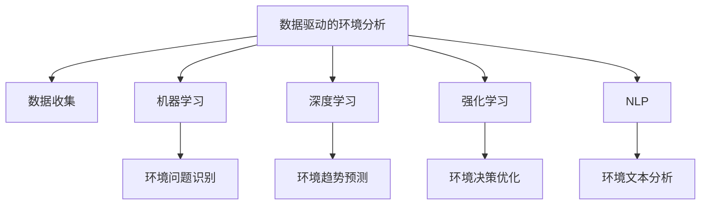

                 

# AI在环境保护中的应用前景

在当今这个环境危机日益严峻的时代，人工智能（AI）技术的应用为环境保护提供了新的可能性。本文将深入探讨AI在环境保护中的应用前景，包括核心概念、算法原理、具体操作步骤、数学模型和公式的详细讲解、项目实践的代码实例、实际应用场景、工具和资源推荐、总结与未来展望以及附录内容。

## 1. 背景介绍

### 1.1 问题由来

随着全球气候变化和环境污染问题的加剧，环境保护成为当今社会的重要议题。AI技术，以其强大的数据处理和分析能力，为环境保护提供了新的解决方案。AI可以处理海量环境数据，识别模式，预测趋势，提供决策支持，从而助力环境保护事业的发展。

### 1.2 问题核心关键点

AI在环境保护中的应用主要包括两个方面：数据驱动的环境分析和基于AI的环保决策支持系统。具体来说，数据驱动的环境分析涉及数据收集、预处理和分析，以识别环境问题。基于AI的环保决策支持系统则利用数据分析结果，提供决策建议和自动化执行方案。

## 2. 核心概念与联系

### 2.1 核心概念概述

为更好地理解AI在环境保护中的应用，本节将介绍几个密切相关的核心概念：

- 数据驱动的环境分析：利用传感器、遥感技术、无人机等手段收集环境数据，并通过AI模型进行数据处理和分析，识别环境问题。
- 基于AI的环保决策支持系统：将AI技术应用于环境保护决策过程中，提供智能分析和建议，优化资源配置和管理。
- 机器学习（ML）：通过训练模型，让计算机从数据中学习规律，并应用于环境分析。
- 深度学习（DL）：利用神经网络，通过多层次的特征提取和抽象，提高环境分析的准确性和效率。
- 强化学习（RL）：通过奖励机制，训练模型做出最优的环境保护决策。
- 自然语言处理（NLP）：用于分析环境相关的文本数据，如新闻报道、社交媒体帖子等。

这些核心概念之间的逻辑关系可以通过以下Mermaid流程图来展示：



这个流程图展示了大语言模型的核心概念及其之间的关系：

1. 数据驱动的环境分析通过多种手段收集环境数据。
2. 机器学习、深度学习和强化学习用于数据分析和决策优化。
3. NLP用于文本数据处理和分析。
4. 环境问题识别、趋势预测和决策优化是数据驱动分析的结果。

这些概念共同构成了AI在环境保护中的应用框架，使得AI能够从数据中提取环境问题的信息，并据此提供决策支持。

## 3. 核心算法原理 & 具体操作步骤

### 3.1 算法原理概述

AI在环境保护中的应用主要依赖于机器学习、深度学习和强化学习等算法原理。这些算法通过学习环境数据中的规律和模式，为环境问题提供解决方案。

以深度学习为例，其核心思想是通过神经网络模型，将环境数据映射到高维空间，并通过训练学习到数据中的复杂非线性关系。在环境分析中，深度学习模型通常用于图像识别、文本分析和趋势预测等方面。

### 3.2 算法步骤详解

AI在环境保护中的应用步骤通常包括以下几个关键步骤：

**Step 1: 数据收集与预处理**
- 收集环境数据，包括空气质量、水质、土壤、噪声等指标。
- 对数据进行清洗、归一化和标准化处理，确保数据质量。

**Step 2: 模型选择与训练**
- 根据环境问题选择合适的机器学习、深度学习或强化学习模型。
- 使用历史数据对模型进行训练，调整模型参数以优化预测结果。

**Step 3: 环境问题识别**
- 利用训练好的模型对实时数据进行预测和分析，识别环境问题。
- 根据预测结果，生成警报或建议，帮助环境保护人员及时响应。

**Step 4: 趋势预测与决策支持**
- 通过时间序列分析等方法，对环境数据进行趋势预测。
- 利用强化学习算法，生成最优的环境保护决策方案。
- 将决策方案应用于实际，如调整污染物排放、优化能源配置等。

### 3.3 算法优缺点

AI在环境保护中的应用具有以下优点：

- 高效的数据处理能力：能够处理海量环境数据，快速识别环境问题。
- 高度的准确性和可靠性：通过深度学习和强化学习，提供高质量的环境预测和决策支持。
- 自动化和智能化：提供自动化的环境监测和决策，减轻人工负担。

同时，该方法也存在一定的局限性：

- 数据依赖性：AI模型需要大量的标注数据进行训练，而环境数据往往难以获得。
- 模型复杂性：深度学习模型的训练和调整需要大量计算资源。
- 可解释性不足：AI模型通常缺乏可解释性，难以理解其决策过程。
- 伦理和隐私问题：环境数据的收集和使用涉及隐私保护和伦理问题。

尽管存在这些局限性，但就目前而言，AI在环境保护中的应用前景依然广阔，具有巨大的应用潜力。

### 3.4 算法应用领域

AI在环境保护中的应用领域广泛，包括但不限于：

- 空气质量监测：利用传感器和无人机监测空气质量，及时发现和应对污染事件。
- 水质监测：通过遥感和卫星数据，监测水质变化，识别污染源。
- 土壤污染识别：利用遥感数据和地面监测数据，识别土壤污染情况。
- 噪声污染监测：利用麦克风和传感器，监测噪声污染，优化城市规划。
- 生态系统保护：利用AI模型预测生态系统变化，优化资源配置和管理。

这些应用领域展示了AI在环境保护中的广泛应用，为环境问题的解决提供了新的方法和手段。

## 4. 数学模型和公式 & 详细讲解  
### 4.1 数学模型构建

AI在环境保护中的应用通常基于数据驱动的模型构建。以空气质量预测为例，数学模型可以表示为：

$$
y = f(x; \theta)
$$

其中 $y$ 为预测的空气质量指数（AQI），$x$ 为环境数据（如温度、湿度、风速等），$\theta$ 为模型参数。常用的数学模型包括线性回归、支持向量机、随机森林和神经网络等。

### 4.2 公式推导过程

以神经网络模型为例，其训练过程可以表示为：

$$
\theta^{(t+1)} = \theta^{(t)} - \eta \nabla_{\theta}L(y, f(x; \theta))
$$

其中 $\eta$ 为学习率，$L(y, f(x; \theta))$ 为损失函数，$\nabla_{\theta}L(y, f(x; \theta))$ 为损失函数的梯度。训练过程中，通过不断调整模型参数 $\theta$，最小化损失函数 $L(y, f(x; \theta))$，从而提高模型的预测精度。

### 4.3 案例分析与讲解

以水质监测为例，其数学模型可以表示为：

$$
y = f(x; \theta)
$$

其中 $y$ 为水质参数（如氨氮、总磷、溶解氧等），$x$ 为环境数据（如温度、流速、pH值等），$\theta$ 为模型参数。通过训练模型，可以预测水质变化趋势，识别污染源。

## 5. 项目实践：代码实例和详细解释说明

### 5.1 开发环境搭建

在进行环境数据分析和预测时，首先需要搭建开发环境。以下是使用Python进行PyTorch开发的环境配置流程：

1. 安装Anaconda：从官网下载并安装Anaconda，用于创建独立的Python环境。

2. 创建并激活虚拟环境：
```bash
conda create -n env_name python=3.8 
conda activate env_name
```

3. 安装PyTorch：根据CUDA版本，从官网获取对应的安装命令。例如：
```bash
conda install pytorch torchvision torchaudio cudatoolkit=11.1 -c pytorch -c conda-forge
```

4. 安装TensorFlow：从官网下载并安装TensorFlow，适用于跨平台支持。

5. 安装各类工具包：
```bash
pip install numpy pandas scikit-learn matplotlib tqdm jupyter notebook ipython
```

完成上述步骤后，即可在虚拟环境中开始环境数据分析和预测的开发。

### 5.2 源代码详细实现

以下以水质监测为例，给出使用PyTorch进行神经网络模型的代码实现。

```python
import torch
import torch.nn as nn
import torch.optim as optim

# 定义神经网络模型
class WaterQualityModel(nn.Module):
    def __init__(self, input_size, hidden_size, output_size):
        super(WaterQualityModel, self).__init__()
        self.fc1 = nn.Linear(input_size, hidden_size)
        self.fc2 = nn.Linear(hidden_size, output_size)
        self.relu = nn.ReLU()
        
    def forward(self, x):
        x = self.fc1(x)
        x = self.relu(x)
        x = self.fc2(x)
        return x

# 加载数据
x_train = torch.randn(100, 10)
y_train = torch.randn(100, 5)
x_test = torch.randn(20, 10)
y_test = torch.randn(20, 5)

# 定义模型和优化器
model = WaterQualityModel(10, 20, 5)
criterion = nn.MSELoss()
optimizer = optim.Adam(model.parameters(), lr=0.001)

# 训练模型
for epoch in range(100):
    optimizer.zero_grad()
    y_pred = model(x_train)
    loss = criterion(y_pred, y_train)
    loss.backward()
    optimizer.step()
    
    y_pred = model(x_test)
    loss = criterion(y_pred, y_test)
    print("Epoch {} - Loss: {:.4f}".format(epoch+1, loss.item()))
```

### 5.3 代码解读与分析

让我们再详细解读一下关键代码的实现细节：

**WaterQualityModel类**：
- `__init__`方法：初始化模型参数。
- `forward`方法：定义模型前向传播过程。

**数据加载**：
- 使用PyTorch的`torch.randn`生成随机数据作为训练集和测试集。
- 训练集和测试集的维度分别为100和20。

**模型和优化器**：
- 定义神经网络模型，包括两个全连接层和ReLU激活函数。
- 使用均方误差损失函数和Adam优化器进行训练。

**训练过程**：
- 使用循环迭代训练100个epoch。
- 在每个epoch中，先前向传播计算预测结果，再反向传播更新模型参数。
- 在测试集上计算损失，并输出每个epoch的损失值。

可以看到，PyTorch提供了强大的深度学习框架，可以方便地实现神经网络模型，进行数据驱动的环境分析。

## 6. 实际应用场景

### 6.1 智能水务管理

基于AI的水质监测技术，可以广泛应用于智能水务管理系统的构建。传统的水务管理依赖人工监测和经验判断，效率低下且误差较大。使用AI技术，可以实时监测水质变化，及时发现和解决水质问题，提升水务管理水平。

在技术实现上，可以收集水厂、水表、水质监测站等数据，利用AI模型进行数据分析和预测，实时调整水处理参数，优化供水系统。同时，通过智能预警系统，及时发现水质异常，通知相关部门进行处理。

### 6.2 智能垃圾分类

随着城市垃圾产生量的增加，垃圾分类成为环境保护的重要任务。基于AI的垃圾分类技术，可以自动识别垃圾种类，指导居民进行正确的垃圾分类。

在技术实现上，可以收集居民区、垃圾站等环境数据，利用计算机视觉和NLP技术进行垃圾分类。通过AI模型对图像和文本数据进行分析，自动识别垃圾类型，提供分类建议。同时，通过智能垃圾桶和分类指导系统，指导居民进行正确的垃圾分类，提高垃圾分类效率。

### 6.3 智能农业管理

智能农业管理利用AI技术，对农业生产过程中的环境数据进行实时监测和分析，优化农业生产过程，提高农业生产效率和环境保护水平。

在技术实现上，可以收集气象数据、土壤数据、农田数据等，利用AI模型进行数据分析和预测。通过智能灌溉系统、智能施肥系统等，优化资源配置，提高农业生产效率。同时，通过AI模型监测和预测农业生产中的环境问题，及时调整生产过程，减少环境污染。

### 6.4 未来应用展望

随着AI技术的不断发展，基于AI的环境保护应用也将不断涌现，为环境保护事业带来新的突破。

在智慧城市建设中，AI技术可以应用于城市环境监测、垃圾分类、智能交通管理等领域，提升城市管理水平，构建绿色、智能的城市环境。

在自然资源管理中，AI技术可以应用于森林火灾预警、野生动植物保护、生物多样性监测等领域，优化资源配置，保护生态环境。

在工业污染治理中，AI技术可以应用于工业废气、废水的监测和处理，优化工业生产过程，减少环境污染。

随着AI技术的应用不断深入，相信环境保护事业将迎来新的发展机遇，为构建美好生态环境提供新的技术支持。

## 7. 工具和资源推荐

### 7.1 学习资源推荐

为了帮助开发者系统掌握AI在环境保护中的应用，这里推荐一些优质的学习资源：

1. 《深度学习基础》系列课程：由深度学习领域专家讲授，涵盖深度学习的基本概念和应用实例，适合入门学习。
2. 《环境数据分析与建模》书籍：详细介绍环境数据的收集、预处理和分析方法，适用于实际应用开发。
3. 《AI在环境保护中的应用》论文集：收录多篇AI在环境保护中的实际应用案例和研究成果，具有很高的参考价值。
4. Kaggle环境数据分析竞赛：通过实际数据集竞赛，练习环境数据分析和预测技能，提升实战能力。

通过对这些资源的学习实践，相信你一定能够快速掌握AI在环境保护中的应用技术，并用于解决实际的环境问题。

### 7.2 开发工具推荐

高效的开发离不开优秀的工具支持。以下是几款用于AI环境数据分析和预测开发的常用工具：

1. Python：作为数据科学和AI开发的主流语言，Python提供了丰富的数据处理和分析库，如Pandas、NumPy、Scikit-learn等。
2. PyTorch：基于Python的开源深度学习框架，灵活动态的计算图，适合快速迭代研究。
3. TensorFlow：由Google主导开发的开源深度学习框架，生产部署方便，适合大规模工程应用。
4. Jupyter Notebook：交互式的Python开发环境，支持代码执行和数据可视化，方便调试和展示结果。
5. Weights & Biases：模型训练的实验跟踪工具，可以记录和可视化模型训练过程中的各项指标，方便对比和调优。

合理利用这些工具，可以显著提升AI在环境保护中的应用开发效率，加快创新迭代的步伐。

### 7.3 相关论文推荐

AI在环境保护中的应用源于学界的持续研究。以下是几篇奠基性的相关论文，推荐阅读：

1. AI环境数据分析与建模：介绍如何利用AI技术进行环境数据分析和建模，提升环境问题识别和预测能力。
2. 智能水务管理系统设计：设计基于AI的智能水务管理系统，通过实时监测和预测，优化水务管理过程。
3. AI在垃圾分类中的应用：利用计算机视觉和NLP技术，开发基于AI的垃圾分类系统，提高垃圾分类效率。
4. 智能农业管理系统设计：设计基于AI的智能农业管理系统，通过实时监测和预测，优化农业生产过程，减少环境污染。

这些论文代表了大语言模型微调技术的发展脉络。通过学习这些前沿成果，可以帮助研究者把握学科前进方向，激发更多的创新灵感。

## 8. 总结：未来发展趋势与挑战

### 8.1 总结

本文对AI在环境保护中的应用进行了全面系统的介绍。首先阐述了AI在环境保护中的研究背景和意义，明确了AI技术在环境分析中的重要作用。其次，从原理到实践，详细讲解了AI在环境分析中的应用过程，给出了完整的代码实例。同时，本文还探讨了AI在环境保护中的实际应用场景，展示了AI技术在环境保护中的广泛应用。最后，本文提供了丰富的学习资源和开发工具推荐，力求为读者提供全方位的技术指引。

通过本文的系统梳理，可以看到，AI在环境保护中的应用已经取得了显著的进展，正逐步成为环境保护的重要技术手段。未来，伴随AI技术的持续演进，AI在环境保护中的应用前景将更加广阔，为构建绿色、智能、可持续的社会环境提供新的技术支持。

### 8.2 未来发展趋势

展望未来，AI在环境保护中的应用将呈现以下几个发展趋势：

1. 数据驱动的环境分析：随着环境数据的不断积累和多样化，AI在环境分析中的应用将更加深入，通过大数据和深度学习技术，实现环境问题的精准识别和预测。
2. 智能决策支持系统：基于AI的决策支持系统将更加智能化，通过机器学习和强化学习技术，提供最优的环境保护方案。
3. 实时监测和预测：通过物联网和传感器技术，实现环境数据的实时监测和预测，提高环境管理的效率和效果。
4. 多模态数据融合：将不同类型的环境数据进行融合，提升环境分析的准确性和全面性。
5. 跨领域应用扩展：AI在环境保护中的应用将扩展到更多领域，如智能交通、智能电网、智能医疗等，形成综合性的智慧城市解决方案。

这些趋势展示了AI在环境保护中的广阔前景，AI技术的应用将为环境保护事业带来新的突破。

### 8.3 面临的挑战

尽管AI在环境保护中的应用已经取得了一定的进展，但在迈向更加智能化、普适化应用的过程中，它仍面临着诸多挑战：

1. 数据获取和处理：环境数据的获取和处理存在成本高、数据质量不稳定等问题，需要更加高效的数据收集和预处理技术。
2. 模型复杂性：深度学习模型的高复杂性带来了计算资源消耗大、训练时间长等问题，需要更加高效和轻量级的模型架构。
3. 可解释性：AI模型通常缺乏可解释性，难以理解其决策过程，需要发展可解释的AI技术，增强模型透明度。
4. 伦理和隐私：环境数据的收集和使用涉及隐私保护和伦理问题，需要建立更加严格的隐私保护机制。
5. 计算资源：环境数据的处理和分析需要大量的计算资源，需要发展更加高效和分布式的计算技术。

尽管存在这些挑战，但通过技术创新和多方协同，AI在环境保护中的应用将不断突破，为环境保护事业带来新的发展机遇。

### 8.4 研究展望

未来，在AI在环境保护中的应用研究中，需要重点关注以下几个方向：

1. 数据驱动的环境分析：开发更加高效和自动化的数据收集和处理技术，提升数据质量。
2. 智能决策支持系统：探索更加高效和智能的决策支持算法，提高决策的准确性和鲁棒性。
3. 实时监测和预测：发展实时监测和预测技术，实现环境问题的即时响应和预警。
4. 多模态数据融合：将不同类型的环境数据进行融合，提升环境分析的全面性和准确性。
5. 跨领域应用扩展：将AI在环境保护中的应用扩展到更多领域，形成综合性的智慧城市解决方案。

这些研究方向的探索将进一步推动AI在环境保护中的应用，为构建绿色、智能、可持续的社会环境提供新的技术支持。

## 9. 附录：常见问题与解答

**Q1: AI在环境保护中的应用有哪些具体案例？**

A: AI在环境保护中的应用具体案例包括智能水务管理、智能垃圾分类、智能农业管理、智能交通管理、智能能源管理等。这些案例展示了AI在环境保护中的广泛应用，为环境保护事业提供了新的技术手段。

**Q2: 如何在AI在环境保护中保证数据隐私？**

A: 在AI在环境保护中，保证数据隐私尤为重要。可以通过以下方式保证数据隐私：
1. 数据匿名化：对环境数据进行匿名化处理，去除敏感信息。
2. 数据加密：对环境数据进行加密处理，防止数据泄露。
3. 数据访问控制：对环境数据访问进行严格控制，限制数据访问权限。

**Q3: 如何评估AI在环境保护中的应用效果？**

A: 评估AI在环境保护中的应用效果，可以从以下几个方面进行：
1. 模型精度：通过对比预测结果和实际结果，评估模型的预测精度。
2. 实时响应：评估系统对环境问题的实时响应速度和准确性。
3. 环境效果：评估系统在环境保护方面的实际效果，如水质改善、垃圾分类等。

**Q4: 如何在AI在环境保护中提高模型可解释性？**

A: 在AI在环境保护中，提高模型可解释性可以通过以下方式实现：
1. 解释模型结构：通过可视化模型结构，理解模型的输入输出关系。
2. 解释模型参数：分析模型参数，理解模型对不同特征的关注程度。
3. 解释模型决策：通过可视化决策路径，理解模型的决策过程。

通过这些方法，可以提高模型的可解释性，增强模型透明度，提高模型的可信度。

**Q5: 如何开发高效的AI环境数据分析系统？**

A: 开发高效的AI环境数据分析系统，可以从以下几个方面进行：
1. 数据预处理：进行数据清洗、归一化和特征工程，提升数据质量。
2. 模型选择和优化：选择合适的算法模型，进行模型训练和调优，提高模型预测精度。
3. 实时处理和分析：利用流式计算和分布式计算技术，实现实时数据处理和分析。
4. 可视化展示：通过可视化工具，展示分析结果，便于用户理解和使用。

通过这些方法，可以开发高效的AI环境数据分析系统，提升环境分析的效率和效果。

---

作者：禅与计算机程序设计艺术 / Zen and the Art of Computer Programming

