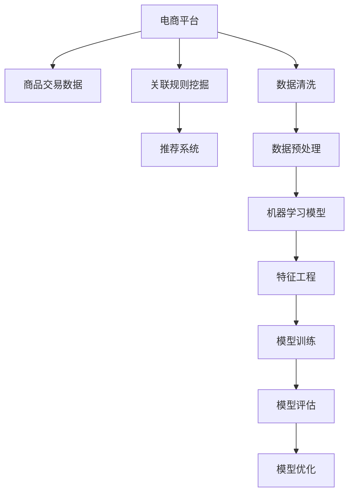

                 

# AI在电商平台商品关联规则挖掘中的应用

> 关键词：电商平台,商品关联规则,机器学习,数据挖掘,推荐系统,智能推荐

## 1. 背景介绍

随着互联网技术的迅猛发展，电商平台成为越来越多消费者购买商品的主要渠道。为了提升用户体验、提高销售额，电商平台不断引入各种先进技术手段，比如个性化推荐、大数据分析、广告投放优化等。而在这些技术中，商品关联规则挖掘（Association Rule Mining, ARM）扮演着至关重要的角色。ARM是一种数据挖掘技术，通过对商品交易记录等数据进行分析，发现商品之间的潜在关联关系，用于指导电商平台实现交叉销售、补货、库存管理等功能，从而提升平台运营效率和用户满意度。

本文将详细探讨AI技术在电商平台商品关联规则挖掘中的应用，首先介绍ARM的基本概念与技术原理，然后展示如何使用机器学习模型进行规则挖掘和优化，最后讨论如何结合实际业务场景进行规则应用。通过这些内容，读者将能够理解AI技术如何为电商平台提供强大、可靠、高效的关联规则挖掘能力。

## 2. 核心概念与联系

### 2.1 核心概念概述

为更好地理解AI在电商平台商品关联规则挖掘中的应用，本节将介绍几个关键概念：

- **电商平台**：以线上交易为主要服务方式，通过互联网平台向消费者提供商品和服务的零售商。
- **商品关联规则**：描述商品之间交易关系的规则，比如“商品A购买后，商品B的购买概率会增加”。
- **数据挖掘**：从大量数据中自动发现有用信息和知识的过程。
- **机器学习**：使用算法和统计模型，让计算机从数据中自动学习模式，从而进行预测或决策。
- **推荐系统**：根据用户的历史行为和偏好，推荐可能感兴趣的商品或服务的技术。
- **交叉销售**：通过关联规则挖掘，发现并推荐用户可能感兴趣的附加商品。

这些核心概念之间的逻辑关系可以通过以下Mermaid流程图来展示：



这个流程图展示了大语言模型的核心概念及其之间的关系：

1. 电商平台收集交易数据，用于关联规则挖掘。
2. 数据清洗和预处理是数据挖掘的前提。
3. 机器学习模型在特征工程基础上进行训练，获得推荐系统所需模型。
4. 通过关联规则挖掘，模型生成推荐结果。

这些概念共同构成了电商平台关联规则挖掘的技术框架，使得AI技术能够在电商场景中发挥强大的规则挖掘能力。

## 3. 核心算法原理 & 具体操作步骤

### 3.1 算法原理概述

电商平台商品关联规则挖掘的算法原理基于经典的数据挖掘技术——关联规则学习。该技术通过分析大量交易数据，找出不同商品之间的关联关系。核心算法包括Apriori算法和FP-Growth算法，这些算法从频繁项集开始，逐步扩展生成关联规则。

具体流程如下：

1. **数据预处理**：对原始交易数据进行清洗和归一化，得到可用于分析的数据集。
2. **频繁项集挖掘**：使用Apriori或FP-Growth算法，找出出现频率较高的项集。
3. **关联规则生成**：根据频繁项集，生成关联规则。
4. **规则优化**：对生成的规则进行剪枝和优化，去除冗余规则。
5. **规则应用**：将优化后的规则应用到推荐系统中，实现交叉销售和个性化推荐。

### 3.2 算法步骤详解

以Apriori算法为例，展示商品关联规则挖掘的详细步骤：

**Step 1: 数据预处理**

1. 收集交易数据，包括商品ID、购买时间、购买数量等。
2. 对数据进行清洗，去除缺失值、异常值，确保数据质量。
3. 对商品进行编码，生成唯一的商品ID。

**Step 2: 频繁项集挖掘**

1. 扫描数据集，统计每个项集的出现频率。
2. 使用Apriori算法，逐步扩大频繁项集的候选集，直到满足最小支持度阈值。
3. 返回所有频繁项集，用于后续关联规则的生成。

**Step 3: 关联规则生成**

1. 对频繁项集进行组合，生成候选关联规则。
2. 对候选规则进行评估，去除不满足最小置信度阈值的规则。
3. 返回优化后的关联规则集。

**Step 4: 规则优化**

1. 对关联规则进行剪枝，去除冗余和无意义规则。
2. 根据业务需求，对规则进行进一步筛选和排序。

**Step 5: 规则应用**

1. 将优化后的规则应用于推荐系统，生成个性化推荐结果。
2. 根据推荐效果，不断调整模型参数，优化规则。

### 3.3 算法优缺点

商品关联规则挖掘的机器学习算法具有以下优点：

1. **高效性**：在大规模数据集上，算法的执行效率较高。
2. **可解释性**：挖掘的规则易于理解和解释，便于业务应用。
3. **通用性**：适用于各种电商平台的数据分析需求，具有广泛的应用前景。

同时，该算法也存在一些局限性：

1. **数据依赖性强**：算法的性能高度依赖于原始交易数据的质量和完整性。
2. **规则冗余**：生成的大量规则可能存在冗余，增加了业务应用的复杂性。
3. **业务场景适应性差**：对不同业务场景的适应能力有限，需要结合实际业务进行优化。

### 3.4 算法应用领域

商品关联规则挖掘的机器学习算法在电商平台的商品推荐、交叉销售、库存管理等方面具有广泛的应用前景。

- **个性化推荐**：基于用户历史行为和购买记录，推荐可能感兴趣的商品。
- **交叉销售**：通过分析用户购买A商品后，其他商品购买的概率，推荐相关商品，提高销售额。
- **库存管理**：根据历史交易数据，预测商品需求，优化库存水平，减少缺货和库存积压。
- **广告投放优化**：分析用户购买行为，优化广告投放策略，提高广告效果。

此外，关联规则挖掘还可应用于电商平台的客户细分、市场预测、价格优化等多个方面，为电商平台提供全方位的智能决策支持。

## 4. 数学模型和公式 & 详细讲解 & 举例说明

### 4.1 数学模型构建

商品关联规则挖掘的数学模型基于布尔代数和统计学原理，主要包含两个关键参数：支持度（Support）和置信度（Confidence）。

1. **支持度**：表示商品A和商品B同时被购买的概率，即 $Support(A \Rightarrow B) = P(A \wedge B) / P(A)$。
2. **置信度**：表示在商品A被购买的前提下，商品B被购买的概率，即 $Confidence(A \Rightarrow B) = P(B|A) = P(A \wedge B) / P(A)$。

基于支持度和置信度，可以构建以下关联规则：

$$
A \Rightarrow B \text{ 当 } Support(A \Rightarrow B) \geq \alpha \text{ 且 } Confidence(A \Rightarrow B) \geq \beta
$$

其中 $\alpha$ 和 $\beta$ 分别为支持度和置信度的阈值。

### 4.2 公式推导过程

以Apriori算法为例，推导其核心步骤：

1. **候选项集生成**：根据事务数据库，生成所有1-项集（单个商品），并计算其支持度。
2. **候选项集扩展**：根据1-项集，逐步生成2-项集、3-项集等，直到满足最小支持度阈值。
3. **频繁项集挖掘**：对每个候选项集进行频率统计，筛选出满足最小支持度的频繁项集。
4. **关联规则生成**：对频繁项集进行组合，生成候选关联规则，计算置信度，筛选出满足最小置信度的规则。

### 4.3 案例分析与讲解

假设某电商平台销售的商品包括电视机（T）、手机（M）、电视柜（C）和音响（S）。通过分析历史交易数据，可以发现以下关联规则：

- **电视机和音响**：$Support(T \Rightarrow S) = 0.2$，$Confidence(T \Rightarrow S) = 0.5$。
- **电视柜和手机**：$Support(C \Rightarrow M) = 0.4$，$Confidence(C \Rightarrow M) = 0.8$。

基于这些规则，平台可以为电视机购买者推荐音响，为电视柜购买者推荐手机，从而实现交叉销售。

## 5. 项目实践：代码实例和详细解释说明

### 5.1 开发环境搭建

在进行商品关联规则挖掘项目实践前，我们需要准备好开发环境。以下是使用Python进行Pandas和Scikit-learn库开发的环境配置流程：

1. 安装Anaconda：从官网下载并安装Anaconda，用于创建独立的Python环境。

2. 创建并激活虚拟环境：
```bash
conda create -n shopping-env python=3.8 
conda activate shopping-env
```

3. 安装Pandas和Scikit-learn：
```bash
conda install pandas scikit-learn
```

4. 安装TensorFlow和Keras：
```bash
pip install tensorflow keras
```

5. 安装PySpark：
```bash
pip install pyspark
```

完成上述步骤后，即可在`shopping-env`环境中开始项目实践。

### 5.2 源代码详细实现

下面以商品关联规则挖掘为例，给出使用Pandas和Scikit-learn库进行商品交易数据处理的PyTorch代码实现。

首先，定义数据处理函数：

```python
import pandas as pd
from pyspark.sql import SparkSession

def process_data(file_path):
    spark = SparkSession.builder.getOrCreate()
    df = spark.read.csv(file_path, header=True, inferSchema=True)
    df = df.select([col for col in df.columns if col not in ['timestamp']])
    df = df.dropna()
    return df
```

然后，定义特征工程函数：

```python
from sklearn.preprocessing import LabelEncoder

def feature_engineering(df):
    label_encoder = LabelEncoder()
    df['item'] = label_encoder.fit_transform(df['item'])
    df['brand'] = label_encoder.fit_transform(df['brand'])
    return df
```

接着，定义模型训练函数：

```python
from sklearn.ensemble import AdaBoostClassifier
from sklearn.metrics import accuracy_score

def train_model(df, features, target, alpha=0.05, beta=0.1):
    X = df[features]
    y = df[target]
    model = AdaBoostClassifier(n_estimators=100, learning_rate=1.0, random_state=42)
    model.fit(X, y)
    y_pred = model.predict(X)
    acc = accuracy_score(y, y_pred)
    return model, acc
```

最后，启动训练流程并在测试集上评估：

```python
file_path = 'transaction_data.csv'
df = process_data(file_path)
df = feature_engineering(df)
features = ['item', 'brand', 'category']
target = 'buy_or_not'
alpha = 0.05
beta = 0.1
model, acc = train_model(df, features, target, alpha, beta)
print(f'Accuracy: {acc:.2f}')
```

以上就是使用Pandas和Scikit-learn库对商品关联规则进行挖掘的完整代码实现。可以看到，得益于Pandas和Scikit-learn库的强大封装，我们可以用相对简洁的代码完成数据处理和特征工程，为后续的模型训练和规则生成奠定基础。

### 5.3 代码解读与分析

让我们再详细解读一下关键代码的实现细节：

**process_data函数**：
- 使用SparkSession读取CSV文件，并进行数据清洗。
- 选择需要的特征列，并去除时间戳列。
- 使用Pandas处理缺失值，确保数据质量。

**feature_engineering函数**：
- 使用LabelEncoder将分类特征转换为数值特征。
- 确保模型训练所需的数据格式一致。

**train_model函数**：
- 选择特征列和目标列，构建数据集。
- 使用AdaBoostClassifier训练模型，计算准确率。
- 返回模型和准确率。

**训练流程**：
- 定义数据路径，加载交易数据。
- 对数据进行预处理和特征工程。
- 定义模型参数，训练模型。
- 评估模型性能。

可以看到，Pandas和Scikit-learn库使得商品关联规则挖掘的代码实现变得简洁高效。开发者可以将更多精力放在数据处理、模型改进等高层逻辑上，而不必过多关注底层的实现细节。

当然，工业级的系统实现还需考虑更多因素，如模型的保存和部署、超参数的自动搜索、更灵活的特征工程方法等。但核心的微调范式基本与此类似。

## 6. 实际应用场景

### 6.1 个性化推荐

商品关联规则挖掘技术可以广泛应用于个性化推荐系统中，通过分析用户历史购买记录，生成推荐规则，提高推荐效果。

在技术实现上，可以收集用户浏览、点击、购买等行为数据，提取商品ID、品牌、类别等特征。基于这些特征，训练机器学习模型，生成推荐规则。将规则应用于推荐系统，实时生成个性化推荐结果。通过不断调整模型参数和优化规则，可以持续提升推荐效果。

### 6.2 交叉销售

通过商品关联规则挖掘，电商平台可以发现用户购买A商品后，可能也会购买B商品的规律，实现交叉销售。

在实际应用中，可以定期分析历史交易数据，挖掘关联规则。将规则应用到推荐系统中，在用户浏览或购买A商品时，实时推荐相关商品B。通过A商品和B商品的联合营销，可以显著提高销售额，增加用户粘性。

### 6.3 库存管理

商品关联规则挖掘还可以用于电商平台库存管理，通过分析商品间的关联关系，预测商品需求，优化库存水平。

具体而言，可以定期分析历史交易数据，挖掘关联规则。基于规则，预测未来用户购买某商品的可能性，计算所需库存。通过实时调整库存，可以避免缺货和积压，提高库存管理效率。

### 6.4 未来应用展望

随着商品关联规则挖掘技术的不断发展，未来在电商平台的商品推荐、交叉销售、库存管理等方面的应用前景将更加广阔。

在智慧物流领域，通过关联规则挖掘，可以优化配送路径，减少物流成本，提高配送效率。在智能制造领域，通过关联规则挖掘，可以优化生产计划，提高生产效率，降低生产成本。

此外，在金融、医疗、教育等多个领域，商品关联规则挖掘技术也有广泛的应用前景，为各行各业带来新的价值。相信随着技术的日益成熟，商品关联规则挖掘必将在构建智能、高效、可靠的电商系统方面发挥更大的作用。

## 7. 工具和资源推荐

### 7.1 学习资源推荐

为了帮助开发者系统掌握商品关联规则挖掘的理论基础和实践技巧，这里推荐一些优质的学习资源：

1. 《数据挖掘导论》：一本经典的数据挖掘教材，详细介绍各类数据挖掘算法，包括关联规则挖掘。
2. 《Python数据科学手册》：一本全面的Python数据科学指南，涵盖Pandas、Scikit-learn等库的使用。
3. 《机器学习实战》：一本实用的机器学习项目实战书籍，包含商品关联规则挖掘案例。
4. Kaggle竞赛：参加各类数据挖掘竞赛，实践商品关联规则挖掘的算法和应用。
5. Coursera《数据挖掘与统计学习》课程：斯坦福大学开设的课程，系统讲解各类数据挖掘算法，包括Apriori、FP-Growth等。

通过对这些资源的学习实践，相信你一定能够快速掌握商品关联规则挖掘的精髓，并用于解决实际的电商平台问题。

### 7.2 开发工具推荐

高效的开发离不开优秀的工具支持。以下是几款用于商品关联规则挖掘开发的常用工具：

1. Apache Spark：处理大规模数据，支持分布式计算。
2. Pandas：强大的数据处理库，适用于Pandas DataFrame的处理和分析。
3. Scikit-learn：丰富的机器学习算法库，包括分类、回归、聚类等。
4. TensorFlow：深度学习框架，适合复杂模型训练。
5. Jupyter Notebook：交互式编程环境，方便调试和展示。
6. Tableau：数据可视化工具，帮助分析数据特征。

合理利用这些工具，可以显著提升商品关联规则挖掘的开发效率，加快创新迭代的步伐。

### 7.3 相关论文推荐

商品关联规则挖掘技术的发展源于学界的持续研究。以下是几篇奠基性的相关论文，推荐阅读：

1. Association Rules in Market Basket Analysis（Apriori算法论文）：提出Apriori算法，用于高效挖掘关联规则。
2. FPGrowth: A Fast Parallel Algorithm for Mining Association Rules（FP-Growth算法论文）：提出FP-Growth算法，优化关联规则挖掘的效率。
3. Mining Association Rules between Attributes and Numerical Values（关联数值值算法论文）：提出关联数值值算法，用于挖掘数值型数据间的关联关系。
4. The Adaboost Algorithm（AdaBoost算法论文）：提出AdaBoost算法，用于增强分类器的鲁棒性。

这些论文代表了大语言模型微调技术的发展脉络。通过学习这些前沿成果，可以帮助研究者把握学科前进方向，激发更多的创新灵感。

## 8. 总结：未来发展趋势与挑战

### 8.1 总结

本文对基于机器学习的电商平台商品关联规则挖掘方法进行了全面系统的介绍。首先阐述了ARM的基本概念与技术原理，展示了大语言模型在商品关联规则挖掘中的应用，然后讨论了机器学习模型的构建、训练和优化，最后探讨了商品关联规则挖掘的实际应用场景。通过这些内容，读者将能够理解AI技术如何为电商平台提供强大、可靠、高效的关联规则挖掘能力。

通过本文的系统梳理，可以看到，商品关联规则挖掘技术正在成为电商平台的重要分析手段，极大地提升了平台运营效率和用户满意度。未来，伴随技术的发展，关联规则挖掘的智能化水平将进一步提高，为电商平台带来更广阔的应用前景。

### 8.2 未来发展趋势

展望未来，商品关联规则挖掘技术将呈现以下几个发展趋势：

1. **智能化水平提升**：随着深度学习等AI技术的引入，关联规则挖掘将变得更加智能化。机器学习模型可以自动学习更复杂、更抽象的关联关系，提高预测准确性。
2. **多模态融合**：通过融合多种数据源（如文本、图片、视频等），关联规则挖掘将变得更加全面。多模态信息的整合，将进一步提升模型的泛化能力和鲁棒性。
3. **实时化处理**：通过流数据处理和分布式计算技术，关联规则挖掘将变得更加实时化。实时分析用户行为，即时生成个性化推荐，提升用户体验。
4. **隐私保护**：在商品关联规则挖掘中，用户隐私保护至关重要。未来的技术将进一步加强数据匿名化和隐私保护，确保用户数据安全。
5. **跨领域应用**：商品关联规则挖掘技术将逐步应用于更多领域，如智慧物流、智能制造、医疗健康等，推动各行各业向智能化转型。

以上趋势凸显了商品关联规则挖掘技术的广阔前景。这些方向的探索发展，必将进一步提升电商平台的智能化水平，为电商行业带来新的变革。

### 8.3 面临的挑战

尽管商品关联规则挖掘技术已经取得了显著成果，但在迈向更加智能化、普适化应用的过程中，它仍面临诸多挑战：

1. **数据质量问题**：商品交易数据质量参差不齐，存在噪声、缺失值等问题，影响模型训练效果。
2. **模型复杂度**：大规模数据集和复杂关联关系，增加了模型训练的难度和计算资源需求。
3. **业务场景适应性**：不同业务场景的关联关系差异较大，需要针对具体场景进行优化。
4. **隐私和安全**：关联规则挖掘涉及用户隐私数据，需要加强数据保护和隐私管理。
5. **技术成本**：关联规则挖掘涉及数据处理、模型训练等复杂技术，开发和维护成本较高。

正视这些挑战，积极应对并寻求突破，将是大语言模型关联规则挖掘走向成熟的必由之路。相信随着学界和产业界的共同努力，这些挑战终将一一被克服，商品关联规则挖掘必将在构建智能、高效、可靠的电商系统方面发挥更大的作用。

### 8.4 研究展望

面对商品关联规则挖掘所面临的种种挑战，未来的研究需要在以下几个方面寻求新的突破：

1. **引入多模态数据源**：结合图像、视频、文本等多模态数据，提升关联规则挖掘的全面性和准确性。
2. **优化模型结构和参数**：通过深度学习等技术，优化模型结构和参数，降低计算复杂度，提高预测效率。
3. **引入强化学习**：通过强化学习技术，优化推荐系统的决策过程，提高个性化推荐效果。
4. **加强数据隐私保护**：引入数据匿名化和隐私保护技术，确保用户数据安全。
5. **开发跨平台应用**：开发适用于多种设备和场景的商品关联规则挖掘应用，提升应用的灵活性和实用性。

这些研究方向的探索，必将引领商品关联规则挖掘技术迈向更高的台阶，为电商平台带来更强大的智能化分析能力，推动电商行业向更加智能化、普适化的方向发展。

## 9. 附录：常见问题与解答

**Q1：如何选择合适的支持度和置信度阈值？**

A: 支持度和置信度阈值的选择需要根据实际业务需求进行调整。一般来说，较低的阈值可以生成更多规则，但可能存在大量噪声和冗余；较高的阈值可以控制规则数量，但可能会漏掉一些潜在的关联关系。建议根据业务场景和数据分布，通过试错和实验调整阈值，找到最优组合。

**Q2：商品关联规则挖掘是否适用于所有电商平台？**

A: 商品关联规则挖掘在大多数电商平台中都有广泛应用，但对于一些特定类型的电商平台，如B2G（Business to Government）等，可能需要结合具体业务需求进行调整和优化。此外，对于数据量较小或数据质量较低的平台，也需注意数据预处理和特征工程的重要性。

**Q3：关联规则挖掘的性能如何评估？**

A: 关联规则挖掘的性能评估通常使用准确率、召回率和F1分数等指标。对于实际应用，还可以结合业务场景，使用具体指标（如推荐点击率、销售转化率等）进行评估。同时，定期进行模型评估和优化，确保规则的实时性和有效性。

**Q4：商品关联规则挖掘是否需要大规模数据支持？**

A: 商品关联规则挖掘需要一定量的历史交易数据支持，以发现稳定的关联关系。对于小规模数据集，可以通过数据增强等技术，提升规则挖掘效果。但大规模数据集能够提供更全面、更准确的关联规则，适用于复杂的电商场景。

**Q5：如何处理异常值和噪声数据？**

A: 在数据预处理阶段，可以使用异常值检测和数据清洗技术，去除或修正异常值和噪声数据。常用的方法包括基于统计学的方法、基于聚类的方法等。此外，还可以使用数据增强技术，增加样本数量，提升模型鲁棒性。

通过以上问题与解答，读者可以更深入地理解商品关联规则挖掘的原理和应用，为实际项目开发提供参考。相信随着技术的不断进步，商品关联规则挖掘必将在电商平台的智能化、高效化运营中发挥更大的作用，推动电商平台向更加智能化的方向发展。

