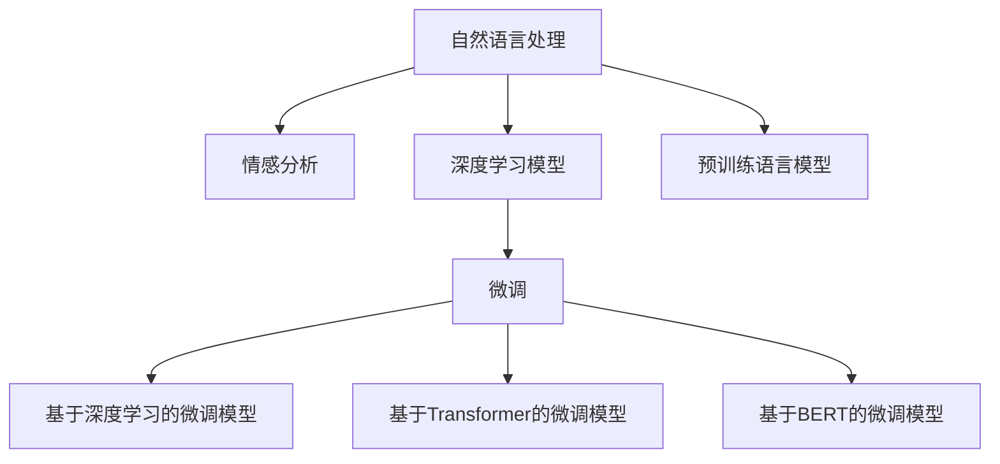

                 

## 1. 背景介绍

### 1.1 问题由来
在电子商务平台，商品评价数据是其用户画像和产品反馈的重要来源。通过情感分析技术，企业可以实时了解消费者的购买感受，优化产品和服务，提升用户满意度。此外，情感分析还可用于用户行为预测、市场趋势分析等，助力企业进行精准营销和战略决策。因此，情感分析成为了电商平台亟需解决的关键技术之一。

### 1.2 问题核心关键点
情感分析任务的难点在于如何准确理解自然语言文本中的情感倾向，常用的方法包括基于规则的、基于词典的、基于机器学习的等。其中，基于机器学习的方法特别是深度学习模型，在数据量充足的情况下，已展现出强大的性能。本研究聚焦于基于深度学习的情感分析模型，特别是利用预训练语言模型进行微调，以提升模型性能和泛化能力。

### 1.3 问题研究意义
情感分析在电商平台的应用，有助于企业实时洞察用户反馈，优化产品体验，提升用户满意度。同时，通过对大规模商品评价数据的分析，可以发现市场趋势，指导产品定位和营销策略。借助深度学习技术，特别是预训练语言模型的微调方法，可以大幅提升情感分析的准确性和泛化能力，推动电商平台的智能化转型。

## 2. 核心概念与联系

### 2.1 核心概念概述

为更好地理解基于深度学习的情感分析方法，本节将介绍几个密切相关的核心概念：

- 情感分析（Sentiment Analysis）：通过文本分析技术，自动判断文本中表达的情感倾向，分为极性分析（正面/负面）和强度分析（强/弱）。
- 自然语言处理（Natural Language Processing, NLP）：涉及文本数据的前处理、特征提取、模型训练和推理等环节，是情感分析的重要基础。
- 深度学习模型：包括卷积神经网络（CNN）、循环神经网络（RNN）、长短时记忆网络（LSTM）、注意力机制（Attention）等，用于从大规模语料中学习复杂的语言表示。
- 预训练语言模型：如BERT、GPT-2、XLNet等，通过自监督学习任务在大规模无标签文本上预训练，学习通用的语言表示，适用于下游任务微调。
- 微调（Fine-tuning）：在预训练模型的基础上，使用下游任务的标注数据，通过有监督学习优化模型，提升特定任务性能。

这些核心概念之间的逻辑关系可以通过以下Mermaid流程图来展示：



这个流程图展示了大语言模型在情感分析中的应用流程：

1. 自然语言处理为情感分析提供文本前处理和特征提取。
2. 深度学习模型用于训练情感分析模型，学习语言表示。
3. 预训练语言模型在无标签文本上预训练，学习通用语言表示。
4. 微调将预训练模型适配到具体任务，提升模型性能。
5. 基于深度学习的微调模型进一步优化情感分析效果。

## 3. 核心算法原理 & 具体操作步骤
### 3.1 算法原理概述

基于深度学习的情感分析模型，通常采用端到端的神经网络架构，结合自然语言处理技术，通过大量标注数据训练，自动学习文本中的情感倾向。

形式化地，设情感分析任务为 $T$，标注数据集为 $D=\{(x_i,y_i)\}_{i=1}^N$，其中 $x_i$ 为商品评价文本，$y_i \in \{1,0\}$ 表示情感极性。目标是最小化损失函数 $\mathcal{L}(M_{\theta},D)$，其中 $M_{\theta}$ 为深度学习模型参数，$D$ 为训练数据。

模型优化通常采用梯度下降等优化算法，通过反向传播计算梯度并更新参数 $\theta$，直到模型收敛。其中，预训练语言模型作为特征提取器，通常在前向传播中提取文本特征。

### 3.2 算法步骤详解

基于深度学习的情感分析模型，具体步骤如下：

**Step 1: 准备数据集和预训练模型**
- 收集商品评价数据，划分为训练集、验证集和测试集。
- 选择合适的预训练语言模型，如BERT、GPT-2等，作为初始化参数。

**Step 2: 定义模型架构**
- 选择适合情感分析任务的神经网络架构，如CNN、RNN、LSTM、Transformer等。
- 设计模型输入和输出层，输出层通常为 sigmoid 激活函数，用于二分类任务。
- 确定模型的正则化技术，如L2正则、Dropout、Batch Normalization等。

**Step 3: 微调模型**
- 在训练集上使用梯度下降等优化算法，更新模型参数，最小化损失函数。
- 在验证集上评估模型性能，调整超参数，防止过拟合。
- 在测试集上最终评估模型性能，对比微调前后的效果提升。

**Step 4: 部署和应用**
- 将微调后的模型部署到电商平台后台系统，集成到用户评价处理流程中。
- 实时接收用户评价文本，进行情感分析，提供情感标签和分析报告。
- 根据情感分析结果，进行产品优化、市场分析等决策支持。

### 3.3 算法优缺点

基于深度学习的情感分析模型具有以下优点：
1. 自适应性：可以处理各种不同风格和语义的文本，具有较好的泛化能力。
2. 准确性：通过预训练和微调，模型可以学习到丰富的语言知识，提升情感分析的准确性。
3. 可解释性：模型内部的黑盒结构使得情感分析结果易于理解，方便业务决策。
4. 实时性：深度学习模型具有良好的并行性，适合实时处理大量评价数据。

同时，这些模型也存在一定的局限性：
1. 数据依赖：模型依赖大量高质量标注数据进行训练，标注成本较高。
2. 资源消耗：大规模预训练和微调模型需要高性能的计算资源。
3. 模型复杂度：深度学习模型结构复杂，调试和优化难度较大。
4. 解释性不足：复杂模型难以解释其内部推理逻辑，存在"黑盒"问题。

尽管存在这些局限性，但深度学习模型在情感分析中的应用已展示了显著的性能提升和广泛的应用前景。

### 3.4 算法应用领域

基于深度学习的情感分析模型，已在电商平台的各个环节得到了广泛应用，例如：

- 商品评价情感分析：对用户提交的商品评价进行情感分类，了解用户对商品的满意度和体验。
- 客服情感分析：通过实时分析用户对话内容，识别客户情感倾向，优化客服服务质量。
- 用户行为预测：分析用户历史评价和行为数据，预测用户购买意愿和流失风险。
- 广告投放优化：通过情感分析结果，优化广告内容，提升广告转化率。
- 品牌舆情监测：对社交媒体、论坛等渠道上的品牌评价进行分析，了解品牌声誉和市场反馈。

此外，情感分析技术还被广泛应用于金融、医疗、教育等众多领域，为各行业的智能化转型提供了新的技术支持。

## 4. 数学模型和公式 & 详细讲解 & 举例说明

### 4.1 数学模型构建

形式化地，设情感分析任务为 $T$，标注数据集为 $D=\{(x_i,y_i)\}_{i=1}^N$，其中 $x_i$ 为商品评价文本，$y_i \in \{1,0\}$ 表示情感极性。目标是最小化损失函数 $\mathcal{L}(M_{\theta},D)$，其中 $M_{\theta}$ 为深度学习模型参数，$D$ 为训练数据。

### 4.2 公式推导过程

以基于BERT的情感分析模型为例，详细推导其微调过程：

**模型架构**
- 输入层：将文本转换为BERT的输入格式，包括token ids、token type ids、attention mask等。
- BERT层：使用预训练的BERT模型，提取文本特征。
- 全连接层：将BERT的输出通过全连接层转换为二分类得分。
- 输出层：使用sigmoid激活函数，输出情感极性概率。

**损失函数**
- 二分类交叉熵损失：$L(y,\hat{y}) = -(y\log \hat{y} + (1-y)\log(1-\hat{y}))$，其中 $y$ 为真实标签，$\hat{y}$ 为模型预测概率。

**优化算法**
- 使用AdamW优化器，学习率 $\eta$，动量 $\beta$，权重衰减 $\lambda$。
- 参数更新公式：$\theta \leftarrow \theta - \eta \nabla_{\theta}\mathcal{L}(\theta) - \eta\lambda\theta$。

**模型评估**
- 在验证集上使用准确率、精确率、召回率、F1-score等指标评估模型性能。

### 4.3 案例分析与讲解

以下以亚马逊商品评价情感分析为例，展示预训练BERT模型进行微调的过程：

**数据集**
- 收集亚马逊商品评价数据，划分为训练集、验证集和测试集。
- 数据清洗：去除噪声、停用词、标点等，保留关键信息。

**模型架构**
- 输入层：使用BertTokenizer进行文本预处理，转换为BERT格式。
- BERT层：使用BERT-base-uncased模型，提取文本特征。
- 全连接层：使用一个包含1024个神经元的全连接层，进行情感分类。
- 输出层：使用sigmoid激活函数，输出情感极性概率。

**模型微调**
- 使用亚马逊商品评价数据，对BERT模型进行微调。
- 设置学习率为2e-5，动量为0.9，权重衰减为0.01。
- 在训练集上使用AdamW优化器进行微调，每轮更新10个epoch，每个epoch更新100个样本。
- 在验证集上评估模型性能，调整学习率、批大小等超参数，防止过拟合。
- 在测试集上最终评估模型性能，输出情感分类结果。

## 5. 项目实践：代码实例和详细解释说明

### 5.1 开发环境搭建

在进行情感分析项目开发前，需要准备好开发环境。以下是使用Python进行PyTorch开发的环境配置流程：

1. 安装Anaconda：从官网下载并安装Anaconda，用于创建独立的Python环境。

2. 创建并激活虚拟环境：
```bash
conda create -n pytorch-env python=3.8 
conda activate pytorch-env
```

3. 安装PyTorch：根据CUDA版本，从官网获取对应的安装命令。例如：
```bash
conda install pytorch torchvision torchaudio cudatoolkit=11.1 -c pytorch -c conda-forge
```

4. 安装其他依赖库：
```bash
pip install transformers pandas numpy sklearn tqdm torchtext
```

5. 安装BERT模型：
```bash
pip install transformers
```

6. 安装GPT-2模型：
```bash
pip install gpt-2
```

完成上述步骤后，即可在`pytorch-env`环境中开始情感分析项目的开发。

### 5.2 源代码详细实现

下面我们以使用BERT进行情感分析为例，给出使用PyTorch实现的代码。

```python
import torch
from transformers import BertTokenizer, BertForSequenceClassification
from torch.utils.data import DataLoader, RandomSampler, SequentialSampler
from torch.nn import CrossEntropyLoss, AdamW

# 定义BERT分词器和情感分析模型
tokenizer = BertTokenizer.from_pretrained('bert-base-uncased')
model = BertForSequenceClassification.from_pretrained('bert-base-uncased', num_labels=2)

# 加载数据集
train_data = load_train_data()
dev_data = load_dev_data()
test_data = load_test_data()

# 定义训练函数
def train_epoch(model, data_loader, optimizer, device):
    model.train()
    total_loss = 0
    for batch in data_loader:
        input_ids = batch['input_ids'].to(device)
        attention_mask = batch['attention_mask'].to(device)
        labels = batch['labels'].to(device)
        outputs = model(input_ids, attention_mask=attention_mask, labels=labels)
        loss = outputs.loss
        total_loss += loss.item()
        optimizer.zero_grad()
        loss.backward()
        optimizer.step()
    return total_loss / len(data_loader)

# 定义评估函数
def evaluate(model, data_loader, device):
    model.eval()
    total_correct = 0
    total_sample = 0
    for batch in data_loader:
        input_ids = batch['input_ids'].to(device)
        attention_mask = batch['attention_mask'].to(device)
        labels = batch['labels'].to(device)
        with torch.no_grad():
            outputs = model(input_ids, attention_mask=attention_mask)
            logits = outputs.logits
            _, preds = torch.max(logits, 1)
            total_correct += torch.sum(preds == labels).item()
            total_sample += preds.size(0)
    return total_correct / total_sample

# 训练模型
epochs = 5
batch_size = 32
learning_rate = 2e-5
device = torch.device('cuda' if torch.cuda.is_available() else 'cpu')

for epoch in range(epochs):
    train_loss = train_epoch(model, train_data, AdamW(model.parameters(), lr=learning_rate), device)
    dev_acc = evaluate(model, dev_data, device)
    print(f'Epoch {epoch+1}, train loss: {train_loss:.4f}, dev accuracy: {dev_acc:.4f}')

# 测试模型
test_acc = evaluate(model, test_data, device)
print(f'Test accuracy: {test_acc:.4f}')
```

上述代码实现了使用BERT模型进行情感分析的完整流程，包括模型加载、数据加载、训练、评估和测试。在实际应用中，可以根据具体的任务需求进行适当的修改和扩展。

### 5.3 代码解读与分析

让我们再详细解读一下关键代码的实现细节：

**BERT分词器**
- 使用`transformers`库中的`BertTokenizer`类，加载预训练的BERT分词器。

**情感分析模型**
- 使用`transformers`库中的`BertForSequenceClassification`类，加载预训练的BERT模型，并设置输出层为二分类任务。

**数据集加载**
- 定义训练集、验证集和测试集，使用`torch.utils.data`库提供的`DataLoader`类进行批次化加载。

**训练函数**
- 在每个epoch内，使用随机抽样器对数据集进行随机打乱，确保模型训练的稳定性。
- 在训练过程中，使用AdamW优化器进行梯度更新，通过损失函数计算每批数据的损失，更新模型参数。
- 在每个epoch结束时，计算平均损失并返回。

**评估函数**
- 在评估过程中，使用`torch.no_grad()`函数禁用梯度计算，加快评估速度。
- 对于每批数据，进行前向传播计算预测结果，并使用`torch.max`函数获取预测标签。
- 计算预测标签与真实标签的准确率，并返回最终结果。

**训练和评估流程**
- 定义训练的epoch数和批大小，循环迭代进行训练。
- 在每个epoch内，先进行训练，计算平均损失，并在验证集上进行评估。
- 根据验证集上的评估结果调整学习率，防止过拟合。
- 在所有epoch结束后，在测试集上最终评估模型性能。

## 6. 实际应用场景

### 6.1 电商平台情感分析

在电商平台，情感分析可以用于多个场景，例如：

- 用户评价情感分析：通过分析用户对商品的评价，了解用户对产品的满意度和体验。
- 客服情感分析：实时监测用户在客服对话中的情感倾向，优化客服服务质量。
- 商品推荐优化：分析用户对商品评价的情感倾向，优化推荐系统，提升推荐效果。
- 产品改进：通过情感分析结果，指导产品设计、生产和营销策略，提升用户满意度。

### 6.2 广告投放优化

在广告投放中，情感分析可以用于评估广告内容的效果，优化广告投放策略，提高广告转化率。例如：

- 情感倾向分析：分析广告文本中的情感倾向，筛选出积极情感的广告。
- 用户反馈监测：通过监测用户对广告的反馈，调整广告内容和投放策略。
- 竞品分析：分析竞品的广告情感倾向，找出差异和优势。
- 效果评估：通过情感分析结果，评估广告效果，优化投放预算。

### 6.3 用户行为预测

在用户行为预测中，情感分析可以用于分析用户对商品、服务的情感倾向，预测用户的购买意愿和流失风险。例如：

- 购买意愿预测：分析用户对商品的评价和情感倾向，预测用户的购买意愿。
- 流失风险预测：分析用户对服务的不满和负面情感，预测用户的流失风险。
- 个性化推荐：通过分析用户的情感倾向，提供个性化的产品和服务推荐。
- 客户细分：通过情感分析结果，进行客户分类和细分，提升营销效果。

## 7. 工具和资源推荐

### 7.1 学习资源推荐

为帮助开发者系统掌握情感分析技术，这里推荐一些优质的学习资源：

1. 《深度学习与自然语言处理》：斯坦福大学自然语言处理课程，涵盖深度学习在NLP中的各种应用。

2. 《NLP实战》：机器之心推出的实战教程，通过Python和TensorFlow实现情感分析。

3. 《Natural Language Processing in Action》：O'Reilly出版社出版的NLP实战书籍，涵盖NLP的各个领域，包括情感分析。

4. Kaggle数据集和比赛：参与Kaggle中的情感分析比赛，可以学习到各种情感分析的实现方法。

5. PyTorch官方文档：详细的PyTorch教程，包括预训练模型和微调方法的实现。

6. TensorFlow官方文档：介绍TensorFlow的深度学习框架，提供情感分析的实现示例。

7. Transformers官方文档：介绍基于Transformer的预训练模型和微调方法，提供情感分析的实现样例。

通过对这些资源的学习实践，相信你一定能够快速掌握情感分析的精髓，并用于解决实际的业务问题。

### 7.2 开发工具推荐

高效的开发离不开优秀的工具支持。以下是几款用于情感分析开发的常用工具：

1. PyTorch：基于Python的开源深度学习框架，灵活的动态计算图，适合快速迭代研究。

2. TensorFlow：由Google主导开发的开源深度学习框架，生产部署方便，适合大规模工程应用。

3. HuggingFace Transformers：自然语言处理工具库，集成了多个SOTA语言模型，提供预训练和微调功能。

4. Weights & Biases：模型训练的实验跟踪工具，可以记录和可视化模型训练过程中的各项指标，方便对比和调优。

5. TensorBoard：TensorFlow配套的可视化工具，可实时监测模型训练状态，并提供丰富的图表呈现方式。

6. Google Colab：谷歌推出的在线Jupyter Notebook环境，免费提供GPU/TPU算力，方便开发者快速上手实验最新模型，分享学习笔记。

合理利用这些工具，可以显著提升情感分析任务的开发效率，加快创新迭代的步伐。

### 7.3 相关论文推荐

情感分析在电商平台的广泛应用，得益于深度学习技术的突破。以下是几篇奠基性的相关论文，推荐阅读：

1. Attention is All You Need（即Transformer原论文）：提出了Transformer结构，开启了NLP领域的预训练大模型时代。

2. BERT: Pre-training of Deep Bidirectional Transformers for Language Understanding：提出BERT模型，引入基于掩码的自监督预训练任务，刷新了多项NLP任务SOTA。

3. TextRank: Bringing Order into Texts：提出了基于图模型和TF-IDF的文本排序算法，为情感分析提供了基础。

4. Word2Vec：通过词嵌入技术，将自然语言文本转化为向量表示，为情感分析提供了更丰富的特征表达。

5. CNN for Sentence Classification：提出卷积神经网络用于句子分类，提高了情感分析的准确性。

6. RNN for Sentence Classification：使用循环神经网络进行情感分析，能够处理长文本和语义关系。

这些论文代表了大语言模型微调技术的最新进展，通过学习这些前沿成果，可以帮助研究者把握学科前进方向，激发更多的创新灵感。

## 8. 总结：未来发展趋势与挑战

### 8.1 总结

本文对基于深度学习的情感分析模型进行了全面系统的介绍。首先阐述了情感分析在电商平台的应用背景和意义，明确了深度学习技术在情感分析中的独特价值。其次，从原理到实践，详细讲解了深度学习模型在情感分析中的应用流程，包括数据准备、模型构建、微调优化、评估部署等环节，给出了情感分析任务开发的完整代码实例。同时，本文还广泛探讨了情感分析模型在电商平台的各个环节的应用场景，展示了情感分析技术的广泛应用前景。

通过本文的系统梳理，可以看到，基于深度学习的情感分析模型在电商平台的应用前景广阔，通过预训练和微调方法，能够高效、准确地进行情感分析，提升电商平台的智能化水平和用户体验。未来，伴随深度学习技术的不断进步，情感分析技术必将在更多领域得到应用，为各行业的智能化转型提供新的技术支持。

### 8.2 未来发展趋势

展望未来，深度学习技术在情感分析领域将继续呈现以下发展趋势：

1. 多模态融合：将文本、语音、图像等多种模态信息结合，提升情感分析的全面性和准确性。

2. 跨语言情感分析：拓展情感分析的应用范围，将模型应用于多种语言，提升全球化市场的情感分析能力。

3. 可解释性提升：通过模型解释技术，提升情感分析的可解释性，使其更易于理解和信任。

4. 低资源优化：通过迁移学习、零样本学习等方法，在资源受限的情况下，提升情感分析的效率和效果。

5. 实时情感分析：将情感分析技术应用于实时流数据，实现动态情感分析，提升应用场景的响应速度。

6. 多任务学习：将情感分析与其他NLP任务结合，进行多任务学习，提升模型的综合性能。

以上趋势凸显了深度学习技术在情感分析领域的广阔前景，这些方向的探索发展，必将进一步提升情感分析的性能和应用范围，为电商平台的智能化转型提供新的技术支持。

### 8.3 面临的挑战

尽管深度学习技术在情感分析领域已取得显著进展，但在迈向更加智能化、普适化应用的过程中，它仍面临诸多挑战：

1. 数据依赖：模型依赖大量高质量标注数据进行训练，标注成本较高。

2. 资源消耗：大规模预训练和微调模型需要高性能的计算资源。

3. 模型复杂度：深度学习模型结构复杂，调试和优化难度较大。

4. 解释性不足：复杂模型难以解释其内部推理逻辑，存在"黑盒"问题。

5. 通用性不足：现有模型往往局限于特定领域和任务，难以在不同领域和任务上泛化。

6. 安全性问题：模型可能学习到有害的偏见和信息，输出误导性结果，带来安全隐患。

正视情感分析面临的这些挑战，积极应对并寻求突破，将是大语言模型微调走向成熟的必由之路。相信随着学界和产业界的共同努力，这些挑战终将一一被克服，情感分析技术必将在构建人机协同的智能时代中扮演越来越重要的角色。

### 8.4 未来突破

面对情感分析所面临的种种挑战，未来的研究需要在以下几个方面寻求新的突破：

1. 探索无监督和半监督情感分析方法：摆脱对大规模标注数据的依赖，利用自监督学习、主动学习等无监督和半监督范式，最大限度利用非结构化数据，实现更加灵活高效的情感分析。

2. 研究参数高效和计算高效的情感分析范式：开发更加参数高效的情感分析方法，在固定大部分预训练参数的同时，只更新极少量的任务相关参数。同时优化情感分析模型的计算图，减少前向传播和反向传播的资源消耗，实现更加轻量级、实时性的部署。

3. 引入更多先验知识：将符号化的先验知识，如知识图谱、逻辑规则等，与神经网络模型进行巧妙融合，引导情感分析过程学习更准确、合理的情感表示。同时加强不同模态数据的整合，实现视觉、语音等多模态信息与文本信息的协同建模。

4. 结合因果分析和博弈论工具：将因果分析方法引入情感分析模型，识别出模型决策的关键特征，增强输出解释的因果性和逻辑性。借助博弈论工具刻画人机交互过程，主动探索并规避模型的脆弱点，提高系统稳定性。

5. 纳入伦理道德约束：在模型训练目标中引入伦理导向的评估指标，过滤和惩罚有害的输出倾向。同时加强人工干预和审核，建立模型行为的监管机制，确保输出符合人类价值观和伦理道德。

这些研究方向的探索，必将引领情感分析技术迈向更高的台阶，为构建安全、可靠、可解释、可控的智能系统铺平道路。面向未来，情感分析技术还需要与其他人工智能技术进行更深入的融合，如知识表示、因果推理、强化学习等，多路径协同发力，共同推动自然语言理解和智能交互系统的进步。只有勇于创新、敢于突破，才能不断拓展情感分析的边界，让智能技术更好地造福人类社会。

## 9. 附录：常见问题与解答

**Q1：情感分析模型是否适用于所有电商平台？**

A: 情感分析模型在大多数电商平台中都适用，但需要根据不同平台的业务特点进行适当的修改和优化。例如，针对C2C平台，需要考虑用户评价的客观性和多样性；针对B2B平台，需要考虑企业评价的详细性和专业性。

**Q2：如何选择预训练语言模型？**

A: 预训练语言模型的选择应根据具体任务的需求，综合考虑模型的参数量、精度、效率和适用性。一般来说，BERT适用于通用文本分类任务，GPT-2适用于生成任务，XLNet适用于复杂序列建模任务。

**Q3：如何处理噪声和异常数据？**

A: 处理噪声和异常数据是情感分析中常见的挑战。通常可以采用数据清洗、过滤、异常值检测等方法。例如，去除低质量评价、停用词、噪声等，保留关键信息。

**Q4：如何评估情感分析模型的性能？**

A: 情感分析模型的性能评估通常使用准确率、精确率、召回率、F1-score等指标。在训练过程中，可以通过交叉验证、早停法等技术防止过拟合。在测试过程中，使用与训练集相似的测试集，评估模型在新数据上的泛化能力。

**Q5：如何在实际应用中提高情感分析的实时性？**

A: 提高情感分析的实时性需要优化模型结构，采用多任务学习、模型裁剪、模型量化等方法。同时，可以采用分布式计算、GPU/TPU等高性能设备，提升计算速度和并行性。

总之，情感分析技术在电商平台的应用前景广阔，通过深度学习模型的预训练和微调方法，可以高效、准确地进行情感分析，提升电商平台的智能化水平和用户体验。未来，伴随深度学习技术的不断进步，情感分析技术必将在更多领域得到应用，为各行业的智能化转型提供新的技术支持。

