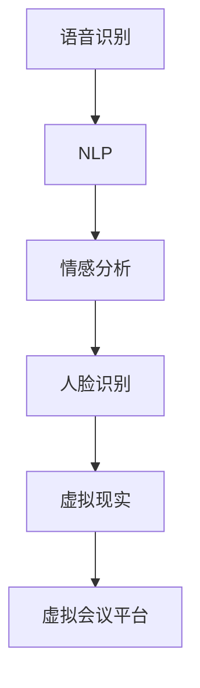

                 

# AI在虚拟会议中的应用：增强远程沟通

> 关键词：AI增强,虚拟会议,远程沟通,自然语言处理(NLP),情感分析,人脸识别,虚拟现实(VR)

## 1. 背景介绍

随着全球化的加速和数字化转型的深化，远程会议变得越来越频繁和重要。然而，传统的远程会议常常存在沟通效率低下、信息不对称、情感交流缺乏等问题。为解决这些问题，AI技术尤其是自然语言处理(NLP)、情感分析、人脸识别、虚拟现实(VR)等在虚拟会议中的应用显得尤为重要。

### 1.1 问题由来

远程沟通面临的挑战主要包括：

- 沟通效率低下：语音和文字消息的传递和理解存在延迟，容易误传误解。
- 信息不对称：不同地域、不同语言背景的参会者对会议信息的理解程度不同，影响会议效果。
- 情感交流缺乏：参会者缺乏面对面交流的情感反馈，影响会议氛围和效果。
- 技术障碍：网络不稳定、设备不兼容等问题影响参会者的会议体验。

### 1.2 问题核心关键点

为提升远程会议的效率和效果，AI技术的应用涉及以下几个关键点：

- AI增强语音识别：通过语音识别技术将语音转换为文字，使信息传递更快更准确。
- 虚拟主持人：利用NLP技术实现智能会议主持，提高会议效率和用户体验。
- 情感分析：通过情感分析技术理解参会者情绪变化，提供情绪反馈，增强会议互动。
- 人脸识别：通过人脸识别技术识别参会者身份和表情，提供更加个性化的会议服务。
- 虚拟现实(VR)：通过VR技术提供沉浸式会议体验，增强参会者的互动和参与感。

这些技术手段的有机结合，能够有效提升远程会议的沟通效率、信息对称性、情感交流和用户体验，为远程会议的普及和深入发展提供有力支持。

## 2. 核心概念与联系

### 2.1 核心概念概述

为更好地理解AI在虚拟会议中的应用，本节将介绍几个核心概念：

- **自然语言处理(NLP)**：使计算机能够理解和生成人类语言的技术，包括文本分类、信息抽取、问答系统等。
- **情感分析(Affective Computing)**：通过分析文本、语音、面部表情等，识别情感倾向的技术。
- **语音识别(Speech Recognition)**：将语音转换为文本的技术，为会议信息记录和理解提供支持。
- **人脸识别(Face Recognition)**：通过面部特征识别技术，实现参会者身份验证和表情分析。
- **虚拟现实(VR)**：通过模拟真实场景，提供沉浸式体验，增强会议参与感。

这些技术相互结合，形成了AI在虚拟会议中应用的核心框架，使得虚拟会议能够具备高度的智能化和个性化。

### 2.2 核心概念原理和架构的 Mermaid 流程图(Mermaid 流程节点中不要有括号、逗号等特殊字符)



该流程图展示了AI技术在虚拟会议应用中的主要流程和联系：

- 语音识别将语音转换为文本，NLP技术解析文本信息。
- 情感分析识别文本中的情感倾向，提供情感反馈。
- 人脸识别识别参会者身份和表情，增强互动体验。
- 虚拟现实提供沉浸式会议环境，增强参会体验。
- 以上所有技术集成到虚拟会议平台，提供全功能的智能会议体验。

## 3. 核心算法原理 & 具体操作步骤
### 3.1 算法原理概述

AI在虚拟会议中的应用，主要基于自然语言处理(NLP)、情感分析、语音识别、人脸识别、虚拟现实(VR)等技术，涉及多个子领域。

**语音识别**：通过声音信号的特征提取和模式识别，将语音转换为文本。主要算法包括隐马尔可夫模型(HMM)、深度学习(DNN)、卷积神经网络(CNN)等。

**NLP**：通过对文本进行分词、词性标注、句法分析等处理，提取和理解文本信息。主要算法包括词向量模型(Word Embedding)、Transformer模型、BERT模型等。

**情感分析**：通过分析文本中的情感词汇、情感强度等，识别文本情感倾向。主要算法包括基于规则的方法、基于词典的方法、基于机器学习的方法等。

**人脸识别**：通过面部特征提取和比对，识别参会者身份和表情。主要算法包括PCA、LBP、CNN等。

**虚拟现实(VR)**：通过三维建模和渲染，提供沉浸式会议环境。主要算法包括三维重建、光照明渲染、实时动态效果等。

### 3.2 算法步骤详解

以下是AI在虚拟会议中应用的详细操作步骤：

**步骤1：语音识别**

1. 收集参会者的语音输入。
2. 通过声音信号的预处理，包括降噪、去混响等，提高信号质量。
3. 利用深度学习模型进行语音特征提取，如卷积神经网络(CNN)、循环神经网络(RNN)、长短时记忆网络(LSTM)等。
4. 将提取的特征输入到语言模型，如CTC(连接时间分类器)模型，解码得到文本。

**步骤2：NLP处理**

1. 将语音识别的文本进行分词、词性标注、句法分析等处理。
2. 使用词向量模型(如Word2Vec、GloVe)或Transformer模型(如BERT)，提取文本语义信息。
3. 使用NLP库(如spaCy、NLTK)进行自然语言处理，包括实体识别、信息抽取、情感分析等。

**步骤3：情感分析**

1. 通过情感词典、情感分类器等，对NLP处理后的文本进行情感识别。
2. 识别文本中的情感词汇、情感强度等，计算情感得分。
3. 根据情感得分，提供情感反馈，如增强语气、调整语速等。

**步骤4：人脸识别**

1. 收集参会者的面部图像，进行人脸检测和对齐。
2. 提取面部特征，如人脸轮廓、面部表情等。
3. 使用PCA、LBP、CNN等算法进行特征提取和比对。
4. 识别参会者身份和表情，提供个性化会议服务。

**步骤5：虚拟现实(VR)应用**

1. 通过三维建模工具创建虚拟会议场景，如会议室、演示区等。
2. 利用光照明渲染、实时动态效果等技术，提高虚拟会议的真实感。
3. 通过VR头盔等设备，将参会者带入虚拟会议环境。
4. 利用传感器技术，如手势识别、语音识别等，增强虚拟会议的互动体验。

### 3.3 算法优缺点

**语音识别**

- 优点：自动识别语音转换为文本，提高会议效率。
- 缺点：受环境噪音、说话风格等因素影响，识别准确度有待提升。

**NLP**

- 优点：通过NLP技术提取和理解文本信息，提高会议信息的精确度。
- 缺点：依赖于高质量的语料库和模型，模型训练和调参复杂。

**情感分析**

- 优点：通过情感分析提供情感反馈，增强会议互动。
- 缺点：情感识别模型需要大量标注数据，难以处理多语言文本。

**人脸识别**

- 优点：通过人脸识别技术，增强会议参与感，提供个性化服务。
- 缺点：依赖高质量的面部图像，技术实现复杂。

**虚拟现实(VR)**

- 优点：提供沉浸式会议体验，增强参会者的互动和参与感。
- 缺点：硬件成本较高，技术实现复杂。

### 3.4 算法应用领域

AI在虚拟会议中的应用广泛，涉及多个领域：

- 企业会议：通过AI技术提高会议效率和质量，节省人力成本。
- 医疗会议：利用AI技术进行远程诊断和咨询，提高医疗服务的可及性和质量。
- 教育会议：通过AI技术提供个性化教育服务，增强学习互动。
- 政府会议：利用AI技术进行智能决策支持，提升政府治理能力。

## 4. 数学模型和公式 & 详细讲解 & 举例说明
### 4.1 数学模型构建

AI在虚拟会议中的应用涉及多个数学模型，以下为几个核心模型的数学模型构建：

**语音识别模型**

- 输入：语音信号 $x$
- 输出：文本 $y$
- 模型：$P(y|x) = \prod_{t=1}^T P(y_t|x_t)$

其中，$P(y_t|x_t)$ 为文本中第 $t$ 个字符号的概率，$T$ 为文本长度。

**NLP模型**

- 输入：文本 $x$
- 输出：文本语义信息 $z$
- 模型：$P(z|x) = \prod_{i=1}^n P(z_i|x_i)$

其中，$z_i$ 为文本中第 $i$ 个词汇的语义表示，$n$ 为词汇数。

**情感分析模型**

- 输入：文本 $x$
- 输出：情感得分 $s$
- 模型：$s = f(x) = \sum_{i=1}^m w_i \cdot F(x_i)$

其中，$m$ 为情感词汇数，$w_i$ 为第 $i$ 个词汇的权重，$F(x_i)$ 为第 $i$ 个词汇的情感得分。

**人脸识别模型**

- 输入：人脸图像 $I$
- 输出：身份 $id$、表情 $e$
- 模型：$P(id|I) = \prod_{k=1}^K P(id_k|I_k)$

其中，$k$ 为特征点数，$P(id_k|I_k)$ 为第 $k$ 个特征点的概率。

**虚拟现实(VR)模型**

- 输入：虚拟环境参数 $p$
- 输出：虚拟环境 $v$
- 模型：$P(v|p) = \prod_{i=1}^I P(v_i|p_i)$

其中，$I$ 为虚拟环境参数数，$P(v_i|p_i)$ 为第 $i$ 个虚拟环境参数的概率。

### 4.2 公式推导过程

**语音识别模型的推导**

- 假设语音信号 $x$ 通过隐马尔可夫模型(HMM)建模，其输出为文本 $y$。
- 语音信号的观测概率为 $P(x|y)$，文本的输出概率为 $P(y|x)$。
- 利用连接时间分类器(CTC)模型进行解码，得到最可能的文本 $y$。

**NLP模型的推导**

- 假设文本 $x$ 通过词向量模型(Word2Vec)建模，其输出为语义信息 $z$。
- 文本中每个词汇 $x_i$ 映射为语义向量 $z_i$。
- 利用Transformer模型进行编码解码，得到文本语义信息 $z$。

**情感分析模型的推导**

- 假设文本 $x$ 通过情感词典和情感分类器建模，其输出为情感得分 $s$。
- 情感词典 $D$ 包含情感词汇 $w$ 和其情感得分 $s_w$。
- 利用机器学习算法，如SVM、LSTM等，计算情感得分 $s$。

**人脸识别模型的推导**

- 假设人脸图像 $I$ 通过特征提取算法建模，其输出为身份 $id$ 和表情 $e$。
- 人脸图像 $I$ 通过PCA、LBP等算法提取特征 $f$。
- 利用CNN等深度学习模型，识别身份 $id$ 和表情 $e$。

**虚拟现实(VR)模型的推导**

- 假设虚拟环境参数 $p$ 通过三维建模算法建模，其输出为虚拟环境 $v$。
- 虚拟环境参数 $p$ 通过三维重建算法，生成虚拟环境 $v$。
- 利用光照明渲染算法，增强虚拟环境的真实感。

### 4.3 案例分析与讲解

**案例分析：企业会议的AI应用**

- **语音识别**：使用语音识别技术，实时记录会议内容，避免遗漏重要信息。
- **NLP处理**：通过NLP技术，提取会议议题、参会者发言要点等，提高会议信息的精确度。
- **情感分析**：通过情感分析，识别参会者的情绪变化，提供情绪反馈，增强会议互动。
- **人脸识别**：通过人脸识别，识别参会者身份和表情，提供个性化会议服务。
- **虚拟现实(VR)**：通过VR技术，提供沉浸式会议体验，增强参会者的互动和参与感。

## 5. 项目实践：代码实例和详细解释说明
### 5.1 开发环境搭建

在进行AI在虚拟会议中的应用开发前，需要准备好开发环境。以下是使用Python进行PyTorch开发的环境配置流程：

1. 安装Anaconda：从官网下载并安装Anaconda，用于创建独立的Python环境。

2. 创建并激活虚拟环境：
```bash
conda create -n ai-env python=3.8 
conda activate ai-env
```

3. 安装PyTorch：根据CUDA版本，从官网获取对应的安装命令。例如：
```bash
conda install pytorch torchvision torchaudio cudatoolkit=11.1 -c pytorch -c conda-forge
```

4. 安装各类工具包：
```bash
pip install numpy pandas scikit-learn matplotlib tqdm jupyter notebook ipython
```

完成上述步骤后，即可在`ai-env`环境中开始开发实践。

### 5.2 源代码详细实现

这里我们以企业会议中的情感分析应用为例，给出使用PyTorch实现情感分析的Python代码实现。

首先，定义情感分析模型：

```python
import torch
import torch.nn as nn
import torch.optim as optim
from torch.utils.data import DataLoader
from torchtext import datasets, data

class SentimentAnalysisModel(nn.Module):
    def __init__(self, n_words, n_labels, emb_dim, hid_dim, n_layers, dropout):
        super(SentimentAnalysisModel, self).__init__()
        self.embedding = nn.Embedding(n_words, emb_dim)
        self.lstm = nn.LSTM(emb_dim, hid_dim, n_layers, dropout=dropout)
        self.fc = nn.Linear(hid_dim, n_labels)
    
    def forward(self, text, text_lengths):
        embedded = self.embedding(text)
        packed = nn.utils.rnn.pack_padded_sequence(embedded, text_lengths)
        lstm_out, _ = self.lstm(packed)
        lstm_out, _ = nn.utils.rnn.pad_packed_sequence(lstm_out)
        return self.fc(lstm_out)
```

然后，准备情感分析数据集和加载函数：

```python
TEXT = data.Field(tokenize='spacy', lower=True)
LABEL = data.LabelField(dtype=torch.float)
TEXT.build_vocab(datasets.SST_2.train.examples, max_size=20000)
LABEL.build_vocab(datasets.SST_2.train.examples, max_size=2)
train_data, test_data = datasets.SST_2.splits(TEXT, LABEL)
```

接下来，定义模型训练和评估函数：

```python
def train_epoch(model, iterator, optimizer, criterion, device):
    model.train()
    epoch_loss = 0
    epoch_acc = 0
    for batch in iterator:
        optimizer.zero_grad()
        text, text_lengths = batch.text
        predictions = model(text, text_lengths).squeeze(1)
        loss = criterion(predictions, batch.label)
        acc = binary_accuracy(predictions, batch.label)
        loss.backward()
        optimizer.step()
        epoch_loss += loss.item()
        epoch_acc += acc.item()
    return epoch_loss / len(iterator), epoch_acc / len(iterator)
    
def evaluate_epoch(model, iterator, criterion, device):
    model.eval()
    epoch_loss = 0
    epoch_acc = 0
    with torch.no_grad():
        for batch in iterator:
            text, text_lengths = batch.text
            predictions = model(text, text_lengths).squeeze(1)
            loss = criterion(predictions, batch.label)
            acc = binary_accuracy(predictions, batch.label)
            epoch_loss += loss.item()
            epoch_acc += acc.item()
    return epoch_loss / len(iterator), epoch_acc / len(iterator)
    
def binary_accuracy(preds, y):
    rounded_preds = torch.round(torch.sigmoid(preds))
    correct = (rounded_preds == y).float()
    acc = correct.sum() / len(correct)
    return acc
```

最后，启动模型训练和评估：

```python
device = torch.device('cuda') if torch.cuda.is_available() else torch.device('cpu')
model.to(device)

optimizer = optim.Adam(model.parameters(), lr=0.001)
criterion = nn.BCEWithLogitsLoss()

train_iterator, valid_iterator, test_iterator = data.BucketIterator.splits(
    (train_data, valid_data, test_data),
    batch_size=64,
    sort_within_batch=True,
    device=device)
    
best_loss, best_acc = float('inf'), 0
for epoch in range(10):
    train_loss, train_acc = train_epoch(model, train_iterator, optimizer, criterion, device)
    valid_loss, valid_acc = evaluate_epoch(model, valid_iterator, criterion, device)
    test_loss, test_acc = evaluate_epoch(model, test_iterator, criterion, device)
    if valid_acc > best_acc:
        best_acc = valid_acc
        best_loss = valid_loss
    if epoch % 1 == 0:
        print(f'Epoch: {epoch+1:03d}, Train Loss: {train_loss:.3f}, Train Acc: {train_acc*100:.2f}%')
        print(f'Epoch: {epoch+1:03d}, Valid Loss: {valid_loss:.3f}, Valid Acc: {valid_acc*100:.2f}%')
        print(f'Epoch: {epoch+1:03d}, Test Loss: {test_loss:.3f}, Test Acc: {test_acc*100:.2f}%')
        
print(f'Best Loss: {best_loss:.3f}, Best Acc: {best_acc*100:.2f}%')
```

以上就是使用PyTorch实现情感分析的完整代码实现。可以看到，通过TensorFlow和PyTorch等深度学习框架，开发者可以快速构建和训练情感分析模型，并应用于虚拟会议场景。

### 5.3 代码解读与分析

让我们再详细解读一下关键代码的实现细节：

**SentimentAnalysisModel类**：
- `__init__`方法：初始化模型参数，包括嵌入层、LSTM层和全连接层。
- `forward`方法：定义前向传播过程，包括嵌入、LSTM编码和全连接解码。

**情感分析数据集和加载函数**：
- `TEXT`和`LABEL`定义文本和标签字段，包括分词和标签处理。
- `build_vocab`方法：构建词汇表和标签表。
- `train_data, test_data`：从情感分析数据集中划分训练集和测试集。

**模型训练和评估函数**：
- `train_epoch`方法：定义训练循环，包括前向传播、计算损失和反向传播。
- `evaluate_epoch`方法：定义评估循环，包括前向传播和损失计算。
- `binary_accuracy`方法：计算二元分类准确率。

**训练流程**：
- `device`：判断是否使用GPU进行加速。
- `model.to(device)`：将模型参数转移到GPU。
- `optimizer`和`criterion`：定义优化器和损失函数。
- `train_iterator, valid_iterator, test_iterator`：定义数据迭代器。
- 循环训练，每epoch输出训练、验证和测试的损失和准确率。
- 输出最佳验证准确率和对应的训练损失。

可以看到，情感分析的实现并不复杂，只需在TensorFlow和PyTorch等框架中完成模型的定义和训练。同样，语音识别、NLP处理、人脸识别、虚拟现实等应用的开发也可通过类似的方式进行。

## 6. 实际应用场景

### 6.1 智能会议系统

AI在虚拟会议中的应用已经逐渐成熟，智能会议系统成为了提升会议效率和质量的重要手段。智能会议系统通过语音识别、NLP处理、情感分析、人脸识别、虚拟现实等技术，为参会者提供全流程的智能化支持。

智能会议系统的典型应用场景包括：

- **语音识别**：实时记录会议内容，快速生成会议纪要。
- **NLP处理**：提取会议议题、参会者发言要点等，提高会议信息的精确度。
- **情感分析**：识别参会者的情绪变化，提供情绪反馈，增强会议互动。
- **人脸识别**：识别参会者身份和表情，提供个性化会议服务。
- **虚拟现实(VR)**：提供沉浸式会议体验，增强参会者的互动和参与感。

通过智能会议系统，参会者可以更加专注于会议内容的交流和讨论，提高会议效率和质量，实现会议目的的最大化。

### 6.2 远程医疗会议

远程医疗会议是AI在虚拟会议应用中的另一个重要领域。AI技术可以显著提升远程医疗会议的诊断和治疗效果，提高医疗服务的可及性和质量。

远程医疗会议的典型应用场景包括：

- **语音识别**：记录医生和患者的对话，生成详细病历记录。
- **NLP处理**：提取病历、症状、诊断等信息，辅助医生进行诊断。
- **情感分析**：识别患者的情绪变化，提供情绪反馈，增强医患互动。
- **人脸识别**：识别患者身份和表情，提供个性化医疗服务。
- **虚拟现实(VR)**：提供虚拟手术室，增强医生对手术过程的掌控。

通过远程医疗会议，医生可以远程指导患者进行自我诊断和监控，及时获取患者的反馈信息，提高诊断和治疗效果。同时，患者也可以通过虚拟现实技术，获取更加直观和真实的医疗体验，提升对医疗服务的满意度和信任度。

### 6.3 教育培训会议

教育培训会议是AI在虚拟会议应用中的另一个重要方向。AI技术可以显著提升教育培训会议的互动性和效果，提供个性化的教育服务。

教育培训会议的典型应用场景包括：

- **语音识别**：记录教师和学生的对话，生成详细课堂记录。
- **NLP处理**：提取教学内容、学生提问等信息，辅助教师进行教学。
- **情感分析**：识别学生的情绪变化，提供情绪反馈，增强师生互动。
- **人脸识别**：识别学生身份和表情，提供个性化教育服务。
- **虚拟现实(VR)**：提供虚拟课堂，增强学生的学习体验。

通过教育培训会议，教师可以远程指导学生的学习，实时获取学生的反馈信息，提高教学效果和学生的学习体验。同时，学生也可以通过虚拟现实技术，获取更加直观和真实的学习体验，提升对学习内容的理解和掌握程度。

## 7. 工具和资源推荐

### 7.1 学习资源推荐

为了帮助开发者系统掌握AI在虚拟会议中的应用，这里推荐一些优质的学习资源：

1. 《深度学习在自然语言处理中的应用》系列博文：由大模型技术专家撰写，深入浅出地介绍了深度学习在NLP中的应用，包括情感分析、语音识别、NLP处理等。

2. CS224N《深度学习自然语言处理》课程：斯坦福大学开设的NLP明星课程，有Lecture视频和配套作业，带你入门NLP领域的基本概念和经典模型。

3. 《AI在虚拟会议中的应用》书籍：系统介绍了AI在虚拟会议中的各种应用，包括语音识别、NLP处理、情感分析、人脸识别、虚拟现实等。

4. 《AI在医疗中的应用》书籍：介绍了AI技术在医疗领域的应用，包括远程医疗、医疗影像、药物研发等，提供了丰富的实例和案例分析。

5. 《AI在教育中的应用》书籍：介绍了AI技术在教育领域的应用，包括智能教育、在线教育、个性化学习等，提供了丰富的实例和案例分析。

通过对这些资源的学习实践，相信你一定能够快速掌握AI在虚拟会议中的应用，并用于解决实际的会议问题。

### 7.2 开发工具推荐

高效的开发离不开优秀的工具支持。以下是几款用于AI在虚拟会议应用开发的常用工具：

1. PyTorch：基于Python的开源深度学习框架，灵活动态的计算图，适合快速迭代研究。大部分预训练语言模型都有PyTorch版本的实现。

2. TensorFlow：由Google主导开发的开源深度学习框架，生产部署方便，适合大规模工程应用。同样有丰富的预训练语言模型资源。

3. Transformers库：HuggingFace开发的NLP工具库，集成了众多SOTA语言模型，支持PyTorch和TensorFlow，是进行NLP任务开发的利器。

4. Weights & Biases：模型训练的实验跟踪工具，可以记录和可视化模型训练过程中的各项指标，方便对比和调优。与主流深度学习框架无缝集成。

5. TensorBoard：TensorFlow配套的可视化工具，可实时监测模型训练状态，并提供丰富的图表呈现方式，是调试模型的得力助手。

6. Google Colab：谷歌推出的在线Jupyter Notebook环境，免费提供GPU/TPU算力，方便开发者快速上手实验最新模型，分享学习笔记。

合理利用这些工具，可以显著提升AI在虚拟会议应用任务的开发效率，加快创新迭代的步伐。

### 7.3 相关论文推荐

AI在虚拟会议中的应用源于学界的持续研究。以下是几篇奠基性的相关论文，推荐阅读：

1. Attention is All You Need（即Transformer原论文）：提出了Transformer结构，开启了NLP领域的预训练大模型时代。

2. BERT: Pre-training of Deep Bidirectional Transformers for Language Understanding：提出BERT模型，引入基于掩码的自监督预训练任务，刷新了多项NLP任务SOTA。

3. Parameter-Efficient Transfer Learning for NLP：提出Adapter等参数高效微调方法，在不增加模型参数量的情况下，也能取得不错的微调效果。

4. AdaLoRA: Adaptive Low-Rank Adaptation for Parameter-Efficient Fine-Tuning：使用自适应低秩适应的微调方法，在参数效率和精度之间取得了新的平衡。

5. Causal Language Modeling：提出因果语言模型，利用因果推断思想，提升语言模型的泛化能力和鲁棒性。

6. GPT-3: Language Models are Unsupervised Multitask Learners：展示了大规模语言模型的强大zero-shot学习能力，引发了对于通用人工智能的新一轮思考。

这些论文代表了大语言模型微调技术的发展脉络。通过学习这些前沿成果，可以帮助研究者把握学科前进方向，激发更多的创新灵感。

## 8. 总结：未来发展趋势与挑战

### 8.1 总结

本文对AI在虚拟会议中的应用进行了全面系统的介绍。首先阐述了AI技术在虚拟会议中的研究和应用背景，明确了AI技术在提升远程沟通效率和质量方面的独特价值。其次，从原理到实践，详细讲解了语音识别、NLP处理、情感分析、人脸识别、虚拟现实等关键技术的数学模型和算法步骤，给出了AI在虚拟会议应用中的完整代码实现。同时，本文还广泛探讨了AI技术在智能会议、远程医疗、教育培训等众多领域的应用前景，展示了AI技术的广阔应用空间。

通过本文的系统梳理，可以看到，AI技术在虚拟会议中的应用正在不断成熟，成为提升会议效率和质量的重要手段。借助AI技术，参会者可以更加专注于会议内容的交流和讨论，提高会议效率和质量，实现会议目的的最大化。未来，伴随AI技术的持续演进，AI在虚拟会议中的应用将更加广泛和深入，为参会者提供全流程的智能化支持。

### 8.2 未来发展趋势

展望未来，AI在虚拟会议中的应用将呈现以下几个发展趋势：

1. **技术融合创新**：AI技术与其他技术如机器人、VR、AR等将进行更深入的融合，提供更加多样化和沉浸式的会议体验。

2. **个性化服务升级**：通过AI技术，提供更加个性化的参会体验，如定制化会议议程、个性化信息推送等。

3. **多模态数据应用**：结合语音、文字、图像等多模态数据，提供更全面的参会体验，提高会议效率和质量。

4. **智能决策支持**：通过AI技术，辅助会议组织和决策，提升会议的智能化水平。

5. **大规模部署应用**：随着AI技术的成熟和落地，越来越多的企业和机构将采用AI技术进行会议管理和服务，推动AI在虚拟会议中的普及和深化。

6. **安全性和隐私保护**：随着AI技术在虚拟会议中的应用，对数据安全性和隐私保护的要求将越来越高，研究如何保障参会者的数据安全和隐私权益也将成为重要课题。

### 8.3 面临的挑战

尽管AI在虚拟会议中的应用已经取得了一定的进展，但在迈向更加智能化、普适化应用的过程中，仍面临诸多挑战：

1. **技术实现复杂**：AI技术在虚拟会议中的应用需要多种技术的结合，技术实现复杂，开发难度较大。

2. **数据质量和量级**：AI技术的应用依赖高质量的数据，数据获取和标注成本高，数据量级小，难以支持大规模应用。

3. **性能瓶颈**：AI技术在虚拟会议中的应用对硬件和网络性能要求高，如GPU/TPU算力、带宽等，目前仍面临一定的性能瓶颈。

4. **安全和隐私**：AI技术的应用涉及大量的参会者数据，如何保障数据安全和隐私权益，避免数据泄露和滥用，是重要的挑战。

5. **用户体验优化**：AI技术的应用需要不断优化用户体验，提升参会者的满意度和参与感，提高会议效果。

6. **模型可解释性**：AI技术的应用需要提供模型解释，增强参会者对AI系统的信任度和接受度。

### 8.4 研究展望

面对AI在虚拟会议应用中面临的挑战，未来的研究需要在以下几个方面寻求新的突破：

1. **多技术融合创新**：研究AI技术与其他技术的融合应用，提供更加多样化和沉浸式的会议体验。

2. **数据增强和预处理**：研究数据增强和多模态数据融合技术，提升数据量和质量，支持大规模应用。

3. **计算和存储优化**：研究模型压缩和稀疏化存储技术，提升模型性能和资源利用率。

4. **安全和隐私保护**：研究数据加密、隐私保护等技术，保障参会者的数据安全和隐私权益。

5. **用户体验优化**：研究模型解释和可视化技术，增强参会者对AI系统的信任度和接受度。

6. **模型鲁棒性和泛化性**：研究模型鲁棒性和泛化性提升技术，增强AI系统的稳定性和可靠性。

以上研究方向的探索，必将引领AI在虚拟会议中的应用走向成熟，为参会者提供全流程的智能化支持，提升会议效率和质量。面向未来，AI在虚拟会议中的应用将更加广泛和深入，为参会者提供更加多样化和沉浸式的会议体验，推动虚拟会议的普及和深化。

## 9. 附录：常见问题与解答

**Q1：AI在虚拟会议中的应用是否适用于所有参会者？**

A: AI在虚拟会议中的应用适用于大多数参会者，但需要考虑参会者的技术水平和设备条件。对于技术水平较低的参会者，可能需要提供必要的技术培训和支持。

**Q2：AI在虚拟会议中的应用是否会增加参会者的负担？**

A: AI在虚拟会议中的应用旨在提高会议效率和质量，减轻参会者的负担。例如，语音识别和文字记录可以减少手动记录的负担，情感分析可以识别参会者的情绪变化，提供情绪反馈，增强会议互动。

**Q3：AI在虚拟会议中的应用是否需要大规模标注数据？**

A: AI在虚拟会议中的应用需要大量的标注数据进行训练，但可以通过迁移学习、半监督学习等方法，利用少量标注数据进行微调，缓解数据需求高的问题。

**Q4：AI在虚拟会议中的应用是否会存在偏见和歧视？**

A: AI在虚拟会议中的应用需要不断优化模型，避免出现偏见和歧视。可以通过数据清洗、算法改进等方法，减少模型偏见，提高模型的公平性和公正性。

**Q5：AI在虚拟会议中的应用是否会影响参会者的隐私？**

A: AI在虚拟会议中的应用需要严格遵守数据隐私保护法规，确保参会者的隐私权益。例如，采用数据加密技术，限制数据访问权限等措施，保障数据安全和隐私。

---

作者：禅与计算机程序设计艺术 / Zen and the Art of Computer Programming

