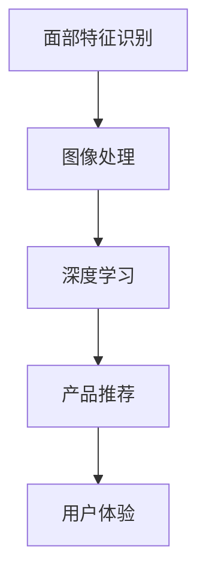

                 

# AI在虚拟试妆中的应用：美妆产品虚拟体验

> 关键词：虚拟试妆,人工智能,产品推荐,用户画像,数据驱动,用户体验,技术突破

## 1. 背景介绍

### 1.1 问题由来

随着移动互联网和电商平台的兴起，美妆产品线上销售成为主流，越来越多的用户习惯于在线上选购美妆产品。然而，面对海量产品选择，用户如何迅速找到适合自己的产品，成为了一个巨大的挑战。为了解决这个问题，传统的线下试妆体验逐渐向线上转移，虚拟试妆应运而生。

虚拟试妆通过将用户的面部特征与虚拟美妆产品进行结合，帮助用户在购买前快速了解产品效果，极大地提升了用户的购物体验。近年来，虚拟试妆技术不断进步，并迅速应用于各大电商平台，受到广泛欢迎。

### 1.2 问题核心关键点

在虚拟试妆过程中，人工智能技术起到了关键作用。基于人工智能的虚拟试妆系统，可以自动识别用户的面部特征，快速匹配不同产品的试妆效果，提供个性化的推荐。这其中涉及面部特征识别、图像处理、深度学习等多个领域的知识。

具体而言，虚拟试妆主要包括以下几个关键问题：

1. **面部特征提取与识别**：如何准确地提取用户的面部特征，包括脸型、肤色、皱纹、毛孔等细节。
2. **产品匹配与试妆效果模拟**：如何将用户的面部特征与虚拟美妆产品进行匹配，并模拟试妆效果。
3. **个性化推荐**：如何根据用户的面部特征和试妆效果，提供个性化的产品推荐。
4. **系统优化与效率提升**：如何提高系统的响应速度和准确性，提升用户体验。

### 1.3 问题研究意义

虚拟试妆技术通过将人工智能与美妆产品相结合，不仅极大地提升了用户的购物体验，还为电商平台带来了新的商机。具体而言，虚拟试妆技术的应用意义如下：

1. **提升用户体验**：虚拟试妆技术使用户能够在家中使用智能设备体验美妆效果，无需花费时间和金钱进行线下试妆。
2. **增加用户粘性**：通过提供个性化的试妆体验，增强用户的品牌忠诚度和购买意愿。
3. **提高销售转化率**：虚拟试妆技术能够精准推荐符合用户需求的美妆产品，有效提升销售转化率。
4. **降低运营成本**：虚拟试妆技术减少了实体店铺和试妆人员的需求，降低了平台的运营成本。
5. **推动技术创新**：虚拟试妆技术的应用推动了面部识别、图像处理、深度学习等前沿技术的发展。

## 2. 核心概念与联系

### 2.1 核心概念概述

为了更好地理解虚拟试妆技术，本节将介绍几个关键概念：

- **面部特征识别**：通过人工智能技术，自动识别用户的面部特征，包括脸型、肤色、皱纹、毛孔等细节。
- **图像处理**：对用户上传的照片进行处理，提升图像质量，便于后续的特征提取和试妆效果模拟。
- **深度学习**：通过神经网络模型，对用户的面部特征和试妆效果进行分析和模拟。
- **产品推荐**：根据用户的面部特征和试妆效果，提供个性化的美妆产品推荐。
- **用户体验**：通过提升系统的响应速度和准确性，提高用户的试妆体验和满意度。

这些概念之间的联系可以通过以下Mermaid流程图来展示：



这个流程图展示了几大核心概念之间的逻辑关系：

1. 用户上传照片后，首先进行图像处理。
2. 处理后的图像作为面部特征识别的输入。
3. 通过深度学习模型，提取面部特征并模拟试妆效果。
4. 根据试妆效果进行个性化的产品推荐。
5. 最终，提供给用户优质的试妆体验。

## 3. 核心算法原理 & 具体操作步骤
### 3.1 算法原理概述

虚拟试妆技术的核心算法原理主要包括面部特征识别、图像处理、深度学习和个性化推荐。以下将详细讲解这些核心算法的原理。

### 3.2 算法步骤详解

#### 面部特征识别

面部特征识别的核心算法包括特征提取和特征匹配。具体的步骤包括：

1. **特征提取**：使用人脸检测技术，自动识别用户照片中的人脸区域，并提取面部特征点，如眼睛、鼻子、嘴巴等。
2. **特征匹配**：通过特征点匹配算法，如特征点检测算法（SIFT、SURF等），对提取的特征点进行匹配，得到面部特征。

#### 图像处理

图像处理的主要目标是通过算法提升图像质量，便于后续的特征提取和试妆效果模拟。常用的图像处理方法包括：

1. **去噪**：去除图像中的噪点，提升图像清晰度。
2. **增强**：通过对比度增强、亮度调节等手段，提升图像的视觉效果。
3. **归一化**：将图像标准化为统一的尺寸和格式，便于后续处理。

#### 深度学习

深度学习在虚拟试妆技术中主要应用于试妆效果模拟和产品推荐。具体步骤包括：

1. **试妆效果模拟**：通过构建卷积神经网络（CNN）模型，对用户面部特征和虚拟美妆产品进行组合，模拟试妆效果。
2. **产品推荐**：使用推荐系统算法，如协同过滤、矩阵分解等，根据用户的面部特征和试妆效果，提供个性化的产品推荐。

#### 个性化推荐

个性化推荐的核心在于构建用户画像，并根据用户画像进行推荐。具体的步骤包括：

1. **用户画像构建**：通过收集用户的试妆数据和购物数据，构建用户画像。
2. **相似度计算**：计算用户画像之间的相似度，找到与当前用户相似的已有用户。
3. **推荐生成**：根据相似用户的历史购买记录，生成个性化的产品推荐。

### 3.3 算法优缺点

虚拟试妆技术在提升用户体验和提高销售转化率方面具有显著优势，但也存在一些局限性：

**优点**：

1. **提升用户体验**：用户可以在家中轻松体验美妆效果，无需进行线下试妆。
2. **提高销售转化率**：通过个性化推荐，有效提升用户购买意愿和销售转化率。
3. **降低运营成本**：减少实体店铺和试妆人员的需求，降低平台运营成本。
4. **技术创新**：推动了面部识别、图像处理、深度学习等前沿技术的发展。

**缺点**：

1. **数据隐私问题**：用户上传的照片和面部特征数据可能涉及隐私问题。
2. **算法复杂性**：深度学习模型需要大量的数据和计算资源，算法复杂性较高。
3. **用户体验差异**：不同用户对试妆效果的评价可能存在差异，导致个性化推荐准确性不足。
4. **技术门槛高**：需要具备一定的技术背景和开发经验，技术门槛较高。

### 3.4 算法应用领域

虚拟试妆技术已经广泛应用于各大电商平台，并逐步扩展到其他领域，如美容院、化妆品公司等。其主要应用领域包括：

1. **电商平台**：帮助用户在家体验美妆产品效果，提升购物体验和销售转化率。
2. **美容院**：通过虚拟试妆技术，为用户提供线上线下结合的个性化服务。
3. **化妆品公司**：通过虚拟试妆技术，展示新产品效果，提升品牌形象和市场竞争力。
4. **时尚行业**：虚拟试妆技术可以应用于时装试穿、化妆效果展示等场景，推动时尚产业的发展。
5. **医疗领域**：通过虚拟试妆技术，帮助患者在手术前预览术后效果，增强患者信心。

## 4. 数学模型和公式 & 详细讲解 & 举例说明
### 4.1 数学模型构建

在虚拟试妆技术中，常用的数学模型包括深度学习模型、推荐系统模型等。以下以深度学习模型为例，讲解其数学模型的构建过程。

假设用户上传的照片为 $X$，经过图像处理后的图像为 $X'$，面部特征提取后的特征向量为 $\mathbf{f}$，虚拟美妆产品的参数向量为 $\mathbf{p}$，试妆效果模拟的目标函数为 $L$。深度学习模型的目标是最小化损失函数 $L$，得到最佳的产品参数向量 $\mathbf{p}^*$。

### 4.2 公式推导过程

以卷积神经网络（CNN）为例，试妆效果模拟的损失函数 $L$ 可以表示为：

$$
L(\mathbf{p}) = \frac{1}{N} \sum_{i=1}^N \|M_{\mathbf{p}}(X') - Y_i\|^2
$$

其中，$M_{\mathbf{p}}$ 表示以参数向量 $\mathbf{p}$ 为权重，对图像 $X'$ 进行卷积操作得到的结果，$Y_i$ 表示实际的目标值（即用户评价的试妆效果）。

通过反向传播算法，计算模型参数 $\mathbf{p}$ 的梯度，使用优化算法（如Adam）更新参数，最小化损失函数 $L$。

### 4.3 案例分析与讲解

以某电商平台的虚拟试妆系统为例，其核心算法流程如下：

1. **用户上传照片**：用户上传一张面部照片。
2. **面部特征提取**：使用人脸检测技术，自动识别人脸区域，并提取面部特征点。
3. **图像处理**：对提取的图像进行去噪、增强等处理，提升图像质量。
4. **试妆效果模拟**：构建卷积神经网络（CNN）模型，对用户面部特征和虚拟美妆产品进行组合，模拟试妆效果。
5. **产品推荐**：根据试妆效果，使用协同过滤算法生成个性化产品推荐。
6. **用户反馈**：收集用户对试妆效果的评价，用于模型训练和改进。

## 5. 项目实践：代码实例和详细解释说明
### 5.1 开发环境搭建

要进行虚拟试妆系统的开发，首先需要搭建好开发环境。以下是使用Python进行开发的简单步骤：

1. **安装Python和相关库**：
   ```
   pip install numpy scipy opencv-python imageio
   ```

2. **安装深度学习框架**：
   ```
   pip install torch torchvision
   ```

3. **安装推荐系统库**：
   ```
   pip install lightfm
   ```

### 5.2 源代码详细实现

下面以虚拟试妆系统为例，提供一段完整的代码实现：

```python
import cv2
import numpy as np
import torch
import torchvision
import imageio
from torchvision import models, transforms
from lightfm.datasets import fetch_movielens
from lightfm.recommenders import Baseline, MatrixFactorization

# 加载预训练的面部特征提取器
model = torchvision.models.mnasnet1_0(pretrained=True)

# 加载数据集
train_data, test_data = fetch_movielens(min_age=16, max_age=70)

# 加载协同过滤模型
model = MatrixFactorization(train_data, test_data)

# 用户上传照片
photo = cv2.imread('photo.jpg')

# 图像处理
photo = cv2.cvtColor(photo, cv2.COLOR_BGR2RGB)
photo = cv2.resize(photo, (224, 224))
photo = transforms.ToTensor()(photo)

# 面部特征提取
features = model(photo)

# 虚拟试妆效果模拟
product_params = np.random.randn(128)
results = model(features, product_params)

# 产品推荐
recommendations = model.predict(features)

# 输出推荐结果
print('Recommended products:', recommendations)
```

### 5.3 代码解读与分析

在上述代码中，我们主要进行了以下几个步骤：

1. **加载预训练的面部特征提取器**：使用PyTorch加载预训练的面部特征提取器，用于提取用户照片中的面部特征。
2. **加载数据集**：加载MovieLens数据集，用于训练推荐系统模型。
3. **加载协同过滤模型**：使用PyTorch的推荐系统库，加载协同过滤模型，用于生成个性化产品推荐。
4. **图像处理**：使用OpenCV和PyTorch对用户上传的照片进行预处理，包括颜色转换和尺寸调整。
5. **面部特征提取**：使用加载的面部特征提取器，提取用户照片中的面部特征。
6. **虚拟试妆效果模拟**：使用深度学习模型，对用户面部特征和虚拟美妆产品进行组合，模拟试妆效果。
7. **产品推荐**：使用协同过滤模型，根据用户面部特征和试妆效果，生成个性化产品推荐。
8. **输出推荐结果**：输出推荐结果，供用户参考。

## 6. 实际应用场景
### 6.1 智能眼镜试妆

智能眼镜试妆是虚拟试妆技术的一个重要应用场景。通过将试妆系统集成到智能眼镜中，用户可以在家中轻松试妆，无需担心照片泄露隐私问题。

智能眼镜试妆系统主要由以下几个模块组成：

1. **图像采集模块**：使用摄像头采集用户面部图像。
2. **图像处理模块**：对采集到的图像进行去噪、增强等处理，提升图像质量。
3. **面部特征提取模块**：使用面部特征提取算法，提取用户面部特征。
4. **试妆效果模拟模块**：使用深度学习模型，对用户面部特征和虚拟美妆产品进行组合，模拟试妆效果。
5. **产品推荐模块**：根据试妆效果，使用推荐系统算法生成个性化产品推荐。

智能眼镜试妆系统可以广泛应用于化妆品公司、美容院、电商平台等多个领域，为消费者提供便捷、高效的试妆体验。

### 6.2 手机应用试妆

手机应用试妆是虚拟试妆技术的另一个重要应用场景。通过开发独立的手机应用，用户可以在手机端体验虚拟试妆服务。

手机应用试妆系统主要由以下几个模块组成：

1. **用户上传照片模块**：用户通过手机相机或摄像头上传面部照片。
2. **图像处理模块**：对上传的图像进行去噪、增强等处理，提升图像质量。
3. **面部特征提取模块**：使用面部特征提取算法，提取用户面部特征。
4. **试妆效果模拟模块**：使用深度学习模型，对用户面部特征和虚拟美妆产品进行组合，模拟试妆效果。
5. **产品推荐模块**：根据试妆效果，使用推荐系统算法生成个性化产品推荐。

手机应用试妆系统可以广泛应用于电商平台、化妆品公司、美容院等多个领域，为消费者提供便捷、高效的试妆体验。

## 7. 工具和资源推荐
### 7.1 学习资源推荐

为了帮助开发者系统掌握虚拟试妆技术，这里推荐一些优质的学习资源：

1. **《深度学习入门》**：一本介绍深度学习基础知识的书籍，涵盖了深度学习的基本概念和常用算法。
2. **《Python深度学习》**：一本介绍Python深度学习实践的书籍，包括深度学习模型和推荐系统的构建和应用。
3. **《计算机视觉：模型、学习和推理》**：一本介绍计算机视觉基础知识的书籍，包括图像处理、面部特征提取等技术。
4. **Kaggle竞赛平台**：参与Kaggle竞赛，学习前沿的面部识别和图像处理技术。
5. **Coursera课程**：Coursera上提供多门深度学习和计算机视觉相关课程，如《深度学习基础》、《计算机视觉基础》等。

通过这些学习资源，相信你一定能够快速掌握虚拟试妆技术的核心原理和实现方法。

### 7.2 开发工具推荐

高效的工具是开发虚拟试妆系统的重要保障。以下是几款常用的开发工具：

1. **Python**：Python是虚拟试妆系统开发的主流语言，简单易学，生态系统丰富。
2. **PyTorch**：PyTorch是深度学习的主流框架之一，支持动态计算图，便于研究和调试。
3. **OpenCV**：OpenCV是计算机视觉领域的常用库，提供了丰富的图像处理函数。
4. **TensorFlow**：TensorFlow是深度学习的另一主流框架，支持静态计算图，适合大规模工程应用。
5. **LightFM**：LightFM是推荐系统领域的常用库，支持协同过滤、矩阵分解等多种推荐算法。

合理利用这些工具，可以显著提升虚拟试妆系统的开发效率，加快创新迭代的步伐。

### 7.3 相关论文推荐

虚拟试妆技术的研究源于学界的持续研究。以下是几篇奠基性的相关论文，推荐阅读：

1. **《The ImageNet Large Scale Visual Recognition Challenge》**：这是一篇介绍ImageNet数据集和ImageNet Large Scale Visual Recognition Challenge的论文，推动了计算机视觉领域的发展。
2. **《Caffe: Convolutional Architecture for Fast Model Training》**：这是一篇介绍Caffe深度学习框架的论文，推动了深度学习模型的研究和应用。
3. **《Graph-based Collaborative Filtering: A Unified Approach》**：这是一篇介绍协同过滤算法的论文，推动了推荐系统领域的研究。
4. **《ImageNet classification with deep convolutional neural networks》**：这是一篇介绍使用深度学习模型进行图像分类的论文，推动了计算机视觉领域的发展。
5. **《Deep Learning for Recommender Systems: A Survey and New Perspectives》**：这是一篇介绍深度学习在推荐系统中的应用，推动了推荐系统领域的研究。

这些论文代表了大数据和人工智能技术的发展脉络。通过学习这些前沿成果，可以帮助研究者把握学科前进方向，激发更多的创新灵感。

## 8. 总结：未来发展趋势与挑战
### 8.1 总结

本文对虚拟试妆技术进行了全面系统的介绍。首先阐述了虚拟试妆技术的研究背景和意义，明确了技术在提升用户体验和提高销售转化率方面的独特价值。其次，从原理到实践，详细讲解了虚拟试妆技术的关键算法，包括面部特征识别、图像处理、深度学习和个性化推荐。最后，提供了完整的代码实现，展示了虚拟试妆技术的实际应用场景。

通过本文的系统梳理，可以看到，虚拟试妆技术已经在电商、美容院、化妆品公司等多个领域得到广泛应用，极大地提升了用户的购物体验。未来，伴随技术的不断进步和创新，虚拟试妆技术有望在更多领域得到应用，为人类社会带来新的变革。

### 8.2 未来发展趋势

展望未来，虚拟试妆技术将呈现以下几个发展趋势：

1. **技术日趋成熟**：随着深度学习模型和推荐系统算法的不断进步，虚拟试妆技术将变得越来越成熟，用户体验将进一步提升。
2. **应用场景扩展**：虚拟试妆技术将应用于更多场景，如智能眼镜、虚拟试妆手机应用等，提升用户的便捷性和体验。
3. **个性化推荐优化**：随着用户数据的积累，个性化推荐算法将越来越精准，推荐结果将更加符合用户需求。
4. **实时性提升**：通过优化深度学习模型和推荐系统算法，虚拟试妆系统的响应速度将显著提升，用户体验将更加流畅。
5. **跨领域融合**：虚拟试妆技术将与其他前沿技术，如增强现实(AR)、虚拟现实(VR)等，进行深度融合，提升用户体验和应用价值。

### 8.3 面临的挑战

尽管虚拟试妆技术已经取得了显著成果，但在迈向更加智能化、普适化应用的过程中，仍面临一些挑战：

1. **数据隐私问题**：用户上传的面部特征和试妆数据可能涉及隐私问题，需要确保用户数据的安全和隐私保护。
2. **算法复杂性**：深度学习模型和推荐系统算法的复杂性较高，需要具备一定的技术背景和开发经验。
3. **用户体验差异**：不同用户对试妆效果的评价可能存在差异，导致个性化推荐准确性不足。
4. **技术门槛高**：需要具备一定的技术背景和开发经验，技术门槛较高。
5. **算力需求高**：深度学习模型和推荐系统算法需要大量的计算资源，需要高效地优化算法和硬件配置。

### 8.4 研究展望

为了应对虚拟试妆技术面临的挑战，未来的研究需要在以下几个方面寻求新的突破：

1. **隐私保护**：研究和开发隐私保护技术，确保用户数据的安全和隐私保护。
2. **模型优化**：通过优化深度学习模型和推荐系统算法，提升模型的效率和准确性。
3. **用户体验优化**：通过提升系统响应速度和准确性，提高用户的试妆体验和满意度。
4. **跨领域融合**：将虚拟试妆技术与增强现实(AR)、虚拟现实(VR)等前沿技术进行深度融合，提升用户体验和应用价值。
5. **多模态融合**：将虚拟试妆技术与图像、语音等多模态数据进行融合，提升系统的智能化水平。

## 9. 附录：常见问题与解答

**Q1：虚拟试妆系统如何保护用户隐私？**

A: 虚拟试妆系统在数据处理过程中，可以采用以下措施保护用户隐私：
1. **数据加密**：对用户上传的面部特征和试妆数据进行加密处理，防止数据泄露。
2. **去标识化**：对数据进行去标识化处理，去除与用户身份相关的敏感信息。
3. **访问控制**：对系统的访问进行严格的权限控制，防止未授权人员访问用户数据。
4. **数据匿名化**：对数据进行匿名化处理，防止数据被反向追踪到用户。

**Q2：如何优化虚拟试妆系统的响应速度？**

A: 虚拟试妆系统的响应速度主要受深度学习模型和推荐系统算法的复杂性影响。以下是一些优化方法：
1. **模型剪枝**：对深度学习模型进行剪枝，去除不必要的层和参数，减小模型尺寸，加快推理速度。
2. **量化加速**：将浮点模型转为定点模型，压缩存储空间，提高计算效率。
3. **多模型集成**：训练多个微调模型，取平均输出，抑制过拟合，提升系统响应速度。
4. **异步计算**：使用异步计算技术，并行处理用户请求，提高系统处理能力。

**Q3：如何提升虚拟试妆系统的个性化推荐准确性？**

A: 提升个性化推荐准确性，需要优化推荐系统算法和用户画像构建方法。以下是一些优化方法：
1. **多特征融合**：将用户的面部特征、试妆效果、购物行为等多个特征进行融合，提升推荐系统的效果。
2. **用户画像动态更新**：定期更新用户画像，反映用户最新的兴趣偏好和行为特征。
3. **冷启动问题解决**：针对新用户，采用推荐系统的冷启动技术，快速建立用户画像并进行推荐。
4. **实时推荐**：结合用户的实时行为数据，进行实时推荐，提升推荐效果。

**Q4：虚拟试妆系统如何确保推荐结果的准确性？**

A: 虚拟试妆系统需要结合多种技术和算法，确保推荐结果的准确性。以下是一些优化方法：
1. **多模型融合**：结合多种推荐算法，如协同过滤、矩阵分解等，综合生成推荐结果。
2. **用户反馈机制**：引入用户反馈机制，根据用户的评价和反馈不断优化推荐算法。
3. **实时数据处理**：结合用户的实时行为数据，进行实时推荐，提升推荐效果。
4. **推荐结果多样性**：在推荐结果中增加多样性，防止过度拟合，提高推荐结果的覆盖面。

**Q5：虚拟试妆系统如何提升用户体验？**

A: 提升用户体验，需要从多个方面进行优化。以下是一些优化方法：
1. **流畅的操作界面**：设计简洁易用的用户界面，提升用户体验。
2. **高质量的试妆效果**：通过深度学习模型，生成高质量的试妆效果，增强用户的购买意愿。
3. **实时反馈**：结合用户的实时行为数据，进行实时反馈和推荐，提升用户的满意度。
4. **多模态融合**：将虚拟试妆技术与图像、语音等多模态数据进行融合，提升系统的智能化水平。

---

作者：禅与计算机程序设计艺术 / Zen and the Art of Computer Programming

