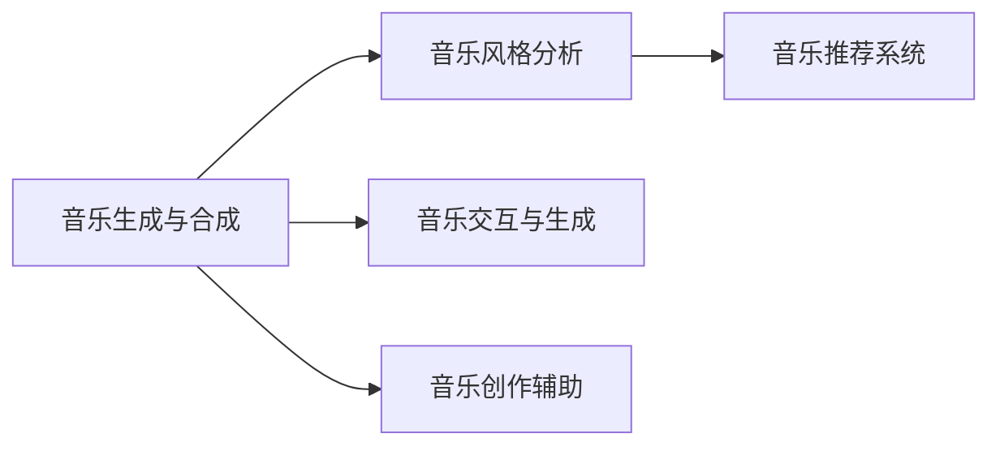

                 

## 1. 背景介绍

### 1.1 问题由来

音乐，作为人类情感的表达，拥有悠久的历史和丰富的文化内涵。传统音乐创作过程涉及作曲、编曲、演奏等诸多环节，需要深厚的音乐理论基础和丰富的创作经验。然而，随着人工智能技术的迅速发展，AI在音乐创作领域的应用成为热门话题。

### 1.2 问题核心关键点

AI在音乐创作中的应用，主要体现在以下几个方面：
- **音乐生成与合成**：AI通过学习大量的音乐数据，能够自动生成新的音乐作品，甚至合成前所未有的音乐风格。
- **音乐风格分析与转换**：AI可以对音乐进行风格分析，将一种风格的音乐转换为另一种风格。
- **音乐推荐与个性化定制**：基于用户偏好，AI可以推荐音乐作品，甚至根据用户喜好生成个性化的音乐。
- **音乐教育和辅助创作**：AI可以通过分析音乐作品，提供创作建议，辅助作曲家和音乐家完成创作。
- **实时音乐生成与交互**：AI能够实时生成音乐，与人类进行交互，提升音乐创作体验。

### 1.3 问题研究意义

AI在音乐创作中的应用，不仅能够促进音乐的创新和多样化，还能降低创作门槛，为音乐爱好者和专业人士提供更多创作工具和灵感。然而，AI的介入也带来了新的挑战，如版权问题、创作道德等，需要进一步探讨和解决。

## 2. 核心概念与联系

### 2.1 核心概念概述

为更好地理解AI在音乐创作中的应用，本节将介绍几个关键概念：

- **音乐生成与合成**：指利用AI算法，从音乐数据中学习并生成新的音乐作品。
- **音乐风格分析**：指通过机器学习算法，对音乐作品进行风格分类和特征提取。
- **音乐推荐系统**：基于用户的音乐偏好，推荐相似或相关音乐作品的系统。
- **音乐交互与生成**：指AI能够实时生成音乐，与人类进行互动，如生成即兴演奏等。

这些核心概念之间存在紧密的联系，共同构成了AI在音乐创作中的应用框架。

### 2.2 核心概念原理和架构的 Mermaid 流程图



此流程图展示了音乐生成与合成、音乐风格分析、音乐推荐系统、音乐交互与生成以及音乐创作辅助之间的联系。

## 3. 核心算法原理 & 具体操作步骤
### 3.1 算法原理概述

AI在音乐创作中的应用，主要基于机器学习和深度学习的算法。其核心思想是：通过训练模型，使其能够从音乐数据中学习并生成新的音乐作品，或者根据用户偏好推荐音乐。

### 3.2 算法步骤详解

基于深度学习的音乐生成与合成的基本步骤如下：

**Step 1: 数据收集与预处理**

- 收集大量的音乐数据，包括各种风格、流派和历史时期的音乐作品。
- 对数据进行预处理，如去除噪声、归一化等，使其适合深度学习模型的输入。

**Step 2: 特征提取与表示**

- 使用MFCC、音高、节奏等特征对音乐进行表示，提取音乐作品的关键信息。
- 使用卷积神经网络(CNN)或循环神经网络(RNN)对音乐特征进行编码。

**Step 3: 模型训练与生成**

- 使用深度生成模型(如GAN、VAE、RNN)对音乐进行生成。
- 通过训练模型，使其能够生成新的音乐作品。

**Step 4: 音乐风格转换与推荐**

- 使用风格迁移算法，将一种风格的音乐转换为另一种风格。
- 基于用户偏好，使用协同过滤、矩阵分解等算法进行音乐推荐。

### 3.3 算法优缺点

**优点**：
- 能够自动生成新的音乐作品，提高创作效率。
- 能够进行音乐风格的转换，丰富音乐创作形式。
- 可以根据用户偏好，个性化推荐音乐，提升用户体验。

**缺点**：
- 生成的音乐可能缺乏创新性，缺乏人类的情感深度。
- 音乐推荐系统可能存在数据偏差，推荐结果不够客观。
- 风格转换可能导致音乐失去原有特色，不符合预期。

### 3.4 算法应用领域

AI在音乐创作中的应用，广泛涉及以下几个领域：
- **音乐创作与制作**：如作曲、编曲、音效设计等。
- **音乐教育与辅助**：如音乐分析、创作建议、技能训练等。
- **音乐推荐与娱乐**：如音乐播放列表推荐、个性化定制等。
- **实时音乐表演**：如即兴演奏、实时伴奏等。

## 4. 数学模型和公式 & 详细讲解 & 举例说明

### 4.1 数学模型构建

音乐生成与合成的核心数学模型为变分自编码器(VAE)和生成对抗网络(GAN)。

**VAE模型**：
$$
\begin{aligned}
p(z) &= \mathcal{N}(0, I) \\
p(x|z) &= \prod_{i=1}^D \mathcal{N}(x_i | \mu_i(z), \sigma_i(z))
\end{aligned}
$$

其中，$z$ 为隐变量，$x$ 为音乐信号，$\mu_i(z)$ 和 $\sigma_i(z)$ 分别为音乐信号的均值和方差。

**GAN模型**：
$$
\begin{aligned}
G(z) &= \mu(z) \\
D(x) &= \frac{1}{2}[\log(D(x)) + (1 - D(G(z)))]
\end{aligned}
$$

其中，$G(z)$ 为生成器，$D(x)$ 为判别器，$z$ 为随机噪声向量。

### 4.2 公式推导过程

以VAE模型为例，推导其在音乐生成中的应用。

- **编码器**：使用CNN对音乐信号进行编码，提取音乐特征。
- **解码器**：使用CNN对编码后的特征进行解码，生成新的音乐信号。
- **损失函数**：使用重构损失和正则化损失对模型进行训练。

重构损失为：
$$
\begin{aligned}
\mathcal{L}_{recon} &= \frac{1}{2} \sum_{i=1}^N ||z_i - z_{\hat{i}}||^2
\end{aligned}
$$

正则化损失为：
$$
\begin{aligned}
\mathcal{L}_{reg} &= \sum_{i=1}^N \frac{1}{2}(\log \sigma_i(z_i) + \sigma_i(z_i) + \mu_i(z_i)^2)
\end{aligned}
$$

总损失函数为：
$$
\begin{aligned}
\mathcal{L} &= \mathcal{L}_{recon} + \beta \mathcal{L}_{reg}
\end{aligned}
$$

其中，$\beta$ 为正则化系数。

### 4.3 案例分析与讲解

以一个简单的音乐生成案例为例，展示VAE在音乐生成中的应用：

- **数据准备**：使用MFCC提取音乐的特征，将其转化为向量形式。
- **模型训练**：使用CNN对音乐特征进行编码，生成隐变量$z$。
- **音乐生成**：使用CNN对$z$进行解码，生成新的音乐信号。
- **评估与优化**：使用重构损失和正则化损失对模型进行评估和优化。

## 5. 项目实践：代码实例和详细解释说明

### 5.1 开发环境搭建

开发音乐生成与合成应用，需要以下环境：
- Python 3.6+
- TensorFlow 2.x
- NumPy
- librosa
- Matplotlib

### 5.2 源代码详细实现

下面以VAE在音乐生成中的应用为例，展示完整的代码实现。

```python
import tensorflow as tf
import numpy as np
import librosa
import matplotlib.pyplot as plt

# 定义VAE模型
class VAE(tf.keras.Model):
    def __init__(self, latent_dim=128, layers=[(32, 3, 2), (64, 4, 2), (64, 5, 2), (128, 6, 2)]):
        super(VAE, self).__init__()
        self.layers = []
        for units, kernel_size, strides in layers:
            self.layers.append(tf.keras.layers.Conv2D(units, kernel_size, strides, padding='same', activation='relu'))
        self.layers.append(tf.keras.layers.Conv2D(1, 3, strides=1, padding='same', activation='sigmoid'))
        
    def encode(self, x):
        for layer in self.layers:
            x = layer(x)
        return x
    
    def decode(self, x):
        for layer in reversed(self.layers):
            x = layer(x)
        return x
    
    def reparametrize(self, z_mean, z_log_var):
        epsilon = tf.random.normal(shape=tf.shape(z_mean))
        return z_mean + tf.exp(z_log_var/2) * epsilon
    
    def call(self, x):
        z_mean, z_log_var = self.encode(x)
        z = self.reparametrize(z_mean, z_log_var)
        x_hat = self.decode(z)
        return x_hat, z_mean, z_log_var

# 加载音乐数据
data, sr = librosa.load('music.mp3', sr=44100)

# 预处理数据
x = librosa.feature.mfcc(y=data, sr=sr, n_mfcc=40).T.reshape(1, 1, 40, 1)

# 训练VAE模型
model = VAE()
optimizer = tf.keras.optimizers.Adam(learning_rate=0.001)
loss_fn = tf.keras.losses.MeanSquaredError()

@tf.function
def train_step(x):
    with tf.GradientTape() as tape:
        x_hat, z_mean, z_log_var = model(x)
        loss = loss_fn(x_hat, x) + 0.001 * tf.reduce_mean(z_mean**2 + tf.exp(z_log_var) - 2*z_mean*z_log_var)
    grads = tape.gradient(loss, model.trainable_variables)
    optimizer.apply_gradients(zip(grads, model.trainable_variables))
    return loss

for epoch in range(100):
    train_loss = 0.0
    for x in data:
        train_loss += train_step(x)
    print('Epoch', epoch+1, 'train loss:', train_loss.numpy())

# 生成音乐
z_mean, z_log_var = model.encode(x)
z = model.reparametrize(z_mean, z_log_var)
x_hat = model.decode(z)
librosa.output.write_wav('generated_music.wav', x_hat.numpy(), sr)
plt.imshow(x_hat.numpy(), cmap='gray')
plt.show()
```

### 5.3 代码解读与分析

**VAE模型定义**：定义VAE模型结构，包含多个卷积层和一个解码器。

**数据加载与预处理**：使用librosa加载音乐数据，使用MFCC提取音乐特征。

**模型训练**：使用Adam优化器对模型进行训练，使用均方误差损失函数。

**音乐生成**：使用训练好的模型生成新的音乐，使用librosa将其保存为音频文件。

## 6. 实际应用场景

### 6.1 音乐创作与制作

音乐创作与制作是AI在音乐领域应用最广泛的场景之一。AI可以通过学习大量音乐数据，自动生成新的音乐作品，甚至帮助作曲家完成创作。

### 6.2 音乐教育与辅助

AI在音乐教育中的应用，主要体现在音乐分析、创作建议和技能训练等方面。AI可以分析音乐作品的结构、和声等，提供创作建议，辅助音乐家完成作品。

### 6.3 音乐推荐与娱乐

基于用户偏好，AI可以推荐相似或相关音乐作品，提升用户体验。音乐推荐系统在音乐流媒体平台中应用广泛，如Spotify、Apple Music等。

### 6.4 实时音乐表演

AI能够实时生成音乐，与人类进行互动，提升音乐创作体验。例如，在即兴演奏中，AI可以实时生成伴奏，与演奏者互动。

## 7. 工具和资源推荐

### 7.1 学习资源推荐

为了帮助开发者系统掌握AI在音乐创作中的应用，这里推荐一些优质的学习资源：

1. Coursera《深度学习与音乐创作》课程：介绍深度学习在音乐创作中的应用，涵盖音乐生成、音乐风格分析等多个方面。
2. 《音乐生成与合成的数学基础》书籍：详细介绍音乐生成与合成的数学模型和算法，适合深入学习。
3. TensorFlow Music: TensorFlow官方提供的音乐生成工具包，包含多种音乐生成算法和模型。
4. PyTorch Music: PyTorch官方提供的音乐生成工具包，支持多种音乐生成算法和模型。

### 7.2 开发工具推荐

高效的开发离不开优秀的工具支持。以下是几款用于AI在音乐创作应用开发的常用工具：

1. TensorFlow: 基于数据流图的深度学习框架，适合构建音乐生成和音乐推荐系统。
2. PyTorch: 动态计算图的深度学习框架，适合构建音乐生成和音乐推荐系统。
3. librosa: Python音乐分析库，提供多种音频处理和特征提取功能。
4. IPython Notebook: 交互式开发环境，支持代码调试和可视化展示。

### 7.3 相关论文推荐

AI在音乐创作中的应用，得益于学界的持续研究。以下是几篇奠基性的相关论文，推荐阅读：

1. <a href="https://arxiv.org/abs/1703.10616">WavesGAN: Music Waveform Generation from Scratch with Wasserstein GAN</a>：提出WavesGAN模型，使用Wasserstein GAN生成音乐波形。
2. <a href="https://arxiv.org/abs/1703.08895">Music Transformer</a>：提出Music Transformer模型，使用Transformer生成音乐作品。
3. <a href="https://arxiv.org/abs/1802.05247">MIDI-RNN: A Multi-dimensional Long Short-term Memory for Compositional Pattern Discovery</a>：提出MIDI-RNN模型，使用LSTM生成MIDI音乐。
4. <a href="https://arxiv.org/abs/1805.06754">Jukebox: A Generative Adversarial Network for Music</a>：提出Jukebox模型，使用GAN生成多种风格的音乐作品。
5. <a href="https://arxiv.org/abs/1904.08784">F-Net: Flexible Music Generation Network</a>：提出F-Net模型，使用GAN生成高质量的音乐作品。

## 8. 总结：未来发展趋势与挑战

### 8.1 总结

本文对AI在音乐创作中的应用进行了全面系统的介绍。首先阐述了AI在音乐创作中的研究背景和应用场景，明确了其在音乐生成、风格分析、音乐推荐等方面的独特价值。其次，从原理到实践，详细讲解了音乐生成与合成的数学模型和算法，提供了完整的代码实现和解释分析。同时，本文还探讨了AI在音乐创作中的未来发展趋势和面临的挑战，强调了其在音乐教育和辅助创作等方面的潜力。

通过本文的系统梳理，可以看到，AI在音乐创作中的应用具有广阔的前景，为音乐创作和教育提供了新的思路和工具。然而，AI的介入也带来了版权、伦理等新的挑战，需要进一步探讨和解决。

### 8.2 未来发展趋势

展望未来，AI在音乐创作中的应用将呈现以下几个发展趋势：

1. **音乐生成技术进步**：随着深度学习和生成对抗网络等技术的发展，音乐生成质量将进一步提升，生成过程将更加灵活高效。
2. **音乐风格多样化**：AI将能够生成更多风格的音乐，甚至创造出全新的音乐风格。
3. **音乐教育与辅助工具普及**：AI将提供更多音乐教育和辅助工具，提升音乐创作和演奏水平。
4. **实时音乐生成与交互**：AI将实现更加实时、互动的音乐生成，提升用户体验。
5. **音乐推荐系统的智能化**：AI将进一步提升音乐推荐系统的智能化水平，提供更加个性化和精准的推荐。

以上趋势凸显了AI在音乐创作中的巨大潜力，将进一步推动音乐创作和教育的创新发展。

### 8.3 面临的挑战

尽管AI在音乐创作中的应用前景广阔，但仍面临诸多挑战：

1. **版权问题**：AI生成音乐可能侵犯原作者的版权，需要进一步探索版权归属和保护机制。
2. **创作伦理**：AI生成音乐可能缺乏人类的情感深度和创造性，需要探索如何赋予AI更多的艺术感和创造性。
3. **数据质量**：音乐数据的收集和预处理需要大量的资源和时间，需要进一步优化数据质量。
4. **模型鲁棒性**：AI生成的音乐可能存在偏差和噪声，需要提高模型的鲁棒性和稳定性。
5. **应用场景限制**：AI在特定应用场景中的表现可能受到数据和算法的限制，需要进一步探索和优化。

这些挑战需要在未来的研究和实践中逐步克服，才能进一步推动AI在音乐创作中的应用和发展。

### 8.4 研究展望

面向未来，AI在音乐创作中的应用研究需要在以下几个方面进行探索：

1. **生成模型的改进**：开发更加高效的生成模型，提高音乐生成质量和多样性。
2. **创作伦理的探讨**：探索如何赋予AI更多的艺术感和创造性，提升音乐创作的人文价值。
3. **数据质量的提升**：优化音乐数据的收集和预处理，提高数据质量。
4. **模型鲁棒性的增强**：提高模型的鲁棒性和稳定性，减少偏差和噪声。
5. **应用场景的扩展**：探索AI在更多应用场景中的表现和潜力，推动AI在音乐创作中的广泛应用。

这些研究方向的探索，必将引领AI在音乐创作中的应用迈向更高的台阶，为音乐创作和教育提供新的动力和工具。

## 9. 附录：常见问题与解答

**Q1: AI生成音乐是否会替代人类作曲家？**

A: AI在音乐创作中的应用，主要在于辅助和提高创作效率，而非替代人类作曲家。人类作曲家的情感深度和创造力仍然无法被AI完全替代。AI可以提供创作灵感和建议，但最终的创作决策仍需人类作曲家完成。

**Q2: AI生成音乐是否存在版权问题？**

A: AI生成音乐可能存在版权问题，尤其是在使用现有的音乐数据进行训练时。需要进一步探索版权归属和保护机制，确保AI生成音乐的合法性和透明性。

**Q3: AI生成的音乐是否缺乏情感深度？**

A: AI生成的音乐可能缺乏人类的情感深度和创造性，但其多样性和创新性是AI的优势。通过不断的优化和改进，AI生成的音乐有望更好地结合人类的情感和创造力，成为创作的重要工具。

**Q4: 如何在AI音乐创作中避免过度拟合？**

A: 在AI音乐创作中，避免过度拟合可以通过数据增强、正则化、对抗训练等方法。需要结合具体任务和数据特点，选择合适的方法进行优化。

**Q5: 如何在AI音乐创作中提高模型的泛化能力？**

A: 在AI音乐创作中，提高模型的泛化能力可以通过多模态融合、风格迁移等方法。需要结合具体任务和数据特点，选择合适的方法进行优化。

---

作者：禅与计算机程序设计艺术 / Zen and the Art of Computer Programming

