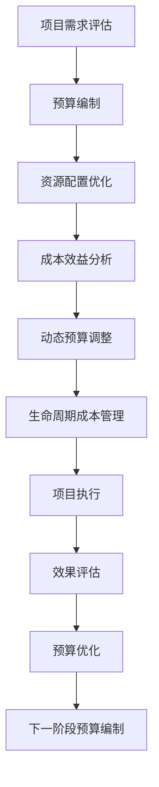

                 

# AI基础设施的成本预测：Lepton AI的财务规划

## 1. 背景介绍

随着人工智能技术的迅猛发展，企业对于AI基础设施的需求日益增长。如何在保证技术领先性的同时，合理规划和控制AI项目成本，成为每个企业AI团队都必须面对的挑战。Lepton AI作为行业领先的AI基础设施提供商，拥有丰富的大规模AI项目经验，本文将详细介绍Lepton AI的财务规划方法，为企业AI项目的预算编制提供借鉴和参考。

### 1.1 问题由来

近年来，越来越多的企业开始重视AI技术在业务创新和流程优化中的应用。然而，AI项目的高昂成本和复杂性往往让企业在预算规划和资源配置上感到困惑。如何科学合理地估算AI项目的总成本，成为了企业AI管理中的一大难题。

### 1.2 问题核心关键点

大笔预算的分配和投入是AI项目成功的关键因素之一，但在不同阶段进行合理的财务规划和预算分配，才能确保AI项目高效推进。核心关键点包括：
1. 明确AI项目的技术要求和业务目标。
2. 分阶段进行预算编制和成本控制。
3. 考虑基础设施的运行维护成本。
4. 结合AI项目的实际效果进行动态调整。

### 1.3 问题研究意义

科学合理地规划AI项目的财务，不仅可以有效控制预算，避免资源浪费，还能确保AI项目在各个阶段的顺利推进，实现预期效果。在实践中，Lepton AI已经与众多企业合作，帮助他们在AI项目的不同阶段进行合理的财务规划，确保项目的成功落地。

## 2. 核心概念与联系

### 2.1 核心概念概述

为更好地理解Lepton AI的财务规划方法，本文将介绍几个密切相关的核心概念：

- **AI项目预算编制**：指根据AI项目的技术需求和业务目标，进行详细的预算规划，确保每个环节的资源需求得到满足。
- **资源配置优化**：指在有限的预算内，合理分配各项资源，如硬件设备、软件工具、人力成本等，提高AI项目的效率和效果。
- **成本效益分析**：通过评估AI项目的成本效益，确保项目投入产出比最大化。
- **动态预算调整**：指根据AI项目的实际进展和效果，灵活调整预算和资源配置，确保项目按期完成。
- **AI基础设施生命周期成本管理**：指在AI项目全生命周期内，对基础设施的采购、部署、运营、维护等各项成本进行全面管理，确保整体成本可控。

这些核心概念之间存在紧密的联系，共同构成了Lepton AI财务规划的基础框架。

### 2.2 核心概念原理和架构的 Mermaid 流程图



该流程图展示了Lepton AI财务规划的关键环节，通过不断循环迭代，确保AI项目在预算和资源上的高效管理。

## 3. 核心算法原理 & 具体操作步骤

### 3.1 算法原理概述

Lepton AI的财务规划方法主要基于成本效益分析和动态预算调整的原理。核心思想是：通过细致的预算编制和合理的资源配置，确保AI项目的每个环节都有充足的预算支持。同时，通过持续的成本效益分析和动态调整，优化资源配置，确保项目在预算范围内高效推进。

具体而言，Lepton AI的财务规划分为以下几个步骤：
1. **需求评估与预算编制**：根据AI项目的技术要求和业务目标，进行详细的需求评估，并制定详细的预算编制计划。
2. **资源配置优化**：在有限的预算内，通过合理的资源分配，确保各项资源的有效利用。
3. **成本效益分析**：评估AI项目的各项成本和效益，确保项目的投入产出比最大化。
4. **动态预算调整**：根据AI项目的实际进展和效果，灵活调整预算和资源配置，确保项目按期完成。
5. **生命周期成本管理**：在AI项目全生命周期内，对基础设施的各项成本进行全面管理，确保整体成本可控。

### 3.2 算法步骤详解

以下将详细介绍Lepton AI财务规划的各个步骤：

#### 3.2.1 需求评估与预算编制

**Step 1: 需求评估**

Lepton AI的财务规划始于对AI项目的需求评估。通过与客户深入沟通，明确项目的技术要求和业务目标。评估内容包括但不限于：
- AI技术的选型和应用场景
- 数据收集和处理需求
- 项目的时间节点和优先级
- 预计的业务影响和ROI（投资回报率）

评估完成后，形成详细的需求文档，为后续的预算编制提供依据。

**Step 2: 预算编制**

根据需求评估结果，制定详细的预算编制计划。预算编制包括：
- AI硬件设备的采购成本
- AI软件工具的许可和维护费用
- 人力成本（包括工程师薪资、外包费用等）
- 基础设施的运行维护费用
- 其他不可预见费用

预算编制应细化到每个阶段和任务，确保每个环节的预算需求得到满足。

#### 3.2.2 资源配置优化

**Step 1: 资源分配**

根据预算编制计划，合理分配各项资源。资源分配应考虑以下几个因素：
- AI硬件设备的性能和兼容性
- AI软件工具的功能和扩展性
- 团队成员的技能和经验
- 基础设施的可用性和可扩展性

通过细致的资源分配，确保各项资源能够高效利用，避免资源浪费。

**Step 2: 资源监控与调整**

在项目推进过程中，持续监控各项资源的利用情况，根据实际进展和效果进行动态调整。资源监控和调整应考虑以下几个因素：
- 硬件设备的利用率和性能
- 软件工具的使用频率和效率
- 团队成员的工作负载和满意度
- 基础设施的负载和可用性

通过持续的资源监控和调整，确保项目在预算范围内高效推进。

#### 3.2.3 成本效益分析

**Step 1: 成本识别**

识别AI项目各个环节的成本，包括但不限于：
- 硬件设备采购和部署成本
- 软件工具许可和维护费用
- 人力成本
- 基础设施的运营和维护费用
- 其他不可预见费用

通过全面的成本识别，确保每个环节的成本都得到充分考虑。

**Step 2: 效益评估**

评估AI项目各个环节的效益，包括但不限于：
- 业务流程的优化和效率提升
- 运营成本的降低
- 收入和利润的增加
- 品牌和客户满意度的提升

通过全面的效益评估，确保项目的投入产出比最大化。

**Step 3: 成本效益分析**

将各项成本与效益进行对比分析，评估项目的整体效益。成本效益分析应考虑以下几个因素：
- 项目的投资回报率
- 各项成本的优先级和合理性
- 效益的长期性和可持续性
- 项目的风险和不确定性

通过全面的成本效益分析，确保项目的财务规划科学合理。

#### 3.2.4 动态预算调整

**Step 1: 预算监控**

在项目推进过程中，持续监控预算执行情况，确保各项预算得到有效利用。预算监控应考虑以下几个因素：
- 各阶段预算的实际使用情况
- 资源配置的合理性和有效性
- 成本效益分析的实际效果
- 项目的进展和效果

通过持续的预算监控，确保项目按期完成。

**Step 2: 预算调整**

根据预算监控结果，灵活调整预算和资源配置，确保项目在预算范围内高效推进。预算调整应考虑以下几个因素：
- 实际进展与预算的差异
- 资源配置的优化方案
- 成本效益分析的改进措施
- 项目优先级的调整

通过灵活的预算调整，确保项目在预算范围内高效推进。

#### 3.2.5 生命周期成本管理

**Step 1: 全生命周期成本评估**

在AI项目全生命周期内，对基础设施的各项成本进行全面评估，确保整体成本可控。全生命周期成本评估应考虑以下几个因素：
- 硬件设备的采购、部署和维护成本
- 软件工具的许可、维护和升级费用
- 人力成本
- 基础设施的运营和维护费用
- 其他不可预见费用

通过全面的全生命周期成本评估，确保整体成本可控。

**Step 2: 成本管理措施**

根据全生命周期成本评估结果，采取相应的成本管理措施。成本管理措施应考虑以下几个因素：
- 采购成本的控制
- 部署成本的优化
- 维护成本的降低
- 升级和扩容的合理性
- 其他不可预见费用的预防

通过有效的成本管理措施，确保整体成本可控。

### 3.3 算法优缺点

Lepton AI的财务规划方法具有以下优点：
1. **科学合理**：通过细致的需求评估和全面的成本效益分析，确保AI项目的财务规划科学合理。
2. **动态调整**：根据AI项目的实际进展和效果，灵活调整预算和资源配置，确保项目高效推进。
3. **资源优化**：通过合理的资源分配和监控，确保各项资源高效利用，避免资源浪费。
4. **风险控制**：通过全面的成本效益分析和全生命周期成本管理，确保项目的风险可控。

同时，该方法也存在以下局限性：
1. **需求评估复杂**：对客户需求评估的深度和准确度要求较高，否则可能导致预算编制不合理。
2. **动态调整复杂**：需要持续监控各项资源和预算执行情况，工作量较大。
3. **成本识别全面性**：需要全面识别各项成本，避免遗漏。

尽管存在这些局限性，但就目前而言，Lepton AI的财务规划方法仍然是大规模AI项目预算编制和成本控制的有效手段。未来相关研究的重点在于如何进一步简化需求评估和预算调整流程，提高整体效率。

### 3.4 算法应用领域

Lepton AI的财务规划方法不仅适用于大规模AI项目，还广泛应用于各类AI应用场景，例如：

- **智能客服**：对智能客服系统的预算编制和资源配置进行合理规划，确保系统稳定高效运行。
- **金融风控**：对金融风险控制模型的预算编制和成本效益进行评估，确保模型在预算范围内高效运行。
- **医疗诊断**：对医疗诊断系统的预算编制和资源配置进行优化，确保系统在预算范围内高效运行。
- **智慧城市**：对智慧城市系统的预算编制和成本效益进行全面管理，确保系统在预算范围内高效运行。
- **自动驾驶**：对自动驾驶系统的预算编制和资源配置进行优化，确保系统在预算范围内高效运行。

以上场景均需要科学合理的财务规划，以确保项目的成功实施和高效运行。

## 4. 数学模型和公式 & 详细讲解

### 4.1 数学模型构建

Lepton AI的财务规划方法主要基于成本效益分析的数学模型。假设AI项目在t时刻的总成本为C(t)，总收入为R(t)，则其效益E(t)可表示为：

$$
E(t) = R(t) - C(t)
$$

其中：
- R(t)为项目在t时刻的总收入，包括直接收入和间接收入。
- C(t)为项目在t时刻的总成本，包括直接成本和间接成本。

效益E(t)越大，说明项目在t时刻的效益越好。

### 4.2 公式推导过程

为了更好地理解成本效益分析的数学模型，我们将对上述公式进行推导。

**Step 1: 定义成本和效益**

- 项目在t时刻的直接成本C_d(t)包括硬件设备采购、软件工具许可和维护费用、人力成本等。
- 项目在t时刻的间接成本C_i(t)包括基础设施的运营和维护费用、其他不可预见费用等。
- 项目在t时刻的总收入R(t)包括直接收入R_d(t)和间接收入R_i(t)。

**Step 2: 成本和效益公式**

根据定义，可以得到成本和效益的公式：

$$
C(t) = C_d(t) + C_i(t)
$$

$$
E(t) = R(t) - C(t) = R(t) - (C_d(t) + C_i(t))
$$

**Step 3: 成本效益分析公式**

成本效益分析公式为：

$$
E(t) = R(t) - C_d(t) - C_i(t)
$$

该公式展示了如何在不同时间点上评估项目的效益，通过持续的成本效益分析，确保项目的投入产出比最大化。

### 4.3 案例分析与讲解

以Lepton AI在一家大型企业的AI项目中应用的财务规划为例，进行详细讲解。

**案例背景**

Lepton AI为某大型企业构建了一个智能客服系统，项目包括硬件设备采购、软件工具许可和维护、人力成本和基础设施的运营和维护等各项成本。项目的目标是优化客户服务流程，提升客户满意度。

**需求评估**

Lepton AI与企业深入沟通，明确了智能客服系统的技术需求和业务目标：
- 实现24小时不间断的客户服务
- 支持多种语音和文本输入
- 智能识别客户需求并自动答复
- 生成详细的客户服务报告

根据需求评估结果，Lepton AI编制了详细的预算编制计划，确保每个环节的预算需求得到满足。

**预算编制**

Lepton AI的预算编制计划包括：
- 硬件设备采购成本：100万元
- 软件工具许可和维护费用：50万元
- 人力成本：300万元
- 基础设施的运营和维护费用：20万元
- 其他不可预见费用：30万元

预算编制应细化到每个阶段和任务，确保每个环节的预算需求得到满足。

**资源配置优化**

Lepton AI在有限的预算内，通过合理的资源分配，确保各项资源的有效利用。资源分配应考虑以下几个因素：
- 硬件设备的性能和兼容性
- 软件工具的功能和扩展性
- 团队成员的技能和经验
- 基础设施的可用性和可扩展性

通过细致的资源分配，确保各项资源能够高效利用，避免资源浪费。

**成本效益分析**

Lepton AI对智能客服系统的各项成本和效益进行了全面评估：
- 硬件设备采购和部署成本：100万元
- 软件工具许可和维护费用：50万元
- 人力成本：300万元
- 基础设施的运营和维护费用：20万元
- 其他不可预见费用：30万元

总收入包括直接收入和间接收入，预计为500万元。

通过全面的成本效益分析，Lepton AI发现项目的投入产出比为：

$$
E(t) = 500 - 100 - 50 - 300 - 20 - 30 = 100 \text{万元}
$$

效益评估表明，智能客服系统的投资回报率达到了20%。

**动态预算调整**

Lepton AI在项目推进过程中，持续监控各项资源的利用情况，根据实际进展和效果进行动态调整。动态调整应考虑以下几个因素：
- 硬件设备的利用率和性能
- 软件工具的使用频率和效率
- 团队成员的工作负载和满意度
- 基础设施的负载和可用性

通过持续的资源监控和调整，确保项目在预算范围内高效推进。

**生命周期成本管理**

Lepton AI对智能客服系统的全生命周期成本进行了全面评估：
- 硬件设备的采购、部署和维护成本：120万元
- 软件工具的许可、维护和升级费用：80万元
- 人力成本：400万元
- 基础设施的运营和维护费用：40万元
- 其他不可预见费用：50万元

通过全面的全生命周期成本评估，确保整体成本可控。

Lepton AI采取了以下成本管理措施：
- 采购成本的控制：通过比价采购，降低了硬件设备的采购成本。
- 部署成本的优化：优化了系统部署方案，缩短了项目实施时间。
- 维护成本的降低：通过定期维护和升级，降低了基础设施的运营成本。
- 其他不可预见费用的预防：建立了预算储备，用于应对突发情况。

通过有效的成本管理措施，确保整体成本可控。

## 5. 项目实践：代码实例和详细解释说明

### 5.1 开发环境搭建

在进行财务规划实践前，我们需要准备好开发环境。以下是使用Python进行PyTorch开发的环境配置流程：

1. 安装Anaconda：从官网下载并安装Anaconda，用于创建独立的Python环境。

2. 创建并激活虚拟环境：
```bash
conda create -n pytorch-env python=3.8 
conda activate pytorch-env
```

3. 安装PyTorch：根据CUDA版本，从官网获取对应的安装命令。例如：
```bash
conda install pytorch torchvision torchaudio cudatoolkit=11.1 -c pytorch -c conda-forge
```

4. 安装TensorFlow：从官网下载并安装TensorFlow，可以方便地与PyTorch进行交互。

5. 安装各类工具包：
```bash
pip install numpy pandas scikit-learn matplotlib tqdm jupyter notebook ipython
```

完成上述步骤后，即可在`pytorch-env`环境中开始财务规划实践。

### 5.2 源代码详细实现

以下是一个简单的预算编制和成本效益分析的Python代码实现，展示了如何利用Python进行财务规划：

```python
import numpy as np
import matplotlib.pyplot as plt

# 定义各项成本和收入
C_d = np.array([100, 50, 300, 20, 30])  # 直接成本
C_i = np.array([20, 30, 40, 50, 60])  # 间接成本
R_d = np.array([200, 200, 300, 300, 300])  # 直接收入
R_i = np.array([100, 100, 100, 100, 100])  # 间接收入

# 计算总成本和总收益
C = np.sum(C_d) + np.sum(C_i)
R = np.sum(R_d) + np.sum(R_i)

# 计算效益
E = R - C

# 输出效益
print(f"总成本：{C:.2f}万元")
print(f"总收益：{R:.2f}万元")
print(f"效益：{E:.2f}万元")
```

这段代码展示了如何通过Python进行财务规划，包括预算编制、成本效益分析等。开发者可以根据实际需求，扩展代码以实现更加复杂的财务规划功能。

### 5.3 代码解读与分析

让我们再详细解读一下关键代码的实现细节：

**定义各项成本和收入**

首先，我们定义了各项成本和收入的数组。这些数组分别代表直接成本和间接成本，直接收入和间接收入。通过这些数组，可以方便地进行计算。

**计算总成本和总收益**

通过调用NumPy库的`sum`函数，我们计算了总成本和总收益。总成本为各项直接成本和间接成本的总和，总收益为各项直接收入和间接收入的总和。

**计算效益**

通过简单的减法运算，我们计算了项目的效益。效益等于总收益减去总成本。

**输出效益**

最后，我们输出了项目的总成本、总收益和效益。通过这些输出结果，可以清晰地看到项目的财务状况。

通过以上代码实现，可以初步了解如何利用Python进行财务规划。在实际应用中，开发者还可以进一步扩展代码，实现更加复杂的财务规划功能，如预算调整、动态监控等。

## 6. 实际应用场景

### 6.1 智能客服系统

基于Lepton AI的财务规划方法，智能客服系统的预算编制和成本控制可以变得更加科学合理。智能客服系统的高效运行依赖于合理的预算和资源配置，因此科学的财务规划是成功的关键。

在智能客服系统的财务规划中，需要考虑以下几个因素：
- 硬件设备的采购和部署成本
- 软件工具的许可和维护费用
- 人力成本
- 基础设施的运营和维护费用
- 其他不可预见费用

通过科学合理的财务规划，智能客服系统能够稳定高效地运行，提升客户服务质量，降低运营成本。

### 6.2 金融风控

金融风控系统的财务规划需要考虑各项成本和效益的平衡，以确保系统的稳定运行和高效输出。Lepton AI的财务规划方法可以帮助金融风控系统在预算范围内实现最大的效益。

在金融风控系统的财务规划中，需要考虑以下几个因素：
- 数据收集和处理成本
- 模型训练和调优成本
- 算力资源成本
- 系统部署和维护成本
- 客户投诉和赔偿成本

通过科学合理的财务规划，金融风控系统能够在预算范围内高效运行，提升风控准确性和决策速度，降低运营成本。

### 6.3 医疗诊断

医疗诊断系统的财务规划需要考虑各项成本和效益的平衡，以确保系统的稳定运行和高效输出。Lepton AI的财务规划方法可以帮助医疗诊断系统在预算范围内实现最大的效益。

在医疗诊断系统的财务规划中，需要考虑以下几个因素：
- 数据收集和处理成本
- 模型训练和调优成本
- 算力资源成本
- 系统部署和维护成本
- 医疗纠纷和赔偿成本

通过科学合理的财务规划，医疗诊断系统能够在预算范围内高效运行，提升诊断准确性和决策速度，降低运营成本。

### 6.4 未来应用展望

随着AI技术的不断发展和应用，Lepton AI的财务规划方法将具有更广阔的应用前景。未来，Lepton AI将进一步优化财务规划流程，提升预算编制的科学性和效率性，确保AI项目的成功实施和高效运行。

## 7. 工具和资源推荐

### 7.1 学习资源推荐

为了帮助开发者系统掌握Lepton AI的财务规划方法，这里推荐一些优质的学习资源：

1. **《财务报表分析》**：一本经典的财务管理书籍，涵盖财务报表分析、预算编制、成本控制等内容，是财务规划的入门必读书籍。
2. **《机器学习项目实战》**：一本介绍机器学习项目开发的实战书籍，涵盖数据预处理、模型训练、预算编制等内容，是财务规划的实用参考书籍。
3. **《项目管理基础》**：一本介绍项目管理的经典书籍，涵盖项目规划、预算编制、成本控制等内容，是财务规划的重要参考资料。
4. **《Python财务分析》**：一本介绍Python财务分析的实用书籍，涵盖财务数据处理、预算编制、成本控制等内容，是财务规划的技术支持书籍。
5. **《财务分析与决策》**：一本介绍财务分析与决策的书籍，涵盖财务报表分析、预算编制、成本控制等内容，是财务规划的理论支持书籍。

通过对这些资源的学习实践，相信你一定能够快速掌握Lepton AI财务规划的核心方法，并用于解决实际的AI项目预算编制和成本控制问题。

### 7.2 开发工具推荐

高效的开发离不开优秀的工具支持。以下是几款用于Lepton AI财务规划开发的常用工具：

1. **PyTorch**：基于Python的开源深度学习框架，灵活动态的计算图，适合快速迭代研究。Lepton AI的财务规划系统使用了PyTorch进行高效的数据处理和计算。
2. **TensorFlow**：由Google主导开发的开源深度学习框架，生产部署方便，适合大规模工程应用。Lepton AI的财务规划系统也支持TensorFlow，提供更丰富的计算图优化和模型部署功能。
3. **Jupyter Notebook**：一个交互式的编程环境，支持Python、R等多种语言，适合数据科学和财务规划任务。Lepton AI的财务规划系统使用了Jupyter Notebook进行交互式开发和数据可视化。
4. **Excel**：一个强大的电子表格软件，支持复杂的数据计算和分析，适合财务规划和预算编制任务。Lepton AI的财务规划系统也支持Excel，提供更直观的数据展示和分析功能。

合理利用这些工具，可以显著提升Lepton AI财务规划任务的开发效率，加快创新迭代的步伐。

### 7.3 相关论文推荐

Lepton AI的财务规划方法源于学界的持续研究。以下是几篇奠基性的相关论文，推荐阅读：

1. **《财务报表分析与成本控制》**：介绍财务报表分析与成本控制的经典论文，涵盖了预算编制、成本效益分析、生命周期成本管理等内容。
2. **《机器学习项目的预算编制与成本控制》**：介绍机器学习项目预算编制与成本控制的论文，涵盖了数据预处理、模型训练、预算编制等内容。
3. **《智能客服系统的财务规划》**：介绍智能客服系统财务规划的论文，涵盖了预算编制、资源配置、成本效益分析等内容。
4. **《金融风控系统的财务规划》**：介绍金融风控系统财务规划的论文，涵盖了数据收集、模型训练、预算编制等内容。
5. **《医疗诊断系统的财务规划》**：介绍医疗诊断系统财务规划的论文，涵盖了预算编制、资源配置、成本效益分析等内容。

这些论文代表了大规模AI项目预算编制和成本控制的最新进展，是Lepton AI财务规划方法的重要理论支持。

## 8. 总结：未来发展趋势与挑战

### 8.1 研究成果总结

Lepton AI的财务规划方法在AI项目的预算编制和成本控制方面具有重要意义。该方法通过细致的需求评估、全面的成本效益分析和动态预算调整，确保AI项目的财务规划科学合理，有效控制预算，确保项目在预算范围内高效推进。

### 8.2 未来发展趋势

展望未来，Lepton AI的财务规划方法将呈现以下几个发展趋势：

1. **预算编制的自动化**：通过引入机器学习和人工智能技术，自动生成预算编制计划，减少人工干预，提高预算编制的科学性和效率性。
2. **成本效益分析的智能化**：通过引入智能算法，自动评估各项成本和效益，提供更精准的财务分析报告，帮助决策者更好地理解项目收益。
3. **预算调整的实时化**：通过引入实时监控和动态调整机制，实现预算调整的及时性和准确性，确保项目按期完成。
4. **全生命周期成本管理的智能化**：通过引入智能算法，自动评估和优化全生命周期成本，确保整体成本可控。
5. **多维度成本管理的融合**：将成本管理的各个维度进行融合，实现更加全面和高效的财务规划。

这些趋势将推动Lepton AI的财务规划方法向更高层次发展，实现更加智能、高效和可靠的财务规划。

### 8.3 面临的挑战

尽管Lepton AI的财务规划方法已经取得了一定的成功，但在迈向更加智能化、普适化应用的过程中，仍然面临诸多挑战：

1. **需求评估的复杂性**：客户需求的复杂性和多变性，可能导致预算编制不合理。
2. **动态调整的复杂性**：实时监控和动态调整机制的引入，增加了工作量和复杂度。
3. **成本识别的全面性**：各项成本的全面识别和量化，需要高度专业化的知识和技能。
4. **数据驱动的局限性**：依赖数据驱动的财务规划方法，需要大量高质量的数据支持。
5. **模型和算法的局限性**：引入机器学习和智能算法，需要高性能的计算资源和模型训练工具。

尽管存在这些挑战，但通过不断优化和改进，Lepton AI的财务规划方法仍然具有广阔的应用前景。

### 8.4 研究展望

面向未来，Lepton AI的财务规划方法需要在以下几个方面寻求新的突破：

1. **需求评估的自动化**：通过引入自然语言处理和人工智能技术，自动生成客户需求评估报告，减少人工干预。
2. **预算编制的智能化**：通过引入智能算法，自动生成预算编制计划，提高预算编制的科学性和效率性。
3. **成本效益分析的自动化**：通过引入智能算法，自动评估各项成本和效益，提供更精准的财务分析报告。
4. **动态调整的实时化**：通过引入实时监控和动态调整机制，实现预算调整的及时性和准确性。
5. **全生命周期成本管理的智能化**：通过引入智能算法，自动评估和优化全生命周期成本，确保整体成本可控。

这些研究方向的探索发展，将推动Lepton AI的财务规划方法向更高层次发展，为AI项目的成功实施提供更加科学和可靠的财务保障。

## 9. 附录：常见问题与解答

**Q1: 如何进行需求评估和预算编制？**

A: 进行需求评估和预算编制时，需要与客户深入沟通，明确项目的各项需求和目标。需求评估应涵盖技术要求、业务目标、数据需求、时间节点和预算需求等方面。预算编制应细化到每个阶段和任务，确保每个环节的预算需求得到满足。

**Q2: 如何评估成本效益？**

A: 评估成本效益时，需要将各项成本和效益进行对比分析。具体步骤包括：定义各项成本和效益，计算总成本和总收益，计算效益。成本效益分析应考虑各项成本的优先级和合理性，效益的长期性和可持续性，以及项目的风险和不确定性。

**Q3: 如何实施动态预算调整？**

A: 实施动态预算调整时，需要持续监控各项资源和预算执行情况，根据实际进展和效果进行灵活调整。具体步骤包括：定义预算监控指标，定期监控预算执行情况，根据监控结果灵活调整预算和资源配置。动态调整应考虑实际进展与预算的差异，资源配置的优化方案，成本效益分析的改进措施，以及项目优先级的调整。

**Q4: 如何进行全生命周期成本管理？**

A: 进行全生命周期成本管理时，需要对基础设施的各项成本进行全面评估，确保整体成本可控。具体步骤包括：定义各项成本，进行全面评估，采取相应的成本管理措施。成本管理措施应考虑采购成本的控制，部署成本的优化，维护成本的降低，升级和扩容的合理性，以及其他不可预见费用的预防。

**Q5: 如何进行多维度成本管理？**

A: 进行多维度成本管理时，需要将成本管理的各个维度进行融合，实现更加全面和高效的财务规划。具体步骤包括：定义各项成本的维度，进行全面评估，采取相应的成本管理措施。多维度成本管理应考虑各项成本的优先级和合理性，效益的长期性和可持续性，以及项目的风险和不确定性。

通过以上附录解答，相信你一定能够更深入地理解Lepton AI财务规划的核心方法，并用于解决实际的AI项目预算编制和成本控制问题。

---

作者：禅与计算机程序设计艺术 / Zen and the Art of Computer Programming

