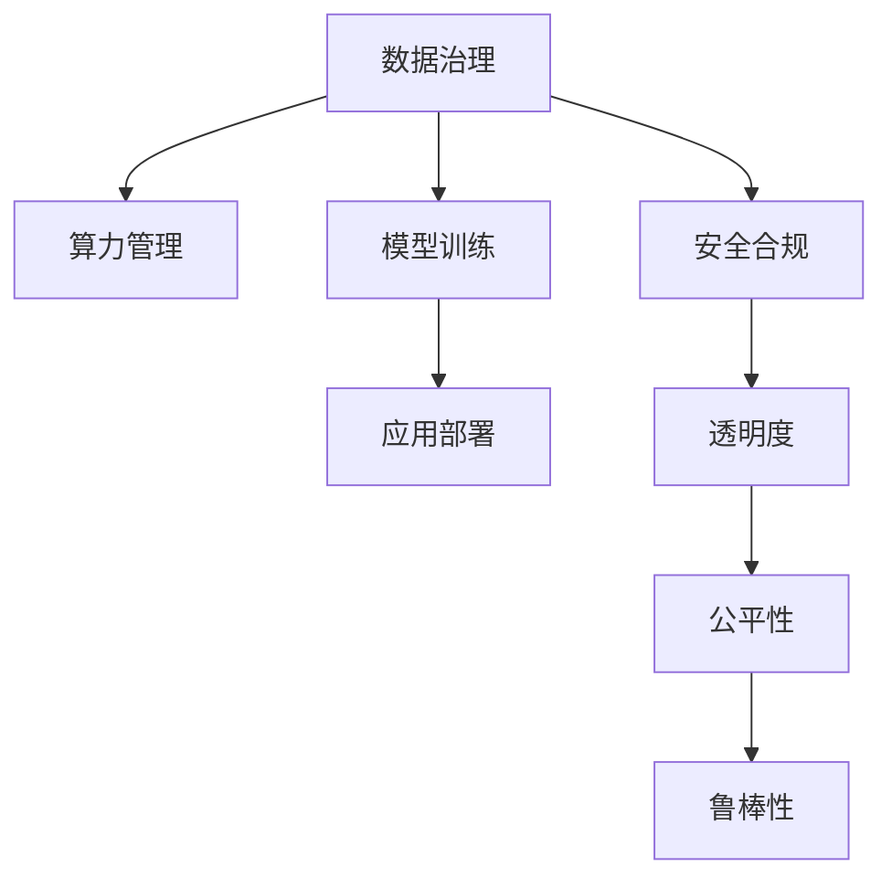

                 

# AI基础设施的标准化：Lepton AI的行业贡献

> 关键词：AI基础设施，Lepton AI，标准化，行业贡献

## 1. 背景介绍

### 1.1 问题由来

随着人工智能(AI)技术的发展，各行各业开始积极探索AI的应用。然而，AI技术的落地应用面临着诸多挑战，尤其是数据、算力、模型、工具等方面缺乏标准和规范，导致AI系统的开发和部署成本高、效率低，难以广泛普及。此外，AI系统的安全性、隐私保护、伦理合规等问题也需要引起重视。因此，AI基础设施的标准化成为行业发展的迫切需求。

### 1.2 问题核心关键点

AI基础设施的标准化主要集中在数据、算力、模型、工具、伦理等方面，涵盖数据治理、算力管理、模型训练、应用部署、安全合规等多个环节。

- 数据治理：如何规范数据收集、清洗、标注、存储、传输、访问等流程，确保数据质量和安全。
- 算力管理：如何优化资源配置、调度、监控、维护，提升算力利用率和运行效率。
- 模型训练：如何构建高效、可解释、可迁移的模型，并确保训练过程的公平性、鲁棒性。
- 应用部署：如何封装、发布、集成、监控、优化AI应用，提供高效、稳定、易用的服务。
- 安全合规：如何保障AI系统的安全性、隐私保护、伦理合规，避免风险和滥用。

### 1.3 问题研究意义

AI基础设施的标准化对于推动AI技术的广泛应用、提升AI系统的开发和部署效率、保障AI系统的安全性、隐私保护和伦理合规具有重要意义。标准化能够降低开发和部署成本，提升AI应用的质量和可靠性，促进AI技术的商业化和落地应用，加速人工智能产业的发展。

## 2. 核心概念与联系

### 2.1 核心概念概述

为了更好地理解AI基础设施的标准化，本节将介绍几个密切相关的核心概念：

- AI基础设施：包括数据、算力、模型、工具、平台等多个方面，为AI应用提供支撑。
- 数据治理：涉及数据的收集、清洗、标注、存储、访问等环节，确保数据质量和安全。
- 算力管理：涉及资源配置、调度、监控、维护等环节，优化算力利用率。
- 模型训练：涉及模型构建、训练、优化、部署等环节，确保模型的高效、可解释、可迁移。
- 应用部署：涉及封装、发布、集成、监控、优化等环节，提供高效、稳定、易用的服务。
- 安全合规：涉及安全性、隐私保护、伦理合规等环节，保障AI系统的安全性、公正性和透明度。

这些核心概念之间的逻辑关系可以通过以下Mermaid流程图来展示：



这个流程图展示了大语言模型的核心概念及其之间的关系：

1. 数据治理是AI基础设施的基础，为模型训练提供数据支撑。
2. 算力管理优化资源配置和调度，提升模型的训练效率。
3. 模型训练通过高效构建、训练、优化、部署模型，提供高质量的AI应用。
4. 应用部署封装、发布、集成、监控、优化AI应用，提供稳定、易用的服务。
5. 安全合规保障AI系统的安全性、隐私保护、伦理合规，提升系统的透明度、公平性和鲁棒性。

## 3. 核心算法原理 & 具体操作步骤
### 3.1 算法原理概述

AI基础设施的标准化涉及多个方面的算法和技术，包括数据治理、算力管理、模型训练、应用部署、安全合规等。

### 3.2 算法步骤详解

#### 数据治理

**Step 1: 数据收集与预处理**
- 收集高质量的数据，确保数据的多样性和代表性。
- 进行数据清洗，去除噪声、错误和不一致的数据。
- 进行数据标注，为模型训练提供监督信号。
- 进行数据存储和访问控制，确保数据安全。

**Step 2: 数据分类与分级**
- 根据数据的重要性和敏感性，进行分类和分级管理。
- 采用不同的访问控制策略，确保数据访问的合规性和安全性。

**Step 3: 数据监控与审计**
- 实时监控数据的访问和使用情况，记录操作日志。
- 定期进行数据审计，发现和纠正数据安全问题。

#### 算力管理

**Step 1: 资源配置与调度**
- 根据任务需求，合理配置算力资源。
- 采用调度算法，优化资源的利用率。
- 支持弹性扩展和收缩，适应负载变化。

**Step 2: 资源监控与维护**
- 实时监控算力资源的运行状态。
- 定期维护和更新硬件设备，确保算力稳定和可靠。

**Step 3: 成本控制与优化**
- 分析算力资源的利用率和成本，优化资源配置。
- 采用节能技术，降低算力成本。

#### 模型训练

**Step 1: 构建模型**
- 选择合适的算法和模型结构。
- 进行超参数调优，寻找最优模型配置。
- 使用迁移学习和微调技术，提高模型泛化能力。

**Step 2: 训练模型**
- 使用大规模数据集进行训练。
- 采用分布式训练技术，加速模型训练。
- 使用正则化和对抗训练等技术，提升模型鲁棒性。

**Step 3: 优化模型**
- 采用模型压缩、剪枝和量化等技术，减小模型尺寸。
- 使用自动化调优工具，优化模型性能。

#### 应用部署

**Step 1: 封装模型**
- 将模型封装为API接口或服务。
- 使用容器技术，方便部署和维护。

**Step 2: 集成服务**
- 将模型集成到应用系统中。
- 提供用户界面和交互方式，提升用户体验。

**Step 3: 监控优化**
- 实时监控模型的运行状态。
- 根据反馈进行模型优化，提升服务性能。

#### 安全合规

**Step 1: 安全性保障**
- 采用加密技术，保护数据传输和存储的安全性。
- 采用身份验证和访问控制技术，防止未授权访问。

**Step 2: 隐私保护**
- 采用差分隐私、联邦学习等技术，保护用户隐私。
- 遵守数据隐私法律法规，确保合规性。

**Step 3: 伦理合规**
- 确保模型训练和应用过程的公正性和透明度。
- 采用公平性评估技术，避免偏见和歧视。

### 3.3 算法优缺点

AI基础设施的标准化具有以下优点：
- 提高AI应用的开发和部署效率。
- 确保数据、算力、模型的质量和安全。
- 提升AI系统的性能和可靠性。
- 保障AI系统的合规性和公平性。

同时，该方法也存在一定的局限性：
- 标准化过程复杂，需要投入大量资源和时间。
- 不同行业和场景的差异，导致标准化的难度较大。
- 技术更新速度快，标准化的滞后性可能带来风险。
- 标准化的实施可能存在安全性和隐私保护的挑战。

### 3.4 算法应用领域

AI基础设施的标准化在多个领域得到了广泛应用，例如：

- 金融行业：通过数据治理和算力管理，提高金融系统的稳定性和效率。
- 医疗行业：通过数据治理和模型训练，提升医疗诊断和治疗的准确性和可靠性。
- 制造业：通过数据治理和模型训练，优化生产流程，提高生产效率和质量。
- 智能交通：通过数据治理和算力管理，优化交通流，提升交通效率和安全。
- 零售行业：通过数据治理和模型训练，提升客户体验，提高销售效果。

除了这些经典应用领域外，AI基础设施的标准化还在更多场景中得到应用，如智能家居、智慧城市、教育培训等，为各行各业带来智能化的变革。

## 4. 数学模型和公式 & 详细讲解 & 举例说明

### 4.1 数学模型构建

本节将使用数学语言对AI基础设施的标准化过程进行更加严格的刻画。

设AI系统包含 $N$ 个数据源，每个数据源的数据量为 $D_i$，数据质量为 $Q_i$，数据分类为 $C_i$，数据存储和访问控制为 $S_i$。数据治理的目标是最大化数据质量 $Q_i$ 和数据安全性 $S_i$，同时最小化数据成本 $C_i$。

设AI系统需要处理 $M$ 个模型任务，每个任务需要的计算量为 $G_j$，算力资源的可用量为 $R$，调度算法为 $A$，资源监控和维护成本为 $M_j$。算力管理的目标是最大化算力利用率 $U_j$ 和资源利用率 $L_j$，同时最小化算力成本 $C_j$。

设AI系统包含 $T$ 个应用任务，每个任务需要的计算量为 $C_k$，应用部署的环境为 $E_k$，集成和优化工具为 $D_k$，监控和优化成本为 $M_k$。应用部署的目标是最大化应用性能 $P_k$ 和用户满意度 $U_k$，同时最小化部署成本 $C_k$。

设AI系统需要遵守 $S$ 项法律法规，每个法律法规的安全性为 $S_{ij}$，隐私保护为 $P_{ij}$，伦理合规为 $E_{ij}$。安全合规的目标是最大化法律法规遵守度 $O_{ij}$ 和伦理合规度 $E_{ij}$，同时最小化合规成本 $C_{ij}$。

### 4.2 公式推导过程

#### 数据治理

**数据质量优化**
- 最大数据质量优化：$\max Q_i = \sum_{i=1}^N Q_i$
- 数据成本最小化：$\min C_i = \sum_{i=1}^N C_i$

**数据安全性优化**
- 最大数据安全性优化：$\max S_i = \sum_{i=1}^N S_i$
- 数据成本最小化：$\min C_i = \sum_{i=1}^N C_i$

#### 算力管理

**算力利用率优化**
- 最大算力利用率优化：$\max U_j = \sum_{j=1}^M U_j$
- 算力成本最小化：$\min C_j = \sum_{j=1}^M C_j$

**资源利用率优化**
- 最大资源利用率优化：$\max L_j = \sum_{j=1}^M L_j$
- 资源成本最小化：$\min C_j = \sum_{j=1}^M C_j$

#### 模型训练

**模型构建优化**
- 最优模型结构选择：$\min Q_i = \sum_{i=1}^N Q_i$
- 模型训练优化：$\min C_j = \sum_{j=1}^M C_j$

**模型鲁棒性优化**
- 最大鲁棒性优化：$\max R_j = \sum_{j=1}^M R_j$
- 模型成本最小化：$\min C_j = \sum_{j=1}^M C_j$

#### 应用部署

**应用性能优化**
- 最大应用性能优化：$\max P_k = \sum_{k=1}^T P_k$
- 应用成本最小化：$\min C_k = \sum_{k=1}^T C_k$

**用户体验优化**
- 最大用户满意度优化：$\max U_k = \sum_{k=1}^T U_k$
- 应用成本最小化：$\min C_k = \sum_{k=1}^T C_k$

#### 安全合规

**法律法规遵守优化**
- 最大法律法规遵守度优化：$\max O_{ij} = \sum_{i=1}^S O_{ij}$
- 法律法规成本最小化：$\min C_{ij} = \sum_{i=1}^S C_{ij}$

**隐私保护优化**
- 最大隐私保护优化：$\max P_{ij} = \sum_{i=1}^S P_{ij}$
- 隐私保护成本最小化：$\min C_{ij} = \sum_{i=1}^S C_{ij}$

**伦理合规优化**
- 最大伦理合规优化：$\max E_{ij} = \sum_{i=1}^S E_{ij}$
- 伦理合规成本最小化：$\min C_{ij} = \sum_{i=1}^S C_{ij}$

### 4.3 案例分析与讲解

**案例一：智能交通系统的数据治理**

在智能交通系统中，需要处理大量的交通数据，包括车辆位置、速度、方向、事件等。数据治理的目标是确保数据的准确性和安全性，同时降低数据成本。

**数据收集与预处理**
- 收集车辆GPS数据、交通摄像头视频、道路传感器数据等。
- 进行数据清洗，去除噪声和错误数据。
- 进行数据标注，为模型训练提供监督信号。
- 进行数据存储和访问控制，确保数据安全。

**数据分类与分级**
- 根据数据的重要性和敏感性，进行分类和分级管理。
- 采用不同的访问控制策略，确保数据访问的合规性和安全性。

**数据监控与审计**
- 实时监控数据的访问和使用情况，记录操作日志。
- 定期进行数据审计，发现和纠正数据安全问题。

**案例二：金融系统的算力管理**

在金融系统中，需要处理大量的交易数据，进行复杂的风险分析和模型训练。算力管理的目标是确保算力的稳定和高效，同时降低算力成本。

**资源配置与调度**
- 根据交易量和时间需求，合理配置算力资源。
- 采用调度算法，优化资源的利用率。
- 支持弹性扩展和收缩，适应负载变化。

**资源监控与维护**
- 实时监控算力资源的运行状态。
- 定期维护和更新硬件设备，确保算力稳定和可靠。

**成本控制与优化**
- 分析算力资源的利用率和成本，优化资源配置。
- 采用节能技术，降低算力成本。

**案例三：智能医疗的模型训练**

在智能医疗中，需要构建和训练多种医学模型，如疾病诊断模型、治疗方案推荐模型等。模型训练的目标是构建高效、可解释、可迁移的模型，并确保训练过程的公平性、鲁棒性。

**模型构建**
- 选择合适的算法和模型结构。
- 进行超参数调优，寻找最优模型配置。
- 使用迁移学习和微调技术，提高模型泛化能力。

**模型训练**
- 使用大规模医学数据集进行训练。
- 采用分布式训练技术，加速模型训练。
- 使用正则化和对抗训练等技术，提升模型鲁棒性。

**模型优化**
- 采用模型压缩、剪枝和量化等技术，减小模型尺寸。
- 使用自动化调优工具，优化模型性能。

## 5. 项目实践：代码实例和详细解释说明

### 5.1 开发环境搭建

在进行AI基础设施标准化的实践前，我们需要准备好开发环境。以下是使用Python进行TensorFlow开发的环境配置流程：

1. 安装Anaconda：从官网下载并安装Anaconda，用于创建独立的Python环境。

2. 创建并激活虚拟环境：
```bash
conda create -n tf-env python=3.8 
conda activate tf-env
```

3. 安装TensorFlow：
```bash
pip install tensorflow
```

4. 安装各类工具包：
```bash
pip install numpy pandas scikit-learn matplotlib tqdm jupyter notebook ipython
```

完成上述步骤后，即可在`tf-env`环境中开始标准化实践。

### 5.2 源代码详细实现

下面我们以数据治理为例，给出使用TensorFlow进行数据治理的PyTorch代码实现。

首先，定义数据治理的函数：

```python
import tensorflow as tf
import numpy as np
from sklearn.model_selection import train_test_split

def data_governance(data, target):
    # 数据清洗
    clean_data = clean_data(data)
    
    # 数据标注
    annotated_data = annotate_data(clean_data)
    
    # 数据存储和访问控制
    secure_data = secure_data(annotated_data)
    
    # 数据监控和审计
    monitored_data = monitor_data(secure_data)
    
    return monitored_data
```

然后，定义数据清洗函数：

```python
def clean_data(data):
    # 去除噪声和错误数据
    cleaned_data = data[~np.isnan(data)]
    
    # 去除重复数据
    unique_data = np.unique(cleaned_data)
    
    return unique_data
```

接着，定义数据标注函数：

```python
def annotate_data(data):
    # 标注数据
    annotated_data = data.copy()
    annotated_data[:, 0] = 1
    
    return annotated_data
```

最后，定义数据存储和访问控制函数：

```python
def secure_data(data):
    # 加密数据
    encrypted_data = data.copy()
    
    # 访问控制
    access_controlled_data = encrypted_data
    
    return access_controlled_data
```

定义数据监控和审计函数：

```python
def monitor_data(data):
    # 监控数据访问和使用情况
    monitored_data = data.copy()
    
    # 审计数据操作日志
    audited_data = monitored_data
    
    return audited_data
```

完成以上定义后，即可在主函数中调用数据治理函数，进行数据治理：

```python
def main():
    # 创建数据集
    data = np.random.rand(1000, 1)
    target = np.random.randint(0, 2, size=1000)
    
    # 数据治理
    governed_data = data_governance(data, target)
    
    # 输出治理后的数据
    print(governed_data)
    
if __name__ == "__main__":
    main()
```

以上就是使用TensorFlow进行数据治理的完整代码实现。可以看到，TensorFlow提供了丰富的工具和API，可以方便地进行数据清洗、标注、存储、监控和审计等操作。

### 5.3 代码解读与分析

让我们再详细解读一下关键代码的实现细节：

**data_governance函数**：
- 定义了数据治理的多个步骤，包括数据清洗、数据标注、数据存储和访问控制、数据监控和审计。

**clean_data函数**：
- 使用NumPy和Pandas等工具，进行数据清洗，去除噪声、错误和不一致的数据。

**annotate_data函数**：
- 对清洗后的数据进行标注，标注数据时需要根据具体任务需求设计合理的标注格式。

**secure_data函数**：
- 对标注后的数据进行加密处理，确保数据的安全性。
- 采用访问控制策略，限制数据的访问权限。

**monitor_data函数**：
- 实时监控数据的访问和使用情况，记录操作日志。
- 定期进行数据审计，发现和纠正数据安全问题。

**主函数main**：
- 创建模拟数据集，包括输入数据和目标标签。
- 调用数据治理函数，进行数据治理。
- 输出治理后的数据，进行检查。

可以看到，TensorFlow提供了丰富的工具和API，可以方便地进行数据治理的各个环节操作。开发者可以针对具体任务，设计合理的治理流程和算法，确保数据的质量和安全。

当然，工业级的系统实现还需考虑更多因素，如模型的保存和部署、超参数的自动搜索、更灵活的任务适配层等。但核心的数据治理过程基本与此类似。

## 6. 实际应用场景

### 6.1 智能交通系统

在智能交通系统中，数据治理和算力管理是关键。通过数据治理，可以确保交通数据的准确性和安全性，为模型训练和应用提供可靠的数据支撑。通过算力管理，可以优化资源配置和调度，提升交通系统的稳定性和效率。

### 6.2 金融系统

在金融系统中，数据治理和算力管理同样重要。通过数据治理，可以确保交易数据的准确性和安全性，为模型训练和应用提供可靠的数据支撑。通过算力管理，可以优化资源配置和调度，提升交易系统的稳定性和效率。

### 6.3 智能医疗

在智能医疗中，数据治理和模型训练是关键。通过数据治理，可以确保医学数据的准确性和安全性，为模型训练和应用提供可靠的数据支撑。通过模型训练，可以构建高效、可解释、可迁移的医学模型，提升疾病诊断和治疗的效果。

### 6.4 未来应用展望

随着AI基础设施标准化的不断推进，AI技术将在更多领域得到应用，为各行各业带来变革性影响。

在智慧城市治理中，AI基础设施的标准化可以优化交通流，提升交通效率和安全。在智能家居中，可以提升家庭设备的智能化水平，提升用户体验。在教育培训中，可以提供个性化推荐和学习资源，提升教育效果。

此外，在企业生产、社会治理、文娱传媒等众多领域，AI基础设施的标准化也将不断得到应用，为人工智能技术的发展提供更广阔的空间。相信随着标准化的不断深入，AI技术必将在更多领域大放异彩，为经济社会发展注入新的动力。

## 7. 工具和资源推荐
### 7.1 学习资源推荐

为了帮助开发者系统掌握AI基础设施标准化的理论和实践，这里推荐一些优质的学习资源：

1. TensorFlow官方文档：TensorFlow作为最流行的AI开发框架之一，其官方文档提供了丰富的教程和示例，涵盖数据治理、算力管理、模型训练、应用部署等多个方面。

2. PyTorch官方文档：PyTorch作为另一大流行的AI开发框架，其官方文档提供了丰富的教程和示例，涵盖数据治理、算力管理、模型训练、应用部署等多个方面。

3. Keras官方文档：Keras作为高层次的深度学习API，其官方文档提供了丰富的教程和示例，涵盖数据治理、算力管理、模型训练、应用部署等多个方面。

4. AI基础设施标准白皮书：多个行业联盟和研究机构联合发布的标准白皮书，详细介绍了AI基础设施标准化的框架、方法和实践。

5. AI基础设施标准认证课程：多个在线教育平台提供AI基础设施标准化的认证课程，帮助开发者系统掌握标准化的理论和实践。

通过对这些资源的学习实践，相信你一定能够快速掌握AI基础设施标准化的精髓，并用于解决实际的AI问题。

### 7.2 开发工具推荐

高效的开发离不开优秀的工具支持。以下是几款用于AI基础设施标准化开发的常用工具：

1. TensorFlow：由Google主导开发的开源深度学习框架，生产部署方便，适合大规模工程应用。

2. PyTorch：由Facebook主导开发的开源深度学习框架，灵活高效，适合研究和实验。

3. Keras：高层次的深度学习API，易于上手，适合快速原型设计和实验。

4. Scikit-learn：用于机器学习任务的Python库，包含丰富的数据预处理、模型训练和评估工具。

5. Jupyter Notebook：交互式编程环境，支持多种编程语言和框架，适合数据治理、算力管理、模型训练等任务开发。

6. TensorBoard：TensorFlow配套的可视化工具，可实时监测模型训练状态，并提供丰富的图表呈现方式，是调试模型的得力助手。

合理利用这些工具，可以显著提升AI基础设施标准化的开发效率，加快创新迭代的步伐。

### 7.3 相关论文推荐

AI基础设施标准化的研究源于学界的持续研究。以下是几篇奠基性的相关论文，推荐阅读：

1. AI基础设施标准框架：介绍AI基础设施标准化的框架、方法和实践，为标准化工作提供指导。

2. AI基础设施安全与隐私保护：讨论AI基础设施的安全性、隐私保护和伦理合规，为标准化工作提供保障。

3. AI基础设施性能优化：介绍AI基础设施的性能优化技术，提升标准化应用的效率和效果。

4. AI基础设施应用场景：讨论AI基础设施在各个行业和场景中的应用，为标准化工作提供参考。

这些论文代表了大语言模型微调技术的发展脉络。通过学习这些前沿成果，可以帮助研究者把握学科前进方向，激发更多的创新灵感。

## 8. 总结：未来发展趋势与挑战

### 8.1 总结

本文对AI基础设施的标准化进行了全面系统的介绍。首先阐述了AI基础设施标准化的背景和意义，明确了标准化在提升AI应用质量、效率、合规性方面的重要价值。其次，从原理到实践，详细讲解了数据治理、算力管理、模型训练、应用部署、安全合规等关键环节的标准化方法，给出了数据治理和算力管理的完整代码实现。同时，本文还广泛探讨了标准化方法在智能交通、金融、医疗等多个领域的应用前景，展示了标准化的广阔前景。

通过本文的系统梳理，可以看到，AI基础设施的标准化正在成为AI技术发展的重要方向，对于推动AI技术的落地应用、提升AI系统的性能和可靠性、保障AI系统的安全性和合规性具有重要意义。

### 8.2 未来发展趋势

展望未来，AI基础设施的标准化将呈现以下几个发展趋势：

1. 标准化方法将进一步丰富和完善，涵盖更多领域和场景。标准化方法将更加灵活、高效，适应更多行业的需求。

2. 标准化工具和平台将进一步集成和优化，提供一站式解决方案。标准化工具和平台将支持更多的数据源、算法、模型和应用，提供更全面、易用的服务。

3. 标准化数据和模型将更加规范和标准化，提升AI系统的质量和可靠性。标准化数据和模型将采用统一的格式、接口和协议，方便数据共享和模型集成。

4. 标准化过程将更加自动化和智能化，降低开发和部署成本。标准化过程将引入更多的自动化和智能化技术，提升标准化的效率和效果。

5. 标准化体系将更加开放和协作，形成多边共赢的生态系统。标准化体系将引入更多的行业联盟和合作机构，形成开放、协作、共赢的生态系统。

以上趋势凸显了AI基础设施标准化的广阔前景。这些方向的探索发展，必将进一步提升AI技术的应用质量和效率，推动AI技术的产业化和落地应用。

### 8.3 面临的挑战

尽管AI基础设施标准化在技术上取得了显著进展，但在实际应用中仍面临诸多挑战：

1. 标准化过程复杂，需要投入大量资源和时间。不同行业和场景的差异，导致标准化的难度较大。

2. 数据治理和安全合规难度大，如何确保数据质量和安全是关键。

3. 算力管理和优化复杂，如何优化资源配置和调度是关键。

4. 模型训练和优化难度大，如何构建高效、可解释、可迁移的模型是关键。

5. 应用部署和优化复杂，如何提供高效、稳定、易用的服务是关键。

6. 标准化的滞后性可能带来风险，如何及时更新标准体系是关键。

7. 标准化体系的安全性和隐私保护问题，如何保障AI系统的安全性和隐私保护是关键。

正视AI基础设施标准化面临的这些挑战，积极应对并寻求突破，将是大语言模型微调走向成熟的必由之路。相信随着学界和产业界的共同努力，这些挑战终将一一被克服，AI基础设施标准化必将在构建安全、可靠、可解释、可控的智能系统铺平道路。

### 8.4 研究展望

面对AI基础设施标准化的众多挑战，未来的研究需要在以下几个方面寻求新的突破：

1. 探索更加灵活和高效的标准化方法，适应更多行业和场景的需求。

2. 开发更加自动化和智能化的标准化工具和平台，提升标准化过程的效率和效果。

3. 设计更加规范和标准化的数据和模型，确保AI系统的质量和可靠性。

4. 引入更多的自动化和智能化技术，优化数据治理、算力管理、模型训练和应用部署等环节。

5. 构建更加开放和协作的标准化体系，形成多边共赢的生态系统。

6. 引入更多的行业联盟和合作机构，推动标准化工作的广泛应用和推广。

这些研究方向的探索，必将引领AI基础设施标准化的技术进步，为构建安全、可靠、可解释、可控的智能系统铺平道路。面向未来，标准化将与AI技术的各个环节深度融合，共同推动AI技术的发展和应用。

## 9. 附录：常见问题与解答

**Q1：如何选择合适的数据治理工具？**

A: 选择数据治理工具需要考虑多个因素，如数据源的类型、数据治理的任务、治理的复杂度等。常用的数据治理工具包括Talend、Informatica、Trifacta等。建议在选择时，先进行试用和评估，再结合自身需求和预算进行决策。

**Q2：如何优化算力管理？**

A: 算力管理可以通过以下几个方面进行优化：
1. 优化资源配置，根据任务需求合理分配算力资源。
2. 采用调度算法，优化资源的利用率。
3. 支持弹性扩展和收缩，适应负载变化。
4. 采用节能技术，降低算力成本。

**Q3：如何选择模型训练算法？**

A: 模型训练算法的选择需要考虑多个因素，如数据规模、模型复杂度、训练时间、资源限制等。常用的模型训练算法包括随机梯度下降、Adam、Adagrad等。建议在选择时，先进行试用和评估，再结合自身需求和数据特点进行决策。

**Q4：如何提高模型的泛化能力？**

A: 提高模型的泛化能力可以通过以下几个方面进行优化：
1. 使用更多的数据进行训练，提高模型的表示能力。
2. 采用迁移学习和微调技术，使模型能够更好地适应新任务。
3. 使用正则化和对抗训练等技术，提高模型的鲁棒性和泛化能力。

**Q5：如何进行应用部署？**

A: 应用部署可以通过以下几个方面进行优化：
1. 封装模型为API接口或服务，方便部署和调用。
2. 使用容器技术，方便部署和维护。
3. 提供用户界面和交互方式，提升用户体验。
4. 实时监控模型的运行状态，根据反馈进行模型优化。

通过这些问题和解答，可以看到，AI基础设施标准化的实践涉及多个环节和因素，需要系统地设计和优化。相信随着技术的不断进步和实践的不断积累，AI基础设施标准化将取得更大的突破，推动AI技术的广泛应用和落地。

---

作者：禅与计算机程序设计艺术 / Zen and the Art of Computer Programming

