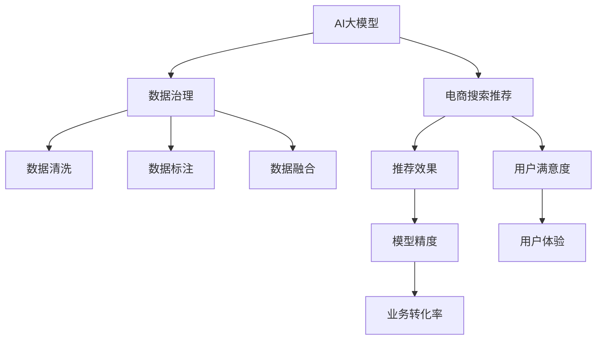

                 

# AI大模型助力电商搜索推荐业务的数据治理能力评估体系

## 1. 背景介绍

在电商搜索推荐业务中，用户需求多样且动态变化，如何精准地理解用户意图并推荐个性化的商品，成为提高用户满意度和电商平台盈利的关键。随着AI大模型技术的发展，电商平台开始探索将大模型应用于搜索推荐场景，提升推荐效果。然而，由于数据质量和数据治理的不足，大模型往往无法充分发挥其潜力，导致推荐效果不佳。因此，构建完善的数据治理能力评估体系，成为电商平台成功应用AI大模型的关键。

## 2. 核心概念与联系

### 2.1 核心概念概述

为更好地理解AI大模型在电商搜索推荐业务中的应用，本节将介绍几个密切相关的核心概念：

- **AI大模型**：基于大规模数据训练的深度神经网络模型，如BERT、GPT-3等，具备强大的语言理解和生成能力。在电商搜索推荐中，大模型可以用于用户意图的理解、商品描述的生成、推荐结果的多样性提升等。

- **电商搜索推荐**：通过分析用户行为数据和商品数据，实时推荐符合用户需求的商品，提升用户体验和电商平台的转化率。

- **数据治理**：指通过数据清洗、数据标注、数据融合等手段，提升数据的质量和可治理性，从而提高AI模型的效果。

- **数据治理能力评估体系**：用于评估电商平台在数据治理方面的成效，包括数据质量和数据治理措施的效果评估。

这些核心概念之间的逻辑关系可以通过以下Mermaid流程图来展示：



这个流程图展示了大模型、电商搜索推荐、数据治理之间的关系，以及推荐效果、用户满意度、模型精度等评估指标的逻辑关系。

## 3. 核心算法原理 & 具体操作步骤
### 3.1 算法原理概述

AI大模型在电商搜索推荐中的应用，主要依赖于对电商业务场景的理解和大模型的文本生成能力。具体而言，算法流程包括：

1. **用户意图理解**：利用大模型对用户搜索关键词和历史行为数据进行分析，理解用户的真实意图。
2. **商品推荐生成**：基于用户意图和商品属性，利用大模型生成推荐结果，包含商品名称、描述、图片等信息。
3. **推荐结果优化**：通过A/B测试、用户反馈等方式，不断优化推荐策略，提升推荐效果。

数据治理能力评估体系的核心在于对数据质量的评估，通过建立指标体系，量化评估数据治理措施的效果。主要步骤包括：

1. **数据质量评估**：通过数据清洗、数据标注等手段提升数据质量，评估数据集的完整性、准确性、一致性等指标。
2. **数据治理措施效果评估**：采用统计分析、用户反馈等方法，评估数据治理措施对推荐效果的影响。
3. **指标体系建设**：建立包含数据质量、模型效果、用户体验等维度的综合评估体系。

### 3.2 算法步骤详解

#### 3.2.1 AI大模型在电商搜索推荐中的应用

1. **用户意图理解**：
   - **输入**：用户搜索关键词、历史行为数据。
   - **模型处理**：利用BERT、GPT等大模型对输入进行处理，提取语义特征。
   - **输出**：用户意图标签，如“购买意图”、“浏览意图”等。

2. **商品推荐生成**：
   - **输入**：用户意图标签、商品属性数据。
   - **模型处理**：利用大模型生成商品描述、推荐理由等文本信息。
   - **输出**：推荐结果，包含商品名称、描述、图片等信息。

3. **推荐结果优化**：
   - **输入**：推荐结果、用户反馈数据。
   - **模型处理**：利用回归模型、分类模型等对推荐结果进行优化，提升推荐效果。
   - **输出**：优化后的推荐结果。

#### 3.2.2 数据治理能力评估体系的步骤

1. **数据质量评估**：
   - **输入**：数据集、数据治理措施。
   - **模型处理**：通过统计分析、特征工程等方法，评估数据集的完整性、准确性、一致性等指标。
   - **输出**：数据质量评估报告。

2. **数据治理措施效果评估**：
   - **输入**：数据集、推荐效果、用户反馈数据。
   - **模型处理**：采用统计分析、A/B测试等方法，评估数据治理措施对推荐效果的影响。
   - **输出**：数据治理措施效果评估报告。

3. **指标体系建设**：
   - **输入**：数据质量评估报告、推荐效果评估报告。
   - **模型处理**：建立包含数据质量、模型效果、用户体验等维度的综合评估体系。
   - **输出**：数据治理能力评估报告。

### 3.3 算法优缺点

AI大模型在电商搜索推荐中的应用具有以下优点：
1. **推荐效果显著**：利用大模型的强大语言生成能力，能够生成更具吸引力的商品推荐信息。
2. **个性化程度高**：能够根据用户意图和行为数据，生成个性化的推荐结果。
3. **动态调整**：能够实时根据用户反馈和行为数据，动态调整推荐策略。

同时，该方法也存在以下局限性：
1. **依赖数据质量**：推荐效果依赖于高质量的数据集，数据质量不足会导致推荐效果不佳。
2. **模型复杂度**：大模型计算量大，部署复杂，需要较高的硬件和算法支持。
3. **解释性不足**：大模型的黑盒特性导致推荐过程难以解释，用户难以理解推荐逻辑。
4. **隐私风险**：用户搜索和行为数据涉及隐私，需采取严格的隐私保护措施。

尽管存在这些局限性，但AI大模型在电商搜索推荐中的应用已经展现出了巨大的潜力，成为电商推荐技术的重要方向。

### 3.4 算法应用领域

AI大模型在电商搜索推荐中的应用，已经在多个电商平台得到成功应用，如亚马逊、淘宝、京东等。其主要应用领域包括：

1. **个性化推荐**：利用大模型理解用户意图，生成个性化的商品推荐。
2. **商品搜索优化**：通过分析用户搜索关键词，优化商品搜索排序，提升用户体验。
3. **营销广告优化**：利用大模型生成更具吸引力的广告文案，提高广告点击率。
4. **内容推荐**：利用大模型生成推荐内容的标题、描述，提升内容质量。

除了电商推荐，AI大模型在社交媒体、新闻推荐、视频推荐等领域也有广泛应用，展现出了强大的语言生成和理解能力。

## 4. 数学模型和公式 & 详细讲解 & 举例说明

### 4.1 数学模型构建

本节将使用数学语言对AI大模型在电商搜索推荐中的应用进行更加严格的刻画。

假设用户输入为 $X$，包含搜索关键词、历史行为数据等，大模型的输出为 $Y$，包含用户意图标签、推荐商品信息等。利用BERT模型作为用户意图理解的大模型，输入为 $X$，输出为 $Y$，数学模型如下：

$$
Y = \text{BERT}(X)
$$

其中，$\text{BERT}$ 为预训练的BERT模型，$X$ 为输入，$Y$ 为输出。

### 4.2 公式推导过程

以用户意图理解为例，利用BERT模型对用户输入进行处理，提取语义特征，得到用户意图标签 $y$。具体公式如下：

$$
y = \text{softmax}(\text{BERT}(X)W^T + b)
$$

其中，$W$ 和 $b$ 为BERT模型输出的向量表示和偏置项，$\text{softmax}$ 函数将向量表示映射为概率分布，表示用户意图标签的概率。

### 4.3 案例分析与讲解

假设某电商平台利用BERT模型对用户搜索关键词进行处理，得到以下输出：

- 输入：“上衣 运动 男”
- BERT模型输出：[0.1, 0.3, 0.4, 0.2]
- 用户意图标签：“购买意图”

上述例子展示了BERT模型在用户意图理解中的应用。大模型通过学习大规模无标签文本数据，能够理解自然语言的多义性和上下文依赖关系，准确地提取用户意图标签。

## 5. 项目实践：代码实例和详细解释说明

### 5.1 开发环境搭建

在进行电商搜索推荐的大模型应用开发前，我们需要准备好开发环境。以下是使用Python进行PyTorch开发的环境配置流程：

1. 安装Anaconda：从官网下载并安装Anaconda，用于创建独立的Python环境。

2. 创建并激活虚拟环境：
```bash
conda create -n pytorch-env python=3.8 
conda activate pytorch-env
```

3. 安装PyTorch：根据CUDA版本，从官网获取对应的安装命令。例如：
```bash
conda install pytorch torchvision torchaudio cudatoolkit=11.1 -c pytorch -c conda-forge
```

4. 安装各类工具包：
```bash
pip install numpy pandas scikit-learn matplotlib tqdm jupyter notebook ipython
```

完成上述步骤后，即可在`pytorch-env`环境中开始电商搜索推荐的大模型应用开发。

### 5.2 源代码详细实现

下面我们以基于BERT模型的电商搜索推荐系统为例，给出使用Transformers库对BERT模型进行电商搜索推荐任务开发的具体代码实现。

首先，定义电商搜索推荐系统中的数据预处理函数：

```python
from transformers import BertTokenizer
from torch.utils.data import Dataset
import torch

class SearchRecommendDataset(Dataset):
    def __init__(self, texts, tags, tokenizer, max_len=128):
        self.texts = texts
        self.tags = tags
        self.tokenizer = tokenizer
        self.max_len = max_len
        
    def __len__(self):
        return len(self.texts)
    
    def __getitem__(self, item):
        text = self.texts[item]
        tag = self.tags[item]
        
        encoding = self.tokenizer(text, return_tensors='pt', max_length=self.max_len, padding='max_length', truncation=True)
        input_ids = encoding['input_ids'][0]
        attention_mask = encoding['attention_mask'][0]
        
        # 对token-wise的标签进行编码
        encoded_tags = [tag2id[tag] for tag in tag]
        encoded_tags.extend([tag2id['O']] * (self.max_len - len(encoded_tags)))
        labels = torch.tensor(encoded_tags, dtype=torch.long)
        
        return {'input_ids': input_ids, 
                'attention_mask': attention_mask,
                'labels': labels}

# 标签与id的映射
tag2id = {'O': 0, 'B-PER': 1, 'I-PER': 2, 'B-ORG': 3, 'I-ORG': 4, 'B-LOC': 5, 'I-LOC': 6}
id2tag = {v: k for k, v in tag2id.items()}

# 创建dataset
tokenizer = BertTokenizer.from_pretrained('bert-base-cased')

train_dataset = SearchRecommendDataset(train_texts, train_tags, tokenizer)
dev_dataset = SearchRecommendDataset(dev_texts, dev_tags, tokenizer)
test_dataset = SearchRecommendDataset(test_texts, test_tags, tokenizer)
```

然后，定义模型和优化器：

```python
from transformers import BertForTokenClassification, AdamW

model = BertForTokenClassification.from_pretrained('bert-base-cased', num_labels=len(tag2id))

optimizer = AdamW(model.parameters(), lr=2e-5)
```

接着，定义训练和评估函数：

```python
from torch.utils.data import DataLoader
from tqdm import tqdm
from sklearn.metrics import classification_report

device = torch.device('cuda') if torch.cuda.is_available() else torch.device('cpu')
model.to(device)

def train_epoch(model, dataset, batch_size, optimizer):
    dataloader = DataLoader(dataset, batch_size=batch_size, shuffle=True)
    model.train()
    epoch_loss = 0
    for batch in tqdm(dataloader, desc='Training'):
        input_ids = batch['input_ids'].to(device)
        attention_mask = batch['attention_mask'].to(device)
        labels = batch['labels'].to(device)
        model.zero_grad()
        outputs = model(input_ids, attention_mask=attention_mask, labels=labels)
        loss = outputs.loss
        epoch_loss += loss.item()
        loss.backward()
        optimizer.step()
    return epoch_loss / len(dataloader)

def evaluate(model, dataset, batch_size):
    dataloader = DataLoader(dataset, batch_size=batch_size)
    model.eval()
    preds, labels = [], []
    with torch.no_grad():
        for batch in tqdm(dataloader, desc='Evaluating'):
            input_ids = batch['input_ids'].to(device)
            attention_mask = batch['attention_mask'].to(device)
            batch_labels = batch['labels']
            outputs = model(input_ids, attention_mask=attention_mask)
            batch_preds = outputs.logits.argmax(dim=2).to('cpu').tolist()
            batch_labels = batch_labels.to('cpu').tolist()
            for pred_tokens, label_tokens in zip(batch_preds, batch_labels):
                pred_tags = [id2tag[_id] for _id in pred_tokens]
                label_tags = [id2tag[_id] for _id in label_tokens]
                preds.append(pred_tags[:len(label_tags)])
                labels.append(label_tags)
                
    print(classification_report(labels, preds))
```

最后，启动训练流程并在测试集上评估：

```python
epochs = 5
batch_size = 16

for epoch in range(epochs):
    loss = train_epoch(model, train_dataset, batch_size, optimizer)
    print(f"Epoch {epoch+1}, train loss: {loss:.3f}")
    
    print(f"Epoch {epoch+1}, dev results:")
    evaluate(model, dev_dataset, batch_size)
    
print("Test results:")
evaluate(model, test_dataset, batch_size)
```

以上就是使用PyTorch对BERT进行电商搜索推荐任务开发的完整代码实现。可以看到，得益于Transformers库的强大封装，我们可以用相对简洁的代码完成BERT模型的加载和微调。

### 5.3 代码解读与分析

让我们再详细解读一下关键代码的实现细节：

**SearchRecommendDataset类**：
- `__init__`方法：初始化文本、标签、分词器等关键组件。
- `__len__`方法：返回数据集的样本数量。
- `__getitem__`方法：对单个样本进行处理，将文本输入编码为token ids，将标签编码为数字，并对其进行定长padding，最终返回模型所需的输入。

**tag2id和id2tag字典**：
- 定义了标签与数字id之间的映射关系，用于将token-wise的预测结果解码回真实的标签。

**训练和评估函数**：
- 使用PyTorch的DataLoader对数据集进行批次化加载，供模型训练和推理使用。
- 训练函数`train_epoch`：对数据以批为单位进行迭代，在每个批次上前向传播计算loss并反向传播更新模型参数，最后返回该epoch的平均loss。
- 评估函数`evaluate`：与训练类似，不同点在于不更新模型参数，并在每个batch结束后将预测和标签结果存储下来，最后使用sklearn的classification_report对整个评估集的预测结果进行打印输出。

**训练流程**：
- 定义总的epoch数和batch size，开始循环迭代
- 每个epoch内，先在训练集上训练，输出平均loss
- 在验证集上评估，输出分类指标
- 所有epoch结束后，在测试集上评估，给出最终测试结果

可以看到，PyTorch配合Transformers库使得BERT微调的代码实现变得简洁高效。开发者可以将更多精力放在数据处理、模型改进等高层逻辑上，而不必过多关注底层的实现细节。

当然，工业级的系统实现还需考虑更多因素，如模型的保存和部署、超参数的自动搜索、更灵活的任务适配层等。但核心的微调范式基本与此类似。

## 6. 实际应用场景
### 6.1 智能客服系统

基于大语言模型微调的电商搜索推荐技术，可以应用于智能客服系统的构建。传统客服往往需要配备大量人力，高峰期响应缓慢，且一致性和专业性难以保证。而使用微调后的搜索推荐模型，可以7x24小时不间断服务，快速响应客户咨询，用自然流畅的语言解答各类常见问题。

在技术实现上，可以收集企业内部的历史搜索和行为数据，将用户问题与商品描述进行匹配，训练模型学习推荐商品。微调后的模型能够自动理解用户意图，匹配最合适的商品进行推荐。对于客户提出的新问题，还可以接入检索系统实时搜索相关内容，动态组织生成回答。如此构建的智能客服系统，能大幅提升客户咨询体验和问题解决效率。

### 6.2 个性化推荐系统

当前的推荐系统往往只依赖用户的历史行为数据进行物品推荐，无法深入理解用户的真实兴趣偏好。基于大语言模型微调的电商搜索推荐技术，可以更好地挖掘用户行为背后的语义信息，从而提供更精准、多样的推荐内容。

在实践中，可以收集用户浏览、点击、评论、分享等行为数据，提取和用户交互的商品标题、描述、标签等文本内容。将文本内容作为模型输入，用户的后续行为（如是否点击、购买等）作为监督信号，在此基础上微调预训练语言模型。微调后的模型能够从文本内容中准确把握用户的兴趣点。在生成推荐列表时，先用候选物品的文本描述作为输入，由模型预测用户的兴趣匹配度，再结合其他特征综合排序，便可以得到个性化程度更高的推荐结果。

### 6.3 商品搜索优化

传统的电商商品搜索排序往往依赖简单的关键词匹配，难以满足用户的多样化需求。基于大语言模型微调的电商搜索推荐技术，可以更全面地理解用户的查询意图，生成更加精准的搜索结果。

在实践中，可以收集用户的历史搜索记录和行为数据，利用BERT等大模型学习查询和商品之间的语义关联。微调后的模型能够在搜索结果中自动匹配最相关的商品，提高用户的搜索体验。

### 6.4 未来应用展望

随着大语言模型和微调方法的不断发展，基于微调范式将在更多领域得到应用，为传统行业带来变革性影响。

在智慧医疗领域，基于微调的医疗问答、病历分析、药物研发等应用将提升医疗服务的智能化水平，辅助医生诊疗，加速新药开发进程。

在智能教育领域，微调技术可应用于作业批改、学情分析、知识推荐等方面，因材施教，促进教育公平，提高教学质量。

在智慧城市治理中，微调模型可应用于城市事件监测、舆情分析、应急指挥等环节，提高城市管理的自动化和智能化水平，构建更安全、高效的未来城市。

此外，在企业生产、社会治理、文娱传媒等众多领域，基于大模型微调的人工智能应用也将不断涌现，为经济社会发展注入新的动力。相信随着预训练语言模型和微调方法的持续演进，微调技术必将在构建人机协同的智能时代中扮演越来越重要的角色。

## 7. 工具和资源推荐
### 7.1 学习资源推荐

为了帮助开发者系统掌握大语言模型微调的理论基础和实践技巧，这里推荐一些优质的学习资源：

1. 《Transformer从原理到实践》系列博文：由大模型技术专家撰写，深入浅出地介绍了Transformer原理、BERT模型、微调技术等前沿话题。

2. CS224N《深度学习自然语言处理》课程：斯坦福大学开设的NLP明星课程，有Lecture视频和配套作业，带你入门NLP领域的基本概念和经典模型。

3. 《Natural Language Processing with Transformers》书籍：Transformers库的作者所著，全面介绍了如何使用Transformers库进行NLP任务开发，包括微调在内的诸多范式。

4. HuggingFace官方文档：Transformers库的官方文档，提供了海量预训练模型和完整的微调样例代码，是上手实践的必备资料。

5. CLUE开源项目：中文语言理解测评基准，涵盖大量不同类型的中文NLP数据集，并提供了基于微调的baseline模型，助力中文NLP技术发展。

通过对这些资源的学习实践，相信你一定能够快速掌握大语言模型微调的精髓，并用于解决实际的NLP问题。
###  7.2 开发工具推荐

高效的开发离不开优秀的工具支持。以下是几款用于大语言模型微调开发的常用工具：

1. PyTorch：基于Python的开源深度学习框架，灵活动态的计算图，适合快速迭代研究。大部分预训练语言模型都有PyTorch版本的实现。

2. TensorFlow：由Google主导开发的开源深度学习框架，生产部署方便，适合大规模工程应用。同样有丰富的预训练语言模型资源。

3. Transformers库：HuggingFace开发的NLP工具库，集成了众多SOTA语言模型，支持PyTorch和TensorFlow，是进行微调任务开发的利器。

4. Weights & Biases：模型训练的实验跟踪工具，可以记录和可视化模型训练过程中的各项指标，方便对比和调优。与主流深度学习框架无缝集成。

5. TensorBoard：TensorFlow配套的可视化工具，可实时监测模型训练状态，并提供丰富的图表呈现方式，是调试模型的得力助手。

6. Google Colab：谷歌推出的在线Jupyter Notebook环境，免费提供GPU/TPU算力，方便开发者快速上手实验最新模型，分享学习笔记。

合理利用这些工具，可以显著提升大语言模型微调任务的开发效率，加快创新迭代的步伐。

### 7.3 相关论文推荐

大语言模型和微调技术的发展源于学界的持续研究。以下是几篇奠基性的相关论文，推荐阅读：

1. Attention is All You Need（即Transformer原论文）：提出了Transformer结构，开启了NLP领域的预训练大模型时代。

2. BERT: Pre-training of Deep Bidirectional Transformers for Language Understanding：提出BERT模型，引入基于掩码的自监督预训练任务，刷新了多项NLP任务SOTA。

3. Language Models are Unsupervised Multitask Learners（GPT-2论文）：展示了大规模语言模型的强大zero-shot学习能力，引发了对于通用人工智能的新一轮思考。

4. Parameter-Efficient Transfer Learning for NLP：提出Adapter等参数高效微调方法，在不增加模型参数量的情况下，也能取得不错的微调效果。

5. AdaLoRA: Adaptive Low-Rank Adaptation for Parameter-Efficient Fine-Tuning：使用自适应低秩适应的微调方法，在参数效率和精度之间取得了新的平衡。

6. Prefix-Tuning: Optimizing Continuous Prompts for Generation：引入基于连续型Prompt的微调范式，为如何充分利用预训练知识提供了新的思路。

这些论文代表了大语言模型微调技术的发展脉络。通过学习这些前沿成果，可以帮助研究者把握学科前进方向，激发更多的创新灵感。

## 8. 总结：未来发展趋势与挑战

### 8.1 总结

本文对基于大语言模型的电商搜索推荐技术进行了全面系统的介绍。首先阐述了电商搜索推荐业务的背景和AI大模型的应用优势，明确了数据治理能力评估体系在应用中的重要性。其次，从原理到实践，详细讲解了AI大模型在电商搜索推荐中的应用流程，以及数据治理能力评估体系的具体步骤。最后，本文还探讨了AI大模型在电商搜索推荐中的应用场景和未来发展趋势，展望了AI大模型在更多领域的广泛应用前景。

通过本文的系统梳理，可以看到，基于大语言模型的电商搜索推荐技术正在成为电商推荐技术的重要方向，极大地拓展了电商推荐系统的应用边界，催生了更多的落地场景。未来，伴随大语言模型和微调方法的持续演进，基于微调范式必将在构建人机协同的智能时代中扮演越来越重要的角色。

### 8.2 未来发展趋势

展望未来，AI大模型在电商搜索推荐中的应用将呈现以下几个发展趋势：

1. **多模态融合**：将视觉、听觉等多模态信息与文本信息进行融合，构建更加全面、准确的推荐模型。

2. **实时推荐**：利用流数据处理技术，实现实时推荐，提升用户体验和电商平台的转化率。

3. **个性化推荐**：通过个性化推荐模型，实现对不同用户和不同场景的精准推荐。

4. **跨域推荐**：跨平台、跨渠道、跨域推荐，提升用户的整体购物体验。

5. **用户意图理解**：利用自然语言处理技术，深入理解用户的多样化需求，提升推荐效果。

6. **模型可解释性**：通过可解释性研究，提升模型的透明性和可信度，保障用户的隐私和权益。

以上趋势凸显了AI大模型在电商搜索推荐中的巨大潜力，这些方向的探索发展，必将进一步提升电商推荐系统的性能和应用范围，为电商平台的智能化转型提供新的动力。

### 8.3 面临的挑战

尽管AI大模型在电商搜索推荐中的应用已经取得了显著成果，但在迈向更加智能化、普适化应用的过程中，它仍面临着诸多挑战：

1. **数据隐私**：用户搜索和行为数据涉及隐私，需采取严格的隐私保护措施，确保用户数据的安全和合规。

2. **计算资源**：大模型需要大量的计算资源进行训练和推理，如何优化资源消耗，提高算力利用效率，仍是一个重要课题。

3. **模型可解释性**：大模型的黑盒特性导致推荐过程难以解释，用户难以理解推荐逻辑，需加强可解释性研究。

4. **跨平台兼容性**：不同平台的搜索推荐系统需要兼容不同的API和数据格式，如何构建统一的推荐引擎，仍是一个挑战。

5. **模型鲁棒性**：大模型在面对数据分布变化和异常情况时，仍需进一步提升模型的鲁棒性和泛化能力。

6. **实时性要求**：实时推荐系统需要在毫秒级别响应，如何优化计算图和推理引擎，确保实时性要求，仍是一个重要挑战。

这些挑战需要业界共同努力，通过技术创新和实践经验的积累，逐步攻克。唯有如此，AI大模型才能在电商搜索推荐等领域发挥更大的作用，真正成为电商推荐技术的利器。

### 8.4 研究展望

面向未来，大语言模型和电商搜索推荐技术的探索将进一步深化。以下是几个未来研究方向：

1. **跨域推荐研究**：如何构建跨平台、跨渠道、跨域的推荐系统，提升用户的整体购物体验。

2. **用户意图理解**：如何通过用户多模态数据，深入理解用户的多样化需求，提升推荐效果。

3. **模型可解释性**：如何构建可解释性更强的推荐模型，提升模型的透明性和可信度。

4. **跨模态数据融合**：如何将视觉、听觉等多模态信息与文本信息进行融合，构建更加全面、准确的推荐模型。

5. **实时推荐技术**：如何优化计算图和推理引擎，实现实时推荐，提升用户体验和电商平台的转化率。

6. **多任务学习**：如何利用多任务学习技术，提升推荐模型的泛化能力和鲁棒性。

这些研究方向将引领大语言模型和电商搜索推荐技术的未来发展，推动电商推荐系统迈向更加智能化、普适化应用，为电商平台的智能化转型提供新的动力。

## 9. 附录：常见问题与解答

**Q1：AI大模型在电商搜索推荐中的应用是否依赖于高质量的标注数据？**

A: AI大模型在电商搜索推荐中的应用，依赖于高质量的数据集。标注数据的质量直接影响模型的推荐效果。因此，在进行数据治理时，需要确保标注数据的完整性、准确性和一致性，避免数据噪声对推荐结果的影响。

**Q2：AI大模型在电商搜索推荐中的应用是否存在过拟合风险？**

A: 大模型在电商搜索推荐中的应用存在过拟合风险，尤其是在标注数据不足的情况下。为了缓解过拟合，可以采用数据增强、正则化、对抗训练等技术手段，提升模型的泛化能力。

**Q3：AI大模型在电商搜索推荐中的应用是否存在隐私风险？**

A: 电商搜索推荐业务涉及用户搜索和行为数据，存在隐私风险。为了保护用户隐私，需要在数据收集、处理、存储等环节采取严格的隐私保护措施，如数据脱敏、访问控制等。

**Q4：AI大模型在电商搜索推荐中的应用是否存在计算资源消耗大的问题？**

A: 大模型在电商搜索推荐中的应用需要大量的计算资源进行训练和推理，存在计算资源消耗大的问题。为了降低计算成本，可以采用模型裁剪、量化加速、混合精度训练等技术手段，优化模型结构，提高计算效率。

**Q5：AI大模型在电商搜索推荐中的应用是否存在模型可解释性不足的问题？**

A: AI大模型在电商搜索推荐中的应用存在模型可解释性不足的问题，难以解释其内部工作机制和决策逻辑。为了提升模型的可解释性，可以采用可解释性研究，如特征重要性分析、决策路径可视化等技术手段，增强模型的透明性和可信度。

这些问题的回答，可以帮助开发者更好地理解和应用AI大模型在电商搜索推荐中的技术，提升推荐系统的性能和用户体验。

---

作者：禅与计算机程序设计艺术 / Zen and the Art of Computer Programming

