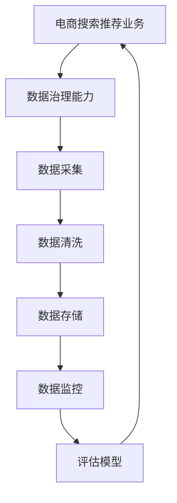

                 

# AI大模型助力电商搜索推荐业务的数据治理能力评估模型验证与优化

## 1. 背景介绍

在电商领域，搜索推荐业务一直是提升用户体验和销量增长的关键环节。随着人工智能技术的快速发展，大模型在电商搜索推荐中的应用也日益广泛。然而，电商业务涉及海量用户数据，数据质量的好坏直接影响模型的效果。因此，如何评估和优化数据治理能力，成为电商搜索推荐业务中一个重要且棘手的问题。本文将探讨使用AI大模型在电商搜索推荐业务中进行数据治理能力评估与优化的方法和实践。

## 2. 核心概念与联系

### 2.1 核心概念概述

**AI大模型**：指使用深度学习技术训练的超大参数量模型，如BERT、GPT-3等。通过大规模数据预训练，能够学习到复杂的语言和知识表示，在多个自然语言处理任务上表现优异。

**电商搜索推荐业务**：指基于用户行为、商品属性等数据，对用户进行智能推荐，提升用户购物体验和商家的转化率。

**数据治理能力**：指对数据进行采集、清洗、存储、管理的过程，确保数据质量、一致性和可用性。数据治理能力是电商搜索推荐业务的基础，直接影响推荐效果和用户体验。

通过构建一个基于AI大模型的数据治理能力评估模型，可以实时监控和评估电商搜索推荐业务的数据质量，及时发现并纠正数据治理问题，提升数据治理能力。

### 2.2 核心概念原理和架构的 Mermaid 流程图



上述流程图展示了电商搜索推荐业务的数据治理过程。数据治理能力的提升需要依赖数据采集、清洗、存储、监控和评估等多方面技术的协同作用。

## 3. 核心算法原理 & 具体操作步骤

### 3.1 算法原理概述

构建基于AI大模型的数据治理能力评估模型，其核心思想是利用大模型对电商搜索推荐业务中的数据质量进行综合评估，识别数据治理中的问题和不足，从而指导改进。

该模型的主要原理如下：

1. **数据质量评估**：通过构建评分模型，对电商搜索推荐业务中的数据进行综合评估，包括数据完整性、准确性、一致性、时效性等方面。
2. **问题定位**：基于评估结果，使用分类模型定位具体的数据治理问题，如数据缺失、异常值、重复数据等。
3. **改进建议**：根据问题定位结果，提出相应的数据治理改进建议，包括数据采集策略优化、清洗规则调整、存储结构改进等。

### 3.2 算法步骤详解

**Step 1: 数据采集与标注**

- 数据采集：从电商搜索推荐业务中收集相关的数据，包括用户行为数据、商品属性数据、交易数据等。
- 数据标注：对采集的数据进行标注，包括数据来源、类型、质量等相关信息。

**Step 2: 构建评分模型**

- 数据预处理：对采集的数据进行清洗、归一化等预处理操作。
- 特征提取：使用大模型对预处理后的数据进行特征提取，得到高维特征表示。
- 评分模型构建：构建评分模型，如基于Transformer的深度学习模型，用于对电商搜索推荐业务中的数据质量进行综合评估。

**Step 3: 问题定位**

- 数据治理问题分类：使用分类模型（如逻辑回归、SVM等）对数据治理问题进行分类，如数据缺失、异常值、重复数据等。
- 问题定位输出：根据分类结果输出具体的数据治理问题，以及对应的数据示例。

**Step 4: 改进建议生成**

- 数据治理建议生成：根据问题定位结果，提出相应的数据治理建议，如数据采集策略优化、清洗规则调整、存储结构改进等。
- 建议优化效果评估：通过后续的数据治理实践，评估建议的改进效果，不断迭代优化。

### 3.3 算法优缺点

**优点：**

1. **自动化评估**：使用AI大模型进行数据质量评估和问题定位，可以自动化的发现数据治理问题，减少人工干预。
2. **全视角评估**：大模型可以处理多种类型的数据，提供全面的数据质量评估，涵盖数据完整性、准确性、一致性、时效性等多个维度。
3. **灵活性高**：可以根据不同的电商业务需求，灵活调整数据治理模型和评估指标，满足个性化需求。

**缺点：**

1. **资源消耗大**：大模型训练和推理需要较大的计算资源，对硬件和算力要求较高。
2. **模型可解释性差**：大模型的内部工作机制复杂，难以解释其评估结果和问题定位依据。
3. **数据泛化能力不足**：大模型可能对特定电商业务的数据质量评估效果较好，但对其他业务的数据治理效果可能一般。

### 3.4 算法应用领域

该算法广泛应用于电商搜索推荐业务的各个环节，包括但不限于：

1. **用户行为数据治理**：通过评估用户行为数据的完整性和一致性，提升用户体验和推荐效果。
2. **商品属性数据治理**：通过评估商品属性数据的质量，优化商品推荐策略。
3. **交易数据治理**：通过评估交易数据的准确性和时效性，提升交易转化率。

## 4. 数学模型和公式 & 详细讲解 & 举例说明

### 4.1 数学模型构建

假设电商搜索推荐业务中，有 $n$ 个数据点 $D=\{d_1, d_2, ..., d_n\}$，其中每个数据点 $d_i$ 由 $m$ 个特征 $X_i = (x_{i1}, x_{i2}, ..., x_{im})$ 组成。数据治理能力评估模型的目标是综合评估每个数据点的质量，并定位其中的问题。

### 4.2 公式推导过程

1. **数据质量评分模型**：

   假设评分模型为 $f_{score}(X_i; \theta)$，其中 $\theta$ 为模型参数，$X_i$ 为数据点的特征向量。评分模型可以是基于Transformer的深度学习模型。

   $$
   f_{score}(X_i; \theta) = \sum_{j=1}^m w_j \cdot f_j(X_i; \theta_j)
   $$

   其中 $w_j$ 为特征权重，$f_j(X_i; \theta_j)$ 为每个特征的评分函数，$j$ 表示特征编号。

2. **数据治理问题分类模型**：

   假设分类模型为 $f_{classify}(X_i; \phi)$，其中 $\phi$ 为分类模型参数。分类模型可以是逻辑回归、SVM等传统机器学习模型，用于对数据治理问题进行分类。

   $$
   f_{classify}(X_i; \phi) = \text{softmax}(W \cdot X_i + b)
   $$

   其中 $W$ 和 $b$ 分别为分类模型的权重和偏置。

### 4.3 案例分析与讲解

以用户行为数据为例，假设数据点 $d_i$ 由点击量 $x_{i1}$、浏览时间 $x_{i2}$、购买金额 $x_{i3}$ 组成。可以构建评分模型和分类模型如下：

1. **评分模型**：

   $$
   f_{score}(X_i; \theta) = 0.4 \cdot \log(x_{i1}) + 0.3 \cdot x_{i2} + 0.3 \cdot \log(x_{i3})
   $$

2. **分类模型**：

   $$
   f_{classify}(X_i; \phi) = \text{softmax}(W \cdot [x_{i1}, x_{i2}, x_{i3}] + b)
   $$

   其中 $W$ 和 $b$ 为分类模型的权重和偏置，模型训练时需要使用标注数据。

## 5. 项目实践：代码实例和详细解释说明

### 5.1 开发环境搭建

在搭建开发环境时，需要使用深度学习框架和相关的库，如TensorFlow、PyTorch、NumPy等。以下是具体的步骤：

1. **安装深度学习框架**：

   ```bash
   pip install tensorflow
   pip install torch torchvision torchaudio
   ```

2. **安装相关库**：

   ```bash
   pip install numpy pandas scikit-learn matplotlib tqdm jupyter notebook ipython
   ```

3. **搭建数据采集与标注平台**：

   可以使用Spark、Hadoop等大数据处理平台，搭建数据采集与标注平台，确保数据的及时性和准确性。

### 5.2 源代码详细实现

以构建评分模型为例，以下是使用TensorFlow的代码实现：

```python
import tensorflow as tf
from tensorflow.keras import layers

# 数据预处理
def preprocess_data(data):
    # 数据清洗
    # ...
    # 数据归一化
    # ...
    return processed_data

# 评分模型构建
def build_score_model(input_dim):
    model = tf.keras.Sequential([
        layers.Dense(64, activation='relu', input_dim=input_dim),
        layers.Dense(32, activation='relu'),
        layers.Dense(1, activation='sigmoid')
    ])
    return model

# 数据治理问题分类模型构建
def build_classify_model(input_dim):
    model = tf.keras.Sequential([
        layers.Dense(64, activation='relu', input_dim=input_dim),
        layers.Dense(32, activation='relu'),
        layers.Dense(2, activation='softmax')
    ])
    return model

# 训练评分模型
def train_score_model(model, train_data, validation_data, epochs=10, batch_size=32):
    model.compile(optimizer='adam', loss='binary_crossentropy', metrics=['accuracy'])
    model.fit(train_data, validation_data, epochs=epochs, batch_size=batch_size)

# 训练分类模型
def train_classify_model(model, train_data, validation_data, epochs=10, batch_size=32):
    model.compile(optimizer='adam', loss='categorical_crossentropy', metrics=['accuracy'])
    model.fit(train_data, validation_data, epochs=epochs, batch_size=batch_size)

# 预测评分
def predict_score(model, data):
    return model.predict(data)

# 预测分类
def predict_classify(model, data):
    return model.predict(data)
```

### 5.3 代码解读与分析

**代码解释**：

1. **数据预处理**：使用Python脚本对数据进行清洗和归一化处理。
2. **评分模型构建**：使用TensorFlow的Sequential模型，构建评分模型。
3. **分类模型构建**：使用TensorFlow的Sequential模型，构建分类模型。
4. **模型训练**：使用TensorFlow的fit函数，对评分模型和分类模型进行训练。
5. **模型预测**：使用TensorFlow的predict函数，对数据进行评分和分类预测。

**代码分析**：

- 数据预处理部分，需要使用数据清洗和归一化等预处理技术，确保数据的质量。
- 评分模型和分类模型的构建，需要根据具体业务需求设计合适的模型结构，并进行训练。
- 模型的训练部分，需要选择合适的优化器和损失函数，并在训练过程中监控模型性能。
- 模型的预测部分，需要根据评分模型和分类模型，对新数据进行评分和分类预测。

## 6. 实际应用场景

### 6.1 电商搜索推荐业务

在电商搜索推荐业务中，数据治理能力评估模型可以实时监控和评估用户行为数据、商品属性数据、交易数据等数据质量，及时发现并纠正数据治理问题，提升数据治理能力，从而提升推荐效果和用户体验。

### 6.2 智能客服

智能客服业务中，数据治理能力评估模型可以实时监控和评估客户咨询数据，及时发现并纠正数据治理问题，确保客服系统稳定运行，提升客户满意度。

### 6.3 金融风控

金融风控业务中，数据治理能力评估模型可以实时监控和评估用户交易数据，及时发现并纠正数据治理问题，确保金融系统的安全性，防范金融风险。

### 6.4 未来应用展望

随着AI大模型的不断发展，数据治理能力评估模型也将不断优化和提升。未来，该模型将在更多领域得到应用，为业务数据治理提供更加智能化的解决方案。

## 7. 工具和资源推荐

### 7.1 学习资源推荐

1. **《深度学习基础》课程**：由斯坦福大学Andrew Ng教授主讲，介绍了深度学习的基础理论和实践技巧。
2. **《TensorFlow官方文档》**：详细介绍了TensorFlow的API和使用方法，适合初学者学习。
3. **《Python数据科学手册》**：介绍了Python在数据科学领域的应用，包括数据预处理、模型训练等。

### 7.2 开发工具推荐

1. **TensorFlow**：Google开源的深度学习框架，支持大规模分布式训练。
2. **PyTorch**：Facebook开源的深度学习框架，支持动态图和静态图两种计算图模式。
3. **Jupyter Notebook**：交互式的开发环境，支持Python、R等语言。

### 7.3 相关论文推荐

1. **《深度学习理论与应用》**：全面介绍了深度学习的基本理论和应用实例，适合对深度学习有基础的读者。
2. **《大规模数据治理技术》**：介绍了大数据治理的基本概念和实现技术，适合对数据治理感兴趣的读者。
3. **《深度学习在电商推荐系统中的应用》**：介绍了深度学习在电商推荐系统中的应用和优化方法，适合电商推荐系统的开发者。

## 8. 总结：未来发展趋势与挑战

### 8.1 研究成果总结

本文探讨了使用AI大模型在电商搜索推荐业务中进行数据治理能力评估与优化的方法和实践，总结了以下几点：

1. **自动化评估**：使用AI大模型进行数据质量评估和问题定位，可以自动化的发现数据治理问题，减少人工干预。
2. **全视角评估**：大模型可以处理多种类型的数据，提供全面的数据质量评估，涵盖数据完整性、准确性、一致性、时效性等多个维度。
3. **灵活性高**：可以根据不同的电商业务需求，灵活调整数据治理模型和评估指标，满足个性化需求。

### 8.2 未来发展趋势

1. **多模态数据融合**：未来的数据治理模型将支持多模态数据融合，如文本、图像、语音等多类型数据的联合治理。
2. **分布式训练**：随着数据量的增加，分布式训练将成为数据治理模型的必备技术。
3. **实时化处理**：实时化的数据治理模型将能够实时监控和处理数据治理问题，提升数据治理效率。

### 8.3 面临的挑战

1. **数据隐私与安全**：电商搜索推荐业务涉及大量用户隐私数据，如何保证数据隐私和安全，是数据治理模型面临的主要挑战。
2. **模型可解释性**：AI大模型的内部工作机制复杂，难以解释其评估结果和问题定位依据，如何提高模型的可解释性，将是未来重要的研究方向。
3. **资源消耗**：大模型训练和推理需要较大的计算资源，如何降低资源消耗，提高模型效率，是未来的研究方向。

### 8.4 研究展望

1. **隐私保护技术**：研究隐私保护技术，确保数据治理模型在处理用户隐私数据时的安全性。
2. **模型可解释性**：研究模型可解释性技术，使数据治理模型能够提供更加详细的评估报告和问题定位依据。
3. **分布式训练**：研究分布式训练技术，提升数据治理模型的训练效率和处理能力。

## 9. 附录：常见问题与解答

**Q1: 如何构建评分模型？**

A: 构建评分模型需要先进行特征提取，使用大模型对数据进行特征表示，然后使用评分模型对特征表示进行评分。例如，可以使用Transformer模型对数据进行特征提取，然后构建评分模型，如线性回归、逻辑回归等。

**Q2: 数据治理问题分类模型的训练需要多少数据？**

A: 数据治理问题分类模型的训练需要足够的标注数据。通常需要至少千级以上的标注数据，以确保分类模型的准确性和泛化能力。

**Q3: 数据治理能力评估模型是否适用于所有电商业务？**

A: 数据治理能力评估模型可以适用于大多数电商业务，但具体效果需要根据电商业务的业务场景和数据特点进行调整和优化。

**Q4: 数据治理能力评估模型的优化效果如何评估？**

A: 数据治理能力评估模型的优化效果可以通过模型在数据治理问题上的预测准确率进行评估。同时，可以通过后续的数据治理实践，评估模型改进建议的实际效果。

**Q5: 如何处理数据治理中的异常值问题？**

A: 处理数据治理中的异常值问题，可以使用数据清洗技术，如去除重复数据、修正错误数据等。也可以使用异常值检测算法，如基于统计的离群点检测算法，或基于机器学习的异常值检测算法，对异常值进行识别和处理。

作者：禅与计算机程序设计艺术 / Zen and the Art of Computer Programming

