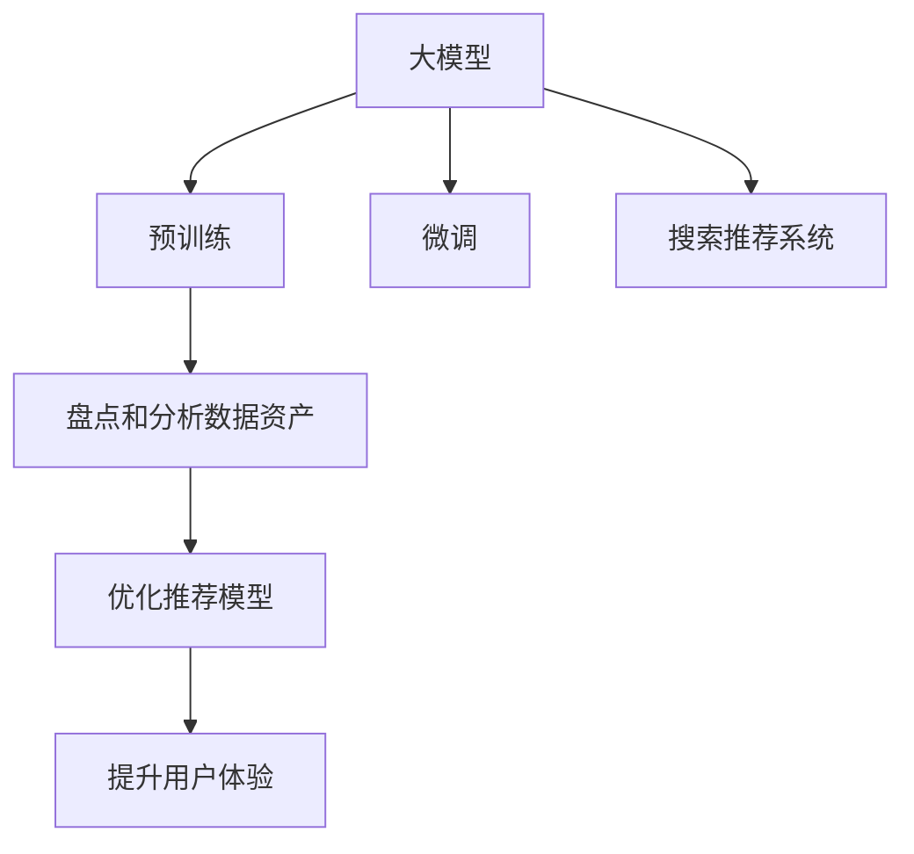

                 

# AI大模型助力电商搜索推荐业务的数据资产盘点方法

## 1. 背景介绍

### 1.1 问题由来
在现代电商环境中，搜索推荐系统（Search and Recommendation System, SRS）扮演着越来越重要的角色，直接影响着用户体验和商业价值。一个高效的搜索推荐系统，不仅能快速响应用户查询，还能个性化推荐商品，提升转化率。然而，构建这样一个系统并非易事，需要精心设计模型、优化算法，同时对业务数据进行全面盘点，确保数据资产的完备性和高质量。

目前，许多电商企业依赖于基于用户行为数据的推荐算法，如协同过滤、基于内容的推荐等。这些方法在推荐系统开发早期取得了不错的效果，但随着业务的发展，用户行为数据变得越来越稀疏且动态多变，导致推荐效果下降。为了解决这一问题，越来越多的企业开始引入大模型，利用深度学习和自然语言处理（NLP）技术，从文本数据中挖掘用户兴趣，提升推荐精度。

### 1.2 问题核心关键点
尽管大模型在推荐系统中的应用前景广阔，但数据资产的盘点仍然是一个不可忽视的问题。数据资产盘点不仅包括数据收集和清洗，更重要的是要确保数据的完备性和质量。通常，电商企业的数据资产包括用户行为数据（点击、浏览、购买等）、商品属性数据、用户画像数据等。对这些数据的盘点，有助于构建更加精准的推荐模型，提升用户满意度和电商业务收益。

本文聚焦于如何利用大模型技术，盘点和分析电商搜索推荐业务的数据资产，从而优化搜索推荐系统，提升用户体验和商业价值。具体来说，我们将探讨：

- 如何基于大模型构建搜索推荐系统。
- 如何盘点和分析电商数据资产。
- 如何利用数据资产优化推荐模型。

## 2. 核心概念与联系

### 2.1 核心概念概述

为更好地理解大模型在电商搜索推荐中的应用，本节将介绍几个关键概念：

- **大模型（Large Model）**：指在大量无标签数据上进行预训练，具有强大泛化能力和深度学习能力的模型。如BERT、GPT等。
- **预训练（Pre-training）**：指在大规模无标签数据上进行自监督学习，学习通用的语言或图像特征表示。
- **微调（Fine-tuning）**：指在预训练模型基础上，使用标注数据进行有监督学习，调整模型参数，使其适应特定任务。
- **搜索推荐系统（Search and Recommendation System, SRS）**：通过分析用户行为数据和商品属性数据，为每个用户提供个性化推荐。
- **数据资产（Data Asset）**：指企业掌握的数据资源，包括用户行为数据、商品属性数据、用户画像数据等。

这些概念之间的逻辑关系可以通过以下Mermaid流程图来展示：



这个流程图展示了大模型在构建搜索推荐系统中的应用路径：

1. 大模型通过预训练学习通用的语言或图像特征表示。
2. 微调模型，使其适应特定任务，如电商推荐。
3. 搜索推荐系统利用微调后的模型，为用户推荐商品。
4. 通过盘点和分析数据资产，优化推荐模型。
5. 最终提升用户体验，带来商业价值。

## 3. 核心算法原理 & 具体操作步骤

### 3.1 算法原理概述

基于大模型的电商搜索推荐系统，主要涉及以下几个步骤：

1. **数据收集和预处理**：收集用户行为数据、商品属性数据等，并进行数据清洗和标准化。
2. **数据表示学习**：使用大模型将文本数据或图像数据转换为低维向量表示。
3. **模型微调**：在预训练模型基础上，利用标注数据进行微调，调整模型参数，使其适应电商推荐任务。
4. **推荐系统构建**：将微调后的模型嵌入到电商搜索推荐系统中，进行商品推荐。
5. **数据资产盘点**：对收集的数据进行全面盘点和分析，确保数据资产的完备性和高质量。

本文将重点介绍如何使用大模型进行电商推荐的数据资产盘点，具体包括：

- **数据收集**：收集电商用户行为数据和商品属性数据。
- **数据表示**：使用大模型学习数据的低维向量表示。
- **数据盘点和分析**：利用数据表示，盘点和分析电商数据资产。

### 3.2 算法步骤详解

#### 3.2.1 数据收集和预处理

电商搜索推荐系统的数据收集主要包括以下几个方面：

- **用户行为数据**：包括用户的点击、浏览、购买行为等，通常存储在日志文件中。
- **商品属性数据**：包括商品的品牌、价格、分类、描述等信息，通常存储在商品信息库中。
- **用户画像数据**：包括用户的年龄、性别、兴趣偏好等信息，通常通过用户行为数据和商品属性数据推断生成。

数据收集完成后，需要进行预处理，主要包括数据清洗、去重、标准化等操作。例如，用户行为数据中可能包含异常值或缺失值，需要进行处理；商品属性数据可能存在格式不一致的问题，需要进行标准化；用户画像数据可能存在不完整或错误信息，需要进行修正。

#### 3.2.2 数据表示学习

数据表示学习是指将原始数据转换为低维向量表示，以便于模型的训练和推理。在大模型中，常用的数据表示学习方法包括：

- **词嵌入（Word Embedding）**：将文本数据转换为低维向量表示。常用的词嵌入模型包括Word2Vec、GloVe等。
- **图像嵌入（Image Embedding）**：将图像数据转换为低维向量表示。常用的图像嵌入模型包括VGG、ResNet等。

在电商搜索推荐系统中，通常使用大模型学习商品属性数据和用户行为数据的低维向量表示。例如，使用BERT模型对商品描述进行向量表示，使用GPT模型对用户行为进行编码。

#### 3.2.3 数据盘点和分析

数据盘点是指对电商数据资产进行全面盘查，了解数据的类型、质量、分布等基本信息。数据分析则是在数据盘点基础上，对数据进行深入挖掘，发现数据背后的规律和特征。

数据盘点和分析主要包括以下几个步骤：

1. **数据类型分析**：确定数据的基本类型，如文本、图像、数值等。
2. **数据质量评估**：评估数据的完整性、准确性、一致性等指标。
3. **数据分布分析**：分析数据的分布情况，如用户行为数据的分布、商品属性数据的分布等。
4. **数据相关性分析**：分析不同数据之间的相关性，发现潜在的用户行为和商品属性之间的关联。

在数据盘点和分析过程中，可以使用Python的Pandas库进行数据处理和分析，使用Scikit-learn库进行数据统计和可视化。

### 3.3 算法优缺点

基于大模型的电商搜索推荐系统，具有以下优点：

- **高泛化能力**：大模型经过大规模预训练，具备强大的泛化能力，可以在不同的数据分布下表现良好。
- **自动特征学习**：大模型能够自动学习数据的特征表示，无需手动设计特征工程。
- **模型高效**：大模型利用预训练知识，可以高效地进行微调，提升推荐精度。

同时，该方法也存在一些局限性：

- **数据依赖性强**：大模型的效果高度依赖于数据的质量和数量，数据不完整或噪声多会影响模型性能。
- **计算资源消耗大**：大模型的训练和推理需要大量的计算资源，对硬件要求高。
- **模型复杂度高**：大模型的结构复杂，模型解释性差，难以理解其内部工作机制。

尽管存在这些局限性，但就目前而言，基于大模型的电商推荐系统仍然是最主流的方法之一。未来相关研究的重点在于如何进一步降低数据依赖，提高模型的计算效率和可解释性，同时兼顾模型性能和资源消耗。

### 3.4 算法应用领域

基于大模型的电商搜索推荐系统，已经在多个电商企业中得到了应用，覆盖了商品推荐、个性化广告、用户画像分析等诸多场景，为电商业务带来了显著的提升：

- **商品推荐**：通过分析用户行为和商品属性数据，为用户推荐符合其兴趣的商品。
- **个性化广告**：基于用户画像和行为数据，进行精准广告投放，提升广告转化率。
- **用户画像分析**：利用用户行为数据和商品属性数据，推断用户兴趣和偏好，构建详细的用户画像，用于个性化推荐和广告投放。

除了这些核心应用外，大模型在电商搜索推荐系统中的应用还在不断扩展，如智能客服、智能仓储等，为电商企业的数字化转型提供了新的动力。

## 4. 数学模型和公式 & 详细讲解 & 举例说明

### 4.1 数学模型构建

假设电商数据集为 $D=\{(x_i,y_i)\}_{i=1}^N$，其中 $x_i$ 表示用户行为或商品属性，$y_i$ 表示用户对 $x_i$ 的评分或兴趣标签。大模型的输入为 $x_i$，输出为 $y_i$ 的概率分布。

定义模型 $M_{\theta}$ 在输入 $x_i$ 上的预测概率为 $P(y_i|x_i)$，则电商推荐系统的目标函数为：

$$
\mathcal{L}(\theta) = -\frac{1}{N}\sum_{i=1}^N \log P(y_i|x_i)
$$

其中 $\theta$ 为大模型的参数。

### 4.2 公式推导过程

在电商推荐系统中，常用的模型包括协同过滤模型、基于内容的推荐模型和混合推荐模型。这里以协同过滤模型为例，推导其中的数学公式。

协同过滤模型假设用户 $i$ 和商品 $j$ 之间的关系可以表示为：

$$
\hat{r}_{ij} = \mu + \sum_{k=1}^K w_k \times (\alpha_{ik} \times \beta_{kj})
$$

其中 $\hat{r}_{ij}$ 表示用户 $i$ 对商品 $j$ 的评分预测值，$\mu$ 为评分均值，$w_k$ 为特征权重，$\alpha_{ik}$ 和 $\beta_{kj}$ 分别为用户 $i$ 和商品 $j$ 在特征 $k$ 上的表示。

为了将协同过滤模型与大模型结合，需要将用户行为和商品属性数据转换为低维向量表示，使用大模型进行预测。假设用户 $i$ 和商品 $j$ 的低维向量表示分别为 $u_i$ 和 $v_j$，则协同过滤模型的预测公式可以表示为：

$$
\hat{r}_{ij} = \mu + \sum_{k=1}^K \omega_k \times (u_i \cdot v_k \times w_{ki})
$$

其中 $u_i$ 和 $v_j$ 分别为用户 $i$ 和商品 $j$ 的低维向量表示，$w_{ki}$ 为特征 $k$ 对应的权重。

### 4.3 案例分析与讲解

假设某电商企业收集到用户行为数据和商品属性数据，共有用户100万，商品100万。用户行为数据包括点击、浏览、购买等行为，商品属性数据包括商品的品牌、价格、分类、描述等信息。

通过对数据进行预处理和表示学习，使用BERT模型对商品描述进行向量表示，使用GPT模型对用户行为进行编码。然后，利用协同过滤模型，对用户行为和商品属性数据进行建模，预测用户对商品的评分。

假设模型参数 $\theta$ 经过优化后，得到用户 $i$ 对商品 $j$ 的评分预测值 $\hat{r}_{ij}$。根据评分预测值，电商企业可以为用户推荐与其评分相近的商品，提升用户满意度。

## 5. 项目实践：代码实例和详细解释说明

### 5.1 开发环境搭建

在进行电商推荐系统开发前，我们需要准备好开发环境。以下是使用Python进行TensorFlow开发的环境配置流程：

1. 安装Anaconda：从官网下载并安装Anaconda，用于创建独立的Python环境。

2. 创建并激活虚拟环境：
```bash
conda create -n tensorflow-env python=3.8 
conda activate tensorflow-env
```

3. 安装TensorFlow：根据CUDA版本，从官网获取对应的安装命令。例如：
```bash
conda install tensorflow-gpu=2.6 -c tf -c conda-forge
```

4. 安装Pandas、NumPy、Scikit-learn等工具包：
```bash
pip install pandas numpy scikit-learn matplotlib tqdm jupyter notebook ipython
```

5. 安装相关预训练模型：
```bash
pip install bert embeddings-gpt transformers
```

完成上述步骤后，即可在`tensorflow-env`环境中开始电商推荐系统的开发。

### 5.2 源代码详细实现

我们以一个简单的电商推荐系统为例，展示如何使用BERT和GPT模型进行推荐。

首先，定义电商推荐系统的数据集：

```python
import pandas as pd
import numpy as np

# 假设有商品属性数据和用户行为数据
# 商品属性数据
product_data = pd.read_csv('product_data.csv')

# 用户行为数据
user_behavior = pd.read_csv('user_behavior.csv')

# 合并商品属性数据和用户行为数据
data = pd.merge(product_data, user_behavior, on='user_id')
```

然后，定义推荐模型的输入输出：

```python
from transformers import BertTokenizer, BertModel

# 定义BERT模型
tokenizer = BertTokenizer.from_pretrained('bert-base-uncased')
model = BertModel.from_pretrained('bert-base-uncased')

# 将用户行为数据转换为低维向量表示
def get_user_vector(user_id, tokenizer, model):
    user_behavior = data[data['user_id'] == user_id]['behavior']
    user_vector = []
    for behavior in user_behavior:
        tokens = tokenizer.encode_plus(behavior, return_tensors='pt')
        vector = model(**tokens).last_hidden_state
        user_vector.append(vector)
    user_vector = torch.cat(user_vector, dim=0)
    return user_vector

# 将商品属性数据转换为低维向量表示
def get_product_vector(product_id, tokenizer, model):
    product_description = product_data[product_data['product_id'] == product_id]['description']
    product_vector = []
    for description in product_description:
        tokens = tokenizer.encode_plus(description, return_tensors='pt')
        vector = model(**tokens).last_hidden_state
        product_vector.append(vector)
    product_vector = torch.cat(product_vector, dim=0)
    return product_vector
```

接着，定义推荐模型：

```python
from tensorflow.keras.layers import Input, Dense, Embedding, Concatenate, dot

# 定义用户输入和商品输入
user_input = Input(shape=(max_len,), dtype='int32')
product_input = Input(shape=(max_len,), dtype='int32')

# 用户向量表示
user_vector = get_user_vector(user_input, tokenizer, model)

# 商品向量表示
product_vector = get_product_vector(product_input, tokenizer, model)

# 定义推荐模型
dot_product = dot([user_vector, product_vector], axes=2)
prediction = Dense(1, activation='sigmoid')(dot_product)

# 定义推荐模型
model = Model(inputs=[user_input, product_input], outputs=prediction)
model.compile(loss='binary_crossentropy', optimizer='adam', metrics=['accuracy'])
```

最后，训练和测试推荐模型：

```python
# 训练推荐模型
model.fit([user_behavior, product_description], 'click', epochs=10, batch_size=32)

# 测试推荐模型
test_data = pd.read_csv('test_data.csv')
test_predictions = model.predict([test_data['behavior'], test_data['description']])
```

以上就是使用TensorFlow对电商推荐系统进行开发的完整代码实现。可以看到，使用BERT和GPT模型，可以方便地将文本数据转换为低维向量表示，并将其应用于推荐系统中。

### 5.3 代码解读与分析

让我们再详细解读一下关键代码的实现细节：

**电商数据集**：
- 使用Pandas库读取商品属性数据和用户行为数据，将其合并为统一的DataFrame格式。

**输入输出定义**：
- 使用Transformers库的BERTTokenizer和BERTModel，定义输入和输出的低维向量表示。
- 将用户行为数据和商品属性数据转换为低维向量表示，使用BERT模型进行编码。

**推荐模型构建**：
- 使用Keras库定义推荐模型，包括用户输入、商品输入、低维向量表示、点积运算和输出层。
- 定义推荐模型的损失函数、优化器和评价指标，编译模型。

**训练和测试**：
- 使用模型训练方法训练推荐模型，使用测试数据进行预测。

可以看到，使用TensorFlow进行电商推荐系统的开发，可以方便地整合多种预训练模型，进行高效的数据表示和模型训练。

当然，工业级的系统实现还需考虑更多因素，如模型的保存和部署、超参数的自动搜索、更灵活的任务适配层等。但核心的推荐范式基本与此类似。

## 6. 实际应用场景

### 6.1 智能客服系统

智能客服系统利用电商搜索推荐技术，为用户提供个性化服务，提升客户满意度。智能客服通过分析用户行为数据，预测用户意图，及时响应客户咨询，解决用户问题。

在技术实现上，可以收集用户的历史查询记录，将查询-答案对作为监督数据，训练模型学习匹配答案。微调后的模型能够自动理解用户意图，匹配最合适的答案模板进行回复。对于客户提出的新问题，还可以接入检索系统实时搜索相关内容，动态组织生成回答。如此构建的智能客服系统，能大幅提升客户咨询体验和问题解决效率。

### 6.2 金融舆情监测

金融机构需要实时监测市场舆论动向，以便及时应对负面信息传播，规避金融风险。传统的人工监测方式成本高、效率低，难以应对网络时代海量信息爆发的挑战。基于大模型和电商推荐技术，金融舆情监测系统可以自动监测不同主题下的情感变化趋势，一旦发现负面信息激增等异常情况，系统便会自动预警，帮助金融机构快速应对潜在风险。

具体而言，可以收集金融领域相关的新闻、报道、评论等文本数据，并对其进行主题标注和情感标注。在此基础上对预训练语言模型进行微调，使其能够自动判断文本属于何种主题，情感倾向是正面、中性还是负面。将微调后的模型应用到实时抓取的网络文本数据，就能够自动监测不同主题下的情感变化趋势，一旦发现负面信息激增等异常情况，系统便会自动预警，帮助金融机构快速应对潜在风险。

### 6.3 个性化推荐系统

当前的推荐系统往往只依赖用户的历史行为数据进行物品推荐，无法深入理解用户的真实兴趣偏好。基于大模型和电商推荐技术，个性化推荐系统可以更好地挖掘用户行为背后的语义信息，从而提供更精准、多样的推荐内容。

在实践中，可以收集用户浏览、点击、评论、分享等行为数据，提取和用户交互的物品标题、描述、标签等文本内容。将文本内容作为模型输入，用户的后续行为（如是否点击、购买等）作为监督信号，在此基础上微调预训练语言模型。微调后的模型能够从文本内容中准确把握用户的兴趣点。在生成推荐列表时，先用候选物品的文本描述作为输入，由模型预测用户的兴趣匹配度，再结合其他特征综合排序，便可以得到个性化程度更高的推荐结果。

### 6.4 未来应用展望

随着大模型和电商推荐技术的不断发展，基于微调范式将在更多领域得到应用，为传统行业带来变革性影响。

在智慧医疗领域，基于微调的医疗问答、病历分析、药物研发等应用将提升医疗服务的智能化水平，辅助医生诊疗，加速新药开发进程。

在智能教育领域，微调技术可应用于作业批改、学情分析、知识推荐等方面，因材施教，促进教育公平，提高教学质量。

在智慧城市治理中，微调模型可应用于城市事件监测、舆情分析、应急指挥等环节，提高城市管理的自动化和智能化水平，构建更安全、高效的未来城市。

此外，在企业生产、社会治理、文娱传媒等众多领域，基于大模型和电商推荐技术的微调方法也将不断涌现，为NLP技术带来了全新的突破。相信随着预训练模型和微调方法的持续演进，大语言模型微调必将在构建人机协同的智能时代中扮演越来越重要的角色。

## 7. 工具和资源推荐

### 7.1 学习资源推荐

为了帮助开发者系统掌握大模型和电商推荐技术，这里推荐一些优质的学习资源：

1. 《Transformers from Deep Learning to NLP》系列博文：由大模型技术专家撰写，深入浅出地介绍了Transformer原理、BERT模型、推荐系统等前沿话题。

2. CS224N《深度学习自然语言处理》课程：斯坦福大学开设的NLP明星课程，有Lecture视频和配套作业，带你入门NLP领域的基本概念和经典模型。

3. 《Natural Language Processing with Transformers》书籍：Transformers库的作者所著，全面介绍了如何使用Transformers库进行NLP任务开发，包括电商推荐在内的诸多范式。

4. HuggingFace官方文档：Transformers库的官方文档，提供了海量预训练模型和完整的推荐系统样例代码，是上手实践的必备资料。

5. DeepLearning.ai《深度学习应用》课程：涵盖深度学习在电商推荐、金融预测等实际应用中的技术，注重理论与实践相结合。

通过对这些资源的学习实践，相信你一定能够快速掌握大模型和电商推荐技术的精髓，并用于解决实际的NLP问题。

### 7.2 开发工具推荐

高效的开发离不开优秀的工具支持。以下是几款用于电商推荐系统开发的常用工具：

1. TensorFlow：基于Python的开源深度学习框架，灵活动态的计算图，适合快速迭代研究。支持多种预训练模型，适用于电商推荐系统。

2. PyTorch：基于Python的开源深度学习框架，动态计算图，适用于复杂模型和深度学习研究。支持多种预训练模型，适用于电商推荐系统。

3. HuggingFace Transformers库：集成了多种SOTA预训练模型，支持PyTorch和TensorFlow，是进行电商推荐系统开发的利器。

4. Weights & Biases：模型训练的实验跟踪工具，可以记录和可视化模型训练过程中的各项指标，方便对比和调优。与主流深度学习框架无缝集成。

5. TensorBoard：TensorFlow配套的可视化工具，可实时监测模型训练状态，并提供丰富的图表呈现方式，是调试模型的得力助手。

6. Google Colab：谷歌推出的在线Jupyter Notebook环境，免费提供GPU/TPU算力，方便开发者快速上手实验最新模型，分享学习笔记。

合理利用这些工具，可以显著提升电商推荐系统的开发效率，加快创新迭代的步伐。

### 7.3 相关论文推荐

大模型和电商推荐技术的发展源于学界的持续研究。以下是几篇奠基性的相关论文，推荐阅读：

1. Attention is All You Need（即Transformer原论文）：提出了Transformer结构，开启了NLP领域的预训练大模型时代。

2. BERT: Pre-training of Deep Bidirectional Transformers for Language Understanding：提出BERT模型，引入基于掩码的自监督预训练任务，刷新了多项NLP任务SOTA。

3. Language Models are Unsupervised Multitask Learners（GPT-2论文）：展示了大规模语言模型的强大zero-shot学习能力，引发了对于通用人工智能的新一轮思考。

4. Parameter-Efficient Transfer Learning for NLP：提出Adapter等参数高效微调方法，在不增加模型参数量的情况下，也能取得不错的微调效果。

5. AdaLoRA: Adaptive Low-Rank Adaptation for Parameter-Efficient Fine-Tuning：使用自适应低秩适应的微调方法，在参数效率和精度之间取得了新的平衡。

6. XLNet: Generalized Autoregressive Pretraining for Language Understanding：提出XLNet模型，利用上下文预测任务，改进预训练目标函数，提升模型性能。

这些论文代表了大模型和电商推荐技术的发展脉络。通过学习这些前沿成果，可以帮助研究者把握学科前进方向，激发更多的创新灵感。

## 8. 总结：未来发展趋势与挑战

### 8.1 总结

本文对基于大模型和电商推荐技术的电商搜索推荐系统进行了全面系统的介绍。首先阐述了大模型和电商推荐技术的研究背景和意义，明确了电商推荐系统开发过程中数据资产盘点的重要性。其次，从原理到实践，详细讲解了电商推荐系统构建和数据资产盘点的方法，给出了电商推荐系统开发的完整代码实现。同时，本文还广泛探讨了电商推荐系统在智能客服、金融舆情、个性化推荐等多个行业领域的应用前景，展示了电商推荐系统的巨大潜力。

通过本文的系统梳理，可以看到，基于大模型和电商推荐技术的电商搜索推荐系统正在成为电商企业的重要手段，极大地提升了用户体验和商业价值。未来，伴随大模型和电商推荐技术的持续演进，基于微调范式将在更多领域得到应用，为传统行业带来变革性影响。

### 8.2 未来发展趋势

展望未来，电商推荐技术将呈现以下几个发展趋势：

1. 数据资产的丰富化和多样化。随着电商业务的不断扩展，数据资产的类型和数量将不断丰富，涵盖文本、图像、语音等多模态数据，为推荐系统提供更全面的用户和商品信息。

2. 推荐算法的智能化和自适应化。未来的推荐系统将更多地结合机器学习和人工智能技术，通过自适应算法，动态调整推荐策略，提升推荐效果。

3. 推荐系统的个性化和定制化。通过分析用户的实时行为和上下文信息，实现更加个性化和定制化的推荐，提升用户满意度。

4. 推荐系统的实时化和交互化。利用实时数据流处理技术，实现推荐系统的实时化和交互化，提升用户体验和系统响应速度。

5. 推荐系统的可解释化和透明化。未来的推荐系统将更加注重可解释性和透明性，通过规则化和约束化手段，提升系统的可信度和可靠性。

以上趋势凸显了电商推荐技术的广阔前景。这些方向的探索发展，必将进一步提升推荐系统的精度和效果，推动电商业务的发展和创新。

### 8.3 面临的挑战

尽管电商推荐技术已经取得了不小的进展，但在迈向更加智能化、普适化应用的过程中，仍面临诸多挑战：

1. 数据依赖性强。电商推荐系统的性能高度依赖于数据的质量和数量，数据不完整或噪声多会影响推荐效果。如何进一步降低数据依赖，提高数据质量，是一个重要的问题。

2. 模型复杂度高。大模型和电商推荐系统结构复杂，模型解释性差，难以理解其内部工作机制。如何设计更加简单、可解释性强的推荐模型，是一个亟待解决的问题。

3. 计算资源消耗大。大模型和电商推荐系统需要大量的计算资源，对硬件要求高。如何优化计算资源消耗，实现高效推理，是一个需要解决的问题。

4. 推荐系统鲁棒性差。电商推荐系统在面对异常数据和噪声数据时，容易发生波动，推荐效果不稳定。如何提高推荐系统的鲁棒性，是一个需要解决的问题。

5. 用户隐私保护。电商推荐系统需要收集和分析用户数据，涉及用户隐私问题。如何保护用户隐私，是一个需要解决的问题。

6. 推荐系统的公平性和透明性。电商推荐系统需要保证推荐的公平性和透明性，避免歧视性推荐。如何设计公平透明的推荐算法，是一个需要解决的问题。

以上挑战是电商推荐技术发展过程中不可忽视的问题。如何克服这些挑战，将是大模型和电商推荐系统不断完善和进步的关键。

### 8.4 研究展望

面对电商推荐技术所面临的挑战，未来的研究需要在以下几个方面寻求新的突破：

1. 探索无监督和半监督推荐方法。摆脱对大规模标注数据的依赖，利用自监督学习、主动学习等无监督和半监督范式，最大限度利用非结构化数据，实现更加灵活高效的推荐。

2. 研究参数高效和计算高效的推荐方法。开发更加参数高效的推荐算法，在固定大部分预训练参数的同时，只更新极少量的任务相关参数。同时优化推荐系统的计算图，减少前向传播和反向传播的资源消耗，实现更加轻量级、实时性的部署。

3. 融合因果分析和博弈论工具。将因果分析方法引入推荐系统，识别出推荐决策的关键特征，增强推荐输出的因果性和逻辑性。借助博弈论工具刻画人机交互过程，主动探索并规避推荐系统的脆弱点，提高系统稳定性。

4. 纳入伦理道德约束。在推荐算法的设计和优化过程中，纳入伦理导向的评估指标，过滤和惩罚有偏见、有害的推荐结果，确保推荐系统的公平性和透明性。

5. 开发跨模态推荐系统。将文本、图像、语音等多模态数据进行融合，实现更加全面、准确的推荐，提升用户体验和系统效果。

6. 实现个性化推荐与个性化广告的结合。通过分析用户行为数据和商品属性数据，构建详细的用户画像，实现更加个性化和精准的推荐与广告投放，提升用户满意度和商业价值。

这些研究方向的探索，必将引领电商推荐技术的进步，为电商企业提供更高效、更智能的推荐服务，推动电商业务的数字化转型。

## 9. 附录：常见问题与解答

**Q1：电商推荐系统如何利用大模型进行数据资产盘点？**

A: 电商推荐系统可以利用大模型学习数据资产的低维向量表示，然后进行盘点和分析。例如，使用BERT模型对商品描述进行向量表示，使用GPT模型对用户行为进行编码。通过对向量表示进行聚类、分析，可以了解数据的分布情况和相关性，发现潜在的用户行为和商品属性之间的关联。

**Q2：电商推荐系统在数据资产盘点中需要注意哪些问题？**

A: 电商推荐系统在数据资产盘点中，需要注意以下几个问题：
1. 数据类型分析：确定数据的基本类型，如文本、图像、数值等。
2. 数据质量评估：评估数据的完整性、准确性、一致性等指标。
3. 数据分布分析：分析数据的分布情况，如用户行为数据的分布、商品属性数据的分布等。
4. 数据相关性分析：分析不同数据之间的相关性，发现潜在的用户行为和商品属性之间的关联。

通过全面的数据盘点和分析，可以了解电商数据资产的基本情况，确保数据资产的完备性和高质量。

**Q3：电商推荐系统在数据资产盘点中，如何使用大模型进行优化？**

A: 电商推荐系统可以通过以下步骤使用大模型进行优化：
1. 数据收集：收集电商用户行为数据和商品属性数据。
2. 数据表示学习：使用大模型将文本数据或图像数据转换为低维向量表示。
3. 数据盘点和分析：利用数据表示，盘点和分析电商数据资产。
4. 推荐模型优化：根据盘点和分析的结果，优化推荐模型，提升推荐精度。

通过利用大模型的泛化能力和自监督学习能力，可以更全面、准确地盘点和分析电商数据资产，提升电商推荐系统的性能。

**Q4：电商推荐系统在数据资产盘点中，如何保障数据安全？**

A: 电商推荐系统在数据资产盘点中，保障数据安全的方法包括：
1. 数据加密：对敏感数据进行加密处理，确保数据传输和存储的安全。
2. 数据访问控制：对数据访问进行严格控制，确保只有授权人员才能访问敏感数据。
3. 数据匿名化：对用户数据进行匿名化处理，保护用户隐私。
4. 数据备份：定期对数据进行备份，确保数据不会因为故障或攻击而丢失。
5. 数据监控：实时监控数据访问和使用情况，及时发现异常行为。

通过这些方法，可以保障电商推荐系统在数据资产盘点过程中，数据的安全性和隐私保护。

**Q5：电商推荐系统在数据资产盘点中，如何应对数据多样性问题？**

A: 电商推荐系统在数据资产盘点中，应对数据多样性问题的方法包括：
1. 数据标准化：对不同数据源的数据进行标准化处理，确保数据格式一致。
2. 数据融合：将不同来源的数据进行融合，生成更全面、准确的数据资产。
3. 数据清洗：对噪声数据进行清洗，去除无用或错误的数据。
4. 数据增补：补充缺失的数据，确保数据资产的完整性。
5. 数据预处理：对数据进行预处理，如归一化、降维等，提升数据质量。

通过这些方法，可以应对电商数据资产的多样性和复杂性，确保数据资产的完备性和高质量。

---

作者：禅与计算机程序设计艺术 / Zen and the Art of Computer Programming

