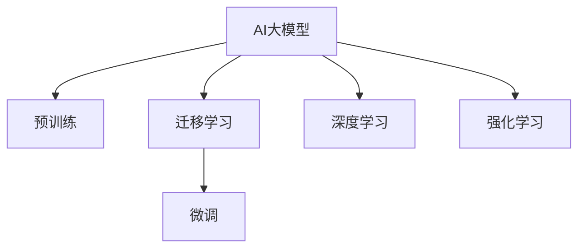

                 

# AI大模型在用户行为预测中的应用

> 关键词：用户行为预测,大模型,自监督学习,迁移学习,预训练,强化学习,深度学习,人工智能

## 1. 背景介绍

### 1.1 问题由来

在当今数字化时代，理解用户行为已经成为企业成功的关键。通过预测用户行为，企业可以优化产品设计、提升用户体验、制定精准的营销策略，从而在竞争中占据优势。然而，传统的数据分析方法难以捕捉用户行为背后复杂的心理和社交因素，无法满足现代商业决策的实时性和准确性需求。

人工智能和大数据技术的发展为这一问题提供了新的解决方案。特别是近年来，基于深度学习的AI大模型在自然语言处理(NLP)、计算机视觉(CV)、语音识别等领域取得了突破性进展，成为挖掘和理解用户行为的重要工具。

### 1.2 问题核心关键点

AI大模型在用户行为预测中的核心在于其强大的数据处理能力和泛化能力。通过大规模的无标签数据进行预训练，大模型能够自动学习到丰富的语言、图像、声音等特征表示。在此基础上，通过迁移学习和微调，大模型能够将所学知识迁移到特定的用户行为预测任务上，提升预测精度。

关键点包括：

1. **预训练**：利用大规模无标签数据进行预训练，学习通用的特征表示。
2. **迁移学习**：将预训练的知识迁移应用到具体的用户行为预测任务上。
3. **微调**：通过有标签数据对模型进行微调，优化特定任务的性能。
4. **深度学习**：采用深度神经网络结构，增强模型的非线性拟合能力。
5. **强化学习**：通过交互式学习，不断优化模型行为策略，提升预测效果。

## 2. 核心概念与联系

### 2.1 核心概念概述

为了更好地理解AI大模型在用户行为预测中的应用，我们将介绍几个关键概念及其联系：

- **AI大模型**：指基于深度学习架构（如Transformer），经过大规模数据预训练形成的复杂模型。其参数量巨大，可以处理大量多模态数据。
- **预训练**：通过在大规模无标签数据上自监督学习，学习到通用的特征表示。
- **迁移学习**：利用预训练模型在特定任务上的微调，提升模型性能。
- **微调**：在有标签数据上，通过反向传播更新模型参数，优化特定任务的性能。
- **深度学习**：采用多层神经网络结构，增强模型的非线性拟合能力。
- **强化学习**：通过与环境的交互，不断调整策略，提升模型性能。

这些概念之间的逻辑关系可以通过以下Mermaid流程图来展示：



该流程图展示了AI大模型从预训练到微调的过程，以及在深度学习和强化学习中的广泛应用。

## 3. 核心算法原理 & 具体操作步骤

### 3.1 算法原理概述

AI大模型在用户行为预测中的应用，主要基于以下算法原理：

1. **自监督预训练**：利用大规模无标签数据进行预训练，学习到通用的特征表示。
2. **迁移学习**：将预训练模型应用到特定任务上，通过微调提升模型性能。
3. **深度学习**：采用多层神经网络结构，增强模型的非线性拟合能力。
4. **强化学习**：通过与环境的交互，不断调整策略，优化预测效果。

这些原理在大模型的训练和应用中相互交织，共同推动了用户行为预测的发展。

### 3.2 算法步骤详解

AI大模型在用户行为预测中的应用，一般包括以下几个关键步骤：

**Step 1: 准备数据集**

1. **数据收集**：从各类数据源（如社交媒体、电商平台、智能设备等）收集用户行为数据。
2. **数据清洗与标注**：对数据进行去重、去噪、归一化处理，并根据预测任务进行标注。

**Step 2: 模型选择与预训练**

1. **模型选择**：选择适合的预训练模型，如BERT、GPT等。
2. **预训练**：利用大规模无标签数据进行预训练，学习到通用的特征表示。

**Step 3: 迁移学习与微调**

1. **迁移学习**：利用预训练模型在特定任务上的知识，进行迁移学习。
2. **微调**：在有标签数据上，通过微调优化模型性能。

**Step 4: 深度学习与强化学习**

1. **深度学习**：采用多层神经网络结构，增强模型的非线性拟合能力。
2. **强化学习**：通过与环境的交互，不断调整策略，优化预测效果。

**Step 5: 模型评估与部署**

1. **模型评估**：在验证集上评估模型性能，根据评估结果调整模型参数。
2. **模型部署**：将模型部署到实际应用环境中，进行实时预测。

### 3.3 算法优缺点

AI大模型在用户行为预测中的应用，具有以下优点：

1. **泛化能力强**：大模型通过大规模数据预训练，学习到通用的特征表示，能够适应不同的预测任务。
2. **自动化程度高**：预训练和微调过程自动化，减少了人工干预，提升了预测效率。
3. **性能提升显著**：通过迁移学习和微调，大模型能够显著提升特定任务的预测精度。

同时，这些方法也存在一些缺点：

1. **计算资源需求高**：预训练和微调过程需要大量的计算资源，增加了成本。
2. **数据依赖性强**：模型的性能依赖于数据质量和数量，数据不足会影响预测效果。
3. **模型可解释性差**：大模型往往是黑盒模型，难以解释其内部工作机制。

## 4. 数学模型和公式 & 详细讲解 & 举例说明

### 4.1 数学模型构建

AI大模型在用户行为预测中，通常采用深度神经网络结构，通过多层非线性映射，学习到复杂的特征表示。以下以文本分类任务为例，介绍模型的数学模型构建：

1. **输入层**：将用户行为数据转换为向量表示。
2. **隐藏层**：通过多层神经网络进行特征提取和变换。
3. **输出层**：将隐藏层的特征映射到预测结果的概率分布上。

数学模型如下：

$$
y = \sigma(\mathbf{W} \mathbf{x} + \mathbf{b})
$$

其中，$\mathbf{W}$ 为权重矩阵，$\mathbf{x}$ 为输入向量，$\mathbf{b}$ 为偏置向量，$\sigma$ 为激活函数，$y$ 为预测结果。

### 4.2 公式推导过程

以文本分类任务为例，假设模型的隐藏层为 $h = \sigma(\mathbf{W}_h \mathbf{x} + \mathbf{b}_h)$，输出层为 $y = \sigma(\mathbf{W}_y h + \mathbf{b}_y)$。模型的预测过程如下：

1. **输入表示**：将输入文本转换为向量表示 $\mathbf{x}$。
2. **隐藏层表示**：通过多层神经网络进行特征提取，得到隐藏层表示 $h$。
3. **输出表示**：将隐藏层表示映射到预测结果的概率分布上，得到预测结果 $y$。

预测过程的公式如下：

$$
y = \sigma(\mathbf{W}_y h + \mathbf{b}_y)
$$

### 4.3 案例分析与讲解

以电商平台的用户购买行为预测为例，通过AI大模型进行预测的步骤如下：

1. **数据准备**：收集电商平台的购买记录，包括用户ID、商品ID、购买时间、购买金额等。
2. **数据预处理**：对数据进行去重、去噪、归一化处理。
3. **模型选择**：选择BERT等预训练模型。
4. **预训练**：利用大规模无标签数据进行预训练，学习到通用的特征表示。
5. **迁移学习**：利用预训练模型在电商平台购买行为预测任务上进行微调，提升模型性能。
6. **深度学习**：采用多层神经网络结构，增强模型的非线性拟合能力。
7. **模型评估**：在验证集上评估模型性能，根据评估结果调整模型参数。
8. **模型部署**：将模型部署到电商平台的推荐系统中，进行实时预测。

## 5. 项目实践：代码实例和详细解释说明

### 5.1 开发环境搭建

在进行用户行为预测任务开发前，我们需要准备好开发环境。以下是使用Python进行TensorFlow开发的环境配置流程：

1. 安装Anaconda：从官网下载并安装Anaconda，用于创建独立的Python环境。

2. 创建并激活虚拟环境：
```bash
conda create -n tf-env python=3.8 
conda activate tf-env
```

3. 安装TensorFlow：根据CUDA版本，从官网获取对应的安装命令。例如：
```bash
conda install tensorflow tensorflow-cpu -c conda-forge
```

4. 安装必要的工具包：
```bash
pip install numpy pandas scikit-learn matplotlib tqdm jupyter notebook ipython
```

完成上述步骤后，即可在`tf-env`环境中开始开发用户行为预测任务。

### 5.2 源代码详细实现

以下是使用TensorFlow对用户购买行为预测任务进行微调的Python代码实现：

```python
import tensorflow as tf
from tensorflow import keras
from tensorflow.keras import layers
import numpy as np

# 定义模型
model = keras.Sequential([
    layers.Embedding(input_dim=10000, output_dim=256, input_length=100),
    layers.LSTM(128),
    layers.Dense(1, activation='sigmoid')
])

# 编译模型
model.compile(optimizer='adam', loss='binary_crossentropy', metrics=['accuracy'])

# 加载数据
train_data = np.load('train_data.npy')
train_labels = np.load('train_labels.npy')
val_data = np.load('val_data.npy')
val_labels = np.load('val_labels.npy')

# 划分训练集和验证集
train_size = int(0.8 * len(train_data))
val_data = train_data[train_size:]
val_labels = train_labels[train_size:]
train_data = train_data[:train_size]
train_labels = train_labels[:train_size]

# 训练模型
history = model.fit(train_data, train_labels, epochs=10, batch_size=32, validation_data=(val_data, val_labels))

# 评估模型
test_data = np.load('test_data.npy')
test_labels = np.load('test_labels.npy')
loss, accuracy = model.evaluate(test_data, test_labels)
print(f'Test loss: {loss:.4f}')
print(f'Test accuracy: {accuracy:.4f}')
```

在这个示例中，我们使用TensorFlow的Sequential模型结构，构建了一个包含嵌入层、LSTM层和全连接层的深度神经网络模型。模型采用二分类交叉熵损失函数，并使用Adam优化器进行训练。

### 5.3 代码解读与分析

让我们再详细解读一下关键代码的实现细节：

**Sequential模型**：
- 定义模型结构，包含嵌入层、LSTM层和全连接层。
- 编译模型，选择Adam优化器和二分类交叉熵损失函数。

**数据加载**：
- 使用Numpy加载训练数据和标签。
- 将数据划分为训练集和验证集。

**模型训练**：
- 使用模型在训练集上进行前向传播和反向传播，最小化损失函数。
- 在验证集上评估模型性能，调整模型参数。

**模型评估**：
- 使用模型在测试集上进行预测，并计算损失和准确率。

这个代码示例展示了TensorFlow在用户行为预测任务中的应用。通过简单的代码实现，可以快速构建和训练深度神经网络模型。

## 6. 实际应用场景

### 6.1 电商平台推荐系统

电商平台推荐系统通过AI大模型进行用户行为预测，能够实现个性化推荐，提升用户购买体验和平台营收。推荐系统通过收集用户浏览、点击、购买等行为数据，利用AI大模型预测用户可能感兴趣的商品，进行推荐。

具体实现步骤如下：

1. **数据准备**：收集用户行为数据，包括用户ID、商品ID、行为时间、行为类型等。
2. **数据预处理**：对数据进行去重、去噪、归一化处理。
3. **模型选择**：选择适合用户行为预测的预训练模型，如BERT、GPT等。
4. **预训练**：利用大规模无标签数据进行预训练，学习到通用的特征表示。
5. **迁移学习**：利用预训练模型在电商平台推荐任务上进行微调，提升模型性能。
6. **深度学习**：采用多层神经网络结构，增强模型的非线性拟合能力。
7. **模型评估**：在验证集上评估模型性能，根据评估结果调整模型参数。
8. **模型部署**：将模型部署到电商平台的推荐系统中，进行实时推荐。

### 6.2 社交媒体舆情监测

社交媒体舆情监测通过AI大模型进行用户行为预测，能够实时监控和分析社交媒体上的用户情绪和态度，帮助企业及时应对舆情危机。舆情监测通过收集用户在社交媒体上的评论、帖子等文本数据，利用AI大模型预测用户的情绪倾向和关注焦点，进行舆情分析和预警。

具体实现步骤如下：

1. **数据准备**：收集用户在社交媒体上的评论、帖子等文本数据。
2. **数据预处理**：对文本进行分词、去重、去噪、归一化处理。
3. **模型选择**：选择适合情感分析的预训练模型，如BERT、XLNet等。
4. **预训练**：利用大规模无标签数据进行预训练，学习到通用的特征表示。
5. **迁移学习**：利用预训练模型在情感分析任务上进行微调，提升模型性能。
6. **深度学习**：采用多层神经网络结构，增强模型的非线性拟合能力。
7. **模型评估**：在验证集上评估模型性能，根据评估结果调整模型参数。
8. **模型部署**：将模型部署到社交媒体舆情监测系统中，进行实时监控和预警。

### 6.3 金融市场投资分析

金融市场投资分析通过AI大模型进行用户行为预测，能够实时监控和分析市场动态，帮助投资者做出更精准的投资决策。投资分析通过收集市场交易数据、新闻报道、社交媒体等数据，利用AI大模型预测市场的趋势和波动，进行投资决策和风险控制。

具体实现步骤如下：

1. **数据准备**：收集市场交易数据、新闻报道、社交媒体等数据。
2. **数据预处理**：对数据进行去重、去噪、归一化处理。
3. **模型选择**：选择适合市场预测的预训练模型，如BERT、Transformer等。
4. **预训练**：利用大规模无标签数据进行预训练，学习到通用的特征表示。
5. **迁移学习**：利用预训练模型在市场预测任务上进行微调，提升模型性能。
6. **深度学习**：采用多层神经网络结构，增强模型的非线性拟合能力。
7. **模型评估**：在验证集上评估模型性能，根据评估结果调整模型参数。
8. **模型部署**：将模型部署到金融市场投资分析系统中，进行实时预测和决策。

### 6.4 未来应用展望

随着AI大模型和用户行为预测技术的不断发展，未来在更多领域将得到广泛应用，为各行业的数字化转型提供新的动力。

在智慧医疗领域，通过AI大模型进行用户行为预测，能够实现精准医疗、个性化治疗，提升医疗服务的智能化水平。

在智能教育领域，利用AI大模型进行用户行为预测，能够实现个性化教学、学情分析，促进教育公平，提高教学质量。

在智慧城市治理中，通过AI大模型进行用户行为预测，能够实现城市事件监测、舆情分析、应急指挥，提高城市管理的自动化和智能化水平，构建更安全、高效的未来城市。

## 7. 工具和资源推荐

### 7.1 学习资源推荐

为了帮助开发者系统掌握AI大模型在用户行为预测中的应用，这里推荐一些优质的学习资源：

1. 《深度学习理论与实践》系列博文：由深度学习专家撰写，深入浅出地介绍了深度学习理论、框架、应用等基础概念。
2. CS231n《卷积神经网络》课程：斯坦福大学开设的计算机视觉经典课程，有Lecture视频和配套作业，带你入门计算机视觉基础。
3. 《Transformers from Scratch》书籍：自然语言处理领域的经典教材，系统介绍了Transformer架构的原理和应用。
4. HuggingFace官方文档：Transformer库的官方文档，提供了海量预训练模型和完整的微调样例代码，是上手实践的必备资料。
5. OpenAI的Transformers框架：深度学习领域的重要框架，支持多种深度学习模型，提供丰富的预训练和微调功能。

通过对这些资源的学习实践，相信你一定能够快速掌握AI大模型在用户行为预测中的应用，并用于解决实际的NLP问题。

### 7.2 开发工具推荐

高效的开发离不开优秀的工具支持。以下是几款用于AI大模型用户行为预测开发的常用工具：

1. TensorFlow：由Google主导开发的深度学习框架，生产部署方便，适合大规模工程应用。
2. PyTorch：基于Python的开源深度学习框架，灵活动态的计算图，适合快速迭代研究。
3. Weights & Biases：模型训练的实验跟踪工具，可以记录和可视化模型训练过程中的各项指标，方便对比和调优。
4. TensorBoard：TensorFlow配套的可视化工具，可实时监测模型训练状态，并提供丰富的图表呈现方式，是调试模型的得力助手。

合理利用这些工具，可以显著提升AI大模型用户行为预测任务的开发效率，加快创新迭代的步伐。

### 7.3 相关论文推荐

AI大模型和用户行为预测技术的发展源于学界的持续研究。以下是几篇奠基性的相关论文，推荐阅读：

1. Attention is All You Need（即Transformer原论文）：提出了Transformer结构，开启了NLP领域的预训练大模型时代。
2. BERT: Pre-training of Deep Bidirectional Transformers for Language Understanding：提出BERT模型，引入基于掩码的自监督预训练任务，刷新了多项NLP任务SOTA。
3. Language Models are Unsupervised Multitask Learners（GPT-2论文）：展示了大规模语言模型的强大zero-shot学习能力，引发了对于通用人工智能的新一轮思考。
4. Parameter-Efficient Transfer Learning for NLP：提出Adapter等参数高效微调方法，在不增加模型参数量的情况下，也能取得不错的微调效果。
5. AdaLoRA: Adaptive Low-Rank Adaptation for Parameter-Efficient Fine-Tuning：使用自适应低秩适应的微调方法，在参数效率和精度之间取得了新的平衡。

这些论文代表了大模型和用户行为预测技术的发展脉络。通过学习这些前沿成果，可以帮助研究者把握学科前进方向，激发更多的创新灵感。

## 8. 总结：未来发展趋势与挑战

### 8.1 总结

本文对AI大模型在用户行为预测中的应用进行了全面系统的介绍。首先阐述了AI大模型和用户行为预测的研究背景和意义，明确了预训练、迁移学习和微调在大模型应用中的核心作用。其次，从原理到实践，详细讲解了AI大模型在用户行为预测任务中的数学模型构建和具体操作，给出了完整代码实例。同时，本文还广泛探讨了AI大模型在电商推荐、社交媒体舆情监测、金融投资分析等多个行业领域的应用前景，展示了AI大模型在用户行为预测中的巨大潜力。此外，本文精选了AI大模型用户行为预测任务的相关学习资源，力求为读者提供全方位的技术指引。

通过本文的系统梳理，可以看到，AI大模型在用户行为预测中的应用已经逐渐成为AI研究的热点，极大地拓展了用户行为分析的边界，推动了各行业数字化转型的进程。未来，伴随AI大模型和用户行为预测技术的持续演进，相信这些技术将带来更多创新的应用场景，深刻影响人类的生产生活方式。

### 8.2 未来发展趋势

展望未来，AI大模型在用户行为预测领域将呈现以下几个发展趋势：

1. **模型规模持续增大**：随着算力成本的下降和数据规模的扩张，AI大模型的参数量还将持续增长。超大规模AI大模型蕴含的丰富知识，有望支撑更加复杂多变的用户行为预测任务。
2. **迁移学习多样化**：除了传统的微调外，未来会涌现更多参数高效的迁移学习方式，如LoRA、MAML等，在节省计算资源的同时，也能保证预测精度。
3. **深度学习与强化学习结合**：通过与强化学习结合，AI大模型能够进行动态调整，提升预测效果和实时性。
4. **多模态数据融合**：AI大模型将进一步拓展到图像、视频、语音等多模态数据融合，增强对用户行为的全面理解。
5. **迁移学习与多任务学习结合**：通过多任务学习，AI大模型能够同时学习多个预测任务，提升模型的泛化能力和鲁棒性。

以上趋势凸显了AI大模型在用户行为预测中的广阔前景。这些方向的探索发展，必将进一步提升AI大模型的预测性能和应用范围，为各行各业带来新的变革。

### 8.3 面临的挑战

尽管AI大模型在用户行为预测中取得了显著成效，但在迈向更加智能化、普适化应用的过程中，仍面临诸多挑战：

1. **数据质量与数量**：模型的性能依赖于数据的质量和数量，数据不足或数据质量不高，会影响模型的预测效果。
2. **计算资源需求高**：AI大模型的预训练和微调过程需要大量的计算资源，增加了成本。
3. **模型可解释性差**：AI大模型往往是黑盒模型，难以解释其内部工作机制。
4. **泛化能力不足**：AI大模型在特定数据集上表现良好，但在新数据集上的泛化能力有限。
5. **隐私与安全**：用户行为预测涉及大量个人隐私数据，如何保护用户隐私和数据安全，是一大挑战。

正视这些挑战，积极应对并寻求突破，将是大模型在用户行为预测中走向成熟的必由之路。相信随着学界和产业界的共同努力，这些挑战终将一一被克服，AI大模型在用户行为预测中将发挥更大的作用。

### 8.4 研究展望

面对AI大模型用户行为预测所面临的挑战，未来的研究需要在以下几个方面寻求新的突破：

1. **数据增强与数据生成**：通过数据增强和数据生成技术，提升数据质量和数量，增强模型的泛化能力。
2. **模型压缩与优化**：开发更加轻量级的模型压缩和优化技术，降低计算资源需求。
3. **多模态数据融合**：进一步拓展AI大模型的应用范围，增强对多模态数据的处理能力。
4. **知识图谱与符号化推理**：将符号化的先验知识与AI大模型结合，提升模型的可解释性和鲁棒性。
5. **隐私保护与数据安全**：研究隐私保护与数据安全技术，保护用户隐私和数据安全。

这些研究方向将引领AI大模型用户行为预测技术迈向更高的台阶，为构建更加安全、可靠、可解释的智能系统提供有力支持。面向未来，AI大模型用户行为预测技术还需要与其他人工智能技术进行更深入的融合，如知识表示、因果推理、强化学习等，多路径协同发力，共同推动自然语言理解和智能交互系统的进步。只有勇于创新、敢于突破，才能不断拓展语言模型的边界，让智能技术更好地造福人类社会。

## 9. 附录：常见问题与解答

**Q1：AI大模型在用户行为预测中是否适用所有预测任务？**

A: AI大模型在用户行为预测中，通常适用于数据量较大、特征丰富的预测任务。但对于一些特定领域的预测任务，如医学、法律等，仅仅依靠通用语料预训练的模型可能难以很好地适应。此时需要在特定领域语料上进一步预训练，再进行微调，才能获得理想效果。

**Q2：如何选择适合用户行为预测的AI大模型？**

A: 选择适合用户行为预测的AI大模型时，需要考虑以下几个因素：
1. **任务类型**：选择适合特定任务类型的模型，如文本分类、图像分类、序列预测等。
2. **数据规模**：对于数据量较大的任务，选择大模型，如BERT、GPT等；对于数据量较小的任务，选择小模型，如ELMo、XLM等。
3. **计算资源**：考虑模型的计算资源需求，选择适合自身硬件条件的模型。
4. **可解释性**：选择具有较高可解释性的模型，方便模型调优和解释。

**Q3：在用户行为预测中如何避免过拟合？**

A: 在用户行为预测中，为了避免过拟合，可以采取以下措施：
1. **数据增强**：通过数据增强技术，扩充训练集，减少过拟合风险。
2. **正则化**：使用L2正则、Dropout等正则化技术，限制模型复杂度。
3. **早停策略**：在验证集上监控模型性能，一旦性能不再提升，立即停止训练，避免过拟合。
4. **模型集成**：通过模型集成技术，结合多个模型的预测结果，提升模型鲁棒性和泛化能力。

这些措施可以有效避免过拟合，提升用户行为预测模型的性能。

**Q4：AI大模型在用户行为预测中如何处理缺失数据？**

A: 在用户行为预测中，缺失数据是一个常见的问题。处理缺失数据的方法有以下几种：
1. **插值法**：通过插值技术，填补缺失数据。
2. **数据生成**：通过数据生成技术，生成缺失数据的替代值。
3. **模型集成**：通过模型集成技术，结合多个模型的预测结果，降低缺失数据的影响。
4. **特征工程**：通过特征工程技术，构造新的特征变量，减少缺失数据的影响。

这些方法可以有效处理缺失数据，提升用户行为预测模型的性能。

**Q5：AI大模型在用户行为预测中如何进行实时部署？**

A: 在用户行为预测中，进行实时部署需要注意以下几点：
1. **模型压缩**：通过模型压缩技术，减小模型尺寸，提高推理速度。
2. **模型缓存**：将模型进行缓存，减少模型的加载时间。
3. **模型服务化**：将模型封装为标准化的服务接口，方便调用。
4. **弹性伸缩**：根据请求流量动态调整资源配置，平衡服务质量和成本。
5. **监控告警**：实时采集系统指标，设置异常告警阈值，确保服务稳定性。

这些措施可以有效提升AI大模型在用户行为预测中的实时部署效率和性能。

---

作者：禅与计算机程序设计艺术 / Zen and the Art of Computer Programming

