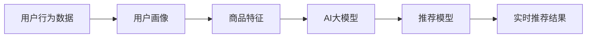

                 

# AI大模型在电商实时推荐中的应用与优化

## 1. 背景介绍

随着电商市场的不断扩大，消费者对于个性化推荐系统的需求日益增加。传统推荐系统往往依赖于用户行为数据和产品特征，难以突破数据量的瓶颈，导致推荐效果欠佳。近年来，基于深度学习的推荐系统逐步崭露头角，特别是使用AI大模型进行推荐，极大地提升了推荐的个性化和精准度。AI大模型能够通过大规模语料预训练，学习到丰富的语义和知识，具备强大的数据表达能力和泛化能力。基于这些优势，AI大模型在电商实时推荐中的应用变得越来越广泛。

本文将围绕AI大模型在电商实时推荐中的应用与优化展开讨论，涵盖模型构建、算法实现、实际应用与未来展望等各个方面，希望能为电商推荐系统开发者提供有价值的参考。

## 2. 核心概念与联系

### 2.1 核心概念概述

要理解AI大模型在电商实时推荐中的应用与优化，首先需要对以下几个核心概念有清晰的认识：

- **AI大模型**：指基于大规模无标签文本语料进行预训练的深度学习模型，如BERT、GPT-3等。这些模型通常具有数十亿甚至数百亿的参数，具备强大的语言理解和生成能力。

- **预训练**：指在无标签语料上，通过自监督学习任务训练语言模型的过程。常见的预训练任务包括掩码语言模型、下一句预测等。

- **推荐系统**：通过分析用户行为数据和商品特征，预测用户可能感兴趣的商品，并实时推送给用户的一种信息过滤系统。

- **实时推荐**：在用户浏览、点击等行为发生时，即时生成个性化推荐结果的系统。

- **迁移学习**：指将一个领域学习到的知识，迁移应用到另一个不同但相关的领域的学习范式。在大模型中的应用主要体现在迁移学习上。

### 2.2 核心概念原理和架构的 Mermaid 流程图



这个流程图展示了AI大模型在电商推荐系统中的应用流程：

1. **数据采集**：收集用户行为数据和商品特征数据。
2. **用户画像构建**：使用用户行为数据构建用户画像，以便于后续推荐。
3. **商品特征处理**：提取并处理商品的特征数据。
4. **大模型预训练**：在大量无标签文本语料上，预训练一个AI大模型。
5. **推荐模型训练**：将预训练的大模型作为特征提取器，结合用户画像和商品特征，训练一个推荐模型。
6. **实时推荐**：在用户实时行为发生时，使用训练好的推荐模型生成个性化推荐结果。

## 3. 核心算法原理 & 具体操作步骤

### 3.1 算法原理概述

基于AI大模型的电商推荐系统，通常包括以下几个关键步骤：

1. **数据预处理**：将用户行为数据和商品特征数据进行清洗、归一化和特征工程处理。
2. **用户画像构建**：通过聚类、降维等方法，构建用户画像，以便于后续推荐。
3. **大模型预训练**：在无标签语料上，预训练一个AI大模型，学习通用语言表示。
4. **推荐模型训练**：将预训练的大模型作为特征提取器，结合用户画像和商品特征，训练一个推荐模型。
5. **实时推荐**：在用户实时行为发生时，使用训练好的推荐模型生成个性化推荐结果。

### 3.2 算法步骤详解

#### 3.2.1 数据预处理

数据预处理是电商推荐系统的第一步，通常包括以下几个关键步骤：

1. **数据清洗**：去除缺失值、异常值等噪声数据。
2. **数据归一化**：对不同尺度的数据进行归一化，以便于后续的模型训练。
3. **特征工程**：选择和构造对推荐结果有显著影响的特征。

例如，对于用户行为数据，可以使用TF-IDF、词袋模型等方法提取关键词特征；对于商品特征，可以选择商品描述、类别、价格等特征。

#### 3.2.2 用户画像构建

用户画像的构建是推荐系统的核心，其目的是根据用户的历史行为，构建一个完整的用户画像，以便于后续推荐。常见的构建方法包括：

1. **聚类算法**：使用K-Means、DBSCAN等算法对用户进行聚类，得到用户群体的特征。
2. **降维算法**：使用PCA、LDA等算法对用户特征进行降维，以减少模型复杂度。
3. **协同过滤**：通过计算用户之间的相似度，发现相似的用户群体，以便于推荐。

#### 3.2.3 大模型预训练

大模型的预训练是推荐系统的基础，其目的是学习通用的语言表示。常见的预训练任务包括：

1. **掩码语言模型**：在输入序列中随机遮挡部分词，预测被遮挡的词。
2. **下一句预测**：预测输入序列中的下一个词。
3. **文本分类**：将输入序列分类到不同的类别中。

例如，可以使用BERT模型在新闻语料上进行预训练，学习到新闻文本的通用表示。

#### 3.2.4 推荐模型训练

推荐模型的训练是将预训练的大模型作为特征提取器，结合用户画像和商品特征，训练一个推荐模型。常见的推荐模型包括：

1. **矩阵分解**：将用户和商品表示为矩阵，通过矩阵分解的方法找到用户和商品的潜在相似度。
2. **神经网络模型**：使用深度学习模型，如CNN、RNN、LSTM等，结合用户画像和商品特征，训练一个推荐模型。
3. **深度学习模型集成**：使用多个模型，通过集成的方法，提高推荐模型的性能。

例如，可以使用TensorFlow或PyTorch框架，结合用户画像和商品特征，训练一个神经网络推荐模型。

#### 3.2.5 实时推荐

实时推荐是电商推荐系统的最终目标，其目的是在用户实时行为发生时，即时生成个性化推荐结果。常见的实时推荐方法包括：

1. **在线学习**：实时更新推荐模型，以便于根据最新的用户行为数据，生成个性化推荐结果。
2. **缓存技术**：使用缓存技术，如Redis、Memcached等，提高推荐结果的实时性。
3. **流式计算**：使用流式计算框架，如Apache Flink、Apache Storm等，实时处理用户行为数据，生成推荐结果。

### 3.3 算法优缺点

基于AI大模型的电商推荐系统，具有以下优点：

1. **泛化能力强**：AI大模型在大量无标签语料上进行了预训练，具备强大的泛化能力，能够适应不同的电商场景。
2. **推荐精度高**：AI大模型能够学习到丰富的语义和知识，能够生成更加精准的推荐结果。
3. **实时性好**：基于深度学习的推荐模型，能够实时生成个性化推荐结果，提升用户体验。

但同时也存在一些缺点：

1. **数据依赖性强**：电商推荐系统对数据依赖性强，需要大量的用户行为数据和商品特征数据。
2. **计算成本高**：AI大模型参数量巨大，训练和推理成本高，需要高性能的计算资源。
3. **可解释性差**：AI大模型是一个"黑盒"系统，难以解释其内部的决策逻辑，可能导致用户对推荐结果的信任度降低。

### 3.4 算法应用领域

AI大模型在电商实时推荐中的应用非常广泛，涵盖了以下几个主要领域：

1. **商品推荐**：根据用户的历史行为和浏览记录，生成个性化商品推荐结果。
2. **用户推荐**：根据用户的历史行为和兴趣，生成个性化用户推荐结果。
3. **活动推荐**：根据用户的历史行为和兴趣，生成个性化活动推荐结果。
4. **评论推荐**：根据用户的历史行为和兴趣，生成个性化评论推荐结果。

## 4. 数学模型和公式 & 详细讲解 & 举例说明

### 4.1 数学模型构建

假设用户的行为数据为 $D=\{(x_i,y_i)\}_{i=1}^N$，其中 $x_i$ 为用户的行为数据，$y_i$ 为用户的兴趣标签。模型的目标是最大化推荐结果与用户兴趣标签之间的相似度。

设用户画像为 $U$，商品特征为 $I$，AI大模型为 $M$，推荐模型为 $R$。则模型的目标函数为：

$$
\max_{U,I,M,R} \sum_{i=1}^N R(x_i,U,I,M)
$$

其中 $R(x_i,U,I,M)$ 为推荐模型 $R$ 在用户行为数据 $x_i$、用户画像 $U$、商品特征 $I$ 和AI大模型 $M$ 上的推荐结果。

### 4.2 公式推导过程

以基于矩阵分解的推荐模型为例，推导目标函数和优化过程。

设用户画像 $U$ 为 $m\times n$ 的矩阵，商品特征 $I$ 为 $n\times p$ 的矩阵，AI大模型 $M$ 为 $p\times q$ 的矩阵。则推荐模型 $R$ 为 $m\times q$ 的矩阵。

设用户行为数据 $D=\{(x_i,y_i)\}_{i=1}^N$，其中 $x_i$ 为用户的行为数据，$y_i$ 为用户的兴趣标签。则目标函数为：

$$
\max_{U,I,M,R} \sum_{i=1}^N \langle R(x_i,U,I,M),y_i \rangle
$$

其中 $\langle R(x_i,U,I,M),y_i \rangle$ 为向量 $R(x_i,U,I,M)$ 和 $y_i$ 的内积，即推荐结果与用户兴趣标签之间的相似度。

通过求解上述目标函数，可以找到最优的 $U$、$I$、$M$ 和 $R$。常用的优化方法包括梯度下降、随机梯度下降、Adam等。

### 4.3 案例分析与讲解

以一个简单的电商推荐系统为例，分析AI大模型在推荐系统中的应用。

假设某电商平台有 $m$ 个用户，每个用户对 $n$ 个商品有 $p$ 种特征。平台收集了用户 $m$ 次行为数据，每次行为数据包含 $p$ 种特征和用户兴趣标签 $y_i$。

设用户画像 $U$ 为 $m\times n$ 的矩阵，商品特征 $I$ 为 $n\times p$ 的矩阵，AI大模型 $M$ 为 $p\times q$ 的矩阵，推荐模型 $R$ 为 $m\times q$ 的矩阵。

假设用户行为数据为：

$$
D=\{(x_1,y_1),(x_2,y_2),\cdots,(x_m,y_m)\}
$$

其中 $x_i$ 为用户的行为数据，$y_i$ 为用户的兴趣标签。则目标函数为：

$$
\max_{U,I,M,R} \sum_{i=1}^m R(x_i,U,I,M)y_i
$$

通过求解上述目标函数，可以找到最优的 $U$、$I$、$M$ 和 $R$。

例如，可以使用TensorFlow或PyTorch框架，结合用户画像和商品特征，训练一个神经网络推荐模型。在训练过程中，可以使用数据增强、正则化等技术，提高模型的泛化能力和鲁棒性。

## 5. 项目实践：代码实例和详细解释说明

### 5.1 开发环境搭建

在进行电商推荐系统开发前，需要先准备好开发环境。以下是使用Python进行TensorFlow开发的环境配置流程：

1. 安装Anaconda：从官网下载并安装Anaconda，用于创建独立的Python环境。

2. 创建并激活虚拟环境：
```bash
conda create -n tf-env python=3.8 
conda activate tf-env
```

3. 安装TensorFlow：根据CUDA版本，从官网获取对应的安装命令。例如：
```bash
conda install tensorflow -c conda-forge
```

4. 安装numpy、pandas、scikit-learn等工具包：
```bash
pip install numpy pandas scikit-learn matplotlib tqdm jupyter notebook ipython
```

完成上述步骤后，即可在`tf-env`环境中开始电商推荐系统的开发。

### 5.2 源代码详细实现

下面我们以电商推荐系统为例，给出使用TensorFlow对AI大模型进行训练的PyTorch代码实现。

首先，定义电商推荐系统的数据处理函数：

```python
import tensorflow as tf
import numpy as np
import pandas as pd

def read_data(path):
    df = pd.read_csv(path)
    X = df[['feature1', 'feature2', 'feature3']] # 用户行为数据
    y = df['label'] # 用户兴趣标签
    return X, y

X, y = read_data('data.csv')
```

然后，定义模型和优化器：

```python
from tensorflow.keras.layers import Input, Dense, Embedding, Flatten
from tensorflow.keras.models import Model

user_input = Input(shape=(p,), name='user_input')
item_input = Input(shape=(p,), name='item_input')
user_embedding = Embedding(m, n)(user_input)
item_embedding = Embedding(n, p)(item_input)
concat = Flatten()(tf.keras.layers.concatenate([user_embedding, item_embedding]))
dense = Dense(q, activation='relu')(concat)
output = Dense(1, activation='sigmoid')(dense)

model = Model(inputs=[user_input, item_input], outputs=output)

optimizer = tf.keras.optimizers.Adam(learning_rate=0.001)
```

接着，定义训练和评估函数：

```python
def train_epoch(model, X_train, y_train, X_val, y_val, batch_size):
    train_data = tf.data.Dataset.from_tensor_slices((X_train, y_train)).shuffle(1000).batch(batch_size)
    val_data = tf.data.Dataset.from_tensor_slices((X_val, y_val)).batch(batch_size)
    
    model.compile(optimizer=optimizer, loss='binary_crossentropy', metrics=['accuracy'])
    history = model.fit(train_data, epochs=10, validation_data=val_data)
    
    return history.history['loss'], history.history['accuracy']
    
def evaluate(model, X_test, y_test, batch_size):
    test_data = tf.data.Dataset.from_tensor_slices((X_test, y_test)).batch(batch_size)
    result = model.evaluate(test_data)
    print('Test loss:', result[0])
    print('Test accuracy:', result[1])
```

最后，启动训练流程并在测试集上评估：

```python
batch_size = 64
epochs = 10

for epoch in range(epochs):
    loss, accuracy = train_epoch(model, X_train, y_train, X_val, y_val, batch_size)
    print('Epoch {}/{}: Loss: {:.4f}, Accuracy: {:.4f}'.format(epoch+1, epochs, loss, accuracy))
    
evaluate(model, X_test, y_test, batch_size)
```

以上就是使用TensorFlow对电商推荐系统进行训练的完整代码实现。可以看到，TensorFlow提供了强大的深度学习框架，能够高效地构建和训练AI大模型，助力电商推荐系统的开发。

### 5.3 代码解读与分析

让我们再详细解读一下关键代码的实现细节：

**read_data函数**：
- 读取数据文件，将用户行为数据和用户兴趣标签提取出来。

**model定义**：
- 定义用户和商品的Embedding层，将用户行为数据和商品特征数据映射到低维向量空间。
- 将用户和商品向量拼接，并通过全连接层生成推荐结果。

**optimizer定义**：
- 定义Adam优化器，学习率为0.001。

**train_epoch函数**：
- 定义训练数据和验证数据，使用BatchDataset进行批处理。
- 编译模型，并使用fit方法进行训练。
- 返回训练过程中每个epoch的损失和准确率。

**evaluate函数**：
- 定义测试数据，使用BatchDataset进行批处理。
- 使用evaluate方法对模型进行评估，输出测试集上的损失和准确率。

**训练流程**：
- 定义batch size和epoch数，开始循环迭代。
- 每个epoch内，先进行训练，输出每个epoch的损失和准确率。
- 在测试集上评估模型，输出最终测试结果。

可以看出，TensorFlow提供了丰富的API和工具，使得电商推荐系统的开发变得更加简单高效。开发者可以根据具体需求，灵活组合不同的组件，实现高效的电商推荐系统。

## 6. 实际应用场景

### 6.1 智能推荐

基于AI大模型的智能推荐系统，能够根据用户的浏览、购买等行为数据，实时生成个性化推荐结果。这些推荐结果能够显著提升用户购物体验，提高用户满意度。

在实际应用中，可以通过收集用户的浏览记录、购买记录等数据，构建用户画像。然后，使用AI大模型对用户行为数据进行处理，生成推荐结果。这些推荐结果可以实时推送给用户，提高用户点击率，增加转化率。

### 6.2 个性化推荐

AI大模型能够根据用户的兴趣偏好，生成个性化的商品推荐。这些推荐能够提高用户粘性，增加用户复购率。

在实际应用中，可以通过收集用户的搜索记录、浏览记录等数据，构建用户画像。然后，使用AI大模型对用户行为数据进行处理，生成个性化推荐结果。这些推荐结果可以实时推送给用户，提高用户满意度，增加用户粘性。

### 6.3 内容推荐

AI大模型能够根据用户的兴趣偏好，生成个性化的内容推荐。这些推荐能够提升用户内容消费量，提高用户留存率。

在实际应用中，可以通过收集用户的搜索记录、浏览记录等数据，构建用户画像。然后，使用AI大模型对用户行为数据进行处理，生成个性化内容推荐结果。这些推荐结果可以实时推送给用户，提高用户内容消费量，增加用户留存率。

### 6.4 实时推荐

AI大模型能够实时处理用户行为数据，生成个性化推荐结果。这些推荐结果能够提升用户体验，增加用户满意度。

在实际应用中，可以通过实时采集用户的浏览记录、购买记录等数据，构建用户画像。然后，使用AI大模型对用户行为数据进行处理，生成实时推荐结果。这些推荐结果可以实时推送给用户，提升用户体验，增加用户满意度。

## 7. 工具和资源推荐

### 7.1 学习资源推荐

为了帮助开发者系统掌握AI大模型在电商推荐系统中的应用，这里推荐一些优质的学习资源：

1. TensorFlow官方文档：提供详细的API文档和教程，适合初学者和进阶者。
2. PyTorch官方文档：提供详细的API文档和教程，适合深度学习研究和应用。
3. 《深度学习入门》书籍：李沐著，适合初学者入门深度学习。
4. 《Python深度学习》书籍：Francois Chollet著，适合深度学习研究和应用。
5. 《自然语言处理入门》书籍：斯坦福大学自然语言处理课程教材，适合深度学习研究和应用。

通过对这些资源的学习实践，相信你一定能够快速掌握AI大模型在电商推荐系统中的应用，并用于解决实际的电商推荐问题。

### 7.2 开发工具推荐

高效的开发离不开优秀的工具支持。以下是几款用于电商推荐系统开发的常用工具：

1. TensorFlow：基于Python的深度学习框架，灵活易用，适合电商推荐系统的开发。
2. PyTorch：基于Python的深度学习框架，灵活易用，适合电商推荐系统的开发。
3. Scikit-learn：基于Python的机器学习库，提供丰富的算法和工具，适合电商推荐系统的特征工程。
4. Pandas：基于Python的数据处理库，提供灵活的数据处理和分析工具，适合电商推荐系统的数据预处理。
5. TensorBoard：TensorFlow配套的可视化工具，可以实时监测模型训练状态，提供丰富的图表呈现方式，适合电商推荐系统的调试。

合理利用这些工具，可以显著提升电商推荐系统的开发效率，加快创新迭代的步伐。

### 7.3 相关论文推荐

AI大模型在电商推荐系统中的应用，源于学界的持续研究。以下是几篇奠基性的相关论文，推荐阅读：

1. Attention is All You Need：Transformer的原始论文，提出Transformer结构，开启了NLP领域的预训练大模型时代。
2. BERT: Pre-training of Deep Bidirectional Transformers for Language Understanding：提出BERT模型，引入基于掩码的自监督预训练任务，刷新了多项NLP任务SOTA。
3. Deep Representation Learning with FastText and Matrix Factorization for Recommendation System：提出FastText和矩阵分解方法，结合神经网络模型，提高了电商推荐系统的性能。
4. Large-Scale Matrix Factorization with Structure：提出基于矩阵分解的电商推荐系统，结合结构化特征，提高了推荐系统的效果。
5. Neural Collaborative Filtering with Group Lasso Regularization：提出基于神经网络的电商推荐系统，结合正则化技术，提高了推荐系统的鲁棒性。

这些论文代表了大模型在电商推荐系统中的应用范式，通过学习这些前沿成果，可以帮助研究者把握学科前进方向，激发更多的创新灵感。

## 8. 总结：未来发展趋势与挑战

### 8.1 研究成果总结

本文对AI大模型在电商推荐系统中的应用进行了全面系统的介绍。首先，阐述了AI大模型在电商推荐系统中的应用背景和重要性，明确了电商推荐系统对AI大模型的依赖关系。其次，从算法原理到具体操作步骤，详细讲解了电商推荐系统的构建流程，给出了电商推荐系统的完整代码实例。同时，本文还广泛探讨了AI大模型在电商推荐系统中的实际应用场景，展示了AI大模型在电商推荐系统中的广泛应用。最后，本文对未来电商推荐系统的研究展望进行了展望，指出了电商推荐系统未来的发展方向和可能面临的挑战。

### 8.2 未来发展趋势

展望未来，AI大模型在电商推荐系统中的应用将呈现以下几个发展趋势：

1. **个性化推荐系统**：AI大模型能够根据用户的兴趣偏好，生成个性化的商品推荐。这些推荐能够提高用户粘性，增加用户复购率。
2. **实时推荐系统**：AI大模型能够实时处理用户行为数据，生成个性化推荐结果。这些推荐结果能够提升用户体验，增加用户满意度。
3. **多模态推荐系统**：AI大模型能够结合视觉、语音等多模态信息，提高推荐系统的效果。
4. **无监督推荐系统**：AI大模型能够通过无监督学习，从无标签数据中学习用户兴趣，提高推荐系统的泛化能力。
5. **联邦推荐系统**：AI大模型能够在多用户间进行协同学习，提高推荐系统的性能。

### 8.3 面临的挑战

尽管AI大模型在电商推荐系统中的应用已经取得了不错的效果，但在迈向更加智能化、普适化应用的过程中，仍面临着诸多挑战：

1. **数据隐私问题**：电商推荐系统需要大量用户行为数据，如何保护用户隐私是一个重要问题。
2. **计算成本高**：AI大模型参数量巨大，训练和推理成本高，需要高性能的计算资源。
3. **可解释性差**：AI大模型是一个"黑盒"系统，难以解释其内部的决策逻辑，可能导致用户对推荐结果的信任度降低。
4. **对抗攻击问题**：电商推荐系统容易受到对抗攻击，如何保证推荐结果的安全性是一个重要问题。
5. **模型鲁棒性差**：AI大模型对数据分布的微小变化非常敏感，如何提高模型的鲁棒性是一个重要问题。

### 8.4 研究展望

面对AI大模型在电商推荐系统中的应用所面临的挑战，未来的研究需要在以下几个方面寻求新的突破：

1. **隐私保护技术**：发展隐私保护技术，如差分隐私、联邦学习等，保护用户隐私。
2. **高效计算技术**：发展高效计算技术，如模型压缩、剪枝、量化等，降低计算成本。
3. **可解释性技术**：发展可解释性技术，如模型蒸馏、可解释模型等，提高模型的可解释性。
4. **对抗攻击技术**：发展对抗攻击技术，如鲁棒优化、生成对抗网络等，提高模型的鲁棒性。
5. **多模态融合技术**：发展多模态融合技术，如视觉、语音、文本的融合，提高推荐系统的效果。

这些研究方向的探索，必将引领AI大模型在电商推荐系统中的应用走向更高的台阶，为电商推荐系统带来新的突破和创新。

## 9. 附录：常见问题与解答

**Q1：电商推荐系统如何处理冷启动问题？**

A: 电商推荐系统面临的一个重要问题是冷启动问题，即新用户或新商品没有历史数据，无法生成推荐结果。为了解决冷启动问题，可以采用以下几种方法：

1. **基于内容推荐**：根据商品特征和用户画像，生成推荐结果。
2. **基于流行度推荐**：根据商品的流行度，生成推荐结果。
3. **基于协同过滤推荐**：根据用户的兴趣和历史行为，生成推荐结果。

**Q2：电商推荐系统如何处理对抗攻击问题？**

A: 电商推荐系统容易受到对抗攻击，即攻击者通过伪造用户行为数据，影响推荐结果。为了处理对抗攻击问题，可以采用以下几种方法：

1. **鲁棒优化**：使用鲁棒优化算法，如SMORMP，提高模型的鲁棒性。
2. **生成对抗网络**：使用生成对抗网络，生成对抗样本，提高模型的鲁棒性。
3. **数据清洗**：清洗用户行为数据，去除异常数据，提高模型的鲁棒性。

**Q3：电商推荐系统如何处理数据稀疏性问题？**

A: 电商推荐系统面临的一个主要问题是数据稀疏性，即用户行为数据和商品特征数据不足。为了处理数据稀疏性问题，可以采用以下几种方法：

1. **数据增强**：通过数据增强技术，如回译、近义替换等，扩充训练集。
2. **模型压缩**：使用模型压缩技术，如剪枝、量化等，减少模型参数量。
3. **特征选择**：选择有意义的特征，提高模型的泛化能力。

**Q4：电商推荐系统如何处理实时性问题？**

A: 电商推荐系统需要实时处理用户行为数据，生成推荐结果。为了处理实时性问题，可以采用以下几种方法：

1. **流式计算**：使用流式计算框架，如Apache Flink、Apache Storm等，实时处理用户行为数据。
2. **缓存技术**：使用缓存技术，如Redis、Memcached等，提高推荐结果的实时性。
3. **在线学习**：实时更新推荐模型，以便于根据最新的用户行为数据，生成个性化推荐结果。

**Q5：电商推荐系统如何处理多模态数据？**

A: 电商推荐系统可以结合视觉、语音等多模态数据，提高推荐系统的效果。为了处理多模态数据，可以采用以下几种方法：

1. **多模态特征融合**：将视觉、语音等多模态数据融合到电商推荐系统中，提高推荐系统的效果。
2. **多模态模型训练**：使用多模态模型训练方法，如深度学习模型集成、生成对抗网络等，提高推荐系统的效果。
3. **多模态数据预处理**：对多模态数据进行预处理，如图像预处理、语音转文本等，提高推荐系统的效果。

这些方法可以结合使用，提升电商推荐系统的效果和鲁棒性。

---

作者：禅与计算机程序设计艺术 / Zen and the Art of Computer Programming

