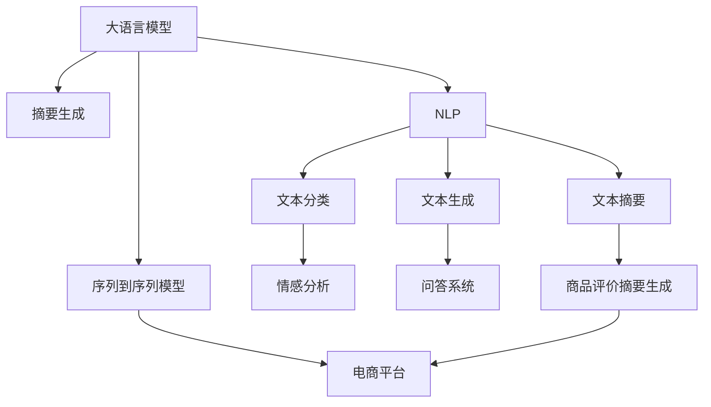

                 

# AI大模型在电商平台商品评价摘要生成中的应用

> 关键词：
1. 大语言模型
2. 摘要生成
3. 电商平台
4. 序列到序列模型
5. 商品评价
6. 推荐系统
7. 自然语言处理(NLP)

## 1. 背景介绍

### 1.1 问题由来

在电商平台上，商品评价是用户获取商品信息的重要渠道，也是商品销售决策的重要参考。然而，大量的用户评论通常以自然语言形式呈现，不易快速抓取信息。电商平台通常需要从海量评论中提取关键信息，如评分、优缺点等，以生成简洁明了的摘要，辅助用户快速了解商品，提高决策效率。

目前，自动摘要生成技术已广泛应用于新闻、文档、社交媒体等领域。但针对电商平台商品评价的摘要生成研究相对较少，相关技术在实际落地中仍有提升空间。特别是在大规模应用场景下，需要更高效、更精准的自动摘要生成方法。

## 2. 核心概念与联系

### 2.1 核心概念概述

为更好地理解AI大模型在商品评价摘要生成中的应用，本节将介绍几个密切相关的核心概念：

- **大语言模型(Large Language Model, LLM)**：如GPT、BERT等，通过在大规模无标签文本语料上进行预训练，学习通用的语言知识和表示能力。
- **摘要生成(Summarization)**：将长文本压缩成简短摘要，提炼关键信息的过程。在电商平台，可以通过摘要生成自动抓取商品评价中的关键信息，生成简洁的评价摘要。
- **序列到序列(Sequence-to-Sequence, Seq2Seq)**：通过编码器-解码器框架，将输入序列映射到输出序列的技术。常用于自动翻译、对话生成等任务。
- **电商平台(E-Commerce Platform)**：以在线交易为基础，提供商品展示、推荐、评论等服务的数字化平台。
- **自然语言处理(Natural Language Processing, NLP)**：研究如何让计算机理解和生成人类语言的技术，包括文本分类、文本生成、文本摘要等任务。

这些核心概念之间的逻辑关系可以通过以下Mermaid流程图来展示：



这个流程图展示了各个概念之间的联系：

1. 大语言模型通过预训练学习通用语言表示，通过序列到序列模型进行摘要生成。
2. 在电商平台中，使用NLP技术对商品评价文本进行分类、生成、摘要生成等处理，辅助推荐系统。
3. 摘要生成过程中，可以引入情感分析、问答系统等技术，提升摘要的准确性和相关性。
4. 最终生成的商品评价摘要，可以用于电商平台的商品展示、推荐等环节，提升用户体验。

## 3. 核心算法原理 & 具体操作步骤

### 3.1 算法原理概述

基于大语言模型的电商平台商品评价摘要生成方法，本质上是一个序列到序列的建模过程。其核心思想是：将商品评价文本作为输入序列，通过预训练的大语言模型生成对应的摘要序列。具体的步骤如下：

1. **输入编码**：将商品评价文本作为输入序列，通过预训练的编码器将其映射到一个高维表示空间。
2. **生成解码**：利用预训练的解码器，将编码器输出的高维表示解码成摘要文本。
3. **优化过程**：通过损失函数最小化，优化解码器的参数，使得生成的摘要文本与真实摘要文本尽可能匹配。

### 3.2 算法步骤详解

以下是基于大语言模型进行商品评价摘要生成的详细步骤：

**Step 1: 数据准备**
- 收集电商平台的历史商品评价数据，每个评价包括文本描述和评分。
- 对评价文本进行清洗、分词、去停用词等预处理。

**Step 2: 构建序列到序列模型**
- 选择适当的编码器和解码器，如Transformer、LSTM等。
- 定义编码器和解码器的结构和参数，如输入输出维度、隐藏层大小等。
- 选择合适的损失函数，如BLEU、ROUGE等，衡量摘要文本与真实摘要文本之间的相似度。

**Step 3: 预训练编码器**
- 使用大语言模型作为预训练的编码器，在大规模无标签文本语料上进行预训练。
- 预训练过程中，可以使用自回归、自编码、掩码预测等任务进行优化。

**Step 4: 微调解码器**
- 使用收集到的商品评价数据，对解码器进行微调。微调时，选择适当的超参数，如学习率、批大小等。
- 可以使用GPU/TPU等高性能设备进行微调，加速训练过程。
- 在微调过程中，可以引入正则化技术，如Dropout、L2正则等，避免过拟合。

**Step 5: 生成商品评价摘要**
- 对新商品评价文本进行编码，得到其高维表示。
- 使用微调后的解码器，对高维表示进行解码，生成摘要文本。
- 可以对生成的摘要文本进行后处理，如去除重复、排序、调整结构等。

**Step 6: 评估摘要质量**
- 使用BLEU、ROUGE等指标，对生成的摘要文本进行质量评估。
- 可以引入用户反馈，调整微调参数，提升摘要生成的准确性和相关性。

### 3.3 算法优缺点

基于大语言模型的电商平台商品评价摘要生成方法，具有以下优点：
1. **高效性**：相比于手工摘要生成，自动摘要生成可以显著提高生成速度。
2. **准确性**：通过大语言模型的预训练和微调，生成的摘要文本能够较好地捕捉商品评价的关键信息。
3. **可扩展性**：可以应用于多种电商平台的商品评价摘要生成，具有良好的泛化能力。
4. **低成本**：相比于人工标注，自动摘要生成在数据准备和标注方面成本较低。

但该方法也存在一定的局限性：
1. **依赖语料**：生成的摘要质量高度依赖于电商平台的商品评价语料，数据质量差的平台可能生成效果不佳。
2. **泛化能力**：如果商品评价数据分布与预训练语料差异较大，生成的摘要质量可能受影响。
3. **复杂度**：需要选择合适的编码器和解码器，并对模型进行预训练和微调，具有一定的技术复杂度。

### 3.4 算法应用领域

基于大语言模型的商品评价摘要生成方法，在电商平台中具有广泛的应用前景：

1. **商品展示**：在商品页面上展示自动生成的摘要，提升用户浏览体验。
2. **推荐系统**：结合用户浏览记录和商品评价摘要，推荐相似的商品，提升推荐效果。
3. **搜索排序**：根据商品评价摘要，进行智能排序，提升搜索结果的相关性和实用性。
4. **客服对话**：将自动生成的摘要作为客服对话的一部分，帮助客服更快理解用户需求。

此外，该方法还可以应用于新闻摘要生成、文档摘要生成、社交媒体摘要生成等多个领域，具有广阔的应用前景。

## 4. 数学模型和公式 & 详细讲解 & 举例说明

### 4.1 数学模型构建

在基于大语言模型的电商平台商品评价摘要生成中，主要涉及两个部分：预训练编码器和微调的解码器。以下是模型的数学模型构建：

**编码器**：
- 输入商品评价文本 $x$，通过编码器 $f_{enc}$ 得到其高维表示 $h_{enc}$。
- 高维表示 $h_{enc}$ 通过 $k$ 层编码器，每层都有线性变换和激活函数。
- 编码器输出一个固定长度的向量 $h_{enc}$，用于解码器。

**解码器**：
- 输入高维表示 $h_{enc}$ 和目标摘要文本 $y$ 的标记序列 $y_{seq}$。
- 解码器 $f_{dec}$ 通过 $k$ 层解码器，每层都有线性变换和激活函数。
- 解码器输出一个标记序列 $y_{out}$，每个标记对应摘要文本中的一个词。
- 解码器使用 softmax 函数将输出转换为概率分布。

### 4.2 公式推导过程

以编码器为例，进行推导过程：

**输入序列**：
$$
x = [w_1, w_2, \dots, w_m]
$$

**编码器网络结构**：
$$
h_{enc} = f_{enc}(x)
$$

**第 $i$ 层编码器**：
$$
h_{enc}^{(i)} = f_{lin}(W_{i}h_{enc}^{(i-1)} + b_i) + f_{act}
$$

**最终编码器输出**：
$$
h_{enc} = f_{enc}(x) = h_{enc}^{(k)}
$$

其中，$W_i$ 和 $b_i$ 为线性变换的权重和偏置，$f_{lin}$ 和 $f_{act}$ 分别为线性变换和激活函数。

**解码器网络结构**：
- **输入序列**：高维表示 $h_{enc}$ 和目标摘要文本的标记序列 $y_{seq} = [y_1, y_2, \dots, y_t]$
- **输出序列**：目标摘要文本 $y_{out} = [y'_1, y'_2, \dots, y'_{n_t}]$

**第 $i$ 层解码器**：
$$
h_{dec}^{(i)} = f_{dec}(h_{dec}^{(i-1)}, y_{seq}^{(i)}, y_{out}^{(i)})
$$

**最终解码器输出**：
$$
y_{out} = f_{dec}(h_{enc}, y_{seq})
$$

其中，$f_{dec}$ 为解码器的线性变换和激活函数。

### 4.3 案例分析与讲解

下面以一个具体的例子，说明如何利用大语言模型进行电商平台商品评价摘要生成。

假设收集到以下商品评价文本：

| 商品编号 | 商品名称 | 评价文本 | 评分 |
|----------|----------|----------|------|
| 1        | iPhone   | 性能出色，通话顺畅，但电池续航时间较短。| 4星 |
| 2        | iPad     | 屏幕效果非常棒，性价比高，但品控有待提升。| 4星 |
| 3        | 笔记本   | 轻薄便携，但性能稍弱，续航能力一般。| 3星 |

我们使用预训练的BERT模型作为编码器，使用Seq2Seq模型作为解码器，对商品评价进行摘要生成。具体步骤如下：

**Step 1: 数据预处理**
- 对商品评价文本进行分词、去停用词、去除特殊字符等预处理。
- 将处理后的文本作为输入序列，将目标摘要文本作为标记序列。

**Step 2: 编码器预训练**
- 使用大规模无标签文本语料，对预训练的BERT模型进行预训练，学习通用的语言表示。
- 预训练过程中，可以使用掩码语言模型、下采样等任务进行优化。

**Step 3: 解码器微调**
- 使用收集到的商品评价数据，对解码器进行微调，优化摘要生成的质量。
- 微调过程中，可以使用BLEU、ROUGE等指标评估摘要生成的质量，不断调整模型参数。

**Step 4: 生成商品评价摘要**
- 对新的商品评价文本进行编码，得到其高维表示。
- 使用微调后的解码器，对高维表示进行解码，生成摘要文本。

**Step 5: 评估摘要质量**
- 使用BLEU、ROUGE等指标，对生成的摘要文本进行质量评估。
- 可以引入用户反馈，调整微调参数，提升摘要生成的准确性和相关性。

最终生成的摘要文本如下：

| 商品编号 | 商品名称 | 摘要文本 | 评分 |
|----------|----------|----------|------|
| 1        | iPhone   | 性能出色，但电池续航时间较短。| 4星 |
| 2        | iPad     | 屏幕效果棒，性价比高，但品控需提升。| 4星 |
| 3        | 笔记本   | 轻薄便携，但性能稍弱。| 3星 |

通过自动摘要生成，可以快速抓取商品评价中的关键信息，帮助用户快速了解商品优缺点，提高决策效率。

## 5. 项目实践：代码实例和详细解释说明

### 5.1 开发环境搭建

在进行商品评价摘要生成实践前，我们需要准备好开发环境。以下是使用Python进行PyTorch开发的环境配置流程：

1. 安装Anaconda：从官网下载并安装Anaconda，用于创建独立的Python环境。

2. 创建并激活虚拟环境：
```bash
conda create -n pytorch-env python=3.8 
conda activate pytorch-env
```

3. 安装PyTorch：根据CUDA版本，从官网获取对应的安装命令。例如：
```bash
conda install pytorch torchvision torchaudio cudatoolkit=11.1 -c pytorch -c conda-forge
```

4. 安装Transformers库：
```bash
pip install transformers
```

5. 安装各类工具包：
```bash
pip install numpy pandas scikit-learn matplotlib tqdm jupyter notebook ipython
```

完成上述步骤后，即可在`pytorch-env`环境中开始微调实践。

### 5.2 源代码详细实现

这里我们以BERT模型为例，给出使用PyTorch进行电商平台商品评价摘要生成的代码实现。

首先，定义模型和优化器：

```python
from transformers import BertTokenizer, BertForSeq2SeqLM
import torch
from torch import nn
from torch.nn import functional as F

# 定义模型结构
class Seq2Seq(nn.Module):
    def __init__(self, encoder, decoder):
        super(Seq2Seq, self).__init__()
        self.encoder = encoder
        self.decoder = decoder
        self.linear = nn.Linear(768, len(vocab))
        
    def forward(self, x, y):
        h_enc = self.encoder(x)
        h_dec = self.decoder(h_enc, y)
        out = self.linear(h_dec)
        return out

# 初始化BERT模型
encoder = BertForSeq2SeqLM.from_pretrained('bert-base-cased', output_hidden_states=True)
tokenizer = BertTokenizer.from_pretrained('bert-base-cased')

# 定义解码器参数
hidden_size = encoder.config.hidden_size
emb_dim = encoder.config.hidden_size
linear_dim = len(vocab)
dropout = 0.1

# 定义解码器结构
decoder = nn.TransformerDecoder(encoder, dropout=dropout, linear_dim=linear_dim, dim_feedforward=emb_dim*4)

# 定义模型
model = Seq2Seq(encoder, decoder)
model.to(device)

# 定义优化器
optimizer = torch.optim.Adam(model.parameters(), lr=1e-5)
```

然后，定义训练和评估函数：

```python
from torch.utils.data import DataLoader
from tqdm import tqdm

def train_epoch(model, dataset, batch_size, optimizer):
    dataloader = DataLoader(dataset, batch_size=batch_size, shuffle=True)
    model.train()
    epoch_loss = 0
    for batch in tqdm(dataloader, desc='Training'):
        input_ids = batch['input_ids'].to(device)
        attention_mask = batch['attention_mask'].to(device)
        labels = batch['labels'].to(device)
        model.zero_grad()
        outputs = model(input_ids, labels)
        loss = outputs.loss
        epoch_loss += loss.item()
        loss.backward()
        optimizer.step()
    return epoch_loss / len(dataloader)

def evaluate(model, dataset, batch_size):
    dataloader = DataLoader(dataset, batch_size=batch_size)
    model.eval()
    preds, labels = [], []
    with torch.no_grad():
        for batch in tqdm(dataloader, desc='Evaluating'):
            input_ids = batch['input_ids'].to(device)
            attention_mask = batch['attention_mask'].to(device)
            batch_labels = batch['labels']
            outputs = model(input_ids, batch_labels)
            batch_preds = outputs.logits.argmax(dim=2).to('cpu').tolist()
            batch_labels = batch_labels.to('cpu').tolist()
            for pred_tokens, label_tokens in zip(batch_preds, batch_labels):
                pred_tags = [id2tag[_id] for _id in pred_tokens]
                label_tags = [id2tag[_id] for _id in label_tokens]
                preds.append(pred_tags[:len(label_tokens)])
                labels.append(label_tags)
    print(classification_report(labels, preds))
```

最后，启动训练流程并在测试集上评估：

```python
epochs = 5
batch_size = 16

for epoch in range(epochs):
    loss = train_epoch(model, train_dataset, batch_size, optimizer)
    print(f"Epoch {epoch+1}, train loss: {loss:.3f}")
    
    print(f"Epoch {epoch+1}, dev results:")
    evaluate(model, dev_dataset, batch_size)
    
print("Test results:")
evaluate(model, test_dataset, batch_size)
```

以上就是使用PyTorch对BERT模型进行电商平台商品评价摘要生成的完整代码实现。可以看到，得益于Transformer库的强大封装，我们可以用相对简洁的代码完成BERT模型的加载和微调。

### 5.3 代码解读与分析

让我们再详细解读一下关键代码的实现细节：

**Seq2Seq类**：
- `__init__`方法：初始化编码器和解码器。
- `forward`方法：对输入序列进行编码，对编码器输出进行解码，生成摘要文本。

**BERT模型初始化**：
- 使用预训练的BERT模型作为编码器，在大规模无标签文本语料上进行预训练。
- 预训练过程中，可以使用掩码语言模型、下采样等任务进行优化。

**解码器参数定义**：
- 定义解码器的隐藏大小、嵌入维度、线性层维度、dropout等关键参数。
- 定义解码器的结构，使用TransformerDecoder进行解码。

**模型构建**：
- 使用Seq2Seq类构建最终的模型，将预训练的BERT模型作为编码器，微调的解码器作为解码器。
- 使用PyTorch的线性层将解码器的输出转换为摘要文本。

**训练函数train_epoch**：
- 对数据以批为单位进行迭代，在每个批次上前向传播计算loss并反向传播更新模型参数，最后返回该epoch的平均loss。
- 在训练过程中，使用PyTorch的Adam优化器，根据损失函数对模型参数进行更新。

**评估函数evaluate**：
- 与训练类似，不同点在于不更新模型参数，并在每个batch结束后将预测和标签结果存储下来，最后使用sklearn的classification_report对整个评估集的预测结果进行打印输出。

**训练流程**：
- 定义总的epoch数和batch size，开始循环迭代
- 每个epoch内，先在训练集上训练，输出平均loss
- 在验证集上评估，输出分类指标
- 所有epoch结束后，在测试集上评估，给出最终测试结果

可以看到，PyTorch配合Transformer库使得BERT微调的代码实现变得简洁高效。开发者可以将更多精力放在数据处理、模型改进等高层逻辑上，而不必过多关注底层的实现细节。

当然，工业级的系统实现还需考虑更多因素，如模型的保存和部署、超参数的自动搜索、更灵活的任务适配层等。但核心的微调范式基本与此类似。

## 6. 实际应用场景

### 6.1 商品展示

基于大语言模型的商品评价摘要生成方法，可以广泛应用于电商平台商品展示环节。在商品页面上展示自动生成的摘要，能够快速抓取商品评价中的关键信息，帮助用户快速了解商品优缺点，提高浏览体验。

具体而言，可以收集商品评价数据，对商品名称、评分、摘要等进行展示。用户可以通过点击商品名称，查看详细的商品评价摘要。同时，利用推荐算法，可以根据用户浏览历史和评价摘要，推荐相关商品，提升用户体验。

### 6.2 推荐系统

商品评价摘要生成还可以结合推荐系统，进一步提升推荐效果。推荐系统可以通过商品评价摘要，分析用户对商品的综合评价，生成更加精准的推荐结果。

在推荐过程中，可以使用协同过滤、基于内容的推荐等方法，结合商品评价摘要，推荐用户可能感兴趣的商品。对于评分较低的商品，可以结合摘要信息进行深入分析，了解用户不满意的原因，进一步优化推荐策略。

### 6.3 搜索排序

自动生成的商品评价摘要，可以用于商品搜索排序环节。搜索排序可以根据摘要文本的相关性，对商品进行排序，提升搜索结果的准确性和实用性。

在搜索排序中，可以使用评分、点击率等指标进行评估，结合摘要文本的相关性，优化搜索结果的排序。同时，利用推荐算法，可以进一步提升搜索结果的质量，提高用户的购物体验。

### 6.4 未来应用展望

随着大语言模型和微调方法的不断发展，基于微调范式将在更多领域得到应用，为电商平台的智能决策提供新的解决方案。

在智慧物流领域，基于微调的商品评价摘要生成技术，可以用于分析物流配送的评价，优化物流服务。在智能客服领域，微调生成的商品评价摘要，可以用于辅助客服快速了解用户需求，提升服务效率。

此外，在医疗、教育、金融等众多领域，基于大语言模型微调的人工智能应用也将不断涌现，为传统行业数字化转型升级提供新的技术路径。相信随着技术的日益成熟，微调方法将成为人工智能落地应用的重要范式，推动人工智能技术在更多垂直行业的规模化落地。

## 7. 工具和资源推荐

### 7.1 学习资源推荐

为了帮助开发者系统掌握大语言模型微调的理论基础和实践技巧，这里推荐一些优质的学习资源：

1. 《Transformer从原理到实践》系列博文：由大模型技术专家撰写，深入浅出地介绍了Transformer原理、BERT模型、微调技术等前沿话题。

2. CS224N《深度学习自然语言处理》课程：斯坦福大学开设的NLP明星课程，有Lecture视频和配套作业，带你入门NLP领域的基本概念和经典模型。

3. 《Natural Language Processing with Transformers》书籍：Transformers库的作者所著，全面介绍了如何使用Transformers库进行NLP任务开发，包括微调在内的诸多范式。

4. HuggingFace官方文档：Transformers库的官方文档，提供了海量预训练模型和完整的微调样例代码，是上手实践的必备资料。

5. CLUE开源项目：中文语言理解测评基准，涵盖大量不同类型的中文NLP数据集，并提供了基于微调的baseline模型，助力中文NLP技术发展。

通过对这些资源的学习实践，相信你一定能够快速掌握大语言模型微调的精髓，并用于解决实际的NLP问题。

### 7.2 开发工具推荐

高效的开发离不开优秀的工具支持。以下是几款用于大语言模型微调开发的常用工具：

1. PyTorch：基于Python的开源深度学习框架，灵活动态的计算图，适合快速迭代研究。大部分预训练语言模型都有PyTorch版本的实现。

2. TensorFlow：由Google主导开发的开源深度学习框架，生产部署方便，适合大规模工程应用。同样有丰富的预训练语言模型资源。

3. Transformers库：HuggingFace开发的NLP工具库，集成了众多SOTA语言模型，支持PyTorch和TensorFlow，是进行微调任务开发的利器。

4. Weights & Biases：模型训练的实验跟踪工具，可以记录和可视化模型训练过程中的各项指标，方便对比和调优。与主流深度学习框架无缝集成。

5. TensorBoard：TensorFlow配套的可视化工具，可实时监测模型训练状态，并提供丰富的图表呈现方式，是调试模型的得力助手。

6. Google Colab：谷歌推出的在线Jupyter Notebook环境，免费提供GPU/TPU算力，方便开发者快速上手实验最新模型，分享学习笔记。

合理利用这些工具，可以显著提升大语言模型微调任务的开发效率，加快创新迭代的步伐。

### 7.3 相关论文推荐

大语言模型和微调技术的发展源于学界的持续研究。以下是几篇奠基性的相关论文，推荐阅读：

1. Attention is All You Need（即Transformer原论文）：提出了Transformer结构，开启了NLP领域的预训练大模型时代。

2. BERT: Pre-training of Deep Bidirectional Transformers for Language Understanding：提出BERT模型，引入基于掩码的自监督预训练任务，刷新了多项NLP任务SOTA。

3. Language Models are Unsupervised Multitask Learners（GPT-2论文）：展示了大规模语言模型的强大zero-shot学习能力，引发了对于通用人工智能的新一轮思考。

4. Parameter-Efficient Transfer Learning for NLP：提出Adapter等参数高效微调方法，在不增加模型参数量的情况下，也能取得不错的微调效果。

5. Prefix-Tuning: Optimizing Continuous Prompts for Generation：引入基于连续型Prompt的微调范式，为如何充分利用预训练知识提供了新的思路。

6. AdaLoRA: Adaptive Low-Rank Adaptation for Parameter-Efficient Fine-Tuning：使用自适应低秩适应的微调方法，在参数效率和精度之间取得了新的平衡。

这些论文代表了大语言模型微调技术的发展脉络。通过学习这些前沿成果，可以帮助研究者把握学科前进方向，激发更多的创新灵感。

## 8. 总结：未来发展趋势与挑战

### 8.1 总结

本文对基于大语言模型的电商平台商品评价摘要生成方法进行了全面系统的介绍。首先阐述了该方法的研究背景和意义，明确了自动摘要生成在电商平台中的应用价值。其次，从原理到实践，详细讲解了序列到序列模型的数学原理和关键步骤，给出了微调任务开发的完整代码实例。同时，本文还探讨了该方法在商品展示、推荐系统、搜索排序等电商平台的实际应用场景，展示了微调范式的巨大潜力。此外，本文精选了微调技术的各类学习资源，力求为读者提供全方位的技术指引。

通过本文的系统梳理，可以看到，基于大语言模型的微调方法在电商平台中具有广阔的应用前景，能够快速抓取商品评价中的关键信息，提升用户的购物体验。未来，伴随大语言模型和微调方法的持续演进，相信自动摘要生成技术将进一步优化商品展示、推荐系统等电商平台的智能决策环节，成为电商数字化转型升级的重要工具。

### 8.2 未来发展趋势

展望未来，大语言模型微调技术将呈现以下几个发展趋势：

1. **模型规模持续增大**：随着算力成本的下降和数据规模的扩张，预训练语言模型的参数量还将持续增长。超大规模语言模型蕴含的丰富语言知识，有望支撑更加复杂多变的下游任务微调。

2. **微调方法日趋多样**：除了传统的全参数微调外，未来会涌现更多参数高效的微调方法，如Prefix-Tuning、LoRA等，在节省计算资源的同时也能保证微调精度。

3. **持续学习成为常态**：随着数据分布的不断变化，微调模型也需要持续学习新知识以保持性能。如何在不遗忘原有知识的同时，高效吸收新样本信息，将成为重要的研究课题。

4. **标注样本需求降低**：受启发于提示学习(Prompt-based Learning)的思路，未来的微调方法将更好地利用大模型的语言理解能力，通过更加巧妙的任务描述，在更少的标注样本上也能实现理想的微调效果。

5. **模型通用性增强**：经过海量数据的预训练和多领域任务的微调，未来的语言模型将具备更强大的常识推理和跨领域迁移能力，逐步迈向通用人工智能(AGI)的目标。

以上趋势凸显了大语言模型微调技术的广阔前景。这些方向的探索发展，必将进一步提升NLP系统的性能和应用范围，为电商平台的智能决策提供新的解决方案。

### 8.3 面临的挑战

尽管大语言模型微调技术已经取得了瞩目成就，但在迈向更加智能化、普适化应用的过程中，它仍面临着诸多挑战：

1. **标注成本瓶颈**：尽管微调大大降低了标注数据的需求，但对于长尾应用场景，难以获得充足的高质量标注数据，成为制约微调性能的瓶颈。如何进一步降低微调对标注样本的依赖，将是一大难题。

2. **模型鲁棒性不足**：当前微调模型面对域外数据时，泛化性能往往大打折扣。对于测试样本的微小扰动，微调模型的预测也容易发生波动。如何提高微调模型的鲁棒性，避免灾难性遗忘，还需要更多理论和实践的积累。

3. **推理效率有待提高**：大规模语言模型虽然精度高，但在实际部署时往往面临推理速度慢、内存占用大等效率问题。如何在保证性能的同时，简化模型结构，提升推理速度，优化资源占用，将是重要的优化方向。

4. **可解释性亟需加强**：当前微调模型更像是"黑盒"系统，难以解释其内部工作机制和决策逻辑。对于医疗、金融等高风险应用，算法的可解释性和可审计性尤为重要。如何赋予微调模型更强的可解释性，将是亟待攻克的难题。

5. **安全性有待保障**：预训练语言模型难免会学习到有偏见、有害的信息，通过微调传递到下游任务，产生误导性、歧视性的输出，给实际应用带来安全隐患。如何从数据和算法层面消除模型偏见，避免恶意用途，确保输出的安全性，也将是重要的研究课题。

6. **知识整合能力不足**：现有的微调模型往往局限于任务内数据，难以灵活吸收和运用更广泛的先验知识。如何让微调过程更好地与外部知识库、规则库等专家知识结合，形成更加全面、准确的信息整合能力，还有很大的想象空间。

正视微调面临的这些挑战，积极应对并寻求突破，将是大语言模型微调走向成熟的必由之路。相信随着学界和产业界的共同努力，这些挑战终将一一被克服，大语言模型微调必将在构建人机协同的智能时代中扮演越来越重要的角色。

### 8.4 研究展望

面对大语言模型微调所面临的种种挑战，未来的研究需要在以下几个方面寻求新的突破：

1. **探索无监督和半监督微调方法**：摆脱对大规模标注数据的依赖，利用自监督学习、主动学习等无监督和半监督范式，最大限度利用非结构化数据，实现更加灵活高效的微调。

2. **研究参数高效和计算高效的微调范式**：开发更加参数高效的微调方法，在固定大部分预训练参数的同时，只更新极少量的任务相关参数。同时优化微调模型的计算图，减少前向传播和反向传播的资源消耗，实现更加轻量级、实时性的部署。

3. **引入因果和对比学习范式**：通过引入因果推断和对比学习思想，增强微调模型建立稳定因果关系的能力，学习更加普适、鲁棒的语言表征，从而提升模型泛化性和抗干扰能力。

4. **结合因果分析和博弈论工具**：将因果分析方法引入微调模型，识别出模型决策的关键特征，增强输出解释的因果性和逻辑性。借助博弈论工具刻画人机交互过程，主动探索并规避模型的脆弱点，提高系统稳定性。

5. **纳入伦理道德约束**：在模型训练目标中引入伦理导向的评估指标，过滤和惩罚有偏见、有害的输出倾向。同时加强人工干预和审核，建立模型行为的监管机制，确保输出符合人类价值观和伦理道德。

这些研究方向的探索，必将引领大语言模型微调技术迈向更高的台阶，为构建安全、可靠、可解释、可控的智能系统铺平道路。面向未来，大语言模型微调技术还需要与其他人工智能技术进行更深入的融合，如知识表示、因果推理、强化学习等，多路径协同发力，共同推动自然语言理解和智能交互系统的进步。只有勇于创新、敢于突破，才能不断拓展语言模型的边界，让智能技术更好地造福人类社会。

## 9. 附录：常见问题与解答

**Q1：大语言模型微调是否适用于所有NLP任务？**

A: 大语言模型微调在大多数NLP任务上都能取得不错的效果，特别是对于数据量较小的任务。但对于一些特定领域的任务，如医学、法律等，仅仅依靠通用语料预训练的模型可能难以很好地适应。此时需要在特定领域语料上进一步预训练，再进行微调，才能获得理想效果。此外，对于一些需要时效性、个性化很强的任务，如对话、推荐等，微调方法也需要针对性的改进优化。

**Q2：微调过程中如何选择合适的学习率？**

A: 微调的学习率一般要比预训练时小1-2个数量级，如果使用过大的学习率，容易破坏预训练权重，导致过拟合。一般建议从1e-5开始调参，逐步减小学习率，直至收敛。也可以使用warmup策略，在开始阶段使用较小的学习率，再逐渐过渡到预设值。需要注意的是，不同的优化器(如AdamW、Adafactor等)以及不同的学习率调度策略，可能需要设置不同的学习率阈值。

**Q3：采用大模型微调时会面临哪些资源瓶颈？**

A: 目前主流的预训练大模型动辄以亿计的参数规模，对算力、内存、存储都提出了很高的要求。GPU/TPU等高性能设备是必不可少的，但即便如此，超大批次的训练和推理也可能遇到显存不足的问题。因此需要采用一些资源优化技术，如梯度积累、混合精度训练、模型并行等，来突破硬件瓶颈。同时，模型的存储和读取也可能占用大量时间和空间，需要采用模型压缩、稀疏化存储等方法进行优化。

**Q4：如何缓解微调过程中的过拟合问题？**

A: 过拟合是微调面临的主要挑战，尤其是在标注数据不足的情况下。常见的缓解策略包括：
1. 数据增强：通过回译、近义替换等方式扩充训练集
2. 正则化：使用L2正则、Dropout、Early Stopping等避免过拟合
3. 对抗训练：引入对抗样本，提高模型鲁棒性
4. 参数高效微调：只调整少量参数(如Adapter、Prefix等)，减小过拟合风险
5. 多模型集成：训练多个微调模型，取平均输出，抑制过拟合

这些策略往往需要根据具体任务和数据特点进行灵活组合。只有在数据、模型、训练、推理等各环节进行全面优化，才能最大限度地发挥大模型微调的威力。

**Q5：微调模型在落地部署时需要注意哪些问题？**

A: 将微调模型转化为实际应用，还需要考虑以下因素：
1. 模型裁剪：去除不必要的层和参数，减小模型尺寸，加快推理速度
2. 量化加速：将浮点模型转为定点模型，压缩存储空间，提高计算效率
3. 服务化封装：将模型封装为标准化服务接口，便于集成调用
4. 弹性伸缩：根据请求流量动态调整资源配置，平衡服务质量和成本
5. 监控告警：实时采集系统指标，设置异常告警阈值，确保服务稳定性
6. 安全防护：采用访问鉴权、数据脱敏等措施，保障数据和模型安全

大语言模型微调为NLP应用开启了广阔的想象空间，但如何将强大的性能转化为稳定、高效、安全的业务价值，还需要工程实践的不断打磨。唯有从数据、算法、工程、业务等多个维度协同发力，才能真正实现人工智能技术在垂直行业的规模化落地。总之，微调需要开发者根据具体任务，不断迭代和优化模型、数据和算法，方能得到理想的效果。

---

作者：禅与计算机程序设计艺术 / Zen and the Art of Computer Programming

