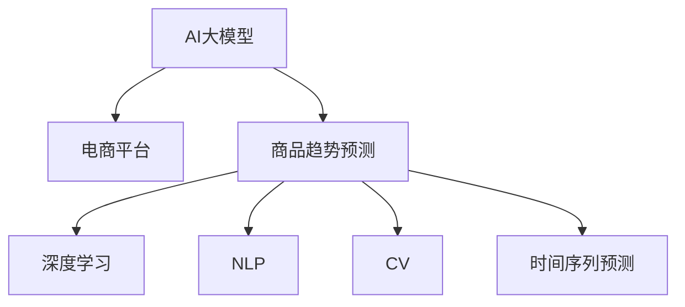

                 

# AI大模型在电商平台商品趋势预测中的应用

> 关键词：AI大模型,电商平台,商品趋势预测,深度学习,自然语言处理(NLP),计算机视觉(CV),时间序列预测

## 1. 背景介绍

### 1.1 问题由来
电商平台是现代零售的重要形式，其商品销售数据往往蕴含着丰富的市场趋势信息。对于商家而言，准确预测商品趋势不仅有助于库存管理，还能优化广告投放，提升销售额。然而，商品销售数据通常是高维度、多变量、复杂的非线性关系，难以用传统的统计模型有效刻画。随着深度学习技术的发展，AI大模型在处理大规模非结构化数据、捕捉复杂关系方面表现出巨大优势。因此，使用AI大模型进行商品趋势预测，成为电商行业的热点研究方向。

### 1.2 问题核心关键点
本研究聚焦于如何利用AI大模型进行商品趋势预测，并探讨了该方法在电商平台中的应用。具体而言，我们探讨了以下几个核心关键点：

- 大模型在商品趋势预测中的适用性。
- 电商商品趋势预测的数学模型与算法实现。
- 基于深度学习的大模型在电商数据上的训练和微调过程。
- 模型性能评估与优化方法。

### 1.3 问题研究意义
准确预测电商商品趋势对于电商平台运营具有重要意义：

1. **库存管理**：提前预测商品需求，优化库存水平，减少缺货或库存积压。
2. **广告投放**：根据预测结果进行精准广告投放，提升点击率和转化率。
3. **价格策略**：基于趋势预测，调整商品价格策略，提高销售收益。
4. **需求分析**：深入分析商品需求变化，优化供应链管理。

研究大模型在电商商品趋势预测中的应用，将有助于电商企业提升运营效率，降低运营成本，增强市场竞争力。

## 2. 核心概念与联系

### 2.1 核心概念概述

为更好地理解AI大模型在电商商品趋势预测中的应用，本节将介绍几个密切相关的核心概念：

- **AI大模型(AI Large Model)**：指基于深度学习技术训练的、具有大规模参数的模型，如GPT、BERT、DALL-E等。这些模型通常在大规模数据集上进行预训练，并在特定任务上进行微调，以获得针对任务优化的性能。
- **电商平台(E-commerce Platform)**：指通过互联网提供商品交易服务的平台，如淘宝、京东、Amazon等。电商平台上每天产生大量交易数据，包含商品名称、价格、销量等丰富的信息。
- **商品趋势预测(Product Trend Prediction)**：指基于历史销售数据，预测未来一段时间内商品的需求变化趋势。通过准确预测商品趋势，商家可以优化库存、精准投放广告，提高营销效果。
- **深度学习(Deep Learning)**：指一类基于多层神经网络的学习方法，通过学习非线性关系，从数据中自动提取特征，并进行预测。深度学习在图像、语音、自然语言处理等领域均有重要应用。
- **自然语言处理(NLP)**：指利用计算机处理、理解、生成人类语言的技术。在电商商品趋势预测中，可以通过NLP技术处理商品描述、评论等文本数据。
- **计算机视觉(CV)**：指利用计算机处理和分析图像、视频等视觉数据的领域。在电商趋势预测中，可以利用CV技术处理商品图片、视频等信息。
- **时间序列预测(Time Series Prediction)**：指利用历史时间序列数据，预测未来某一时间点的值。商品销售数据通常具有明显的时间序列特征，因此时间序列预测是电商商品趋势预测的重要方法。

这些核心概念之间的逻辑关系可以通过以下Mermaid流程图来展示：



这个流程图展示了大模型的核心概念及其之间的关系：

1. AI大模型通过深度学习、自然语言处理、计算机视觉等技术，从电商平台上获取的文本、图像等数据中提取特征。
2. 利用时间序列预测模型，对商品销售数据进行趋势预测。
3. 最终预测结果用于电商平台的库存管理、广告投放、价格策略等决策支持。

## 3. 核心算法原理 & 具体操作步骤
### 3.1 算法原理概述

AI大模型在电商平台商品趋势预测中的核心算法原理主要基于时间序列预测方法，结合深度学习和自然语言处理技术。具体而言，通过大模型提取电商数据中的复杂特征，并利用时间序列模型进行趋势预测。

### 3.2 算法步骤详解

基于AI大模型的时间序列预测通常包括以下几个关键步骤：

**Step 1: 数据预处理**

- 收集电商平台的商品销售数据，通常包括时间戳、商品ID、销量等关键信息。
- 对数据进行清洗和缺失值处理，保证数据完整性和一致性。
- 将数据分为训练集和测试集，确保模型性能的公平评估。

**Step 2: 特征工程**

- 利用大模型提取电商数据中的关键特征。例如，通过BERT模型对商品描述进行编码，提取文本特征。
- 对时间序列数据进行特征增强，如使用滑动窗口、滚动平均等技术。

**Step 3: 模型训练与微调**

- 选择合适的深度学习模型，如RNN、LSTM、GRU等，进行商品趋势预测。
- 利用电商数据集进行模型训练，并对模型进行微调，以适应特定商品的趋势预测任务。

**Step 4: 预测与评估**

- 使用测试集对训练好的模型进行预测，生成商品趋势预测结果。
- 评估模型预测性能，如均方误差(MSE)、平均绝对误差(MAE)、均方根误差(RMSE)等。

### 3.3 算法优缺点

AI大模型在电商商品趋势预测中的应用具有以下优点：

1. **模型表现优异**：大模型拥有强大的特征提取能力，能够捕捉复杂的数据关系，预测结果准确度高。
2. **适应性强**：大模型可以适应多种类型的数据，包括文本、图像等，灵活性高。
3. **自适应学习**：大模型能够自动学习数据的特征，无需人工干预，节省了大量时间成本。
4. **可扩展性好**：大模型可以处理大规模数据，扩展性强，适用于电商平台的商品趋势预测。

同时，该方法也存在一些缺点：

1. **数据量要求高**：电商数据通常较为庞大，需要大量数据才能有效训练大模型。
2. **计算资源需求高**：大模型的训练和推理需要大量计算资源，通常需要使用GPU或TPU等高性能设备。
3. **模型复杂度高**：大模型结构复杂，需要专业知识进行设计和优化。
4. **模型可解释性差**：大模型通常是黑盒模型，难以解释其内部工作机制。
5. **过拟合风险**：电商数据存在复杂的非线性关系，模型容易过拟合，需要进行正则化处理。

尽管存在这些缺点，但AI大模型在电商商品趋势预测中的应用仍具有显著优势，能够提升预测准确度，为电商企业的决策提供有力支持。

### 3.4 算法应用领域

AI大模型在电商商品趋势预测中的应用不仅限于单一的商品预测，还可以拓展到更广泛的电商数据分析场景，如：

- **库存管理**：根据预测结果优化库存水平，减少缺货或库存积压。
- **广告投放**：利用预测结果进行精准广告投放，提升点击率和转化率。
- **价格策略**：基于预测结果调整商品价格策略，提高销售收益。
- **需求分析**：深入分析商品需求变化，优化供应链管理。

此外，AI大模型还可以应用于其他电商数据分析任务，如客户行为分析、推荐系统、市场趋势预测等，为电商企业提供全面的数据分析支持。

## 4. 数学模型和公式 & 详细讲解  
### 4.1 数学模型构建

在电商商品趋势预测中，常用的数学模型包括时间序列预测模型、深度学习模型、自然语言处理模型等。这里以LSTM模型为例，构建商品趋势预测的数学模型。

假设商品销售数据为 $x_t$，其中 $t$ 表示时间点，$x_t$ 为商品在时间 $t$ 的销量。通过LSTM模型对 $x_t$ 进行预测，预测结果为 $y_t$，即商品在时间 $t+1$ 的销量预测值。

模型训练的目标是最小化预测值 $y_t$ 和实际值 $x_{t+1}$ 之间的误差，通常使用均方误差(MSE)作为损失函数：

$$
L = \frac{1}{N} \sum_{t=1}^{N} (y_t - x_{t+1})^2
$$

其中 $N$ 表示数据集的大小。模型的优化目标是找到最优的参数 $\theta$，使得损失函数 $L$ 最小化。

### 4.2 公式推导过程

以LSTM模型为例，LSTM的隐藏状态更新公式如下：

$$
h_t = \tanh(W_{h}x_t + b_h + U_{h}h_{t-1} + b_h)
$$

$$
i_t = \sigma(W_{i}x_t + b_i + U_{i}h_{t-1} + b_i)
$$

$$
o_t = \sigma(W_{o}x_t + b_o + U_{o}h_{t-1} + b_o)
$$

$$
c_t = f_t \odot c_{t-1} + i_t \odot \tanh(h_t)
$$

$$
h_t = o_t \odot \tanh(c_t)
$$

其中 $h_t$ 为隐藏状态，$i_t$、$o_t$ 为LSTM门控单元，$f_t$ 为遗忘门，$c_t$ 为细胞状态，$W$、$b$、$U$ 为可学习参数。

模型的输出层通常为线性层，输出预测值 $y_t$：

$$
y_t = W_{y}h_t + b_y
$$

### 4.3 案例分析与讲解

以下以一个简单的电商数据集为例，说明如何利用LSTM模型进行商品趋势预测。

假设有一个电商数据集，包含商品ID、销量、时间戳等关键信息。我们首先对数据进行预处理，去除缺失值和异常值，然后将数据分为训练集和测试集。

接着，我们利用LSTM模型对数据进行建模，训练模型并使用测试集进行评估。模型训练过程如下：

1. 加载数据集，分为训练集和测试集。
2. 对数据进行标准化处理，将销量归一化到0-1之间。
3. 构建LSTM模型，选择合适的网络结构和超参数。
4. 使用训练集对模型进行训练，并使用测试集进行评估。
5. 输出模型预测结果，并计算均方误差(MSE)。

假设模型训练后，我们得到了商品ID为001的商品趋势预测结果。模型预测的时间为第10天，预测的销量为100。我们将预测结果与实际销量进行比较，评估模型性能。

## 5. 项目实践：代码实例和详细解释说明
### 5.1 开发环境搭建

在进行电商商品趋势预测时，我们需要准备好开发环境。以下是使用Python进行Keras开发的环境配置流程：

1. 安装Anaconda：从官网下载并安装Anaconda，用于创建独立的Python环境。

2. 创建并激活虚拟环境：
```bash
conda create -n pytorch-env python=3.8 
conda activate pytorch-env
```

3. 安装Keras：
```bash
pip install keras
```

4. 安装TensorFlow：
```bash
pip install tensorflow
```

5. 安装Pandas：
```bash
pip install pandas
```

6. 安装Numpy：
```bash
pip install numpy
```

完成上述步骤后，即可在`pytorch-env`环境中开始电商商品趋势预测的实践。

### 5.2 源代码详细实现

这里我们以LSTM模型为例，给出使用Keras框架进行电商商品趋势预测的Python代码实现。

```python
import numpy as np
import pandas as pd
from keras.models import Sequential
from keras.layers import LSTM, Dense, Dropout
from sklearn.preprocessing import MinMaxScaler
from sklearn.model_selection import train_test_split

# 加载数据集
data = pd.read_csv('sales_data.csv', index_col='timestamp')
data = data.dropna()

# 标准化处理
scaler = MinMaxScaler(feature_range=(0, 1))
scaled_data = scaler.fit_transform(data['amount'].values.reshape(-1, 1))

# 数据准备
x_train, y_train, x_test, y_test = train_test_split(
    scaled_data[:-60], 
    scaled_data[60:], 
    test_size=0.2, 
    shuffle=False
)

# 构建LSTM模型
model = Sequential()
model.add(LSTM(units=50, return_sequences=True, input_shape=(1, 1)))
model.add(Dropout(0.2))
model.add(LSTM(units=50))
model.add(Dropout(0.2))
model.add(Dense(units=1))

# 编译模型
model.compile(optimizer='adam', loss='mean_squared_error')

# 训练模型
model.fit(x_train, y_train, epochs=50, batch_size=64, validation_data=(x_test, y_test))

# 预测未来销量
future_sales = model.predict(x_test)

# 反标准化处理
future_sales = scaler.inverse_transform(future_sales)
```

### 5.3 代码解读与分析

让我们再详细解读一下关键代码的实现细节：

**1. 数据预处理**

- `pd.read_csv()`：加载电商数据集，指定时间戳为索引。
- `dropna()`：去除缺失值。
- `MinMaxScaler()`：对销量数据进行标准化处理，将其归一化到0-1之间。

**2. 模型构建**

- `Sequential()`：创建一个Keras模型。
- `LSTM()`：添加LSTM层，设置隐藏单元数为50，使用归一化输入。
- `Dropout()`：添加Dropout层，防止过拟合。
- `Dense()`：添加输出层，使用线性回归模型。

**3. 模型训练与预测**

- `compile()`：编译模型，使用Adam优化器和均方误差损失函数。
- `fit()`：训练模型，使用训练集和测试集进行评估。
- `predict()`：使用模型进行预测，输出未来销量。

**4. 结果评估**

- `inverse_transform()`：将预测结果反标准化处理，还原到原始值。

以上代码实现了基本的LSTM模型，并使用电商数据集进行训练和预测。在实际应用中，还需要针对具体任务进行优化，如引入时间序列特征、增加模型复杂度、引入正则化技术等，以进一步提升模型性能。

## 6. 实际应用场景
### 6.1 智能库存管理

智能库存管理是电商商品趋势预测的重要应用场景。通过预测商品未来销量，商家可以动态调整库存水平，避免缺货或库存积压，降低运营成本。

具体而言，商家可以使用电商商品趋势预测模型，预测未来一段时间内各商品的销量。根据预测结果，商家可以提前调整库存，保证商品供需平衡。同时，对于预测销量较高的商品，商家可以及时增加采购量，减少缺货风险。

### 6.2 精准广告投放

广告投放是电商平台的重要营销手段，通过精准投放可以提高广告点击率和转化率。电商商品趋势预测可以为广告投放提供有力支持。

商家可以根据商品趋势预测结果，优化广告投放策略。例如，对于销量预测较高的商品，商家可以加大广告投放力度，提升广告效果。同时，对于销量预测较低的商品，商家可以减少广告预算，避免浪费资源。

### 6.3 价格策略优化

价格策略是电商平台竞争的重要手段。通过电商商品趋势预测，商家可以优化商品价格策略，提升销售收益。

例如，对于销量预测较高的商品，商家可以提高价格，提升利润率。而对于销量预测较低的商品，商家可以降低价格，吸引更多消费者。通过动态调整价格策略，商家可以更灵活地应对市场变化，提升整体销售效果。

### 6.4 需求分析与优化

电商商品趋势预测可以帮助商家深入分析商品需求变化，优化供应链管理。例如，对于需求量持续增长的商品，商家可以增加采购量，提高供货能力。而对于需求量减少的商品，商家可以优化库存，降低成本。

通过电商商品趋势预测，商家可以更精准地把握市场需求变化，优化供应链管理，提升整体运营效率。

### 6.5 未来应用展望

随着AI大模型和电商数据的不断积累，电商商品趋势预测将面临更多应用场景和挑战。未来，电商商品趋势预测可能进一步拓展到以下领域：

1. **个性化推荐**：利用商品趋势预测，进行个性化商品推荐，提升用户体验。
2. **市场趋势预测**：通过电商数据，预测市场整体趋势，为商家提供宏观决策支持。
3. **竞争分析**：通过预测竞争对手的销量趋势，分析市场动态，制定应对策略。
4. **物流优化**：利用商品趋势预测，优化物流配送策略，提高配送效率。

## 7. 工具和资源推荐
### 7.1 学习资源推荐

为了帮助开发者系统掌握电商商品趋势预测的理论基础和实践技巧，这里推荐一些优质的学习资源：

1. **《深度学习基础》**：斯坦福大学Andrew Ng教授的在线课程，全面介绍了深度学习的基本概念和算法。
2. **《TensorFlow实战》**：TensorFlow官方文档，提供了丰富的API和示例代码，适合深入学习TensorFlow框架。
3. **《Keras实战》**：Keras官方文档，提供了大量的API和样例，适合快速上手Keras框架。
4. **《时间序列分析与预测》**：统计学教材，介绍了时间序列的基本概念和预测方法，适合进一步学习。
5. **《自然语言处理基础》**：NLP相关课程和书籍，介绍NLP的基本概念和算法，适合应用场景下的学习。

通过对这些资源的学习实践，相信你一定能够快速掌握电商商品趋势预测的精髓，并用于解决实际的电商问题。

### 7.2 开发工具推荐

高效的开发离不开优秀的工具支持。以下是几款用于电商商品趋势预测开发的常用工具：

1. **Jupyter Notebook**：Jupyter Notebook是一个交互式编程环境，适合进行数据预处理、模型训练等任务。
2. **PyTorch**：基于Python的深度学习框架，灵活性高，适合快速迭代研究。
3. **TensorFlow**：由Google主导的深度学习框架，生产部署方便，适合大规模工程应用。
4. **Pandas**：数据处理工具，适合电商数据的清洗和预处理。
5. **Matplotlib**：数据可视化工具，适合绘制趋势预测结果。
6. **TensorBoard**：TensorFlow配套的可视化工具，适合实时监测模型训练状态。

合理利用这些工具，可以显著提升电商商品趋势预测的开发效率，加快创新迭代的步伐。

### 7.3 相关论文推荐

电商商品趋势预测是一个活跃的研究领域，以下几篇奠基性的相关论文，推荐阅读：

1. **《Long Short-Term Memory》**：Hochreiter和Schmidhuber提出的LSTM模型，广泛应用于时间序列预测。
2. **《A Deep Learning Framework for Time Series》**：LSTM模型的改进版，引入门控机制，提升了预测效果。
3. **《Attention-Based Long Short-Term Memory》**：Attention机制与LSTM的结合，进一步提升了预测精度。
4. **《Temporal Convolutional Neural Network》**：TCN模型，利用卷积神经网络处理时间序列数据，提升了模型泛化能力。

这些论文代表了大模型在电商商品趋势预测中的研究进展，通过学习这些前沿成果，可以帮助研究者把握学科前进方向，激发更多的创新灵感。

## 8. 总结：未来发展趋势与挑战
### 8.1 总结

本文对AI大模型在电商平台商品趋势预测中的应用进行了全面系统的介绍。首先阐述了电商商品趋势预测的研究背景和意义，明确了AI大模型在这一领域的应用潜力。其次，从原理到实践，详细讲解了时间序列预测和深度学习模型的数学原理和关键步骤，给出了电商商品趋势预测的完整代码实例。同时，本文还广泛探讨了AI大模型在电商数据分析中的应用前景，展示了其广阔的应用前景。

通过本文的系统梳理，可以看到，AI大模型在电商商品趋势预测中具有显著优势，能够提升预测准确度，为电商企业的决策提供有力支持。

### 8.2 未来发展趋势

展望未来，AI大模型在电商商品趋势预测中将呈现以下几个发展趋势：

1. **模型规模持续增大**：随着算力成本的下降和数据规模的扩张，AI大模型的参数量将进一步增长，模型表现将更加优异。
2. **多模态数据融合**：结合文本、图像、视频等多模态数据，提升预测精度。
3. **模型复杂度提升**：引入更复杂的模型结构，如Transformer、BERT等，进一步提升预测效果。
4. **模型训练与优化**：引入更高效的训练技术，如分布式训练、混合精度训练等，提升训练效率。
5. **应用场景拓展**：除了商品趋势预测，还可以拓展到个性化推荐、市场趋势预测、竞争分析等多个应用场景。

以上趋势凸显了AI大模型在电商数据分析中的巨大潜力，这些方向的探索发展，将进一步提升电商系统的性能和应用范围，为电商企业的数字化转型提供有力支持。

### 8.3 面临的挑战

尽管AI大模型在电商商品趋势预测中已经取得了显著成果，但在进一步提升模型性能和优化应用场景的过程中，仍面临诸多挑战：

1. **数据质量与标注**：电商数据量大且复杂，需要高质量的数据和标注才能有效训练大模型。如何获取和处理电商数据，提高数据质量，是一个重要挑战。
2. **模型鲁棒性**：电商数据存在复杂的非线性关系，模型容易过拟合，需要进行正则化处理。如何提高模型的鲁棒性和泛化能力，是一个关键问题。
3. **模型可解释性**：大模型通常是黑盒模型，难以解释其内部工作机制。如何赋予模型更强的可解释性，增强模型可信度，是一个重要研究方向。
4. **计算资源限制**：电商商品趋势预测需要大量计算资源，如何在资源有限的情况下，实现高效训练和推理，是一个现实挑战。
5. **数据隐私保护**：电商数据包含用户隐私信息，如何在保证数据隐私的前提下，进行数据分析和预测，是一个重要的伦理问题。

面对这些挑战，未来需要从数据、算法、工程、伦理等多个维度协同发力，才能进一步提升AI大模型在电商商品趋势预测中的应用效果。

### 8.4 研究展望

面对电商商品趋势预测所面临的挑战，未来的研究需要在以下几个方面寻求新的突破：

1. **数据增强技术**：引入数据增强技术，如回译、近义替换等，扩大训练数据集，提升模型泛化能力。
2. **迁移学习**：利用已有的电商数据和模型，进行迁移学习，加快新任务的学习速度。
3. **模型压缩与优化**：引入模型压缩与优化技术，如知识蒸馏、剪枝等，减小模型规模，提高模型效率。
4. **模型集成与融合**：结合多种模型，进行模型集成与融合，提升模型表现。
5. **实时预测与动态调整**：结合实时数据，进行动态预测与调整，提高预测准确度。
6. **隐私保护技术**：引入隐私保护技术，如差分隐私、联邦学习等，保护用户隐私。

这些研究方向的探索，必将引领AI大模型在电商商品趋势预测中的应用走向成熟，为电商企业的决策提供更加精准、可靠的支持。面向未来，AI大模型必将在电商数据分析中发挥更大作用，推动电商行业的数字化转型升级。

## 9. 附录：常见问题与解答

**Q1：电商商品趋势预测的准确性如何保证？**

A: 电商商品趋势预测的准确性可以通过以下方式保证：

1. **数据质量**：确保电商数据的完整性、一致性，去除缺失值和异常值。
2. **模型选择**：选择适合电商数据的模型，如LSTM、TCN等，进行预测。
3. **超参数调优**：通过调整模型的超参数，如学习率、批大小等，优化模型性能。
4. **正则化技术**：使用Dropout、L2正则等技术，防止模型过拟合。
5. **模型集成**：结合多种模型，进行模型集成与融合，提升预测效果。

**Q2：电商商品趋势预测对数据量要求高，如何处理数据量不足的问题？**

A: 数据量不足是电商商品趋势预测面临的主要挑战之一。以下是一些应对策略：

1. **数据增强**：利用回译、近义替换等技术，扩充训练数据集。
2. **迁移学习**：利用已有的电商数据和模型，进行迁移学习，加快新任务的学习速度。
3. **小样本学习**：利用小样本学习技术，在少量标注数据上训练模型。
4. **半监督学习**：利用无标签数据，进行半监督学习，提高模型泛化能力。

**Q3：电商商品趋势预测的计算资源需求高，如何解决资源限制？**

A: 电商商品趋势预测需要大量计算资源，以下是一些解决策略：

1. **分布式训练**：利用分布式训练技术，加速模型训练。
2. **混合精度训练**：使用混合精度训练技术，减小模型计算量。
3. **模型压缩**：利用知识蒸馏、剪枝等技术，减小模型规模，提高模型效率。
4. **优化算法**：选择高效的优化算法，如AdamW、Adafactor等，提升模型训练速度。

**Q4：电商商品趋势预测的模型可解释性差，如何提高模型可解释性？**

A: 电商商品趋势预测的模型通常是黑盒模型，难以解释其内部工作机制。以下是一些提高模型可解释性的方法：

1. **模型可视化**：利用可视化工具，如TensorBoard、Matplotlib等，展示模型训练过程和预测结果。
2. **特征重要性分析**：利用特征重要性分析技术，识别对预测结果有重要影响的特征。
3. **因果分析**：利用因果分析方法，识别模型决策的关键特征，增强输出解释的因果性和逻辑性。

这些策略有助于提高电商商品趋势预测的模型可解释性，增强模型可信度，为决策提供有力支持。

**Q5：电商商品趋势预测的隐私保护问题如何解决？**

A: 电商商品趋势预测涉及大量用户隐私信息，以下是一些隐私保护策略：

1. **差分隐私**：利用差分隐私技术，保护用户隐私。
2. **联邦学习**：利用联邦学习技术，在分布式环境中进行模型训练，保护用户隐私。
3. **数据脱敏**：对电商数据进行脱敏处理，保护用户隐私。
4. **匿名化**：对电商数据进行匿名化处理，保护用户隐私。

通过这些策略，可以有效保护电商商品趋势预测中的用户隐私，确保数据安全。

---

作者：禅与计算机程序设计艺术 / Zen and the Art of Computer Programming

