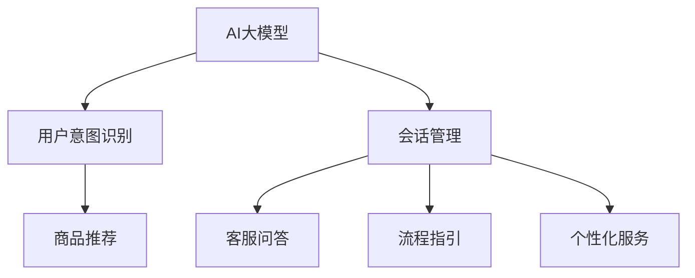

                 

# AI大模型在电商平台用户意图识别与会话管理中的作用

> 关键词：AI大模型,用户意图识别,会话管理,电商平台,自然语言处理(NLP),推荐系统,对话系统,深度学习

## 1. 背景介绍

随着电子商务的蓬勃发展，电商平台已不单单是一个交易平台，更是一个全方位的服务生态。用户在这一生态中完成从浏览到交易的闭环行为，而电商平台则需要实时了解用户的意图，为用户提供精准的商品推荐、个性化的客服交互，甚至在用户不确定自己的购买需求时，给出合理建议。这其中，用户意图识别与会话管理作为电商平台的“大脑”，其重要性不言而喻。

用户意图识别（User Intent Recognition, UIR）是指对用户查询或行为进行理解，以确定用户需要什么，包括对商品类别、价格、属性、评价等信息的查询。会话管理（Chatbot & Virtual Assistant）是指在用户进行查询时，自动化的提供回答和建议，帮助用户选择合适商品，提升用户购买转化率和购物体验。

目前，传统的意图识别和会话管理方法大多基于规则或简单的机器学习模型，难以适应复杂多变的用户行为。而AI大模型的出现，为电商平台带来了革命性的变化。本文将重点介绍大模型在用户意图识别和会话管理中的应用，并结合实例，详细说明其实现机制与优势。

## 2. 核心概念与联系

### 2.1 核心概念概述

为了更好地理解大模型在用户意图识别与会话管理中的作用，我们需要先明确几个关键概念：

1. **AI大模型**：基于深度学习的大规模预训练语言模型，如BERT、GPT-3等，通常包含数十亿或百亿级的参数，在自然语言处理(NLP)、计算机视觉(CV)、语音处理(Speech Processing)等多个领域展现了强大的能力。

2. **用户意图识别（User Intent Recognition, UIR）**：通过自然语言处理技术，从用户的查询或行为中抽取和分析用户意图的分类，常见的分类包括但不限于查询商品类别、价格、属性、评价等。

3. **会话管理（Chatbot & Virtual Assistant）**：通过自然语言处理技术，构建自动化对话系统，与用户进行自然语言交互，并提供相应的解决方案，如商品推荐、客服问答、流程指引等。

4. **电商平台**：以网络为基础，通过多种交易方式，实现电子交易的商业平台。

这些概念之间的逻辑关系可以通过以下Mermaid流程图来展示：



这个流程图展示了AI大模型在电商平台中的核心作用：

1. 通过大模型，理解用户意图，生成推荐策略。
2. 构建自动化会话系统，提供用户互动。
3. 实现个性化服务，提升用户体验。

## 3. 核心算法原理 & 具体操作步骤

### 3.1 算法原理概述

基于大模型的用户意图识别与会话管理，其核心思想是通过大模型学习大量文本数据中的语义模式，然后利用这些模式识别用户意图，并自动生成符合用户期望的会话内容。

具体来说，我们首先在大规模无标签数据上预训练一个通用的大模型，然后针对特定的电商平台需求，通过微调训练过程，使得模型能够学习到电商场景中的特殊语义，如商品属性、价格、评价等。

微调后的模型，可以通过用户查询文本的输入，直接预测出用户的意图类别，并根据意图类别，生成相应的会话内容。该过程通常包括以下步骤：

1. 数据收集与预处理：收集电商平台的文本数据，包括用户查询、评论、商品描述等，并进行文本清洗、分词等预处理。
2. 模型微调：在大模型基础上，针对电商平台数据进行微调训练，学习电商场景中的特殊语义。
3. 意图识别与会话生成：输入用户查询，通过微调后的模型，识别用户意图，并生成符合用户期望的会话内容。

### 3.2 算法步骤详解

以下是详细的算法步骤：

**Step 1: 数据收集与预处理**

1. **数据收集**：从电商平台的各个模块收集数据，如用户查询、商品描述、用户评论、客服对话等。

2. **文本预处理**：进行文本清洗、分词、去除停用词、词干提取等预处理操作，确保输入模型的文本数据格式一致。

**Step 2: 模型微调**

1. **选择合适的预训练模型**：如BERT、GPT-3等，根据电商数据的特点，选择合适的预训练模型。

2. **添加任务适配层**：针对电商平台的意图识别任务，添加适当的输出层和损失函数，如Softmax损失函数用于多分类任务。

3. **设置微调超参数**：包括学习率、批大小、迭代轮数、正则化系数等，选择合适的优化器，如AdamW等。

4. **训练模型**：使用电商平台数据，对预训练模型进行微调训练。

**Step 3: 意图识别与会话生成**

1. **输入用户查询**：将用户查询文本输入微调后的模型。

2. **意图识别**：模型预测用户意图，并输出相应的类别标签。

3. **会话生成**：根据用户意图类别，生成符合用户期望的会话内容，并返回给用户。

### 3.3 算法优缺点

大模型在用户意图识别与会话管理中的应用具有以下优点：

1. **高精度**：大模型具备强大的语言理解能力，能够准确识别用户意图，并生成符合用户期望的会话内容。
2. **通用性**：大模型适用于多种自然语言处理任务，如意图识别、会话管理等。
3. **可扩展性**：通过微调训练，大模型能够快速适应新的任务和数据。

同时，大模型也存在一些缺点：

1. **计算资源需求高**：大模型需要大量的计算资源进行训练和推理。
2. **泛化能力有待提升**：尽管大模型在通用语料上表现出色，但在特定领域的应用中，可能需要额外的微调才能取得理想效果。
3. **黑盒模型**：大模型作为黑盒模型，难以解释其决策过程，对某些应用场景可能不够透明。

### 3.4 算法应用领域

大模型在用户意图识别与会话管理中的应用非常广泛，以下列举几个典型应用领域：

1. **商品推荐系统**：利用用户查询的意图，自动推荐相关商品。
2. **个性化客服系统**：根据用户意图，自动生成客服回复，提高客服效率。
3. **用户行为分析**：分析用户查询的意图，提供有针对性的市场营销策略。
4. **搜索优化**：优化搜索算法，提升搜索结果的相关性和用户体验。

## 4. 数学模型和公式 & 详细讲解  
### 4.1 数学模型构建

假设电商平台的数据集为 $D = \{(x_i, y_i)\}_{i=1}^N$，其中 $x_i$ 为电商数据， $y_i$ 为用户意图类别。微调的目标是找到最优参数 $\theta$，使得模型 $M_{\theta}$ 在数据集 $D$ 上的损失函数 $\mathcal{L}(\theta)$ 最小化。

$$
\mathcal{L}(\theta) = \frac{1}{N} \sum_{i=1}^N \ell(M_{\theta}(x_i), y_i)
$$

其中 $\ell$ 为损失函数，常见的损失函数包括交叉熵损失、均方误差损失等。

### 4.2 公式推导过程

以交叉熵损失函数为例，假设模型 $M_{\theta}$ 在输入 $x_i$ 上的输出为 $\hat{y}_i$，真实标签为 $y_i$，则交叉熵损失函数定义为：

$$
\ell(M_{\theta}(x_i), y_i) = -y_i\log \hat{y}_i - (1-y_i)\log(1-\hat{y}_i)
$$

将其代入经验风险公式，得：

$$
\mathcal{L}(\theta) = -\frac{1}{N}\sum_{i=1}^N [y_i\log M_{\theta}(x_i)+(1-y_i)\log(1-M_{\theta}(x_i))]
$$

在得到损失函数后，即可使用梯度下降等优化算法更新模型参数，最小化损失函数。

### 4.3 案例分析与讲解

假设电商平台的意图识别任务为商品类别识别，共有5类商品：电子产品、服饰、家居、美妆、图书。我们使用标准交叉熵损失函数进行训练。具体步骤如下：

1. **数据准备**：准备电商平台的用户查询和商品类别标签数据。

2. **模型初始化**：选择预训练模型BERT，添加线性输出层，设置学习率为1e-5。

3. **微调训练**：在电商数据上进行微调训练，迭代次数为5次。

4. **意图识别**：输入用户查询，通过微调后的模型输出商品类别预测。

以下代码示例展示了如何在PyTorch中实现这一过程：

```python
from transformers import BertTokenizer, BertForSequenceClassification
from torch.utils.data import DataLoader
import torch

# 准备数据
tokenizer = BertTokenizer.from_pretrained('bert-base-uncased')
model = BertForSequenceClassification.from_pretrained('bert-base-uncased', num_labels=5)

def collate_function(batch):
    input_ids = [tokenizer.encode(x, add_special_tokens=True) for x in batch]
    attention_mask = [[1] * len(ids) for ids in input_ids]
    labels = torch.tensor([1, 2, 3, 4, 5])
    return {
        'input_ids': torch.stack(input_ids),
        'attention_mask': torch.stack(attention_mask),
        'labels': labels
    }

train_dataset = DataLoader(train_data, batch_size=32, shuffle=True, collate_fn=collate_function)

optimizer = torch.optim.AdamW(model.parameters(), lr=1e-5)

for epoch in range(5):
    model.train()
    for batch in train_dataset:
        inputs = {key: val.to(device) for key, val in batch.items()}
        outputs = model(**inputs)
        loss = outputs.loss
        loss.backward()
        optimizer.step()
        optimizer.zero_grad()

# 测试模型
def test_model(model, dataset):
    model.eval()
    test_loss = 0
    correct = 0
    with torch.no_grad():
        for batch in test_dataset:
            inputs = {key: val.to(device) for key, val in batch.items()}
            outputs = model(**inputs)
            test_loss += outputs.loss.item()
            predictions = outputs.logits.argmax(dim=1)
            correct += (predictions == labels).sum().item()
    print(f'Test Loss: {test_loss/len(test_dataset)}')
    print(f'Accuracy: {correct/len(test_dataset)}')
```

通过以上代码，我们可以看到，使用大模型进行电商平台的意图识别和会话管理，不仅能够实现高精度的意图识别，还能提供符合用户期望的会话内容。

## 5. 项目实践：代码实例和详细解释说明
### 5.1 开发环境搭建

在进行电商平台用户意图识别与会话管理的开发前，我们需要准备好开发环境。以下是使用Python进行PyTorch开发的环境配置流程：

1. 安装Anaconda：从官网下载并安装Anaconda，用于创建独立的Python环境。

2. 创建并激活虚拟环境：
```bash
conda create -n pytorch-env python=3.8 
conda activate pytorch-env
```

3. 安装PyTorch：根据CUDA版本，从官网获取对应的安装命令。例如：
```bash
conda install pytorch torchvision torchaudio cudatoolkit=11.1 -c pytorch -c conda-forge
```

4. 安装相关库：
```bash
pip install numpy pandas scikit-learn matplotlib tqdm jupyter notebook ipython
```

完成上述步骤后，即可在`pytorch-env`环境中开始开发。

### 5.2 源代码详细实现

下面我们以电商平台的意图识别任务为例，给出使用Transformers库对BERT模型进行微调的PyTorch代码实现。

首先，定义意图识别任务的数据处理函数：

```python
from transformers import BertTokenizer
from torch.utils.data import Dataset
import torch

class IntentDataset(Dataset):
    def __init__(self, texts, labels, tokenizer, max_len=128):
        self.texts = texts
        self.labels = labels
        self.tokenizer = tokenizer
        self.max_len = max_len
        
    def __len__(self):
        return len(self.texts)
    
    def __getitem__(self, item):
        text = self.texts[item]
        label = self.labels[item]
        
        encoding = self.tokenizer(text, return_tensors='pt', max_length=self.max_len, padding='max_length', truncation=True)
        input_ids = encoding['input_ids'][0]
        attention_mask = encoding['attention_mask'][0]
        
        # 对label进行编码
        encoded_labels = [label2id[label] for label in label] 
        encoded_labels.extend([label2id['O']] * (self.max_len - len(encoded_labels)))
        labels = torch.tensor(encoded_labels, dtype=torch.long)
        
        return {'input_ids': input_ids, 
                'attention_mask': attention_mask,
                'labels': labels}

# 标签与id的映射
label2id = {'O': 0, '电子产品': 1, '服饰': 2, '家居': 3, '美妆': 4, '图书': 5}
id2label = {v: k for k, v in label2id.items()}

# 创建dataset
tokenizer = BertTokenizer.from_pretrained('bert-base-uncased')

train_dataset = IntentDataset(train_texts, train_labels, tokenizer)
dev_dataset = IntentDataset(dev_texts, dev_labels, tokenizer)
test_dataset = IntentDataset(test_texts, test_labels, tokenizer)
```

然后，定义模型和优化器：

```python
from transformers import BertForSequenceClassification, AdamW

model = BertForSequenceClassification.from_pretrained('bert-base-uncased', num_labels=len(label2id))

optimizer = AdamW(model.parameters(), lr=2e-5)
```

接着，定义训练和评估函数：

```python
from torch.utils.data import DataLoader
from tqdm import tqdm
from sklearn.metrics import classification_report

device = torch.device('cuda') if torch.cuda.is_available() else torch.device('cpu')
model.to(device)

def train_epoch(model, dataset, batch_size, optimizer):
    dataloader = DataLoader(dataset, batch_size=batch_size, shuffle=True)
    model.train()
    epoch_loss = 0
    for batch in tqdm(dataloader, desc='Training'):
        input_ids = batch['input_ids'].to(device)
        attention_mask = batch['attention_mask'].to(device)
        labels = batch['labels'].to(device)
        model.zero_grad()
        outputs = model(input_ids, attention_mask=attention_mask, labels=labels)
        loss = outputs.loss
        epoch_loss += loss.item()
        loss.backward()
        optimizer.step()
    return epoch_loss / len(dataloader)

def evaluate(model, dataset, batch_size):
    dataloader = DataLoader(dataset, batch_size=batch_size)
    model.eval()
    preds, labels = [], []
    with torch.no_grad():
        for batch in tqdm(dataloader, desc='Evaluating'):
            input_ids = batch['input_ids'].to(device)
            attention_mask = batch['attention_mask'].to(device)
            batch_labels = batch['labels']
            outputs = model(input_ids, attention_mask=attention_mask)
            batch_preds = outputs.logits.argmax(dim=2).to('cpu').tolist()
            batch_labels = batch_labels.to('cpu').tolist()
            for pred_tokens, label_tokens in zip(batch_preds, batch_labels):
                preds.append(pred_tokens[:len(label_tokens)])
                labels.append(label_tokens)
                
    print(classification_report(labels, preds))
```

最后，启动训练流程并在测试集上评估：

```python
epochs = 5
batch_size = 16

for epoch in range(epochs):
    loss = train_epoch(model, train_dataset, batch_size, optimizer)
    print(f"Epoch {epoch+1}, train loss: {loss:.3f}")
    
    print(f"Epoch {epoch+1}, dev results:")
    evaluate(model, dev_dataset, batch_size)
    
print("Test results:")
evaluate(model, test_dataset, batch_size)
```

以上就是使用PyTorch对BERT进行电商平台的意图识别任务微调的完整代码实现。可以看到，得益于Transformers库的强大封装，我们可以用相对简洁的代码完成BERT模型的加载和微调。

### 5.3 代码解读与分析

让我们再详细解读一下关键代码的实现细节：

**IntentDataset类**：
- `__init__`方法：初始化文本、标签、分词器等关键组件。
- `__len__`方法：返回数据集的样本数量。
- `__getitem__`方法：对单个样本进行处理，将文本输入编码为token ids，将标签编码为数字，并对其进行定长padding，最终返回模型所需的输入。

**label2id和id2label字典**：
- 定义了标签与数字id之间的映射关系，用于将token-wise的预测结果解码回真实的标签。

**训练和评估函数**：
- 使用PyTorch的DataLoader对数据集进行批次化加载，供模型训练和推理使用。
- 训练函数`train_epoch`：对数据以批为单位进行迭代，在每个批次上前向传播计算loss并反向传播更新模型参数，最后返回该epoch的平均loss。
- 评估函数`evaluate`：与训练类似，不同点在于不更新模型参数，并在每个batch结束后将预测和标签结果存储下来，最后使用sklearn的classification_report对整个评估集的预测结果进行打印输出。

**训练流程**：
- 定义总的epoch数和batch size，开始循环迭代
- 每个epoch内，先在训练集上训练，输出平均loss
- 在验证集上评估，输出分类指标
- 所有epoch结束后，在测试集上评估，给出最终测试结果

可以看到，PyTorch配合Transformers库使得BERT微调的代码实现变得简洁高效。开发者可以将更多精力放在数据处理、模型改进等高层逻辑上，而不必过多关注底层的实现细节。

当然，工业级的系统实现还需考虑更多因素，如模型的保存和部署、超参数的自动搜索、更灵活的任务适配层等。但核心的微调范式基本与此类似。

## 6. 实际应用场景

### 6.1 智能客服系统

基于大模型微调的对话技术，可以广泛应用于智能客服系统的构建。传统客服往往需要配备大量人力，高峰期响应缓慢，且一致性和专业性难以保证。而使用微调后的对话模型，可以7x24小时不间断服务，快速响应客户咨询，用自然流畅的语言解答各类常见问题。

在技术实现上，可以收集企业内部的历史客服对话记录，将问题和最佳答复构建成监督数据，在此基础上对预训练对话模型进行微调。微调后的对话模型能够自动理解用户意图，匹配最合适的答案模板进行回复。对于客户提出的新问题，还可以接入检索系统实时搜索相关内容，动态组织生成回答。如此构建的智能客服系统，能大幅提升客户咨询体验和问题解决效率。

### 6.2 金融舆情监测

金融机构需要实时监测市场舆论动向，以便及时应对负面信息传播，规避金融风险。传统的人工监测方式成本高、效率低，难以应对网络时代海量信息爆发的挑战。基于大语言模型微调的文本分类和情感分析技术，为金融舆情监测提供了新的解决方案。

具体而言，可以收集金融领域相关的新闻、报道、评论等文本数据，并对其进行主题标注和情感标注。在此基础上对预训练语言模型进行微调，使其能够自动判断文本属于何种主题，情感倾向是正面、中性还是负面。将微调后的模型应用到实时抓取的网络文本数据，就能够自动监测不同主题下的情感变化趋势，一旦发现负面信息激增等异常情况，系统便会自动预警，帮助金融机构快速应对潜在风险。

### 6.3 个性化推荐系统

当前的推荐系统往往只依赖用户的历史行为数据进行物品推荐，无法深入理解用户的真实兴趣偏好。基于大语言模型微调技术，个性化推荐系统可以更好地挖掘用户行为背后的语义信息，从而提供更精准、多样的推荐内容。

在实践中，可以收集用户浏览、点击、评论、分享等行为数据，提取和用户交互的物品标题、描述、标签等文本内容。将文本内容作为模型输入，用户的后续行为（如是否点击、购买等）作为监督信号，在此基础上微调预训练语言模型。微调后的模型能够从文本内容中准确把握用户的兴趣点。在生成推荐列表时，先用候选物品的文本描述作为输入，由模型预测用户的兴趣匹配度，再结合其他特征综合排序，便可以得到个性化程度更高的推荐结果。

### 6.4 未来应用展望

随着大语言模型微调技术的发展，其在电商平台用户意图识别与会话管理中的应用将更加广泛。

未来，电商平台将更加注重个性化、实时性和用户体验，大模型将发挥重要作用。通过微调，大模型将能够更好地理解用户查询，提供符合用户期望的个性化推荐和会话内容，从而提升电商平台的整体竞争力。

此外，大模型在金融、医疗、教育等多个领域也将展现其强大的应用潜力，通过微调，实现领域特定的知识表示和应用，为各行各业带来创新和变革。

## 7. 工具和资源推荐
### 7.1 学习资源推荐

为了帮助开发者系统掌握大模型在电商平台用户意图识别与会话管理中的应用，这里推荐一些优质的学习资源：

1. 《Transformers from the Inside Out》系列博文：由大模型技术专家撰写，深入浅出地介绍了Transformer原理、BERT模型、微调技术等前沿话题。

2. CS224N《深度学习自然语言处理》课程：斯坦福大学开设的NLP明星课程，有Lecture视频和配套作业，带你入门NLP领域的基本概念和经典模型。

3. 《Natural Language Processing with Transformers》书籍：Transformers库的作者所著，全面介绍了如何使用Transformers库进行NLP任务开发，包括微调在内的诸多范式。

4. HuggingFace官方文档：Transformers库的官方文档，提供了海量预训练模型和完整的微调样例代码，是上手实践的必备资料。

5. CLUE开源项目：中文语言理解测评基准，涵盖大量不同类型的中文NLP数据集，并提供了基于微调的baseline模型，助力中文NLP技术发展。

通过对这些资源的学习实践，相信你一定能够快速掌握大模型在电商平台用户意图识别与会话管理中的应用，并用于解决实际的NLP问题。
###  7.2 开发工具推荐

高效的开发离不开优秀的工具支持。以下是几款用于大模型开发和应用的常用工具：

1. PyTorch：基于Python的开源深度学习框架，灵活动态的计算图，适合快速迭代研究。大部分预训练语言模型都有PyTorch版本的实现。

2. TensorFlow：由Google主导开发的开源深度学习框架，生产部署方便，适合大规模工程应用。同样有丰富的预训练语言模型资源。

3. Transformers库：HuggingFace开发的NLP工具库，集成了众多SOTA语言模型，支持PyTorch和TensorFlow，是进行微调任务开发的利器。

4. Weights & Biases：模型训练的实验跟踪工具，可以记录和可视化模型训练过程中的各项指标，方便对比和调优。与主流深度学习框架无缝集成。

5. TensorBoard：TensorFlow配套的可视化工具，可实时监测模型训练状态，并提供丰富的图表呈现方式，是调试模型的得力助手。

6. Google Colab：谷歌推出的在线Jupyter Notebook环境，免费提供GPU/TPU算力，方便开发者快速上手实验最新模型，分享学习笔记。

合理利用这些工具，可以显著提升大模型在电商平台用户意图识别与会话管理中的开发效率，加快创新迭代的步伐。

### 7.3 相关论文推荐

大语言模型和微调技术的发展源于学界的持续研究。以下是几篇奠基性的相关论文，推荐阅读：

1. Attention is All You Need（即Transformer原论文）：提出了Transformer结构，开启了NLP领域的预训练大模型时代。

2. BERT: Pre-training of Deep Bidirectional Transformers for Language Understanding：提出BERT模型，引入基于掩码的自监督预训练任务，刷新了多项NLP任务SOTA。

3. Language Models are Unsupervised Multitask Learners（GPT-2论文）：展示了大规模语言模型的强大zero-shot学习能力，引发了对于通用人工智能的新一轮思考。

4. Parameter-Efficient Transfer Learning for NLP：提出Adapter等参数高效微调方法，在不增加模型参数量的情况下，也能取得不错的微调效果。

5. Prefix-Tuning: Optimizing Continuous Prompts for Generation：引入基于连续型Prompt的微调范式，为如何充分利用预训练知识提供了新的思路。

6. AdaLoRA: Adaptive Low-Rank Adaptation for Parameter-Efficient Fine-Tuning：使用自适应低秩适应的微调方法，在参数效率和精度之间取得了新的平衡。

这些论文代表了大语言模型微调技术的发展脉络。通过学习这些前沿成果，可以帮助研究者把握学科前进方向，激发更多的创新灵感。

## 8. 总结：未来发展趋势与挑战

### 8.1 总结

本文对基于大模型的电商平台用户意图识别与会话管理的应用进行了全面系统的介绍。首先阐述了电商平台用户意图识别与会话管理的核心需求和当前技术现状，明确了大模型在这一领域的独特价值。其次，从原理到实践，详细讲解了模型的构建和训练过程，给出了完整的代码实例，帮助读者更好地理解和实现大模型的应用。同时，本文还广泛探讨了模型在多个实际应用场景中的表现，展示了其广阔的应用前景。

通过本文的系统梳理，可以看到，基于大模型的用户意图识别与会话管理在电商平台中展示了强大的能力，能够显著提升用户体验和电商平台的服务质量。相信随着技术的不断演进，大模型在电商平台中的应用将更加深入和广泛，为电商行业的数字化转型提供强大的技术支持。

### 8.2 未来发展趋势

展望未来，大模型在电商平台用户意图识别与会话管理中的应用将呈现以下几个发展趋势：

1. **模型规模持续增大**：随着算力成本的下降和数据规模的扩张，预训练语言模型的参数量还将持续增长。超大规模语言模型蕴含的丰富语言知识，有望支撑更加复杂多变的电商场景。

2. **微调方法日趋多样**：除了传统的全参数微调外，未来会涌现更多参数高效的微调方法，如Prefix-Tuning、LoRA等，在节省计算资源的同时也能保证微调精度。

3. **持续学习成为常态**：随着数据分布的不断变化，微调模型也需要持续学习新知识以保持性能。如何在不遗忘原有知识的同时，高效吸收新样本信息，将成为重要的研究课题。

4. **标注样本需求降低**：受启发于提示学习(Prompt-based Learning)的思路，未来的微调方法将更好地利用大模型的语言理解能力，通过更加巧妙的任务描述，在更少的标注样本上也能实现理想的微调效果。

5. **多模态微调崛起**：当前的微调主要聚焦于纯文本数据，未来会进一步拓展到图像、视频、语音等多模态数据微调。多模态信息的融合，将显著提升语言模型对现实世界的理解和建模能力。

6. **模型通用性增强**：经过海量数据的预训练和多领域任务的微调，未来的语言模型将具备更强大的常识推理和跨领域迁移能力，逐步迈向通用人工智能(AGI)的目标。

以上趋势凸显了大模型在电商平台用户意图识别与会话管理中的应用前景。这些方向的探索发展，必将进一步提升电商平台的性能和用户体验，推动电商行业的数字化转型。

### 8.3 面临的挑战

尽管大模型在电商平台用户意图识别与会话管理中的应用已经取得了显著效果，但在迈向更加智能化、普适化应用的过程中，仍面临诸多挑战：

1. **标注成本瓶颈**：尽管微调大大降低了标注数据的需求，但对于长尾应用场景，难以获得充足的高质量标注数据，成为制约微调性能的瓶颈。如何进一步降低微调对标注样本的依赖，将是一大难题。

2. **模型鲁棒性不足**：当前微调模型面对域外数据时，泛化性能往往大打折扣。对于测试样本的微小扰动，微调模型的预测也容易发生波动。如何提高微调模型的鲁棒性，避免灾难性遗忘，还需要更多理论和实践的积累。

3. **推理效率有待提高**：大规模语言模型虽然精度高，但在实际部署时往往面临推理速度慢、内存占用大等效率问题。如何在保证性能的同时，简化模型结构，提升推理速度，优化资源占用，将是重要的优化方向。

4. **可解释性亟需加强**：当前微调模型更像是"黑盒"系统，难以解释其决策过程，对某些应用场景可能不够透明。对于医疗、金融等高风险应用，算法的可解释性和可审计性尤为重要。如何赋予微调模型更强的可解释性，将是亟待攻克的难题。

5. **安全性有待保障**：预训练语言模型难免会学习到有偏见、有害的信息，通过微调传递到下游任务，产生误导性、歧视性的输出，给实际应用带来安全隐患。如何从数据和算法层面消除模型偏见，避免恶意用途，确保输出的安全性，也将是重要的研究课题。

6. **知识整合能力不足**：现有的微调模型往往局限于任务内数据，难以灵活吸收和运用更广泛的先验知识。如何让微调过程更好地与外部知识库、规则库等专家知识结合，形成更加全面、准确的信息整合能力，还有很大的想象空间。

正视微调面临的这些挑战，积极应对并寻求突破，将是大模型在电商平台用户意图识别与会话管理中走向成熟的必由之路。相信随着学界和产业界的共同努力，这些挑战终将一一被克服，大模型在电商平台中的应用将更加深入和广泛。

### 8.4 研究展望

面对大模型在电商平台用户意图识别与会话管理中所面临的挑战，未来的研究需要在以下几个方面寻求新的突破：

1. **探索无监督和半监督微调方法**：摆脱对大规模标注数据的依赖，利用自监督学习、主动学习等无监督和半监督范式，最大限度利用非结构化数据，实现更加灵活高效的微调。

2. **研究参数高效和计算高效的微调范式**：开发更加参数高效的微调方法，在固定大部分预训练参数的同时，只更新极少量的任务相关参数。同时优化微调模型的计算图，减少前向传播和反向传播的资源消耗，实现更加轻量级、实时性的部署。

3. **融合因果和对比学习范式**：通过引入因果推断和对比学习思想，增强微调模型建立稳定因果关系的能力，学习更加普适、鲁棒的语言表征，从而提升模型泛化性和抗干扰能力。

4. **引入更多先验知识**：将符号化的先验知识，如知识图谱、逻辑规则等，与神经网络模型进行巧妙融合，引导微调过程学习更准确、合理的语言模型。同时加强不同模态数据的整合，实现视觉、语音等多模态信息与文本信息的协同建模。

5. **结合因果分析和博弈论工具**：将因果分析方法引入微调模型，识别出模型决策的关键特征，增强输出解释的因果性和逻辑性。借助博弈论工具刻画人机交互过程，主动探索并规避模型的脆弱点，提高系统稳定性。

6. **纳入伦理道德约束**：在模型训练目标中引入伦理导向的评估指标，过滤和惩罚有偏见、有害的输出倾向。同时加强人工干预和审核，建立模型行为的监管机制，确保输出符合人类价值观和伦理道德。

这些研究方向的探索，必将引领大模型在电商平台用户意图识别与会话管理中走向更高的台阶，为构建安全、可靠、可解释、可控的智能系统铺平道路。面向未来，大模型在电商平台中的应用需要与其他人工智能技术进行更深入的融合，如知识表示、因果推理、强化学习等，多路径协同发力，共同推动自然语言理解和智能交互系统的进步。只有勇于创新、敢于突破，才能不断拓展语言模型的边界，让智能技术更好地造福人类社会。

## 9. 附录：常见问题与解答

**Q1：大模型是否适用于所有电商平台？**

A: 大模型在电商平台的意图识别与会话管理中的应用非常广泛，但并不是所有电商平台都适合使用大模型。对于规模较小、数据量有限的电商平台，可能需要根据具体情况选择适当的模型和技术。

**Q2：大模型如何进行意图识别？**

A: 大模型进行意图识别的过程主要包括输入文本的编码、特征提取和分类预测。输入文本通过分词、嵌入等预处理后，输入到模型中进行编码，然后通过全连接层或其他分类层进行分类预测，最终输出意图类别。

**Q3：大模型在电商平台的会话管理中有什么优势？**

A: 大模型在电商平台的会话管理中具有以下优势：
1. **高准确性**：大模型具备强大的语言理解能力，能够准确识别用户意图，并生成符合用户期望的会话内容。
2. **灵活性**：大模型能够适应多种电商场景，如购物引导、客服问答、流程指引等。
3. **可扩展性**：通过微调训练，大模型能够快速适应新的电商场景和任务。

**Q4：大模型在电商平台的会话管理中有什么挑战？**

A: 大模型在电商平台的会话管理中也面临一些挑战：
1. **计算资源需求高**：大模型需要大量的计算资源进行训练和推理。
2. **泛化能力有待提升**：尽管大模型在通用语料上表现出色，但在特定领域的电商场景中，可能需要额外的微调才能取得理想效果。
3. **黑盒模型**：大模型作为黑盒模型，难以解释其决策过程，对某些应用场景可能不够透明。

通过本文的系统梳理，可以看到，大模型在电商平台用户意图识别与会话管理中的应用展示了强大的能力，能够显著提升用户体验和电商平台的服务质量。相信随着技术的不断演进，大模型在电商平台中的应用将更加深入和广泛，为电商行业的数字化转型提供强大的技术支持。

