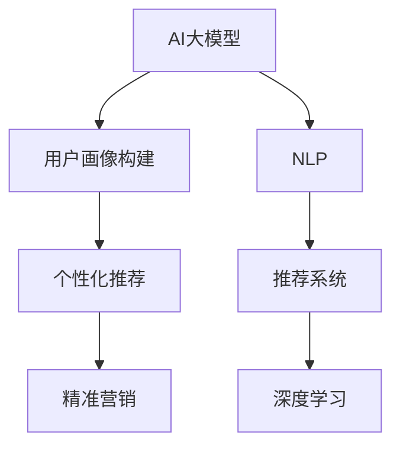

                 

# AI大模型在电商平台用户群体画像与精准营销中的作用

> 关键词：AI大模型,电商平台,用户画像,精准营销,自然语言处理(NLP),推荐系统,深度学习

## 1. 背景介绍

### 1.1 问题由来
随着互联网的快速发展，电商平台的竞争愈发激烈。平台如何高效、精准地进行用户群体画像构建和个性化推荐，已成为提升用户体验、增强用户黏性和销售额的重要手段。然而，传统的用户画像构建和推荐系统面临诸多挑战：

- **数据稀疏性**：电商平台的数据维度丰富，但用户行为数据往往稀疏，难以全面刻画用户画像。
- **数据异构性**：不同来源的数据格式不一，难以直接融合。
- **用户多样性**：不同用户的兴趣和行为模式差异巨大，难以构建统一的用户画像。
- **推荐同质化**：推荐系统容易陷入内容推荐的同质化，缺乏个性化和创新性。

为解决这些挑战，电商平台开始引入人工智能(AI)大模型，利用其强大的自学习和自适应能力，进行用户群体画像构建和精准营销。AI大模型在电商平台的创新应用，为提升电商用户体验和运营效率提供了新的思路和手段。

## 2. 核心概念与联系

### 2.1 核心概念概述

为更好地理解AI大模型在电商平台中的应用，本节将介绍几个密切相关的核心概念：

- **AI大模型**：如BERT、GPT-3、DALL-E等，通过大规模无标签数据进行自监督预训练，具备强大的语言理解、图像生成等能力。
- **用户画像(User Profile)**：刻画用户特征和行为模式，为个性化推荐提供基础。
- **精准营销(Precision Marketing)**：利用数据分析和算法技术，将广告和推荐内容精准推送给目标用户，提升营销效果和用户满意度。
- **自然语言处理(NLP)**：分析、理解和生成自然语言的能力，用于解析用户评论、生成商品描述等。
- **推荐系统(Recommendation System)**：根据用户历史行为和偏好，推荐符合用户兴趣的商品。
- **深度学习(Deep Learning)**：基于神经网络模型进行的特征学习和模式识别，用于构建高效的用户画像和推荐系统。

这些核心概念之间的逻辑关系可以通过以下Mermaid流程图来展示：



这个流程图展示了AI大模型在电商平台应用的核心流程：

1. 通过大规模数据训练的AI大模型，提供强大的特征提取和语义理解能力。
2. 用户画像构建模块将用户行为数据和文本数据输入AI大模型，学习用户的兴趣偏好和行为模式。
3. 基于学习到的用户画像，推荐系统对用户进行个性化推荐。
4. 精准营销模块通过广告和推荐内容推送，实现用户精准定位和内容精准匹配。
5. 自然语言处理和深度学习技术进一步辅助推荐系统，提升推荐精度。

## 3. 核心算法原理 & 具体操作步骤
### 3.1 算法原理概述

AI大模型在电商平台用户群体画像与精准营销中的作用，主要体现在以下几个方面：

- **用户画像构建**：利用AI大模型对用户行为数据和文本数据进行分析和建模，构建完整、丰富的用户画像。
- **推荐系统优化**：通过AI大模型对推荐数据进行特征提取和理解，提升推荐系统的准确性和个性化程度。
- **内容生成与优化**：利用AI大模型生成商品描述、广告语等文本内容，提升商品展示效果。
- **用户行为预测**：通过AI大模型预测用户未来行为，实现更精准的个性化推荐和营销。

核心算法原理包括：

1. **用户画像构建**：通过深度学习模型对用户行为数据和文本数据进行特征提取和聚类，形成用户画像向量表示。
2. **推荐系统优化**：利用AI大模型对推荐数据进行语义理解和特征提取，生成更符合用户兴趣的推荐结果。
3. **内容生成与优化**：基于AI大模型生成高质量的商品描述、广告语等文本内容，提升用户点击率和转化率。
4. **用户行为预测**：通过AI大模型预测用户未来行为，如购买意向、流失概率等，实现更精准的个性化推荐和营销。

### 3.2 算法步骤详解

以下是AI大模型在电商平台用户群体画像与精准营销中的具体算法步骤：

**Step 1: 数据收集与预处理**
- 收集用户行为数据，如浏览历史、购买记录、评价等。
- 收集用户文本数据，如商品描述、评论、活动公告等。
- 对数据进行去噪、清洗、标准化等预处理，确保数据质量。

**Step 2: 用户画像构建**
- 使用深度学习模型对用户行为数据和文本数据进行特征提取和聚类。
- 通过层次聚类、K-means等方法，将用户分为不同的兴趣群体。
- 将每个用户的特征向量作为用户画像，构建用户画像库。

**Step 3: 推荐系统优化**
- 将用户画像向量作为推荐系统的输入特征，结合商品特征向量，计算相似度。
- 使用协同过滤、矩阵分解等方法，对推荐数据进行排序和推荐。
- 引入AI大模型对推荐数据进行语义理解和特征提取，生成更符合用户兴趣的推荐结果。

**Step 4: 内容生成与优化**
- 利用AI大模型生成高质量的商品描述、广告语等文本内容。
- 对生成内容进行优化，提升用户体验和点击率。
- 引入AI大模型进行文本生成和风格迁移，生成更吸引用户的推荐文案。

**Step 5: 用户行为预测**
- 通过AI大模型对用户行为数据进行建模，预测用户未来行为。
- 引入时间序列分析和深度学习模型，提升行为预测的准确性。
- 结合用户画像和行为预测结果，实现更精准的个性化推荐和营销。

### 3.3 算法优缺点

AI大模型在电商平台用户群体画像与精准营销中的应用具有以下优点：

1. **高效特征提取**：AI大模型能够高效地从大规模数据中提取用户特征和行为模式，构建丰富的用户画像。
2. **强大的语义理解**：利用AI大模型对文本数据进行语义理解和特征提取，提升推荐系统的准确性和个性化程度。
3. **自动内容生成**：AI大模型能够自动生成高质量的商品描述、广告语等文本内容，提升用户点击率和转化率。
4. **精准行为预测**：通过AI大模型对用户行为数据进行建模，实现更精准的个性化推荐和营销。

同时，也存在一些局限性：

1. **数据质量要求高**：AI大模型对数据质量要求较高，数据的完整性和准确性直接影响模型效果。
2. **计算资源消耗大**：AI大模型通常需要强大的计算资源，训练和推理过程耗时较长。
3. **模型解释性不足**：AI大模型的决策过程较为复杂，难以解释其内部工作机制和推理逻辑。
4. **过度拟合风险**：AI大模型容易过度拟合训练数据，导致泛化能力不足。

尽管存在这些局限性，但AI大模型在电商平台中的应用，仍具有巨大的潜力和价值。

### 3.4 算法应用领域

AI大模型在电商平台用户群体画像与精准营销中的应用，覆盖了以下多个领域：

1. **个性化推荐系统**：根据用户行为数据和文本数据，构建用户画像，生成个性化推荐结果。
2. **用户行为分析**：通过AI大模型对用户行为数据进行建模，预测用户未来行为，实现精准营销。
3. **内容生成与优化**：利用AI大模型生成高质量的商品描述、广告语等文本内容，提升用户点击率和转化率。
4. **广告投放优化**：基于用户画像和行为预测结果，实现广告精准投放，提升广告效果和用户满意度。
5. **社交媒体分析**：利用AI大模型对社交媒体数据进行情感分析、舆情监测等，提升用户互动体验。

此外，AI大模型还可以应用于市场细分、销售预测、库存管理等多个电商运营环节，为电商平台提供全方位的智能化支持。

## 4. 数学模型和公式 & 详细讲解 & 举例说明

### 4.1 数学模型构建

本节将使用数学语言对AI大模型在电商平台中的应用进行更加严格的刻画。

假设电商平台收集到用户行为数据 $D=\{x_i\}_{i=1}^N$，其中 $x_i=(x_i^1, x_i^2, \cdots, x_i^m)$，表示用户行为数据的多维向量。每个行为数据点 $x_i$ 包含了用户的浏览记录、购买记录、评价等。

用户画像 $P=\{p_j\}_{j=1}^K$，其中 $p_j=(p_j^1, p_j^2, \cdots, p_j^d)$，表示用户画像的多维向量。每个用户画像 $p_j$ 包含了用户的基本信息、兴趣爱好、行为模式等。

推荐系统 $S$ 根据用户画像 $P$ 和商品特征向量 $C=\{c_k\}_{k=1}^M$，生成推荐结果 $r_k$，其中 $c_k=(c_k^1, c_k^2, \cdots, c_k^n)$，表示商品特征的多维向量。

推荐结果 $r_k$ 由以下公式计算：

$$
r_k = f_k(P) \times C_k
$$

其中 $f_k(P)$ 表示用户画像 $P$ 对推荐结果 $r_k$ 的贡献，$C_k$ 表示商品特征向量 $c_k$ 对推荐结果 $r_k$ 的贡献。

用户行为预测模型 $M$ 根据用户行为数据 $D$ 和用户画像 $P$，预测用户未来行为 $y$，其中 $y=(y^1, y^2, \cdots, y^t)$，表示用户未来的多维行为向量。

用户行为预测模型 $M$ 由以下公式计算：

$$
y = M(P, D)
$$

### 4.2 公式推导过程

以下我们以个性化推荐系统为例，推导AI大模型在推荐系统中的数学公式。

假设推荐系统 $S$ 使用深度学习模型对用户画像 $P$ 和商品特征向量 $C$ 进行特征提取，生成推荐结果 $r_k$。推荐结果 $r_k$ 的计算公式为：

$$
r_k = W^T \cdot (P \times C)
$$

其中 $W^T$ 表示权重矩阵，$\times$ 表示矩阵乘法，$P \times C$ 表示用户画像和商品特征向量的拼接。

为了提升推荐结果的精度，引入AI大模型对推荐数据进行语义理解和特征提取。AI大模型使用Transformer结构，对用户画像和商品特征向量进行编码，生成推荐结果 $r_k$。推荐结果 $r_k$ 的计算公式为：

$$
r_k = W^T \cdot [\text{Self-Attention}(P \times C)] \times C_k
$$

其中 $\text{Self-Attention}$ 表示Transformer结构中的注意力机制，$[\cdot]$ 表示向量拼接。

### 4.3 案例分析与讲解

以商品推荐为例，以下是利用AI大模型对用户画像和商品特征进行特征提取和推荐生成的详细过程：

1. **用户画像构建**：
   - 收集用户行为数据，如浏览历史、购买记录、评价等。
   - 利用深度学习模型对用户行为数据进行特征提取，生成用户画像向量 $P_j$。
   - 对用户画像向量进行聚类，将用户分为不同的兴趣群体。

2. **商品特征提取**：
   - 收集商品特征数据，如商品名称、描述、价格等。
   - 利用深度学习模型对商品特征数据进行特征提取，生成商品特征向量 $C_k$。

3. **推荐结果生成**：
   - 将用户画像向量 $P_j$ 和商品特征向量 $C_k$ 拼接，生成输入特征 $X$。
   - 利用AI大模型对输入特征 $X$ 进行编码，生成推荐结果 $r_k$。
   - 通过神经网络模型对推荐结果 $r_k$ 进行排序，生成推荐列表。

## 5. 项目实践：代码实例和详细解释说明
### 5.1 开发环境搭建

在进行AI大模型在电商平台应用实践前，我们需要准备好开发环境。以下是使用Python进行PyTorch开发的环境配置流程：

1. 安装Anaconda：从官网下载并安装Anaconda，用于创建独立的Python环境。

2. 创建并激活虚拟环境：
```bash
conda create -n pytorch-env python=3.8 
conda activate pytorch-env
```

3. 安装PyTorch：根据CUDA版本，从官网获取对应的安装命令。例如：
```bash
conda install pytorch torchvision torchaudio cudatoolkit=11.1 -c pytorch -c conda-forge
```

4. 安装Transformers库：
```bash
pip install transformers
```

5. 安装各类工具包：
```bash
pip install numpy pandas scikit-learn matplotlib tqdm jupyter notebook ipython
```

完成上述步骤后，即可在`pytorch-env`环境中开始AI大模型在电商平台应用实践。

### 5.2 源代码详细实现

以下是使用PyTorch和Transformers库，对电商平台商品推荐系统进行AI大模型微调的Python代码实现。

首先，定义商品推荐的数据处理函数：

```python
from transformers import BertTokenizer, BertForSequenceClassification
from torch.utils.data import Dataset, DataLoader
import torch
import numpy as np

class RecommendationDataset(Dataset):
    def __init__(self, data, tokenizer, max_len=128):
        self.data = data
        self.tokenizer = tokenizer
        self.max_len = max_len
        
    def __len__(self):
        return len(self.data)
    
    def __getitem__(self, idx):
        item = self.data[idx]
        text = item['user_profile'] + item['product_description']
        label = item['label']
        
        encoding = self.tokenizer(text, return_tensors='pt', max_length=self.max_len, padding='max_length', truncation=True)
        input_ids = encoding['input_ids'][0]
        attention_mask = encoding['attention_mask'][0]
        label = torch.tensor(label, dtype=torch.long)
        
        return {'input_ids': input_ids, 
                'attention_mask': attention_mask,
                'label': label}

# 初始化数据集
tokenizer = BertTokenizer.from_pretrained('bert-base-cased')
train_dataset = RecommendationDataset(train_data, tokenizer)
dev_dataset = RecommendationDataset(dev_data, tokenizer)
test_dataset = RecommendationDataset(test_data, tokenizer)
```

然后，定义模型和优化器：

```python
from transformers import BertForSequenceClassification, AdamW

model = BertForSequenceClassification.from_pretrained('bert-base-cased', num_labels=2)
optimizer = AdamW(model.parameters(), lr=2e-5)
```

接着，定义训练和评估函数：

```python
from tqdm import tqdm

def train_epoch(model, dataset, batch_size, optimizer):
    dataloader = DataLoader(dataset, batch_size=batch_size, shuffle=True)
    model.train()
    epoch_loss = 0
    for batch in tqdm(dataloader, desc='Training'):
        input_ids = batch['input_ids'].to(device)
        attention_mask = batch['attention_mask'].to(device)
        labels = batch['label'].to(device)
        model.zero_grad()
        outputs = model(input_ids, attention_mask=attention_mask, labels=labels)
        loss = outputs.loss
        epoch_loss += loss.item()
        loss.backward()
        optimizer.step()
    return epoch_loss / len(dataloader)

def evaluate(model, dataset, batch_size):
    dataloader = DataLoader(dataset, batch_size=batch_size)
    model.eval()
    preds, labels = [], []
    with torch.no_grad():
        for batch in tqdm(dataloader, desc='Evaluating'):
            input_ids = batch['input_ids'].to(device)
            attention_mask = batch['attention_mask'].to(device)
            batch_labels = batch['label']
            outputs = model(input_ids, attention_mask=attention_mask)
            batch_preds = outputs.logits.argmax(dim=2).to('cpu').tolist()
            batch_labels = batch_labels.to('cpu').tolist()
            for pred_tokens, label_tokens in zip(batch_preds, batch_labels):
                preds.append(pred_tokens)
                labels.append(label_tokens)
    
    print(classification_report(labels, preds))
```

最后，启动训练流程并在测试集上评估：

```python
epochs = 5
batch_size = 16

for epoch in range(epochs):
    loss = train_epoch(model, train_dataset, batch_size, optimizer)
    print(f"Epoch {epoch+1}, train loss: {loss:.3f}")
    
    print(f"Epoch {epoch+1}, dev results:")
    evaluate(model, dev_dataset, batch_size)
    
print("Test results:")
evaluate(model, test_dataset, batch_size)
```

以上就是使用PyTorch和Transformers库对电商平台商品推荐系统进行AI大模型微调的完整代码实现。可以看到，得益于Transformers库的强大封装，我们可以用相对简洁的代码完成AI大模型的加载和微调。

### 5.3 代码解读与分析

让我们再详细解读一下关键代码的实现细节：

**RecommendationDataset类**：
- `__init__`方法：初始化数据集、分词器等组件。
- `__len__`方法：返回数据集的样本数量。
- `__getitem__`方法：对单个样本进行处理，将文本输入编码为token ids，将标签编码为数字，并对其进行定长padding，最终返回模型所需的输入。

**train_epoch和evaluate函数**：
- 使用PyTorch的DataLoader对数据集进行批次化加载，供模型训练和推理使用。
- 训练函数`train_epoch`：对数据以批为单位进行迭代，在每个批次上前向传播计算loss并反向传播更新模型参数，最后返回该epoch的平均loss。
- 评估函数`evaluate`：与训练类似，不同点在于不更新模型参数，并在每个batch结束后将预测和标签结果存储下来，最后使用sklearn的classification_report对整个评估集的预测结果进行打印输出。

**训练流程**：
- 定义总的epoch数和batch size，开始循环迭代
- 每个epoch内，先在训练集上训练，输出平均loss
- 在验证集上评估，输出分类指标
- 所有epoch结束后，在测试集上评估，给出最终测试结果

可以看到，PyTorch配合Transformers库使得AI大模型在电商平台应用实践的代码实现变得简洁高效。开发者可以将更多精力放在数据处理、模型改进等高层逻辑上，而不必过多关注底层的实现细节。

当然，工业级的系统实现还需考虑更多因素，如模型的保存和部署、超参数的自动搜索、更灵活的任务适配层等。但核心的微调范式基本与此类似。

## 6. 实际应用场景
### 6.1 智能客服系统

基于AI大模型的电商智能客服系统，可以大幅提升用户体验和客户满意度。智能客服系统具备24小时不间断响应、自然语言处理能力，能够理解用户意图，提供及时、准确的服务。

具体而言，可以收集用户与客服的聊天记录，将问题和最佳答复构建成监督数据，在此基础上对预训练AI大模型进行微调。微调后的AI大模型能够自动理解用户意图，匹配最合适的答案模板进行回复。对于用户提出的新问题，还可以接入检索系统实时搜索相关内容，动态组织生成回答。如此构建的智能客服系统，能显著提升客户咨询体验和问题解决效率。

### 6.2 个性化推荐系统

AI大模型在电商平台的应用，最重要的体现就是个性化推荐系统的提升。利用AI大模型对用户画像和商品特征进行特征提取和理解，生成更符合用户兴趣的推荐结果。具体实现过程包括：

1. **用户画像构建**：通过深度学习模型对用户行为数据和文本数据进行特征提取，生成用户画像向量 $P_j$。
2. **商品特征提取**：利用深度学习模型对商品特征数据进行特征提取，生成商品特征向量 $C_k$。
3. **推荐结果生成**：将用户画像向量 $P_j$ 和商品特征向量 $C_k$ 拼接，生成输入特征 $X$。利用AI大模型对输入特征 $X$ 进行编码，生成推荐结果 $r_k$。
4. **推荐排序**：通过神经网络模型对推荐结果 $r_k$ 进行排序，生成推荐列表。

### 6.3 用户行为分析与预测

AI大模型在电商平台的应用，还可以用于用户行为分析与预测。通过深度学习模型对用户行为数据进行建模，预测用户未来行为，实现精准营销。具体实现过程包括：

1. **用户行为数据收集**：收集用户的行为数据，如浏览历史、购买记录、评价等。
2. **用户行为特征提取**：利用深度学习模型对用户行为数据进行特征提取，生成用户行为特征向量 $F_i$。
3. **用户行为预测**：通过深度学习模型对用户行为特征向量 $F_i$ 进行建模，预测用户未来行为 $y$。
4. **个性化推荐**：根据用户未来行为预测结果，生成个性化的推荐结果。

### 6.4 未来应用展望

随着AI大模型的不断发展，其在电商平台的应用前景将更加广阔。未来，AI大模型在电商平台的应用将体现在以下几个方面：

1. **多模态推荐系统**：引入图像、语音等多模态数据，构建多模态推荐系统，提升推荐系统的精度和个性化程度。
2. **实时推荐**：通过流式处理技术，实现实时推荐，提升用户体验。
3. **推荐策略优化**：结合用户行为数据、个性化偏好等信息，优化推荐策略，提升推荐效果。
4. **社交推荐**：引入社交网络数据，结合社交关系进行推荐，提升推荐多样性和创新性。

## 7. 工具和资源推荐
### 7.1 学习资源推荐

为了帮助开发者系统掌握AI大模型在电商平台中的应用，这里推荐一些优质的学习资源：

1. **《深度学习与自然语言处理》**：斯坦福大学李飞飞教授的深度学习课程，系统讲解深度学习、自然语言处理的基本概念和前沿技术。
2. **《自然语言处理综述》**：Google AI博客，系统总结自然语言处理领域的关键技术和算法。
3. **《AI大模型与电商推荐》**：腾讯AI博文，详细讲解AI大模型在电商推荐中的应用案例和技术细节。
4. **《电商平台用户画像构建》**：阿里技术博客，详细讲解电商平台用户画像构建的基本方法和技术实现。
5. **《深度学习推荐系统》**：清华大学深度学习实验室，系统讲解深度学习推荐系统的方法和应用。

通过对这些资源的学习实践，相信你一定能够快速掌握AI大模型在电商平台中的应用，并用于解决实际的NLP问题。

### 7.2 开发工具推荐

高效的开发离不开优秀的工具支持。以下是几款用于AI大模型在电商平台应用开发的常用工具：

1. **PyTorch**：基于Python的开源深度学习框架，灵活动态的计算图，适合快速迭代研究。
2. **TensorFlow**：由Google主导开发的开源深度学习框架，生产部署方便，适合大规模工程应用。
3. **Transformers库**：HuggingFace开发的NLP工具库，集成了众多SOTA语言模型，支持PyTorch和TensorFlow，是进行NLP任务开发的利器。
4. **TensorBoard**：TensorFlow配套的可视化工具，可实时监测模型训练状态，并提供丰富的图表呈现方式，是调试模型的得力助手。
5. **Weights & Biases**：模型训练的实验跟踪工具，可以记录和可视化模型训练过程中的各项指标，方便对比和调优。
6. **Jupyter Notebook**：开源的交互式计算环境，适合快速原型开发和实验验证。

合理利用这些工具，可以显著提升AI大模型在电商平台应用的开发效率，加快创新迭代的步伐。

### 7.3 相关论文推荐

AI大模型在电商平台中的应用，源于学界的持续研究。以下是几篇奠基性的相关论文，推荐阅读：

1. **《深度学习推荐系统：原理与算法》**：详细讲解深度学习推荐系统的基本原理和算法实现。
2. **《电商平台用户画像构建与分析》**：系统总结电商平台用户画像构建的方法和应用案例。
3. **《AI大模型在电商推荐中的应用》**：探讨AI大模型在电商推荐中的应用，并给出具体实现方案。
4. **《多模态推荐系统》**：系统讲解多模态推荐系统的方法和应用。
5. **《用户行为预测与推荐系统》**：详细讲解用户行为预测和推荐系统的方法和应用。

这些论文代表了大模型在电商平台应用的发展脉络。通过学习这些前沿成果，可以帮助研究者把握学科前进方向，激发更多的创新灵感。

## 8. 总结：未来发展趋势与挑战
### 8.1 总结

本文对AI大模型在电商平台用户群体画像与精准营销中的作用进行了全面系统的介绍。首先阐述了AI大模型在电商平台中的应用背景和重要性，明确了其在用户画像构建、个性化推荐、内容生成与优化等方面的独特价值。其次，从原理到实践，详细讲解了AI大模型在电商平台应用的具体算法步骤和关键技术，给出了完整的代码实例。同时，本文还广泛探讨了AI大模型在智能客服、个性化推荐等多个电商运营环节中的应用前景，展示了AI大模型在电商平台应用的巨大潜力和广泛应用。

通过本文的系统梳理，可以看到，AI大模型在电商平台中的应用，不仅能够提升用户体验和客户满意度，还能显著提升电商运营效率和盈利能力。未来，随着AI大模型的不断发展，其在电商平台中的应用将更加深入和广泛。

### 8.2 未来发展趋势

展望未来，AI大模型在电商平台的应用将呈现以下几个发展趋势：

1. **多模态数据融合**：引入图像、语音等多模态数据，构建多模态推荐系统，提升推荐系统的精度和个性化程度。
2. **实时推荐与动态优化**：通过流式处理技术，实现实时推荐，并根据用户反馈进行动态优化。
3. **用户行为预测与个性化推荐**：结合用户行为数据、个性化偏好等信息，优化推荐策略，提升推荐效果。
4. **社交网络与推荐**：引入社交网络数据，结合社交关系进行推荐，提升推荐多样性和创新性。
5. **深度学习推荐模型的演进**：引入更多深度学习模型和算法，提升推荐系统的精度和泛化能力。

以上趋势凸显了AI大模型在电商平台应用的广阔前景。这些方向的探索发展，必将进一步提升电商平台的用户体验和运营效率，为电商平台的数字化转型提供有力支撑。

### 8.3 面临的挑战

尽管AI大模型在电商平台中的应用已经取得了瞩目成就，但在迈向更加智能化、普适化应用的过程中，它仍面临诸多挑战：

1. **数据质量与完备性**：电商平台的复杂性使得数据质量与完备性难以保障，数据缺失和不一致性将直接影响模型的效果。
2. **计算资源消耗**：AI大模型的计算资源消耗较大，训练和推理过程耗时较长，对计算资源和存储要求较高。
3. **模型解释性不足**：AI大模型的决策过程较为复杂，难以解释其内部工作机制和推理逻辑。
4. **过度拟合风险**：AI大模型容易过度拟合训练数据，导致泛化能力不足。
5. **隐私与安全问题**：电商平台的个性化推荐和精准营销涉及到用户隐私数据，数据安全问题亟需解决。

尽管存在这些挑战，但通过不断优化数据质量、改进模型算法、提升计算能力，AI大模型在电商平台的应用将不断完善和进步，为电商平台带来更大的价值。

### 8.4 研究展望

面对AI大模型在电商平台应用所面临的挑战，未来的研究需要在以下几个方面寻求新的突破：

1. **数据增强与清洗**：引入更多数据增强技术和数据清洗方法，提升数据质量和完备性。
2. **模型压缩与优化**：采用模型压缩和优化技术，降低计算资源消耗，提升模型的推理速度。
3. **可解释性与透明性**：引入可解释性和透明性技术，提升模型的可解释性和用户信任度。
4. **泛化能力提升**：引入更多泛化能力提升技术，如对抗训练、鲁棒性增强等，提升模型的泛化能力。
5. **隐私保护与安全**：引入隐私保护和安全技术，保障用户数据安全和隐私权益。

这些研究方向的探索，必将引领AI大模型在电商平台应用迈向更高的台阶，为电商平台带来更大的价值。面向未来，AI大模型在电商平台的应用还将与其他人工智能技术进行更深入的融合，如知识表示、因果推理、强化学习等，多路径协同发力，共同推动电商平台的技术进步和应用创新。只有勇于创新、敢于突破，才能不断拓展AI大模型在电商平台的应用边界，让智能技术更好地造福人类社会。

## 9. 附录：常见问题与解答

**Q1：AI大模型在电商平台应用有哪些优势？**

A: AI大模型在电商平台应用的优势主要体现在以下几个方面：
1. **高效特征提取**：AI大模型能够高效地从大规模数据中提取用户特征和行为模式，构建丰富的用户画像。
2. **强大的语义理解**：利用AI大模型对文本数据进行语义理解和特征提取，提升推荐系统的准确性和个性化程度。
3. **自动内容生成**：AI大模型能够自动生成高质量的商品描述、广告语等文本内容，提升用户点击率和转化率。
4. **精准行为预测**：通过AI大模型对用户行为数据进行建模，实现更精准的个性化推荐和营销。

**Q2：AI大模型在电商平台应用需要注意哪些问题？**

A: AI大模型在电商平台应用需要注意以下几个问题：
1. **数据质量要求高**：AI大模型对数据质量要求较高，数据的完整性和准确性直接影响模型效果。
2. **计算资源消耗大**：AI大模型的计算资源消耗较大，训练和推理过程耗时较长，对计算资源和存储要求较高。
3. **模型解释性不足**：AI大模型的决策过程较为复杂，难以解释其内部工作机制和推理逻辑。
4. **过度拟合风险**：AI大模型容易过度拟合训练数据，导致泛化能力不足。
5. **隐私与安全问题**：电商平台的个性化推荐和精准营销涉及到用户隐私数据，数据安全问题亟需解决。

**Q3：AI大模型在电商平台应用有哪些具体应用场景？**

A: AI大模型在电商平台应用的具体应用场景包括：
1. **个性化推荐系统**：根据用户行为数据和文本数据，构建用户画像，生成个性化推荐结果。
2. **用户行为分析与预测**：通过深度学习模型对用户行为数据进行建模，预测用户未来行为，实现精准营销。
3. **内容生成与优化**：利用AI大模型生成高质量的商品描述、广告语等文本内容，提升用户点击率和转化率。
4. **智能客服系统**：构建智能客服系统，提升用户咨询体验和问题解决效率。
5. **社交网络推荐**：引入社交网络数据，结合社交关系进行推荐，提升推荐多样性和创新性。

通过以上问题的解答，可以看出AI大模型在电商平台应用具有广阔的前景和巨大的潜力。随着技术的不断发展，AI大模型在电商平台中的应用将更加深入和广泛，为电商平台带来更多的价值和创新。

---

作者：禅与计算机程序设计艺术 / Zen and the Art of Computer Programming

