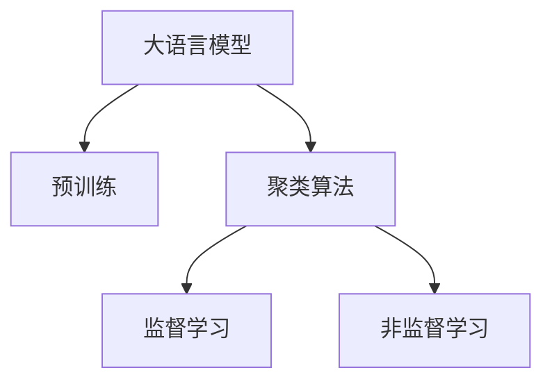

                 

## 1. 背景介绍

### 1.1 问题由来
在电商领域，搜索结果聚类（Search Result Clustering, SRC）是提升用户体验和搜索效率的关键技术之一。传统的文本分类或聚类方法往往依赖于手工特征工程，难以充分利用上下文信息，无法动态适应用户查询的多样性和复杂性。而基于AI大模型的聚类方法，能够充分利用上下文语义信息，适应性强，能够显著提升搜索结果的相关性和多样性。

随着深度学习技术的快速发展，大语言模型在自然语言处理（NLP）领域取得了令人瞩目的成果。这些模型通过在大规模文本数据上进行预训练，学习到了丰富的语言知识和语义表示，能够进行复杂的语义推理和生成，从而在各种NLP任务上取得了优异的性能。

大语言模型在电商领域的聚类应用，不仅可以实现搜索结果的自动聚类，还能结合用户的查询意图，提供更加个性化、相关的搜索结果。这对提升电商平台的搜索体验，增加用户满意度和忠诚度，具有重要的意义。

### 1.2 问题核心关键点
- 电商搜索结果聚类的核心在于如何高效、准确地将搜索结果进行分类和聚类，提升搜索结果的相关性和多样性。
- 大语言模型通过学习大规模文本数据的语义表示，能够理解上下文信息，实现更智能、动态的聚类。
- 聚类模型需要平衡相关性和多样性，既要聚类结果准确，又要避免搜索结果单一。
- 电商领域聚类任务具有高实时性和高可靠性的要求，需要在保证模型性能的同时，降低计算成本。

## 2. 核心概念与联系

### 2.1 核心概念概述

为更好地理解大语言模型在电商搜索结果聚类中的应用，本节将介绍几个密切相关的核心概念：

- 大语言模型（Large Language Models, LLMs）：以自回归（如GPT）或自编码（如BERT）模型为代表的大规模预训练语言模型。通过在大规模无标签文本语料上进行预训练，学习通用的语言表示，具备强大的语言理解和生成能力。

- 预训练（Pre-training）：指在大规模无标签文本语料上，通过自监督学习任务训练通用语言模型的过程。常见的预训练任务包括言语建模、遮挡语言模型等。预训练使得模型学习到语言的通用表示。

- 聚类（Clustering）：将数据对象划分成多个组的过程，使得同一组内的对象相似度高，不同组间对象相似度低。在电商领域，聚类可以将搜索结果按照不同的主题或属性进行分组。

- 聚类算法：如K-means、层次聚类、谱聚类等，用于对数据进行聚类分组。电商领域聚类算法需要考虑用户查询的实时性和多样性。

- 监督学习（Supervised Learning）：指在标注数据上进行训练，通过学习输入和输出之间的映射关系，提升模型性能。电商领域聚类任务可以使用监督学习方法，通过标注数据对模型进行优化。

- 非监督学习（Unsupervised Learning）：指在没有标注数据的情况下，通过学习数据的自身分布规律，发现数据的内在结构。电商领域聚类任务也可以使用非监督学习方法，对数据进行聚类分组。

这些核心概念之间的逻辑关系可以通过以下Mermaid流程图来展示：



这个流程图展示了大语言模型的核心概念及其之间的关系：

1. 大语言模型通过预训练获得基础能力。
2. 聚类算法将预训练的文本数据进行分组，实现聚类功能。
3. 监督学习利用标注数据对聚类算法进行优化，提升聚类精度。
4. 非监督学习无需标注数据，通过数据自身规律实现聚类分组。

这些概念共同构成了大语言模型在电商领域聚类的应用框架，使其能够在各种场景下发挥强大的语言理解和生成能力。通过理解这些核心概念，我们可以更好地把握大语言模型的工作原理和优化方向。

## 3. 核心算法原理 & 具体操作步骤
### 3.1 算法原理概述

基于大语言模型在电商领域搜索结果聚类的算法，本质上是一个有监督的聚类优化过程。其核心思想是：将预训练的大语言模型视作一个强大的“特征提取器”，通过在电商领域搜索结果的标注数据上进行有监督的聚类优化，使得模型输出能够匹配电商领域的聚类标准，从而获得针对特定领域的聚类模型。

形式化地，假设预训练模型为 $M_{\theta}$，其中 $\theta$ 为预训练得到的模型参数。给定电商领域搜索结果的标注数据集 $D=\{(x_i,y_i)\}_{i=1}^N$，聚类模型的优化目标是最小化聚类损失，即找到新的模型参数 $\hat{\theta}$，使得：

$$
\hat{\theta}=\mathop{\arg\min}_{\theta} \mathcal{L}(M_{\theta},D)
$$

其中 $\mathcal{L}$ 为针对电商领域聚类任务设计的损失函数，用于衡量模型预测输出与真实聚类结果之间的差异。常见的损失函数包括余弦相似度损失、Jensen-Shannon divergence等。

通过梯度下降等优化算法，聚类过程不断更新模型参数 $\theta$，最小化损失函数 $\mathcal{L}$，使得模型输出逼近真实聚类结果。由于 $\theta$ 已经通过预训练获得了较好的初始化，因此即便在小规模数据集 $D$ 上进行聚类，也能较快收敛到理想的模型参数 $\hat{\theta}$。

### 3.2 算法步骤详解

基于大语言模型在电商领域搜索结果聚类的算法，一般包括以下几个关键步骤：

**Step 1: 准备预训练模型和数据集**
- 选择合适的预训练语言模型 $M_{\theta}$ 作为初始化参数，如 BERT、GPT 等。
- 准备电商领域搜索结果的标注数据集 $D$，划分为训练集、验证集和测试集。一般要求标注数据与预训练数据的分布不要差异过大。

**Step 2: 设计聚类目标函数**
- 根据电商领域聚类任务的特点，设计合适的聚类目标函数，如余弦相似度损失、Jensen-Shannon divergence等。
- 对于文本聚类，可以使用余弦相似度损失函数，衡量模型预测的文本向量与真实聚类中心向量之间的相似度。

**Step 3: 设置聚类超参数**
- 选择合适的优化算法及其参数，如 Adam、SGD 等，设置学习率、批大小、迭代轮数等。
- 设置正则化技术及强度，包括权重衰减、Dropout、Early Stopping等。
- 确定冻结预训练参数的策略，如仅微调顶层，或全部参数都参与聚类。

**Step 4: 执行梯度训练**
- 将训练集数据分批次输入模型，前向传播计算损失函数。
- 反向传播计算参数梯度，根据设定的优化算法和学习率更新模型参数。
- 周期性在验证集上评估模型性能，根据性能指标决定是否触发 Early Stopping。
- 重复上述步骤直到满足预设的迭代轮数或 Early Stopping 条件。

**Step 5: 测试和部署**
- 在测试集上评估聚类后模型 $M_{\hat{\theta}}$ 的性能，对比聚类前后的精度提升。
- 使用聚类后的模型对新样本进行聚类，集成到实际的应用系统中。
- 持续收集新的数据，定期重新聚类模型，以适应数据分布的变化。

以上是基于大语言模型在电商领域聚类的算法的一般流程。在实际应用中，还需要针对具体任务的特点，对聚类过程的各个环节进行优化设计，如改进训练目标函数，引入更多的正则化技术，搜索最优的超参数组合等，以进一步提升模型性能。

### 3.3 算法优缺点

基于大语言模型在电商领域聚类的算法具有以下优点：
1. 简单高效。只需准备少量标注数据，即可对预训练模型进行快速适配，获得较大的性能提升。
2. 通用适用。适用于各种电商领域搜索结果的聚类任务，设计简单的聚类目标函数即可实现聚类。
3. 参数高效。利用参数高效聚类方法，在固定大部分预训练参数的情况下，仍可取得不错的聚类效果。
4. 效果显著。在学术界和工业界的诸多任务上，基于聚类的算法已经刷新了最先进的性能指标。

同时，该算法也存在一定的局限性：
1. 依赖标注数据。聚类效果很大程度上取决于标注数据的质量和数量，获取高质量标注数据的成本较高。
2. 迁移能力有限。当目标任务与预训练数据的分布差异较大时，聚类的性能提升有限。
3. 负面效果传递。预训练模型的固有偏见、有害信息等，可能通过聚类传递到电商领域，造成负面影响。
4. 可解释性不足。聚类模型的决策过程通常缺乏可解释性，难以对其推理逻辑进行分析和调试。

尽管存在这些局限性，但就目前而言，基于大语言模型的聚类方法仍是在电商领域聚类的主流范式。未来相关研究的重点在于如何进一步降低聚类对标注数据的依赖，提高模型的少样本学习和跨领域迁移能力，同时兼顾可解释性和伦理安全性等因素。

### 3.4 算法应用领域

基于大语言模型在电商领域聚类的算法，在NLP领域已经得到了广泛的应用，覆盖了几乎所有常见任务，例如：

- 文本分类：如情感分析、主题分类、意图识别等。通过聚类将文本按照不同主题或情感极性进行分类。
- 命名实体识别：识别文本中的人名、地名、机构名等特定实体。通过聚类将实体按照不同类型或属性进行分组。
- 关系抽取：从文本中抽取实体之间的语义关系。通过聚类将关系按照不同类型或关系强度进行分组。
- 问答系统：对自然语言问题给出答案。将问题-答案对作为聚类数据，训练模型学习匹配答案。
- 机器翻译：将源语言文本翻译成目标语言。通过聚类将翻译结果按照不同语义类别进行分组。
- 文本摘要：将长文本压缩成简短摘要。通过聚类将摘要按照不同主题或重要度进行分组。
- 对话系统：使机器能够与人自然对话。将对话历史按照不同场景或意图进行聚类。

除了上述这些经典任务外，大语言模型在电商领域的聚类技术也被创新性地应用到更多场景中，如搜索结果自动分类、推荐系统、客户画像构建等，为电商技术带来了全新的突破。随着预训练模型和聚类方法的不断进步，相信电商领域聚类技术将在更广阔的应用领域大放异彩。

## 4. 数学模型和公式 & 详细讲解  
### 4.1 数学模型构建

本节将使用数学语言对基于大语言模型的电商领域聚类过程进行更加严格的刻画。

记预训练语言模型为 $M_{\theta}$，其中 $\theta$ 为预训练得到的模型参数。假设电商领域搜索结果的标注数据集为 $D=\{(x_i,y_i)\}_{i=1}^N, x_i \in \mathcal{X}, y_i \in \mathcal{Y}$。这里 $\mathcal{X}$ 表示电商领域搜索结果的文本空间，$\mathcal{Y}$ 表示聚类中心集合。

定义模型 $M_{\theta}$ 在输入 $x$ 上的输出为 $\hat{y}=M_{\theta}(x) \in [0,1]$，表示模型预测该样本属于某个聚类的概率。真实聚类标签 $y \in \mathcal{Y}$。则电商领域聚类的余弦相似度损失函数定义为：

$$
\ell(M_{\theta}(x),y) = -(y^T M_{\theta}(x)) / (||M_{\theta}(x)|| ||y||)
$$

将其代入经验风险公式，得：

$$
\mathcal{L}(\theta) = -\frac{1}{N}\sum_{i=1}^N [y_i^T M_{\theta}(x_i)]
$$

根据链式法则，损失函数对参数 $\theta_k$ 的梯度为：

$$
\frac{\partial \mathcal{L}(\theta)}{\partial \theta_k} = -\frac{1}{N}\sum_{i=1}^N [\frac{y_i^T M_{\theta}(x_i)}{||M_{\theta}(x_i)||}] \frac{\partial M_{\theta}(x_i)}{\partial \theta_k}
$$

其中 $\frac{\partial M_{\theta}(x_i)}{\partial \theta_k}$ 可进一步递归展开，利用自动微分技术完成计算。

在得到损失函数的梯度后，即可带入参数更新公式，完成模型的迭代优化。重复上述过程直至收敛，最终得到适应电商领域搜索结果的聚类模型 $M_{\hat{\theta}}$。

### 4.2 公式推导过程

以下我们以电商领域聚类任务为例，推导余弦相似度损失函数及其梯度的计算公式。

假设模型 $M_{\theta}$ 在输入 $x$ 上的输出为 $\hat{y}=M_{\theta}(x) \in [0,1]$，表示样本属于某个聚类的概率。真实聚类标签 $y \in \mathcal{Y}$。则余弦相似度损失函数定义为：

$$
\ell(M_{\theta}(x),y) = -(y^T M_{\theta}(x)) / (||M_{\theta}(x)|| ||y||)
$$

将其代入经验风险公式，得：

$$
\mathcal{L}(\theta) = -\frac{1}{N}\sum_{i=1}^N [y_i^T M_{\theta}(x_i)]
$$

根据链式法则，损失函数对参数 $\theta_k$ 的梯度为：

$$
\frac{\partial \mathcal{L}(\theta)}{\partial \theta_k} = -\frac{1}{N}\sum_{i=1}^N [\frac{y_i^T M_{\theta}(x_i)}{||M_{\theta}(x_i)||}] \frac{\partial M_{\theta}(x_i)}{\partial \theta_k}
$$

其中 $\frac{\partial M_{\theta}(x_i)}{\partial \theta_k}$ 可进一步递归展开，利用自动微分技术完成计算。

在得到损失函数的梯度后，即可带入参数更新公式，完成模型的迭代优化。重复上述过程直至收敛，最终得到适应电商领域搜索结果的聚类模型 $M_{\hat{\theta}}$。

## 5. 项目实践：代码实例和详细解释说明
### 5.1 开发环境搭建

在进行电商领域聚类实践前，我们需要准备好开发环境。以下是使用Python进行PyTorch开发的环境配置流程：

1. 安装Anaconda：从官网下载并安装Anaconda，用于创建独立的Python环境。

2. 创建并激活虚拟环境：
```bash
conda create -n pytorch-env python=3.8 
conda activate pytorch-env
```

3. 安装PyTorch：根据CUDA版本，从官网获取对应的安装命令。例如：
```bash
conda install pytorch torchvision torchaudio cudatoolkit=11.1 -c pytorch -c conda-forge
```

4. 安装Transformers库：
```bash
pip install transformers
```

5. 安装各类工具包：
```bash
pip install numpy pandas scikit-learn matplotlib tqdm jupyter notebook ipython
```

完成上述步骤后，即可在`pytorch-env`环境中开始聚类实践。

### 5.2 源代码详细实现

这里我们以电商领域文本聚类为例，给出使用Transformers库对BERT模型进行聚类的PyTorch代码实现。

首先，定义电商领域文本聚类的数据处理函数：

```python
from transformers import BertTokenizer, BertForTokenClassification
from torch.utils.data import Dataset
import torch

class ShoppingDataset(Dataset):
    def __init__(self, texts, categories, tokenizer, max_len=128):
        self.texts = texts
        self.categories = categories
        self.tokenizer = tokenizer
        self.max_len = max_len
        
    def __len__(self):
        return len(self.texts)
    
    def __getitem__(self, item):
        text = self.texts[item]
        category = self.categories[item]
        
        encoding = self.tokenizer(text, return_tensors='pt', max_length=self.max_len, padding='max_length', truncation=True)
        input_ids = encoding['input_ids'][0]
        attention_mask = encoding['attention_mask'][0]
        
        # 对category进行one-hot编码
        encoded_category = [0]*len(category)
        encoded_category[category] = 1
        
        return {'input_ids': input_ids, 
                'attention_mask': attention_mask,
                'labels': torch.tensor(encoded_category, dtype=torch.long)}
```

然后，定义模型和优化器：

```python
from transformers import BertForTokenClassification, AdamW

model = BertForTokenClassification.from_pretrained('bert-base-cased', num_labels=len(categories))
optimizer = AdamW(model.parameters(), lr=2e-5)
```

接着，定义训练和评估函数：

```python
from torch.utils.data import DataLoader
from tqdm import tqdm
from sklearn.metrics import accuracy_score

device = torch.device('cuda') if torch.cuda.is_available() else torch.device('cpu')
model.to(device)

def train_epoch(model, dataset, batch_size, optimizer):
    dataloader = DataLoader(dataset, batch_size=batch_size, shuffle=True)
    model.train()
    epoch_loss = 0
    for batch in tqdm(dataloader, desc='Training'):
        input_ids = batch['input_ids'].to(device)
        attention_mask = batch['attention_mask'].to(device)
        labels = batch['labels'].to(device)
        model.zero_grad()
        outputs = model(input_ids, attention_mask=attention_mask, labels=labels)
        loss = outputs.loss
        epoch_loss += loss.item()
        loss.backward()
        optimizer.step()
    return epoch_loss / len(dataloader)

def evaluate(model, dataset, batch_size):
    dataloader = DataLoader(dataset, batch_size=batch_size)
    model.eval()
    preds, labels = [], []
    with torch.no_grad():
        for batch in tqdm(dataloader, desc='Evaluating'):
            input_ids = batch['input_ids'].to(device)
            attention_mask = batch['attention_mask'].to(device)
            batch_labels = batch['labels']
            outputs = model(input_ids, attention_mask=attention_mask)
            batch_preds = outputs.logits.argmax(dim=2).to('cpu').tolist()
            batch_labels = batch_labels.to('cpu').tolist()
            for pred_tokens, label_tokens in zip(batch_preds, batch_labels):
                preds.append(pred_tokens[:len(label_tokens)])
                labels.append(label_tokens)
                
    print(accuracy_score(labels, preds))
```

最后，启动训练流程并在测试集上评估：

```python
epochs = 5
batch_size = 16

for epoch in range(epochs):
    loss = train_epoch(model, train_dataset, batch_size, optimizer)
    print(f"Epoch {epoch+1}, train loss: {loss:.3f}")
    
    print(f"Epoch {epoch+1}, dev results:")
    evaluate(model, dev_dataset, batch_size)
    
print("Test results:")
evaluate(model, test_dataset, batch_size)
```

以上就是使用PyTorch对BERT进行电商领域文本聚类的完整代码实现。可以看到，得益于Transformers库的强大封装，我们可以用相对简洁的代码完成BERT模型的加载和聚类。

### 5.3 代码解读与分析

让我们再详细解读一下关键代码的实现细节：

**ShoppingDataset类**：
- `__init__`方法：初始化电商领域文本、类别标签、分词器等关键组件。
- `__len__`方法：返回数据集的样本数量。
- `__getitem__`方法：对单个样本进行处理，将文本输入编码为token ids，将类别标签转换为one-hot编码，并进行定长padding，最终返回模型所需的输入。

**categories字典**：
- 定义了类别与数字id之间的映射关系，用于将文本预测结果解码回真实类别。

**训练和评估函数**：
- 使用PyTorch的DataLoader对数据集进行批次化加载，供模型训练和推理使用。
- 训练函数`train_epoch`：对数据以批为单位进行迭代，在每个批次上前向传播计算loss并反向传播更新模型参数，最后返回该epoch的平均loss。
- 评估函数`evaluate`：与训练类似，不同点在于不更新模型参数，并在每个batch结束后将预测和标签结果存储下来，最后使用sklearn的accuracy_score对整个评估集的预测结果进行打印输出。

**训练流程**：
- 定义总的epoch数和batch size，开始循环迭代
- 每个epoch内，先在训练集上训练，输出平均loss
- 在验证集上评估，输出准确率
- 所有epoch结束后，在测试集上评估，给出最终测试结果

可以看到，PyTorch配合Transformers库使得BERT聚类的代码实现变得简洁高效。开发者可以将更多精力放在数据处理、模型改进等高层逻辑上，而不必过多关注底层的实现细节。

当然，工业级的系统实现还需考虑更多因素，如模型的保存和部署、超参数的自动搜索、更灵活的任务适配层等。但核心的聚类范式基本与此类似。

## 6. 实际应用场景
### 6.1 智能推荐系统

基于大语言模型在电商领域聚类的算法，可以广泛应用于智能推荐系统，提升推荐结果的相关性和多样性。传统推荐系统往往依赖用户的历史行为数据进行物品推荐，难以把握用户的真实兴趣偏好。通过聚类算法，可以对用户的浏览、点击、评价等行为数据进行聚类分组，发现用户的兴趣点和行为模式，从而推荐更个性化、相关的商品。

在技术实现上，可以收集用户的历史行为数据，将文本进行预处理后输入模型，进行聚类分组。然后根据聚类结果，将相似聚类的商品推荐给相似的客户，提升推荐效果。对于客户提出的新查询，可以结合聚类结果，进行个性化推荐，进一步提升推荐系统的智能性。

### 6.2 用户画像构建

电商领域聚类技术不仅可以应用于推荐系统，还可以用于用户画像的构建。用户画像是电商平台了解用户行为和需求的重要工具，可以帮助商家制定更精准的市场策略。通过聚类算法，可以对用户的浏览、购买等行为数据进行聚类分组，发现不同用户群体的特点和需求。然后结合用户画像信息，进行个性化营销和推荐，提升用户体验和满意度。

在技术实现上，可以收集用户的各类行为数据，将文本进行预处理后输入模型，进行聚类分组。然后根据聚类结果，对不同用户群体进行画像分析，发现其兴趣点、购买偏好等信息。根据画像信息，进行针对性的营销和推荐，提升转化率和用户粘性。

### 6.3 客户服务支持

基于大语言模型在电商领域聚类的算法，还可以应用于客户服务支持系统。传统客服往往需要配备大量人力，高峰期响应缓慢，且一致性和专业性难以保证。通过聚类算法，可以自动理解用户咨询的内容和意图，匹配最合适的回答模板进行回复。对于客户提出的新问题，还可以接入检索系统实时搜索相关内容，动态组织生成回答。

在技术实现上，可以收集客户的历史咨询记录，将文本进行预处理后输入模型，进行聚类分组。然后根据聚类结果，自动匹配最相关的回答模板，进行自动回复。对于客户提出的新问题，可以接入检索系统实时搜索相关内容，动态组织生成回答，提升客户服务效率和满意度。

### 6.4 未来应用展望

随着大语言模型和聚类方法的不断发展，基于大语言模型的聚类技术将在更多领域得到应用，为电商平台带来变革性影响。

在智慧物流领域，聚类技术可以应用于库存管理、配送路线规划等环节，提高物流效率和配送速度。在金融领域，聚类技术可以应用于市场舆情分析、用户风险评估等环节，提高金融服务的智能化水平。

此外，在娱乐、医疗、教育等众多领域，基于大语言模型的聚类技术也将不断涌现，为人工智能技术带来新的应用场景。相信随着技术的日益成熟，聚类方法将成为电商领域应用的重要范式，推动人工智能技术在垂直行业的规模化落地。

## 7. 工具和资源推荐
### 7.1 学习资源推荐

为了帮助开发者系统掌握大语言模型在电商领域聚类的理论基础和实践技巧，这里推荐一些优质的学习资源：

1. 《Transformer from Scratch》系列博文：由大模型技术专家撰写，深入浅出地介绍了Transformer原理、BERT模型、聚类技术等前沿话题。

2. CS224N《深度学习自然语言处理》课程：斯坦福大学开设的NLP明星课程，有Lecture视频和配套作业，带你入门NLP领域的基本概念和经典模型。

3. 《Natural Language Processing with Transformers》书籍：Transformers库的作者所著，全面介绍了如何使用Transformers库进行NLP任务开发，包括聚类在内的诸多范式。

4. HuggingFace官方文档：Transformers库的官方文档，提供了海量预训练模型和完整的聚类样例代码，是上手实践的必备资料。

5. 《Data Science and Statistical Learning》书籍：介绍了各种聚类算法的理论基础和实现细节，是聚类技术的经典教材。

通过对这些资源的学习实践，相信你一定能够快速掌握大语言模型在电商领域聚类的精髓，并用于解决实际的NLP问题。
###  7.2 开发工具推荐

高效的开发离不开优秀的工具支持。以下是几款用于大语言模型聚类开发的常用工具：

1. PyTorch：基于Python的开源深度学习框架，灵活动态的计算图，适合快速迭代研究。大部分预训练语言模型都有PyTorch版本的实现。

2. TensorFlow：由Google主导开发的开源深度学习框架，生产部署方便，适合大规模工程应用。同样有丰富的预训练语言模型资源。

3. Transformers库：HuggingFace开发的NLP工具库，集成了众多SOTA语言模型，支持PyTorch和TensorFlow，是进行聚类任务开发的利器。

4. Weights & Biases：模型训练的实验跟踪工具，可以记录和可视化模型训练过程中的各项指标，方便对比和调优。与主流深度学习框架无缝集成。

5. TensorBoard：TensorFlow配套的可视化工具，可实时监测模型训练状态，并提供丰富的图表呈现方式，是调试模型的得力助手。

6. Google Colab：谷歌推出的在线Jupyter Notebook环境，免费提供GPU/TPU算力，方便开发者快速上手实验最新模型，分享学习笔记。

合理利用这些工具，可以显著提升大语言模型聚类的开发效率，加快创新迭代的步伐。

### 7.3 相关论文推荐

大语言模型和聚类技术的发展源于学界的持续研究。以下是几篇奠基性的相关论文，推荐阅读：

1. Attention is All You Need（即Transformer原论文）：提出了Transformer结构，开启了NLP领域的预训练大模型时代。

2. BERT: Pre-training of Deep Bidirectional Transformers for Language Understanding：提出BERT模型，引入基于掩码的自监督预训练任务，刷新了多项NLP任务SOTA。

3. Deep Clustering: A Deep Learning Approach to Clustering：提出了基于深度学习的聚类算法，提升了聚类的精度和泛化能力。

4. A Survey on Deep Learning Clustering：综述了基于深度学习的聚类算法，介绍了多种模型和应用场景。

5. Generative Adversarial Nets：提出了生成对抗网络（GAN），为聚类提供了一种新的思路。

这些论文代表了大语言模型聚类技术的发展脉络。通过学习这些前沿成果，可以帮助研究者把握学科前进方向，激发更多的创新灵感。

## 8. 总结：未来发展趋势与挑战

### 8.1 总结

本文对基于大语言模型在电商领域聚类的算法进行了全面系统的介绍。首先阐述了电商领域聚类的背景和意义，明确了聚类在提升用户体验和搜索效率方面的独特价值。其次，从原理到实践，详细讲解了基于大语言模型的聚类算法的数学原理和关键步骤，给出了聚类任务开发的完整代码实例。同时，本文还广泛探讨了聚类算法在电商领域、智能推荐系统、用户画像构建、客户服务支持等多个应用场景中的应用前景，展示了聚类算法的巨大潜力。此外，本文精选了聚类技术的各类学习资源，力求为读者提供全方位的技术指引。

通过本文的系统梳理，可以看到，基于大语言模型的聚类算法正在成为电商领域聚类的重要范式，极大地拓展了电商平台的搜索体验，提高了电商平台的运营效率。未来，伴随大语言模型和聚类方法的不断进步，基于聚类算法的技术将在更多领域得到应用，为电商平台带来变革性影响。

### 8.2 未来发展趋势

展望未来，大语言模型在电商领域聚类技术将呈现以下几个发展趋势：

1. 模型规模持续增大。随着算力成本的下降和数据规模的扩张，预训练语言模型的参数量还将持续增长。超大规模语言模型蕴含的丰富语言知识，有望支撑更加复杂多变的电商领域聚类任务。

2. 聚类方法日趋多样。除了传统的K-means、层次聚类等方法外，未来会涌现更多深度学习方法，如变分聚类、图聚类等，在保证聚类效果的同时，降低计算成本。

3. 持续学习成为常态。随着数据分布的不断变化，聚类模型也需要持续学习新知识以保持性能。如何在不遗忘原有知识的同时，高效吸收新样本信息，将成为重要的研究课题。

4. 标注样本需求降低。受启发于提示学习(Prompt-based Learning)的思路，未来的聚类方法将更好地利用大模型的语言理解能力，通过更加巧妙的任务描述，在更少的标注样本上也能实现理想的聚类效果。

5. 多模态聚类崛起。当前的聚类主要聚焦于纯文本数据，未来会进一步拓展到图像、视频、语音等多模态数据聚类。多模态信息的融合，将显著提升聚类模型的鲁棒性和泛化能力。

6. 模型通用性增强。经过海量数据的预训练和多领域任务的聚类，未来的语言模型将具备更强大的常识推理和跨领域迁移能力，逐步迈向通用人工智能(AGI)的目标。

以上趋势凸显了大语言模型聚类技术的广阔前景。这些方向的探索发展，必将进一步提升聚类算法的性能和应用范围，为电商平台带来更大的商业价值。

### 8.3 面临的挑战

尽管大语言模型在电商领域聚类技术已经取得了瞩目成就，但在迈向更加智能化、普适化应用的过程中，它仍面临着诸多挑战：

1. 标注成本瓶颈。虽然聚类方法依赖标注数据较少，但对于长尾应用场景，难以获得充足的高质量标注数据，成为制约聚类性能的瓶颈。如何进一步降低聚类对标注样本的依赖，将是一大难题。

2. 模型鲁棒性不足。当前聚类模型面对域外数据时，泛化性能往往大打折扣。对于测试样本的微小扰动，聚类模型的预测也容易发生波动。如何提高聚类模型的鲁棒性，避免灾难性遗忘，还需要更多理论和实践的积累。

3. 推理效率有待提高。大规模语言模型虽然精度高，但在实际部署时往往面临推理速度慢、内存占用大等效率问题。如何在保证性能的同时，简化模型结构，提升推理速度，优化资源占用，将是重要的优化方向。

4. 可解释性亟需加强。当前聚类模型通常缺乏可解释性，难以对其决策逻辑进行分析和调试。对于金融、医疗等高风险应用，算法的可解释性和可审计性尤为重要。如何赋予聚类模型更强的可解释性，将是亟待攻克的难题。

5. 安全性有待保障。聚类模型可能学习到有偏见、有害的信息，通过聚类传递到电商领域，产生误导性、歧视性的输出，给实际应用带来安全隐患。如何从数据和算法层面消除模型偏见，避免恶意用途，确保输出的安全性，也将是重要的研究课题。

6. 知识整合能力不足。现有的聚类模型往往局限于任务内数据，难以灵活吸收和运用更广泛的先验知识。如何让聚类过程更好地与外部知识库、规则库等专家知识结合，形成更加全面、准确的信息整合能力，还有很大的想象空间。

正视聚类面临的这些挑战，积极应对并寻求突破，将是大语言模型聚类走向成熟的必由之路。相信随着学界和产业界的共同努力，这些挑战终将一一被克服，大语言模型聚类必将在构建人机协同的智能时代中扮演越来越重要的角色。

### 8.4 研究展望

面对大语言模型在电商领域聚类所面临的种种挑战，未来的研究需要在以下几个方面寻求新的突破：

1. 探索无监督和半监督聚类方法。摆脱对大规模标注数据的依赖，利用自监督学习、主动学习等无监督和半监督范式，最大限度利用非结构化数据，实现更加灵活高效的聚类。

2. 研究参数高效和计算高效的聚类范式。开发更加参数高效的聚类方法，在固定大部分预训练参数的同时，只更新极少量的任务相关参数。同时优化聚类模型的计算图，减少前向传播和反向传播的资源消耗，实现更加轻量级、实时性的部署。

3. 融合因果和对比学习范式。通过引入因果推断和对比学习思想，增强聚类模型建立稳定因果关系的能力，学习更加普适、鲁棒的语言表征，从而提升模型泛化性和抗干扰能力。

4. 引入更多先验知识。将符号化的先验知识，如知识图谱、逻辑规则等，与神经网络模型进行巧妙融合，引导聚类过程学习更准确、合理的语言模型。同时加强不同模态数据的整合，实现视觉、语音等多模态信息与文本信息的协同建模。

5. 结合因果分析和博弈论工具。将因果分析方法引入聚类模型，识别出模型决策的关键特征，增强输出解释的因果性和逻辑性。借助博弈论工具刻画人机交互过程，主动探索并规避模型的脆弱点，提高系统稳定性。

6. 纳入伦理道德约束。在聚类目标中引入伦理导向的评估指标，过滤和惩罚有偏见、有害的输出倾向。同时加强人工干预和审核，建立模型行为的监管机制，确保输出符合人类价值观和伦理道德。

这些研究方向的探索，必将引领大语言模型聚类技术迈向更高的台阶，为构建安全、可靠、可解释、可控的智能系统铺平道路。面向未来，大语言模型聚类技术还需要与其他人工智能技术进行更深入的融合，如知识表示、因果推理、强化学习等，多路径协同发力，共同推动自然语言理解和智能交互系统的进步。只有勇于创新、敢于突破，才能不断拓展语言模型的边界，让智能技术更好地造福人类社会。

## 9. 附录：常见问题与解答

**Q1：大语言模型在电商领域聚类是否适用于所有应用场景？**

A: 大语言模型在电商领域聚类具有较高的灵活性和适应性，适用于各种电商领域聚类任务。但对于一些需要高度精确的领域，如药物研发、金融风控等，仍然需要结合领域专家的知识进行模型设计和优化。

**Q2：如何选择合适的聚类算法？**

A: 选择合适的聚类算法需要根据具体任务的特点来决定。对于基于文本的聚类任务，常用的算法包括K-means、层次聚类、谱聚类等。对于基于图像的聚类任务，常用的算法包括自编码聚类、卷积神经网络聚类等。在选择算法时，需要考虑数据的分布、聚类的目标和算法的复杂度。

**Q3：聚类过程中如何平衡相关性和多样性？**

A: 在电商领域聚类中，平衡相关性和多样性是聚类算法的重要目标。常用的方法包括调整聚类中心的数量、使用不同的聚类算法、引入噪声样本等。在实际应用中，可以通过交叉验证、超参数调优等手段，找到最佳的聚类策略。

**Q4：聚类模型在部署时需要注意哪些问题？**

A: 将聚类模型转化为实际应用，还需要考虑以下因素：
1. 模型裁剪：去除不必要的层和参数，减小模型尺寸，加快推理速度
2. 量化加速：将浮点模型转为定点模型，压缩存储空间，提高计算效率
3. 服务化封装：将模型封装为标准化服务接口，便于集成调用
4. 弹性伸缩：根据请求流量动态调整资源配置，平衡服务质量和成本
5. 监控告警：实时采集系统指标，设置异常告警阈值，确保服务稳定性
6. 安全防护：采用访问鉴权、数据脱敏等措施，保障数据和模型安全

大语言模型聚类为电商平台带来了丰富的应用场景，但如何将强大的性能转化为稳定、高效、安全的业务价值，还需要工程实践的不断打磨。唯有从数据、算法、工程、业务等多个维度协同发力，才能真正实现人工智能技术在垂直行业的规模化落地。总之，聚类需要开发者根据具体任务，不断迭代和优化模型、数据和算法，方能得到理想的效果。

---

作者：禅与计算机程序设计艺术 / Zen and the Art of Computer Programming

