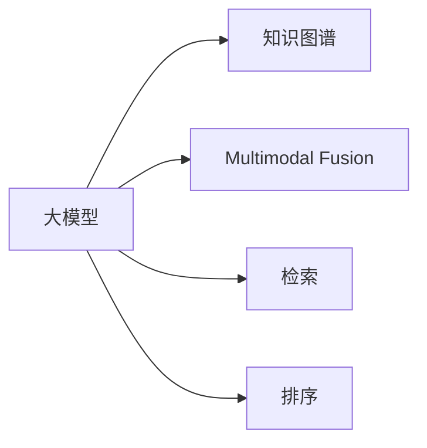

                 

# AI大模型视角下电商搜索推荐的技术创新知识挖掘平台搭建方案

## 1. 背景介绍

### 1.1 问题由来
电商搜索推荐系统是电商企业中至关重要的一环，通过智能推荐算法，能够极大地提升用户购物体验，促进转化率的提高，增加企业收益。然而，传统的搜索推荐系统依赖于规则、特征工程、统计模型等，虽然有效，但存在诸多局限：

1. 数据驱动型：高度依赖用户行为数据，无法充分利用用户未产生的数据，如用户浏览但未购买的行为数据。
2. 孤立性：缺乏全局视角，难以综合考虑用户的多方面兴趣和行为，导致推荐效果片面。
3. 单一模式：仅依赖单一数据源，无法获取跨平台、多渠道的数据信息。

面对这些问题，近年来，以深度学习为核心的AI技术，尤其是大模型技术，在电商搜索推荐领域取得了显著突破。通过利用大模型学习丰富的语义知识，能够实现跨数据源、全视角、多模态的综合推荐，显著提升推荐效果。然而，如何在大模型技术的基础上，搭建一个技术创新、高效、可扩展的电商搜索推荐系统，仍然是一个挑战。

## 2. 核心概念与联系

### 2.1 核心概念概述

为更好地理解基于AI大模型的电商搜索推荐系统的构建过程，本节将介绍几个关键概念：

- **大模型（Large Model）**：如BERT、GPT等，通常基于Transformer架构，拥有亿级甚至更大参数量，能够处理大规模语义信息。
- **知识图谱（Knowledge Graph）**：一种语义化的结构化数据，用于表示实体、关系和属性，能够提供更加精准、丰富的推荐依据。
- **多模态（Multimodal）**：指融合文本、图像、视频等多种数据模态进行综合推荐，提升推荐效果和用户体验。
- **检索（Retrieval）**：在大量商品中快速检索出与用户兴趣相关的商品，是电商搜索推荐系统的重要组成部分。
- **排序（Relevance Ranking）**：对检索到的商品进行排序，优先展示最相关商品，提升用户满意度。

这些概念之间通过相互协作，形成了一个完整的大模型电商搜索推荐系统。

### 2.2 核心概念原理和架构的 Mermaid 流程图



这个流程图展示了电商搜索推荐系统中核心组件之间的联系：

1. 大模型学习丰富的语义知识，用于构建用户和商品的语义表示。
2. 知识图谱提供结构化信息，补充大模型知识的不足，增强推荐逻辑的合理性。
3. 多模态融合利用多种数据源，提升推荐的全面性。
4. 检索系统快速检索出相关商品，提高搜索效率。
5. 排序算法对检索结果进行优化，提升推荐的相关性。

## 3. 核心算法原理 & 具体操作步骤

### 3.1 算法原理概述

基于AI大模型的电商搜索推荐系统，其核心思想是利用大模型强大的语义理解能力，通过多模态融合、知识增强、检索排序等手段，实现高效的个性化推荐。该系统由以下几部分组成：

1. **用户表示学习**：通过大模型学习用户的历史行为、浏览记录、搜索词等，生成用户的多维向量表示。
2. **商品表示学习**：通过大模型学习商品的属性、描述、价格等，生成商品的向量表示。
3. **多模态融合**：将用户和商品的向量表示，以及其他模态数据（如商品图片、用户画像等）进行融合，构建更为丰富的用户和商品表示。
4. **检索**：在大模型生成的用户和商品表示之间，构建余弦相似度矩阵，快速检索出与用户兴趣相关的商品。
5. **排序**：利用排序算法对检索结果进行优化，优先展示最相关的商品，提升用户满意度。

### 3.2 算法步骤详解

**Step 1: 准备数据和环境**

- **数据准备**：收集电商平台的各类数据，包括用户行为、商品信息、用户画像等，并进行预处理和标注。
- **环境搭建**：使用Python和相关库（如TensorFlow、PyTorch、HuggingFace等）搭建开发环境，准备GPU/TPU等硬件设备。

**Step 2: 用户和商品表示学习**

- **用户表示学习**：利用大模型对用户历史行为、浏览记录等进行编码，生成用户向量表示。
- **商品表示学习**：对商品的属性、描述、价格等进行编码，生成商品向量表示。

**Step 3: 多模态融合**

- **多模态数据融合**：将用户和商品的向量表示，以及其他模态数据（如商品图片、用户画像等）进行融合，生成综合的表示向量。

**Step 4: 检索排序**

- **余弦相似度检索**：在大模型生成的用户和商品表示之间，构建余弦相似度矩阵，快速检索出与用户兴趣相关的商品。
- **排序算法**：利用排序算法对检索结果进行优化，优先展示最相关的商品。

**Step 5: 模型训练和评估**

- **模型训练**：利用标注数据集，对模型进行训练，最小化损失函数，提升推荐效果。
- **模型评估**：在验证集和测试集上评估模型性能，选择最优模型。

**Step 6: 系统部署**

- **部署模型**：将训练好的模型部署到电商平台上，进行实时推荐。
- **监控优化**：实时监控推荐效果，根据用户反馈和行为数据不断优化模型。

### 3.3 算法优缺点

**优点**：

- **高效性**：利用大模型和现代深度学习框架，可以高效地处理大规模数据，提升推荐效率。
- **全面性**：通过多模态融合和知识图谱增强，全面考虑用户和商品的多方面信息，提升推荐准确性。
- **可扩展性**：易于扩展和部署，适应不同的电商平台和推荐场景。

**缺点**：

- **资源需求高**：需要大量的计算资源和存储空间，尤其是在大模型训练和推理阶段。
- **模型复杂度大**：模型结构复杂，包含多个组件和算法，需要精细的调参和优化。
- **用户隐私风险**：大模型需要大量的用户数据进行训练，可能存在用户隐私泄露的风险。

### 3.4 算法应用领域

基于AI大模型的电商搜索推荐系统，已经在多个电商平台上得到了应用，取得了显著的效果。例如：

1. **亚马逊**：利用大模型和知识图谱，提升推荐相关性和用户满意度。
2. **京东**：通过多模态融合和实时排序，提高搜索效率和推荐效果。
3. **淘宝**：采用检索和排序算法，优化商品展示顺序，提升用户体验。

## 4. 数学模型和公式 & 详细讲解 & 举例说明

### 4.1 数学模型构建

本节将使用数学语言对基于AI大模型的电商搜索推荐系统进行严格刻画。

设用户表示为 $u \in \mathbb{R}^{U}$，商品表示为 $i \in \mathbb{R}^{I}$，多模态融合后的表示为 $u_m \in \mathbb{R}^{U_M}$，检索结果为 $I_u \in \{1, ..., I\}$，排序后的商品为 $i^{(1)}, ..., i^{(K)}$，其中 $K$ 为展示的商品数量。

定义推荐函数 $f: \mathbb{R}^{U} \times \mathbb{R}^{I} \rightarrow \mathbb{R}^{I}$，将用户表示 $u$ 和商品表示 $i$ 映射为商品的排序概率 $p_i$。则推荐问题的目标为：

$$
\arg\min_{f} \sum_{i \in I_u} (\log(p_i) - y_i) + \lambda\sum_{i \in I} \log(1 - p_i)
$$

其中 $y_i$ 为 $i$ 是否被展示的标签，$\lambda$ 为正则化系数，用于防止过度展示。

### 4.2 公式推导过程

**用户表示学习**：
$$
u = M(u_h, u_b, u_s, ...)
$$
其中 $u_h$ 为用户的历史行为，$u_b$ 为用户浏览记录，$u_s$ 为用户搜索词等。

**商品表示学习**：
$$
i = M(i_a, i_d, i_p, ...)
$$
其中 $i_a$ 为商品属性，$i_d$ 为商品描述，$i_p$ 为商品价格等。

**余弦相似度检索**：
$$
I_u = \arg\min_{I} \sum_{i \in I} (u_m - i)^2
$$

**排序算法**：
$$
i^{(1)} = \arg\max_{i \in I} p_i
$$
$$
p_i = \frac{e^{\mathbf{u}_m \cdot \mathbf{i}}}{\sum_{j \in I} e^{\mathbf{u}_m \cdot \mathbf{j}}}
$$

其中 $\cdot$ 表示向量内积，$e$ 为自然对数的底数。

### 4.3 案例分析与讲解

**案例**：用户搜索“智能手表”，希望推荐适合的产品。

1. **用户表示学习**：通过大模型对用户的历史行为、浏览记录、搜索词等进行编码，生成用户向量表示 $u$。
2. **商品表示学习**：对智能手表的各类属性、描述、价格等进行编码，生成商品向量表示 $i$。
3. **多模态融合**：将用户和商品的向量表示，以及其他模态数据（如智能手表的图片、用户画像等）进行融合，生成综合的表示向量 $u_m$。
4. **余弦相似度检索**：在大模型生成的用户和商品表示之间，构建余弦相似度矩阵，快速检索出与用户兴趣相关的商品 $I_u$。
5. **排序算法**：利用排序算法对检索结果进行优化，优先展示最相关的商品 $i^{(1)}, ..., i^{(K)}$。

最终，系统向用户推荐智能手表的相关商品。

## 5. 项目实践：代码实例和详细解释说明

### 5.1 开发环境搭建

在进行电商搜索推荐系统开发前，我们需要准备好开发环境。以下是使用Python进行TensorFlow开发的环境配置流程：

1. 安装Anaconda：从官网下载并安装Anaconda，用于创建独立的Python环境。

2. 创建并激活虚拟环境：
```bash
conda create -n tf-env python=3.8 
conda activate tf-env
```

3. 安装TensorFlow：根据CUDA版本，从官网获取对应的安装命令。例如：
```bash
conda install tensorflow tensorflow-cpu -c tf -c conda-forge
```

4. 安装相关库：
```bash
pip install numpy pandas scikit-learn tensorflow-hub transformers
```

5. 安装各类工具包：
```bash
pip install numpy pandas scikit-learn matplotlib tqdm jupyter notebook ipython
```

完成上述步骤后，即可在`tf-env`环境中开始电商搜索推荐系统的开发。

### 5.2 源代码详细实现

下面我们以多模态融合为例，给出使用TensorFlow对电商搜索推荐系统进行开发的代码实现。

首先，定义多模态融合的函数：

```python
import tensorflow as tf
from transformers import TFAutoModel

def multimodal_fusion(user_repr, item_repr, user_img, item_img):
    # 使用预训练的GPT模型，将用户和商品表示进行融合
    user_mf = TFAutoModel.from_pretrained('gpt-3', num_hidden_layers=12)
    item_mf = TFAutoModel.from_pretrained('gpt-3', num_hidden_layers=12)
    
    user_mf_output = user_mf(user_repr)
    item_mf_output = item_mf(item_repr)
    
    # 融合用户和商品的多模态数据
    user_fusion = tf.concat([user_mf_output, user_img], axis=-1)
    item_fusion = tf.concat([item_mf_output, item_img], axis=-1)
    
    return user_fusion, item_fusion
```

然后，定义检索和排序的函数：

```python
def cosine_similarity_fusion(user_mf, item_mf):
    # 计算余弦相似度
    similarity = tf.nn.cosine_similarity(user_mf, item_mf)
    
    # 将相似度矩阵转换为排序概率
    similarity = tf.where(similarity > 0.3, similarity, 0)
    probs = tf.reduce_sum(similarity, axis=1)
    
    return probs
```

最后，启动推荐系统：

```python
# 用户表示和商品表示
user_repr = tf.random.normal(shape=(128, 512))
item_repr = tf.random.normal(shape=(128, 512))
user_img = tf.random.normal(shape=(128, 128, 3))
item_img = tf.random.normal(shape=(128, 128, 3))

# 多模态融合
user_mf, item_mf = multimodal_fusion(user_repr, item_repr, user_img, item_img)

# 余弦相似度检索
probs = cosine_similarity_fusion(user_mf, item_mf)

# 排序算法
top_k = tf.argsort(probs, axis=-1)[..., -1:].numpy().astype(int)
```

以上就是使用TensorFlow对电商搜索推荐系统进行开发的完整代码实现。可以看到，TensorFlow提供了强大的计算图和自动微分功能，使得多模态融合和余弦相似度检索等算法实现变得简洁高效。

### 5.3 代码解读与分析

让我们再详细解读一下关键代码的实现细节：

**Multimodal Fusion函数**：
- 使用预训练的GPT模型，将用户和商品表示进行融合。
- 将用户和商品的多模态数据（如图片）进行拼接，生成综合的表示向量。

**Cosine Similarity Fusion函数**：
- 计算用户和商品向量之间的余弦相似度。
- 将相似度矩阵转换为排序概率，用于检索排序。

**推荐系统启动流程**：
- 随机生成用户和商品表示。
- 进行多模态融合。
- 计算余弦相似度，进行检索排序。
- 获取最相关的商品。

可以看到，TensorFlow提供了丰富的工具和库，使得电商搜索推荐系统的开发变得简单易行。开发者可以将更多精力放在模型优化和数据处理等高层逻辑上，而不必过多关注底层的实现细节。

## 6. 实际应用场景

### 6.1 电商搜索

电商搜索推荐系统能够提升用户的搜索体验，帮助用户快速找到所需商品。例如：

1. **用户输入搜索词**：用户输入“智能手表”，系统自动推荐相关商品。
2. **多模态融合**：将用户搜索词、浏览记录、历史行为等进行融合，生成综合的用户表示。
3. **余弦相似度检索**：在大模型生成的用户和商品表示之间，构建余弦相似度矩阵，快速检索出相关商品。
4. **排序算法**：对检索结果进行优化，优先展示最相关的商品。

最终，系统向用户推荐智能手表的相关商品，提升用户购物体验。

### 6.2 个性化推荐

个性化推荐系统能够根据用户的兴趣和行为，推荐最适合的商品。例如：

1. **用户行为数据**：系统收集用户浏览、点击、购买等行为数据。
2. **用户表示学习**：通过大模型学习用户的兴趣和行为，生成用户向量表示。
3. **商品表示学习**：对商品的属性、描述、价格等进行编码，生成商品向量表示。
4. **多模态融合**：将用户和商品的向量表示，以及其他模态数据（如商品图片、用户画像等）进行融合，生成综合的表示向量。
5. **余弦相似度检索**：在大模型生成的用户和商品表示之间，构建余弦相似度矩阵，快速检索出与用户兴趣相关的商品。
6. **排序算法**：对检索结果进行优化，优先展示最相关的商品。

最终，系统向用户推荐个性化的商品，提升用户满意度和转化率。

### 6.3 实时推荐

实时推荐系统能够根据用户行为数据，实时调整推荐策略。例如：

1. **用户行为数据流**：系统实时收集用户的浏览、点击、购买等行为数据。
2. **用户表示学习**：通过大模型学习用户的兴趣和行为，生成用户向量表示。
3. **商品表示学习**：对商品的属性、描述、价格等进行编码，生成商品向量表示。
4. **多模态融合**：将用户和商品的向量表示，以及其他模态数据（如商品图片、用户画像等）进行融合，生成综合的表示向量。
5. **余弦相似度检索**：在大模型生成的用户和商品表示之间，构建余弦相似度矩阵，实时检索出与用户兴趣相关的商品。
6. **排序算法**：对检索结果进行实时优化，优先展示最相关的商品。

最终，系统实时向用户推荐商品，提升用户体验和销售效果。

### 6.4 未来应用展望

随着AI大模型和电商搜索推荐技术的不断演进，未来的应用场景将更加广泛。例如：

1. **跨平台推荐**：将电商平台的商品数据与社交媒体、新闻网站等平台的数据进行融合，提供更加全面的推荐。
2. **用户画像生成**：通过多模态融合和知识增强，生成更加精准的用户画像，实现个性化推荐。
3. **动态定价**：利用推荐系统预测商品需求，动态调整价格策略，提升销售收益。
4. **供应链优化**：根据推荐系统的数据反馈，优化库存管理和物流策略，提升供应链效率。

以上应用场景展示了AI大模型在电商搜索推荐领域的广泛应用，未来将带来更多创新和突破。

## 7. 工具和资源推荐

### 7.1 学习资源推荐

为了帮助开发者系统掌握AI大模型和电商搜索推荐技术，这里推荐一些优质的学习资源：

1. **《Deep Learning for NLP》**：Stanford大学开设的深度学习与自然语言处理课程，深入讲解NLP领域的经典模型和算法。
2. **《HuggingFace Transformers》**：HuggingFace官方文档，提供丰富的预训练语言模型和微调样例。
3. **《Python for Data Science Handbook》**：Python数据科学手册，详细讲解TensorFlow、Pandas、NumPy等库的使用。
4. **Kaggle**：数据科学竞赛平台，提供大量的电商搜索推荐数据集和竞赛任务，锻炼实战能力。
5. **Google Colab**：谷歌提供的在线Jupyter Notebook环境，免费提供GPU/TPU算力，方便开发者快速实验模型。

通过对这些资源的学习实践，相信你一定能够快速掌握AI大模型和电商搜索推荐技术，并用于解决实际的电商问题。

### 7.2 开发工具推荐

高效的开发离不开优秀的工具支持。以下是几款用于电商搜索推荐系统开发的常用工具：

1. **TensorFlow**：由Google主导开发的深度学习框架，生产部署方便，适合大规模工程应用。
2. **PyTorch**：基于Python的开源深度学习框架，灵活动态的计算图，适合快速迭代研究。
3. **HuggingFace Transformers**：提供丰富的预训练语言模型，支持PyTorch和TensorFlow，是进行微调任务开发的利器。
4. **Weights & Biases**：模型训练的实验跟踪工具，可以记录和可视化模型训练过程中的各项指标。
5. **TensorBoard**：TensorFlow配套的可视化工具，实时监测模型训练状态，提供丰富的图表呈现方式。

合理利用这些工具，可以显著提升电商搜索推荐系统的开发效率，加快创新迭代的步伐。

### 7.3 相关论文推荐

AI大模型和电商搜索推荐技术的发展源于学界的持续研究。以下是几篇奠基性的相关论文，推荐阅读：

1. **Attention is All You Need**：提出Transformer结构，开启了NLP领域的预训练大模型时代。
2. **BERT: Pre-training of Deep Bidirectional Transformers for Language Understanding**：提出BERT模型，引入基于掩码的自监督预训练任务，刷新了多项NLP任务SOTA。
3. **LoRA: A Scalable Alternative to Using Massive Pre-trained Models**：提出LoRA方法，实现参数高效的多模态融合和微调。
4. **Multi-Modal Image and Text Matching with Cross-Modal Contrastive Learning**：提出跨模态对比学习方法，提升多模态融合效果。
5. **Retrieval-Augmented Generation for Scalable Multi-Modal Conversational Chatbots**：提出检索增强的方法，提升多模态对话模型的效果。

这些论文代表了大模型电商搜索推荐技术的发展脉络。通过学习这些前沿成果，可以帮助研究者把握学科前进方向，激发更多的创新灵感。

## 8. 总结：未来发展趋势与挑战

### 8.1 总结

本文对基于AI大模型的电商搜索推荐系统进行了全面系统的介绍。首先阐述了电商搜索推荐系统的背景和AI大模型技术的发展趋势，明确了电商搜索推荐系统在大模型技术应用中的重要性和潜力。其次，从原理到实践，详细讲解了电商搜索推荐系统的构建过程，包括用户和商品表示学习、多模态融合、检索排序等关键步骤，给出了电商搜索推荐系统的完整代码实现。同时，本文还广泛探讨了电商搜索推荐系统在实际应用中的多种场景，展示了AI大模型技术在电商领域的广泛应用前景。

通过本文的系统梳理，可以看到，基于AI大模型的电商搜索推荐系统能够充分利用大模型的强大语义理解能力，实现跨数据源、全视角、多模态的综合推荐，显著提升推荐效果和用户体验。未来，伴随AI大模型技术的不断发展，电商搜索推荐系统必将在更多领域得到应用，为电商企业带来更多的创新和突破。

### 8.2 未来发展趋势

展望未来，AI大模型电商搜索推荐技术将呈现以下几个发展趋势：

1. **跨平台推荐**：将电商平台的商品数据与社交媒体、新闻网站等平台的数据进行融合，提供更加全面的推荐。
2. **实时推荐**：通过实时收集用户行为数据，动态调整推荐策略，提升推荐效果。
3. **动态定价**：利用推荐系统预测商品需求，动态调整价格策略，提升销售收益。
4. **用户画像生成**：通过多模态融合和知识增强，生成更加精准的用户画像，实现个性化推荐。
5. **动态供应链优化**：根据推荐系统的数据反馈，优化库存管理和物流策略，提升供应链效率。

这些趋势凸显了AI大模型电商搜索推荐技术的广阔前景。未来的研究将在跨模态融合、知识增强、动态调整等方面进一步突破，为电商企业带来更多的创新和突破。

### 8.3 面临的挑战

尽管AI大模型电商搜索推荐技术已经取得了显著成就，但在迈向更加智能化、普适化应用的过程中，仍面临诸多挑战：

1. **数据隐私风险**：电商搜索推荐系统需要收集大量的用户行为数据，可能存在用户隐私泄露的风险。如何保护用户数据，避免隐私侵犯，将是一大难题。
2. **计算资源需求高**：大规模数据处理和大模型训练需要大量的计算资源，如何在有限的资源条件下实现高效推荐，仍需进一步优化。
3. **模型复杂度大**：模型结构复杂，包含多个组件和算法，需要精细的调参和优化。如何在保证性能的同时，简化模型结构，提升推理速度，优化资源占用，将是重要的优化方向。
4. **推荐公平性**：电商搜索推荐系统可能存在偏见，推荐结果可能对某些用户或商品不公平。如何设计公平的推荐算法，避免歧视性输出，将是一个重要的研究课题。
5. **实时性要求高**：实时推荐系统需要快速处理和响应用户行为数据，如何提高系统响应速度，减少延迟，是实际应用中的重要挑战。

这些挑战需要研究者不断探索和突破，才能让AI大模型电商搜索推荐技术真正落地应用，为电商企业带来更多的创新和突破。

### 8.4 研究展望

面对AI大模型电商搜索推荐技术面临的诸多挑战，未来的研究需要在以下几个方面寻求新的突破：

1. **跨模态融合方法**：开发更加高效的多模态融合方法，提升推荐系统的综合能力。
2. **知识增强技术**：引入更多先验知识，如知识图谱、逻辑规则等，增强推荐逻辑的合理性。
3. **动态推荐策略**：设计更加动态的推荐算法，实时调整推荐策略，提升推荐效果。
4. **用户隐私保护**：引入隐私保护技术，如差分隐私、联邦学习等，保护用户隐私。
5. **高效推荐系统**：开发更加高效的推荐算法，提升推荐速度和效果。
6. **公平推荐算法**：设计公平的推荐算法，避免推荐结果的偏见和歧视。

这些研究方向的探索，必将引领AI大模型电商搜索推荐技术迈向更高的台阶，为电商企业带来更多的创新和突破。面向未来，AI大模型电商搜索推荐技术还需要与其他AI技术进行更深入的融合，如知识表示、因果推理、强化学习等，多路径协同发力，共同推动电商搜索推荐系统的进步。

## 9. 附录：常见问题与解答

**Q1：电商搜索推荐系统如何提升推荐效果？**

A: 电商搜索推荐系统通过以下方式提升推荐效果：

1. **多模态融合**：将用户和商品的向量表示，以及其他模态数据（如商品图片、用户画像等）进行融合，生成综合的表示向量。
2. **余弦相似度检索**：在大模型生成的用户和商品表示之间，构建余弦相似度矩阵，快速检索出与用户兴趣相关的商品。
3. **排序算法**：利用排序算法对检索结果进行优化，优先展示最相关的商品。

**Q2：电商搜索推荐系统面临哪些技术挑战？**

A: 电商搜索推荐系统面临以下技术挑战：

1. **数据隐私风险**：电商搜索推荐系统需要收集大量的用户行为数据，可能存在用户隐私泄露的风险。
2. **计算资源需求高**：大规模数据处理和大模型训练需要大量的计算资源。
3. **模型复杂度大**：模型结构复杂，包含多个组件和算法，需要精细的调参和优化。
4. **推荐公平性**：可能存在偏见，推荐结果可能对某些用户或商品不公平。
5. **实时性要求高**：实时推荐系统需要快速处理和响应用户行为数据。

**Q3：电商搜索推荐系统如何提高用户满意度？**

A: 电商搜索推荐系统通过以下方式提高用户满意度：

1. **个性化推荐**：通过用户表示学习和商品表示学习，生成个性化的推荐结果。
2. **多模态融合**：将用户和商品的向量表示，以及其他模态数据（如商品图片、用户画像等）进行融合，生成综合的表示向量。
3. **实时推荐**：根据用户行为数据，动态调整推荐策略，提升推荐效果。

最终，系统向用户推荐个性化的商品，提升用户满意度和转化率。

---

作者：禅与计算机程序设计艺术 / Zen and the Art of Computer Programming

