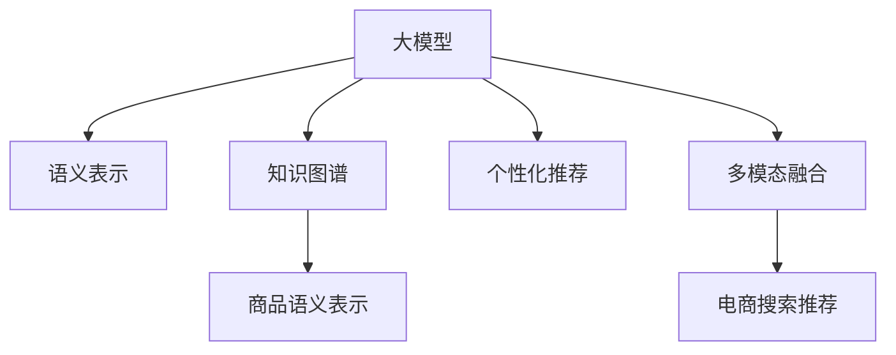

                 

# AI大模型视角下电商搜索推荐的技术创新知识沉淀机制优化与应用实践

> 关键词：电商搜索推荐,大模型视角,知识沉淀机制,技术创新,应用实践

## 1. 背景介绍

### 1.1 问题由来
随着电商平台的快速发展，用户对商品搜索与推荐的需求日益增加。如何为用户提供精准、快速的商品搜索和个性化推荐，成为电商平台的核心竞争力之一。传统的基于规则、关键词匹配的搜索推荐算法，已难以满足复杂多变的用户需求，无法充分利用数据中的深度语义信息，导致推荐效果和用户体验不够理想。

近年来，基于大模型的搜索推荐技术逐渐兴起，充分利用深度学习和自然语言处理（NLP）的强大能力，通过构建通用的语义表示模型，对用户查询进行多模态理解，将商品信息进行精细化的语义标注，从而提升搜索推荐的效果。

### 1.2 问题核心关键点
大模型在电商搜索推荐中的应用，核心在于如何高效构建和优化知识沉淀机制，即如何将电商平台的商品信息、用户行为数据、交易记录等海量数据转化为大模型的深度语义表示，并通过这些表示实现精准的搜索推荐。

具体包括以下几个关键问题：
- 如何高效构建电商平台的商品语义表示？
- 如何高效整合用户行为数据，指导个性化推荐？
- 如何在多模态数据中寻找共性，实现深度语义理解？
- 如何提升搜索推荐的效果，优化用户体验？

本文将从大模型视角出发，深入分析电商搜索推荐中的知识沉淀机制，介绍如何构建高效的语义表示和优化推荐算法，并通过实例展示技术创新在电商搜索推荐中的应用实践。

## 2. 核心概念与联系

### 2.1 核心概念概述

为更好地理解基于大模型的电商搜索推荐技术，本节将介绍几个密切相关的核心概念：

- 大模型：以Transformer为代表的深度学习模型，通过在大规模语料上进行预训练，学习到丰富的语义表示。在电商搜索推荐中，大模型可以处理复杂多变的用户查询，提取商品信息的深度语义特征。

- 语义表示：大模型生成的，能够刻画词语之间关系的语义表示，用于构建搜索推荐中的多模态表示。

- 知识图谱：将商品信息、用户行为等数据构建为知识图谱，通过图神经网络（GNN）等方法，在大模型中进行多模态融合，提取高层次的语义表示。

- 商品语义表示：对电商商品信息进行语义标注，构建基于大模型的商品语义表示，用于商品搜索与推荐。

- 个性化推荐：基于用户行为数据，使用大模型进行个性化推荐，提高用户的满意度和黏性。

- 多模态融合：将文本、图像、视频等多模态数据，在大模型中融合，提升搜索推荐的效果。

- 电商搜索推荐：通过构建搜索与推荐系统，根据用户查询和大模型生成的语义表示，为用户推荐商品，提升购物体验。

这些核心概念之间的逻辑关系可以通过以下Mermaid流程图来展示：



这个流程图展示了大模型在电商搜索推荐中的核心概念及其之间的关系：

1. 大模型通过预训练获得基础能力。
2. 语义表示在大模型中进行构造，用于表示词语之间的关系。
3. 知识图谱在大模型中进行构建，融合多模态数据，提取深度语义。
4. 商品语义表示在大模型中生成，用于商品搜索和推荐。
5. 个性化推荐通过大模型进行优化，提升用户满意度。
6. 多模态融合在大模型中进行，丰富搜索推荐的多样性。
7. 电商搜索推荐通过整合大模型和推荐算法，实现精准推荐。

## 3. 核心算法原理 & 具体操作步骤

### 3.1 算法原理概述

基于大模型的电商搜索推荐，本质上是一个基于深度学习的个性化推荐系统，其核心思想是：通过构建语义表示，将用户查询和商品信息在大模型中进行匹配，结合用户行为数据，实现精准的推荐。

形式化地，假设用户查询为 $q$，商品信息为 $i$，用户行为数据为 $u$，大模型为 $M_{\theta}$，其中 $\theta$ 为模型参数。推荐系统 $S$ 的输出为推荐商品列表 $R$。

推荐系统 $S$ 的目标是最小化用户对推荐结果的满意程度 $r$ 与真实商品列表 $r_{true}$ 的差异：

$$
\min_{\theta} \mathcal{L}(S_{\theta}(q), R, r_{true})
$$

其中 $\mathcal{L}$ 为推荐系统的损失函数，用于衡量推荐结果与真实结果之间的差异。常见的损失函数包括均方误差、交叉熵等。

通过梯度下降等优化算法，推荐系统不断更新模型参数 $\theta$，最小化损失函数 $\mathcal{L}$，使得推荐结果逼近真实结果。由于大模型已经通过预训练获得了较强的语义表示能力，因此即便在少量标注数据上训练，也能较好地匹配用户查询和商品信息。

### 3.2 算法步骤详解

基于大模型的电商搜索推荐一般包括以下几个关键步骤：

**Step 1: 准备数据与预训练模型**
- 收集电商平台上的用户查询、商品信息、交易记录等数据，构建训练集 $D_{train}$ 和验证集 $D_{valid}$。
- 选择合适的预训练模型 $M_{\theta}$，如BERT、GPT等，作为初始化参数。

**Step 2: 构建语义表示**
- 对商品信息进行分词、实体抽取等预处理，构建知识图谱。
- 使用大模型对商品信息进行语义表示，生成商品嵌入向量 $e_i$。
- 对用户查询进行分词、实体抽取等预处理，通过大模型生成查询嵌入向量 $e_q$。

**Step 3: 构建推荐模型**
- 设计推荐模型 $S_{\theta}$，如深度神经网络（DNN）、协同过滤等。
- 根据商品嵌入向量 $e_i$ 和查询嵌入向量 $e_q$，通过推荐模型生成推荐商品列表 $R$。

**Step 4: 设置优化超参数**
- 选择合适的优化算法及其参数，如 Adam、SGD 等，设置学习率、批大小、迭代轮数等。
- 设置正则化技术及强度，包括权重衰减、Dropout、Early Stopping 等。

**Step 5: 训练与评估**
- 使用训练集 $D_{train}$ 进行模型训练，最小化损失函数 $\mathcal{L}$。
- 在验证集 $D_{valid}$ 上评估推荐模型的性能，根据性能指标决定是否触发 Early Stopping。
- 重复上述步骤直到满足预设的迭代轮数或 Early Stopping 条件。

**Step 6: 部署与优化**
- 在测试集 $D_{test}$ 上评估推荐模型的性能，对比微调前后的效果。
- 部署优化后的模型，实时处理用户查询，生成推荐商品列表。
- 持续收集新的数据，定期重新微调模型，以适应数据分布的变化。

以上是基于大模型的电商搜索推荐的一般流程。在实际应用中，还需要针对具体任务的特点，对推荐模型的各个环节进行优化设计，如改进训练目标函数，引入更多的正则化技术，搜索最优的超参数组合等，以进一步提升推荐效果。

### 3.3 算法优缺点

基于大模型的电商搜索推荐方法具有以下优点：
1. 深度语义理解。大模型能够处理复杂多变的用户查询和商品信息，构建高层次的语义表示，提升推荐效果。
2. 多模态融合。能够融合文本、图像、视频等多模态数据，丰富搜索推荐的多样性，提高推荐效果。
3. 通用性高。大模型具有通用性，可以应用于各种电商平台的搜索推荐。
4. 性能提升明显。在大模型上进行微调，能够在少量标注数据上取得显著的推荐效果。

同时，该方法也存在一定的局限性：
1. 数据依赖性强。大模型需要大量的高质量标注数据，获取标注数据的成本较高。
2. 计算资源需求高。大模型的训练和推理需要大量的计算资源，设备成本较高。
3. 解释性不足。推荐系统的决策过程通常缺乏可解释性，难以对其推理逻辑进行分析和调试。

尽管存在这些局限性，但就目前而言，基于大模型的推荐方法仍是目前最先进的技术范式。未来相关研究的重点在于如何进一步降低推荐对标注数据的依赖，提高模型的少样本学习和跨领域迁移能力，同时兼顾可解释性和伦理安全性等因素。

### 3.4 算法应用领域

基于大模型的电商搜索推荐技术，在电商领域已经得到了广泛的应用，覆盖了几乎所有常见的电商搜索推荐任务，例如：

- 商品推荐：根据用户历史浏览、点击、购买行为，为用户推荐相关商品。
- 个性化广告：根据用户兴趣标签，为用户推荐个性化的广告内容。
- 购物助手：通过对话系统，为用户解答购物中的各种问题，提升购物体验。
- 搜索排序：根据用户的查询词和语义表示，对搜索结果进行排序，提升搜索效果。
- 用户画像：通过分析用户行为数据，构建用户画像，进行精准推荐。

除了上述这些经典任务外，大模型推荐技术也被创新性地应用到更多场景中，如智能客服、物流管理、供应链优化等，为电商平台带来全新的突破。随着预训练模型和推荐方法的不断进步，相信电商搜索推荐技术将在更广阔的应用领域大放异彩。

## 4. 数学模型和公式 & 详细讲解 & 举例说明

### 4.1 数学模型构建

本节将使用数学语言对基于大模型的电商搜索推荐过程进行更加严格的刻画。

假设用户查询为 $q$，商品信息为 $i$，用户行为数据为 $u$。定义用户查询嵌入向量 $e_q$，商品嵌入向量 $e_i$，商品语义向量 $h_i$，用户行为向量 $u$，推荐模型为 $S_{\theta}$。

推荐系统的目标是最小化用户对推荐结果的满意程度 $r$ 与真实商品列表 $r_{true}$ 的差异：

$$
\min_{\theta} \mathcal{L}(S_{\theta}(q), R, r_{true})
$$

其中 $\mathcal{L}$ 为推荐系统的损失函数，用于衡量推荐结果与真实结果之间的差异。

设推荐模型 $S_{\theta}$ 在输入 $x$ 上的输出为 $y$，则损失函数 $\mathcal{L}$ 可以表示为：

$$
\mathcal{L}(y, r_{true}) = \sum_{i \in R} \ell(y_i, r_{true,i})
$$

其中 $\ell$ 为单样本损失函数，如均方误差、交叉熵等。

### 4.2 公式推导过程

以下我们以均方误差损失函数为例，推导电商搜索推荐中的损失函数及其梯度的计算公式。

假设推荐模型 $S_{\theta}$ 在输入 $q$ 和商品向量 $e_i$ 上的输出为 $y_i$，则均方误差损失函数定义为：

$$
\ell(y_i, r_{true,i}) = (y_i - r_{true,i})^2
$$

将其代入经验风险公式，得：

$$
\mathcal{L}(S_{\theta}(q), R, r_{true}) = \frac{1}{|R|} \sum_{i \in R} (y_i - r_{true,i})^2
$$

根据链式法则，损失函数对模型参数 $\theta$ 的梯度为：

$$
\frac{\partial \mathcal{L}(S_{\theta}(q), R, r_{true})}{\partial \theta} = \sum_{i \in R} \frac{\partial \ell(y_i, r_{true,i})}{\partial \theta}
$$

其中 $\frac{\partial \ell(y_i, r_{true,i})}{\partial \theta}$ 可以通过反向传播算法高效计算。

在得到损失函数的梯度后，即可带入模型参数更新公式，完成模型的迭代优化。重复上述过程直至收敛，最终得到适应电商搜索推荐任务的最优模型参数 $\theta^*$。

### 4.3 案例分析与讲解

以商品推荐为例，假设电商平台上的用户行为数据 $u$ 包含历史浏览、点击、购买行为，通过知识图谱构建商品语义向量 $h_i$，用户行为向量 $u$ 可以表示为：

$$
u = [b_{i1}, b_{i2}, ..., b_{im}]
$$

其中 $b_{ij}$ 表示用户对商品 $i$ 的兴趣程度，$i$ 为商品编号，$j$ 为行为类型，$m$ 为用户历史行为总数。

在商品推荐中，模型 $S_{\theta}$ 可以表示为：

$$
S_{\theta}(q) = [s_1, s_2, ..., s_n]
$$

其中 $s_j$ 表示用户查询 $q$ 与商品 $i$ 的相关度，$n$ 为商品总数。

推荐模型的损失函数可以表示为：

$$
\mathcal{L}(S_{\theta}(q), R, r_{true}) = \frac{1}{|R|} \sum_{i \in R} (y_i - r_{true,i})^2
$$

其中 $y_i$ 为模型预测的商品 $i$ 的相关度，$r_{true,i}$ 为真实商品 $i$ 的相关度。

在优化过程中，可以使用梯度下降等算法，通过反向传播更新模型参数 $\theta$，最小化损失函数 $\mathcal{L}$，使得推荐结果逼近真实结果。

## 5. 项目实践：代码实例和详细解释说明

### 5.1 开发环境搭建

在进行电商搜索推荐系统开发前，我们需要准备好开发环境。以下是使用Python进行PyTorch开发的环境配置流程：

1. 安装Anaconda：从官网下载并安装Anaconda，用于创建独立的Python环境。

2. 创建并激活虚拟环境：
```bash
conda create -n pytorch-env python=3.8 
conda activate pytorch-env
```

3. 安装PyTorch：根据CUDA版本，从官网获取对应的安装命令。例如：
```bash
conda install pytorch torchvision torchaudio cudatoolkit=11.1 -c pytorch -c conda-forge
```

4. 安装PyTorch Lightning：
```bash
pip install pytorch-lightning
```

5. 安装各类工具包：
```bash
pip install numpy pandas scikit-learn matplotlib tqdm jupyter notebook ipython
```

完成上述步骤后，即可在`pytorch-env`环境中开始电商搜索推荐系统的开发。

### 5.2 源代码详细实现

这里我们以电商商品推荐为例，给出使用PyTorch和PyTorch Lightning进行电商商品推荐系统开发的PyTorch代码实现。

首先，定义商品推荐任务的数据处理函数：

```python
from torch.utils.data import Dataset, DataLoader
from transformers import BertTokenizer
import torch
from torch import nn, optim

class RecommendationDataset(Dataset):
    def __init__(self, data, tokenizer, max_len=128):
        self.data = data
        self.tokenizer = tokenizer
        self.max_len = max_len
        
    def __len__(self):
        return len(self.data)
    
    def __getitem__(self, idx):
        user, item, interaction = self.data[idx]
        user_token = self.tokenizer(user, return_tensors='pt', max_length=self.max_len, padding='max_length', truncation=True)
        item_token = self.tokenizer(item, return_tensors='pt', max_length=self.max_len, padding='max_length', truncation=True)
        return {
            'user': user_token,
            'item': item_token,
            'interaction': interaction
        }
```

然后，定义模型和优化器：

```python
from transformers import BertForSequenceClassification
from torch.nn import BCEWithLogitsLoss

model = BertForSequenceClassification.from_pretrained('bert-base-cased', num_labels=2)

optimizer = optim.Adam(model.parameters(), lr=2e-5)
loss_fn = BCEWithLogitsLoss()
```

接着，定义训练和评估函数：

```python
from sklearn.metrics import accuracy_score, precision_score, recall_score, f1_score

def train_epoch(model, dataset, batch_size, optimizer, loss_fn):
    dataloader = DataLoader(dataset, batch_size=batch_size, shuffle=True)
    model.train()
    epoch_loss = 0
    for batch in dataloader:
        user = batch['user'].to(device)
        item = batch['item'].to(device)
        interaction = batch['interaction'].to(device)
        model.zero_grad()
        outputs = model(user, item)
        loss = loss_fn(outputs, interaction)
        epoch_loss += loss.item()
        loss.backward()
        optimizer.step()
    return epoch_loss / len(dataloader)

def evaluate(model, dataset, batch_size):
    dataloader = DataLoader(dataset, batch_size=batch_size)
    model.eval()
    preds, labels = [], []
    with torch.no_grad():
        for batch in dataloader:
            user = batch['user'].to(device)
            item = batch['item'].to(device)
            batch_labels = batch['interaction'].to(device)
            outputs = model(user, item)
            batch_preds = outputs.argmax(dim=1).to('cpu').tolist()
            batch_labels = batch_labels.to('cpu').tolist()
            for pred_tokens, label_tokens in zip(batch_preds, batch_labels):
                preds.append(pred_tokens)
                labels.append(label_tokens)
    
    accuracy = accuracy_score(labels, preds)
    precision = precision_score(labels, preds, average='macro')
    recall = recall_score(labels, preds, average='macro')
    f1 = f1_score(labels, preds, average='macro')
    return accuracy, precision, recall, f1
```

最后，启动训练流程并在测试集上评估：

```python
epochs = 5
batch_size = 16

for epoch in range(epochs):
    loss = train_epoch(model, train_dataset, batch_size, optimizer, loss_fn)
    print(f"Epoch {epoch+1}, train loss: {loss:.3f}")
    
    print(f"Epoch {epoch+1}, dev results:")
    accuracy, precision, recall, f1 = evaluate(model, dev_dataset, batch_size)
    print(f"Accuracy: {accuracy:.3f}, Precision: {precision:.3f}, Recall: {recall:.3f}, F1: {f1:.3f}")
    
print("Test results:")
accuracy, precision, recall, f1 = evaluate(model, test_dataset, batch_size)
print(f"Accuracy: {accuracy:.3f}, Precision: {precision:.3f}, Recall: {recall:.3f}, F1: {f1:.3f}")
```

以上就是使用PyTorch进行电商商品推荐系统的完整代码实现。可以看到，得益于Transformers库的强大封装，我们可以用相对简洁的代码完成BERT模型的加载和微调。

### 5.3 代码解读与分析

让我们再详细解读一下关键代码的实现细节：

**RecommendationDataset类**：
- `__init__`方法：初始化数据集，包括商品的用户、物品、交互信息等。
- `__len__`方法：返回数据集的样本数量。
- `__getitem__`方法：对单个样本进行处理，将用户、物品和交互信息编码成token ids，并对其进行定长padding，最终返回模型所需的输入。

**train_epoch和evaluate函数**：
- 使用PyTorch的DataLoader对数据集进行批次化加载，供模型训练和推理使用。
- 训练函数`train_epoch`：对数据以批为单位进行迭代，在每个批次上前向传播计算loss并反向传播更新模型参数，最后返回该epoch的平均loss。
- 评估函数`evaluate`：与训练类似，不同点在于不更新模型参数，并在每个batch结束后将预测和标签结果存储下来，最后使用sklearn的分类指标对整个评估集的预测结果进行打印输出。

**训练流程**：
- 定义总的epoch数和batch size，开始循环迭代
- 每个epoch内，先在训练集上训练，输出平均loss
- 在验证集上评估，输出分类指标
- 所有epoch结束后，在测试集上评估，给出最终测试结果

可以看到，PyTorch配合Transformers库使得电商商品推荐系统的代码实现变得简洁高效。开发者可以将更多精力放在数据处理、模型改进等高层逻辑上，而不必过多关注底层的实现细节。

当然，工业级的系统实现还需考虑更多因素，如模型的保存和部署、超参数的自动搜索、更灵活的任务适配层等。但核心的电商商品推荐方法基本与此类似。

## 6. 实际应用场景

### 6.1 智能客服系统

基于大模型的智能客服系统，能够对用户的查询进行深度语义理解，快速生成合适的回答。通过构建商品语义表示和用户行为表示，智能客服系统可以更好地理解用户的意图，推荐相关商品，提供个性化的购物建议。

在技术实现上，可以收集用户的历史查询记录和购物行为数据，将用户查询和商品信息构建成监督数据，在此基础上对预训练模型进行微调。微调后的模型能够自动理解用户意图，匹配最合适的回答，提高客服系统的响应速度和准确性。

### 6.2 个性化推荐系统

当前的推荐系统往往只依赖用户的历史行为数据进行物品推荐，无法深入理解用户的真实兴趣偏好。基于大模型的个性化推荐系统，可以更好地挖掘用户行为背后的语义信息，从而提供更精准、多样的推荐内容。

在实践中，可以收集用户浏览、点击、评论、分享等行为数据，提取和用户交互的物品标题、描述、标签等文本内容。将文本内容作为模型输入，用户的后续行为（如是否点击、购买等）作为监督信号，在此基础上微调预训练语言模型。微调后的模型能够从文本内容中准确把握用户的兴趣点。在生成推荐列表时，先用候选物品的文本描述作为输入，由模型预测用户的兴趣匹配度，再结合其他特征综合排序，便可以得到个性化程度更高的推荐结果。

### 6.3 物流管理

大模型的多模态融合能力，可以在物流管理中发挥重要作用。通过融合商品图片、视频、描述等多模态数据，构建高质量的商品语义表示，实现对物流商品的高精度匹配和排序。

在实践中，可以收集物流商品的图像、视频、描述等数据，构建多模态知识图谱。使用大模型进行多模态融合，生成高质量的商品语义向量。在物流管理系统中，通过比对物流商品的语义向量，快速找到相似的商品，实现高效的商品匹配和排序，提升物流效率。

### 6.4 未来应用展望

随着大模型和推荐方法的不断发展，基于微调范式将在更多领域得到应用，为传统行业带来变革性影响。

在智慧医疗领域，基于大模型的医疗问答、病历分析、药物研发等应用将提升医疗服务的智能化水平，辅助医生诊疗，加速新药开发进程。

在智能教育领域，微调技术可应用于作业批改、学情分析、知识推荐等方面，因材施教，促进教育公平，提高教学质量。

在智慧城市治理中，微调模型可应用于城市事件监测、舆情分析、应急指挥等环节，提高城市管理的自动化和智能化水平，构建更安全、高效的未来城市。

此外，在企业生产、社会治理、文娱传媒等众多领域，基于大模型的微调方法也将不断涌现，为经济社会发展注入新的动力。相信随着技术的日益成熟，微调方法将成为人工智能落地应用的重要范式，推动人工智能技术在垂直行业的规模化落地。总之，大模型微调技术需要从数据、算法、工程、业务等多个维度进行全面优化，才能真正实现人工智能技术在垂直行业的规模化落地。

## 7. 工具和资源推荐
### 7.1 学习资源推荐

为了帮助开发者系统掌握大模型微调的理论基础和实践技巧，这里推荐一些优质的学习资源：

1. 《Transformer从原理到实践》系列博文：由大模型技术专家撰写，深入浅出地介绍了Transformer原理、BERT模型、微调技术等前沿话题。

2. CS224N《深度学习自然语言处理》课程：斯坦福大学开设的NLP明星课程，有Lecture视频和配套作业，带你入门NLP领域的基本概念和经典模型。

3. 《Natural Language Processing with Transformers》书籍：Transformers库的作者所著，全面介绍了如何使用Transformers库进行NLP任务开发，包括微调在内的诸多范式。

4. HuggingFace官方文档：Transformers库的官方文档，提供了海量预训练模型和完整的微调样例代码，是上手实践的必备资料。

5. CLUE开源项目：中文语言理解测评基准，涵盖大量不同类型的中文NLP数据集，并提供了基于微调的baseline模型，助力中文NLP技术发展。

通过对这些资源的学习实践，相信你一定能够快速掌握大模型微调的精髓，并用于解决实际的NLP问题。
###  7.2 开发工具推荐

高效的开发离不开优秀的工具支持。以下是几款用于大模型微调开发的常用工具：

1. PyTorch：基于Python的开源深度学习框架，灵活动态的计算图，适合快速迭代研究。大部分预训练语言模型都有PyTorch版本的实现。

2. TensorFlow：由Google主导开发的开源深度学习框架，生产部署方便，适合大规模工程应用。同样有丰富的预训练语言模型资源。

3. Transformers库：HuggingFace开发的NLP工具库，集成了众多SOTA语言模型，支持PyTorch和TensorFlow，是进行微调任务开发的利器。

4. Weights & Biases：模型训练的实验跟踪工具，可以记录和可视化模型训练过程中的各项指标，方便对比和调优。与主流深度学习框架无缝集成。

5. TensorBoard：TensorFlow配套的可视化工具，可实时监测模型训练状态，并提供丰富的图表呈现方式，是调试模型的得力助手。

6. Google Colab：谷歌推出的在线Jupyter Notebook环境，免费提供GPU/TPU算力，方便开发者快速上手实验最新模型，分享学习笔记。

合理利用这些工具，可以显著提升大模型微调任务的开发效率，加快创新迭代的步伐。

### 7.3 相关论文推荐

大模型和微调技术的发展源于学界的持续研究。以下是几篇奠基性的相关论文，推荐阅读：

1. Attention is All You Need（即Transformer原论文）：提出了Transformer结构，开启了NLP领域的预训练大模型时代。

2. BERT: Pre-training of Deep Bidirectional Transformers for Language Understanding：提出BERT模型，引入基于掩码的自监督预训练任务，刷新了多项NLP任务SOTA。

3. Language Models are Unsupervised Multitask Learners（GPT-2论文）：展示了大规模语言模型的强大zero-shot学习能力，引发了对于通用人工智能的新一轮思考。

4. Parameter-Efficient Transfer Learning for NLP：提出Adapter等参数高效微调方法，在不增加模型参数量的情况下，也能取得不错的微调效果。

5. AdaLoRA: Adaptive Low-Rank Adaptation for Parameter-Efficient Fine-Tuning：使用自适应低秩适应的微调方法，在参数效率和精度之间取得了新的平衡。

这些论文代表了大模型微调技术的发展脉络。通过学习这些前沿成果，可以帮助研究者把握学科前进方向，激发更多的创新灵感。

## 8. 总结：未来发展趋势与挑战

### 8.1 总结

本文对基于大模型的电商搜索推荐方法进行了全面系统的介绍。首先阐述了电商搜索推荐中的核心问题，明确了大模型微调在提升推荐效果、优化用户体验方面的独特价值。其次，从原理到实践，详细讲解了电商搜索推荐中的数学模型和算法流程，给出了微调任务开发的完整代码实例。同时，本文还广泛探讨了微调方法在电商搜索推荐中的实际应用场景，展示了微调范式的巨大潜力。

通过本文的系统梳理，可以看到，基于大模型的推荐技术正在成为电商搜索推荐的重要范式，极大地拓展了推荐模型的应用边界，催生了更多的落地场景。受益于大模型的强大深度语义表示能力，推荐系统能够处理复杂多变的用户查询和商品信息，构建高层次的语义表示，提升推荐效果。未来，伴随大模型和推荐方法的持续演进，基于微调范式将在更多领域得到应用，为传统行业带来变革性影响。

### 8.2 未来发展趋势

展望未来，大模型微调技术将呈现以下几个发展趋势：

1. 模型规模持续增大。随着算力成本的下降和数据规模的扩张，预训练语言模型的参数量还将持续增长。超大规模语言模型蕴含的丰富语义表示，有望支撑更加复杂多变的推荐任务。

2. 微调方法日趋多样。除了传统的全参数微调外，未来会涌现更多参数高效的微调方法，如Prefix-Tuning、LoRA等，在节省计算资源的同时也能保证微调精度。

3. 持续学习成为常态。随着数据分布的不断变化，微调模型也需要持续学习新知识以保持性能。如何在不遗忘原有知识的同时，高效吸收新样本信息，将成为重要的研究课题。

4. 标注样本需求降低。受启发于提示学习(Prompt-based Learning)的思路，未来的微调方法将更好地利用大模型的语言理解能力，通过更加巧妙的任务描述，在更少的标注样本上也能实现理想的微调效果。

5. 多模态微调崛起。当前的微调主要聚焦于纯文本数据，未来会进一步拓展到图像、视频、语音等多模态数据微调。多模态信息的融合，将显著提升推荐系统的效果。

6. 模型通用性增强。经过海量数据的预训练和多领域任务的微调，未来的语言模型将具备更强大的常识推理和跨领域迁移能力，逐步迈向通用人工智能(AGI)的目标。

以上趋势凸显了大模型微调技术的广阔前景。这些方向的探索发展，必将进一步提升推荐系统的性能和应用范围，为人工智能技术在垂直行业的规模化落地提供坚实基础。

### 8.3 面临的挑战

尽管大模型微调技术已经取得了瞩目成就，但在迈向更加智能化、普适化应用的过程中，它仍面临着诸多挑战：

1. 标注成本瓶颈。虽然微调大大降低了标注数据的需求，但对于长尾应用场景，难以获得充足的高质量标注数据，成为制约微调性能的瓶颈。如何进一步降低微调对标注样本的依赖，将是一大难题。

2. 模型鲁棒性不足。当前微调模型面对域外数据时，泛化性能往往大打折扣。对于测试样本的微小扰动，微调模型的预测也容易发生波动。如何提高微调模型的鲁棒性，避免灾难性遗忘，还需要更多理论和实践的积累。

3. 推理效率有待提高。大规模语言模型虽然精度高，但在实际部署时往往面临推理速度慢、内存占用大等效率问题。如何在保证性能的同时，简化模型结构，提升推理速度，优化资源占用，将是重要的优化方向。

4. 可解释性亟需加强。当前微调模型更像是"黑盒"系统，难以解释其内部工作机制和决策逻辑。对于医疗、金融等高风险应用，算法的可解释性和可审计性尤为重要。如何赋予微调模型更强的可解释性，将是亟待攻克的难题。

5. 安全性有待保障。预训练语言模型难免会学习到有偏见、有害的信息，通过微调传递到下游任务，产生误导性、歧视性的输出，给实际应用带来安全隐患。如何从数据和算法层面消除模型偏见，避免恶意用途，确保输出的安全性，也将是重要的研究课题。

6. 知识整合能力不足。现有的微调模型往往局限于任务内数据，难以灵活吸收和运用更广泛的先验知识。如何让微调过程更好地与外部知识库、规则库等专家知识结合，形成更加全面、准确的信息整合能力，还有很大的想象空间。

正视微调面临的这些挑战，积极应对并寻求突破，将是大模型微调走向成熟的必由之路。相信随着学界和产业界的共同努力，这些挑战终将一一被克服，大模型微调必将在构建人机协同的智能时代中扮演越来越重要的角色。

### 8.4 研究展望

面对大模型微调所面临的种种挑战，未来的研究需要在以下几个方面寻求新的突破：

1. 探索无监督和半监督微调方法。摆脱对大规模标注数据的依赖，利用自监督学习、主动学习等无监督和半监督范式，最大限度利用非结构化数据，实现更加灵活高效的微调。

2. 研究参数高效和计算高效的微调范式。开发更加参数高效的微调方法，在固定大部分预训练参数的同时，只更新极少量的任务相关参数。同时优化微调模型的计算图，减少前向传播和反向传播的资源消耗，实现更加轻量级、实时性的部署。

3. 融合因果和对比学习范式。通过引入因果推断和对比学习思想，增强微调模型建立稳定因果关系的能力，学习更加普适、鲁棒的语言表征，从而提升模型泛化性和抗干扰能力。

4. 引入更多先验知识。将符号化的先验知识，如知识图谱、逻辑规则等，与神经网络模型进行巧妙融合，引导微调过程学习更准确、合理的语言模型。同时加强不同模态数据的整合，实现视觉、语音等多模态信息与文本信息的协同建模。

5. 结合因果分析和博弈论工具。将因果分析方法引入微调模型，识别出模型决策的关键特征，增强输出解释的因果性和逻辑性。借助博弈论工具刻画人机交互过程，主动探索并规避模型的脆弱点，提高系统稳定性。

6. 纳入伦理道德约束。在模型训练目标中引入伦理导向的评估指标，过滤和惩罚有偏见、有害的输出倾向。同时加强人工干预和审核，建立模型行为的监管机制，确保输出符合人类价值观和伦理道德。

这些研究方向的探索，必将引领大模型微调技术迈向更高的台阶，为构建安全、可靠、可解释、可控的智能系统铺平道路。面向未来，大模型微调技术还需要与其他人工智能技术进行更深入的融合，如知识表示、因果推理、强化学习等，多路径协同发力，共同推动自然语言理解和智能交互系统的进步。只有勇于创新、敢于突破，才能不断拓展语言模型的边界，让智能技术更好地造福人类社会。

## 9. 附录：常见问题与解答

**Q1：大模型微调是否适用于所有NLP任务？**

A: 大模型微调在大多数NLP任务上都能取得不错的效果，特别是对于数据量较小的任务。但对于一些特定领域的任务，如医学、法律等，仅仅依靠通用语料预训练的模型可能难以很好地适应。此时需要在特定领域语料上进一步预训练，再进行微调，才能获得理想效果。此外，对于一些需要时效性、个性化很强的任务，如对话、推荐等，微调方法也需要针对性的改进优化。

**Q2：微调过程中如何选择合适的学习率？**

A: 微调的学习率一般要比预训练时小1-2个数量级，如果使用过大的学习率，容易破坏预训练权重，导致过拟合。一般建议从1e-5开始调参，逐步减小学习率，直至收敛。也可以使用warmup策略，在开始阶段使用较小的学习率，再逐渐过渡到预设值。需要注意的是，不同的优化器(如AdamW、Adafactor等)以及不同的学习率调度策略，可能需要设置不同的学习率阈值。

**Q3：采用大模型微调时会面临哪些资源瓶颈？**

A: 目前主流的预训练大模型动辄以亿计的参数规模，对算力、内存、存储都提出了很高的要求。GPU/TPU等高性能设备是必不可少的，但即便如此，超大批次的训练和推理也可能遇到显存不足的问题。因此需要采用一些资源优化技术，如梯度积累、混合精度训练、模型并行等，来突破硬件瓶颈。同时，模型的存储和读取也可能占用大量时间和空间，需要采用模型压缩、稀疏化存储等方法进行优化。

**Q4：如何缓解微调过程中的过拟合问题？**

A: 过拟合是微调面临的主要挑战，尤其是在标注数据不足的情况下。常见的缓解策略包括：
1. 数据增强：通过回译、近义替换等方式扩充训练集
2. 正则化：使用L2正则、Dropout、Early Stopping等避免过拟合
3. 对抗训练：引入对抗样本，提高模型鲁棒性
4. 参数高效微调：只调整少量参数(如Adapter、Prefix等)，减小过拟合风险
5. 多模型集成：训练多个微调模型，取平均输出，抑制过拟合

这些策略往往需要根据具体任务和数据特点进行灵活组合。只有在数据、模型、训练、推理等各环节进行全面优化，才能最大限度地发挥大模型微调的威力。

**Q5：微调模型在落地部署时需要注意哪些问题？**

A: 将微调模型转化为实际应用，还需要考虑以下因素：
1. 模型裁剪：去除不必要的层和参数，减小模型尺寸，加快推理速度
2. 量化加速：将浮点模型转为定点模型，压缩存储空间，提高计算效率
3. 服务化封装：将模型封装为标准化服务接口，便于集成调用
4. 弹性伸缩：根据请求流量动态调整资源配置，平衡服务质量和成本
5. 监控告警：实时采集系统指标，设置异常告警阈值，确保服务稳定性
6. 安全防护：采用访问鉴权、数据脱敏等措施，保障数据和模型安全

大模型微调为NLP应用开启了广阔的想象空间，但如何将强大的性能转化为稳定、高效、安全的业务价值，还需要工程实践的不断打磨。唯有从数据、算法、工程、业务等多个维度协同发力，才能真正实现人工智能技术在垂直行业的规模化落地。总之，微调需要开发者根据具体任务，不断迭代和优化模型、数据和算法，方能得到理想的效果。

---

作者：禅与计算机程序设计艺术 / Zen and the Art of Computer Programming

