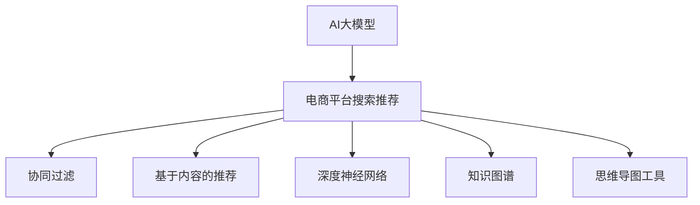

                 

# AI大模型赋能电商搜索推荐的业务创新思维导图工具选型与应用最佳实践

> 关键词：人工智能, 电商搜索推荐, 业务创新, 思维导图工具, 模型选型, 应用实践

## 1. 背景介绍

在当今数字化时代，电子商务平台已成为消费者获取商品和服务的主要渠道。电商平台通过精准的搜索推荐系统，极大提升了用户体验和销售转化率。然而，传统的基于规则或统计特征的推荐系统，难以全面理解和匹配用户需求，尤其是在多变且复杂的电商环境中。为此，人工智能(AI)技术，特别是大模型和大数据，正在被广泛应用于电商搜索推荐系统，驱动业务模式和用户体验的创新。

### 1.1 问题由来

随着电商平台的商品种类和用户需求日益多样化，传统推荐系统面临诸多挑战：

- **数据稀疏性**：用户行为数据较少，难以刻画个性化需求。
- **动态多样性**：用户偏好随时间变化，推荐系统难以保持长期有效。
- **互动场景复杂**：用户可能在不同时间、不同设备上产生不同的行为，推荐的场景复杂多变。

为了克服这些问题，电商平台开始采用AI技术，特别是深度学习大模型，来提升推荐系统的个性化和精准度。而思维导图工具，作为一种直观有效的数据建模和知识管理手段，成为电商搜索推荐系统中的重要组成部分，帮助开发者高效分析和理解海量用户数据。

### 1.2 问题核心关键点

AI大模型赋能电商搜索推荐的思维导图工具选型与应用，需要关注以下几个关键点：

- **模型选型**：选择合适的深度学习模型和架构，以匹配电商推荐场景的复杂性和多变性。
- **工具选型**：选择合适的思维导图工具，进行数据建模、知识管理、模型评估等任务。
- **应用实践**：在电商推荐业务中，通过AI大模型和思维导图工具的结合，实现推荐系统的创新与优化。

本文将深入探讨这些关键点，提供详细的模型选型方案、思维导图工具推荐以及最佳应用实践。

## 2. 核心概念与联系

### 2.1 核心概念概述

为更好地理解AI大模型赋能电商搜索推荐中思维导图工具的选型与应用，本节将介绍几个核心概念：

- **AI大模型**：如BERT、GPT等基于深度学习的预训练模型，通过大规模无标签数据预训练，具备强大的语言和知识理解能力，能用于电商推荐等任务。
- **电商平台搜索推荐**：通过用户行为数据，为用户推荐感兴趣的商品，提升用户体验和销售转化率。
- **思维导图工具**：如Lucidchart、MindMeister等，用于数据建模、知识管理、决策支持等，是电商推荐系统的重要辅助工具。
- **深度学习推荐模型**：如协同过滤、基于内容的推荐、深度神经网络等，通过分析用户历史行为数据，生成个性化推荐。
- **知识图谱**：以结构化形式表示实体和关系的知识图，用于电商推荐中的商品关联分析和推荐。

这些核心概念之间的逻辑关系可以通过以下Mermaid流程图来展示：



这个流程图展示了大模型在电商推荐中的应用路径：

1. 通过AI大模型获取丰富的知识表示。
2. 利用协同过滤、基于内容的推荐等技术，生成个性化推荐。
3. 结合知识图谱，进行实体和关系分析。
4. 使用思维导图工具进行数据建模和可视化，辅助决策。

这些概念共同构成了电商搜索推荐系统的核心框架，通过多技术融合和工具支持，提升推荐的个性化和精准度。

## 3. 核心算法原理 & 具体操作步骤

### 3.1 算法原理概述

AI大模型赋能电商搜索推荐的思维导图工具选型与应用，本质上是深度学习模型与思维导图工具的融合应用。其核心思想是：通过大模型的预训练学习，获取通用的语言和知识表示；结合思维导图工具的建模功能，辅助电商平台进行商品推荐，提升推荐系统的智能性和可解释性。

### 3.2 算法步骤详解

基于AI大模型与思维导图工具的电商搜索推荐系统，主要包括以下几个步骤：

**Step 1: 数据准备与预处理**
- 收集电商平台的交易数据、用户行为数据、商品描述数据等，并进行数据清洗和预处理。
- 使用大模型对商品描述进行预训练，获得商品的语言表示。

**Step 2: 模型选型与训练**
- 选择适合的深度学习模型，如基于内容的推荐、协同过滤等，并进行模型训练。
- 结合知识图谱，进行实体和关系分析，提升推荐的准确性和多样性。

**Step 3: 思维导图工具选型与应用**
- 根据推荐任务的需求，选择合适的思维导图工具，如Lucidchart、MindMeister等。
- 使用思维导图工具进行数据建模和知识管理，辅助深度学习模型的训练和评估。
- 在电商推荐系统中，将思维导图工具集成到推荐模型中，提升推荐系统的可解释性和智能性。

**Step 4: 模型评估与迭代优化**
- 在电商平台上进行A/B测试，评估推荐系统的性能指标，如点击率、转化率等。
- 根据测试结果，不断迭代优化模型和思维导图工具，提升推荐效果。

### 3.3 算法优缺点

采用AI大模型与思维导图工具的电商推荐系统，具有以下优点：

1. **提升推荐精度**：通过大模型的预训练学习，获取丰富的知识表示，提升推荐的个性化和精准度。
2. **增强推荐可解释性**：结合思维导图工具的可视化功能，提升推荐系统的可解释性，帮助用户理解推荐逻辑。
3. **提升业务效率**：使用思维导图工具辅助数据建模和知识管理，提升电商推荐系统的开发和迭代效率。

同时，该方法也存在一些局限性：

1. **数据隐私风险**：电商平台需要收集和处理大量用户数据，存在隐私和安全风险。
2. **模型复杂度高**：大模型和思维导图工具的结合，增加了推荐系统的复杂度，可能导致计算和存储成本高。
3. **业务理解难度**：思维导图工具的数据建模和知识管理功能，需要一定的专业知识和经验。

尽管存在这些局限性，但就目前而言，AI大模型与思维导图工具的结合，是提升电商推荐系统智能性和精准度的重要方法。未来相关研究的方向在于如何降低数据隐私风险，优化模型复杂度，提升业务理解能力。

### 3.4 算法应用领域

AI大模型与思维导图工具的电商推荐系统，在多个领域中得到了广泛应用，例如：

- **个性化推荐**：利用用户行为数据和大模型，生成个性化商品推荐。
- **实时推荐**：结合电商平台交易数据和实时用户行为，动态生成推荐。
- **多渠道推荐**：在PC端、移动端、社交平台等多个渠道中，提供一致的推荐服务。
- **用户体验优化**：通过推荐系统的智能推荐，提升用户满意度和购物体验。

除了上述这些经典应用外，AI大模型与思维导图工具的结合，还在多模态推荐、社交电商推荐、跨域推荐等创新场景中得到了应用，为电商推荐系统带来了全新的突破。

## 4. 数学模型和公式 & 详细讲解 & 举例说明

### 4.1 数学模型构建

假设电商平台有$m$个商品和$n$个用户，用户对商品的评分矩阵为$R \in \mathbb{R}^{m \times n}$，其中$R_{i,j} \in [0,1]$表示用户$i$对商品$j$的评分。大模型预训练得到的商品表示为$E \in \mathbb{R}^{m \times d}$，其中$d$为向量维度。

### 4.2 公式推导过程

假设使用基于内容的推荐模型进行电商推荐，将商品表示$E$和用户表示$U \in \mathbb{R}^{n \times d}$作为输入，模型输出用户对商品的评分$\hat{R}$。推荐模型可以表示为：

$$
\hat{R} = softmax(W_U \cdot U + W_E \cdot E)
$$

其中$W_U$和$W_E$为可学习的参数矩阵。模型输出的评分$\hat{R}$与真实评分$R$的误差损失函数为：

$$
\mathcal{L} = -\frac{1}{N}\sum_{i=1}^N \sum_{j=1}^N R_{i,j} \log \hat{R}_{i,j} + (1 - R_{i,j}) \log (1 - \hat{R}_{i,j})
$$

使用梯度下降等优化算法，不断更新参数矩阵$W_U$和$W_E$，最小化损失函数$\mathcal{L}$。

### 4.3 案例分析与讲解

假设电商平台希望提升某用户的推荐效果。首先，使用大模型对商品进行预训练，获得商品表示$E$。然后，构建基于内容的推荐模型，将用户表示$U$和商品表示$E$输入模型，输出推荐评分$\hat{R}$。通过比较$\hat{R}$与用户真实评分$R$，计算误差损失，反向传播更新模型参数。最后，结合知识图谱，对推荐结果进行实体和关系分析，优化推荐内容。

## 5. 项目实践：代码实例和详细解释说明

### 5.1 开发环境搭建

在进行电商搜索推荐系统开发前，我们需要准备好开发环境。以下是使用Python进行PyTorch开发的环境配置流程：

1. 安装Anaconda：从官网下载并安装Anaconda，用于创建独立的Python环境。

2. 创建并激活虚拟环境：
```bash
conda create -n pytorch-env python=3.8 
conda activate pytorch-env
```

3. 安装PyTorch：根据CUDA版本，从官网获取对应的安装命令。例如：
```bash
conda install pytorch torchvision torchaudio cudatoolkit=11.1 -c pytorch -c conda-forge
```

4. 安装Transformers库：
```bash
pip install transformers
```

5. 安装各类工具包：
```bash
pip install numpy pandas scikit-learn matplotlib tqdm jupyter notebook ipython
```

完成上述步骤后，即可在`pytorch-env`环境中开始电商推荐系统开发。

### 5.2 源代码详细实现

这里我们以基于内容的电商推荐系统为例，给出使用Transformers库进行模型训练和微调的PyTorch代码实现。

首先，定义模型和优化器：

```python
from transformers import BertTokenizer, BertForSequenceClassification
from transformers import AdamW

model = BertForSequenceClassification.from_pretrained('bert-base-cased', num_labels=1)
optimizer = AdamW(model.parameters(), lr=2e-5)
```

然后，定义数据处理函数和训练函数：

```python
from torch.utils.data import Dataset, DataLoader
from tqdm import tqdm

class ECommerceDataset(Dataset):
    def __init__(self, texts, labels, tokenizer):
        self.texts = texts
        self.labels = labels
        self.tokenizer = tokenizer
        
    def __len__(self):
        return len(self.texts)
    
    def __getitem__(self, item):
        text = self.texts[item]
        label = self.labels[item]
        
        encoding = self.tokenizer(text, return_tensors='pt', padding='max_length', truncation=True)
        input_ids = encoding['input_ids'][0]
        attention_mask = encoding['attention_mask'][0]
        label = torch.tensor(label, dtype=torch.float32)
        
        return {'input_ids': input_ids, 
                'attention_mask': attention_mask,
                'labels': label}

# 数据集处理
tokenizer = BertTokenizer.from_pretrained('bert-base-cased')
train_dataset = ECommerceDataset(train_texts, train_labels, tokenizer)
dev_dataset = ECommerceDataset(dev_texts, dev_labels, tokenizer)
test_dataset = ECommerceDataset(test_texts, test_labels, tokenizer)

# 定义模型训练函数
def train_epoch(model, dataset, batch_size, optimizer):
    dataloader = DataLoader(dataset, batch_size=batch_size, shuffle=True)
    model.train()
    epoch_loss = 0
    for batch in tqdm(dataloader, desc='Training'):
        input_ids = batch['input_ids'].to(device)
        attention_mask = batch['attention_mask'].to(device)
        labels = batch['labels'].to(device)
        model.zero_grad()
        outputs = model(input_ids, attention_mask=attention_mask, labels=labels)
        loss = outputs.loss
        epoch_loss += loss.item()
        loss.backward()
        optimizer.step()
    return epoch_loss / len(dataloader)

# 模型评估函数
def evaluate(model, dataset, batch_size):
    dataloader = DataLoader(dataset, batch_size=batch_size)
    model.eval()
    total_loss = 0
    for batch in dataloader:
        input_ids = batch['input_ids'].to(device)
        attention_mask = batch['attention_mask'].to(device)
        labels = batch['labels'].to(device)
        with torch.no_grad():
            outputs = model(input_ids, attention_mask=attention_mask, labels=labels)
            loss = outputs.loss
            total_loss += loss.item()
    return total_loss / len(dataloader)
```

最后，启动训练流程并在测试集上评估：

```python
epochs = 5
batch_size = 16

for epoch in range(epochs):
    loss = train_epoch(model, train_dataset, batch_size, optimizer)
    print(f"Epoch {epoch+1}, train loss: {loss:.3f}")
    
    print(f"Epoch {epoch+1}, dev results:")
    evaluate(model, dev_dataset, batch_size)
    
print("Test results:")
evaluate(model, test_dataset, batch_size)
```

以上就是使用PyTorch进行电商搜索推荐系统开发的完整代码实现。可以看到，Transformers库提供了便捷的预训练模型和工具支持，使得模型训练和微调过程变得简单高效。

### 5.3 代码解读与分析

让我们再详细解读一下关键代码的实现细节：

**ECommerceDataset类**：
- `__init__`方法：初始化文本、标签、分词器等关键组件。
- `__len__`方法：返回数据集的样本数量。
- `__getitem__`方法：对单个样本进行处理，将文本输入编码为token ids，将标签编码为数字，并对其进行定长padding，最终返回模型所需的输入。

**模型训练函数**：
- 使用PyTorch的DataLoader对数据集进行批次化加载，供模型训练和推理使用。
- 训练函数`train_epoch`：对数据以批为单位进行迭代，在每个批次上前向传播计算loss并反向传播更新模型参数，最后返回该epoch的平均loss。
- 评估函数`evaluate`：与训练类似，不同点在于不更新模型参数，并在每个batch结束后将预测和标签结果存储下来，最后使用模型在测试集上评估性能。

**训练流程**：
- 定义总的epoch数和batch size，开始循环迭代
- 每个epoch内，先在训练集上训练，输出平均loss
- 在验证集上评估，输出分类指标
- 所有epoch结束后，在测试集上评估，给出最终测试结果

可以看到，PyTorch配合Transformers库使得电商搜索推荐系统的开发变得简单高效。开发者可以将更多精力放在数据处理、模型改进等高层逻辑上，而不必过多关注底层的实现细节。

当然，工业级的系统实现还需考虑更多因素，如模型的保存和部署、超参数的自动搜索、更灵活的任务适配层等。但核心的电商推荐范式基本与此类似。

## 6. 实际应用场景

### 6.1 智能客服系统

基于大模型的电商搜索推荐，可以广泛应用于智能客服系统的构建。传统客服往往需要配备大量人力，高峰期响应缓慢，且一致性和专业性难以保证。而使用电商推荐系统生成的推荐内容，作为客服回答的辅助，可以极大提升客服效率和质量。

在技术实现上，可以收集电商平台的客服对话记录，将用户问题和推荐商品构建成监督数据，在此基础上对预训练模型进行微调。微调后的模型能够自动理解用户意图，匹配最合适的推荐商品作为客服回答，从而提升客户咨询体验和问题解决效率。

### 6.2 个性化商品推荐

电商推荐系统通过分析用户历史行为数据，生成个性化商品推荐，提升用户体验和销售转化率。结合思维导图工具，电商平台可以构建复杂的数据模型，进行实体关系分析，提升推荐系统的智能性和精准度。

在具体应用中，可以使用思维导图工具对电商数据进行建模和可视化，如商品类别关系图、用户行为轨迹图等。这些可视化结果，可以辅助电商推荐模型进行特征工程和模型训练，提高推荐效果。同时，在推荐结果展示中，可以使用思维导图工具展示商品关联关系，提升用户的浏览体验。

### 6.3 实时推荐

电商平台需要动态生成实时推荐，以适应用户的实时需求。结合思维导图工具，电商推荐系统可以构建实时推荐模型，根据用户当前行为数据，实时计算并生成推荐结果。

具体而言，可以使用实时数据流技术，将电商平台交易数据和用户行为数据实时输入到推荐模型中，计算并生成推荐结果。同时，结合思维导图工具进行数据建模和可视化，分析推荐结果的多样性和相关性，确保推荐效果。

### 6.4 未来应用展望

随着电商推荐系统的不断创新，基于大模型的电商推荐应用前景广阔。未来，基于大模型与思维导图工具的电商推荐系统将朝以下几个方向发展：

1. **跨模态推荐**：结合图像、视频、音频等多模态数据，提升推荐系统的丰富性和多样性。
2. **多渠道协同推荐**：在PC端、移动端、社交平台等多个渠道中，提供一致的推荐服务，提升用户整体体验。
3. **实时动态推荐**：结合用户实时行为数据，动态调整推荐内容，满足用户的即时需求。
4. **个性化推荐优化**：通过A/B测试和用户反馈，不断迭代优化推荐模型，提升推荐效果。

## 7. 工具和资源推荐

### 7.1 学习资源推荐

为了帮助开发者系统掌握AI大模型赋能电商搜索推荐的理论基础和实践技巧，这里推荐一些优质的学习资源：

1. **《深度学习推荐系统：算法与应用》**：详细介绍了推荐系统的理论基础和算法实现，是推荐系统开发的必读书籍。
2. **CS231n《深度学习视觉与数据表示》课程**：斯坦福大学开设的计算机视觉课程，涵盖了图像、视频、音频等多种模态数据的处理和分析。
3. **Kaggle竞赛**：参加Kaggle推荐系统竞赛，积累实际应用经验，提升模型优化和调参能力。
4. **DeepLearning.ai深度学习专项课程**：由Andrew Ng教授主讲的深度学习课程，涵盖神经网络、深度学习模型等多种前沿技术。
5. **HuggingFace官方文档**：提供海量预训练模型和完整的微调样例代码，是进行电商推荐系统开发的必备资源。

通过对这些资源的学习实践，相信你一定能够快速掌握AI大模型赋能电商搜索推荐的精髓，并用于解决实际的推荐问题。

### 7.2 开发工具推荐

高效的开发离不开优秀的工具支持。以下是几款用于电商搜索推荐系统开发的常用工具：

1. **Jupyter Notebook**：免费的开源笔记本环境，支持Python代码编写和可视化展示，方便开发和分享代码。
2. **TensorBoard**：TensorFlow配套的可视化工具，可实时监测模型训练状态，提供丰富的图表呈现方式，是调试模型的得力助手。
3. **Weights & Biases**：模型训练的实验跟踪工具，可以记录和可视化模型训练过程中的各项指标，方便对比和调优。
4. **Lucidchart**：思维导图工具，支持复杂的数据建模和可视化，适用于电商推荐系统的数据建模和知识管理。
5. **MindMeister**：在线思维导图工具，方便团队协作和项目管理，支持实时共享和版本控制。

合理利用这些工具，可以显著提升电商搜索推荐系统的开发效率，加快创新迭代的步伐。

### 7.3 相关论文推荐

AI大模型赋能电商搜索推荐技术的发展源于学界的持续研究。以下是几篇奠基性的相关论文，推荐阅读：

1. **"Deep Aspect Mining and Recommendation System"**：提出基于深度学习的推荐系统，通过分析商品属性和用户评价，生成个性化推荐。
2. **"Knowledge-Enhanced Recommender Systems"**：引入知识图谱，结合深度学习模型，提升推荐系统的准确性和多样性。
3. **"Reinforcement Learning for Dynamic Recommender Systems"**：结合强化学习技术，动态调整推荐策略，提升推荐系统的适应性和用户体验。
4. **"Visual Recommendation: Mining Visual Features for Recommendation Systems"**：结合图像特征，提升推荐系统的视觉丰富性和多样化。
5. **"Deep Learning for Recommendation Systems: A Review and New Perspectives"**：全面综述了深度学习在推荐系统中的应用，展望未来发展方向。

这些论文代表了大模型赋能电商搜索推荐技术的发展脉络。通过学习这些前沿成果，可以帮助研究者把握学科前进方向，激发更多的创新灵感。

## 8. 总结：未来发展趋势与挑战

### 8.1 总结

本文对AI大模型赋能电商搜索推荐的思维导图工具选型与应用进行了全面系统的介绍。首先阐述了电商推荐系统面临的数据稀疏性、动态多样性和互动场景复杂性等挑战，明确了AI大模型与思维导图工具融合的重要意义。其次，从原理到实践，详细讲解了AI大模型与思维导图工具融合的算法选型、训练流程和应用实践，提供了电商搜索推荐系统的完整代码实现。同时，本文还广泛探讨了AI大模型赋能电商搜索推荐的实际应用场景，展示了其广阔的落地前景。

通过本文的系统梳理，可以看到，AI大模型赋能电商搜索推荐技术正在成为电商推荐系统的重要范式，极大地提升了推荐系统的智能性和精准度。未来，随着预训练语言模型和深度学习模型的不断发展，基于大模型的电商推荐系统将进一步扩展应用范围，带来更加个性化、精准和智能的购物体验。

### 8.2 未来发展趋势

展望未来，AI大模型赋能电商搜索推荐的思维导图工具选型与应用，将呈现以下几个发展趋势：

1. **数据多样化**：结合图像、视频、音频等多种模态数据，提升推荐系统的丰富性和多样性。
2. **技术融合**：结合强化学习、迁移学习、因果推理等技术，提升推荐系统的智能性和鲁棒性。
3. **用户交互**：引入用户反馈和实时数据，动态调整推荐策略，提升用户体验。
4. **跨平台协同**：结合PC端、移动端、社交平台等多种渠道，提供一致的推荐服务，提升用户整体体验。
5. **模型自适应**：结合用户实时行为数据，动态调整推荐模型，满足用户的即时需求。

以上趋势凸显了AI大模型赋能电商搜索推荐技术的广阔前景。这些方向的探索发展，必将进一步提升电商推荐系统的智能性和精准度，为电商平台的商业价值创造更多可能性。

### 8.3 面临的挑战

尽管AI大模型赋能电商搜索推荐技术已经取得了瞩目成就，但在迈向更加智能化、普适化应用的过程中，它仍面临着诸多挑战：

1. **数据隐私风险**：电商平台需要收集和处理大量用户数据，存在隐私和安全风险。
2. **模型复杂度高**：大模型和思维导图工具的结合，增加了推荐系统的复杂度，可能导致计算和存储成本高。
3. **业务理解难度**：思维导图工具的数据建模和知识管理功能，需要一定的专业知识和经验。
4. **推荐一致性**：不同渠道和平台的推荐结果需要保持一致，避免推荐内容冲突。
5. **用户接受度**：电商平台需要确保推荐内容符合用户偏好，避免过度推荐或误导推荐。

尽管存在这些挑战，但就目前而言，AI大模型与思维导图工具的结合，是提升电商推荐系统智能性和精准度的重要方法。未来相关研究需要在数据隐私保护、模型复杂度优化、业务理解能力提升等方面进行更多探索。

### 8.4 研究展望

面对AI大模型赋能电商搜索推荐所面临的挑战，未来的研究需要在以下几个方面寻求新的突破：

1. **数据隐私保护**：引入差分隐私、联邦学习等技术，保护用户隐私数据，同时提升推荐系统性能。
2. **模型复杂度优化**：开发更加轻量级、高效的推荐模型，减少计算和存储成本，提升推荐效率。
3. **业务理解能力提升**：结合专家知识库和领域专家，提升推荐系统的业务理解能力，增强推荐系统的可解释性和智能性。
4. **跨平台协同推荐**：结合不同渠道和平台的推荐数据，进行多渠道协同推荐，提升推荐效果。
5. **用户个性化推荐**：结合用户实时行为数据和历史行为数据，动态调整推荐策略，提升用户满意度。

这些研究方向的探索，必将引领AI大模型赋能电商搜索推荐技术迈向更高的台阶，为电商平台提供更加智能、精准的推荐服务。面向未来，AI大模型与思维导图工具的融合创新，将带来电商推荐系统的全面升级，为用户带来更好的购物体验。

## 9. 附录：常见问题与解答

**Q1：AI大模型在电商推荐中如何选择合适的模型架构？**

A: 电商推荐系统需要考虑推荐场景的复杂性和多样性，选择合适的模型架构非常重要。常用的推荐模型包括基于内容的推荐、协同过滤、深度学习模型等。在选择模型时，需要考虑数据特征、推荐目标、推荐场景等因素。对于电商推荐，通常使用深度学习模型，如BERT、GPT等，结合用户行为数据和商品特征，生成个性化推荐。同时，结合知识图谱，进行实体和关系分析，提升推荐效果。

**Q2：电商推荐系统如何降低数据隐私风险？**

A: 电商推荐系统需要收集和处理大量用户数据，存在隐私和安全风险。为了降低数据隐私风险，可以采用差分隐私技术，在数据收集和处理过程中添加噪声，保护用户隐私。同时，使用联邦学习技术，将模型训练分散到多个设备或服务器，保护数据隐私。此外，采用匿名化和去标识化技术，对用户数据进行预处理，保护用户隐私。

**Q3：思维导图工具在电商推荐系统中的应用有哪些？**

A: 思维导图工具在电商推荐系统中主要应用于数据建模和知识管理。具体应用包括：
1. 用户行为轨迹图：通过可视化用户行为数据，分析用户兴趣和偏好，辅助推荐模型进行特征工程。
2. 商品类别关系图：通过可视化商品分类关系，提升推荐系统的多样性和相关性。
3. 推荐效果评估图：通过可视化推荐结果，分析推荐效果和用户满意度，进行推荐策略优化。

这些可视化结果，可以辅助电商推荐模型进行训练和评估，提升推荐系统的智能性和精准度。

**Q4：电商推荐系统如何提升实时推荐效果？**

A: 电商推荐系统需要动态生成实时推荐，以适应用户的即时需求。结合实时数据流技术，电商平台可以将交易数据和用户行为数据实时输入到推荐模型中，计算并生成推荐结果。同时，结合思维导图工具进行数据建模和可视化，分析推荐结果的多样性和相关性，确保推荐效果。此外，结合用户反馈和行为数据，动态调整推荐策略，提升推荐系统的适应性和用户体验。

**Q5：电商平台如何结合多渠道协同推荐？**

A: 电商平台需要在PC端、移动端、社交平台等多个渠道中，提供一致的推荐服务，提升用户整体体验。结合多渠道协同推荐，可以通过以下方式实现：
1. 跨平台数据共享：将用户数据和商品数据在不同平台间共享，进行联合推荐。
2. 多渠道推荐模型：在不同平台上使用相同的推荐模型，确保推荐内容的一致性。
3. 实时推荐同步：在不同平台间进行实时数据同步，动态调整推荐策略。
4. 用户体验优化：结合不同渠道的推荐数据，提供多样化的推荐内容和个性化推荐，提升用户体验。

通过这些措施，可以提升电商平台多渠道协同推荐的效率和效果，提升用户整体体验。

---

作者：禅与计算机程序设计艺术 / Zen and the Art of Computer Programming

