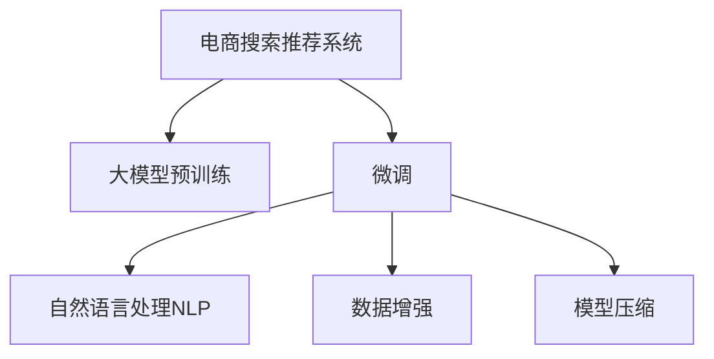

                 

# AI大模型重构电商搜索推荐系统的关键技术

> 关键词：电商搜索推荐系统,大模型预训练,微调,自然语言处理,NLP,数据增强,模型压缩,用户行为分析

## 1. 背景介绍

### 1.1 问题由来

电商搜索推荐系统在现代电商平台上扮演着至关重要的角色，直接影响到用户体验和交易转化率。传统的搜索推荐算法多采用基于规则和统计的方法，如协同过滤、基于内容的推荐等，难以应对电商行业复杂多变的业务需求和数据形态。近年来，随着深度学习和大模型技术的快速发展，大模型在电商搜索推荐系统中的应用也得到了广泛关注和应用。

大模型在电商搜索推荐系统中的应用主要包括两个方面：一是基于大模型预训练的初始化，二是基于小规模数据的微调。预训练大模型通过在大规模无标签数据上学习通用的语言表示和特征表示，可以显著提升搜索推荐系统的表达能力和泛化能力。而微调则通过在小规模标注数据上进行有监督的训练，使大模型能够更好地适应电商行业的具体业务需求，实现更加精准的推荐。

### 1.2 问题核心关键点

大模型在电商搜索推荐系统中的应用涉及多个关键点，包括预训练模型的选择、微调数据集的构建、微调算法的优化、模型的推理与部署等。本文将聚焦于大模型预训练与微调技术在电商搜索推荐系统中的应用，详细阐述其原理与实践。

## 2. 核心概念与联系

### 2.1 核心概念概述

为更好地理解大模型在电商搜索推荐系统中的应用，本节将介绍几个关键概念：

- 电商搜索推荐系统：指电商平台中的搜索和推荐系统，通过算法为用户推荐最相关、最符合其需求的商品或内容，提升用户体验和转化率。
- 大模型预训练：指在大规模无标签文本数据上，使用深度学习模型进行自监督预训练的过程，使模型学习通用的语言表示和特征表示。
- 微调：指在预训练模型的基础上，通过小规模标注数据进行有监督训练，调整模型参数以适应特定任务的过程。
- 自然语言处理(NLP)：指利用计算机技术处理和理解人类语言的技术，是实现大模型在电商搜索推荐系统中应用的基础。
- 数据增强：指通过数据扩增技术，如回译、近义词替换等，增加训练数据多样性，提升模型泛化能力。
- 模型压缩：指在保持模型性能的前提下，通过剪枝、量化等方法减小模型规模，提高模型推理速度。

这些概念之间的逻辑关系可以通过以下Mermaid流程图来展示：



这个流程图展示了大模型在电商搜索推荐系统中的应用框架：

1. 电商搜索推荐系统通过自然语言处理技术，实现对用户输入的查询和商品描述的理解。
2. 利用大模型进行预训练，学习通用的语言表示和特征表示，提升模型的表达能力和泛化能力。
3. 基于小规模标注数据对预训练模型进行微调，调整模型参数以适应电商行业的具体业务需求。
4. 采用数据增强和模型压缩等技术，提升模型的泛化能力和推理速度，以适应电商行业的实时性要求。

## 3. 核心算法原理 & 具体操作步骤

### 3.1 算法原理概述

大模型在电商搜索推荐系统中的应用主要通过以下步骤实现：

1. 使用深度学习模型（如Transformer、BERT等）在大规模无标签数据上进行预训练，学习通用的语言表示和特征表示。
2. 基于小规模标注数据，对预训练模型进行微调，调整模型参数以适应电商行业的具体业务需求。
3. 采用自然语言处理技术，对用户查询和商品描述进行处理，实现对用户需求的理解。
4. 结合用户行为分析结果，对商品进行排序和推荐，提升用户体验和转化率。

这些步骤可以概括为：预训练-微调-自然语言处理-用户行为分析-推荐排序。

### 3.2 算法步骤详解

以下是大模型在电商搜索推荐系统中的具体实现步骤：

**Step 1: 准备数据集**

- 收集电商行业的相关文本数据，包括用户查询、商品描述、用户行为数据等。
- 对数据进行清洗和预处理，去除噪音和无关信息，确保数据的质量和一致性。
- 划分数据集为训练集、验证集和测试集，保证模型在不同数据集上的泛化能力。

**Step 2: 构建预训练模型**

- 选择合适的预训练模型，如BERT、GPT等，在大规模无标签数据上进行预训练。
- 调整模型参数，如层数、隐藏单元数等，以达到更好的表达能力。
- 进行模型的自监督预训练，学习通用的语言表示和特征表示。

**Step 3: 进行微调**

- 准备电商行业的标注数据集，包含用户查询、商品描述和用户行为等信息。
- 对标注数据进行清洗和预处理，确保数据质量。
- 使用微调算法（如AdamW、SGD等）对预训练模型进行有监督训练，调整模型参数以适应电商行业的具体业务需求。
- 设置微调超参数，如学习率、批大小、迭代轮数等，以达到最佳的微调效果。

**Step 4: 用户行为分析**

- 收集用户行为数据，包括浏览历史、点击记录、购买记录等。
- 对行为数据进行处理和分析，提取用户偏好、兴趣等信息。
- 将用户行为分析结果与模型输出结合，优化推荐结果。

**Step 5: 推荐排序**

- 将用户查询和商品描述输入微调后的模型，获取商品的特征表示。
- 将用户行为分析结果与商品特征表示结合，计算商品与用户需求的匹配度。
- 对商品进行排序和推荐，选择最相关、最符合用户需求的商品。

### 3.3 算法优缺点

大模型在电商搜索推荐系统中的应用具有以下优点：

1. 提高表达能力和泛化能力。通过预训练和微调，模型可以学习通用的语言表示和特征表示，提升模型的表达能力和泛化能力，适应复杂的电商行业需求。
2. 提升推荐精度和效果。通过微调，模型可以更好地适应电商行业的具体业务需求，实现更加精准的推荐。
3. 支持多模态数据融合。大模型可以处理文本、图像、视频等多模态数据，实现多模态数据的融合，提升推荐效果。

同时，该方法也存在以下缺点：

1. 依赖标注数据。微调的效果很大程度上取决于标注数据的质量和数量，获取高质量标注数据的成本较高。
2. 计算资源消耗大。大模型的预训练和微调需要大量的计算资源，对硬件设备的要求较高。
3. 过拟合风险高。当目标任务与预训练数据的分布差异较大时，微调的性能提升有限，容易发生过拟合。

尽管存在这些缺点，但就目前而言，大模型预训练与微调方法在电商搜索推荐系统中的应用仍然是主流范式。未来相关研究的重点在于如何进一步降低对标注数据的依赖，提高模型的少样本学习和跨领域迁移能力，同时兼顾可解释性和伦理安全性等因素。

### 3.4 算法应用领域

大模型在电商搜索推荐系统中的应用已经广泛应用于多个领域，例如：

- 用户意图理解：基于自然语言处理技术，对用户查询和商品描述进行处理，理解用户意图。
- 商品相似度计算：利用大模型学习到的特征表示，计算商品之间的相似度，实现个性化推荐。
- 用户画像构建：基于用户行为数据，构建用户画像，实现个性化推荐和用户行为分析。
- 推荐算法优化：通过微调大模型，优化推荐算法，提升推荐效果和用户体验。
- 多模态推荐：结合图像、视频等数据，提升推荐精度和效果。

除了上述这些经典应用外，大模型在电商搜索推荐系统中的应用还在不断扩展，如跨领域推荐、用户情绪分析、广告定向投放等，为电商行业带来了新的突破。

## 4. 数学模型和公式 & 详细讲解 & 举例说明

### 4.1 数学模型构建

本节将使用数学语言对大模型在电商搜索推荐系统中的应用进行更加严格的刻画。

记大模型为 $M_{\theta}$，其中 $\theta$ 为模型的参数向量。假设电商行业的标注数据集为 $D=\{(x_i,y_i)\}_{i=1}^N, x_i \in \mathcal{X}, y_i \in \mathcal{Y}$，其中 $\mathcal{X}$ 为用户查询和商品描述的输入空间，$\mathcal{Y}$ 为用户需求或商品标签的输出空间。

定义模型 $M_{\theta}$ 在输入 $x$ 上的输出为 $y=M_{\theta}(x)$，假设模型输出为概率分布 $P(y|x)$。则电商搜索推荐系统的优化目标是最小化损失函数 $\mathcal{L}(\theta)$，即：

$$
\mathcal{L}(\theta) = \frac{1}{N}\sum_{i=1}^N -\log P(y_i|x_i)
$$

其中 $-\log P(y_i|x_i)$ 为交叉熵损失函数，用于衡量模型预测输出与真实标签之间的差异。

在微调过程中，通过设置不同的损失函数，可以实现不同类型的任务，如分类任务、回归任务、序列预测任务等。例如，对于分类任务，可以采用二分类交叉熵损失函数：

$$
\ell(M_{\theta}(x),y) = -[y\log \hat{y} + (1-y)\log(1-\hat{y})]
$$

其中 $\hat{y}=M_{\theta}(x)$ 表示模型在输入 $x$ 上的预测概率。

### 4.2 公式推导过程

以下我们以分类任务为例，推导交叉熵损失函数及其梯度的计算公式。

假设模型 $M_{\theta}$ 在输入 $x$ 上的输出为 $\hat{y}=M_{\theta}(x) \in [0,1]$，表示商品被用户需求的概率。真实标签 $y \in \{0,1\}$。则二分类交叉熵损失函数定义为：

$$
\ell(M_{\theta}(x),y) = -[y\log \hat{y} + (1-y)\log(1-\hat{y})]
$$

将其代入经验风险公式，得：

$$
\mathcal{L}(\theta) = -\frac{1}{N}\sum_{i=1}^N [y_i\log M_{\theta}(x_i)+(1-y_i)\log(1-M_{\theta}(x_i))]
$$

根据链式法则，损失函数对参数 $\theta_k$ 的梯度为：

$$
\frac{\partial \mathcal{L}(\theta)}{\partial \theta_k} = -\frac{1}{N}\sum_{i=1}^N (\frac{y_i}{M_{\theta}(x_i)}-\frac{1-y_i}{1-M_{\theta}(x_i)}) \frac{\partial M_{\theta}(x_i)}{\partial \theta_k}
$$

其中 $\frac{\partial M_{\theta}(x_i)}{\partial \theta_k}$ 可进一步递归展开，利用自动微分技术完成计算。

在得到损失函数的梯度后，即可带入参数更新公式，完成模型的迭代优化。重复上述过程直至收敛，最终得到适应电商行业具体业务需求的最优模型参数 $\theta^*$。

## 5. 项目实践：代码实例和详细解释说明

### 5.1 开发环境搭建

在进行微调实践前，我们需要准备好开发环境。以下是使用Python进行PyTorch开发的环境配置流程：

1. 安装Anaconda：从官网下载并安装Anaconda，用于创建独立的Python环境。

2. 创建并激活虚拟环境：
```bash
conda create -n pytorch-env python=3.8 
conda activate pytorch-env
```

3. 安装PyTorch：根据CUDA版本，从官网获取对应的安装命令。例如：
```bash
conda install pytorch torchvision torchaudio cudatoolkit=11.1 -c pytorch -c conda-forge
```

4. 安装Transformers库：
```bash
pip install transformers
```

5. 安装各类工具包：
```bash
pip install numpy pandas scikit-learn matplotlib tqdm jupyter notebook ipython
```

完成上述步骤后，即可在`pytorch-env`环境中开始微调实践。

### 5.2 源代码详细实现

下面我们以商品相似度计算为例，给出使用Transformers库对BERT模型进行微调的PyTorch代码实现。

首先，定义数据处理函数：

```python
from transformers import BertTokenizer
from torch.utils.data import Dataset
import torch

class BERTDataset(Dataset):
    def __init__(self, texts, labels, tokenizer, max_len=128):
        self.texts = texts
        self.labels = labels
        self.tokenizer = tokenizer
        self.max_len = max_len
        
    def __len__(self):
        return len(self.texts)
    
    def __getitem__(self, item):
        text = self.texts[item]
        label = self.labels[item]
        
        encoding = self.tokenizer(text, return_tensors='pt', max_length=self.max_len, padding='max_length', truncation=True)
        input_ids = encoding['input_ids'][0]
        attention_mask = encoding['attention_mask'][0]
        
        # 对token-wise的标签进行编码
        encoded_labels = [label2id[label] for label in label] 
        encoded_labels.extend([label2id['O']] * (self.max_len - len(encoded_labels)))
        labels = torch.tensor(encoded_labels, dtype=torch.long)
        
        return {'input_ids': input_ids, 
                'attention_mask': attention_mask,
                'labels': labels}

# 标签与id的映射
label2id = {'O': 0, '1': 1, '2': 2}
id2label = {v: k for k, v in label2id.items()}

# 创建dataset
tokenizer = BertTokenizer.from_pretrained('bert-base-cased')

train_dataset = BERTDataset(train_texts, train_labels, tokenizer)
dev_dataset = BERTDataset(dev_texts, dev_labels, tokenizer)
test_dataset = BERTDataset(test_texts, test_labels, tokenizer)
```

然后，定义模型和优化器：

```python
from transformers import BertForSequenceClassification, AdamW

model = BertForSequenceClassification.from_pretrained('bert-base-cased', num_labels=len(label2id))

optimizer = AdamW(model.parameters(), lr=2e-5)
```

接着，定义训练和评估函数：

```python
from torch.utils.data import DataLoader
from tqdm import tqdm
from sklearn.metrics import classification_report

device = torch.device('cuda') if torch.cuda.is_available() else torch.device('cpu')
model.to(device)

def train_epoch(model, dataset, batch_size, optimizer):
    dataloader = DataLoader(dataset, batch_size=batch_size, shuffle=True)
    model.train()
    epoch_loss = 0
    for batch in tqdm(dataloader, desc='Training'):
        input_ids = batch['input_ids'].to(device)
        attention_mask = batch['attention_mask'].to(device)
        labels = batch['labels'].to(device)
        model.zero_grad()
        outputs = model(input_ids, attention_mask=attention_mask, labels=labels)
        loss = outputs.loss
        epoch_loss += loss.item()
        loss.backward()
        optimizer.step()
    return epoch_loss / len(dataloader)

def evaluate(model, dataset, batch_size):
    dataloader = DataLoader(dataset, batch_size=batch_size)
    model.eval()
    preds, labels = [], []
    with torch.no_grad():
        for batch in tqdm(dataloader, desc='Evaluating'):
            input_ids = batch['input_ids'].to(device)
            attention_mask = batch['attention_mask'].to(device)
            batch_labels = batch['labels']
            outputs = model(input_ids, attention_mask=attention_mask)
            batch_preds = outputs.logits.argmax(dim=2).to('cpu').tolist()
            batch_labels = batch_labels.to('cpu').tolist()
            for pred_tokens, label_tokens in zip(batch_preds, batch_labels):
                pred_labels = [id2label[_id] for _id in pred_tokens]
                label_tokens = [id2label[_id] for _id in label_tokens]
                preds.append(pred_labels[:len(label_tokens)])
                labels.append(label_tokens)
                
    print(classification_report(labels, preds))
```

最后，启动训练流程并在测试集上评估：

```python
epochs = 5
batch_size = 16

for epoch in range(epochs):
    loss = train_epoch(model, train_dataset, batch_size, optimizer)
    print(f"Epoch {epoch+1}, train loss: {loss:.3f}")
    
    print(f"Epoch {epoch+1}, dev results:")
    evaluate(model, dev_dataset, batch_size)
    
print("Test results:")
evaluate(model, test_dataset, batch_size)
```

以上就是使用PyTorch对BERT进行商品相似度计算任务微调的完整代码实现。可以看到，得益于Transformers库的强大封装，我们可以用相对简洁的代码完成BERT模型的加载和微调。

### 5.3 代码解读与分析

让我们再详细解读一下关键代码的实现细节：

**BERTDataset类**：
- `__init__`方法：初始化文本、标签、分词器等关键组件。
- `__len__`方法：返回数据集的样本数量。
- `__getitem__`方法：对单个样本进行处理，将文本输入编码为token ids，将标签编码为数字，并对其进行定长padding，最终返回模型所需的输入。

**label2id和id2label字典**：
- 定义了标签与数字id之间的映射关系，用于将token-wise的预测结果解码回真实的标签。

**训练和评估函数**：
- 使用PyTorch的DataLoader对数据集进行批次化加载，供模型训练和推理使用。
- 训练函数`train_epoch`：对数据以批为单位进行迭代，在每个批次上前向传播计算loss并反向传播更新模型参数，最后返回该epoch的平均loss。
- 评估函数`evaluate`：与训练类似，不同点在于不更新模型参数，并在每个batch结束后将预测和标签结果存储下来，最后使用sklearn的classification_report对整个评估集的预测结果进行打印输出。

**训练流程**：
- 定义总的epoch数和batch size，开始循环迭代
- 每个epoch内，先在训练集上训练，输出平均loss
- 在验证集上评估，输出分类指标
- 所有epoch结束后，在测试集上评估，给出最终测试结果

可以看到，PyTorch配合Transformers库使得BERT微调的代码实现变得简洁高效。开发者可以将更多精力放在数据处理、模型改进等高层逻辑上，而不必过多关注底层的实现细节。

当然，工业级的系统实现还需考虑更多因素，如模型的保存和部署、超参数的自动搜索、更灵活的任务适配层等。但核心的微调范式基本与此类似。

## 6. 实际应用场景

### 6.1 智能客服系统

基于大语言模型微调的对话技术，可以广泛应用于智能客服系统的构建。传统客服往往需要配备大量人力，高峰期响应缓慢，且一致性和专业性难以保证。而使用微调后的对话模型，可以7x24小时不间断服务，快速响应客户咨询，用自然流畅的语言解答各类常见问题。

在技术实现上，可以收集企业内部的历史客服对话记录，将问题和最佳答复构建成监督数据，在此基础上对预训练对话模型进行微调。微调后的对话模型能够自动理解用户意图，匹配最合适的答案模板进行回复。对于客户提出的新问题，还可以接入检索系统实时搜索相关内容，动态组织生成回答。如此构建的智能客服系统，能大幅提升客户咨询体验和问题解决效率。

### 6.2 金融舆情监测

金融机构需要实时监测市场舆论动向，以便及时应对负面信息传播，规避金融风险。传统的人工监测方式成本高、效率低，难以应对网络时代海量信息爆发的挑战。基于大语言模型微调的文本分类和情感分析技术，为金融舆情监测提供了新的解决方案。

具体而言，可以收集金融领域相关的新闻、报道、评论等文本数据，并对其进行主题标注和情感标注。在此基础上对预训练语言模型进行微调，使其能够自动判断文本属于何种主题，情感倾向是正面、中性还是负面。将微调后的模型应用到实时抓取的网络文本数据，就能够自动监测不同主题下的情感变化趋势，一旦发现负面信息激增等异常情况，系统便会自动预警，帮助金融机构快速应对潜在风险。

### 6.3 个性化推荐系统

当前的推荐系统往往只依赖用户的历史行为数据进行物品推荐，无法深入理解用户的真实兴趣偏好。基于大语言模型微调技术，个性化推荐系统可以更好地挖掘用户行为背后的语义信息，从而提供更精准、多样的推荐内容。

在实践中，可以收集用户浏览、点击、评论、分享等行为数据，提取和用户交互的物品标题、描述、标签等文本内容。将文本内容作为模型输入，用户的后续行为（如是否点击、购买等）作为监督信号，在此基础上微调预训练语言模型。微调后的模型能够从文本内容中准确把握用户的兴趣点。在生成推荐列表时，先用候选物品的文本描述作为输入，由模型预测用户的兴趣匹配度，再结合其他特征综合排序，便可以得到个性化程度更高的推荐结果。

### 6.4 未来应用展望

随着大语言模型微调技术的发展，其在电商搜索推荐系统中的应用前景也将更加广阔。未来，大模型将在以下几个方面发挥更大作用：

1. 多模态融合推荐：结合图像、视频等多模态数据，提升推荐精度和效果。
2. 用户情绪分析：通过情感分析技术，识别用户情绪变化趋势，优化推荐策略。
3. 实时搜索排序：利用自然语言处理技术，实现对用户查询的实时解析和排序。
4. 跨领域推荐：基于用户行为数据，实现跨领域推荐，提升推荐多样性和覆盖面。
5. 个性化广告定向：通过用户画像构建，实现个性化广告定向投放，提升广告效果。

未来，大语言模型微调技术将在电商搜索推荐系统中不断应用和拓展，为电商平台带来更大的价值和竞争优势。

## 7. 工具和资源推荐

### 7.1 学习资源推荐

为了帮助开发者系统掌握大语言模型微调的理论基础和实践技巧，这里推荐一些优质的学习资源：

1. 《Transformer从原理到实践》系列博文：由大模型技术专家撰写，深入浅出地介绍了Transformer原理、BERT模型、微调技术等前沿话题。

2. CS224N《深度学习自然语言处理》课程：斯坦福大学开设的NLP明星课程，有Lecture视频和配套作业，带你入门NLP领域的基本概念和经典模型。

3. 《Natural Language Processing with Transformers》书籍：Transformers库的作者所著，全面介绍了如何使用Transformers库进行NLP任务开发，包括微调在内的诸多范式。

4. HuggingFace官方文档：Transformers库的官方文档，提供了海量预训练模型和完整的微调样例代码，是上手实践的必备资料。

5. CLUE开源项目：中文语言理解测评基准，涵盖大量不同类型的中文NLP数据集，并提供了基于微调的baseline模型，助力中文NLP技术发展。

通过对这些资源的学习实践，相信你一定能够快速掌握大语言模型微调的精髓，并用于解决实际的NLP问题。

### 7.2 开发工具推荐

高效的开发离不开优秀的工具支持。以下是几款用于大语言模型微调开发的常用工具：

1. PyTorch：基于Python的开源深度学习框架，灵活动态的计算图，适合快速迭代研究。大部分预训练语言模型都有PyTorch版本的实现。

2. TensorFlow：由Google主导开发的开源深度学习框架，生产部署方便，适合大规模工程应用。同样有丰富的预训练语言模型资源。

3. Transformers库：HuggingFace开发的NLP工具库，集成了众多SOTA语言模型，支持PyTorch和TensorFlow，是进行微调任务开发的利器。

4. Weights & Biases：模型训练的实验跟踪工具，可以记录和可视化模型训练过程中的各项指标，方便对比和调优。与主流深度学习框架无缝集成。

5. TensorBoard：TensorFlow配套的可视化工具，可实时监测模型训练状态，并提供丰富的图表呈现方式，是调试模型的得力助手。

6. Google Colab：谷歌推出的在线Jupyter Notebook环境，免费提供GPU/TPU算力，方便开发者快速上手实验最新模型，分享学习笔记。

合理利用这些工具，可以显著提升大语言模型微调任务的开发效率，加快创新迭代的步伐。

### 7.3 相关论文推荐

大语言模型和微调技术的发展源于学界的持续研究。以下是几篇奠基性的相关论文，推荐阅读：

1. Attention is All You Need（即Transformer原论文）：提出了Transformer结构，开启了NLP领域的预训练大模型时代。

2. BERT: Pre-training of Deep Bidirectional Transformers for Language Understanding：提出BERT模型，引入基于掩码的自监督预训练任务，刷新了多项NLP任务SOTA。

3. Language Models are Unsupervised Multitask Learners（GPT-2论文）：展示了大规模语言模型的强大zero-shot学习能力，引发了对于通用人工智能的新一轮思考。

4. Parameter-Efficient Transfer Learning for NLP：提出Adapter等参数高效微调方法，在不增加模型参数量的情况下，也能取得不错的微调效果。

5. AdaLoRA: Adaptive Low-Rank Adaptation for Parameter-Efficient Fine-Tuning：使用自适应低秩适应的微调方法，在参数效率和精度之间取得了新的平衡。

这些论文代表了大语言模型微调技术的发展脉络。通过学习这些前沿成果，可以帮助研究者把握学科前进方向，激发更多的创新灵感。

## 8. 总结：未来发展趋势与挑战

### 8.1 总结

本文对大模型在电商搜索推荐系统中的应用进行了全面系统的介绍。首先阐述了电商搜索推荐系统的背景和问题，明确了预训练和微调技术在大模型中的应用价值。其次，从原理到实践，详细讲解了大模型预训练与微调的数学模型和实现细节，给出了微调任务开发的完整代码实例。同时，本文还广泛探讨了微调方法在智能客服、金融舆情、个性化推荐等多个行业领域的应用前景，展示了微调范式的巨大潜力。此外，本文精选了微调技术的各类学习资源，力求为读者提供全方位的技术指引。

通过本文的系统梳理，可以看到，大模型预训练与微调技术在电商搜索推荐系统中的应用已经逐渐成熟，并取得了显著的效果。未来，伴随着深度学习技术的进一步发展，大模型在电商搜索推荐系统中的应用也将更加广泛和深入，为电商平台带来更大的价值和竞争优势。

### 8.2 未来发展趋势

展望未来，大模型在电商搜索推荐系统中的应用将呈现以下几个发展趋势：

1. 模型规模持续增大。随着算力成本的下降和数据规模的扩张，预训练语言模型的参数量还将持续增长。超大规模语言模型蕴含的丰富语言知识，有望支撑更加复杂多变的电商搜索推荐任务。

2. 微调方法日趋多样。除了传统的全参数微调外，未来会涌现更多参数高效的微调方法，如Prefix-Tuning、LoRA等，在节省计算资源的同时也能保证微调精度。

3. 持续学习成为常态。随着数据分布的不断变化，微调模型也需要持续学习新知识以保持性能。如何在不遗忘原有知识的同时，高效吸收新样本信息，将成为重要的研究课题。

4. 标注样本需求降低。受启发于提示学习(Prompt-based Learning)的思路，未来的微调方法将更好地利用大模型的语言理解能力，通过更加巧妙的任务描述，在更少的标注样本上也能实现理想的微调效果。

5. 多模态微调崛起。当前的微调主要聚焦于纯文本数据，未来会进一步拓展到图像、视频、语音等多模态数据微调。多模态信息的融合，将显著提升语言模型对现实世界的理解和建模能力。

6. 模型通用性增强。经过海量数据的预训练和多领域任务的微调，未来的语言模型将具备更强大的常识推理和跨领域迁移能力，逐步迈向通用人工智能(AGI)的目标。

以上趋势凸显了大语言模型预训练与微调技术的广阔前景。这些方向的探索发展，必将进一步提升电商搜索推荐系统的性能和应用范围，为电商平台带来更大的价值和竞争优势。

### 8.3 面临的挑战

尽管大语言模型预训练与微调技术已经取得了瞩目成就，但在迈向更加智能化、普适化应用的过程中，它仍面临着诸多挑战：

1. 标注成本瓶颈。尽管微调对标注数据的需求相对传统方法有所降低，但对于长尾应用场景，获取高质量标注数据的成本仍较高。如何进一步降低微调对标注样本的依赖，将是一大难题。

2. 模型鲁棒性不足。当目标任务与预训练数据的分布差异较大时，微调的性能提升有限，容易发生过拟合。如何提高微调模型的鲁棒性，避免灾难性遗忘，还需要更多理论和实践的积累。

3. 推理效率有待提高。虽然大模型在精度上表现优异，但在实际部署时往往面临推理速度慢、内存占用大等效率问题。如何优化模型结构和算法，提升推理效率，是一个亟需解决的问题。

4. 可解释性亟需加强。当前微调模型往往缺乏可解释性，难以解释其内部工作机制和决策逻辑。对于医疗、金融等高风险应用，算法的可解释性和可审计性尤为重要。如何赋予微调模型更强的可解释性，将是亟待攻克的难题。

5. 安全性有待保障。预训练语言模型难免会学习到有偏见、有害的信息，通过微调传递到下游任务，产生误导性、歧视性的输出，给实际应用带来安全隐患。如何从数据和算法层面消除模型偏见，避免恶意用途，确保输出的安全性，也将是重要的研究课题。

6. 知识整合能力不足。现有的微调模型往往局限于任务内数据，难以灵活吸收和运用更广泛的先验知识。如何让微调过程更好地与外部知识库、规则库等专家知识结合，形成更加全面、准确的信息整合能力，还有很大的想象空间。

正视微调面临的这些挑战，积极应对并寻求突破，将是大语言模型预训练与微调技术走向成熟的必由之路。相信随着学界和产业界的共同努力，这些挑战终将一一被克服，大语言模型预训练与微调技术必将在构建人机协同的智能时代中扮演越来越重要的角色。

### 8.4 研究展望

面向未来，大语言模型预训练与微调技术的研究可以从以下几个方面寻求新的突破：

1. 探索无监督和半监督微调方法。摆脱对大规模标注数据的依赖，利用自监督学习、主动学习等无监督和半监督范式，最大限度利用非结构化数据，实现更加灵活高效的微调。

2. 研究参数高效和计算高效的微调范式。开发更加参数高效的微调方法，在固定大部分预训练参数的同时，只更新极少量的任务相关参数。同时优化微调模型的计算图，减少前向传播和反向传播的资源消耗，实现更加轻量级、实时性的部署。

3. 融合因果和对比学习范式。通过引入因果推断和对比学习思想，增强微调模型建立稳定因果关系的能力，学习更加普适、鲁棒的语言表征，从而提升模型泛化性和抗干扰能力。

4. 引入更多先验知识。将符号化的先验知识，如知识图谱、逻辑规则等，与神经网络模型进行巧妙融合，引导微调过程学习更准确、合理的语言模型。同时加强不同模态数据的整合，实现视觉、语音等多模态信息与文本信息的协同建模。

5. 结合因果分析和博弈论工具。将因果分析方法引入微调模型，识别出模型决策的关键特征，增强输出解释的因果性和逻辑性。借助博弈论工具刻画人机交互过程，主动探索并规避模型的脆弱点，提高系统稳定性。

6. 纳入伦理道德约束。在模型训练目标中引入伦理导向的评估指标，过滤和惩罚有偏见、有害的输出倾向。同时加强人工干预和审核，建立模型行为的监管机制，确保输出符合人类价值观和伦理道德。

这些研究方向的探索，必将引领大语言模型预训练与微调技术迈向更高的台阶，为构建安全、可靠、可解释、可控的智能系统铺平道路。面向未来，大语言模型预训练与微调技术还需要与其他人工智能技术进行更深入的融合，如知识表示、因果推理、强化学习等，多路径协同发力，共同推动自然语言理解和智能交互系统的进步。只有勇于创新、敢于突破，才能不断拓展语言模型的边界，让智能技术更好地造福人类社会。

## 9. 附录：常见问题与解答

**Q1：大语言模型在电商搜索推荐系统中应用的优势是什么？**

A: 大语言模型在电商搜索推荐系统中的优势主要体现在以下几个方面：

1. 提升表达能力和泛化能力。通过预训练和微调，模型可以学习通用的语言表示和特征表示，提升模型的表达能力和泛化能力，适应复杂的电商行业需求。

2. 提升推荐精度和效果。通过微调，模型可以更好地适应电商行业的具体业务需求，实现更加精准的推荐。

3. 支持多模态数据融合。大模型可以处理文本、图像、视频等多模态数据，实现多模态数据的融合，提升推荐效果。

4. 降低标注成本。相较于传统方法，大模型微调所需标注数据量较小，有助于降低标注成本。

5. 提高模型可解释性。大模型微调后的输出可以更好地解释其决策过程，提高模型的可解释性和可审计性。

**Q2：大语言模型在电商搜索推荐系统中如何构建用户画像？**

A: 构建用户画像通常需要以下几个步骤：

1. 收集用户行为数据：包括用户的浏览历史、点击记录、购买记录等。

2. 对行为数据进行处理和分析：提取用户兴趣点、偏好等信息。

3. 将用户行为分析结果与模型输出结合：结合用户行为数据和模型输出，计算用户与不同商品之间的匹配度。

4. 进行个性化推荐：根据匹配度对商品进行排序和推荐，优化推荐策略。

5. 更新用户画像：根据用户最新的行为数据，更新用户画像，不断优化推荐效果。

**Q3：大语言模型在电商搜索推荐系统中的推理效率如何提升？**

A: 大语言模型在电商搜索推荐系统中的推理效率可以通过以下方法提升：

1. 模型压缩：采用剪枝、量化等方法减小模型规模，提高推理速度。

2. 梯度积累：使用梯度积累技术，减小单批次参数更新量，提高推理效率。

3. 并行计算：利用多核、多GPU等并行计算资源，提高模型推理速度。

4. 混合精度训练：使用混合精度训练技术，降低计算资源消耗，提升推理效率。

**Q4：大语言模型在电商搜索推荐系统中的推荐精度如何保证？**

A: 大语言模型在电商搜索推荐系统中的推荐精度可以通过以下方法保证：

1. 选择合适的预训练模型：选择适合电商行业需求的预训练模型，如BERT、GPT等。

2. 合理设置微调超参数：选择合适的学习率、批大小、迭代轮数等超参数，以达到最佳的微调效果。

3. 引入数据增强技术：通过回译、近义词替换等方式扩充训练集，提高模型的泛化能力。

4. 应用对抗训练：加入对抗样本，提高模型鲁棒性，避免模型过拟合。

5. 结合用户行为分析：结合用户行为数据，优化推荐策略，提升推荐精度。

**Q5：大语言模型在电商搜索推荐系统中的模型压缩方法有哪些？**

A: 大语言模型在电商搜索推荐系统中的模型压缩方法主要包括以下几种：

1. 剪枝：去除模型中冗余参数，减小模型规模，提高推理速度。

2. 量化：将模型参数转化为低精度格式，减小模型体积，提高计算效率。

3. 蒸馏：通过知识蒸馏技术，将大模型知识转移到小型模型，提高推理速度。

4. 分解：将大模型分解为多个子模型，并行计算，提高推理速度。

这些方法可以结合使用，以达到最佳的模型压缩效果。

---

作者：禅与计算机程序设计艺术 / Zen and the Art of Computer Programming

