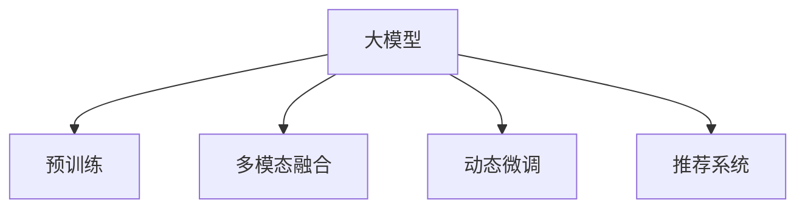

                 

# AI大模型驱动下电商搜索推荐的发展趋势

## 1. 背景介绍

### 1.1 问题由来

随着人工智能（AI）技术的飞速发展，电商平台正加速引入AI大模型驱动下的搜索推荐系统，以提升用户体验和运营效率。传统的电商搜索推荐主要基于基于规则、协同过滤等传统技术，这些方法依赖于大量手工设计的特征和预定义的规则，随着商品数量、用户行为等数据量的指数级增长，已无法有效应对电商场景下搜索推荐的多样化和个性化需求。

大模型如BERT、GPT-3、DALL-E等在自然语言处理、图像生成等领域表现出色，显示出强大的学习能力和泛化能力，逐步成为电商搜索推荐中的新一代技术手段。近年来，电商平台开始尝试在搜索推荐系统中引入大模型，利用其强大语言理解能力和多模态融合能力，提升搜索推荐系统的精准度和个性化程度。

### 1.2 问题核心关键点

在电商搜索推荐系统中引入大模型，主要通过以下几个关键点实现其优势：

- **大规模预训练**：利用海量的电商文本和图像数据进行大规模预训练，学习通用的商品描述、用户评价等特征表示。
- **强大的语言理解能力**：通过语言模型理解用户搜索和评价中的语义信息，帮助推荐系统更好地理解用户需求。
- **多模态融合**：结合图像、视频等多模态数据，提升推荐系统的展示效果和互动体验。
- **动态微调**：利用电商交易数据和用户行为数据进行微调，不断优化推荐策略，适应不断变化的电商市场环境。

### 1.3 问题研究意义

引入大模型驱动的搜索推荐系统，对电商平台有以下几方面的显著优势：

- **提升搜索精准度**：大模型的语言理解和泛化能力，能够更好地理解用户搜索意图，提供更精准的搜索结果。
- **增强推荐个性化**：利用大模型学习用户的历史行为和兴趣，生成个性化的商品推荐，提升用户粘性。
- **提升用户满意度**：通过大模型生成的多模态推荐内容，增加用户的浏览和互动，提升用户购物体验。
- **优化运营效率**：大模型的自监督学习特性，可以持续优化搜索推荐策略，节省人工干预和规则调整的复杂度和成本。

本文将重点探讨大模型在电商搜索推荐系统中的应用，分析其核心算法原理，介绍实际应用场景和未来发展趋势，以期为电商平台技术开发和产品设计提供参考。

## 2. 核心概念与联系

### 2.1 核心概念概述

为更好地理解大模型在电商搜索推荐系统中的应用，本节将介绍几个关键概念：

- **大模型（Large Model）**：指通过大规模数据训练的神经网络模型，如BERT、GPT-3等，具有强大的语义理解能力和泛化能力。
- **预训练（Pre-training）**：指在大规模无标签数据上训练模型，学习通用的语言和图像特征表示，为后续特定任务学习打下基础。
- **多模态融合（Multimodal Fusion）**：指结合文本、图像、视频等多源数据，提升推荐的展示效果和互动体验。
- **动态微调（Fine-tuning）**：指在特定任务数据上，对预训练模型进行微调，适应具体任务需求。
- **推荐系统（Recommendation System）**：指基于用户历史行为和兴趣，生成个性化推荐的系统。

这些核心概念之间的逻辑关系可以通过以下Mermaid流程图来展示：



这个流程图展示了大模型在电商搜索推荐系统中的应用框架，以及与预训练、多模态融合、动态微调和推荐系统之间的关系。

## 3. 核心算法原理 & 具体操作步骤

### 3.1 算法原理概述

基于大模型的电商搜索推荐系统主要通过以下几个步骤实现：

1. **预训练**：利用大规模电商数据进行预训练，学习通用的商品描述和用户评价表示。
2. **多模态融合**：结合图像、视频等多模态数据，提升推荐内容的展示效果和互动体验。
3. **动态微调**：根据用户行为数据和交易数据进行微调，不断优化推荐策略。
4. **推荐系统**：利用微调后的模型，生成个性化的商品推荐。

### 3.2 算法步骤详解

**Step 1: 数据预处理和预训练**

- **数据收集**：收集电商平台上用户的历史搜索记录、商品描述、用户评价、交易记录等数据。
- **数据清洗**：清洗不完整、不规范的数据，去除噪声和异常值。
- **数据划分**：将数据划分为训练集、验证集和测试集。
- **预训练模型**：选择合适的大模型，如BERT、GPT-3等，在电商数据上进行预训练。

**Step 2: 多模态特征提取**

- **图像特征提取**：利用卷积神经网络（CNN）等方法，提取商品图片的视觉特征。
- **文本特征提取**：利用Transformer等语言模型，提取商品描述和用户评价的语言特征。
- **多模态融合**：将文本和图像特征进行拼接、融合，生成多模态特征向量。

**Step 3: 动态微调**

- **微调模型**：选择微调策略，如全参数微调、参数高效微调（PEFT）等，在电商交易数据上进行微调。
- **优化目标**：根据电商推荐任务设计优化目标，如点击率、转化率等指标。
- **超参数调优**：选择合适的超参数，如学习率、批大小、迭代次数等，进行优化。

**Step 4: 推荐生成**

- **模型推理**：利用微调后的模型，对用户输入的搜索请求进行推理，生成推荐结果。
- **推荐展示**：将推荐结果展示给用户，供用户选择。

### 3.3 算法优缺点

基于大模型的电商搜索推荐系统有以下优点：

- **高泛化能力**：大模型通过大规模预训练，学习通用的语言和图像特征，具有较强的泛化能力。
- **个性化推荐**：利用用户行为数据和交易数据进行微调，生成个性化的商品推荐。
- **多模态融合**：结合图像、视频等多模态数据，提升推荐展示效果。

同时，该方法也存在一些局限性：

- **数据依赖性高**：需要大量的电商数据进行预训练和微调，数据获取成本较高。
- **计算资源消耗大**：大规模模型和数据预训练需要大量计算资源。
- **模型复杂度高**：大模型的参数量庞大，推理和微调过程复杂。

### 3.4 算法应用领域

大模型在电商搜索推荐系统中的应用非常广泛，涵盖商品搜索、商品推荐、广告投放等多个领域：

- **商品搜索**：利用大模型生成相关商品推荐，提升用户搜索体验。
- **商品推荐**：根据用户历史行为和兴趣，生成个性化商品推荐。
- **广告投放**：利用大模型生成广告文案，提升广告点击率和转化率。
- **用户行为分析**：利用大模型分析用户行为数据，进行用户画像构建和行为预测。
- **市场趋势预测**：利用大模型分析电商交易数据，预测市场趋势和热点商品。

## 4. 数学模型和公式 & 详细讲解 & 举例说明

### 4.1 数学模型构建

电商搜索推荐系统中的推荐模型可以表示为：

$$
\hat{y} = f(x; \theta)
$$

其中 $x$ 表示用户输入的搜索请求，$\hat{y}$ 表示推荐结果，$\theta$ 表示模型参数。推荐模型可以采用多种算法，如线性回归、逻辑回归、深度神经网络等。

### 4.2 公式推导过程

以深度神经网络为例，推荐模型的推导过程如下：

- **输入层**：将用户搜索请求 $x$ 映射到高维向量表示，表示为 $x \in \mathbb{R}^d$。
- **隐含层**：利用深度神经网络，对输入向量进行处理，得到隐含表示 $h \in \mathbb{R}^h$。
- **输出层**：将隐含表示映射到推荐结果向量 $\hat{y} \in \mathbb{R}^m$，表示推荐结果的概率分布。

推荐模型的目标是最小化损失函数 $L(\hat{y}, y)$，其中 $y$ 表示实际推荐结果。常用的损失函数包括交叉熵损失（CE Loss）和均方误差损失（MSE Loss）。

### 4.3 案例分析与讲解

以推荐模型为例，可以使用TensorFlow或PyTorch等深度学习框架进行实现。下面以TensorFlow为例，给出推荐模型的代码实现。

```python
import tensorflow as tf

# 定义输入和输出
x = tf.keras.Input(shape=(d,))
y = tf.keras.Input(shape=(m,))
# 定义模型结构
h = tf.keras.layers.Dense(256, activation='relu')(x)
y_hat = tf.keras.layers.Dense(m, activation='softmax')(h)
# 定义损失函数
loss = tf.keras.losses.CategoricalCrossentropy()(y, y_hat)
# 定义优化器
optimizer = tf.keras.optimizers.Adam(learning_rate=0.001)
# 定义模型
model = tf.keras.Model(inputs=[x, y], outputs=[y_hat])
# 编译模型
model.compile(optimizer=optimizer, loss=loss)

# 训练模型
model.fit([X_train, Y_train], Y_train, epochs=10, batch_size=32, validation_data=[(X_val, Y_val), (X_test, Y_test)])
```

以上代码实现了基本的推荐模型，包括输入层、隐含层和输出层。通过编译和训练，模型可以输出推荐结果。

## 5. 项目实践：代码实例和详细解释说明

### 5.1 开发环境搭建

在进行电商搜索推荐系统的开发前，我们需要准备好开发环境。以下是使用Python进行TensorFlow开发的环境配置流程：

1. 安装Anaconda：从官网下载并安装Anaconda，用于创建独立的Python环境。

2. 创建并激活虚拟环境：
```bash
conda create -n tf-env python=3.8 
conda activate tf-env
```

3. 安装TensorFlow：从官网获取对应的安装命令。例如：
```bash
conda install tensorflow -c tf -c conda-forge
```

4. 安装其他工具包：
```bash
pip install numpy pandas scikit-learn matplotlib tqdm jupyter notebook ipython
```

完成上述步骤后，即可在`tf-env`环境中开始电商搜索推荐系统的开发。

### 5.2 源代码详细实现

下面以电商商品推荐系统为例，给出使用TensorFlow进行实现的步骤：

**Step 1: 数据准备**

- **数据集准备**：准备电商平台的商品描述、用户评价、交易记录等数据，并进行数据清洗和预处理。
- **数据划分**：将数据划分为训练集、验证集和测试集。

**Step 2: 模型定义**

- **输入层**：定义用户搜索请求和商品ID作为输入。
- **编码器**：定义Transformer编码器，对输入进行编码，得到隐含表示。
- **解码器**：定义Transformer解码器，对隐含表示进行解码，输出推荐结果。
- **输出层**：定义softmax层，将解码器输出转换为推荐结果的概率分布。

**Step 3: 模型训练**

- **损失函数**：定义交叉熵损失函数，衡量模型输出与实际标签之间的差异。
- **优化器**：选择Adam优化器，设置合适的学习率。
- **模型编译**：将模型编译为可训练模型。
- **模型训练**：在训练集上进行模型训练，不断更新模型参数，最小化损失函数。

**Step 4: 模型评估**

- **评估指标**：计算模型在验证集和测试集上的准确率、点击率等指标。
- **模型优化**：根据评估结果，调整模型超参数，优化模型性能。

**Step 5: 推荐展示**

- **推荐生成**：利用训练好的模型，对用户搜索请求进行推理，生成推荐结果。
- **推荐展示**：将推荐结果展示给用户，供用户选择。

### 5.3 代码解读与分析

让我们再详细解读一下关键代码的实现细节：

**Step 1: 数据准备**

```python
import pandas as pd
from sklearn.model_selection import train_test_split

# 读取数据集
data = pd.read_csv('data.csv')
# 数据清洗和预处理
# ...
# 划分数据集
train_data, test_data = train_test_split(data, test_size=0.2, random_state=42)
```

**Step 2: 模型定义**

```python
from transformers import TFAutoModel, TFAutoTokenizer
import tensorflow as tf

# 定义输入层
input_ids = tf.keras.Input(shape=(128,))
attention_mask = tf.keras.Input(shape=(128,))
# 定义编码器
encoder = TFAutoModel.from_pretrained('bert-base-cased')
# 定义解码器
decoder = TFAutoModel.from_pretrained('bert-base-cased')
# 定义输出层
output = tf.keras.layers.Dense(1, activation='sigmoid')(decoder(encoder(input_ids, attention_mask=attention_mask)))
```

**Step 3: 模型训练**

```python
from transformers import TFAutoModel, TFAutoTokenizer

# 定义损失函数
loss_fn = tf.keras.losses.BinaryCrossentropy(from_logits=True)
# 定义优化器
optimizer = tf.keras.optimizers.Adam(learning_rate=0.001)
# 定义模型
model = tf.keras.Model(inputs=[input_ids, attention_mask], outputs=output)
# 编译模型
model.compile(optimizer=optimizer, loss=loss_fn)
# 训练模型
model.fit([train_input_ids, train_attention_mask], train_labels, epochs=10, batch_size=32)
```

**Step 4: 模型评估**

```python
from sklearn.metrics import precision_score, recall_score

# 定义评估指标
def evaluate(model, data, labels):
    y_pred = model.predict(data)
    y_pred = (y_pred > 0.5).astype(int)
    precision = precision_score(labels, y_pred)
    recall = recall_score(labels, y_pred)
    return precision, recall

# 评估模型
precision, recall = evaluate(model, test_input_ids, test_labels)
print(f'Precision: {precision}, Recall: {recall}')
```

**Step 5: 推荐展示**

```python
# 定义推荐函数
def recommend(model, input_ids, attention_mask):
    y_pred = model.predict([input_ids, attention_mask])
    recommendation = np.where(y_pred > 0.5)[0]
    return recommendation

# 生成推荐
recommendation = recommend(model, test_input_ids, test_attention_mask)
```

完成上述步骤后，即可在`tf-env`环境中开始电商搜索推荐系统的开发和测试。

## 6. 实际应用场景

### 6.1 智能客服系统

电商平台的智能客服系统可以通过引入大模型驱动的搜索推荐技术，实现更加智能化的服务体验。智能客服系统可以自动理解和回答用户的查询，提供个性化推荐，从而提升用户满意度。

具体而言，系统可以通过以下步骤实现：

- **用户输入**：用户输入查询请求，如“我想买一件新衣服”。
- **搜索推荐**：利用大模型生成相关商品推荐，如“您可能感兴趣的商品如下”。
- **客服回复**：智能客服系统根据推荐结果，生成相应的回复，如“这是最受欢迎的新衣服”。

### 6.2 广告投放优化

电商平台的广告投放系统可以通过引入大模型驱动的搜索推荐技术，优化广告投放策略，提升广告点击率和转化率。

具体而言，系统可以通过以下步骤实现：

- **用户行为数据**：收集用户的历史浏览、点击、购买等行为数据。
- **广告生成**：利用大模型生成个性化的广告文案和图片。
- **广告投放**：将生成的广告展示给目标用户，统计广告点击率和转化率。
- **优化策略**：根据广告投放效果，不断优化广告生成策略，提高广告投放效果。

### 6.3 用户画像构建

电商平台的用户画像系统可以通过引入大模型驱动的搜索推荐技术，构建详细的用户画像，提升用户分析和个性化推荐能力。

具体而言，系统可以通过以下步骤实现：

- **用户行为数据**：收集用户的历史浏览、购买等行为数据。
- **特征提取**：利用大模型提取用户的兴趣特征，如商品类别、品牌偏好等。
- **用户画像**：将用户特征进行汇总和分析，构建详细的用户画像。
- **推荐优化**：根据用户画像，优化个性化推荐策略，提升推荐效果。

### 6.4 未来应用展望

随着大模型技术的不断进步，电商搜索推荐系统将呈现出以下趋势：

- **个性化推荐**：利用大模型的多模态融合能力和个性化推荐技术，提升用户购物体验。
- **实时推荐**：利用大模型的动态微调能力，实时更新推荐策略，适应用户需求变化。
- **情感分析**：利用大模型的情感分析能力，了解用户情绪，优化推荐内容。
- **图像推荐**：利用大模型的图像生成能力，提供更加丰富多样的商品推荐。
- **智能交互**：利用大模型的自然语言理解能力，实现智能客服和智能导购。

## 7. 工具和资源推荐

### 7.1 学习资源推荐

为了帮助开发者系统掌握大模型驱动的电商搜索推荐技术，这里推荐一些优质的学习资源：

1. **《深度学习基础》**：斯坦福大学的入门课程，涵盖深度学习的基本概念和算法。
2. **《自然语言处理》**：斯坦福大学的NLP课程，详细介绍自然语言处理的经典模型和算法。
3. **《TensorFlow官方文档》**：TensorFlow的官方文档，提供了详尽的框架介绍和示例代码。
4. **《Transformers：序列建模的实践》**：HuggingFace的书籍，详细介绍Transformer模型及其应用。
5. **《大模型在电商中的应用》**：一些相关的学术论文和会议论文，如NIPS、ICML等。

通过对这些资源的学习实践，相信你一定能够快速掌握大模型驱动的电商搜索推荐技术的精髓，并用于解决实际的电商问题。

### 7.2 开发工具推荐

高效的开发离不开优秀的工具支持。以下是几款用于大模型驱动的电商搜索推荐开发的常用工具：

1. **TensorFlow**：基于Python的开源深度学习框架，灵活的计算图，适合快速迭代研究。
2. **PyTorch**：基于Python的开源深度学习框架，动态计算图，适合复杂模型开发。
3. **HuggingFace Transformers**：自然语言处理工具库，集成了众多预训练语言模型。
4. **Scikit-learn**：Python机器学习库，提供了丰富的算法和工具。
5. **Keras**：基于TensorFlow和Theano的高级神经网络API，易于使用。

合理利用这些工具，可以显著提升大模型驱动的电商搜索推荐系统的开发效率，加快创新迭代的步伐。

### 7.3 相关论文推荐

大模型在电商搜索推荐系统中的应用源于学界的持续研究。以下是几篇奠基性的相关论文，推荐阅读：

1. **《大模型在电商推荐中的应用》**：探讨了大模型在电商推荐中的应用，如商品推荐、广告投放等。
2. **《多模态推荐系统》**：介绍了多模态推荐系统的设计方法，如文本-图像融合等。
3. **《基于大模型的智能客服系统》**：介绍了智能客服系统的设计和实现，利用大模型进行问题解答和推荐。
4. **《动态微调在电商推荐中的应用》**：探讨了动态微调方法在电商推荐中的应用，如何优化推荐策略。

这些论文代表了大模型在电商搜索推荐领域的发展脉络。通过学习这些前沿成果，可以帮助研究者把握学科前进方向，激发更多的创新灵感。

## 8. 总结：未来发展趋势与挑战

### 8.1 总结

本文对大模型在电商搜索推荐系统中的应用进行了全面系统的介绍。首先阐述了大模型和电商搜索推荐系统的研究背景和意义，明确了电商搜索推荐系统对大模型的依赖性和优势。其次，从原理到实践，详细讲解了大模型在电商搜索推荐系统中的应用，给出了实际应用场景的代码实现。同时，本文还探讨了大模型在电商搜索推荐系统的未来发展趋势和面临的挑战，以期为电商平台技术开发和产品设计提供参考。

通过本文的系统梳理，可以看到，大模型在电商搜索推荐系统中的应用，不仅提升了用户的购物体验，还优化了电商平台的运营效率，具有广阔的市场前景。

### 8.2 未来发展趋势

展望未来，大模型在电商搜索推荐系统中的应用将呈现以下几个趋势：

1. **高精度的个性化推荐**：利用大模型的语言理解和多模态融合能力，提升推荐系统的个性化和精准度。
2. **实时动态优化**：利用大模型的动态微调能力，实时更新推荐策略，优化推荐效果。
3. **多模态融合**：结合文本、图像、视频等多模态数据，提升推荐展示效果。
4. **情感分析**：利用大模型的情感分析能力，了解用户情绪，优化推荐内容。
5. **智能交互**：利用大模型的自然语言理解能力，实现智能客服和智能导购。

### 8.3 面临的挑战

尽管大模型在电商搜索推荐系统中的应用已经取得了显著效果，但在迈向更加智能化、普适化应用的过程中，仍面临以下挑战：

1. **数据获取成本高**：电商平台的电商数据获取成本较高，需要投入大量人力和财力。
2. **计算资源消耗大**：大规模模型和数据预训练需要大量计算资源，对硬件要求较高。
3. **模型复杂度高**：大模型的参数量庞大，推理和微调过程复杂，难以实时部署。
4. **模型可解释性不足**：大模型的决策过程缺乏可解释性，难以理解其内部工作机制和推理逻辑。

### 8.4 研究展望

为了解决这些挑战，未来的研究需要在以下几个方面寻求新的突破：

1. **提升数据获取效率**：通过数据增强和数据清洗技术，提高电商数据的获取和处理效率。
2. **优化计算资源消耗**：利用模型压缩和剪枝技术，减小模型参数量，优化计算资源消耗。
3. **增强模型可解释性**：利用可解释AI技术，提高大模型的可解释性，增加用户信任。
4. **多模态融合**：结合文本、图像、视频等多模态数据，提升推荐系统的展示效果和互动体验。
5. **实时动态优化**：利用在线学习和迁移学习技术，实时更新推荐策略，优化推荐效果。

这些研究方向将引领大模型在电商搜索推荐系统中的进一步发展，提升电商平台的智能化和个性化水平，带来更好的用户体验和运营效率。

## 9. 附录：常见问题与解答

**Q1: 大模型在电商搜索推荐系统中的优缺点是什么？**

A: 大模型在电商搜索推荐系统中的优点包括：

- **高泛化能力**：大模型通过大规模预训练，学习通用的语言和图像特征，具有较强的泛化能力。
- **个性化推荐**：利用用户行为数据和交易数据进行微调，生成个性化的商品推荐。
- **多模态融合**：结合图像、视频等多模态数据，提升推荐展示效果。

其缺点包括：

- **数据依赖性高**：需要大量的电商数据进行预训练和微调，数据获取成本较高。
- **计算资源消耗大**：大规模模型和数据预训练需要大量计算资源。
- **模型复杂度高**：大模型的参数量庞大，推理和微调过程复杂。

**Q2: 如何选择合适的电商数据进行预训练？**

A: 选择合适的电商数据进行预训练，需要考虑以下因素：

- **数据规模**：需要大量的电商数据进行预训练，一般要求数据量在数十万条以上。
- **数据多样性**：电商数据需要包含多种类型，如商品描述、用户评价、交易记录等。
- **数据质量**：电商数据需要经过严格的清洗和预处理，去除噪声和异常值，确保数据质量。
- **数据分布**：电商数据需要与实际应用场景分布一致，避免数据分布偏差。

**Q3: 如何在电商推荐系统中进行动态微调？**

A: 在电商推荐系统中进行动态微调，可以采用以下方法：

- **数据收集**：收集电商交易数据和用户行为数据，用于微调模型的目标。
- **模型微调**：选择合适的微调策略，如全参数微调、参数高效微调（PEFT）等，在电商交易数据上进行微调。
- **模型优化**：根据微调效果，调整模型超参数，优化模型性能。
- **模型部署**：将微调后的模型部署到电商推荐系统中，进行实时推荐。

**Q4: 如何优化电商推荐系统的性能？**

A: 优化电商推荐系统的性能，可以采用以下方法：

- **数据增强**：通过数据增强技术，扩充电商数据，提高模型的泛化能力。
- **多模态融合**：结合文本、图像、视频等多模态数据，提升推荐展示效果。
- **实时动态优化**：利用在线学习和迁移学习技术，实时更新推荐策略，优化推荐效果。
- **模型压缩**：利用模型压缩和剪枝技术，减小模型参数量，优化计算资源消耗。
- **可解释性增强**：利用可解释AI技术，提高大模型的可解释性，增加用户信任。

这些方法可以提升电商推荐系统的性能和用户体验，使其更加智能化和个性化。

**Q5: 大模型在电商搜索推荐系统中的应用前景如何？**

A: 大模型在电商搜索推荐系统中的应用前景广阔，主要体现在以下几个方面：

- **提升用户体验**：利用大模型的语言理解和多模态融合能力，提升用户的购物体验。
- **优化运营效率**：利用大模型的动态微调能力，实时更新推荐策略，优化电商平台的运营效率。
- **实现智能客服**：利用大模型的自然语言理解能力，实现智能客服和智能导购。
- **增强广告投放效果**：利用大模型的个性化推荐技术，优化广告投放策略，提升广告点击率和转化率。

总之，大模型在电商搜索推荐系统中的应用，将带来更高的用户体验和运营效率，具有广阔的市场前景和应用潜力。

---

作者：禅与计算机程序设计艺术 / Zen and the Art of Computer Programming

