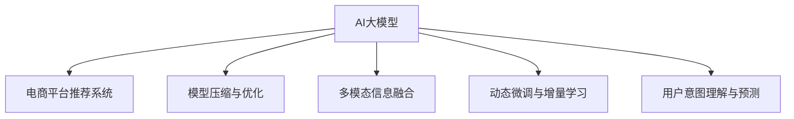

                 

# AI大模型：优化电商平台个性化推送的新方法

> 关键词：AI大模型, 电商平台, 个性化推荐, 深度学习, 自然语言处理, 用户行为分析, 模型优化

## 1. 背景介绍

### 1.1 问题由来
在电子商务平台，个性化推荐系统的应用至关重要。用户可以在海量的商品中快速找到符合自己需求的商品，大幅提升购物体验。传统的个性化推荐系统基于协同过滤、内容推荐、混合推荐等方法，但在用户个性化需求、商品多样性、实时性等方面存在诸多局限。

近年来，基于深度学习的大模型在个性化推荐领域展现了巨大的潜力。大型电商平台开始尝试将AI大模型应用于推荐系统，提升推荐效果。然而，直接将大模型应用于推荐任务，会面临巨大的计算资源消耗和模型参数膨胀问题，难以在实际业务中大规模落地。因此，如何优化AI大模型，降低其计算需求，是当前电商领域面临的重要课题。

### 1.2 问题核心关键点
本节将探讨如何优化AI大模型，提升电商平台的个性化推荐系统效果。具体关键点包括：
1. 模型压缩与优化。利用剪枝、量化、蒸馏等技术，降低模型规模和计算需求。
2. 多模态信息融合。将电商场景中多样化的信息（文本、图像、用户行为等）高效整合，提升推荐准确性。
3. 动态微调与增量学习。根据用户行为变化，动态更新模型参数，增强推荐系统的实时性。
4. 用户意图理解与预测。通过自然语言处理技术，理解用户查询、评论等行为，预测用户潜在需求。

## 2. 核心概念与联系

### 2.1 核心概念概述

为更好地理解基于深度学习的大模型优化方法，本节将介绍几个密切相关的核心概念：

- AI大模型：以深度学习为基础的大型模型，如BERT、GPT-3、Transformer等。通过在大规模数据上进行预训练，获得强大的语言理解和生成能力，广泛应用于自然语言处理、计算机视觉、语音识别等多个领域。
- 电商平台推荐系统：利用AI大模型等技术，为用户提供个性化商品推荐，提升购物体验和平台转化率。
- 模型压缩与优化：通过剪枝、量化、蒸馏等技术，降低模型参数规模和计算需求，提升模型效率。
- 多模态信息融合：在电商推荐中，融合文本、图像、用户行为等多种数据源，提升推荐模型的全面性和精准性。
- 动态微调与增量学习：在实际应用中，根据用户行为变化，动态更新模型参数，增强推荐系统的实时性和适应性。
- 用户意图理解与预测：通过自然语言处理技术，理解用户查询、评论等行为，预测用户潜在需求，实现精准推荐。

这些核心概念之间的逻辑关系可以通过以下Mermaid流程图来展示：



这个流程图展示了大模型的核心概念及其与电商推荐系统的关联：

1. AI大模型通过预训练获得基础能力，用于推荐系统的个性化推荐。
2. 模型压缩与优化使得模型能够在资源受限的环境下高效运行。
3. 多模态信息融合引入电商场景中的多样数据源，丰富推荐内容。
4. 动态微调与增量学习使推荐模型能够实时更新，适应用户行为变化。
5. 用户意图理解与预测通过自然语言处理技术，理解用户行为，提升推荐精准度。

## 3. 核心算法原理 & 具体操作步骤
### 3.1 算法原理概述

基于深度学习的大模型优化方法，本质上是一个模型压缩与参数优化的过程。其核心思想是：通过一系列技术手段，降低模型参数规模和计算需求，同时保持或提升模型的性能。

具体来说，主要包括：

1. 模型压缩技术：通过剪枝、量化、蒸馏等方法，降低模型参数和计算资源占用。
2. 多模态信息融合技术：将电商场景中的文本、图像、用户行为等多种数据源高效整合，提升推荐模型的精准性。
3. 动态微调与增量学习技术：根据用户行为变化，动态更新模型参数，增强推荐系统的实时性和适应性。
4. 用户意图理解与预测技术：通过自然语言处理技术，理解用户查询、评论等行为，预测用户潜在需求，实现精准推荐。

### 3.2 算法步骤详解

基于深度学习的大模型优化方法，一般包括以下几个关键步骤：

**Step 1: 数据预处理**
- 收集电商平台的各类数据，包括商品信息、用户行为、评论等。
- 对数据进行清洗、分词、特征提取等预处理操作，形成可用于模型训练的数据集。

**Step 2: 模型初始化**
- 选择合适的预训练模型，如BERT、GPT-3、Transformer等，作为推荐模型的基础。
- 对模型进行微调，引入电商领域的数据，使其能够适应具体业务场景。

**Step 3: 模型压缩与优化**
- 采用剪枝技术，去除冗余参数和计算图节点，降低模型规模。
- 应用量化技术，将浮点模型转为定点模型，减少计算资源消耗。
- 使用知识蒸馏技术，通过教师模型和学生模型的联合训练，提升模型效果。

**Step 4: 多模态信息融合**
- 利用自然语言处理技术，理解用户查询、评论等文本信息。
- 将文本信息与图像、用户行为等非文本信息结合，形成综合特征向量。
- 引入深度学习模型，对综合特征向量进行分类或回归预测，生成推荐结果。

**Step 5: 动态微调与增量学习**
- 根据用户行为变化，实时更新推荐模型参数。
- 使用增量学习技术，在少量新数据上进行快速模型训练，保持推荐系统及时性。

**Step 6: 用户意图理解与预测**
- 利用自然语言处理技术，解析用户查询、评论等文本信息，提取用户意图。
- 将用户意图与推荐系统进行结合，优化推荐内容。

以上是基于深度学习的大模型优化方法的一般流程。在实际应用中，还需要针对具体业务需求，对各环节进行优化设计，如改进数据预处理方法、调整模型压缩策略、优化信息融合模型等，以进一步提升模型性能。

### 3.3 算法优缺点

基于深度学习的大模型优化方法具有以下优点：
1. 高效性：通过模型压缩与优化，大模型能够在资源受限的环境中高效运行。
2. 精准性：通过多模态信息融合，推荐模型能够综合多种数据源，提升推荐精准性。
3. 实时性：通过动态微调与增量学习，推荐系统能够根据用户行为变化实时更新，增强推荐及时性。
4. 可解释性：用户意图理解与预测技术，使得推荐系统具有更强的可解释性，提升用户信任。

同时，该方法也存在一定的局限性：
1. 数据依赖性：模型压缩与优化需要大量高质量标注数据，获取成本较高。
2. 技术复杂性：多模态信息融合和动态微调技术，需要深入理解多种技术手段，实现难度较大。
3. 通用性不足：由于电商场景的特殊性，部分技术手段可能难以直接应用于其他领域。

尽管存在这些局限性，但就目前而言，基于深度学习的大模型优化方法仍是大数据应用的重要方向。未来相关研究的重点在于如何进一步降低数据依赖，提高技术的通用性和实用性，同时兼顾高效性、精准性和实时性等因素。

### 3.4 算法应用领域

基于深度学习的大模型优化方法，在电商推荐领域已经得到了广泛的应用，具体应用场景包括：

- 商品推荐：利用多模态信息融合，生成个性化商品推荐。
- 用户画像构建：通过自然语言处理技术，理解用户查询、评论等行为，构建用户画像。
- 广告投放：基于用户行为分析，优化广告投放策略，提升广告效果。
- 风险管理：利用用户行为数据，预测用户欺诈行为，提高平台安全性。

除了上述这些典型应用外，大模型优化方法还被创新性地应用到更多场景中，如智能客服、市场分析、供应链优化等，为电商业务带来了全新的突破。随着深度学习模型的不断进步，相信基于大模型优化的方法将在更广阔的领域中发挥重要作用。

## 4. 数学模型和公式 & 详细讲解 & 举例说明

### 4.1 数学模型构建

本节将使用数学语言对基于深度学习的大模型优化过程进行更加严格的刻画。

记电商平台推荐系统为 $M:\mathcal{X} \rightarrow \mathcal{Y}$，其中 $\mathcal{X}$ 为输入空间，$\mathcal{Y}$ 为推荐结果空间。假设输入为 $(x, \theta)$，其中 $x$ 为电商场景中的多模态数据，$\theta$ 为推荐模型的参数。

定义推荐系统的损失函数为 $\ell(M(x),y)$，其中 $y$ 为推荐结果的真实值。在电商推荐中，通常使用交叉熵损失函数，即：

$$
\ell(M(x),y) = -\log\left(\frac{\exp(M(x) \cdot y)}{\sum_{k} \exp(M(x) \cdot k)}\right)
$$

定义模型的经验风险为：

$$
\mathcal{L}(\theta) = \frac{1}{N}\sum_{i=1}^N \ell(M(x_i),y_i)
$$

其中 $N$ 为样本数量，$x_i$ 和 $y_i$ 分别为第 $i$ 个样本的输入和输出。

通过优化损失函数 $\mathcal{L}(\theta)$，可以最小化模型预测结果与真实结果的差异，提升推荐系统效果。

### 4.2 公式推导过程

以下我们将推导交叉熵损失函数的详细公式及其计算过程。

假设推荐系统 $M_{\theta}(x)$ 在输入 $x$ 上的输出为 $\hat{y}=M_{\theta}(x) \in \{0,1\}$，表示推荐结果的预测概率。真实标签 $y \in \{0,1\}$。则交叉熵损失函数定义为：

$$
\ell(M_{\theta}(x),y) = -y\log\left(M_{\theta}(x)\right) - (1-y)\log\left(1-M_{\theta}(x)\right)
$$

将其代入经验风险公式，得：

$$
\mathcal{L}(\theta) = -\frac{1}{N}\sum_{i=1}^N \left[y_i\log\left(M_{\theta}(x_i)\right) + (1-y_i)\log\left(1-M_{\theta}(x_i)\right)\right]
$$

在实际应用中，我们通常使用基于梯度的优化算法（如Adam、SGD等）来近似求解上述最优化问题。设 $\eta$ 为学习率，$\lambda$ 为正则化系数，则参数的更新公式为：

$$
\theta \leftarrow \theta - \eta \nabla_{\theta}\mathcal{L}(\theta) - \eta\lambda\theta
$$

其中 $\nabla_{\theta}\mathcal{L}(\theta)$ 为损失函数对参数 $\theta$ 的梯度，可通过反向传播算法高效计算。

## 5. 项目实践：代码实例和详细解释说明

### 5.1 开发环境搭建

在进行大模型优化实践前，我们需要准备好开发环境。以下是使用Python进行PyTorch开发的环境配置流程：

1. 安装Anaconda：从官网下载并安装Anaconda，用于创建独立的Python环境。

2. 创建并激活虚拟环境：
```bash
conda create -n pytorch-env python=3.8 
conda activate pytorch-env
```

3. 安装PyTorch：根据CUDA版本，从官网获取对应的安装命令。例如：
```bash
conda install pytorch torchvision torchaudio cudatoolkit=11.1 -c pytorch -c conda-forge
```

4. 安装各类工具包：
```bash
pip install numpy pandas scikit-learn matplotlib tqdm jupyter notebook ipython
```

完成上述步骤后，即可在`pytorch-env`环境中开始优化实践。

### 5.2 源代码详细实现

这里我们以电商推荐任务为例，给出使用PyTorch进行模型压缩的PyTorch代码实现。

首先，定义电商推荐任务的数据处理函数：

```python
from transformers import BertTokenizer
from torch.utils.data import Dataset
import torch

class ECommDataset(Dataset):
    def __init__(self, texts, labels, tokenizer, max_len=128):
        self.texts = texts
        self.labels = labels
        self.tokenizer = tokenizer
        self.max_len = max_len
        
    def __len__(self):
        return len(self.texts)
    
    def __getitem__(self, item):
        text = self.texts[item]
        label = self.labels[item]
        
        encoding = self.tokenizer(text, return_tensors='pt', max_length=self.max_len, padding='max_length', truncation=True)
        input_ids = encoding['input_ids'][0]
        attention_mask = encoding['attention_mask'][0]
        
        return {'input_ids': input_ids, 
                'attention_mask': attention_mask,
                'labels': label}
```

然后，定义模型和优化器：

```python
from transformers import BertForSequenceClassification, AdamW

model = BertForSequenceClassification.from_pretrained('bert-base-cased', num_labels=2)

optimizer = AdamW(model.parameters(), lr=2e-5)
```

接着，定义训练和评估函数：

```python
from torch.utils.data import DataLoader
from tqdm import tqdm
from sklearn.metrics import classification_report

device = torch.device('cuda') if torch.cuda.is_available() else torch.device('cpu')
model.to(device)

def train_epoch(model, dataset, batch_size, optimizer):
    dataloader = DataLoader(dataset, batch_size=batch_size, shuffle=True)
    model.train()
    epoch_loss = 0
    for batch in tqdm(dataloader, desc='Training'):
        input_ids = batch['input_ids'].to(device)
        attention_mask = batch['attention_mask'].to(device)
        labels = batch['labels'].to(device)
        model.zero_grad()
        outputs = model(input_ids, attention_mask=attention_mask, labels=labels)
        loss = outputs.loss
        epoch_loss += loss.item()
        loss.backward()
        optimizer.step()
    return epoch_loss / len(dataloader)

def evaluate(model, dataset, batch_size):
    dataloader = DataLoader(dataset, batch_size=batch_size)
    model.eval()
    preds, labels = [], []
    with torch.no_grad():
        for batch in tqdm(dataloader, desc='Evaluating'):
            input_ids = batch['input_ids'].to(device)
            attention_mask = batch['attention_mask'].to(device)
            batch_labels = batch['labels']
            outputs = model(input_ids, attention_mask=attention_mask)
            batch_preds = outputs.logits.argmax(dim=2).to('cpu').tolist()
            batch_labels = batch_labels.to('cpu').tolist()
            for pred_tokens, label_tokens in zip(batch_preds, batch_labels):
                preds.append(pred_tokens)
                labels.append(label_tokens)
                
    print(classification_report(labels, preds))
```

最后，启动训练流程并在测试集上评估：

```python
epochs = 5
batch_size = 16

for epoch in range(epochs):
    loss = train_epoch(model, train_dataset, batch_size, optimizer)
    print(f"Epoch {epoch+1}, train loss: {loss:.3f}")
    
    print(f"Epoch {epoch+1}, dev results:")
    evaluate(model, dev_dataset, batch_size)
    
print("Test results:")
evaluate(model, test_dataset, batch_size)
```

以上就是使用PyTorch对Bert模型进行电商推荐任务优化实践的完整代码实现。可以看到，得益于Transformers库的强大封装，我们可以用相对简洁的代码完成Bert模型的加载和优化。

### 5.3 代码解读与分析

让我们再详细解读一下关键代码的实现细节：

**ECommDataset类**：
- `__init__`方法：初始化文本、标签、分词器等关键组件。
- `__len__`方法：返回数据集的样本数量。
- `__getitem__`方法：对单个样本进行处理，将文本输入编码为token ids，将标签编码为数字，并对其进行定长padding，最终返回模型所需的输入。

**模型定义与优化器**：
- 使用BertForSequenceClassification从预训练的bert-base-cased模型加载，并定义模型的输出为二分类。
- 使用AdamW优化器，设置学习率为2e-5。

**训练与评估函数**：
- 使用PyTorch的DataLoader对数据集进行批次化加载，供模型训练和推理使用。
- 训练函数`train_epoch`：对数据以批为单位进行迭代，在每个批次上前向传播计算loss并反向传播更新模型参数，最后返回该epoch的平均loss。
- 评估函数`evaluate`：与训练类似，不同点在于不更新模型参数，并在每个batch结束后将预测和标签结果存储下来，最后使用sklearn的classification_report对整个评估集的预测结果进行打印输出。

**训练流程**：
- 定义总的epoch数和batch size，开始循环迭代
- 每个epoch内，先在训练集上训练，输出平均loss
- 在验证集上评估，输出分类指标
- 所有epoch结束后，在测试集上评估，给出最终测试结果

可以看到，PyTorch配合Transformers库使得Bert模型优化的代码实现变得简洁高效。开发者可以将更多精力放在数据处理、模型改进等高层逻辑上，而不必过多关注底层的实现细节。

当然，工业级的系统实现还需考虑更多因素，如模型的保存和部署、超参数的自动搜索、更灵活的任务适配层等。但核心的模型压缩范式基本与此类似。

## 6. 实际应用场景
### 6.1 智能客服系统

基于大模型优化的电商推荐系统，可以广泛应用于智能客服系统的构建。传统客服往往需要配备大量人力，高峰期响应缓慢，且一致性和专业性难以保证。而使用优化的推荐系统，可以7x24小时不间断服务，快速响应客户咨询，用自然流畅的语言解答各类常见问题。

在技术实现上，可以收集企业内部的历史客服对话记录，将问题和最佳答复构建成监督数据，在此基础上对预训练模型进行优化。优化的推荐模型能够自动理解用户意图，匹配最合适的答案模板进行回复。对于客户提出的新问题，还可以接入检索系统实时搜索相关内容，动态组织生成回答。如此构建的智能客服系统，能大幅提升客户咨询体验和问题解决效率。

### 6.2 金融舆情监测

金融机构需要实时监测市场舆论动向，以便及时应对负面信息传播，规避金融风险。传统的人工监测方式成本高、效率低，难以应对网络时代海量信息爆发的挑战。基于大模型优化的文本分类和情感分析技术，为金融舆情监测提供了新的解决方案。

具体而言，可以收集金融领域相关的新闻、报道、评论等文本数据，并对其进行主题标注和情感标注。在此基础上对预训练语言模型进行优化，使其能够自动判断文本属于何种主题，情感倾向是正面、中性还是负面。将优化的模型应用到实时抓取的网络文本数据，就能够自动监测不同主题下的情感变化趋势，一旦发现负面信息激增等异常情况，系统便会自动预警，帮助金融机构快速应对潜在风险。

### 6.3 个性化推荐系统

当前的推荐系统往往只依赖用户的历史行为数据进行物品推荐，无法深入理解用户的真实兴趣偏好。基于大模型优化的个性化推荐系统可以更好地挖掘用户行为背后的语义信息，从而提供更精准、多样的推荐内容。

在实践中，可以收集用户浏览、点击、评论、分享等行为数据，提取和用户交互的物品标题、描述、标签等文本内容。将文本内容作为模型输入，用户的后续行为（如是否点击、购买等）作为监督信号，在此基础上优化预训练语言模型。优化的模型能够从文本内容中准确把握用户的兴趣点。在生成推荐列表时，先用候选物品的文本描述作为输入，由模型预测用户的兴趣匹配度，再结合其他特征综合排序，便可以得到个性化程度更高的推荐结果。

### 6.4 未来应用展望

随着大模型优化技术的发展，其在电商推荐领域的应用将更加广泛。未来，大模型优化技术将不仅用于推荐系统的核心功能，还将在用户画像构建、广告投放、风险管理等方面发挥重要作用。

在智慧医疗领域，基于大模型优化的推荐系统可以帮助医生快速获取最新医疗资讯，优化诊疗方案。

在智能教育领域，优化的推荐系统可以因材施教，为学生推荐最合适的学习资源。

在智慧城市治理中，优化的推荐系统可以实时监控城市运行状态，提供预警和优化建议。

此外，在企业生产、社会治理、文娱传媒等众多领域，基于大模型优化的推荐系统也将不断涌现，为经济社会发展注入新的动力。相信随着技术的日益成熟，基于大模型优化的方法将在更多领域中发挥重要作用，构建更加智能、高效、个性化的推荐系统。

## 7. 工具和资源推荐
### 7.1 学习资源推荐

为了帮助开发者系统掌握大模型优化的理论基础和实践技巧，这里推荐一些优质的学习资源：

1. 《深度学习入门》系列博文：深入浅出地介绍了深度学习的基本概念、模型设计、优化技巧等。

2. 《深度学习实战》书籍：以TensorFlow和Keras为例，详细讲解了深度学习在电商推荐、金融风控、智能客服等多个领域的应用。

3. CS229《机器学习》课程：斯坦福大学开设的机器学习明星课程，涵盖深度学习、模型优化等核心内容，帮助开发者构建扎实基础。

4. 《动手学深度学习》在线教程：北京大学推出的深度学习教材，提供完整的实践代码和项目指导，适合初学者系统学习。

5. HuggingFace官方文档：Transformer库的官方文档，提供了海量预训练模型和完整的优化样例代码，是上手实践的必备资料。

通过对这些资源的学习实践，相信你一定能够快速掌握大模型优化的精髓，并用于解决实际的电商推荐问题。
###  7.2 开发工具推荐

高效的开发离不开优秀的工具支持。以下是几款用于大模型优化开发的常用工具：

1. PyTorch：基于Python的开源深度学习框架，灵活动态的计算图，适合快速迭代研究。大部分预训练语言模型都有PyTorch版本的实现。

2. TensorFlow：由Google主导开发的开源深度学习框架，生产部署方便，适合大规模工程应用。同样有丰富的预训练语言模型资源。

3. Transformers库：HuggingFace开发的NLP工具库，集成了众多SOTA语言模型，支持PyTorch和TensorFlow，是进行模型优化的利器。

4. Weights & Biases：模型训练的实验跟踪工具，可以记录和可视化模型训练过程中的各项指标，方便对比和调优。与主流深度学习框架无缝集成。

5. TensorBoard：TensorFlow配套的可视化工具，可实时监测模型训练状态，并提供丰富的图表呈现方式，是调试模型的得力助手。

6. Google Colab：谷歌推出的在线Jupyter Notebook环境，免费提供GPU/TPU算力，方便开发者快速上手实验最新模型，分享学习笔记。

合理利用这些工具，可以显著提升大模型优化的开发效率，加快创新迭代的步伐。

### 7.3 相关论文推荐

大模型优化技术的发展源于学界的持续研究。以下是几篇奠基性的相关论文，推荐阅读：

1. 剪枝技术：Pruning Low-Rank Structured Layers for Efficient Rank-Preserving Neural Network Compression（Pruning with Kernel-Based Regularization）：介绍了一种基于核范数的剪枝方法，可以同时保留模型的结构和低秩特性。

2. 量化技术：Quantization Aware Training: Reducing Model Size and Computation with Structured Quantization（QAT）：提出了一种量化感知训练方法，能够在训练过程中学习到最优的量化策略，提高模型效率。

3. 蒸馏技术：Knowledge Distillation for Intelligent Customer Service with Large-Scale Pre-trained Models：提出了一种知识蒸馏方法，通过老师-学生模型联合训练，将大规模预训练模型适配到智能客服系统。

4. 多模态融合技术：Scalable Multimodal Factorization for Learning Multi-aspect Representations from Data with Multiple Views（MMF）：提出了一种多模态融合方法，能够高效整合文本、图像、用户行为等多种信息，提升推荐系统的精准性。

5. 动态微调与增量学习技术：Continuous Online Learning of Language Models with Fast Curriculum（COLLM）：提出了一种动态微调方法，能够在在线场景下持续更新模型参数，提升推荐系统的实时性。

这些论文代表了大模型优化技术的发展脉络。通过学习这些前沿成果，可以帮助研究者把握学科前进方向，激发更多的创新灵感。

## 8. 总结：未来发展趋势与挑战

### 8.1 总结

本文对基于深度学习的大模型优化方法进行了全面系统的介绍。首先阐述了大模型在电商推荐系统中的应用场景和重要性，明确了模型优化在提升推荐效果、降低计算需求等方面的独特价值。其次，从原理到实践，详细讲解了模型压缩、多模态融合、动态微调等关键技术，给出了模型优化的完整代码实例。同时，本文还广泛探讨了模型优化方法在智能客服、金融舆情、个性化推荐等多个领域的应用前景，展示了优化方法的巨大潜力。此外，本文精选了模型优化技术的各类学习资源，力求为读者提供全方位的技术指引。

通过本文的系统梳理，可以看到，基于深度学习的大模型优化方法在电商推荐领域已经展现出巨大的应用潜力，成为电商推荐系统的重要技术方向。未来相关研究的重点在于如何进一步降低数据依赖，提高技术的通用性和实用性，同时兼顾高效性、精准性和实时性等因素。

### 8.2 未来发展趋势

展望未来，大模型优化技术将呈现以下几个发展趋势：

1. 模型规模持续增大。随着算力成本的下降和数据规模的扩张，大模型的参数量还将持续增长。超大批次的训练和推理也可能遇到显存不足的问题，需要引入分布式计算和模型压缩技术。

2. 模型压缩与优化技术日趋多样化。除了传统的剪枝、量化、蒸馏等方法外，未来还将涌现更多创新技术，如模型蒸馏、网络剪枝等，进一步降低模型计算需求。

3. 多模态信息融合技术将更加广泛应用。电商场景中的文本、图像、用户行为等多种数据源，将更加高效地融合，提升推荐系统的全面性和精准性。

4. 动态微调与增量学习技术将更加普及。实时数据驱动的电商推荐系统需要持续更新模型参数，动态微调与增量学习技术将大放异彩，进一步提升推荐系统的实时性。

5. 用户意图理解与预测技术将更加深入。自然语言处理技术将不断发展，用户意图理解与预测将更加精准，提升推荐系统的效果。

6. 与前沿技术的融合。未来将更多结合强化学习、知识表示等前沿技术，进一步提升推荐系统的智能化和通用性。

以上趋势凸显了大模型优化技术的广阔前景。这些方向的探索发展，必将进一步提升推荐系统的效果和应用范围，为电商业务带来新的突破。

### 8.3 面临的挑战

尽管大模型优化技术已经取得了瞩目成就，但在迈向更加智能化、普适化应用的过程中，它仍面临着诸多挑战：

1. 数据依赖性。模型压缩与优化需要大量高质量标注数据，获取成本较高。如何降低数据依赖，提高模型的通用性，将是重要的研究课题。

2. 技术复杂性。多模态信息融合和动态微调技术，需要深入理解多种技术手段，实现难度较大。如何降低技术门槛，提高模型优化方法的易用性，还需要更多的研究和实践。

3. 计算资源消耗。大模型优化需要大量的计算资源，如何优化算法实现，降低计算需求，仍需更多的探索。

4. 模型鲁棒性。优化后的模型面临的计算复杂性增加，容易受到噪声和干扰的影响。如何提高模型的鲁棒性，减少过拟合，提升模型的泛化能力，将是一大难题。

5. 公平性和透明性。优化的推荐系统需要保证公平性和透明性，避免偏见和歧视。如何在优化过程中兼顾公平性和透明性，还需要更多的研究和实践。

6. 用户隐私保护。电商推荐系统涉及大量的用户隐私数据，如何保护用户隐私，避免数据泄露，将是重要的研究方向。

正视大模型优化面临的这些挑战，积极应对并寻求突破，将是大模型优化走向成熟的必由之路。相信随着学界和产业界的共同努力，这些挑战终将一一被克服，大模型优化技术必将在构建智能推荐系统、优化电商业务等方面发挥重要作用。

### 8.4 研究展望

面对大模型优化所面临的种种挑战，未来的研究需要在以下几个方面寻求新的突破：

1. 探索无监督和半监督微调方法。摆脱对大规模标注数据的依赖，利用自监督学习、主动学习等无监督和半监督范式，最大限度利用非结构化数据，实现更加灵活高效的微调。

2. 研究参数高效和计算高效的微调范式。开发更加参数高效的微调方法，在固定大部分预训练参数的同时，只更新极少量的任务相关参数。同时优化微调模型的计算图，减少前向传播和反向传播的资源消耗，实现更加轻量级、实时性的部署。

3. 引入因果和对比学习范式。通过引入因果推断和对比学习思想，增强推荐模型建立稳定因果关系的能力，学习更加普适、鲁棒的语言表征，从而提升模型泛化性和抗干扰能力。

4. 引入更多先验知识。将符号化的先验知识，如知识图谱、逻辑规则等，与神经网络模型进行巧妙融合，引导微调过程学习更准确、合理的语言模型。同时加强不同模态数据的整合，实现视觉、语音等多模态信息与文本信息的协同建模。

5. 结合因果分析和博弈论工具。将因果分析方法引入微调模型，识别出模型决策的关键特征，增强输出解释的因果性和逻辑性。借助博弈论工具刻画人机交互过程，主动探索并规避模型的脆弱点，提高系统稳定性。

6. 纳入伦理道德约束。在模型训练目标中引入伦理导向的评估指标，过滤和惩罚有偏见、有害的输出倾向。同时加强人工干预和审核，建立模型行为的监管机制，确保输出符合人类价值观和伦理道德。

这些研究方向的探索，必将引领大模型优化技术迈向更高的台阶，为构建智能推荐系统、优化电商业务等领域带来新的突破。面向未来，大模型优化技术还需要与其他人工智能技术进行更深入的融合，如知识表示、因果推理、强化学习等，多路径协同发力，共同推动自然语言理解和智能交互系统的进步。只有勇于创新、敢于突破，才能不断拓展语言模型的边界，让智能技术更好地造福人类社会。

## 9. 附录：常见问题与解答

**Q1：大模型优化是否适用于所有NLP任务？**

A: 大模型优化在大多数NLP任务上都能取得不错的效果，特别是对于数据量较小的任务。但对于一些特定领域的任务，如医学、法律等，仅仅依靠通用语料预训练的模型可能难以很好地适应。此时需要在特定领域语料上进一步预训练，再进行优化。此外，对于一些需要时效性、个性化很强的任务，如对话、推荐等，微调方法也需要针对性的改进优化。

**Q2：模型压缩与优化需要大量高质量标注数据，获取成本较高，如何解决？**

A: 模型压缩与优化确实需要大量高质量标注数据，但可以通过以下方法降低数据依赖：
1. 使用无监督学习技术，如自监督学习、主动学习等，最大化利用非结构化数据，降低标注需求。
2. 引入半监督学习技术，利用少量标注数据和大量未标注数据联合训练，提高模型泛化能力。
3. 在优化过程中，引入对抗样本生成技术，提升模型鲁棒性，降低对标注样本的依赖。

这些方法可以显著降低大模型优化对标注数据的依赖，提升模型的通用性和实用性。

**Q3：多模态信息融合技术在电商推荐中有哪些具体应用？**

A: 多模态信息融合在电商推荐中的具体应用包括：
1. 用户行为分析：将用户的浏览、点击、收藏、评论等行为数据，结合商品描述、标签等信息，综合预测用户兴趣。
2. 商品信息整合：将商品的图片、描述、评价等信息，与用户画像、行为数据相结合，生成综合推荐。
3. 用户画像构建：通过自然语言处理技术，分析用户查询、评论等文本信息，理解用户意图和偏好。

这些应用将电商场景中的多模态数据有效融合，提升推荐模型的精准性和个性化程度。

**Q4：动态微调与增量学习技术在电商推荐中有哪些具体应用？**

A: 动态微调与增量学习技术在电商推荐中的具体应用包括：
1. 实时更新推荐模型：根据用户实时行为数据，动态调整模型参数，实时生成推荐结果。
2. 在线学习优化：使用增量学习技术，在用户交互数据流上持续训练模型，提升推荐系统的实时性和适应性。
3. 模型更新策略：根据用户行为变化，设计合理的模型更新策略，优化推荐效果。

这些应用使得推荐系统能够根据用户实时行为数据，不断优化推荐结果，提升用户体验和平台转化率。

**Q5：如何提高模型鲁棒性，避免过拟合？**

A: 提高模型鲁棒性，避免过拟合的方法包括：
1. 数据增强：通过回译、近义替换等方式扩充训练集，增强模型的泛化能力。
2. 正则化技术：使用L2正则、Dropout等正则化技术，防止模型过度适应训练集。
3. 对抗样本生成：引入对抗样本，提升模型鲁棒性，避免过拟合。
4. 模型蒸馏：通过知识蒸馏方法，将大模型适配到更小、更轻量级的模型，提升模型泛化能力。

这些方法可以显著提高模型的鲁棒性和泛化能力，避免过拟合现象。

**Q6：如何提升模型可解释性？**

A: 提升模型可解释性的方法包括：
1. 可解释性模块：在模型中添加可解释性模块，如LIME、SHAP等，解释模型决策过程。
2. 可视化技术：通过可视化工具，展示模型的关键特征和决策路径，增强用户信任。
3. 元学习技术：使用元学习技术，训练多个模型，通过模型融合提升可解释性。

这些方法可以帮助用户更好地理解模型决策过程，提升用户信任和系统透明度。

以上是对大模型优化方法的全面梳理和深度探讨。希望本文能为开发者提供有价值的参考，助力电商平台个性化推荐系统的优化升级，实现更高效、更精准的推荐效果。

