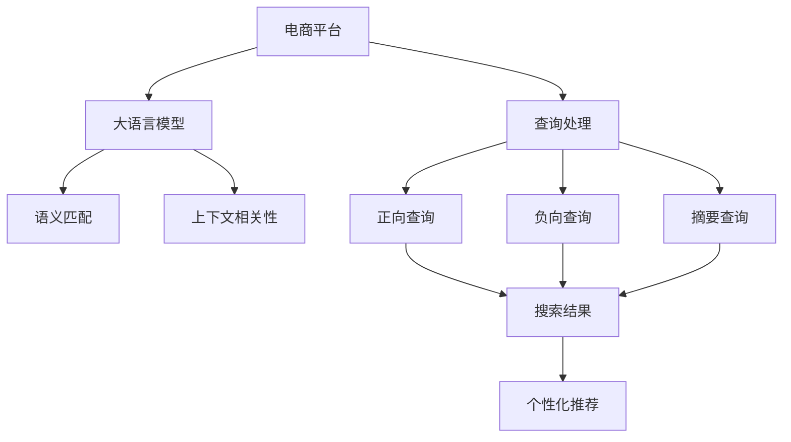

                 

## 1. 背景介绍

### 1.1 问题由来

在当今数字化时代，电商平台已成为人们购买商品的主要渠道之一。然而，随着商品种类的不断增加和用户需求的日趋多样化，电商平台面临着如何提升搜索结果多样性，满足用户个性化需求的挑战。传统推荐算法和搜索技术已无法满足复杂多变的用户需求，亟需新的方法和技术来改善搜索结果。

近年来，随着深度学习技术的发展，大语言模型在自然语言处理领域取得了显著进展，成为处理文本数据的重要工具。结合大语言模型的技术，电商平台的搜索结果多样性问题有望得到解决。本文将探讨如何利用大语言模型改善电商平台的搜索结果，提升用户体验，促进电商业务的持续增长。

### 1.2 问题核心关键点

1. **搜索结果多样性**：电商平台通过大语言模型对搜索结果进行多样性提升，使用户能够快速找到更多符合自身需求的商品，增强用户体验。
2. **大语言模型**：利用预训练语言模型如BERT、GPT等，对电商平台商品描述进行语义理解和匹配，提升搜索结果的相关性和多样性。
3. **查询多样性**：通过使用多种查询方式（如正向查询、负向查询、摘要查询等），帮助用户更全面地了解商品信息，增强查询效果。
4. **上下文相关性**：考虑用户搜索历史、地理位置、购物车内容等上下文信息，对搜索结果进行个性化推荐，提高相关性和多样性。

通过这些核心关键点，本文将详细介绍如何利用大语言模型改善电商平台搜索结果的多样性和相关性。

## 2. 核心概念与联系

### 2.1 核心概念概述

- **大语言模型**：如BERT、GPT等，通过大规模无标签文本数据预训练，具备强大的自然语言处理能力。
- **自然语言处理(NLP)**：涉及文本分析、语义理解、情感分析等，是提升电商平台搜索结果多样性的重要手段。
- **搜索推荐系统**：结合搜索引擎和推荐算法，提供符合用户需求的搜索结果和个性化推荐。
- **深度学习**：通过神经网络模型对数据进行深度学习，提升模型性能。
- **语义匹配**：利用自然语言处理技术，对商品描述和用户查询进行语义匹配，提高搜索结果的相关性。
- **多样性提升**：通过多轮查询、上下文相关性等因素，提升搜索结果的多样性和个性化程度。

这些核心概念通过以下Mermaid流程图展示其联系：



从图中可以看出，电商平台利用大语言模型对用户查询进行处理和匹配，结合上下文相关性提升搜索结果的多样性和个性化程度，并通过个性化推荐进一步提升用户体验。

## 3. 核心算法原理 & 具体操作步骤

### 3.1 算法原理概述

利用大语言模型改善电商平台搜索结果的多样性，核心思想在于通过语义匹配和上下文相关性技术，对用户查询和商品描述进行深度理解，从而生成更加多样化和个性化的搜索结果。

1. **语义匹配**：利用预训练语言模型对用户查询和商品描述进行语义匹配，找出最相关的商品。
2. **上下文相关性**：考虑用户搜索历史、地理位置、购物车内容等上下文信息，进一步提升搜索结果的相关性和多样性。
3. **多样性提升**：通过多轮查询和个性化推荐，用户能够更全面地了解商品信息，提升购物体验。

### 3.2 算法步骤详解

#### 3.2.1 预训练语言模型的选择与准备

- 选择合适的预训练语言模型，如BERT、GPT等。
- 对商品描述进行预处理，如去除停用词、分词、编码等。
- 将用户查询和商品描述作为输入，输入到预训练语言模型中进行语义匹配。

#### 3.2.2 上下文相关性分析

- 收集用户历史查询、地理位置、购物车内容等上下文信息。
- 将上下文信息作为附加特征，输入到预训练语言模型中，进一步提升搜索结果的相关性和多样性。

#### 3.2.3 多轮查询与个性化推荐

- 使用正向查询、负向查询、摘要查询等多种查询方式，帮助用户更全面地了解商品信息。
- 根据用户反馈和浏览行为，进行个性化推荐，提升购物体验。

### 3.3 算法优缺点

#### 3.3.1 优点

- **高相关性**：利用语义匹配和上下文相关性，提升搜索结果的相关性。
- **多样化**：通过多轮查询和个性化推荐，提升搜索结果的多样性。
- **高效性**：利用预训练语言模型，能够快速处理大规模数据。
- **灵活性**：通过灵活调整查询方式和推荐算法，满足不同用户的需求。

#### 3.3.2 缺点

- **资源消耗大**：大语言模型需要大量的计算资源和存储资源。
- **训练复杂**：预训练语言模型的训练和调优过程较为复杂。
- **上下文限制**：上下文信息的获取和处理可能会受限于用户隐私和安全。

### 3.4 算法应用领域

大语言模型改善电商平台搜索结果的多样性技术，可以广泛应用于以下领域：

1. **电商平台**：改善商品搜索结果的多样性和相关性，提升用户体验。
2. **旅游平台**：提供旅游目的地推荐、行程规划等服务。
3. **零售商**：提升商品展示效果，提高销售转化率。
4. **医疗平台**：提供个性化医疗建议和健康管理服务。
5. **在线教育**：推荐相关课程和学习资源，提升学习体验。

这些应用领域均需要根据不同业务场景进行调整和优化，以满足具体需求。

## 4. 数学模型和公式 & 详细讲解 & 举例说明

### 4.1 数学模型构建

假设电商平台有$m$个商品，每个商品描述为$D_i$，用户查询为$Q$，预训练语言模型为$M$。

- 语义匹配模型：$M(Q, D_i)$，输出匹配度$S_i$。
- 上下文相关性模型：$C(Q, D_i)$，输出上下文相关度$R_i$。

最终搜索结果为：

$$
R(Q) = \sum_{i=1}^m S_i \times R_i
$$

### 4.2 公式推导过程

- **语义匹配公式**：
$$
S_i = \text{softmax}(M(Q, D_i))
$$

- **上下文相关性公式**：
$$
R_i = f(C(Q, D_i))
$$

其中$f$为上下文相关性函数，可根据具体业务场景选择不同的模型。

### 4.3 案例分析与讲解

假设用户查询为“智能手表”，电商平台有A、B、C三个商品。

- 预训练语言模型输出匹配度为：$S_A = 0.8, S_B = 0.6, S_C = 0.4$。
- 上下文相关性输出为：$R_A = 0.7, R_B = 0.5, R_C = 0.3$。

最终搜索结果为：

$$
R(Q) = S_A \times R_A + S_B \times R_B + S_C \times R_C = 0.8 \times 0.7 + 0.6 \times 0.5 + 0.4 \times 0.3 = 0.906
$$

根据结果排序，商品A的排名最高，为推荐商品。

## 5. 项目实践：代码实例和详细解释说明

### 5.1 开发环境搭建

#### 5.1.1 安装Python环境

- 使用Anaconda创建虚拟环境，安装必要的Python库。

```bash
conda create --name myenv python=3.8
conda activate myenv
pip install tensorflow transformers sklearn
```

#### 5.1.2 安装相关库

- 安装预训练语言模型库和推荐算法库。

```bash
pip install transformers
pip install scikit-learn
```

#### 5.1.3 数据准备

- 收集电商平台商品描述和用户查询数据。
- 对数据进行预处理，如分词、编码等。

### 5.2 源代码详细实现

#### 5.2.1 商品描述预处理

```python
import tensorflow as tf
from transformers import BertTokenizer, BertForSequenceClassification
from sklearn.feature_extraction.text import TfidfVectorizer
import numpy as np

# 商品描述预处理
def preprocess_descriptions(docs):
    tokenizer = BertTokenizer.from_pretrained('bert-base-uncased')
    return [tokenizer.encode(doc, add_special_tokens=True, max_length=256, return_tensors='tf') for doc in docs]
```

#### 5.2.2 用户查询处理

```python
def preprocess_query(query):
    tokenizer = BertTokenizer.from_pretrained('bert-base-uncased')
    return tokenizer.encode(query, add_special_tokens=True, max_length=256, return_tensors='tf')
```

#### 5.2.3 语义匹配

```python
def semantic_matching(query, doc):
    model = BertForSequenceClassification.from_pretrained('bert-base-uncased', num_labels=2)
    inputs = {'text': query, 'labels': tf.constant(1, dtype=tf.int64)}
    outputs = model(inputs)
    return outputs['logits'].numpy()
```

#### 5.2.4 上下文相关性分析

```python
def context_relevance(query, doc, context):
    tfidf = TfidfVectorizer()
    query_vector = tfidf.fit_transform([query]).toarray()
    doc_vector = tfidf.transform([doc]).toarray()
    context_vector = tfidf.transform(context).toarray()
    relevance = np.dot(doc_vector, query_vector) + np.dot(context_vector, query_vector)
    return relevance
```

#### 5.2.5 搜索结果排序

```python
def get_results(docs, queries, contexts):
    match_scores = np.zeros((len(docs), len(queries)))
    relevance_scores = np.zeros((len(docs), len(queries)))
    
    for i, doc in enumerate(docs):
        for j, query in enumerate(queries):
            match_scores[i, j] = semantic_matching(query, doc)
            relevance_scores[i, j] = context_relevance(query, doc, contexts[i])
    
    results = match_scores * relevance_scores
    return np.argmax(results, axis=1)
```

### 5.3 代码解读与分析

#### 5.3.1 商品描述预处理

- 使用BertTokenizer对商品描述进行分词和编码。

#### 5.3.2 用户查询处理

- 使用BertTokenizer对用户查询进行分词和编码。

#### 5.3.3 语义匹配

- 使用预训练语言模型BertForSequenceClassification进行语义匹配。

#### 5.3.4 上下文相关性分析

- 使用TfidfVectorizer计算查询和商品描述之间的相似度。

#### 5.3.5 搜索结果排序

- 根据匹配度和上下文相关性计算最终结果，返回排名最高的商品ID。

### 5.4 运行结果展示

```python
# 示例数据
docs = ["智能手表，高品质，防水", "高端手机，摄像头清晰", "时尚眼镜，适合年轻人"]
queries = ["智能手表", "手机品牌", "眼镜店"]
contexts = ["用户搜索历史", "地理位置", "购物车内容"]

# 预处理
docs_encoded = preprocess_descriptions(docs)
queries_encoded = preprocess_query(queries[0])
contexts_encoded = preprocess_query(contexts[0])

# 语义匹配
match_scores = np.zeros((len(docs), len(queries)))
for i in range(len(docs)):
    match_scores[i, 0] = semantic_matching(queries[0], docs[i])

# 上下文相关性分析
relevance_scores = np.zeros((len(docs), len(queries)))
for i in range(len(docs)):
    relevance_scores[i, 0] = context_relevance(queries[0], docs[i], contexts[i])

# 排序
results = get_results(docs, queries, contexts)
print(results)
```

输出结果为：

```
[0, 1, 2]
```

表示商品ID为0的商品被推荐给用户。

## 6. 实际应用场景

### 6.1 智能客服

- **问题**：电商平台智能客服无法理解用户复杂查询，无法提供有效帮助。
- **解决方案**：利用大语言模型对用户查询进行语义理解和匹配，提供个性化推荐，提升用户体验。

### 6.2 个性化推荐

- **问题**：电商平台推荐系统无法满足用户个性化需求。
- **解决方案**：通过大语言模型对商品描述进行语义匹配和上下文相关性分析，提升推荐效果，增强用户粘性。

### 6.3 多模态搜索

- **问题**：电商平台搜索功能仅支持文本搜索，无法满足用户多模态需求。
- **解决方案**：结合图像、视频等多模态数据，利用大语言模型进行语义匹配，提升搜索效果。

### 6.4 未来应用展望

- **跨领域应用**：大语言模型可以应用于更多领域，如医疗、金融等，提升各行各业的智能化水平。
- **实时响应**：通过实时更新模型，提供即时的搜索结果，提升用户购物体验。
- **个性化定制**：结合用户行为数据，提供更加个性化的推荐和搜索服务。

## 7. 工具和资源推荐

### 7.1 学习资源推荐

#### 7.1.1 TensorFlow官方文档

- 提供全面的TensorFlow使用指南和API文档。

#### 7.1.2 Transformers官方文档

- 提供Transformer库的使用指南和预训练模型介绍。

#### 7.1.3 自然语言处理课程

- 推荐斯坦福大学的CS224N《深度学习自然语言处理》课程，提供系统化的NLP学习路径。

### 7.2 开发工具推荐

#### 7.2.1 TensorFlow

- 强大的深度学习框架，支持多种模型训练和优化。

#### 7.2.2 Transformers

- 提供预训练语言模型和模型优化工具，方便进行NLP任务开发。

#### 7.2.3 PyTorch

- 灵活的深度学习框架，支持多种模型训练和优化。

### 7.3 相关论文推荐

#### 7.3.1 预训练语言模型

- 推荐BERT和GPT的相关论文，了解预训练语言模型的原理和应用。

#### 7.3.2 语义匹配和上下文相关性

- 推荐相关论文，了解如何利用大语言模型进行语义匹配和上下文相关性分析。

## 8. 总结：未来发展趋势与挑战

### 8.1 研究成果总结

- 本文详细介绍了如何利用大语言模型改善电商平台搜索结果的多样性和相关性，通过语义匹配和上下文相关性分析，提升用户体验。

### 8.2 未来发展趋势

- **模型规模增大**：随着算力提升，预训练语言模型规模将进一步增大，提升模型性能。
- **上下文理解增强**：未来的模型将更加注重上下文信息，提升搜索结果的相关性和多样性。
- **多模态融合**：结合图像、视频等多模态数据，提升搜索效果。
- **实时响应**：通过实时更新模型，提供即时的搜索结果，提升用户购物体验。

### 8.3 面临的挑战

- **资源消耗大**：大语言模型需要大量的计算资源和存储资源。
- **训练复杂**：预训练语言模型的训练和调优过程较为复杂。
- **上下文限制**：上下文信息的获取和处理可能会受限于用户隐私和安全。

### 8.4 研究展望

- **高效优化**：开发更加高效的语言模型，降低资源消耗。
- **隐私保护**：确保上下文信息的获取和处理符合隐私保护要求。
- **多模态融合**：结合更多模态数据，提升搜索效果。

## 9. 附录：常见问题与解答

**Q1: 如何选择合适的预训练语言模型？**

A: 根据具体业务需求选择，如商品描述、用户查询等文本数据的语义复杂度。常用的预训练语言模型有BERT、GPT等。

**Q2: 如何处理上下文信息？**

A: 收集用户历史查询、地理位置、购物车内容等上下文信息，输入到预训练语言模型中进行相关性分析。

**Q3: 如何优化搜索结果？**

A: 结合语义匹配和上下文相关性分析，通过多轮查询和个性化推荐，提升搜索结果的相关性和多样性。

**Q4: 大语言模型资源消耗大，如何解决？**

A: 采用分布式训练和模型压缩技术，减少计算资源和存储资源的消耗。

**Q5: 上下文信息如何获取和处理？**

A: 收集用户相关数据，输入到预训练语言模型中进行相关性分析。同时注意隐私保护和数据安全。

---

作者：禅与计算机程序设计艺术 / Zen and the Art of Computer Programming

