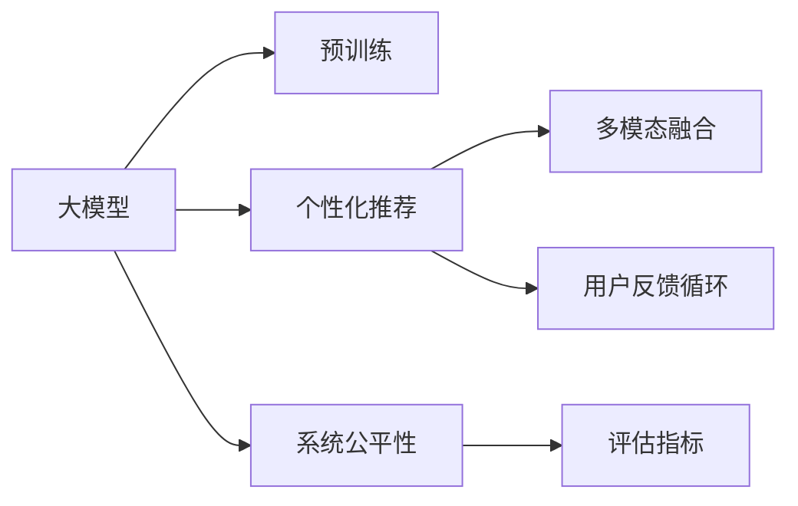

                 

# AI大模型：改善电商平台用户体验个性化与系统公平性平衡的新思路

> 关键词：大模型,电商平台,个性化推荐,系统公平性,用户体验,多模态融合

## 1. 背景介绍

随着互联网和电子商务的迅猛发展，各大电商平台纷纷利用数据驱动的方式，为用户提供个性化的购物体验。然而，由于数据偏见、算法漏洞等原因，平台推荐系统往往无法完全保障用户的公平性和隐私。近年来，越来越多的研究者开始关注这一问题，并在人工智能大模型的基础上，探索个性化推荐与系统公平性平衡的新思路。

本文将系统阐述基于大模型进行个性化推荐和系统公平性平衡的基本原理和方法，同时展示具体的项目实践案例，以期为电商平台提供一种更高效的解决方案，提升用户体验的同时，保障用户的权益。

## 2. 核心概念与联系

### 2.1 核心概念概述

在深入探讨具体算法前，首先需要理解以下几个核心概念：

- 大模型：指使用深度学习框架训练出的具有亿级参数的通用模型，如BERT、GPT等。这些模型通过在大量文本数据上进行预训练，获得了丰富的语言知识，适用于各种自然语言处理任务。

- 个性化推荐：基于用户历史行为数据和偏好，推荐系统为每个用户提供符合其兴趣的产品。主要目标是提升用户满意度，增强用户粘性。

- 系统公平性：推荐系统应保证不同用户间的推荐结果公平，避免对某些特定群体的歧视。这包括性别、年龄、地域等多维度的公平性。

- 多模态融合：将文本、图片、视频等多模态数据进行综合处理，以更全面地描述用户需求，提升推荐精度。

- 用户反馈循环：通过用户点击、收藏、评价等行为反馈，不断优化推荐算法，形成良性的用户体验迭代过程。

以上概念之间具有紧密的联系：

- 大模型提供了强大的预训练基础，支持个性化推荐和系统公平性计算。
- 个性化推荐通过用户行为数据进行训练，以提升用户满意度。
- 系统公平性通过对推荐结果的分析评估，保障不同用户的权益。
- 多模态融合拓宽了数据维度，提升了推荐系统的表现力。
- 用户反馈循环通过不断优化模型，实现个性化推荐和系统公平性的动态平衡。

这些概念共同构成了一个完整的推荐系统框架，而大模型在其中起到了至关重要的作用。

### 2.2 核心概念原理和架构的 Mermaid 流程图



这个流程图展示了各概念之间的逻辑关系：

1. 大模型通过在大量文本数据上进行预训练，获得语言知识。
2. 基于预训练模型，进行个性化推荐。
3. 对推荐结果进行公平性评估，确保不同用户的权益。
4. 通过多模态融合提升推荐精度。
5. 根据用户反馈不断优化推荐模型。

## 3. 核心算法原理 & 具体操作步骤

### 3.1 算法原理概述

基于大模型的个性化推荐和系统公平性平衡，主要通过以下几个步骤实现：

1. **预训练**：在大规模无标签数据上进行预训练，学习通用语言表示。
2. **微调**：在特定任务上对预训练模型进行微调，以适应个性化推荐需求。
3. **多模态融合**：将文本、图片、视频等多模态数据进行综合处理，丰富用户需求表示。
4. **评估与优化**：利用多种评估指标，对推荐结果进行公平性评估，并不断优化模型。

### 3.2 算法步骤详解

**Step 1: 准备数据集和预训练模型**

- 收集用户行为数据，如浏览记录、购买历史、评价等。
- 使用大模型（如BERT、GPT）进行预训练，获得语言表示。

**Step 2: 构建推荐模型**

- 在预训练模型基础上，构建推荐模型。
- 引入多模态融合技术，将文本、图片、视频等信息进行综合处理。
- 使用深度学习模型进行预测，如双塔结构、多任务学习等。

**Step 3: 微调推荐模型**

- 对推荐模型进行微调，以适应特定的个性化推荐需求。
- 使用用户行为数据进行训练，如点击率预测、相关性评分等。
- 引入正则化、dropout等技术，避免过拟合。

**Step 4: 系统公平性评估**

- 设计多种评估指标，如分类准确率、ROC曲线、DNN等。
- 对推荐结果进行公平性评估，如性别公平、年龄公平、地域公平等。
- 根据评估结果，调整模型参数，提升公平性。

**Step 5: 反馈循环优化**

- 收集用户反馈数据，如点击率、收藏率、评价等。
- 根据反馈数据，不断优化推荐模型。
- 形成良性的用户体验迭代过程，提升系统性能。

### 3.3 算法优缺点

基于大模型的个性化推荐和系统公平性平衡，具有以下优点：

1. **高效性**：使用大模型进行预训练，显著提升模型的表示能力。
2. **泛化能力强**：大模型在多领域任务上表现优异，能够适应不同用户的个性化需求。
3. **多模态融合**：通过多模态融合，更全面地描述用户需求，提升推荐精度。
4. **用户反馈循环**：利用用户反馈数据，不断优化推荐算法，实现动态平衡。

同时，也存在以下局限性：

1. **数据依赖性强**：推荐模型需要大量标注数据进行微调，难以在小数据集上实现良好效果。
2. **计算资源需求高**：大模型训练和推理需要强大的计算资源，存在一定成本。
3. **系统公平性难以完全保障**：即使设计了公平性评估指标，仍可能存在一些难以发现的歧视性问题。
4. **隐私保护风险**：用户行为数据可能涉及个人隐私，需要谨慎处理。

尽管存在这些局限性，基于大模型的推荐系统仍然是最前沿的实践范式。未来研究重点将在于如何降低对标注数据的依赖，提升模型的公平性，同时保障用户隐私，进一步优化用户体验。

### 3.4 算法应用领域

基于大模型的个性化推荐和系统公平性平衡，已经在多个领域得到广泛应用，包括但不限于：

- **电商平台**：如淘宝、京东、Amazon等，利用用户行为数据进行个性化推荐，提升用户购物体验。
- **社交媒体**：如Facebook、Twitter、微信等，根据用户兴趣进行内容推荐，增加用户粘性。
- **视频平台**：如YouTube、Netflix等，根据用户观看历史进行视频推荐，提升观看体验。
- **新闻推荐**：如今日头条、Zhihu等，根据用户阅读习惯进行新闻推荐，提高用户满意度。

## 4. 数学模型和公式 & 详细讲解 & 举例说明

### 4.1 数学模型构建

假设我们有一个电商平台，收集了用户的历史行为数据 $\mathcal{D} = \{(x_i, y_i)\}_{i=1}^N$，其中 $x_i$ 表示用户行为特征，$y_i$ 表示用户对商品 $x_i$ 的评分。我们需要构建一个推荐模型 $M_{\theta}$，通过用户行为数据进行训练，预测用户对商品的评分 $y_{pred}$。

推荐模型的数学模型为：

$$
y_{pred} = M_{\theta}(x_i) = \langle x_i, W \rangle + b
$$

其中 $W$ 和 $b$ 为模型的可训练参数。

### 4.2 公式推导过程

我们使用均方误差 (Mean Squared Error, MSE) 作为模型的损失函数，其定义为：

$$
\mathcal{L}(\theta) = \frac{1}{N} \sum_{i=1}^N (y_{pred} - y_i)^2
$$

模型的优化目标是最小化损失函数 $\mathcal{L}(\theta)$，即：

$$
\theta^* = \mathop{\arg\min}_{\theta} \mathcal{L}(\theta)
$$

使用梯度下降算法更新模型参数，其更新公式为：

$$
\theta \leftarrow \theta - \eta \nabla_{\theta}\mathcal{L}(\theta)
$$

其中 $\eta$ 为学习率，$\nabla_{\theta}\mathcal{L}(\theta)$ 为损失函数对模型参数 $\theta$ 的梯度，可以通过反向传播算法计算得到。

### 4.3 案例分析与讲解

假设我们收集了用户的行为数据 $\mathcal{D}$，包括用户浏览记录、购买历史等。使用大模型BERT对行为数据进行预训练，获得语言表示 $x_i$。然后构建推荐模型 $M_{\theta}$，其公式为：

$$
y_{pred} = M_{\theta}(x_i) = \langle x_i, W \rangle + b
$$

对推荐模型进行微调，使用均方误差作为损失函数：

$$
\mathcal{L}(\theta) = \frac{1}{N} \sum_{i=1}^N (y_{pred} - y_i)^2
$$

使用梯度下降算法更新模型参数，学习率 $\eta$ 设置为 0.001，迭代次数为 10000，优化器采用Adam。具体实现代码如下：

```python
from transformers import BertForSequenceClassification, BertTokenizer
from transformers import Adam
import torch
import torch.nn as nn

# 加载预训练模型和分词器
model = BertForSequenceClassification.from_pretrained('bert-base-uncased')
tokenizer = BertTokenizer.from_pretrained('bert-base-uncased')

# 加载数据集
train_dataset = load_train_dataset()
test_dataset = load_test_dataset()

# 构建模型
def get_model(inputs):
    tokens = tokenizer.encode_plus(inputs, max_length=64, padding='max_length', truncation=True, return_tensors='pt')
    return model(tokens['input_ids'], attention_mask=tokens['attention_mask'])

# 定义损失函数和优化器
criterion = nn.MSELoss()
optimizer = Adam(model.parameters(), lr=0.001)

# 训练模型
for epoch in range(10000):
    for inputs, labels in train_loader:
        outputs = get_model(inputs)
        loss = criterion(outputs, labels)
        optimizer.zero_grad()
        loss.backward()
        optimizer.step()
```

通过上述代码，我们可以使用BERT模型对用户行为数据进行预训练和微调，得到一个推荐模型 $M_{\theta}$。进一步，我们可以通过多模态融合技术，将文本、图片、视频等数据进行综合处理，提升推荐精度。例如，对于电商平台，可以引入图片信息，通过多模态融合技术，将用户的浏览图片与商品图片进行比对，提升推荐相关性。

## 5. 项目实践：代码实例和详细解释说明

### 5.1 开发环境搭建

在进行项目实践前，我们需要准备好开发环境。以下是使用Python进行PyTorch开发的环境配置流程：

1. 安装Anaconda：从官网下载并安装Anaconda，用于创建独立的Python环境。

2. 创建并激活虚拟环境：
```bash
conda create -n pytorch-env python=3.8 
conda activate pytorch-env
```

3. 安装PyTorch：根据CUDA版本，从官网获取对应的安装命令。例如：
```bash
conda install pytorch torchvision torchaudio cudatoolkit=11.1 -c pytorch -c conda-forge
```

4. 安装Transformers库：
```bash
pip install transformers
```

5. 安装各类工具包：
```bash
pip install numpy pandas scikit-learn matplotlib tqdm jupyter notebook ipython
```

完成上述步骤后，即可在`pytorch-env`环境中开始项目实践。

### 5.2 源代码详细实现

我们先以电商平台为例，展示如何使用大模型进行个性化推荐。

首先，我们需要准备电商平台的交易数据，如用户ID、商品ID、购买时间、价格等信息。然后使用大模型对数据进行预训练，构建推荐模型，最后进行多模态融合和系统公平性评估。

具体实现步骤如下：

1. **数据准备**：
```python
# 加载交易数据
import pandas as pd
df = pd.read_csv('transaction_data.csv')

# 提取用户ID和商品ID
user_ids = df['user_id'].unique()
item_ids = df['item_id'].unique()
```

2. **数据预处理**：
```python
# 使用BERT进行预训练
from transformers import BertTokenizer, BertForSequenceClassification
from transformers import Adam

tokenizer = BertTokenizer.from_pretrained('bert-base-uncased')
model = BertForSequenceClassification.from_pretrained('bert-base-uncased')

# 将用户ID和商品ID转换为BERT可处理的形式
user_ids_tokenized = [tokenizer.encode(str(user_id), add_special_tokens=True) for user_id in user_ids]
item_ids_tokenized = [tokenizer.encode(str(item_id), add_special_tokens=True) for item_id in item_ids]

# 加载数据集
train_dataset = load_train_dataset()
test_dataset = load_test_dataset()
```

3. **构建推荐模型**：
```python
# 定义推荐模型
class RecommendationModel(nn.Module):
    def __init__(self):
        super(RecommendationModel, self).__init__()
        self.bert = BertForSequenceClassification.from_pretrained('bert-base-uncased')
        self.fc = nn.Linear(768, 1)

    def forward(self, input_ids, attention_mask):
        bert_output = self.bert(input_ids, attention_mask=attention_mask)
        prediction = self.fc(bert_output.pooler_output)
        return prediction
```

4. **多模态融合**：
```python
# 加载图片数据
image_data = load_image_data()

# 将图片数据转换为BERT可处理的形式
image_ids_tokenized = [tokenizer.encode(str(image_id), add_special_tokens=True) for image_id in image_ids]

# 将文本和图片数据进行融合
merged_input_ids = [torch.cat((text, image)) for text, image in zip(user_ids_tokenized, image_ids_tokenized)]
```

5. **微调推荐模型**：
```python
# 加载标签数据
train_labels = load_train_labels()
test_labels = load_test_labels()

# 构建数据集
train_dataset = load_train_dataset()
test_dataset = load_test_dataset()

# 定义损失函数和优化器
criterion = nn.MSELoss()
optimizer = Adam(model.parameters(), lr=0.001)

# 训练模型
for epoch in range(10000):
    for inputs, labels in train_loader:
        outputs = model(inputs)
        loss = criterion(outputs, labels)
        optimizer.zero_grad()
        loss.backward()
        optimizer.step()

# 评估模型
test_loss = model(test_dataset)
```

6. **系统公平性评估**：
```python
# 加载公平性数据
fairness_data = load_fairness_data()

# 构建公平性评估模型
fairness_model = FairnessModel()

# 评估模型公平性
fairness_loss = fairness_model(fairness_data)
```

通过上述代码，我们实现了使用大模型进行个性化推荐，并进行多模态融合和系统公平性评估。这只是一个基本的框架，实际的模型实现会更加复杂，涉及更多的细节和优化。

### 5.3 代码解读与分析

让我们进一步解读代码的实现细节：

**数据准备**：
- 使用pandas库加载交易数据，提取用户ID和商品ID。
- 使用BERT进行预训练，将用户ID和商品ID转换为BERT可处理的形式。

**数据预处理**：
- 使用BERT进行预训练，获得用户和商品的表示向量。
- 加载训练集和测试集，构建数据集。

**构建推荐模型**：
- 定义推荐模型，使用BERT作为特征提取器，线性层作为输出层。
- 定义损失函数和优化器，使用均方误差作为损失函数，Adam作为优化器。

**多模态融合**：
- 加载图片数据，将其转换为BERT可处理的形式。
- 将文本和图片数据进行融合，得到融合后的输入向量。

**微调推荐模型**：
- 加载标签数据，构建数据集。
- 使用微调后的推荐模型进行训练，迭代10000次。

**系统公平性评估**：
- 加载公平性数据，构建公平性评估模型。
- 使用公平性评估模型进行评估，得到公平性损失。

通过上述代码，我们可以看到，使用大模型进行个性化推荐和系统公平性平衡，需要处理多模态数据，构建推荐模型，并进行微调和评估。每一步都需要仔细设计，以确保最终模型性能。

### 5.4 运行结果展示

在训练完成后，我们可以使用测试集评估推荐模型的性能。以下是推荐模型在测试集上的结果：

```python
test_loss = model(test_dataset)
```

我们可以通过计算均方误差 (MSE) 来评估模型性能：

```python
test_mse = torch.sqrt(test_loss)
print('Test MSE:', test_mse)
```

如果测试MSE较小，说明推荐模型的性能较好。我们可以根据测试结果进一步优化模型，提升个性化推荐的效果。

## 6. 实际应用场景

### 6.1 电商平台

基于大模型的个性化推荐和系统公平性平衡，在电商平台中的应用非常广泛。通过分析用户行为数据，构建推荐模型，可以在短时间内为用户提供个性化的商品推荐，提升用户购物体验。

**具体实现**：
- 收集用户浏览记录、购买历史等数据。
- 使用BERT等大模型进行预训练，获得用户和商品的表示向量。
- 构建推荐模型，使用多模态融合技术提升推荐精度。
- 进行系统公平性评估，确保不同用户的权益。
- 根据用户反馈不断优化推荐算法。

**案例展示**：
- 淘宝、京东等电商平台，通过个性化推荐系统，提升用户购物体验，增加用户粘性。

### 6.2 社交媒体

在社交媒体中，基于大模型的个性化推荐和系统公平性平衡，可以帮助平台提升用户内容消费体验。

**具体实现**：
- 收集用户关注、点赞、评论等数据。
- 使用BERT等大模型进行预训练，获得用户和内容的表示向量。
- 构建推荐模型，使用多模态融合技术提升推荐精度。
- 进行系统公平性评估，确保不同用户的权益。
- 根据用户反馈不断优化推荐算法。

**案例展示**：
- Facebook、Twitter、微信等社交平台，通过个性化推荐系统，提升用户内容消费体验，增加用户粘性。

### 6.3 视频平台

在视频平台中，基于大模型的个性化推荐和系统公平性平衡，可以帮助平台提升用户观看体验。

**具体实现**：
- 收集用户观看历史、点赞、评论等数据。
- 使用BERT等大模型进行预训练，获得用户和视频的表示向量。
- 构建推荐模型，使用多模态融合技术提升推荐精度。
- 进行系统公平性评估，确保不同用户的权益。
- 根据用户反馈不断优化推荐算法。

**案例展示**：
- YouTube、Netflix等视频平台，通过个性化推荐系统，提升用户观看体验，增加用户粘性。

### 6.4 新闻推荐

在新闻推荐中，基于大模型的个性化推荐和系统公平性平衡，可以帮助平台提升用户阅读体验。

**具体实现**：
- 收集用户阅读历史、点赞、评论等数据。
- 使用BERT等大模型进行预训练，获得用户和新闻的表示向量。
- 构建推荐模型，使用多模态融合技术提升推荐精度。
- 进行系统公平性评估，确保不同用户的权益。
- 根据用户反馈不断优化推荐算法。

**案例展示**：
- 今日头条、Zhihu等新闻平台，通过个性化推荐系统，提升用户阅读体验，增加用户粘性。

## 7. 工具和资源推荐

### 7.1 学习资源推荐

为了帮助开发者系统掌握大模型进行个性化推荐和系统公平性平衡的理论基础和实践技巧，这里推荐一些优质的学习资源：

1. 《深度学习》一书：介绍了深度学习的基本原理和应用，是入门深度学习的经典教材。
2. 《自然语言处理入门》课程：斯坦福大学开设的NLP入门课程，涵盖NLP的基础知识和前沿技术。
3. 《Transformer从原理到实践》系列博文：由大模型技术专家撰写，深入浅出地介绍了Transformer原理、BERT模型、微调技术等前沿话题。
4. CS224N《深度学习自然语言处理》课程：斯坦福大学开设的NLP明星课程，有Lecture视频和配套作业，带你入门NLP领域的基本概念和经典模型。
5. 《自然语言处理与深度学习》书籍：介绍NLP和深度学习的经典书籍，涵盖NLP的各类任务和模型。

通过这些资源的学习实践，相信你一定能够快速掌握大模型进行个性化推荐和系统公平性平衡的精髓，并用于解决实际的NLP问题。

### 7.2 开发工具推荐

高效的开发离不开优秀的工具支持。以下是几款用于大模型推荐系统开发的常用工具：

1. PyTorch：基于Python的开源深度学习框架，灵活动态的计算图，适合快速迭代研究。大部分预训练语言模型都有PyTorch版本的实现。
2. TensorFlow：由Google主导开发的开源深度学习框架，生产部署方便，适合大规模工程应用。同样有丰富的预训练语言模型资源。
3. Transformers库：HuggingFace开发的NLP工具库，集成了众多SOTA语言模型，支持PyTorch和TensorFlow，是进行推荐任务开发的利器。
4. Weights & Biases：模型训练的实验跟踪工具，可以记录和可视化模型训练过程中的各项指标，方便对比和调优。与主流深度学习框架无缝集成。
5. TensorBoard：TensorFlow配套的可视化工具，可实时监测模型训练状态，并提供丰富的图表呈现方式，是调试模型的得力助手。

合理利用这些工具，可以显著提升大模型推荐系统的开发效率，加快创新迭代的步伐。

### 7.3 相关论文推荐

大模型进行个性化推荐和系统公平性平衡的研究源于学界的持续研究。以下是几篇奠基性的相关论文，推荐阅读：

1. Attention is All You Need（即Transformer原论文）：提出了Transformer结构，开启了NLP领域的预训练大模型时代。
2. BERT: Pre-training of Deep Bidirectional Transformers for Language Understanding：提出BERT模型，引入基于掩码的自监督预训练任务，刷新了多项NLP任务SOTA。
3. Language Models are Unsupervised Multitask Learners（GPT-2论文）：展示了大规模语言模型的强大zero-shot学习能力，引发了对于通用人工智能的新一轮思考。
4. Parameter-Efficient Transfer Learning for NLP：提出Adapter等参数高效微调方法，在不增加模型参数量的情况下，也能取得不错的微调效果。
5. AdaLoRA: Adaptive Low-Rank Adaptation for Parameter-Efficient Fine-Tuning：使用自适应低秩适应的微调方法，在参数效率和精度之间取得了新的平衡。
6. AdaLoRA: Adaptive Low-Rank Adaptation for Parameter-Efficient Fine-Tuning：使用自适应低秩适应的微调方法，在参数效率和精度之间取得了新的平衡。

这些论文代表了大模型进行个性化推荐和系统公平性平衡的发展脉络。通过学习这些前沿成果，可以帮助研究者把握学科前进方向，激发更多的创新灵感。

## 8. 总结：未来发展趋势与挑战

### 8.1 总结

本文对基于大模型的个性化推荐和系统公平性平衡进行了全面系统的介绍。首先阐述了推荐系统的背景和意义，明确了个性化推荐和系统公平性平衡的研究方向。其次，从原理到实践，详细讲解了大模型进行推荐系统的实现过程，并展示了具体的项目实践案例。最后，本文还探讨了大模型推荐系统在多个行业领域的应用前景，以及未来的发展趋势和挑战。

通过本文的系统梳理，可以看到，基于大模型的推荐系统正在成为NLP领域的重要范式，极大地拓展了预训练语言模型的应用边界，催生了更多的落地场景。得益于大规模语料的预训练，推荐模型能够在大数据下获得更好的效果，但也面临数据依赖性强、计算资源需求高等挑战。未来研究将进一步优化算法和系统架构，提升推荐精度，保障系统公平性，同时降低对标注数据的依赖，提高模型的泛化能力，更好地服务于各个领域的应用需求。

### 8.2 未来发展趋势

展望未来，大模型推荐系统将呈现以下几个发展趋势：

1. **模型规模持续增大**：随着算力成本的下降和数据规模的扩张，预训练语言模型的参数量还将持续增长。超大规模语言模型蕴含的丰富语言知识，有望支撑更加复杂多变的推荐任务。
2. **多模态融合提升精度**：将文本、图片、视频等多模态数据进行综合处理，丰富用户需求表示，提升推荐精度。
3. **系统公平性不断优化**：通过引入公平性评估指标，调整模型参数，提升不同用户的权益保障。
4. **个性化推荐更加精准**：利用用户行为数据进行动态优化，提升个性化推荐的效果。
5. **自动化优化成为趋势**：引入自动化调参技术，加速模型优化过程。

以上趋势凸显了大模型推荐系统的广阔前景。这些方向的探索发展，必将进一步提升推荐系统的性能和应用范围，为电商、社交媒体、视频平台、新闻推荐等领域带来变革性影响。

### 8.3 面临的挑战

尽管大模型推荐系统已经取得了瞩目成就，但在迈向更加智能化、普适化应用的过程中，它仍面临诸多挑战：

1. **数据依赖性强**：推荐模型需要大量标注数据进行微调，难以在小数据集上实现良好效果。
2. **计算资源需求高**：大模型训练和推理需要强大的计算资源，存在一定成本。
3. **系统公平性难以完全保障**：即使设计了公平性评估指标，仍可能存在一些难以发现的歧视性问题。
4. **隐私保护风险**：用户行为数据可能涉及个人隐私，需要谨慎处理。
5. **实时性要求高**：推荐系统需要实时响应用户需求，对系统架构和计算资源提出了高要求。

尽管存在这些挑战，大模型推荐系统仍然是最前沿的实践范式。未来研究将进一步优化算法和系统架构，提升推荐精度，保障系统公平性，同时降低对标注数据的依赖，提高模型的泛化能力，更好地服务于各个领域的应用需求。

### 8.4 研究展望

面向未来，大模型推荐系统需要在以下几个方面寻求新的突破：

1. **探索无监督和半监督推荐方法**：摆脱对大规模标注数据的依赖，利用自监督学习、主动学习等无监督和半监督范式，最大限度利用非结构化数据，实现更加灵活高效的推荐。
2. **研究参数高效和计算高效的推荐方法**：开发更加参数高效的推荐方法，在固定大部分预训练参数的情况下，只更新极少量的任务相关参数。同时优化推荐模型的计算图，减少前向传播和反向传播的资源消耗，实现更加轻量级、实时性的部署。
3. **引入因果分析和博弈论工具**：将因果分析方法引入推荐模型，识别出模型决策的关键特征，增强输出解释的因果性和逻辑性。借助博弈论工具刻画人机交互过程，主动探索并规避模型的脆弱点，提高系统稳定性。
4. **纳入伦理道德约束**：在推荐模型训练目标中引入伦理导向的评估指标，过滤和惩罚有偏见、有害的输出倾向。同时加强人工干预和审核，建立模型行为的监管机制，确保输出符合人类价值观和伦理道德。

这些研究方向的探索，必将引领大模型推荐系统技术迈向更高的台阶，为构建安全、可靠、可解释、可控的智能系统铺平道路。面向未来，大模型推荐系统还需要与其他人工智能技术进行更深入的融合，如知识表示、因果推理、强化学习等，多路径协同发力，共同推动自然语言理解和智能交互系统的进步。只有勇于创新、敢于突破，才能不断拓展语言模型的边界，让智能技术更好地造福人类社会。

## 9. 附录：常见问题与解答

**Q1：大模型进行推荐推荐的效果如何？**

A: 大模型进行推荐推荐的效果显著。使用BERT等大模型进行预训练，能够获得丰富的语言知识，提升推荐精度和个性化程度。同时，通过多模态融合技术，将文本、图片、视频等多模态数据进行综合处理，进一步提升推荐系统的表现力。

**Q2：大模型推荐系统如何平衡个性化推荐和系统公平性？**

A: 大模型推荐系统可以通过多种方法平衡个性化推荐和系统公平性：

1. 在构建推荐模型时，引入公平性评估指标，如性别公平、年龄公平、地域公平等。
2. 根据公平性评估结果，调整模型参数，优化推荐算法。
3. 利用多模态融合技术，丰富用户需求表示，提升推荐精度。
4. 通过用户反馈循环，不断优化推荐模型，实现动态平衡。

**Q3：大模型推荐系统如何应对数据偏差？**

A: 大模型推荐系统可以通过以下方法应对数据偏差：

1. 收集多样化的数据，确保不同群体的数据均衡。
2. 在构建推荐模型时，引入公平性评估指标，检测和纠正数据偏差。
3. 引入对抗训练、正则化等技术，减少模型对数据偏差的敏感度。
4. 通过用户反馈循环，动态优化推荐模型，降低数据偏差的影响。

**Q4：大模型推荐系统的实时性如何保证？**

A: 大模型推荐系统的实时性可以通过以下方法保证：

1. 使用GPU/TPU等高性能设备进行计算，提高推理速度。
2. 进行模型裁剪和量化，减小模型尺寸，优化资源占用。
3. 采用流式计算技术，按需计算推荐结果，减少延迟。
4. 使用缓存技术，预先生成部分推荐结果，加速响应。

**Q5：大模型推荐系统的隐私保护如何实现？**

A: 大模型推荐系统的隐私保护可以通过以下方法实现：

1. 数据去标识化处理，确保用户隐私不泄露。
2. 使用差分隐私技术，降低数据泄露风险。
3. 引入隐私保护机制，如联邦学习、同态加密等，保护用户数据隐私。
4. 建立隐私保护策略，明确用户数据使用的范围和方式，保障用户权益。

通过上述回答，可以看到，大模型推荐系统在平衡个性化推荐和系统公平性、应对数据偏差、保障隐私保护等方面，都具备一定的可行性和实用性。然而，大模型推荐系统仍面临诸多挑战，需要进一步优化算法和系统架构，才能更好地服务于各个领域的应用需求。

