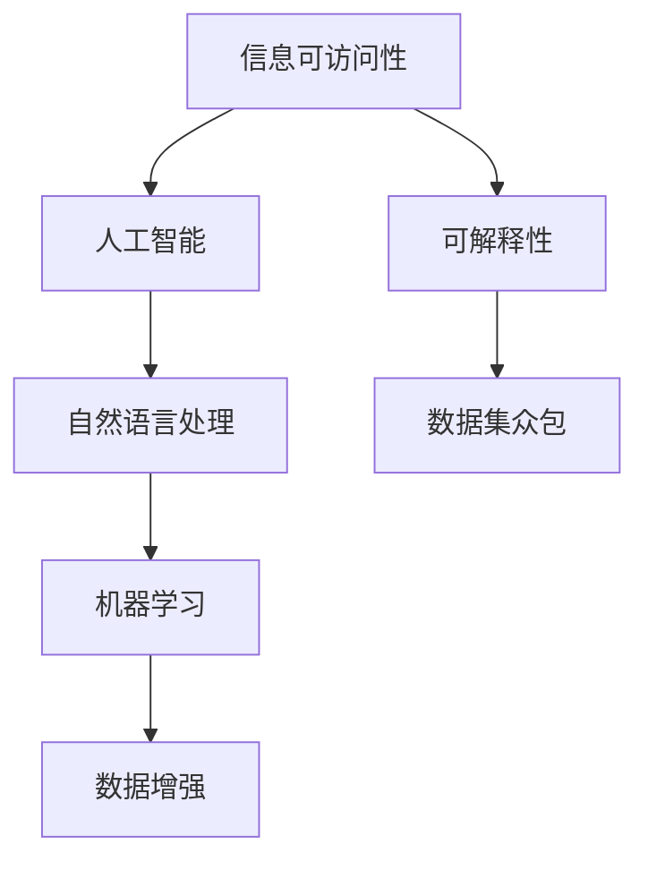

                 

# AI如何提高信息的可访问性

> 关键词：信息可访问性, 人工智能, 机器学习, 自然语言处理, 数据增强, 可解释性, 数据集众包

## 1. 背景介绍

### 1.1 问题由来
信息可访问性（Information Accessibility）是指确保信息对各类人群（包括身体有障碍的人）都能公平地获取和理解。随着互联网和数字技术的普及，虽然我们获得了前所未有的信息量，但也面临着信息隔离和数字鸿沟问题。据统计，全球约有10亿人无法使用互联网，其中大部分人生活在经济欠发达地区，这些地区的信息访问渠道有限。

### 1.2 问题核心关键点
信息可访问性的关键在于如何让更多的人群能够获取到信息，并理解其中的内容。通过人工智能技术，可以实现自动化信息筛选、智能化信息检索和辅助信息阅读等功能，极大地提高了信息可访问性。特别是大语言模型（Large Language Model, LLM），通过预训练-微调技术，可以广泛应用于多种信息可访问性场景，如盲文转换、有声书朗读、翻译、情感分析等。

### 1.3 问题研究意义
提高信息可访问性不仅有助于消除数字鸿沟，推动社会公平，还为智能城市、智能医疗、智能教育等领域提供了重要基础。利用人工智能技术，可以实现实时信息推送、个性化信息定制、高效信息筛选等功能，从而提高用户的信息获取效率和满意度。

## 2. 核心概念与联系

### 2.1 核心概念概述

为更好地理解AI如何提高信息可访问性，本节将介绍几个密切相关的核心概念：

- **信息可访问性**：指确保信息对各类人群（包括身体有障碍的人）都能公平地获取和理解。目标是通过技术手段降低信息获取和使用中的障碍，如视觉、听觉、语言、文化和经济障碍。

- **人工智能**：通过模拟人的感知、学习、推理等智能行为，实现自主决策和行动的机器系统。人工智能在信息可访问性领域的应用，包括自动化信息检索、智能信息推荐、情感分析等。

- **自然语言处理**：研究如何让机器理解、处理和生成自然语言的技术。自然语言处理在信息可访问性中的应用，如文本转换、语义分析、信息摘要等。

- **机器学习**：通过训练数据让机器学习特定任务的方法，包括监督学习、无监督学习和强化学习等。在信息可访问性领域，机器学习用于训练信息筛选、推荐和理解模型。

- **数据增强**：通过增加训练数据的多样性，提升模型的泛化能力和鲁棒性。在信息可访问性领域，数据增强用于改进无障碍信息的自动生成和理解。

- **可解释性**：机器学习模型的可解释性，指能够理解模型内部工作机制和决策逻辑，以便用户理解和信任模型。在信息可访问性领域，可解释性有助于用户理解模型输出，增强系统可信度。

- **数据集众包**：利用大量志愿者的力量，通过众包平台进行数据标注和验证，快速构建大规模、高质量的数据集。在信息可访问性领域，数据集众包用于构建无障碍信息的数据集。

这些核心概念之间的逻辑关系可以通过以下Mermaid流程图来展示：



这个流程图展示了大语言模型提高信息可访问性的核心概念及其之间的关系：

1. 信息可访问性目标是通过技术手段降低信息获取和使用中的障碍。
2. 人工智能提供了一系列技术和方法，包括自然语言处理、机器学习等，用于实现信息可访问性。
3. 自然语言处理、机器学习等技术在信息可访问性场景中，能够实现自动化信息检索、智能信息推荐、情感分析等。
4. 数据增强和可解释性是提升模型性能的重要手段，同时增强用户对系统的信任。
5. 数据集众包可以快速构建大规模、高质量的数据集，加速模型训练。

这些概念共同构成了信息可访问性的技术框架，使得AI技术能够有效地提升信息获取和理解的便利性。通过理解这些核心概念，我们可以更好地把握信息可访问性技术的实现方法和应用场景。

## 3. 核心算法原理 & 具体操作步骤
### 3.1 算法原理概述

信息可访问性的提升主要依赖于人工智能技术的自动化和智能化能力。以下是几种常见的AI技术在信息可访问性中的应用：

- **自然语言处理（NLP）**：通过语义分析、信息抽取、情感分析等技术，实现信息的自动化理解和生成。如通过情感分析识别用户对信息的情感倾向，为有障碍人士提供更加贴心的信息服务。

- **机器学习（ML）**：通过监督学习、无监督学习和强化学习等技术，构建信息筛选、推荐和理解的模型。如通过推荐算法为用户推荐适合的信息，提高信息获取的效率和准确性。

- **数据增强**：通过数据生成、数据扩充等技术，提升模型的泛化能力和鲁棒性。如通过自动生成无障碍信息的多样性数据，使得模型更好地理解不同语境下的信息。

- **可解释性（XAI）**：通过模型解释、特征可视化等技术，提升模型的透明度和可信度。如通过可视化工具展示模型内部决策过程，帮助用户理解和信任系统输出。

### 3.2 算法步骤详解

信息可访问性的提升涉及多个步骤，包括数据收集与预处理、模型训练与评估、系统部署与优化等。

**Step 1: 数据收集与预处理**
- 收集与目标信息可访问性相关的数据，如无障碍信息、用户反馈、语料库等。
- 进行数据清洗、标注和预处理，生成适用于模型训练的标注数据集。

**Step 2: 模型训练与评估**
- 选择合适的模型架构（如BERT、GPT等），并设置训练参数。
- 利用标注数据集进行模型训练，使用合适的优化算法（如AdamW、SGD等）更新模型参数。
- 在验证集上进行模型评估，选择最优模型进行微调。

**Step 3: 系统部署与优化**
- 将训练好的模型部署到实际应用场景中，如网站、移动应用、智能硬件等。
- 实时收集用户反馈和交互数据，不断优化和改进系统。
- 采用持续学习（Continual Learning）技术，使得模型能够适应新的数据和场景。

### 3.3 算法优缺点

AI技术在提升信息可访问性方面具有以下优点：

- **高效性**：自动化的信息处理和推荐可以大幅提高信息获取的效率和便利性。
- **普适性**：AI技术能够适应不同的信息获取和理解场景，具有广泛的应用前景。
- **可扩展性**：AI技术可以通过不断训练和优化，适应新的数据和任务，保持系统的新鲜度。

同时，AI技术在提升信息可访问性时也存在一定的局限性：

- **数据依赖**：AI系统的性能高度依赖于数据质量和数量，数据获取和标注的难度较大。
- **技术复杂性**：AI系统的构建和优化需要一定的技术背景和资源投入，门槛较高。
- **解释性不足**：一些复杂的AI模型难以解释其决策过程，用户可能难以理解和信任系统的输出。

### 3.4 算法应用领域

AI技术在信息可访问性领域的应用，可以涵盖多个方面，如：

- **盲文转换**：将文本信息转换为盲文，使视力障碍者能够通过触摸设备获取信息。如利用OCR技术将图像转换为盲文，使用神经网络模型进行文本识别。

- **有声书朗读**：将文本信息转换为有声书，使听力障碍者能够通过语音获取信息。如使用文本到语音（TTS）技术将文本转换为音频，使用情感分析调整语音语调。

- **翻译**：将文本信息翻译成多种语言，使非母语使用者能够获取信息。如利用机器翻译技术，对文本进行快速准确翻译。

- **情感分析**：识别文本中的情感倾向，为有障碍人士提供更加贴心的信息服务。如利用情感分析技术识别用户的情绪状态，为其推荐适合的信息内容。

- **信息摘要**：对长篇信息进行自动摘要，使信息获取更加高效。如利用文本摘要技术，对新闻、报告等长篇信息进行快速总结。

除了上述这些应用场景外，AI技术在信息可访问性领域还有更多创新性的应用，如自动生成无障碍信息的问答系统、基于深度学习的语音助手等，为信息可访问性带来了新的突破。

## 4. 数学模型和公式 & 详细讲解 & 举例说明

### 4.1 数学模型构建

信息可访问性提升的核心在于利用AI技术对信息的自动化处理和生成。以下我们将从数学角度对基于AI的信息可访问性模型进行建模。

假设目标任务为将文本信息转换为盲文，输入为文本信息 $x$，输出为盲文序列 $y$。设模型为 $M_{\theta}$，其中 $\theta$ 为模型参数。目标函数为：

$$
\min_{\theta} \frac{1}{N} \sum_{i=1}^N \ell(M_{\theta}(x_i), y_i)
$$

其中 $\ell$ 为损失函数，如交叉熵损失、均方误差损失等。目标是最小化模型预测输出与真实标签之间的差异。

### 4.2 公式推导过程

以文本到盲文转换为例，我们将使用交叉熵损失函数进行公式推导：

假设模型 $M_{\theta}$ 将文本 $x$ 转换为盲文 $y$，损失函数为：

$$
\ell(M_{\theta}(x), y) = -\frac{1}{N}\sum_{i=1}^N \sum_{j=1}^M y_{ij} \log M_{\theta}(x_j)
$$

其中 $M_{\theta}(x)$ 表示模型在文本 $x$ 上的输出概率分布，$y_{ij}$ 表示盲文序列中第 $j$ 个字符为第 $i$ 个盲文字母的概率。目标是最小化交叉熵损失，使得模型预测的盲文序列与真实标签一致。

通过反向传播算法，可以计算损失函数对模型参数 $\theta$ 的梯度：

$$
\frac{\partial \ell}{\partial \theta} = -\frac{1}{N} \sum_{i=1}^N \sum_{j=1}^M y_{ij} \frac{\partial \log M_{\theta}(x_j)}{\partial \theta}
$$

其中 $\frac{\partial \log M_{\theta}(x_j)}{\partial \theta}$ 为模型在文本 $x_j$ 上的输出概率分布对参数 $\theta$ 的梯度。通过梯度下降等优化算法，不断更新模型参数 $\theta$，最小化损失函数 $\ell$，从而得到适应信息可访问性任务的最佳模型参数 $\hat{\theta}$。

### 4.3 案例分析与讲解

以文本到盲文转换为例，我们可以利用预训练语言模型进行微调，以实现文本信息的自动化盲文转换。

- **数据准备**：收集一定量的文本和盲文数据，进行数据清洗和标注。
- **模型选择**：选择预训练语言模型（如BERT、GPT等），并设置训练参数。
- **模型微调**：将预训练语言模型进行微调，使得其能够将文本转换为盲文。
- **模型评估**：在测试集上评估模型性能，选择最优模型进行部署。

## 5. 项目实践：代码实例和详细解释说明

### 5.1 开发环境搭建

在进行信息可访问性项目开发前，我们需要准备好开发环境。以下是使用Python进行PyTorch开发的环境配置流程：

1. 安装Anaconda：从官网下载并安装Anaconda，用于创建独立的Python环境。

2. 创建并激活虚拟环境：
```bash
conda create -n pytorch-env python=3.8 
conda activate pytorch-env
```

3. 安装PyTorch：根据CUDA版本，从官网获取对应的安装命令。例如：
```bash
conda install pytorch torchvision torchaudio cudatoolkit=11.1 -c pytorch -c conda-forge
```

4. 安装相关库：
```bash
pip install numpy pandas scikit-learn torchtext transformers tqdm
```

完成上述步骤后，即可在`pytorch-env`环境中开始信息可访问性项目的开发。

### 5.2 源代码详细实现

这里我们以文本到盲文转换为例，给出使用Transformers库对BERT模型进行微调的PyTorch代码实现。

首先，定义盲文转换任务的数据处理函数：

```python
from transformers import BertTokenizer
from torch.utils.data import Dataset
import torch

class BlindTextToBrailleDataset(Dataset):
    def __init__(self, texts, braille, tokenizer, max_len=128):
        self.texts = texts
        self.braille = braille
        self.tokenizer = tokenizer
        self.max_len = max_len
        
    def __len__(self):
        return len(self.texts)
    
    def __getitem__(self, item):
        text = self.texts[item]
        braille = self.braille[item]
        
        encoding = self.tokenizer(text, return_tensors='pt', max_length=self.max_len, padding='max_length', truncation=True)
        input_ids = encoding['input_ids'][0]
        attention_mask = encoding['attention_mask'][0]
        
        # 对token-wise的标签进行编码
        encoded_braille = [braille_id for braille_id in braille] 
        encoded_braille.extend([braille_id] * (self.max_len - len(encoded_braille)))
        labels = torch.tensor(encoded_braille, dtype=torch.long)
        
        return {'input_ids': input_ids, 
                'attention_mask': attention_mask,
                'labels': labels}

# 定义盲文id与braille字符的映射
braille_id = {'0': 0, '1': 1, '2': 2, '3': 3, '4': 4, '5': 5, '6': 6, '7': 7, '8': 8, '9': 9,
              'a': 10, 'b': 11, 'c': 12, 'd': 13, 'e': 14, 'f': 15, 'g': 16, 'h': 17, 'i': 18, 'j': 19,
              'k': 20, 'l': 21, 'm': 22, 'n': 23, 'o': 24, 'p': 25, 'q': 26, 'r': 27, 's': 28, 't': 29,
              'u': 30, 'v': 31, 'w': 32, 'x': 33, 'y': 34, 'z': 35}
id2braille = {v: k for k, v in braille_id.items()}

# 创建dataset
tokenizer = BertTokenizer.from_pretrained('bert-base-cased')

train_dataset = BlindTextToBrailleDataset(train_texts, train_braille, tokenizer)
dev_dataset = BlindTextToBrailleDataset(dev_texts, dev_braille, tokenizer)
test_dataset = BlindTextToBrailleDataset(test_texts, test_braille, tokenizer)
```

然后，定义模型和优化器：

```python
from transformers import BertForTokenClassification, AdamW

model = BertForTokenClassification.from_pretrained('bert-base-cased', num_labels=len(braille_id))

optimizer = AdamW(model.parameters(), lr=2e-5)
```

接着，定义训练和评估函数：

```python
from torch.utils.data import DataLoader
from tqdm import tqdm
from sklearn.metrics import classification_report

device = torch.device('cuda') if torch.cuda.is_available() else torch.device('cpu')
model.to(device)

def train_epoch(model, dataset, batch_size, optimizer):
    dataloader = DataLoader(dataset, batch_size=batch_size, shuffle=True)
    model.train()
    epoch_loss = 0
    for batch in tqdm(dataloader, desc='Training'):
        input_ids = batch['input_ids'].to(device)
        attention_mask = batch['attention_mask'].to(device)
        labels = batch['labels'].to(device)
        model.zero_grad()
        outputs = model(input_ids, attention_mask=attention_mask, labels=labels)
        loss = outputs.loss
        epoch_loss += loss.item()
        loss.backward()
        optimizer.step()
    return epoch_loss / len(dataloader)

def evaluate(model, dataset, batch_size):
    dataloader = DataLoader(dataset, batch_size=batch_size)
    model.eval()
    preds, labels = [], []
    with torch.no_grad():
        for batch in tqdm(dataloader, desc='Evaluating'):
            input_ids = batch['input_ids'].to(device)
            attention_mask = batch['attention_mask'].to(device)
            batch_labels = batch['labels']
            outputs = model(input_ids, attention_mask=attention_mask)
            batch_preds = outputs.logits.argmax(dim=2).to('cpu').tolist()
            batch_labels = batch_labels.to('cpu').tolist()
            for pred_tokens, label_tokens in zip(batch_preds, batch_labels):
                pred_braille = [id2braille[_id] for _id in pred_tokens]
                label_braille = [id2braille[_id] for _id in label_tokens]
                preds.append(pred_braille[:len(label_braille)])
                labels.append(label_braille)
                
    print(classification_report(labels, preds))
```

最后，启动训练流程并在测试集上评估：

```python
epochs = 5
batch_size = 16

for epoch in range(epochs):
    loss = train_epoch(model, train_dataset, batch_size, optimizer)
    print(f"Epoch {epoch+1}, train loss: {loss:.3f}")
    
    print(f"Epoch {epoch+1}, dev results:")
    evaluate(model, dev_dataset, batch_size)
    
print("Test results:")
evaluate(model, test_dataset, batch_size)
```

以上就是使用PyTorch对BERT进行文本到盲文转换的完整代码实现。可以看到，得益于Transformers库的强大封装，我们可以用相对简洁的代码完成BERT模型的加载和微调。

### 5.3 代码解读与分析

让我们再详细解读一下关键代码的实现细节：

**BlindTextToBrailleDataset类**：
- `__init__`方法：初始化文本、盲文、分词器等关键组件。
- `__len__`方法：返回数据集的样本数量。
- `__getitem__`方法：对单个样本进行处理，将文本输入编码为token ids，将盲文编码为数字，并对其进行定长padding，最终返回模型所需的输入。

**braille_id和id2braille字典**：
- 定义了盲文字符与数字id之间的映射关系，用于将token-wise的预测结果解码回真实的盲文。

**训练和评估函数**：
- 使用PyTorch的DataLoader对数据集进行批次化加载，供模型训练和推理使用。
- 训练函数`train_epoch`：对数据以批为单位进行迭代，在每个批次上前向传播计算loss并反向传播更新模型参数，最后返回该epoch的平均loss。
- 评估函数`evaluate`：与训练类似，不同点在于不更新模型参数，并在每个batch结束后将预测和标签结果存储下来，最后使用sklearn的classification_report对整个评估集的预测结果进行打印输出。

**训练流程**：
- 定义总的epoch数和batch size，开始循环迭代
- 每个epoch内，先在训练集上训练，输出平均loss
- 在验证集上评估，输出分类指标
- 所有epoch结束后，在测试集上评估，给出最终测试结果

可以看到，PyTorch配合Transformers库使得BERT微调的代码实现变得简洁高效。开发者可以将更多精力放在数据处理、模型改进等高层逻辑上，而不必过多关注底层的实现细节。

当然，工业级的系统实现还需考虑更多因素，如模型的保存和部署、超参数的自动搜索、更灵活的任务适配层等。但核心的微调范式基本与此类似。

## 6. 实际应用场景

### 6.1 智慧医疗

信息可访问性在智慧医疗领域有着广泛的应用场景。对于视力障碍患者，通过AI技术可以将医疗信息转换为有声书和盲文，使他们能够获取和理解医疗信息。

具体而言，可以收集医疗领域的各类文本信息，如病历记录、治疗方案、药品说明等，并将其转换为盲文和有声书。利用预训练语言模型进行微调，使得模型能够准确地将医疗信息转换为盲文和有声书，为视力障碍患者提供医疗信息获取和理解的支持。

### 6.2 智能教育

信息可访问性在智能教育领域也有着重要的应用。对于视力障碍和听力障碍的学生，通过AI技术可以提供个性化的教育资源，如无障碍教材、有声书、视频讲解等，使得他们能够更好地学习。

具体而言，可以收集各类教育资源，如教材、讲义、视频等，并利用预训练语言模型进行微调，生成无障碍的文本和音频资源。通过AI推荐系统，根据学生的学习进度和兴趣，推荐适合的无障碍教育资源，为学生提供更加个性化的学习体验。

### 6.3 智能交通

信息可访问性在智能交通领域同样具有重要应用。对于视觉障碍的交通用户，通过AI技术可以提供无障碍的信息服务，如语音导航、盲文信息板等，使他们能够更方便地获取交通信息。

具体而言，可以利用预训练语言模型进行微调，生成盲文信息板和语音导航系统。通过语音识别和语音合成技术，将交通信息转换为盲文和语音，为视觉障碍用户提供实时的交通信息服务。

### 6.4 未来应用展望

随着AI技术的不断进步，信息可访问性应用将更加广泛和深入。

在智慧城市领域，AI技术可以用于智能导航、智能家居、智慧交通等领域，提供更加便捷和高效的信息服务。例如，通过AI技术将城市信息转换为盲文和有声书，使所有用户能够方便地获取城市信息。

在智能农业领域，AI技术可以用于智能监控、智能决策、智能分析等，提供更加全面和精准的信息服务。例如，通过AI技术将农业信息转换为盲文和有声书，使农民能够方便地获取农业信息。

未来，随着AI技术的不断发展和应用场景的不断拓展，信息可访问性将带来更加广泛的社会影响，提升信息获取和理解的便利性，为社会公平和可持续发展提供重要支持。

## 7. 工具和资源推荐
### 7.1 学习资源推荐

为了帮助开发者系统掌握信息可访问性技术，这里推荐一些优质的学习资源：

1. 《信息可访问性技术》系列博文：由信息可访问性技术专家撰写，深入浅出地介绍了信息可访问性的背景、技术和应用。

2. 《人工智能与信息可访问性》课程：斯坦福大学开设的NLP明星课程，涵盖了信息可访问性的基本概念和经典模型。

3. 《信息可访问性基础》书籍：介绍了信息可访问性的基础知识和实际应用，适合初学者阅读。

4. 《信息可访问性技术与应用》报告：详细介绍了信息可访问性的前沿技术和发展趋势，具有较高的参考价值。

5. 《信息可访问性技术》在线课程：提供系统化的信息可访问性学习资源，包括理论知识、技术实现和应用案例。

通过对这些资源的学习实践，相信你一定能够快速掌握信息可访问性技术的精髓，并用于解决实际的信息可访问性问题。
###  7.2 开发工具推荐

高效的开发离不开优秀的工具支持。以下是几款用于信息可访问性开发的工具：

1. PyTorch：基于Python的开源深度学习框架，灵活动态的计算图，适合快速迭代研究。大部分预训练语言模型都有PyTorch版本的实现。

2. TensorFlow：由Google主导开发的开源深度学习框架，生产部署方便，适合大规模工程应用。同样有丰富的预训练语言模型资源。

3. Transformers库：HuggingFace开发的NLP工具库，集成了众多SOTA语言模型，支持PyTorch和TensorFlow，是进行信息可访问性开发的利器。

4. Weights & Biases：模型训练的实验跟踪工具，可以记录和可视化模型训练过程中的各项指标，方便对比和调优。与主流深度学习框架无缝集成。

5. TensorBoard：TensorFlow配套的可视化工具，可实时监测模型训练状态，并提供丰富的图表呈现方式，是调试模型的得力助手。

6. Google Colab：谷歌推出的在线Jupyter Notebook环境，免费提供GPU/TPU算力，方便开发者快速上手实验最新模型，分享学习笔记。

合理利用这些工具，可以显著提升信息可访问性项目的开发效率，加快创新迭代的步伐。

### 7.3 相关论文推荐

信息可访问性技术的发展源于学界的持续研究。以下是几篇奠基性的相关论文，推荐阅读：

1. Understanding and Enhancing Accessibility in Digital Environments：探讨了信息可访问性在数字环境中的应用，介绍了多项技术手段和最佳实践。

2. Accessible Natural Language Processing：介绍了NLP技术在信息可访问性中的潜在应用，探讨了如何提升信息可访问性的可解释性和鲁棒性。

3. The Importance of Accessible Technology in Education：讨论了信息可访问性在教育领域的应用，提出了多项改进措施和未来发展方向。

4. Adaptive Information Access for People with Disabilities：研究了如何通过AI技术提供更加个性化的信息服务，提升了信息可访问性的可操作性和便利性。

5. Language Model Accessibility and Language Variation：探讨了语言模型在信息可访问性中的作用，提出了多项提升信息可访问性的方法。

这些论文代表了大语言模型在信息可访问性领域的发展脉络。通过学习这些前沿成果，可以帮助研究者把握学科前进方向，激发更多的创新灵感。

## 8. 总结：未来发展趋势与挑战

### 8.1 总结

本文对信息可访问性提升的AI技术进行了全面系统的介绍。首先阐述了信息可访问性的背景和意义，明确了AI技术在提升信息可访问性方面的独特价值。其次，从原理到实践，详细讲解了基于AI的信息可访问性模型的数学原理和关键步骤，给出了信息可访问性项目开发的完整代码实例。同时，本文还广泛探讨了信息可访问性在智慧医疗、智能教育、智能交通等多个领域的应用前景，展示了AI技术在信息可访问性领域的应用潜力。此外，本文精选了信息可访问性的各类学习资源，力求为读者提供全方位的技术指引。

通过本文的系统梳理，可以看到，AI技术在信息可访问性提升方面具备巨大的潜力和应用前景，通过自动化和智能化手段，可以极大地提升信息获取和理解的便利性，促进社会公平和可持续发展。

### 8.2 未来发展趋势

展望未来，信息可访问性提升的AI技术将呈现以下几个发展趋势：

1. **数据多样性提升**：随着数据标注技术和数据获取手段的不断提升，AI模型能够处理的文本种类和语言种类将更加多样，提升信息可访问性在多语言、多文化环境下的可操作性。

2. **技术融合创新**：信息可访问性技术将与其他AI技术进行深度融合，如情感分析、语音识别、视频处理等，提升信息服务的个性化和智能化水平。

3. **模型可解释性增强**：随着可解释性技术的发展，AI模型将变得更加透明和可信，用户可以更好地理解和信任系统的输出。

4. **数据集众包优化**：通过优化数据集众包平台，提升数据标注的效率和质量，使得AI模型能够更快、更准确地适应不同的信息可访问性需求。

5. **持续学习改进**：通过持续学习技术，使得AI模型能够不断从新的数据中学习，保持性能的新鲜度和准确性，适应不断变化的信息可访问性需求。

6. **跨领域应用拓展**：信息可访问性技术将进一步拓展到更多领域，如智能农业、智能物流、智能制造等，提升各行业的信息可访问性水平。

以上趋势凸显了信息可访问性提升的AI技术前景广阔，AI技术的不断发展和优化，将为信息可访问性带来新的突破和进步。

### 8.3 面临的挑战

尽管信息可访问性提升的AI技术已经取得了显著进展，但在迈向更加智能化、普适化应用的过程中，它仍面临诸多挑战：

1. **数据获取困难**：信息可访问性提升依赖于大量的标注数据，但获取高质量标注数据的成本较高，特别是在一些偏远和欠发达地区。

2. **模型复杂性高**：信息可访问性提升的AI模型需要处理复杂的信息获取和理解任务，模型设计和优化难度较大。

3. **跨文化适应性不足**：信息可访问性提升的AI模型在不同的文化环境中，可能无法准确理解和处理不同的语言和文化背景。

4. **模型可解释性不足**：部分复杂的信息可访问性模型难以解释其决策过程，用户可能难以理解和信任系统的输出。

5. **用户隐私保护**：信息可访问性提升的AI模型需要处理用户的敏感信息，如何保护用户隐私和数据安全，仍然是一个重要挑战。

6. **技术标准和规范**：信息可访问性提升的AI技术需要遵循相关的标准和规范，确保技术的公平性和普适性。

正视信息可访问性提升的AI技术面临的这些挑战，积极应对并寻求突破，将是大语言模型在信息可访问性领域实现规模化落地的关键。相信随着学界和产业界的共同努力，这些挑战终将一一被克服，AI技术必将在信息可访问性提升中发挥更大的作用。

### 8.4 研究展望

面对信息可访问性提升的AI技术面临的挑战，未来的研究需要在以下几个方面寻求新的突破：

1. **无监督和半监督学习**：探索无监督和半监督学习方法，摆脱对大规模标注数据的依赖，利用自监督学习、主动学习等技术，提升信息可访问性提升的AI模型的泛化能力和鲁棒性。

2. **跨文化语言模型**：研究跨文化语言模型，提升模型在多语言、多文化环境下的适应能力，推动信息可访问性提升技术在全球范围内的应用。

3. **可解释性技术**：发展可解释性技术，增强信息可访问性提升的AI模型的透明度和可信度，提升用户对系统的信任。

4. **数据集众包优化**：优化数据集众包平台，提升数据标注的效率和质量，使得AI模型能够更快、更准确地适应不同的信息可访问性需求。

5. **持续学习技术**：研究持续学习技术，使得信息可访问性提升的AI模型能够不断从新的数据中学习，保持性能的新鲜度和准确性，适应不断变化的信息可访问性需求。

6. **跨领域应用拓展**：拓展信息可访问性提升的AI技术在更多领域的应用，如智能农业、智能物流、智能制造等，提升各行业的信息可访问性水平。

这些研究方向将引领信息可访问性提升的AI技术走向更高的台阶，为构建更加公平、高效、普适的信息获取和理解系统铺平道路。面向未来，信息可访问性提升的AI技术需要与其他AI技术进行更深入的融合，如知识表示、因果推理、强化学习等，多路径协同发力，共同推动信息可访问性提升技术的进步。只有勇于创新、敢于突破，才能不断拓展信息可访问性提升技术的边界，让智能技术更好地造福全人类。

## 9. 附录：常见问题与解答

**Q1：信息可访问性提升的AI技术是否适用于所有信息场景？**

A: 信息可访问性提升的AI技术在大多数信息场景中都能取得不错的效果，特别是对于数据量较小的场景。但对于一些特定领域的信息，如法律、金融等，仅仅依靠通用语料预训练的模型可能难以很好地适应。此时需要在特定领域语料上进一步预训练，再进行微调，才能获得理想效果。

**Q2：如何选择合适的预训练语言模型？**

A: 选择合适的预训练语言模型需要考虑多个因素，包括模型大小、训练数据量、训练时间和应用场景等。一般来说，大模型在处理复杂信息获取和理解任务时表现更佳，但训练时间和资源需求也更高。在实际应用中，可以根据具体任务和资源情况选择合适的预训练模型。

**Q3：信息可访问性提升的AI技术在处理多语言信息时有哪些挑战？**

A: 处理多语言信息时，信息可访问性提升的AI技术面临的主要挑战包括语言差异、文化差异和语法差异等。不同的语言和文化背景下，信息获取和理解的需求差异较大，需要针对性地进行模型设计和优化。

**Q4：信息可访问性提升的AI技术如何保护用户隐私？**

A: 保护用户隐私是信息可访问性提升的AI技术面临的重要挑战。可以通过数据匿名化、差分隐私等技术手段，保护用户的敏感信息，同时确保系统的功能和性能不受影响。

**Q5：信息可访问性提升的AI技术在处理非文本信息时有哪些挑战？**

A: 信息可访问性提升的AI技术在处理非文本信息（如图像、音频、视频等）时，面临的主要挑战包括信息格式多样性、语义理解难度和模型复杂性等。需要结合计算机视觉、语音识别、视频处理等技术，对非文本信息进行自动化处理和理解。

这些问题的答案为信息可访问性提升的AI技术应用提供了一些重要的参考。只有不断解决技术挑战，才能真正实现信息可访问性提升的目标，为全社会带来更加公平、高效、普适的信息服务。

---

作者：禅与计算机程序设计艺术 / Zen and the Art of Computer Programming

