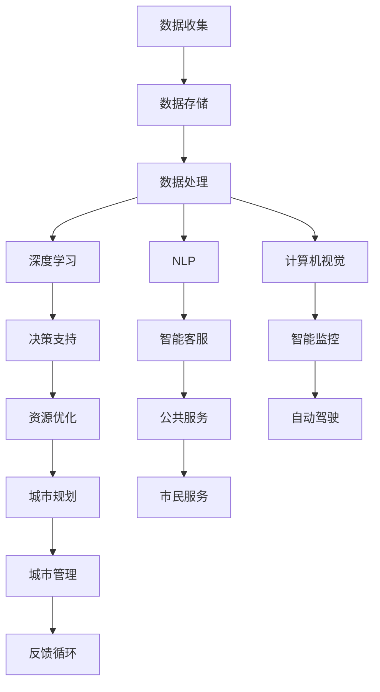

                 

# AI如何改变城市规划和智慧城市发展

## 1. 背景介绍

### 1.1 问题由来

随着城市化进程的不断加快，全球城市面临着前所未有的挑战，如交通拥堵、环境污染、资源匮乏、社会管理难度加大等问题日益凸显。传统城市规划和治理方法已无法满足新时代的城市发展需求，迫切需要引入新思维和新工具来提升城市管理和服务的智能化水平。人工智能（AI）技术的飞速发展，特别是深度学习、自然语言处理、计算机视觉等前沿技术的突破，为城市规划和智慧城市建设提供了全新的路径和方法。

### 1.2 问题核心关键点

AI在城市规划和智慧城市发展中的应用主要体现在以下几个关键点：

1. **数据驱动决策**：AI可以处理和分析海量数据，提取城市运行中的关键信息，为城市规划和决策提供强有力的支持。
2. **实时感知与管理**：通过部署物联网（IoT）设备和AI算法，实现对城市基础设施和环境的实时监控与高效管理。
3. **精准资源调配**：AI可以优化交通、能源、水资源等资源的分配与利用，提升城市运行的效率和可持续性。
4. **智能公共服务**：通过AI技术，提供个性化、高效的公共服务，提升市民的生活质量和城市管理的响应速度。
5. **预测与仿真**：AI可以模拟和预测城市发展趋势，帮助制定科学合理的规划方案。

## 2. 核心概念与联系

### 2.1 核心概念概述

为更好地理解AI在城市规划和智慧城市中的应用，本节将介绍几个关键概念：

- **人工智能（AI）**：通过算法、模型和计算技术模拟人类智能过程的计算机系统。AI在城市规划中主要用于数据处理、模式识别、决策支持等。
- **深度学习（Deep Learning）**：一种基于神经网络的机器学习方法，能够自动学习输入数据的复杂特征表示，广泛应用于图像识别、语音识别、自然语言处理等领域。
- **自然语言处理（NLP）**：让计算机理解、解释和生成自然语言的技术，在智慧城市中用于智能客服、智能翻译、情感分析等。
- **计算机视觉（CV）**：使计算机具备“看”的能力，通过图像识别、目标检测等技术实现智能监控、自动驾驶等。
- **物联网（IoT）**：将物理世界与虚拟网络空间连接起来的技术，使城市设施能够实时感知、通信和互动。
- **智慧城市（Smart City）**：利用信息和通信技术（ICT），使城市基础设施和公共服务更加智能、高效、可持续发展。

这些核心概念通过数据收集、处理、分析、决策和反馈等环节，构成了一个紧密连接的智慧城市生态系统，共同推动城市向智能化、信息化、可持续方向发展。

### 2.2 核心概念原理和架构的 Mermaid 流程图



这个流程图展示了AI在智慧城市中的应用流程，从数据收集开始，经过深度学习、自然语言处理和计算机视觉等技术的处理，最终实现决策支持、资源优化、智能服务和城市规划等目标，形成一个闭环的反馈系统，不断提升城市管理的智能化水平。

## 3. 核心算法原理 & 具体操作步骤

### 3.1 算法原理概述

AI在城市规划和智慧城市发展中的应用，核心在于数据驱动的智能化决策支持。算法原理主要包括以下几个方面：

- **数据预处理**：通过清洗、标注、归一化等方法，将原始数据转化为适合模型训练的格式。
- **模型训练**：选择合适的算法和模型，如卷积神经网络（CNN）、循环神经网络（RNN）、长短期记忆网络（LSTM）、注意力机制（Attention）等，在标注数据上训练模型，学习数据中的规律和特征。
- **模型评估与优化**：使用交叉验证、留一法等方法评估模型性能，通过调整超参数、正则化等手段优化模型。
- **模型部署与应用**：将训练好的模型部署到城市管理的各个环节，实现实时感知、决策支持、智能服务等。

### 3.2 算法步骤详解

1. **数据收集与处理**：
   - 收集城市运行相关的数据，如交通流量、环境质量、能源消耗、公共服务使用情况等。
   - 对数据进行预处理，如去噪、归一化、特征提取等，确保数据质量。

2. **模型训练**：
   - 根据具体任务选择合适的算法和模型。
   - 准备训练数据集，进行模型训练，调整超参数。
   - 在验证集上评估模型性能，确定最优模型。

3. **模型部署与应用**：
   - 将训练好的模型集成到城市管理的系统中。
   - 实现实时数据采集、处理和分析，提供智能决策支持。
   - 部署在传感器、监控设备、智能终端等基础设施中，实现城市运行状态的实时感知与响应。

### 3.3 算法优缺点

AI在城市规划和智慧城市发展中的应用具有以下优点：

- **提升决策科学性**：AI能够处理大量复杂数据，从中提取出关键信息，支持科学决策。
- **提高管理效率**：通过智能化的系统，实现对城市运行的实时监控和动态调整，提升管理效率。
- **增强服务质量**：提供个性化、定制化的智能服务，改善市民生活质量。
- **促进资源优化**：通过AI优化资源配置，实现能源、交通、水资源的合理分配和利用。

同时，也存在一些缺点：

- **数据依赖性强**：AI的效果很大程度上依赖于数据的质量和数量，数据获取和处理成本较高。
- **技术复杂性高**：AI系统设计复杂，需要跨学科知识和技能。
- **伦理与安全风险**：AI可能带来隐私、安全等问题，需要加强监管和保护。

### 3.4 算法应用领域

AI在城市规划和智慧城市发展中的应用领域非常广泛，主要包括以下几个方面：

- **交通管理**：通过AI优化交通信号控制、预测交通流量、实现自动驾驶等。
- **环境保护**：利用AI分析环境数据，预测污染趋势，提升环境监测和治理能力。
- **公共安全**：通过视频监控和数据分析，实现智能安防、应急响应等。
- **能源管理**：AI优化能源分配和调度，提升能源利用效率。
- **城市规划**：AI辅助城市规划设计，提升规划的科学性和前瞻性。
- **智能建筑**：通过AI控制建筑设施，提升建筑能效和舒适度。

## 4. 数学模型和公式 & 详细讲解 & 举例说明

### 4.1 数学模型构建

AI在城市规划中的应用，通常构建以下数学模型：

- **交通流量预测模型**：
  $$
  P_t = f(I_t, D_t, A_t, T_t)
  $$
  其中，$P_t$ 表示时间 $t$ 的交通流量，$I_t$ 为输入数据，$D_t$ 为历史数据，$A_t$ 为当前道路状况，$T_t$ 为交通规则和政策。

- **环境质量监测模型**：
  $$
  E_i = g(S_i, R_i, W_i, U_i)
  $$
  其中，$E_i$ 表示时间 $i$ 的环境质量，$S_i$ 为传感器数据，$R_i$ 为天气状况，$W_i$ 为人类活动，$U_i$ 为政策法规。

- **公共服务需求预测模型**：
  $$
  D_j = h(H_j, S_j, C_j, P_j)
  $$
  其中，$D_j$ 表示时间 $j$ 的公共服务需求，$H_j$ 为历史数据，$S_j$ 为社会经济指标，$C_j$ 为市民行为，$P_j$ 为政策影响。

### 4.2 公式推导过程

以交通流量预测模型为例，具体推导过程如下：

- **输入数据**：假设输入数据 $I_t$ 包括历史流量 $I_{t-1}$、当前天气 $D_t$、道路状况 $A_t$、交通规则 $T_t$。
- **模型构建**：采用LSTM网络，利用历史数据 $D_t$ 和当前数据 $I_t$ 预测未来流量 $P_t$。
- **损失函数**：采用均方误差（MSE）损失函数，衡量预测值与实际值之间的差异。
- **训练流程**：通过梯度下降算法，最小化损失函数，更新模型参数，直至收敛。

### 4.3 案例分析与讲解

假设某城市需要预测未来一周的交通流量，具体步骤如下：

1. **数据准备**：收集过去一年的交通流量数据、实时天气数据、道路状况数据和交通规则数据。
2. **数据预处理**：清洗数据，去除异常值和噪声，对数据进行归一化处理。
3. **模型训练**：使用LSTM网络，以历史交通流量数据为输入，训练模型，预测未来流量。
4. **模型评估**：在验证集上评估模型性能，使用均方误差（MSE）衡量预测精度。
5. **模型应用**：将训练好的模型集成到交通管理系统中，实现实时流量预测和智能信号控制。

## 5. 项目实践：代码实例和详细解释说明

### 5.1 开发环境搭建

1. **安装Python和相关库**：
   ```bash
   sudo apt-get install python3-pip
   pip install torch torchvision numpy pandas sklearn
   ```

2. **搭建开发环境**：
   ```bash
   conda create -n smart-city python=3.8
   conda activate smart-city
   ```

3. **安装依赖包**：
   ```bash
   pip install pytorch torchvision
   pip install transformers
   pip install torchtext
   ```

### 5.2 源代码详细实现

下面以交通流量预测为例，展示代码实现过程：

```python
import torch
import torch.nn as nn
import torch.optim as optim
from torchtext.data import Field, BucketIterator
from torchvision.models import resnet18
from torchtext.datasets import TabularDataset, TabularListDataset
from torchtext.data import Field, BucketIterator
from torch.utils.data import DataLoader

# 数据准备
train_data, test_data = TabularDataset.splits(
    path='./data',
    train='train.csv',
    test='test.csv',
    format='tsv',
    fields=[('time', Field(sequential=False), lambda x: x),
            ('flow', Field(sequential=False), lambda x: int(x))])

# 数据预处理
train_data = TabularListDataset(train_data, pad_idx=0, pad_first=True)
test_data = TabularListDataset(test_data, pad_idx=0, pad_first=True)

# 模型构建
class TrafficFlowModel(nn.Module):
    def __init__(self, input_dim, output_dim):
        super(TrafficFlowModel, self).__init__()
        self.model = resnet18(pretrained=True)
        self.fc = nn.Linear(512, output_dim)

    def forward(self, x):
        x = self.model.conv1(x)
        x = self.model.bn1(x)
        x = self.model.relu(x)
        x = self.model.maxpool(x)
        x = self.model.layer1(x)
        x = self.model.layer2(x)
        x = self.model.layer3(x)
        x = self.model.layer4(x)
        x = self.fc(x)
        return x

# 模型训练
model = TrafficFlowModel(input_dim=512, output_dim=1)
optimizer = optim.Adam(model.parameters(), lr=0.001)
criterion = nn.MSELoss()

for epoch in range(10):
    for batch in iter(train_data):
        inputs, labels = batch.tensors
        optimizer.zero_grad()
        outputs = model(inputs)
        loss = criterion(outputs, labels)
        loss.backward()
        optimizer.step()

# 模型评估
test_loss = 0
for batch in iter(test_data):
    inputs, labels = batch.tensors
    outputs = model(inputs)
    loss = criterion(outputs, labels)
    test_loss += loss.item()

test_loss /= len(test_data)
print('Test Loss:', test_loss)

# 模型应用
# 集成到交通管理系统中，实现实时流量预测和智能信号控制
```

### 5.3 代码解读与分析

1. **数据处理**：使用`TabularDataset`和`TabularListDataset`加载数据，并进行预处理，确保数据格式适合模型输入。
2. **模型构建**：使用ResNet作为特征提取器，通过全连接层输出预测流量。
3. **模型训练**：使用Adam优化器训练模型，最小化均方误差损失函数。
4. **模型评估**：在测试集上计算模型损失，评估预测效果。
5. **模型应用**：将训练好的模型集成到交通管理系统中，实现实时流量预测和智能信号控制。

## 6. 实际应用场景

### 6.1 智能交通管理

智能交通管理是AI在智慧城市中的重要应用之一。通过部署传感器、摄像头等设备，收集交通流量、车速、车流量等数据，AI可以实时分析交通状况，提供智能信号控制、路径规划、事故预警等服务。

- **智能信号控制**：根据实时交通数据，动态调整信号灯的时长和顺序，减少拥堵。
- **路径规划**：通过预测交通流量，推荐最优行驶路径，提升交通效率。
- **事故预警**：利用摄像头和传感器数据，识别交通事故，并及时发出预警，减少二次事故发生。

### 6.2 智能环保监测

AI在环保监测中的应用，主要通过部署传感器和监控设备，实时收集环境数据，如空气质量、水质、噪声等，预测环境污染趋势，提供环境管理和治理支持。

- **空气质量监测**：通过分析传感器数据，预测PM2.5、CO、NO2等污染物的浓度变化，提前采取措施。
- **水质监测**：利用摄像头和传感器数据，实时监测河流、湖泊水质状况，及时发现污染事件。
- **噪声监测**：通过声音传感器，识别噪音来源，分析噪音污染原因，提供治理建议。

### 6.3 智能公共安全

通过部署摄像头、传感器等设备，AI可以实现智能安防、应急响应、行为分析等功能，提升公共安全水平。

- **智能安防**：利用视频监控和图像识别技术，实时识别异常行为和可疑人物，提升治安防范能力。
- **应急响应**：通过分析视频和传感器数据，实时监测紧急情况，如火灾、地震、洪水等，及时发出预警。
- **行为分析**：利用图像和语音识别技术，分析人群行为，识别异常行为模式，提升安全防范水平。

### 6.4 未来应用展望

未来，AI在城市规划和智慧城市发展中的应用前景广阔，主要体现在以下几个方面：

1. **智能城市基础设施**：通过AI技术，实现对城市基础设施的智能管理和维护，提升城市运行效率。
2. **精细化城市管理**：利用AI进行城市运行数据的实时分析，优化城市管理决策，提升城市管理水平。
3. **绿色低碳城市**：通过AI优化能源和资源配置，推动城市向绿色、低碳方向发展。
4. **智慧医疗**：利用AI技术，提升医疗服务的智能化水平，优化医疗资源配置，改善市民健康水平。
5. **智慧教育**：通过AI技术，提升教育资源配置效率，提供个性化教育服务，提升教育质量。
6. **智慧商业**：利用AI技术，提升商业运营效率，优化消费者体验，推动智慧商业发展。

## 7. 工具和资源推荐

### 7.1 学习资源推荐

1. **《智慧城市》课程**：斯坦福大学开设的智慧城市课程，系统介绍智慧城市的基本概念、技术框架和应用案例。
2. **《深度学习》课程**：Coursera上的深度学习课程，全面讲解深度学习原理和应用。
3. **《计算机视觉基础》课程**：Udacity的计算机视觉课程，讲解计算机视觉的基本原理和应用。
4. **《自然语言处理》书籍**：《自然语言处理综论》，全面介绍自然语言处理的基本理论和算法。
5. **《智能城市技术与应用》教材**：系统介绍智慧城市的技术架构、应用场景和未来发展趋势。

### 7.2 开发工具推荐

1. **PyTorch**：深度学习框架，支持动态计算图，灵活性强。
2. **TensorFlow**：深度学习框架，支持分布式训练和部署，应用广泛。
3. **Jupyter Notebook**：交互式编程环境，便于数据处理和模型训练。
4. **Google Colab**：在线Jupyter Notebook环境，支持GPU/TPU计算资源，方便快速迭代。
5. **Amazon SageMaker**：云平台服务，支持模型训练、部署和调优，降低开发成本。

### 7.3 相关论文推荐

1. **智能交通系统**：《Smart Traffic Systems: From Theory to Practice》
2. **智慧城市**：《Towards a Smart City: An Overview of Smart City Applications》
3. **智能安防**：《Surveilling the City: Video surveillance, community, and urban change》
4. **智能环保**：《Intelligent Environmental Monitoring: A Survey》
5. **智能医疗**：《AI in Healthcare: A Review》

## 8. 总结：未来发展趋势与挑战

### 8.1 总结

本文对AI在城市规划和智慧城市发展中的应用进行了全面系统的介绍。首先阐述了AI技术在城市规划中的重要作用，明确了数据驱动决策、实时感知与管理、精准资源调配、智能公共服务、预测与仿真等关键点。其次，从原理到实践，详细讲解了AI应用的数学模型和操作步骤，给出了交通流量预测等具体实例。同时，本文还广泛探讨了AI在智能交通、智能环保、智能安防等领域的实际应用场景，展示了AI技术的广阔前景。

通过本文的系统梳理，可以看到，AI技术在智慧城市中的应用正在不断深化，通过数据驱动的智能化决策，提升城市管理的效率和质量，改善市民的生活质量，推动城市向智能化、信息化、可持续发展方向迈进。未来，随着AI技术的进一步发展，城市规划和智慧城市建设将迎来更多创新和突破。

### 8.2 未来发展趋势

展望未来，AI在城市规划和智慧城市发展中的应用将呈现以下几个趋势：

1. **智能化程度提升**：随着AI技术的进步，城市管理的智能化水平将进一步提升，实现对城市运行的全面感知和精准调控。
2. **跨学科融合**：AI将与物联网、大数据、区块链等技术进一步融合，推动智慧城市发展。
3. **公众参与度增加**：通过智能平台和数据分析，增加公众参与度，提升市民对城市管理的感知和反馈。
4. **标准化和互操作性**：推动智慧城市标准化建设和数据互操作，实现城市数据共享和协同管理。
5. **伦理和安全保障**：加强AI应用的伦理和安全监管，保护数据隐私和安全。
6. **可持续发展**：通过AI优化资源配置，推动城市向绿色、低碳方向发展。

### 8.3 面临的挑战

尽管AI在城市规划和智慧城市发展中取得显著成效，但仍面临诸多挑战：

1. **数据获取和处理**：AI效果很大程度上依赖于数据质量，但数据获取和处理成本较高。
2. **技术复杂性**：AI系统设计复杂，需要跨学科知识和技能，对技术人才的需求增加。
3. **伦理和安全风险**：AI可能带来隐私、安全等问题，需要加强监管和保护。
4. **资源配置优化**：AI优化资源配置需要与城市管理政策、市场机制相结合。
5. **公众接受度**：公众对AI技术的接受度不足，需要通过科普和教育提升。

### 8.4 研究展望

未来的研究需要在以下几个方面寻求新的突破：

1. **数据驱动的城市治理**：构建城市运行数据模型，实现智能决策和治理。
2. **智慧城市的伦理和安全**：建立智慧城市的伦理和安全保障机制，确保数据隐私和安全。
3. **跨学科融合**：推动智慧城市跨学科融合，提升城市治理的综合性。
4. **智能化基础设施**：推动智慧城市基础设施的智能化建设，提升城市运行效率。
5. **公众参与和互动**：增加公众参与度，提升市民对城市管理的感知和反馈。

## 9. 附录：常见问题与解答

**Q1：AI在城市规划中的应用有哪些？**

A: AI在城市规划中的应用非常广泛，包括智能交通管理、智能环保监测、智能公共安全、智慧医疗、智慧教育等。AI通过数据驱动的智能化决策，提升城市管理的效率和质量，改善市民的生活质量。

**Q2：AI在智慧城市中的核心优势是什么？**

A: AI在智慧城市中的核心优势在于其强大的数据处理和分析能力，能够实时感知和管理城市运行，提供科学决策支持和智能化服务。通过AI技术，可以实现对城市基础设施的智能管理和维护，优化资源配置，提升城市运行的效率和可持续性。

**Q3：AI在智慧城市中面临哪些挑战？**

A: AI在智慧城市中面临的主要挑战包括数据依赖性强、技术复杂性高、伦理和安全风险、资源配置优化、公众接受度等。需要加强数据获取和处理，提升技术人才的技能，确保数据隐私和安全，优化资源配置，增加公众参与度，才能充分发挥AI在智慧城市中的潜力。

**Q4：AI如何优化资源配置？**

A: AI通过数据驱动的智能化决策，能够优化交通流量、能源、水资源等资源的分配和利用。例如，通过交通流量预测模型，可以实现智能信号控制和路径规划；通过能源监测和管理模型，可以实现能源的高效利用；通过水资源监测和管理模型，可以实现水资源的合理配置。

**Q5：AI在智慧城市中的应用前景如何？**

A: AI在智慧城市中的应用前景非常广阔，未来将实现对城市运行的全面感知和精准调控，提升城市管理的效率和质量，改善市民的生活质量。通过AI技术，可以实现智能交通、智能环保、智能公共安全、智慧医疗、智慧教育等众多应用场景，推动城市向智能化、信息化、可持续发展方向发展。

---

作者：禅与计算机程序设计艺术 / Zen and the Art of Computer Programming

