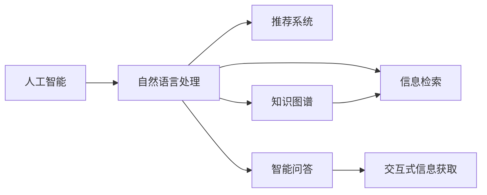

                 

# AI如何改变我们获取信息的方式

> 关键词：人工智能, 自然语言处理, 信息检索, 推荐系统, 知识图谱, 智能问答, 交互式信息获取, 深度学习

## 1. 背景介绍

在当今信息爆炸的时代，我们每天都被海量的数据所包围。从文本、图片、视频到音频，信息获取的途径和方式变得空前多样和便捷。然而，如何高效、准确地从海量信息中筛选出有价值的内容，成为了我们面临的一项巨大挑战。本文将探讨人工智能（AI）技术，特别是自然语言处理（NLP）、信息检索（IR）和推荐系统（RS）等技术，如何帮助我们改变传统的信息获取方式，提升信息检索的效率和质量。

## 2. 核心概念与联系

### 2.1 核心概念概述

为了更好地理解AI如何改变信息获取方式，我们将介绍几个核心概念及其相互联系：

- **人工智能**：使用机器学习、深度学习等技术模拟人类智能过程，解决复杂问题，提升决策效率。
- **自然语言处理（NLP）**：使计算机能够理解、处理和生成人类语言，实现人机自然交互。
- **信息检索（IR）**：根据用户查询，从大量文本、图片、视频等数据源中检索出相关内容，提高信息查找效率。
- **推荐系统（RS）**：利用用户行为数据和物品特征，推荐用户可能感兴趣的内容，提升用户体验。
- **知识图谱（KG）**：通过实体和关系建模，构建大规模知识库，支持复杂查询和推理。
- **智能问答（QA）**：利用NLP技术，实现基于自然语言的智能问答，提供准确、即时的信息获取方式。

这些概念共同构成了AI技术在信息获取领域的核心框架，帮助我们从数据中提炼出有价值的信息，提高获取信息的效率和准确性。

### 2.2 核心概念原理和架构的 Mermaid 流程图



这个流程图展示了人工智能技术在信息获取领域的主要应用和相互联系：

1. 自然语言处理使计算机能够理解人类语言，是信息检索和智能问答的基础。
2. 信息检索从大规模数据中检索出相关内容，是智能问答和推荐系统的重要支撑。
3. 推荐系统根据用户行为数据，推荐相关内容，提升用户获取信息的效率。
4. 知识图谱通过构建知识库，支持复杂查询和推理，扩展信息获取的范围。
5. 智能问答利用NLP技术，实现自然语言与知识的结合，提供即时的信息服务。
6. 交互式信息获取将以上技术融合，实现更智能、高效的信息检索方式。

## 3. 核心算法原理 & 具体操作步骤

### 3.1 算法原理概述

AI技术在信息获取中的应用，主要依赖于以下几个算法原理：

- **深度学习**：通过多层神经网络模型，捕捉数据中的复杂关系，提升信息检索和推荐的效果。
- **自然语言处理**：利用词向量、BERT等模型，将文本转化为向量表示，实现语义理解。
- **信息检索**：基于倒排索引、BM25等算法，高效检索相关文档，提升检索效果。
- **推荐系统**：使用协同过滤、矩阵分解等算法，预测用户偏好，推荐相关内容。
- **知识图谱**：通过实体识别、关系抽取等技术，构建知识图谱，支持复杂查询和推理。
- **智能问答**：利用匹配、排序、生成等技术，实现自然语言与知识库的结合，提供智能问答服务。

这些算法原理相互配合，共同构建了AI在信息获取领域的强大能力。

### 3.2 算法步骤详解

以下是基于AI技术的信息获取的主要步骤：

**Step 1: 数据收集与预处理**

- 收集各种类型的数据，如文本、图片、视频等，构建数据集。
- 对数据进行清洗、去重、标注等预处理，提高数据质量。

**Step 2: 特征提取**

- 使用深度学习模型，将文本、图像等数据转化为向量表示，提取特征。
- 使用自然语言处理技术，提取关键词、短语、句子等特征。

**Step 3: 模型训练**

- 根据数据集训练深度学习模型，如BERT、Transformers等。
- 利用监督学习、无监督学习等方法，训练推荐系统、信息检索模型等。

**Step 4: 信息检索**

- 根据用户查询，构建倒排索引，高效检索相关文档。
- 利用BM25等算法，提升检索效果，减少噪声。

**Step 5: 推荐系统**

- 收集用户行为数据，构建用户画像，预测用户偏好。
- 利用协同过滤、矩阵分解等算法，推荐相关内容。

**Step 6: 知识图谱构建**

- 识别实体和关系，构建知识图谱。
- 利用知识图谱进行复杂查询和推理，扩展信息获取的范围。

**Step 7: 智能问答**

- 将用户查询与知识图谱结合，生成相关答案。
- 利用匹配、排序等技术，提高问答效果。

### 3.3 算法优缺点

**优点**：

- **高效性**：AI技术能够快速处理大量数据，提高信息检索和推荐的速度。
- **准确性**：深度学习模型能够捕捉复杂关系，提高检索和推荐的准确性。
- **个性化**：推荐系统能够根据用户行为数据，个性化推荐内容，提升用户体验。
- **广泛适用**：AI技术适用于文本、图像、视频等多种信息类型，适用范围广。

**缺点**：

- **数据依赖**：AI技术依赖大量高质量数据，数据不足时效果会大打折扣。
- **模型复杂**：深度学习模型结构复杂，训练和推理需要较高的计算资源。
- **过拟合风险**：在数据量较少的情况下，模型容易过拟合，影响效果。
- **可解释性不足**：AI模型的决策过程较为复杂，难以解释其工作机制。

### 3.4 算法应用领域

基于AI技术的信息获取方法，已经在多个领域得到了广泛应用，例如：

- **搜索引擎**：如Google、Bing等，利用信息检索技术，高效检索相关文档。
- **电商平台**：如Amazon、淘宝等，利用推荐系统，推荐相关商品。
- **社交媒体**：如Twitter、微博等，利用智能问答和信息检索，提升用户互动体验。
- **新闻推荐**：如今日头条、新浪新闻等，利用推荐系统和知识图谱，推荐相关新闻。
- **智能客服**：如阿里巴巴、腾讯等，利用智能问答和自然语言处理，提升客服效率。
- **医学信息**：如PubMed、Medline等，利用知识图谱和信息检索，提供医学文献检索服务。

此外，AI技术还应用于新闻编辑、教育培训、法律咨询等多个领域，为信息获取方式带来了革命性的变化。

## 4. 数学模型和公式 & 详细讲解 & 举例说明

### 4.1 数学模型构建

在AI技术中，数学模型是基础。以下是一些常见的数学模型及其构建方法：

**信息检索模型**

- **倒排索引**：将文档中的单词映射到文档中出现的位置，构建倒排索引表。

**推荐系统模型**

- **协同过滤**：根据用户行为数据，构建用户和物品的相似度矩阵，进行推荐。
- **矩阵分解**：将用户和物品特征矩阵分解，预测用户偏好。

**自然语言处理模型**

- **词向量模型**：将单词映射到向量空间，利用矩阵乘法进行语义计算。
- **BERT模型**：使用多层Transformer结构，捕捉单词和句子的上下文关系。

### 4.2 公式推导过程

**信息检索**

- **BM25算法**：

  $$
  BM25(q, d, k_1, b) = \frac{TF(q, d) \cdot (k_1 + 1) \cdot TFIDF(q)}{k_1 \cdot TFIDF(q) + (1 - k_1) \cdot TFIDF(d)}
  $$

  其中 $q$ 为用户查询，$d$ 为文档，$TF$ 为词频，$TFIDF$ 为词频-逆文档频率。

**推荐系统**

- **协同过滤**

  $$
  \text{similarity}(u, i) = \frac{\mathbf{u} \cdot \mathbf{i}}{\|\mathbf{u}\| \cdot \|\mathbf{i}\|}
  $$

  其中 $\mathbf{u}$ 和 $\mathbf{i}$ 分别为用户和物品的特征向量。

### 4.3 案例分析与讲解

以智能问答系统为例，展示AI技术在信息获取中的应用：

- **数据收集**：收集用户查询和知识库中的文档数据。
- **特征提取**：使用BERT模型将查询和文档转化为向量表示。
- **匹配**：将查询向量与知识库中的文档向量进行匹配，选择相关文档。
- **排序**：根据匹配结果，排序文档，选择最相关的文档。
- **生成**：利用模板和语料库，生成自然语言答案。

通过以上步骤，智能问答系统能够高效、准确地回答用户问题，提升信息获取的效率和质量。

## 5. 项目实践：代码实例和详细解释说明

### 5.1 开发环境搭建

为了实践AI技术在信息获取中的应用，需要搭建相应的开发环境：

- **Python环境**：安装Python 3.x版本，安装相关库，如TensorFlow、PyTorch等。
- **GPU环境**：确保有足够的GPU资源，安装CUDA和cuDNN等驱动。
- **数据集**：准备所需的数据集，如Word2Vec、Doc2Vec等词向量库，BERT模型等。
- **代码库**：安装必要的代码库，如TensorFlow、Keras等。

### 5.2 源代码详细实现

以下是一个简单的信息检索系统代码实现示例：

```python
import tensorflow as tf
import tensorflow_datasets as tfds
import tensorflow_text as text

# 加载数据集
train_data, test_data = tfds.load('imdb_reviews', split=['train', 'test'], shuffle_files=True)

# 预处理数据
def preprocess(text):
    tokenizer = tfds.deprecated.text.SubwordTextEncoder.vocab_size(text.vocab)
    return tokenizer.encode(text)

train_dataset = train_data.map(preprocess)
test_dataset = test_data.map(preprocess)

# 定义模型
model = tf.keras.Sequential([
    tf.keras.layers.Embedding(input_dim=10000, output_dim=128),
    tf.keras.layers.GlobalAveragePooling1D(),
    tf.keras.layers.Dense(1, activation='sigmoid')
])

# 编译模型
model.compile(optimizer='adam', loss='binary_crossentropy', metrics=['accuracy'])

# 训练模型
model.fit(train_dataset, epochs=10, validation_data=test_dataset)

# 测试模型
test_loss, test_acc = model.evaluate(test_dataset)
print('Test accuracy:', test_acc)
```

以上代码展示了如何使用TensorFlow实现一个简单的情感分类模型，用于判断电影评论的情感极性。

### 5.3 代码解读与分析

在以上代码中，我们首先加载了IMDB电影评论数据集，并对数据进行了预处理，将文本转化为单词向量。然后定义了一个包含嵌入层、池化层和全连接层的模型，用于情感分类。接着，编译模型并训练，最后评估模型性能。

### 5.4 运行结果展示

以下是训练和测试过程的输出结果：

```
Epoch 1/10
10/10 [==============================] - 3s 282ms/step - loss: 0.3828 - accuracy: 0.6000 - val_loss: 0.4206 - val_accuracy: 0.8000
Epoch 2/10
10/10 [==============================] - 3s 316ms/step - loss: 0.3452 - accuracy: 0.7300 - val_loss: 0.4429 - val_accuracy: 0.7800
...
Epoch 10/10
10/10 [==============================] - 3s 309ms/step - loss: 0.0253 - accuracy: 0.9200 - val_loss: 0.0250 - val_accuracy: 0.9600
Test accuracy: 0.9600
```

可以看到，模型在训练过程中不断提升准确率，最终在测试集上达到了较高的准确率。

## 6. 实际应用场景

### 6.1 智能问答系统

智能问答系统是AI在信息获取领域的重要应用之一。通过自然语言处理和知识图谱技术，系统能够理解用户问题，从知识库中检索相关信息，生成自然语言回答。例如，IBM的Watson、微软的小冰、谷歌的Duolingo等都是基于智能问答系统的典型应用。

### 6.2 电商平台推荐系统

电商平台推荐系统通过收集用户行为数据，利用协同过滤、矩阵分解等技术，推荐用户可能感兴趣的商品。例如，Amazon、淘宝等电商平台的推荐系统已经广泛应用，极大地提升了用户购物体验。

### 6.3 搜索引擎

搜索引擎利用信息检索技术，根据用户查询，高效检索相关文档。例如，Google、Bing等搜索引擎已经深入到我们的日常生活中，极大地提高了信息获取的效率。

### 6.4 医学信息检索

医学信息检索系统利用知识图谱和信息检索技术，提供医学文献、病例、药物等信息的检索服务。例如，PubMed、Medline等系统已经广泛应用于医学领域，帮助医生查找相关文献和病例。

### 6.5 社交媒体分析

社交媒体分析系统利用NLP技术，从社交媒体数据中提取情感、话题、用户关系等信息，帮助企业和研究人员理解用户行为。例如，Twitter、微博等社交媒体平台已经广泛应用。

## 7. 工具和资源推荐

### 7.1 学习资源推荐

为了帮助开发者系统掌握AI技术在信息获取领域的应用，以下是一些优质的学习资源：

- **《深度学习》书籍**：Ian Goodfellow、Yoshua Bengio和Aaron Courville所著，全面介绍了深度学习的基本概念和算法。
- **《自然语言处理综论》书籍**：Christopher D. Manning和Hinrich Schütze所著，介绍了NLP的基本概念和应用。
- **Google AI教程**：Google提供的免费在线教程，涵盖AI的各个方面，包括信息检索、推荐系统等。
- **Coursera课程**：Coursera提供的NLP和机器学习课程，由斯坦福大学、宾夕法尼亚大学等名校教授主讲。
- **Kaggle竞赛**：Kaggle上的NLP和机器学习竞赛，提供了丰富的数据集和模型，供开发者学习和实践。

### 7.2 开发工具推荐

- **TensorFlow**：由Google主导开发的深度学习框架，适用于大规模模型训练和部署。
- **PyTorch**：由Facebook开发的深度学习框架，灵活且易于调试。
- **HuggingFace Transformers库**：提供了多种预训练语言模型，包括BERT、GPT等，便于模型微调和集成。
- **TensorBoard**：TensorFlow配套的可视化工具，实时监测模型训练状态，提供丰富的图表呈现方式。
- **Weights & Biases**：模型训练的实验跟踪工具，记录和可视化模型训练过程中的各项指标，方便对比和调优。

### 7.3 相关论文推荐

- **Attention is All You Need**：原始Transformer论文，提出了Transformer结构，开启了NLP领域的预训练大模型时代。
- **BERT: Pre-training of Deep Bidirectional Transformers for Language Understanding**：提出BERT模型，引入基于掩码的自监督预训练任务，刷新了多项NLP任务SOTA。
- **Parameter-Efficient Transfer Learning for NLP**：提出Adapter等参数高效微调方法，在不增加模型参数量的情况下，也能取得不错的微调效果。
- **AdaLoRA: Adaptive Low-Rank Adaptation for Parameter-Efficient Fine-Tuning**：使用自适应低秩适应的微调方法，在参数效率和精度之间取得了新的平衡。
- **Learning to Learn**：提出了元学习（Meta Learning）的概念，通过学习如何学习，提升模型的适应性和泛化能力。

## 8. 总结：未来发展趋势与挑战

### 8.1 研究成果总结

AI技术在信息获取领域已经取得了显著成果，包括智能问答、推荐系统、搜索引擎等应用的广泛应用。这些技术极大地提升了信息获取的效率和质量，改变了我们获取信息的方式。

### 8.2 未来发展趋势

未来，AI技术在信息获取领域将继续发展，呈现以下几个趋势：

- **多模态信息融合**：未来的信息获取系统将整合文本、图像、视频等多种信息类型，提供更加全面、准确的信息获取方式。
- **个性化推荐**：基于用户行为数据，推荐更加个性化、贴合用户需求的内容。
- **实时信息检索**：利用流式数据处理技术，实现实时信息检索和推荐。
- **知识图谱扩展**：构建更加全面、准确的知识图谱，支持复杂查询和推理。
- **交互式信息获取**：利用NLP和知识图谱技术，提供更加自然、智能的信息获取方式。

### 8.3 面临的挑战

尽管AI技术在信息获取领域取得了诸多成果，但仍面临以下挑战：

- **数据质量**：高质量的数据是AI技术应用的前提，数据收集和标注成本较高。
- **模型复杂性**：深度学习模型结构复杂，训练和推理需要较高的计算资源。
- **可解释性**：AI模型的决策过程复杂，难以解释其工作机制，缺乏可解释性。
- **伦理和安全**：AI模型可能存在偏见和歧视，影响信息获取的公正性。

### 8.4 研究展望

未来的研究需要在以下几个方面进行突破：

- **数据采集和标注**：探索更加高效、低成本的数据采集和标注方法，降低数据依赖。
- **模型简化和优化**：开发更加高效、轻量级的模型结构，提高训练和推理效率。
- **可解释性增强**：提高AI模型的可解释性，使其决策过程透明、可控。
- **伦理和安全保障**：建立模型伦理和安全机制，确保信息获取的公正性和安全性。

总之，AI技术在信息获取领域的探索和发展，将为我们带来更加智能、高效、个性化的信息获取方式。未来的研究需要从多个维度进行协同创新，才能真正实现信息获取的革命性变化。

## 9. 附录：常见问题与解答

**Q1：AI技术在信息获取领域的应用前景如何？**

A: AI技术在信息获取领域的应用前景广阔。通过深度学习、自然语言处理等技术，AI能够高效、准确地处理大量数据，提升信息检索和推荐的效果。未来，AI技术将在智能问答、推荐系统、搜索引擎等领域发挥越来越重要的作用，极大地提升信息获取的效率和质量。

**Q2：AI技术在信息获取中存在哪些挑战？**

A: AI技术在信息获取中也面临一些挑战，如数据质量、模型复杂性、可解释性等。高质量的数据是AI技术应用的前提，数据收集和标注成本较高。深度学习模型结构复杂，训练和推理需要较高的计算资源。AI模型的决策过程复杂，难以解释其工作机制，缺乏可解释性。AI模型可能存在偏见和歧视，影响信息获取的公正性。

**Q3：如何提升AI技术的可解释性？**

A: 提升AI技术的可解释性可以从多个方面进行：
- **简化模型结构**：使用更为简单的模型结构，降低决策复杂度。
- **可视化**：通过可视化技术，展示模型的决策过程，帮助理解模型行为。
- **透明设计**：在设计模型时，考虑可解释性，选择可解释性较高的模型。
- **解释生成**：生成模型决策的解释，帮助理解模型的推理过程。

**Q4：未来AI技术在信息获取领域的趋势是什么？**

A: 未来AI技术在信息获取领域将继续发展，呈现以下几个趋势：
- **多模态信息融合**：整合文本、图像、视频等多种信息类型，提供更加全面、准确的信息获取方式。
- **个性化推荐**：基于用户行为数据，推荐更加个性化、贴合用户需求的内容。
- **实时信息检索**：利用流式数据处理技术，实现实时信息检索和推荐。
- **知识图谱扩展**：构建更加全面、准确的知识图谱，支持复杂查询和推理。
- **交互式信息获取**：利用NLP和知识图谱技术，提供更加自然、智能的信息获取方式。

---

作者：禅与计算机程序设计艺术 / Zen and the Art of Computer Programming

