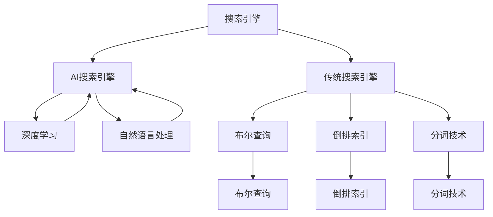

                 

## 1. 背景介绍

随着互联网的普及和信息量的爆炸性增长，搜索引擎已成为现代信息社会的重要基础设施。传统搜索引擎如Google、Bing等，依靠布尔查询、倒排索引、分词技术等，实现了信息的高效检索和展示。但随着大数据、AI技术的发展，新一代的AI搜索引擎应运而生，它们通过深度学习、自然语言处理等先进技术，提升了搜索的精准度和用户体验。本文将对比AI搜索引擎与传统搜索引擎的效率，探讨其各自的优势与不足，展望未来发展方向。

## 2. 核心概念与联系

### 2.1 核心概念概述

为理解AI搜索引擎与传统搜索引擎的效率对比，本节将介绍一些核心概念及其联系：

- **搜索引擎（Search Engine）**：通过索引数据库、分析用户查询、匹配相关文档，快速返回用户所需信息的系统。
- **AI搜索引擎（AI Search Engine）**：结合机器学习、深度学习、自然语言处理等AI技术，实现更精准的搜索和自然语言交互的系统。
- **传统搜索引擎（Classical Search Engine）**：基于布尔查询、倒排索引、分词技术等传统手段，实现高效检索的系统。
- **搜索结果质量（Search Quality）**：搜索引擎返回结果的相关性、准确性和时效性。
- **搜索速度（Search Speed）**：搜索引擎从接收查询到返回结果的响应时间。
- **计算资源消耗（Computational Resource Consumption）**：搜索引擎在处理查询时所需的计算资源，包括CPU、内存、存储等。
- **用户体验（User Experience）**：用户对搜索引擎的满意度，包括易用性、响应速度、搜索结果质量等。

这些概念之间的联系可以通过以下Mermaid流程图来展示：



这个流程图展示了搜索引擎的核心技术和组件，以及AI搜索引擎如何利用深度学习和自然语言处理技术来提升性能。

## 3. 核心算法原理 & 具体操作步骤

### 3.1 算法原理概述

AI搜索引擎与传统搜索引擎的核心算法差异主要在于对自然语言处理（NLP）的依赖程度。AI搜索引擎利用深度学习模型如Transformer、BERT等，捕捉语义信息，提升搜索相关性。而传统搜索引擎则依赖于布尔查询、倒排索引、分词技术，通过精确匹配文本关键词实现检索。

AI搜索引擎的算法原理可以概括为以下几个步骤：

1. **文本预处理**：将用户查询和文档进行分词、去除停用词、标注词性等操作。
2. **特征提取**：使用预训练模型如BERT、GPT等，将用户查询和文档嵌入到高维向量空间。
3. **相似度计算**：通过计算向量之间的余弦相似度、点积等，判断查询和文档的相关性。
4. **排序和展示**：将相关文档排序，并展示给用户。

### 3.2 算法步骤详解

以AI搜索引擎为例，其核心算法步骤如下：

**Step 1: 文本预处理**

- **分词和去停用词**：使用NLTK、spaCy等工具对用户查询和文档进行分词和去停用词操作，去除对搜索无关紧要的无意义词汇。
- **词性标注**：使用spaCy、StanfordNLP等工具对分词结果进行词性标注，进一步提升特征提取的效果。

**Step 2: 特征提取**

- **嵌入层**：使用预训练模型如BERT、GPT等，将用户查询和文档转换为高维向量。
- **池化层**：对向量进行池化操作，提取最重要部分，用于后续的相似度计算。

**Step 3: 相似度计算**

- **余弦相似度**：计算用户查询向量与文档向量之间的余弦相似度，衡量相关性。
- **点积相似度**：计算用户查询向量与文档向量之间的点积，同样衡量相关性。

**Step 4: 排序和展示**

- **排序算法**：使用最大堆、排序算法等，将相关文档按照相似度从高到低排序。
- **展示界面**：展示排序后的文档列表，用户可以根据相关性选择最满意的结果。

### 3.3 算法优缺点

AI搜索引擎的主要优点包括：

- **精度高**：深度学习模型能够捕捉语义信息，提升搜索结果的相关性。
- **用户体验好**：自然语言处理技术可以实现自然语言的交互，提升用户满意度。
- **动态更新**：基于用户行为和反馈，AI搜索引擎能够动态调整搜索结果，提升长期性能。

其主要缺点包括：

- **计算资源消耗大**：深度学习模型需要大量计算资源，处理大规模数据集时效率较低。
- **训练数据需求高**：需要大规模的标注数据进行模型训练，数据获取成本较高。
- **解释性差**：深度学习模型的决策过程缺乏可解释性，难以理解和调试。

### 3.4 算法应用领域

AI搜索引擎已经广泛应用于多个领域，包括：

- **电商搜索**：如亚马逊、淘宝等电商平台，通过用户查询快速推荐商品。
- **社交媒体**：如Twitter、微信等社交平台，实现智能搜索和推荐。
- **新闻和信息聚合**：如Google News、Flipboard等，快速获取和展示新闻信息。
- **语音搜索**：如Siri、Google Assistant等，通过语音交互进行搜索。
- **医疗搜索**：如WebMD、MedlinePlus等，提供医学信息和疾病查询。

## 4. 数学模型和公式 & 详细讲解 & 举例说明

### 4.1 数学模型构建

AI搜索引擎的核心模型通常基于深度学习，以BERT为例，其数学模型可以表示为：

$$
\mathcal{L}(\theta) = \frac{1}{N}\sum_{i=1}^N -\frac{1}{d_k}\sum_{j=1}^{d_k}\left(1-y_i\right)\log\left(\sigma\left(-z_j^i\right)\right)+y_i\log\left(1-\sigma\left(-z_j^i\right)\right)
$$

其中，$\theta$为模型参数，$d_k$为词汇表大小，$y_i$为标签，$\sigma$为Sigmoid函数。

### 4.2 公式推导过程

上述公式中的关键点在于计算$z_j^i$，它表示查询$q_i$和文档$d_j$的交互结果。具体推导过程如下：

1. **查询向量和文档向量的计算**：
   - 查询向量：$Q_i=\text{BERT}(Q_i)$
   - 文档向量：$D_j=\text{BERT}(D_j)$

2. **交互向量的计算**：
   - $z_j^i = Q_iD_j^T$

3. **损失函数计算**：
   - 交叉熵损失函数

4. **梯度更新**：
   - 使用Adam、SGD等优化算法，计算梯度并更新参数$\theta$

### 4.3 案例分析与讲解

以新闻推荐为例，假设模型需要根据用户的历史点击记录推荐新闻。模型首先对用户查询和新闻文本进行分词、去停用词等预处理，然后使用BERT模型将查询和新闻文本转换为向量表示，计算相似度并选择相关新闻。用户点击的记录作为训练标签，指导模型的优化过程。

## 5. 项目实践：代码实例和详细解释说明

### 5.1 开发环境搭建

要搭建AI搜索引擎的开发环境，需要安装以下软件包：

- **Python**：3.6或更高版本。
- **TensorFlow或PyTorch**：用于深度学习模型的训练和推理。
- **NLTK**：用于分词和去停用词。
- **spaCy**：用于词性标注。

### 5.2 源代码详细实现

以下是一个使用PyTorch实现新闻推荐系统的示例代码：

```python
import torch
from torch import nn, optim
import torch.nn.functional as F
from transformers import BertTokenizer, BertForSequenceClassification

# 定义模型
class NewsRecommender(nn.Module):
    def __init__(self, n_classes):
        super(NewsRecommender, self).__init__()
        self.bert = BertForSequenceClassification.from_pretrained('bert-base-uncased', num_labels=n_classes)
        self.dropout = nn.Dropout(0.5)
        self.out = nn.Linear(768, n_classes)
        
    def forward(self, inputs, attention_mask, token_type_ids):
        outputs = self.bert(inputs, attention_mask=attention_mask, token_type_ids=token_type_ids)
        pooled_output = outputs.pooler_output
        pooled_output = self.dropout(pooled_output)
        output = self.out(pooled_output)
        return output

# 训练模型
def train(model, device, train_loader, optimizer, epochs):
    model.to(device)
    for epoch in range(epochs):
        model.train()
        for batch in train_loader:
            input_ids = batch['input_ids'].to(device)
            attention_mask = batch['attention_mask'].to(device)
            token_type_ids = batch['token_type_ids'].to(device)
            labels = batch['labels'].to(device)
            optimizer.zero_grad()
            outputs = model(input_ids, attention_mask=attention_mask, token_type_ids=token_type_ids)
            loss = F.cross_entropy(outputs, labels)
            loss.backward()
            optimizer.step()
        print(f'Epoch {epoch+1}, Loss: {loss.item()}')

# 加载数据
train_dataset = ...
train_loader = ...

# 训练模型
model = NewsRecommender(n_classes)
optimizer = optim.Adam(model.parameters(), lr=1e-5)
device = torch.device('cuda' if torch.cuda.is_available() else 'cpu')
train(model, device, train_loader, optimizer, epochs)
```

### 5.3 代码解读与分析

**模型定义**：
- 使用BERT模型作为特征提取器，添加一个线性层用于输出新闻类别。
- Dropout层用于防止过拟合。

**训练函数**：
- 对每个批次进行前向传播和反向传播，更新模型参数。

**数据加载**：
- 使用PyTorch的DataLoader加载训练集，定义输入和标签。

**训练过程**：
- 使用Adam优化器，设置合适的学习率。
- 在GPU上训练模型，并打印损失值。

### 5.4 运行结果展示

在训练完成后，模型可以在测试集上进行评估，计算准确率和召回率等指标。

## 6. 实际应用场景

### 6.1 电商搜索

电商搜索系统需要快速匹配用户查询和商品信息。AI搜索引擎通过深度学习模型捕捉用户意图和商品描述的语义信息，实现精确的搜索结果匹配。例如，用户查询“iPhone 12”，系统能够快速找到相关的iPhone 12产品，并提供价格、评价等信息。

### 6.2 社交媒体

社交媒体平台如Twitter、Facebook等，需要实时处理海量用户输入和内容。AI搜索引擎通过自然语言处理技术，快速理解用户意图和内容，实现智能推荐和搜索结果展示。例如，用户在Twitter上搜索特定话题，系统能够展示相关帖子和热门话题标签。

### 6.3 新闻和信息聚合

新闻聚合系统如Google News、Flipboard等，需要高效地抓取和展示新闻内容。AI搜索引擎通过深度学习模型捕捉新闻标题和正文的语义信息，实现精准的搜索结果排序和推荐。例如，用户搜索“新冠疫苗最新进展”，系统能够展示相关的最新新闻和专家评论。

### 6.4 语音搜索

语音搜索系统如Siri、Google Assistant等，需要快速理解和回应语音查询。AI搜索引擎通过深度学习模型捕捉语音输入的语义信息，实现自然的交互和搜索结果展示。例如，用户说“明天天气怎么样”，系统能够回答“今天天气晴朗，温度28度”。

### 6.5 医疗搜索

医疗搜索系统如WebMD、MedlinePlus等，需要提供医学信息和疾病查询。AI搜索引擎通过深度学习模型捕捉医学词汇的语义信息，实现精准的搜索结果匹配和推荐。例如，用户搜索“高血压治疗”，系统能够展示相关的医学信息和推荐文章。

## 7. 工具和资源推荐

### 7.1 学习资源推荐

为了帮助开发者系统掌握AI搜索引擎的理论基础和实践技巧，这里推荐一些优质的学习资源：

1. **《深度学习》（Ian Goodfellow）**：深入浅出地介绍了深度学习的理论基础和实践技巧。
2. **《自然语言处理综论》（Daniel Jurafsky, James H. Martin）**：系统讲解了自然语言处理的基本概念和前沿技术。
3. **Coursera上的自然语言处理课程**：由斯坦福大学开设，涵盖了深度学习、自然语言处理等前沿技术。
4. **Hugging Face官方文档**：提供了大量预训练模型和完整的AI搜索引擎开发样例代码，是上手实践的必备资料。
5. **Google AI博客**：分享了大量AI搜索技术的最新研究和应用案例，值得关注。

### 7.2 开发工具推荐

高效的开发离不开优秀的工具支持。以下是几款用于AI搜索引擎开发的常用工具：

1. **PyTorch**：基于Python的开源深度学习框架，灵活动态的计算图，适合快速迭代研究。
2. **TensorFlow**：由Google主导开发的开源深度学习框架，生产部署方便，适合大规模工程应用。
3. **NLTK**：Python的自然语言处理工具包，提供了分词、词性标注、句法分析等功能。
4. **spaCy**：另一个Python的自然语言处理工具包，速度较快，适合大规模文本处理。
5. **ElasticSearch**：分布式搜索引擎，支持大规模数据检索和索引。
6. **Flask**：Python的Web框架，适合构建搜索界面和API。

### 7.3 相关论文推荐

AI搜索引擎技术的发展源于学界的持续研究。以下是几篇奠基性的相关论文，推荐阅读：

1. **Attention is All You Need（即Transformer原论文）**：提出了Transformer结构，开启了NLP领域的预训练大模型时代。
2. **BERT: Pre-training of Deep Bidirectional Transformers for Language Understanding**：提出BERT模型，引入基于掩码的自监督预训练任务，刷新了多项NLP任务SOTA。
3. **Google News 2.0**：介绍了Google News 2.0的设计和实现，展示了深度学习在新闻推荐中的应用。
4. **T5: Exploring the Limits of Transfer Learning with a Unified Text-to-Text Transformer**：提出T5模型，展示了多任务预训练在自然语言处理中的应用。
5. **SUG: Scalable Unsupervised Graph Neural Network for Web News Topic Modeling**：介绍了图神经网络在新闻聚类中的应用。

## 8. 总结：未来发展趋势与挑战

### 8.1 总结

本文对AI搜索引擎与传统搜索引擎的效率进行了全面系统的对比。首先阐述了两种搜索引擎的核心算法原理和操作步骤，明确了AI搜索引擎在深度学习、自然语言处理等技术上的优势。其次，通过代码实例和详细解释说明，展示了AI搜索引擎的开发和部署流程。最后，探讨了AI搜索引擎在电商搜索、社交媒体、新闻聚合、语音搜索和医疗搜索等多个领域的实际应用场景，展示了其广阔的应用前景。

通过本文的系统梳理，可以看到，AI搜索引擎通过深度学习、自然语言处理等技术，提升了搜索的精准度和用户体验。未来，伴随AI技术的发展，AI搜索引擎必将在更多领域得到应用，为人类提供更加智能和便捷的信息获取方式。

### 8.2 未来发展趋势

展望未来，AI搜索引擎的发展趋势包括：

1. **多模态搜索**：结合文本、图像、视频等多种模态信息，实现更全面的信息检索。
2. **个性化推荐**：利用用户行为和上下文信息，实现更个性化的搜索结果推荐。
3. **实时处理**：通过流式处理技术，实现实时查询处理和响应。
4. **联邦学习**：在保护用户隐私的前提下，利用分布式计算，提升搜索结果质量和推荐精度。
5. **跨语言处理**：实现多语言自动翻译和跨语言搜索，打破语言障碍。
6. **可视化搜索**：通过交互式可视化界面，提升用户的操作体验和理解能力。

### 8.3 面临的挑战

尽管AI搜索引擎已经取得了显著进展，但在实际应用中仍面临以下挑战：

1. **计算资源消耗大**：深度学习模型需要大量计算资源，处理大规模数据集时效率较低。
2. **数据获取成本高**：需要大规模的标注数据进行模型训练，数据获取成本较高。
3. **模型泛化能力不足**：模型在特定领域和场景下可能表现不佳，泛化能力有待提升。
4. **安全性问题**：AI搜索引擎需要处理大量敏感数据，安全性问题值得关注。
5. **用户隐私保护**：用户行为和搜索历史是敏感信息，如何保护用户隐私是重要课题。
6. **公平性问题**：搜索结果可能存在偏见，需要公正地处理不同用户的需求和偏好。

### 8.4 研究展望

未来，AI搜索引擎的研究方向包括：

1. **轻量化模型**：开发更小规模的轻量化模型，提升计算效率。
2. **多任务学习**：结合多个任务进行联合训练，提升模型的泛化能力和适用性。
3. **迁移学习**：利用预训练模型进行迁移学习，提升在不同领域和场景下的表现。
4. **联邦学习**：利用分布式计算，保护用户隐私的同时提升模型性能。
5. **可解释性研究**：研究模型的可解释性，提升用户对搜索结果的理解和信任。
6. **跨语言搜索**：实现多语言自动翻译和跨语言搜索，提升国际用户的使用体验。

总之，AI搜索引擎技术正处于快速发展时期，未来将会有更多创新和突破，为人类提供更加智能和便捷的信息获取方式。

