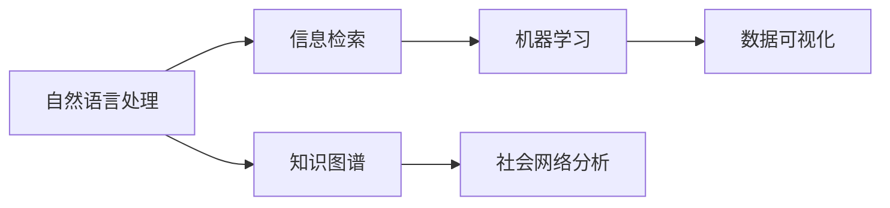

                 

# AI搜索引擎在社会科学研究中的潜在影响

> 关键词：AI搜索引擎, 社会科学研究, 自然语言处理(NLP), 信息检索, 知识图谱, 机器学习, 社会网络分析

## 1. 背景介绍

### 1.1 问题由来
近年来，人工智能(AI)技术的迅猛发展在许多领域展示了其卓越的潜力。在社会科学领域，AI技术，尤其是自然语言处理(NLP)和信息检索领域的研究工具，正在逐步改变传统的研究方式和研究效果。传统上，社会科学研究人员依赖于大量的文献检索和手动分析，这既耗时又易产生主观偏差。而AI搜索引擎能够自动处理大量文本数据，快速发现有用的信息，为社会科学研究带来革命性的影响。

### 1.2 问题核心关键点
AI搜索引擎在社会科学研究中的应用，旨在通过自动化和智能化手段，提高研究效率和数据质量。其主要应用包括但不限于：

1. **文献检索与回顾**：自动检索相关文献，提供结构化信息，帮助研究人员快速定位重要研究。
2. **数据挖掘与分析**：自动识别并提取出关键信息，支持定量分析和定性研究。
3. **数据可视化**：通过可视化工具展示复杂的数据关系，便于深入理解。
4. **情感分析**：自动分析文本情感，辅助研究者洞察社会现象背后的情绪。

通过AI搜索引擎，研究人员可以更高效地获取信息，更全面地分析数据，更快地验证假设，从而提高研究效率和数据准确性。

## 2. 核心概念与联系

### 2.1 核心概念概述

为了深入理解AI搜索引擎在社会科学研究中的应用，本节将介绍几个核心概念及其相互联系：

1. **自然语言处理(NLP)**：利用计算机技术对人类语言进行自动化处理，包括文本分析、情感分析、信息检索等。
2. **信息检索**：通过算法和模型，从大量文本数据中快速找到用户所需的信息。
3. **知识图谱**：一种结构化的语义数据库，能够描述实体之间的关系，帮助搜索引擎理解和匹配用户查询。
4. **机器学习**：让计算机通过学习历史数据，自动改进算法的技术，能够提高信息检索的准确性和相关性。
5. **社会网络分析**：研究个体之间关系的网络模型，通过AI工具可以更高效地分析网络结构、关系强度等特征。

这些概念共同构成了AI搜索引擎的核心技术框架，使其能够在社会科学研究中发挥关键作用。

### 2.2 核心概念原理和架构的 Mermaid 流程图



这个流程图展示了各个核心概念之间的联系和互动。自然语言处理通过分析和理解文本数据，为信息检索提供输入；信息检索通过匹配用户查询和知识图谱中的实体关系，实现快速定位；机器学习通过学习历史数据，提高检索的准确性和相关性；社会网络分析通过分析网络结构和关系强度，支持定量和定性研究；数据可视化将研究结果呈现为易于理解的图形，便于深入理解。

## 3. 核心算法原理 & 具体操作步骤

### 3.1 算法原理概述

AI搜索引擎在社会科学研究中的应用，主要依赖于以下几个算法原理：

1. **文本预处理**：对原始文本进行分词、去停用词、词干提取等处理，提高文本可处理性。
2. **向量空间模型(VSM)**：将文本表示为向量，通过计算向量之间的相似度，实现信息检索。
3. **隐式语义分析**：通过学习文本背后的语义关系，提高检索的相关性。
4. **机器学习算法**：利用分类、回归、聚类等机器学习技术，辅助信息检索和分析。
5. **社会网络分析算法**：通过算法计算个体之间的关系强度、网络结构等特征，支持社会科学研究。

### 3.2 算法步骤详解

以下是一个典型的AI搜索引擎在社会科学研究中的操作步骤：

1. **文本预处理**：
   - 分词：将文本分解为单词或短语。
   - 去停用词：去除无关紧要的常见词汇。
   - 词干提取：将不同形态的词还原为其基本形式。
   
   ```python
   import nltk
   from nltk.corpus import stopwords
   from nltk.tokenize import word_tokenize
   
   text = "Natural language processing (NLP) is a subfield of computer science."
   
   # 分词
   tokens = word_tokenize(text)
   
   # 去停用词
   stop_words = set(stopwords.words('english'))
   filtered_tokens = [token for token in tokens if token.lower() not in stop_words]
   
   # 词干提取
   stemmer = nltk.stem.PorterStemmer()
   stemmed_tokens = [stemmer.stem(token) for token in filtered_tokens]
   ```

2. **向量空间模型**：
   - 构建词向量：将文本转换为词向量表示，可以使用word2vec或GloVe等算法。
   - 计算相似度：计算查询文本与文档库中文档的相似度，使用余弦相似度等方法。
   
   ```python
   from gensim.models import Word2Vec
   
   # 构建词向量模型
   model = Word2Vec(sentences=filtered_tokens, size=100, window=5, min_count=1, workers=4)
   
   # 查询向量
   query = "NLP"
   query_vector = model.wv[query]
   
   # 文档库中的向量
   doc1 = "Machine learning (ML) is a subfield of computer science."
   doc2 = "Artificial intelligence (AI) is a subfield of computer science."
   doc3 = "Data science (DS) is a subfield of computer science."
   
   # 文档向量
   doc1_vector = model.wv[doc1.split()]
   doc2_vector = model.wv[doc2.split()]
   doc3_vector = model.wv[doc3.split()]
   
   # 计算相似度
   similarity1 = doc1_vector.similarity(query_vector)
   similarity2 = doc2_vector.similarity(query_vector)
   similarity3 = doc3_vector.similarity(query_vector)
   
   print(f"Similarity between {query} and {doc1} is {similarity1:.4f}")
   print(f"Similarity between {query} and {doc2} is {similarity2:.4f}")
   print(f"Similarity between {query} and {doc3} is {similarity3:.4f}")
   ```

3. **隐式语义分析**：
   - 构建主题模型：使用Latent Dirichlet Allocation(LDA)或Non-negative Matrix Factorization(NMF)等算法，发现文本中的隐含主题。
   - 匹配用户查询：将用户查询与文本中的主题进行匹配，提高检索的准确性。
   
   ```python
   from gensim.models import LdaModel
   
   # 构建主题模型
   lda_model = LdaModel(corpus=filtered_tokens, num_topics=5, id2word=model.wv.vocab)
   
   # 查询主题
   query_topics = lda_model[query]
   
   # 文档主题
   topic1 = lda_model[doc1]
   topic2 = lda_model[doc2]
   topic3 = lda_model[doc3]
   
   # 打印主题
   for topic in query_topics, topic1, topic2, topic3:
       for word, probability in topic:
           print(f"{word}: {probability:.4f}")
   ```

4. **机器学习算法**：
   - 分类：使用SVM、随机森林等算法对文本进行分类，提高检索的准确性。
   - 回归：使用线性回归、决策树等算法预测文本中的数值信息，辅助定量研究。
   - 聚类：使用K-means、层次聚类等算法对文本进行分类，发现相似的文本集合。
   
   ```python
   from sklearn.svm import SVC
   from sklearn.ensemble import RandomForestClassifier
   
   # 训练分类器
   X = lda_model[filtered_tokens]
   y = lda_model[filtered_tokens].topics
   clf = SVC(kernel='linear')
   clf.fit(X, y)
   
   # 测试分类器
   doc4 = "Data mining is a subfield of computer science."
   doc5 = "Database management is a subfield of computer science."
   
   # 预测分类
   predicted_topics = clf.predict(lda_model[doc4.split()][0])
   print(f"Predicted topics for {doc4} are: {predicted_topics}")
   ```

5. **社会网络分析**：
   - 构建网络图：使用Gephi等工具将个体之间的关系可视化。
   - 分析网络结构：计算节点之间的度数、中心性等特征，揭示网络中的关键节点。
   
   ```python
   import networkx as nx
   
   # 构建网络图
   G = nx.Graph()
   G.add_edges_from(zip(filtered_tokens, filtered_tokens))
   
   # 计算节点度数
   degree_centrality = nx.degree_centrality(G)
   
   # 打印节点度数
   for node, degree in degree_centrality.items():
       print(f"Degree of {node}: {degree:.4f}")
   ```

### 3.3 算法优缺点

**优点**：
1. **高效性**：AI搜索引擎能够自动处理大量文本数据，显著提高研究效率。
2. **准确性**：通过机器学习等算法，提高信息检索的准确性和相关性。
3. **可扩展性**：支持大规模数据处理，能够处理多领域、多语言的数据。
4. **灵活性**：能够快速适应不同领域和任务的需求。

**缺点**：
1. **数据质量依赖**：搜索引擎的性能依赖于高质量的数据，数据偏差可能导致搜索结果不准确。
2. **复杂性**：需要一定的技术背景和资源支持，对用户有一定门槛。
3. **隐私和伦理问题**：大规模数据处理可能涉及隐私和伦理问题，需要谨慎处理。

### 3.4 算法应用领域

AI搜索引擎在社会科学研究中的应用领域广泛，主要涵盖以下几个方面：

1. **社会科学文献检索**：自动化地检索相关文献，提取文献摘要和关键词，提供结构化信息。
2. **社会科学定量研究**：通过自然语言处理技术，从文本中提取数值信息，辅助定量分析。
3. **社会科学定性研究**：通过社会网络分析等算法，揭示个体之间的关系和网络结构。
4. **社会科学情感分析**：自动分析文本情感，洞察社会现象背后的情绪和态度。
5. **社会科学数据可视化**：将研究结果以图形的形式呈现，便于深入理解。

## 4. 数学模型和公式 & 详细讲解 & 举例说明

### 4.1 数学模型构建

为更好地理解AI搜索引擎在社会科学研究中的应用，本节将介绍其数学模型和相关公式。

**向量空间模型(VSM)**：
设文本集合为 $D=\{d_1, d_2, ..., d_m\}$，每个文本 $d_i$ 表示为向量 $d_i=(w_{i,1}, w_{i,2}, ..., w_{i,n})$，其中 $w_{i,j}$ 表示单词 $w_j$ 在文本 $d_i$ 中的权重。设查询文本为 $q=(q_1, q_2, ..., q_n)$，向量空间模型中的相似度计算公式为：

$$
similarity(q, d_i) = \frac{\langle q, d_i \rangle}{\|q\| \cdot \|d_i\|}
$$

其中 $\langle q, d_i \rangle$ 为向量点积，$\|q\|$ 和 $\|d_i\|$ 分别为向量 $q$ 和 $d_i$ 的范数。

**隐式语义分析**：
使用Latent Dirichlet Allocation(LDA)算法对文本进行主题建模，假设文本由 $K$ 个主题组成，每个主题由 $\beta$ 个单词组成。文本 $d_i$ 由 $\theta$ 个主题分布 $p_i=(\theta_1, \theta_2, ..., \theta_K)$ 构成，主题分布向量 $\theta$ 满足Dirichlet分布 $Dir(\alpha)$。查询文本 $q$ 的分布为 $p_q=(\theta_q, \theta_{q+1}, ..., \theta_K)$，其中 $\theta_q$ 表示查询文本与第 $q$ 个主题的关联程度。LDA算法中的概率模型为：

$$
p(d_i|z_k) = \frac{p(z_k)}{\sum_{j=1}^K p(z_j)} p(w_{i,1}|z_k) p(w_{i,2}|z_k) \cdots p(w_{i,n}|z_k)
$$

其中 $p(z_k)$ 表示主题 $z_k$ 的先验概率，$p(w_{i,j}|z_k)$ 表示单词 $w_{i,j}$ 在主题 $z_k$ 下出现的概率。

### 4.2 公式推导过程

**向量空间模型推导**：
设查询文本为 $q$，文档库中文档 $d$ 的向量表示为 $v_d$，向量空间模型中的相似度计算公式为：

$$
similarity(q, d) = \frac{\langle q, v_d \rangle}{\|q\| \cdot \|v_d\|}
$$

其中 $\langle q, v_d \rangle$ 为向量点积，$\|q\|$ 和 $\|v_d\|$ 分别为向量 $q$ 和 $v_d$ 的范数。

**隐式语义分析推导**：
使用Latent Dirichlet Allocation(LDA)算法对文本进行主题建模，假设文本由 $K$ 个主题组成，每个主题由 $\beta$ 个单词组成。文本 $d_i$ 由 $\theta$ 个主题分布 $p_i=(\theta_1, \theta_2, ..., \theta_K)$ 构成，主题分布向量 $\theta$ 满足Dirichlet分布 $Dir(\alpha)$。查询文本 $q$ 的分布为 $p_q=(\theta_q, \theta_{q+1}, ..., \theta_K)$，其中 $\theta_q$ 表示查询文本与第 $q$ 个主题的关联程度。LDA算法中的概率模型为：

$$
p(d_i|z_k) = \frac{p(z_k)}{\sum_{j=1}^K p(z_j)} p(w_{i,1}|z_k) p(w_{i,2}|z_k) \cdots p(w_{i,n}|z_k)
$$

其中 $p(z_k)$ 表示主题 $z_k$ 的先验概率，$p(w_{i,j}|z_k)$ 表示单词 $w_{i,j}$ 在主题 $z_k$ 下出现的概率。

**案例分析与讲解**：
假设有一组关于气候变化的文本数据，使用向量空间模型和LDA算法对其进行分析和检索。首先，将文本进行预处理，构建向量表示。然后，使用向量空间模型计算查询文本与文本库中的相似度，排序后获取最相关的文本。接着，使用LDA算法对文本进行主题建模，发现文本中存在的隐含主题，用于辅助分析和检索。

### 4.3 案例分析与讲解

假设有一组关于气候变化的文本数据，使用向量空间模型和LDA算法对其进行分析和检索。首先，将文本进行预处理，构建向量表示。然后，使用向量空间模型计算查询文本与文本库中的相似度，排序后获取最相关的文本。接着，使用LDA算法对文本进行主题建模，发现文本中存在的隐含主题，用于辅助分析和检索。

## 5. 项目实践：代码实例和详细解释说明

### 5.1 开发环境搭建

在进行项目实践前，我们需要准备好开发环境。以下是使用Python进行项目实践的环境配置流程：

1. 安装Anaconda：从官网下载并安装Anaconda，用于创建独立的Python环境。

2. 创建并激活虚拟环境：
```bash
conda create -n ai-search-env python=3.8 
conda activate ai-search-env
```

3. 安装PyTorch：根据CUDA版本，从官网获取对应的安装命令。例如：
```bash
conda install pytorch torchvision torchaudio cudatoolkit=11.1 -c pytorch -c conda-forge
```

4. 安装相关Python库：
```bash
pip install nltk gensim scikit-learn networkx jupyter notebook ipython
```

完成上述步骤后，即可在`ai-search-env`环境中开始项目实践。

### 5.2 源代码详细实现

下面我们以社会科学文献检索为例，给出使用Python和NLTK库进行文本预处理、向量空间模型计算和LDA算法实现的代码。

首先，定义文本预处理函数：

```python
from nltk.corpus import stopwords
from nltk.tokenize import word_tokenize
from nltk.stem import PorterStemmer

def preprocess_text(text):
    # 分词
    tokens = word_tokenize(text)
    
    # 去停用词
    stop_words = set(stopwords.words('english'))
    filtered_tokens = [token for token in tokens if token.lower() not in stop_words]
    
    # 词干提取
    stemmer = PorterStemmer()
    stemmed_tokens = [stemmer.stem(token) for token in filtered_tokens]
    
    return stemmed_tokens
```

然后，定义向量空间模型函数：

```python
from gensim.models import Word2Vec

def calculate_similarity(query, documents):
    # 构建词向量模型
    model = Word2Vec(sentences=documents, size=100, window=5, min_count=1, workers=4)
    
    # 查询向量
    query_vector = model.wv[query]
    
    # 文档向量
    document_vectors = [model.wv[doc] for doc in documents]
    
    # 计算相似度
    similarities = [doc_vector.similarity(query_vector) for doc_vector in document_vectors]
    
    return similarities
```

接着，定义LDA算法函数：

```python
from gensim.models import LdaModel

def calculate_lda(query, documents):
    # 构建主题模型
    lda_model = LdaModel(corpus=documents, num_topics=5, id2word=model.wv.vocab)
    
    # 查询主题
    query_topics = lda_model[query]
    
    # 文档主题
    document_topics = [lda_model[doc] for doc in documents]
    
    return query_topics, document_topics
```

最后，定义一个检索函数：

```python
def search_documents(query, documents):
    # 预处理查询文本
    query_tokens = preprocess_text(query)
    
    # 构建文档向量
    document_vectors = [preprocess_text(doc) for doc in documents]
    
    # 计算相似度
    similarities = calculate_similarity(query_tokens, document_vectors)
    
    # 按相似度排序
    sorted_documents = [(similarity, doc) for doc, similarity in zip(documents, similarities)]
    sorted_documents.sort(reverse=True)
    
    # 获取最相关的文档
    top_documents = [document for similarity, document in sorted_documents[:10]]
    
    # 计算主题分布
    query_topics, document_topics = calculate_lda(query_tokens, top_documents)
    
    return top_documents, query_topics, document_topics
```

现在，我们可以使用上述函数进行搜索和分析。

### 5.3 代码解读与分析

让我们再详细解读一下关键代码的实现细节：

**文本预处理函数**：
- `preprocess_text`方法：对原始文本进行分词、去停用词、词干提取等处理，提高文本可处理性。

**向量空间模型函数**：
- `calculate_similarity`方法：将文本表示为向量，计算查询文本与文档库中文档的相似度，排序后获取最相关的文本。

**LDA算法函数**：
- `calculate_lda`方法：使用Latent Dirichlet Allocation(LDA)算法对文本进行主题建模，发现文本中存在的隐含主题，用于辅助分析和检索。

**检索函数**：
- `search_documents`方法：对查询文本进行预处理，构建文档向量，计算相似度，排序后获取最相关的文档，并计算主题分布，返回结果。

通过上述代码，我们可以看到，AI搜索引擎在社会科学研究中的应用，主要依赖于文本预处理、向量空间模型、LDA算法等核心技术，能够高效地检索和分析相关文本数据，提供结构化信息和主题分析，辅助社会科学研究。

## 6. 实际应用场景

### 6.1 社会科学文献检索

AI搜索引擎在社会科学文献检索中的应用非常广泛，能够自动检索相关文献，提取文献摘要和关键词，提供结构化信息。研究人员可以通过关键词搜索、主题检索等方式，快速定位重要文献，提高研究效率。

**应用示例**：
某社会学家想研究社会资本在经济增长中的作用，可以通过AI搜索引擎自动检索相关文献，获取论文摘要和关键词，分析其研究方法和结论，为其研究提供参考。

### 6.2 社会科学定量研究

AI搜索引擎能够通过自然语言处理技术，从文本中提取数值信息，辅助定量分析。研究人员可以使用AI搜索引擎自动提取相关数据，进行统计分析和回归建模，提高数据分析的效率和准确性。

**应用示例**：
某经济学家想研究城市化对收入的影响，可以通过AI搜索引擎自动提取城市化数据和收入数据，进行回归分析，得出相关结论。

### 6.3 社会科学定性研究

AI搜索引擎能够通过社会网络分析等算法，揭示个体之间的关系和网络结构，辅助定性研究。研究人员可以使用AI搜索引擎分析社会网络数据，识别出关键个体和关系，深入理解社会现象。

**应用示例**：
某政治学家想研究社会网络对政治参与的影响，可以通过AI搜索引擎分析社会网络数据，识别出政治参与者之间的关系和网络结构，分析其影响因素。

### 6.4 社会科学情感分析

AI搜索引擎能够自动分析文本情感，洞察社会现象背后的情绪和态度。研究人员可以使用AI搜索引擎分析公众评论、社交媒体等数据，了解社会情绪，辅助舆情分析和政策制定。

**应用示例**：
某社会学家想研究气候变化对公众情绪的影响，可以通过AI搜索引擎分析社交媒体评论，了解公众对气候变化的情感倾向，分析其影响因素。

### 6.5 社会科学数据可视化

AI搜索引擎可以将研究结果以图形的形式呈现，便于深入理解。研究人员可以使用AI搜索引擎将定量分析结果和定性分析结果可视化，展示研究结论和关系。

**应用示例**：
某经济学家想研究不同国家的经济发展水平和收入差距，可以通过AI搜索引擎将数据可视化，展示经济发展水平和收入差距的关系，分析其影响因素。

## 7. 工具和资源推荐

### 7.1 学习资源推荐

为了帮助开发者系统掌握AI搜索引擎的理论基础和实践技巧，这里推荐一些优质的学习资源：

1. 《自然语言处理入门》书籍：介绍自然语言处理的基本概念和核心技术，适合初学者入门。
2. 《Python文本挖掘与应用》书籍：介绍文本挖掘和分析的基本技术和应用案例，适合进阶学习。
3. 《AI搜索引擎实战》课程：介绍AI搜索引擎的核心技术和实现方法，适合实战练习。
4. 《自然语言处理综述》论文：综述自然语言处理领域的前沿研究和技术进展，适合深入学习。
5. 《Python NLTK实战》书籍：介绍NLTK库的使用方法，适合利用Python进行文本处理。

通过对这些资源的学习实践，相信你一定能够快速掌握AI搜索引擎的精髓，并用于解决实际的社会科学研究问题。

### 7.2 开发工具推荐

高效的开发离不开优秀的工具支持。以下是几款用于AI搜索引擎开发的常用工具：

1. Python：基于Python的编程语言，简单易学，适合进行自然语言处理和数据分析。
2. NLTK库：自然语言处理工具包，包含分词、去停用词、词干提取等功能，适合文本预处理。
3. Gensim库：文本向量化和主题建模工具，适合构建向量空间模型和LDA模型。
4. Scikit-learn库：机器学习库，适合进行分类、回归、聚类等分析。
5. NetworkX库：社交网络分析工具，适合构建和分析社交网络。

合理利用这些工具，可以显著提升AI搜索引擎的开发效率，加快创新迭代的步伐。

### 7.3 相关论文推荐

AI搜索引擎在社会科学研究中的应用源于学界的持续研究。以下是几篇奠基性的相关论文，推荐阅读：

1. "A Survey of Information Retrieval Models"论文：综述了信息检索领域的主要算法和技术，适合了解基础知识。
2. "Latent Semantic Analysis"论文：介绍了Latent Dirichlet Allocation(LDA)算法，适合了解主题建模方法。
3. "Sentiment Analysis using Deep Learning"论文：介绍了深度学习在情感分析中的应用，适合了解情感分析技术。
4. "Social Network Analysis in Python"论文：介绍了社交网络分析的基本方法和工具，适合了解社交网络分析技术。
5. "Big Data Mining for Social Science Research"论文：综述了大数据在社会科学研究中的应用，适合了解大数据分析方法。

这些论文代表了大语言模型微调技术的发展脉络。通过学习这些前沿成果，可以帮助研究者把握学科前进方向，激发更多的创新灵感。

## 8. 总结：未来发展趋势与挑战

### 8.1 总结

本文对AI搜索引擎在社会科学研究中的应用进行了全面系统的介绍。首先阐述了AI搜索引擎的应用背景和核心概念，明确了其对社会科学研究的重要性。其次，从原理到实践，详细讲解了AI搜索引擎的数学模型和操作步骤，给出了完整的代码实例。同时，本文还广泛探讨了AI搜索引擎在社会科学研究中的应用场景，展示了其广泛的应用前景。最后，本文精选了AI搜索引擎的相关学习资源、开发工具和学术论文，力求为开发者提供全方位的技术指引。

通过本文的系统梳理，可以看到，AI搜索引擎在社会科学研究中的应用已经显示出巨大的潜力和价值。它能够自动化地处理大量文本数据，高效检索和分析相关文献，提高社会科学研究的效率和准确性。未来，伴随AI技术的进一步发展，AI搜索引擎必将在更多领域得到应用，为社会科学研究带来革命性的影响。

### 8.2 未来发展趋势

展望未来，AI搜索引擎在社会科学研究中的应用将呈现以下几个发展趋势：

1. **智能化程度提升**：通过深度学习和自然语言处理技术的进步，AI搜索引擎将能够更加准确地理解和处理自然语言文本，提高检索的准确性和相关性。
2. **多模态数据融合**：除了文本数据，AI搜索引擎将逐步支持图像、视频等多模态数据，支持更丰富和多样的数据来源。
3. **语义理解增强**：通过语义分析和自然语言推理技术，AI搜索引擎将能够更深入地理解文本的语义和逻辑关系，提供更精确的检索结果。
4. **个性化服务优化**：通过用户行为分析和机器学习技术，AI搜索引擎将能够提供更加个性化的搜索结果，满足用户的个性化需求。
5. **实时性提升**：通过分布式计算和边缘计算技术，AI搜索引擎将能够实现更快速的检索和分析，支持实时数据处理。

这些趋势将推动AI搜索引擎在社会科学研究中的应用不断深入，为社会科学研究带来更大的便利和突破。

### 8.3 面临的挑战

尽管AI搜索引擎在社会科学研究中的应用已经取得了显著进展，但在迈向更加智能化、普适化应用的过程中，它仍面临着诸多挑战：

1. **数据质量问题**：由于AI搜索引擎的性能依赖于高质量的数据，数据偏差可能导致检索结果不准确。如何获取和处理高质量数据，仍然是一个重要挑战。
2. **复杂性问题**：AI搜索引擎的实现和维护需要较高的技术门槛，需要开发人员具备较强的技术背景。如何降低开发门槛，提高用户友好性，仍需进一步研究。
3. **隐私和伦理问题**：大规模数据处理可能涉及隐私和伦理问题，如何确保数据安全和用户隐私，是一个重要的研究方向。
4. **计算资源问题**：AI搜索引擎需要大量计算资源进行数据处理和模型训练，如何优化算法和架构，提高计算效率，仍需进一步探索。
5. **模型鲁棒性问题**：AI搜索引擎在面对新数据和复杂场景时，模型鲁棒性仍需进一步提高，避免模型过拟合和泛化性能不足。

这些挑战将对AI搜索引擎的未来发展产生重要影响，需要在技术、伦理、隐私等各个方面进行深入研究，才能实现其更加广泛和深入的应用。

### 8.4 研究展望

面对AI搜索引擎所面临的挑战，未来的研究需要在以下几个方面寻求新的突破：

1. **无监督学习和半监督学习**：开发更加高效的无监督和半监督学习算法，减少对标注数据的依赖，降低开发成本和提高泛化性能。
2. **深度学习与传统方法结合**：探索深度学习与传统文本挖掘和信息检索方法的结合，提高检索的准确性和效率。
3. **多模态数据融合**：研究图像、视频等多模态数据的融合技术，提高AI搜索引擎对不同类型数据的处理能力。
4. **实时计算技术**：研究分布式计算和边缘计算技术，支持大规模实时数据处理和分析。
5. **隐私保护技术**：研究数据隐私保护技术，确保数据安全，保护用户隐私。
6. **模型鲁棒性增强**：研究模型鲁棒性增强技术，提高AI搜索引擎对新数据和复杂场景的适应能力。

这些研究方向将推动AI搜索引擎在社会科学研究中的应用不断深入，为社会科学研究带来更大的便利和突破。相信随着学界和产业界的共同努力，AI搜索引擎必将在更多领域得到应用，为社会科学研究带来革命性的影响。

## 9. 附录：常见问题与解答

**Q1：AI搜索引擎在社会科学研究中的数据来源有哪些？**

A: AI搜索引擎的数据来源主要包括以下几种：

1. **公开数据库**：如Google Scholar、PubMed等，包含大量学术文献和出版物。
2. **社交媒体平台**：如Twitter、Facebook等，包含大量的用户评论和互动数据。
3. **公共数据集**：如UCI、Kaggle等平台，包含各种类型的文本数据。
4. **专业数据库**：如ResearchGate、Web of Science等，包含各领域的专业文献和数据。
5. **政府和机构数据**：如 census.gov、worldbank.org 等，包含各类统计数据和政策文件。

这些数据来源丰富多样，能够涵盖各个领域和类型的文本数据，为AI搜索引擎提供充足的训练和检索数据。

**Q2：AI搜索引擎在社会科学研究中如何处理长文本数据？**

A: AI搜索引擎在处理长文本数据时，通常采用以下方法：

1. **分块处理**：将长文本分成若干块，分别处理每块文本，然后将结果合并。
2. **摘要技术**：使用文本摘要算法（如TextRank、Luhn等）生成文本摘要，只处理摘要部分。
3. **增量更新**：实时更新和维护文本数据，动态调整搜索引擎的索引。
4. **分布式计算**：利用分布式计算技术（如Hadoop、Spark等）处理大规模文本数据。

这些方法能够提高AI搜索引擎处理长文本数据的效率和效果，支持社会科学研究中的大量文本数据处理。

**Q3：AI搜索引擎在社会科学研究中如何避免噪音和偏差？**

A: AI搜索引擎在处理社会科学数据时，需要特别关注数据中的噪音和偏差问题。主要解决方法包括：

1. **数据清洗**：去除无用和重复数据，保留高质量的数据。
2. **去噪算法**：使用文本去噪算法（如TextRank、LDA等）去除文本中的噪音和冗余信息。
3. **偏差纠正**：对数据进行偏差纠正，消除数据中的偏见和歧视。
4. **模型评估**：使用各种评估指标（如F1-score、ROC曲线等）评估检索结果的质量和偏差程度。
5. **用户反馈**：通过用户反馈机制，不断优化和改进搜索引擎的性能。

通过以上方法，AI搜索引擎能够有效处理社会科学研究中的噪音和偏差问题，提高检索结果的准确性和可靠性。

**Q4：AI搜索引擎在社会科学研究中的应用前景如何？**

A: AI搜索引擎在社会科学研究中的应用前景非常广阔，主要体现在以下几个方面：

1. **数据获取和处理**：自动化获取和处理大量文本数据，提高研究效率。
2. **定量分析和定性研究**：自动提取和分析文本数据，辅助定量分析和定性研究。
3. **情感分析和舆情监测**：自动分析文本情感和舆情，洞察社会现象背后的情绪和态度。
4. **数据可视化**：将研究结果以图形的形式呈现，便于深入理解。
5. **跨领域和跨学科研究**：支持跨领域和跨学科的研究，发现新的研究机会和方法。

未来，伴随AI技术的进一步发展，AI搜索引擎必将在更多领域得到应用，为社会科学研究带来革命性的影响。

**Q5：AI搜索引擎在社会科学研究中需要注意哪些伦理问题？**

A: AI搜索引擎在社会科学研究中需要注意以下伦理问题：

1. **隐私保护**：确保用户数据的隐私和安全，避免数据泄露和滥用。
2. **偏见和歧视**：避免搜索引擎中的偏见和歧视，确保检索结果的公平性。
3. **数据使用**：确保数据使用的合法性和透明性，避免侵犯用户权益。
4. **算法可解释性**：提高算法的可解释性，确保研究结果的可信度和可理解性。
5. **社会影响**：评估AI搜索引擎的社会影响，避免负面社会影响和滥用。

通过注意这些伦理问题，AI搜索引擎能够在社会科学研究中发挥积极作用，避免可能的负面影响。

---

作者：禅与计算机程序设计艺术 / Zen and the Art of Computer Programming

