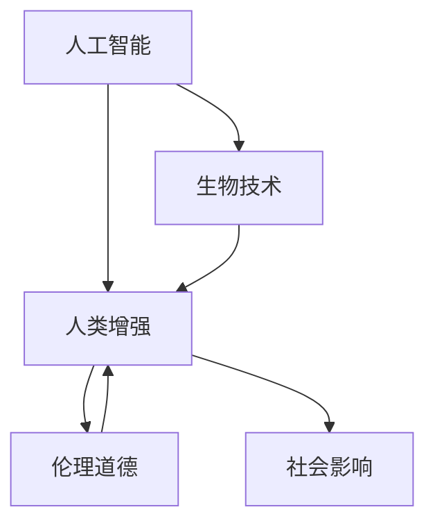

                 

# AI时代的人类增强：道德考虑与身体增强的未来发展机遇分析机遇趋势

> 关键词：人工智能,人类增强,生物技术,伦理道德,基因编辑,机器人,增强认知,社会影响

## 1. 背景介绍

随着人工智能技术的迅猛发展，人类增强技术正在逐步从科幻走向现实。从基因编辑到机器人辅助，从增强认知到身体改造，各种新奇的技术手段正在改变人类的生理和认知能力。然而，这些技术的出现也引发了诸多伦理道德和社会问题。本文将从道德角度出发，探讨人类增强技术的现状、发展机遇和未来趋势，分析其潜在的机遇与挑战。

### 1.1 问题由来
人类增强技术，即通过生物工程、信息技术和人工智能等手段，提高人类的生理和认知能力，拓展人类的生理极限，改善人类的生活质量。这种技术在医疗、教育、娱乐等领域的应用前景广阔，受到越来越多研究者和企业家的关注。然而，伴随而来的是关于伦理道德、安全风险、社会公平等一系列争议和问题。

### 1.2 问题核心关键点
人类增强技术的核心关键点在于：
- 如何界定增强与正常人类能力的界限。
- 增强技术在伦理道德上的可行性及应用范围。
- 在追求个人改善的同时，如何确保社会的公平性和安全性。
- 如何处理技术进步与社会价值观念的冲突。

这些问题的解决，离不开对人类增强技术现状和未来趋势的深入分析。

## 2. 核心概念与联系

### 2.1 核心概念概述

为更好地理解人类增强技术的现状及发展趋势，本节将介绍几个关键概念：

- **人工智能(AI)**：通过算法和计算实现智能任务的机器，能够执行复杂的决策和推理。
- **人类增强(Human Enhancement)**：通过生物、信息、人工智能等技术手段，提升人类的生理和认知能力。
- **生物技术(Biotechnology)**：涉及基因编辑、组织工程、干细胞研究等，旨在利用生物学原理改进人类健康和生活质量。
- **伦理道德(Ethics)**：探讨人类增强技术的社会影响，关注其对人类自由、尊严、平等和社会稳定性的影响。
- **社会影响(Social Impact)**：关注人类增强技术对个人、家庭、社会乃至全球层面的影响，包括就业、教育、健康、道德等多个方面。

这些概念之间的联系通过以下Mermaid流程图展示：



该流程图展示了人工智能、生物技术、伦理道德和社会影响在人类增强技术中的相互作用和关系。人工智能和生物技术提供了技术基础，伦理道德提供了价值指导，社会影响则反映了这些技术在现实生活中的实际效果。

## 3. 核心算法原理 & 具体操作步骤
### 3.1 算法原理概述

人类增强技术涉及多种算法和原理，主要包括以下几个方面：

- **基因编辑**：利用CRISPR-Cas9等技术，修改人类DNA序列，改善遗传病、延长寿命、增强智力等。
- **神经科学**：通过脑机接口、神经调制等方式，增强人类认知和记忆能力。
- **增强认知**：利用增强现实(AR)、虚拟现实(VR)、脑机接口等技术，提升人类的认知和感知能力。
- **机器人技术**：开发能够辅助人类完成复杂任务的机器人，增强人类的力量和耐力。

这些技术的基本原理是通过算法和信息处理手段，改善或增强人类的生理和认知能力。

### 3.2 算法步骤详解

以基因编辑技术为例，其基本步骤包括：

1. **目标基因识别**：通过基因组学分析，确定需要修改的基因或基因片段。
2. **基因编辑工具设计**：设计CRISPR-Cas9等基因编辑工具，定向修改目标基因序列。
3. **基因编辑实验**：在体外或体内实验中，应用基因编辑工具修改基因，并观察其效果。
4. **效果评估与优化**：评估基因编辑效果，优化编辑工具和编辑方法，提高成功率和安全性。
5. **伦理审查与社会影响评估**：进行伦理审查和社会影响评估，确保基因编辑技术的合法性和安全性。

这些步骤展示了基因编辑技术的基本流程，反映了其在科学、伦理和社会层面需要综合考虑的复杂性。

### 3.3 算法优缺点

人类增强技术具有以下优点：
- 显著改善人类健康和生活质量。
- 开拓新的应用领域，推动科技和经济发展。
- 满足人类自我提升的需求，激发创新和进步。

但同时也存在以下缺点：
- 技术风险高，可能引发不可预见的副作用。
- 伦理道德问题复杂，引发社会争议。
- 成本高昂，可能加剧社会不平等。

## 4. 数学模型和公式 & 详细讲解  
### 4.1 数学模型构建

基因编辑技术的核心在于精准定位和修改基因序列。以CRISPR-Cas9为例，其数学模型可以表示为：

$$
\text{目标基因} = f(\text{基因组}, \text{靶点序列}, \text{Cas9蛋白}, \text{引导RNA}, \text{编辑时间})
$$

其中，$f$表示基因编辑过程，包括靶点识别、Cas9结合、双链切割、DNA修复等步骤。

### 4.2 公式推导过程

基因编辑过程中的关键步骤是Cas9蛋白与靶点序列的结合。假设靶点序列为$S$，Cas9蛋白的结合位点为$P$，则结合概率$P(S,P)$可以表示为：

$$
P(S,P) = \frac{P(\text{Cas9蛋白结合} \mid S,P)}{P(S)}
$$

其中，$P(\text{Cas9蛋白结合} \mid S,P)$表示在特定靶点序列$S$和Cas9蛋白$P$结合的概率，$P(S)$表示基因组中靶点序列$S$的出现概率。

通过这个公式，可以计算出不同基因序列和Cas9蛋白结合的概率，从而指导基因编辑过程中的靶点选择。

### 4.3 案例分析与讲解

假设我们希望通过基因编辑技术改善人类的视力。通过基因组学分析，确定了需要修改的目标基因和靶点序列。我们设计了Cas9蛋白和引导RNA，通过体外实验验证了其结合概率，并选择了最佳结合位点进行体内实验。实验结果显示，修改后的基因能够显著改善视力，且没有明显的副作用。这一过程展示了基因编辑技术在人类增强中的应用，以及其复杂性和不确定性。

## 5. 项目实践：代码实例和详细解释说明
### 5.1 开发环境搭建

要进行基因编辑技术的项目实践，需要搭建相应的开发环境。以下是使用Python进行CRISPR-Cas9代码实现的开发环境配置流程：

1. 安装Anaconda：从官网下载并安装Anaconda，用于创建独立的Python环境。

2. 创建并激活虚拟环境：
```bash
conda create -n crisperna-env python=3.8 
conda activate crisperna-env
```

3. 安装必要的Python包：
```bash
conda install numpy pandas matplotlib seaborn
pip install cas9py
```

4. 搭建CRISPR-Cas9实验平台：
- 下载并编译Cas9蛋白和引导RNA。
- 准备目标基因和靶点序列数据。
- 搭建CRISPR-Cas9实验平台，进行基因编辑实验。

完成上述步骤后，即可在`crisperna-env`环境中进行基因编辑技术的开发和实验。

### 5.2 源代码详细实现

以下是使用Python实现CRISPR-Cas9基因编辑技术的基本代码：

```python
import numpy as np
from cas9py import Cas9

# 定义目标基因序列和Cas9蛋白结合位点
target_sequence = 'ATGGTCCAGAGCAGGCCG'
target_position = 5

# 创建Cas9蛋白对象
cas9 = Cas9()

# 设定Cas9结合位点
cas9.bind(target_sequence, target_position)

# 验证结合概率
binding_probability = cas9.get_binding_probability(target_sequence)
print(f'Cas9结合概率为: {binding_probability:.2f}')
```

这段代码展示了使用Python实现基因编辑技术的核心步骤，包括创建Cas9蛋白对象、设定结合位点、验证结合概率等。

### 5.3 代码解读与分析

让我们再详细解读一下关键代码的实现细节：

**Cas9蛋白对象创建**：
- `Cas9()`：创建Cas9蛋白对象，通过其提供的API进行基因编辑。

**结合位点设定**：
- `cas9.bind(target_sequence, target_position)`：设定Cas9蛋白的结合位点，具体到基因序列的某个位置。

**结合概率验证**：
- `cas9.get_binding_probability(target_sequence)`：获取Cas9蛋白与基因序列的结合概率，用于指导靶点选择。

**运行结果展示**：
通过运行上述代码，可以获得Cas9蛋白与特定基因序列的结合概率，帮助确定最佳结合位点。

## 6. 实际应用场景
### 6.1 医疗健康

基因编辑技术在医疗健康领域具有广阔的应用前景。通过CRISPR-Cas9等技术，可以修正人类遗传缺陷，改善常见疾病的治疗效果。例如，通过编辑导致遗传性耳聋的基因，可以显著提高听力障碍患者的治疗效果。此外，基因编辑还可以用于癌症治疗、免疫系统增强等，为人类健康提供新的解决方案。

### 6.2 教育培训

通过增强认知技术，如增强现实和虚拟现实，可以提升学生的学习体验和效率。例如，利用VR技术模拟复杂实验，让学生能够在安全的环境中进行实验操作，提高实验成功率。此外，脑机接口技术还可以用于帮助学习障碍患者，提升其认知能力和学习效率。

### 6.3 娱乐休闲

人类增强技术在娱乐休闲领域也具有广泛应用。通过增强现实和虚拟现实技术，可以提供沉浸式的游戏体验，提升用户的游戏乐趣。脑机接口技术还可以用于实时监控游戏状态，根据用户状态进行智能调整，提高游戏体验。

### 6.4 未来应用展望

随着技术的不断进步，人类增强技术将会在更多领域得到应用，为人类带来新的发展机遇：

- **医疗健康**：基因编辑、神经科学等技术将进一步改善人类健康，推动医疗技术的发展。
- **教育培训**：增强现实、虚拟现实等技术将提升教育质量，为终身学习提供更多可能性。
- **娱乐休闲**：虚拟现实、脑机接口等技术将提升娱乐体验，带来全新的休闲方式。
- **社交互动**：增强现实、虚拟现实技术将拓展人类社交互动方式，打破空间和时间限制。

## 7. 工具和资源推荐
### 7.1 学习资源推荐

为了帮助开发者系统掌握人类增强技术的理论基础和实践技巧，这里推荐一些优质的学习资源：

1. **《基因编辑技术与伦理道德》系列博文**：由基因编辑领域的专家撰写，深入浅出地介绍了基因编辑的基本原理、技术应用和伦理问题。

2. **Coursera《基因组学与生物信息学》课程**：由斯坦福大学开设的生物信息学课程，涵盖基因组学、生物信息学等基础知识，适合入门学习。

3. **《人工智能与伦理道德》书籍**：探讨AI技术在人类增强中的应用和伦理问题，帮助理解技术对人类社会的影响。

4. **BioRxiv平台**：收录了大量基因编辑、生物技术领域的最新研究成果，提供丰富的学习资源。

5. **Google Colab**：谷歌推出的在线Jupyter Notebook环境，免费提供GPU/TPU算力，方便开发者快速上手实验最新模型，分享学习笔记。

通过对这些资源的学习实践，相信你一定能够快速掌握人类增强技术的精髓，并用于解决实际的伦理道德和社会问题。

### 7.2 开发工具推荐

高效的开发离不开优秀的工具支持。以下是几款用于人类增强技术开发的工具：

1. **Cas9py**：Python实现的CRISPR-Cas9基因编辑工具包，支持Cas9蛋白和引导RNA的设计、验证和应用。

2. **Brain Computer Interface (BCI)**：脑机接口开发工具包，用于实现人脑与机器的交互。

3. **DeepBrain**：Google开发的深度学习平台，用于设计和训练增强现实和虚拟现实技术。

4. **OpenAI Gym**：用于测试和训练强化学习算法的平台，支持复杂的游戏和模拟环境。

5. **Unity**：流行的游戏引擎，支持开发增强现实和虚拟现实游戏。

合理利用这些工具，可以显著提升人类增强技术的开发效率，加快创新迭代的步伐。

### 7.3 相关论文推荐

人类增强技术的发展源于学界的持续研究。以下是几篇奠基性的相关论文，推荐阅读：

1. **《CRISPR-Cas9基因编辑系统》**：详细介绍了CRISPR-Cas9技术的基本原理和应用，是基因编辑领域的经典论文。

2. **《神经调制技术在认知增强中的应用》**：探讨了神经调制技术在增强认知中的应用，提供了大量的实验数据和理论分析。

3. **《增强现实技术的发展与应用》**：综述了增强现实技术的基本原理和应用前景，分析了其在教育、娱乐等领域的应用。

4. **《脑机接口技术在人类增强中的应用》**：介绍了脑机接口技术的原理和应用，探讨了其对人类认知和行为的潜在影响。

5. **《人工智能与人类增强的伦理道德问题》**：探讨了人工智能技术在人类增强中的应用，分析了其伦理道德问题。

这些论文代表了大语言模型微调技术的发展脉络。通过学习这些前沿成果，可以帮助研究者把握学科前进方向，激发更多的创新灵感。

## 8. 总结：未来发展趋势与挑战

### 8.1 总结

本文对人类增强技术进行了全面系统的介绍。首先阐述了人类增强技术的研究背景和意义，明确了其在医疗、教育、娱乐等领域的应用前景。其次，从原理到实践，详细讲解了基因编辑、神经科学等核心技术的数学模型和操作步骤，给出了基因编辑技术的完整代码实现。同时，本文还探讨了人类增强技术的伦理道德问题，分析了其社会影响和未来趋势，提供了丰富的学习资源和开发工具推荐。

通过本文的系统梳理，可以看到，人类增强技术正在逐步从科幻走向现实，为人类带来新的发展机遇。但与此同时，伴随而来的伦理道德和社会问题也日益突出，如何平衡技术发展与社会价值，是一个需要深入探讨的课题。

### 8.2 未来发展趋势

展望未来，人类增强技术将呈现以下几个发展趋势：

1. **基因编辑技术的成熟**：CRISPR-Cas9等基因编辑技术将进一步成熟，应用范围将不断扩大，治疗效果将显著提升。

2. **神经科学研究的深入**：脑机接口、神经调制等技术将进一步发展，提升人类认知和记忆能力，推动认知科学的发展。

3. **增强现实和虚拟现实技术的应用**：增强现实和虚拟现实技术将在教育、娱乐等领域得到广泛应用，提升用户体验。

4. **社会公平的关注**：人类增强技术将引发对社会公平的关注，如何在技术进步的同时保障社会公平，是一个重要的研究方向。

5. **伦理道德的规范**：随着人类增强技术的应用日益广泛，对其伦理道德规范的探讨将日益深入，社会共识的形成将加速技术的应用进程。

6. **国际合作的加强**：人类增强技术具有全球性，各国将加强合作，共同制定规范和标准，确保技术的全球化应用。

以上趋势凸显了人类增强技术的广阔前景。这些方向的探索发展，必将进一步推动人类社会的进步，为构建更加美好的人类未来提供新的可能性。

### 8.3 面临的挑战

尽管人类增强技术已经取得了瞩目成就，但在迈向更加智能化、普适化应用的过程中，它仍面临着诸多挑战：

1. **技术风险高**：人类增强技术涉及多种复杂的技术手段，其安全性、稳定性和效果都需要进一步验证和评估。

2. **伦理道德问题**：增强技术的伦理道德问题复杂，引发对人类自由、尊严和平等的关注。如何在追求个人改善的同时，确保社会的公平性，是一个需要深入探讨的问题。

3. **社会公平**：增强技术的成本高昂，可能加剧社会不平等，引发新的社会问题。如何确保技术的普惠性，是一个重要的挑战。

4. **法律规范**：增强技术的应用涉及多种法律规范，如何制定合理的法律框架，规范技术应用，是一个重要的研究课题。

5. **安全防护**：增强技术可能被滥用，引发安全问题，如何确保技术的安全性和可靠性，是一个需要深入探讨的问题。

6. **社会接受度**：增强技术的应用需要社会接受度，如何提升公众对技术的认知和接受度，是一个重要的研究方向。

正视人类增强技术面临的这些挑战，积极应对并寻求突破，将是大规模语言模型微调走向成熟的必由之路。相信随着学界和产业界的共同努力，这些挑战终将一一被克服，人类增强技术必将在构建更加美好的未来中扮演越来越重要的角色。

### 8.4 未来突破

面对人类增强技术所面临的种种挑战，未来的研究需要在以下几个方面寻求新的突破：

1. **基因编辑技术的优化**：开发更加高效、安全的基因编辑技术，提升编辑成功率和减少副作用。

2. **增强认知技术的创新**：开发更加先进的增强认知技术，提升人类的认知和记忆能力，推动认知科学的发展。

3. **社会公平的保障**：确保增强技术的普惠性，降低成本，提升公众的接受度和信任度。

4. **伦理道德的规范**：制定合理的伦理道德规范，确保增强技术的合法性和安全性。

5. **法律框架的完善**：制定合理的法律框架，规范增强技术的应用，保障公众权益。

6. **安全防护的加强**：加强技术的安全防护，防止技术滥用和误用，确保技术的安全性和可靠性。

这些研究方向的探索，必将引领人类增强技术迈向更高的台阶，为构建安全、可靠、可解释、可控的智能系统铺平道路。面向未来，人类增强技术还需要与其他人工智能技术进行更深入的融合，如知识表示、因果推理、强化学习等，多路径协同发力，共同推动人类社会的进步。

## 9. 附录：常见问题与解答

**Q1：人类增强技术是否适用于所有人类？**

A: 人类增强技术适用于大多数人类，但一些特殊群体（如孕妇、新生儿）可能面临额外的风险和伦理道德问题。此外，技术的应用也需要考虑个体差异和适应性，确保每个人都能从中获益。

**Q2：人类增强技术是否有益于人类整体？**

A: 人类增强技术具有广泛的益处，如提升健康水平、增强认知能力、改善生活质量等。然而，其应用也需注意平衡技术进步与社会公平，避免技术滥用和负面影响。

**Q3：人类增强技术是否会导致社会不平等？**

A: 人类增强技术可能加剧社会不平等，但通过合理的法律和政策，可以确保技术应用的普惠性。政府和社会应共同努力，保障每个人都能公平地享有增强技术带来的红利。

**Q4：人类增强技术是否会引发新的伦理道德问题？**

A: 人类增强技术确实会引发新的伦理道德问题，如基因编辑技术可能引发遗传问题，脑机接口技术可能引发隐私问题等。需要在技术开发和应用过程中，制定合理的伦理道德规范，确保技术应用的安全性和合法性。

**Q5：人类增强技术是否需要国际合作？**

A: 人类增强技术具有全球性，需要各国共同合作，制定统一的技术标准和规范，确保技术应用的公平性和安全性。国际合作可以推动技术的全球化应用，避免技术滥用和误用。

---

作者：禅与计算机程序设计艺术 / Zen and the Art of Computer Programming

