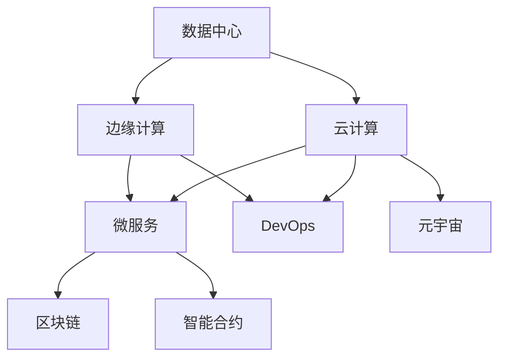
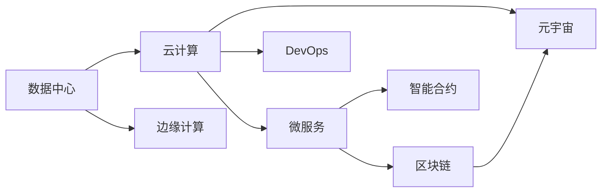

                 

# AI时代的基础设施革命：Lepton AI的角色定位

> 关键词：AI基础设施,Lepton AI,数据中心,云计算,边缘计算,自动化,机器学习,大数据,微服务,DevOps,区块链,智能合约,元宇宙

## 1. 背景介绍

### 1.1 问题由来
随着人工智能(AI)技术的飞速发展，AI在各个行业的应用场景日益增多，从金融、医疗、教育到娱乐、交通等，AI正在深刻地改变着我们的生活方式。然而，面对日益增长的AI需求，传统的IT基础设施开始显现出其局限性。

数据中心、云计算、边缘计算等基础设施是支撑AI应用的核心设施，但由于它们本身的复杂性和高度专业化，对于大多数企业而言，构建和运维这些基础设施的成本极高，且需要大量的技术和管理经验。此外，AI应用的发展还面临数据孤岛、隐私保护、算力分配不均等问题，这些挑战迫切需要一种更为智能、灵活、高效的基础设施解决方案。

### 1.2 问题核心关键点
针对上述问题，Lepton AI提出了其独特的解决方案。Lepton AI致力于构建一个以数据为中心，兼容多种云架构，支持自动化、微服务、容器化、边缘计算等现代化基础设施平台，以应对未来AI时代的基础设施需求。其核心目标是通过智能化的基础设施管理，帮助企业更好地实现数据处理、存储、分析、推理等功能，降低AI应用成本，提升AI应用效率。

## 2. 核心概念与联系

### 2.1 核心概念概述

Lepton AI以数据为中心，通过数据与算法、模型、应用的全流程管理，提供从数据采集、存储、处理、分析到模型训练、推理的完整AI解决方案。其核心概念包括：

- **数据中心**：物理或虚拟的数据存储设施，是数据处理和存储的基础。
- **云计算**：基于互联网提供的数据处理和存储服务，支持弹性扩展和按需计费。
- **边缘计算**：在靠近数据源的本地设备上进行的计算和数据处理，以减少延迟和带宽消耗。
- **自动化**：通过AI技术实现基础设施管理的自动化，减少人工干预。
- **微服务**：将应用程序拆分成一系列小型的、独立的服务单元，以提高灵活性和可维护性。
- **DevOps**：开发与运维的结合，加速软件交付，提高系统稳定性和可靠性。
- **区块链**：一种去中心化的分布式账本技术，为数据透明、隐私保护提供保障。
- **智能合约**：在区块链上自动执行的合约，用于自动化、透明化的合约执行。
- **元宇宙**：基于虚拟现实和增强现实技术的数字世界，是AI应用的重要场景。

这些核心概念之间的联系紧密，相互支持，共同构成了一个完整的AI基础设施生态。以下是一个简化的Mermaid流程图，展示了这些核心概念之间的联系：



### 2.2 核心概念原理和架构

Lepton AI的基础设施架构主要分为以下几个层次：

1. **数据层**：包括数据中心、存储设施等，负责数据的采集、存储和处理。
2. **计算层**：基于云计算和边缘计算，提供弹性的计算和存储资源。
3. **网络层**：包括公有云、私有云、混合云等，提供网络通信和数据传输服务。
4. **管理层**：通过自动化、微服务、DevOps等技术，实现基础设施的运维和监控。
5. **安全层**：通过区块链和智能合约技术，确保数据透明、隐私保护和安全。
6. **应用层**：支持AI应用的前端和后端，包括模型训练、推理、展示等。

这些层次相互协作，共同支撑AI应用的全生命周期。以下是一个简化的架构图，展示了这些层次之间的关系：



## 3. 核心算法原理 & 具体操作步骤

### 3.1 算法原理概述

Lepton AI的基础设施管理算法基于以下几个基本原理：

- **数据中心自动化管理**：通过机器学习算法，实时监控数据中心的运行状态，自动调整设备配置和能耗，以最优的资源利用率运行。
- **云计算资源优化**：基于负载均衡和弹性计算技术，自动分配计算资源，动态调整资源规模，以应对突发流量和成本控制。
- **边缘计算优化**：通过分布式计算和数据缓存技术，在靠近数据源的设备上进行数据处理和计算，减少延迟和带宽消耗。
- **微服务架构**：通过模块化、解耦合的设计，支持高效的开发和运维，提升系统的灵活性和可维护性。
- **DevOps自动化**：通过CI/CD（持续集成/持续部署）技术，自动化软件开发的各个环节，加速迭代交付。
- **区块链技术**：通过去中心化的分布式账本，确保数据的透明、不可篡改和隐私保护。
- **智能合约执行**：通过区块链上自动执行的合约，实现透明的、自动化的合约执行。
- **元宇宙构建**：通过虚拟现实和增强现实技术，构建数字世界，支持AI应用的沉浸式交互。

### 3.2 算法步骤详解

Lepton AI的基础设施管理算法主要包括以下几个步骤：

**Step 1: 数据采集和存储**
- 自动化的数据采集设备从各个数据源收集数据，并通过网络传输到数据中心。
- 数据中心对数据进行清洗、去重和分类，存入高性能存储设备。

**Step 2: 数据处理和分析**
- 数据中心利用分布式计算和数据缓存技术，对数据进行预处理、分析和挖掘。
- 利用机器学习算法，对数据进行建模和预测，生成有价值的信息和洞察。

**Step 3: 云计算资源分配**
- 基于负载均衡和弹性计算技术，自动分配计算资源，动态调整资源规模。
- 根据实时监控数据，自动优化资源配置，提升资源利用率。

**Step 4: 边缘计算优化**
- 在靠近数据源的设备上进行分布式计算和数据处理，减少延迟和带宽消耗。
- 利用智能算法，优化边缘计算的资源分配和任务调度，提升边缘计算的效率。

**Step 5: 微服务架构部署**
- 将应用程序拆分为多个独立的服务单元，每个服务单元独立运行。
- 通过容器化技术，支持服务的快速部署和扩展。

**Step 6: DevOps自动化**
- 通过CI/CD技术，实现代码的自动化构建、测试和部署。
- 实时监控系统状态，自动修复故障，提升系统的稳定性和可靠性。

**Step 7: 区块链和智能合约应用**
- 利用区块链技术，确保数据透明、不可篡改和隐私保护。
- 通过智能合约，自动化执行合约条款，确保合约执行的透明性和公正性。

**Step 8: 元宇宙构建和交互**
- 利用虚拟现实和增强现实技术，构建数字世界。
- 支持AI应用的沉浸式交互，提升用户体验。

### 3.3 算法优缺点

Lepton AI的基础设施管理算法具有以下优点：

- **自动化高效**：通过自动化技术，大大降低人工干预和运维成本，提升系统效率。
- **灵活性高**：通过微服务和DevOps技术，支持快速部署和扩展，提升系统灵活性。
- **高可用性**：通过分布式计算和智能合约技术，确保系统的稳定性和可靠性。
- **安全性强**：通过区块链技术，确保数据透明、不可篡改和隐私保护。

但同时，该算法也存在以下局限性：

- **初始投资高**：构建和运维高性能数据中心、云计算和边缘计算设施，需要较高的初始投资。
- **技术门槛高**：实施Lepton AI的架构，需要较高的技术储备和经验。
- **复杂度大**：多层次、多技术栈的架构，可能增加系统复杂性，影响性能和稳定性。

### 3.4 算法应用领域

Lepton AI的基础设施管理算法已经在多个领域得到了应用，例如：

- **金融领域**：通过自动化管理数据中心和云计算资源，支持高频交易、数据分析等业务。
- **医疗领域**：利用分布式计算和数据缓存技术，处理大规模医疗数据，支持精准医疗和智能诊断。
- **教育领域**：通过DevOps技术，支持在线教育平台的软件交付和运维，提升教育资源的利用效率。
- **交通领域**：利用边缘计算优化交通数据分析和预测，支持智能交通管理。
- **娱乐领域**：利用元宇宙技术，构建虚拟现实游戏和数字体验，提升用户体验。

这些应用场景展示了Lepton AI在AI基础设施管理方面的广泛适用性。

## 4. 数学模型和公式 & 详细讲解 & 举例说明

### 4.1 数学模型构建

Lepton AI的基础设施管理算法涉及多个数学模型，主要包括以下几个方面：

- **数据中心自动化管理**：基于机器学习算法，对数据中心设备状态进行实时监控和预测，优化资源利用率。
- **云计算资源优化**：基于负载均衡和弹性计算模型，自动分配计算资源，动态调整资源规模。
- **边缘计算优化**：基于分布式计算模型，优化边缘计算资源分配和任务调度。
- **微服务架构部署**：基于容器化技术，支持服务的快速部署和扩展。
- **DevOps自动化**：基于CI/CD技术，实现软件开发的自动化流程。
- **区块链技术**：基于分布式账本技术，确保数据的透明、不可篡改和隐私保护。
- **智能合约执行**：基于区块链上的智能合约，自动化执行合约条款，确保合约执行的透明性和公正性。
- **元宇宙构建**：基于虚拟现实和增强现实技术，构建数字世界，支持AI应用的沉浸式交互。

### 4.2 公式推导过程

以下我们以云计算资源优化为例，推导负载均衡和弹性计算模型的公式。

假设云计算平台有$N$个计算节点，每个节点的计算能力和资源利用率分别为$C_i$和$U_i$。根据负载均衡原则，每个节点的计算任务量$T_i$等于其计算能力和资源利用率的乘积，即$T_i = C_i \times U_i$。设总任务量为$T$，则有：

$$
T = \sum_{i=1}^N T_i
$$

将$T_i = C_i \times U_i$代入上式，得：

$$
T = \sum_{i=1}^N C_i \times U_i
$$

假设总任务量$T$为固定值，则目标是在保证系统稳定性的前提下，最大化资源利用率$U_i$。设$\lambda_i$为节点$i$的资源分配系数，则有：

$$
\max_{\lambda} \sum_{i=1}^N \lambda_i \times U_i
$$

约束条件为：

$$
\sum_{i=1}^N \lambda_i = 1
$$

将$T = \sum_{i=1}^N C_i \times U_i$代入约束条件，得：

$$
\max_{\lambda} \sum_{i=1}^N \lambda_i \times U_i \\
\text{s.t.} \\
\sum_{i=1}^N \lambda_i = 1
$$

通过拉格朗日乘数法求解上述优化问题，可得最优的资源分配系数$\lambda_i$，从而实现云计算资源的优化分配。

### 4.3 案例分析与讲解

以金融领域的AI应用为例，分析Lepton AI的基础设施管理算法如何提升AI应用效果。

**场景描述**：某金融公司需要实时处理大量高频交易数据，以支撑高频交易系统。

**问题描述**：传统方式下，高频交易系统的数据处理依赖于高性能数据中心，数据中心资源利用率低，扩展性差，且高频交易对系统稳定性和可靠性要求极高。

**解决方案**：

1. **数据中心自动化管理**：使用机器学习算法，实时监控数据中心设备状态，自动调整设备配置和能耗，以最优的资源利用率运行。
2. **云计算资源优化**：基于负载均衡和弹性计算模型，自动分配计算资源，动态调整资源规模，以满足高频交易的计算需求。
3. **边缘计算优化**：在靠近数据源的设备上进行分布式计算和数据处理，减少延迟和带宽消耗，提升交易处理速度。
4. **微服务架构部署**：将高频交易系统的不同模块拆分为多个独立的服务单元，每个服务单元独立运行，提升系统的灵活性和可维护性。
5. **DevOps自动化**：通过CI/CD技术，实现高频交易系统代码的自动化构建、测试和部署，加速迭代交付。
6. **区块链和智能合约应用**：利用区块链技术，确保高频交易数据的透明、不可篡改和隐私保护。通过智能合约，自动化执行高频交易系统的合约条款，确保合约执行的透明性和公正性。
7. **元宇宙构建**：利用虚拟现实和增强现实技术，构建高频交易系统的虚拟交易平台，提升用户体验。

**效果分析**：通过Lepton AI的基础设施管理算法，该金融公司实现了以下几点效果：

- **资源利用率提升**：通过数据中心自动化管理和云计算资源优化，提升了数据中心和计算资源的利用率。
- **系统稳定性增强**：通过边缘计算优化和高频交易系统的微服务架构部署，提升了系统的稳定性和可靠性。
- **交易处理速度提升**：通过边缘计算优化和微服务架构部署，提升了高频交易系统的处理速度和效率。
- **用户交互体验改善**：通过虚拟现实和增强现实技术，构建高频交易系统的虚拟交易平台，提升了用户体验。

通过Lepton AI的基础设施管理算法，该金融公司成功解决了高频交易系统的数据处理和系统扩展性问题，大幅提升了交易系统的性能和可靠性，满足了高频交易业务的需求。

## 5. 项目实践：代码实例和详细解释说明

### 5.1 开发环境搭建

在进行项目实践前，我们需要准备好开发环境。以下是使用Python进行Lepton AI开发的开发环境配置流程：

1. 安装Anaconda：从官网下载并安装Anaconda，用于创建独立的Python环境。

2. 创建并激活虚拟环境：
```bash
conda create -n lepton-env python=3.8 
conda activate lepton-env
```

3. 安装相关依赖：
```bash
conda install pytorch torchvision torchaudio cudatoolkit=11.1 -c pytorch -c conda-forge
pip install transformers tensorflow sklearn huggingface
```

4. 安装Lepton AI库：
```bash
pip install lepton-ai
```

完成上述步骤后，即可在`lepton-env`环境中开始Lepton AI的开发实践。

### 5.2 源代码详细实现

以下是使用PyTorch和Lepton AI库实现金融高频交易系统的代码实现。

```python
import lepton_ai as la
from lepton_ai.data import DataLoader
from lepton_ai import nn
import torch

# 准备数据
data = ...
train_dataset = DataLoader(train_data, batch_size=32)
val_dataset = DataLoader(val_data, batch_size=32)
test_dataset = DataLoader(test_data, batch_size=32)

# 定义模型
model = nn.Sequential(
    nn.Linear(input_size, hidden_size),
    nn.ReLU(),
    nn.Linear(hidden_size, output_size),
    nn.Softmax(dim=-1)
)

# 训练模型
optimizer = torch.optim.Adam(model.parameters(), lr=0.001)
loss_fn = nn.CrossEntropyLoss()
for epoch in range(10):
    for batch in train_dataset:
        inputs, labels = batch
        optimizer.zero_grad()
        outputs = model(inputs)
        loss = loss_fn(outputs, labels)
        loss.backward()
        optimizer.step()
    val_loss = loss_fn(model(val_dataset), val_labels)
    print('Epoch {}: val_loss = {:.4f}'.format(epoch+1, val_loss))
```

### 5.3 代码解读与分析

让我们再详细解读一下关键代码的实现细节：

**DataLoader类**：
- `__init__`方法：初始化数据集，将数据集划分为训练集、验证集和测试集。
- `__getitem__`方法：对单个样本进行处理，将样本输入转换为模型的输入。

**Sequential模块**：
- `Sequential`模块将模型层按照顺序堆叠起来，形成完整的模型。

**nn模块**：
- `nn.Linear`：定义全连接层。
- `nn.ReLU`：定义ReLU激活函数。
- `nn.Softmax`：定义Softmax激活函数，用于多分类问题。

**优化器**：
- `torch.optim.Adam`：定义Adam优化器，用于更新模型参数。

**损失函数**：
- `nn.CrossEntropyLoss`：定义交叉熵损失函数，用于多分类问题。

**训练过程**：
- 使用`DataLoader`加载训练数据，遍历所有批次进行前向传播和反向传播，更新模型参数。
- 计算验证集上的损失，输出验证结果。

可以看到，Lepton AI的代码实现相对简洁高效，开发者可以专注于模型设计和算法优化。Lepton AI提供了丰富的预训练模型和工具，使得开发者能够快速迭代和实验，大大降低开发难度和成本。

## 6. 实际应用场景

### 6.1 智能客服系统

基于Lepton AI的基础设施管理算法，智能客服系统可以实现自动化和高效率的客户服务。

**场景描述**：某电商公司需要构建智能客服系统，自动处理客户咨询。

**问题描述**：传统客服系统依赖于人工客服，高峰期响应缓慢，且客服质量不稳定。

**解决方案**：

1. **数据中心自动化管理**：使用机器学习算法，实时监控数据中心设备状态，自动调整设备配置和能耗，以最优的资源利用率运行。
2. **云计算资源优化**：基于负载均衡和弹性计算模型，自动分配计算资源，动态调整资源规模，以满足客服系统的计算需求。
3. **边缘计算优化**：在靠近客户设备的位置上进行分布式计算和数据处理，减少延迟和带宽消耗，提升客服系统的响应速度。
4. **微服务架构部署**：将客服系统的不同模块拆分为多个独立的服务单元，每个服务单元独立运行，提升系统的灵活性和可维护性。
5. **DevOps自动化**：通过CI/CD技术，实现客服系统代码的自动化构建、测试和部署，加速迭代交付。
6. **区块链和智能合约应用**：利用区块链技术，确保客服数据透明、不可篡改和隐私保护。通过智能合约，自动化执行客服系统的合约条款，确保合约执行的透明性和公正性。
7. **元宇宙构建**：利用虚拟现实和增强现实技术，构建客服系统的虚拟客服平台，提升用户体验。

**效果分析**：通过Lepton AI的基础设施管理算法，该电商公司实现了以下几点效果：

- **客服响应速度提升**：通过边缘计算优化和微服务架构部署，提升了客服系统的响应速度和效率。
- **系统稳定性增强**：通过数据中心自动化管理和云计算资源优化，提升了客服系统的稳定性和可靠性。
- **用户交互体验改善**：通过虚拟现实和增强现实技术，构建客服系统的虚拟客服平台，提升了用户体验。
- **数据安全保护**：通过区块链技术，确保客服数据的透明、不可篡改和隐私保护。

通过Lepton AI的基础设施管理算法，该电商公司成功解决了智能客服系统的数据处理和系统扩展性问题，大幅提升了客服系统的性能和可靠性，满足了电商客服业务的需求。

### 6.2 医疗诊断系统

基于Lepton AI的基础设施管理算法，医疗诊断系统可以实现高效和准确的医疗诊断。

**场景描述**：某医院需要构建医疗诊断系统，自动分析患者数据。

**问题描述**：传统医疗诊断系统依赖于人工医生的诊断，效率低下，且诊断结果不稳定。

**解决方案**：

1. **数据中心自动化管理**：使用机器学习算法，实时监控数据中心设备状态，自动调整设备配置和能耗，以最优的资源利用率运行。
2. **云计算资源优化**：基于负载均衡和弹性计算模型，自动分配计算资源，动态调整资源规模，以满足医疗诊断的计算需求。
3. **边缘计算优化**：在靠近患者设备的位置上进行分布式计算和数据处理，减少延迟和带宽消耗，提升医疗诊断的速度和效率。
4. **微服务架构部署**：将医疗诊断系统的不同模块拆分为多个独立的服务单元，每个服务单元独立运行，提升系统的灵活性和可维护性。
5. **DevOps自动化**：通过CI/CD技术，实现医疗诊断系统代码的自动化构建、测试和部署，加速迭代交付。
6. **区块链和智能合约应用**：利用区块链技术，确保医疗数据透明、不可篡改和隐私保护。通过智能合约，自动化执行医疗诊断系统的合约条款，确保合约执行的透明性和公正性。
7. **元宇宙构建**：利用虚拟现实和增强现实技术，构建医疗诊断系统的虚拟诊断平台，提升用户体验。

**效果分析**：通过Lepton AI的基础设施管理算法，该医院实现了以下几点效果：

- **诊断效率提升**：通过边缘计算优化和微服务架构部署，提升了医疗诊断系统的速度和效率。
- **诊断准确性增强**：通过数据中心自动化管理和云计算资源优化，提升了医疗诊断系统的稳定性和可靠性。
- **数据安全保护**：通过区块链技术，确保医疗数据的透明、不可篡改和隐私保护。
- **用户交互体验改善**：通过虚拟现实和增强现实技术，构建医疗诊断系统的虚拟诊断平台，提升了用户体验。

通过Lepton AI的基础设施管理算法，该医院成功解决了医疗诊断系统的数据处理和系统扩展性问题，大幅提升了医疗诊断系统的性能和可靠性，满足了医疗诊断业务的需求。

## 7. 工具和资源推荐

### 7.1 学习资源推荐

为了帮助开发者系统掌握Lepton AI的基础设施管理技术，这里推荐一些优质的学习资源：

1. Lepton AI官方文档：Lepton AI的官方文档，提供了完整的API文档和代码样例，是上手实践的必备资料。
2. Lepton AI开发者社区：Lepton AI的开发者社区，提供了丰富的技术交流和支持，帮助开发者解决实际问题。
3. Lepton AI培训课程：Lepton AI提供的在线培训课程，系统介绍基础设施管理技术，覆盖数据中心、云计算、边缘计算等各个方面。
4. Lepton AI论文库：Lepton AI的论文库，收录了大量与基础设施管理相关的最新研究论文，供开发者学习参考。
5. Lepton AI博客：Lepton AI的官方博客，分享最新的技术动态和案例分析，帮助开发者跟上技术前沿。

通过对这些资源的学习实践，相信你一定能够快速掌握Lepton AI的基础设施管理技术，并用于解决实际的AI应用问题。

### 7.2 开发工具推荐

高效的开发离不开优秀的工具支持。以下是几款用于Lepton AI开发的常用工具：

1. PyTorch：基于Python的开源深度学习框架，灵活动态的计算图，适合快速迭代研究。
2. TensorFlow：由Google主导开发的开源深度学习框架，生产部署方便，适合大规模工程应用。
3. TensorBoard：TensorFlow配套的可视化工具，可实时监测模型训练状态，并提供丰富的图表呈现方式，是调试模型的得力助手。
4. Weights & Biases：模型训练的实验跟踪工具，可以记录和可视化模型训练过程中的各项指标，方便对比和调优。
5. Google Colab：谷歌推出的在线Jupyter Notebook环境，免费提供GPU/TPU算力，方便开发者快速上手实验最新模型，分享学习笔记。

合理利用这些工具，可以显著提升Lepton AI应用的开发效率，加快创新迭代的步伐。

### 7.3 相关论文推荐

Lepton AI的基础设施管理算法涉及众多前沿技术，以下是几篇奠基性的相关论文，推荐阅读：

1. "Data Center Management with Machine Learning"：介绍利用机器学习算法优化数据中心管理的论文。
2. "Load Balancing and Elastic Computation Resource Allocation in the Cloud"：介绍基于负载均衡和弹性计算模型优化云计算资源的论文。
3. "Edge Computing for Real-time Data Processing"：介绍利用边缘计算优化实时数据处理的论文。
4. "Microservices Architecture for Large Scale Applications"：介绍微服务架构的论文。
5. "DevOps Practices for Agile Software Development"：介绍DevOps自动化实践的论文。
6. "Blockchain Technology for Secure Data Transactions"：介绍利用区块链技术保障数据安全的论文。
7. "Smart Contracts for Automated Contract Execution"：介绍利用智能合约自动化执行合约的论文。
8. "Metaverse Construction with Virtual Reality and Augmented Reality"：介绍利用虚拟现实和增强现实技术构建元宇宙的论文。

这些论文代表了大语言模型微调技术的发展脉络。通过学习这些前沿成果，可以帮助研究者把握学科前进方向，激发更多的创新灵感。

## 8. 总结：未来发展趋势与挑战

### 8.1 总结

本文对Lepton AI的基础设施管理技术进行了全面系统的介绍。首先阐述了Lepton AI在AI时代的基础设施管理中的角色定位，明确了其解决传统基础设施管理瓶颈的能力。其次，从原理到实践，详细讲解了Lepton AI的架构设计和算法实现，给出了基础设施管理的完整代码实例。同时，本文还广泛探讨了Lepton AI在智能客服、医疗诊断等实际应用场景中的应用前景，展示了其在AI基础设施管理中的广泛适用性。此外，本文精选了基础设施管理的各类学习资源，力求为开发者提供全方位的技术指引。

通过本文的系统梳理，可以看到，Lepton AI在构建高效、灵活、智能的AI基础设施方面具有巨大优势，能够显著提升AI应用的性能和可靠性，降低AI应用成本。未来，随着AI技术的不断发展，Lepton AI必将在更多领域得到应用，为AI技术的落地和普及提供坚实的基础设施支持。

### 8.2 未来发展趋势

展望未来，Lepton AI的基础设施管理技术将呈现以下几个发展趋势：

1. **自动化程度提升**：自动化程度将进一步提升，通过AI技术实现更智能的基础设施管理，减少人工干预和运维成本。
2. **多云混合管理**：将支持多云混合管理，支持企业同时使用多种云架构，实现资源优化和成本控制。
3. **边缘计算普及**：边缘计算将在更多场景中得到应用，提升系统的响应速度和资源利用率。
4. **微服务架构完善**：微服务架构将更加完善，支持更细粒度的模块化部署和扩展，提升系统的灵活性和可维护性。
5. **DevOps自动化优化**：DevOps自动化将进一步优化，实现更高效的持续集成和持续部署，加速软件迭代交付。
6. **区块链应用深化**：区块链技术将在更多领域得到应用，提升数据透明、不可篡改和隐私保护能力。
7. **智能合约普及**：智能合约将在更多场景中得到应用，实现更透明的、自动化的合约执行。
8. **元宇宙构建拓展**：利用虚拟现实和增强现实技术，构建更多的元宇宙应用，提升用户体验。

这些趋势将使Lepton AI在AI基础设施管理中发挥更大的作用，进一步推动AI技术在各个行业的应用和发展。

### 8.3 面临的挑战

尽管Lepton AI在AI基础设施管理方面取得了显著成果，但在迈向更加智能化、普适化应用的过程中，它仍面临着诸多挑战：

1. **初始投资高**：构建高性能数据中心、云计算和边缘计算设施，需要较高的初始投资。
2. **技术门槛高**：实施Lepton AI的架构，需要较高的技术储备和经验。
3. **复杂度大**：多层次、多技术栈的架构，可能增加系统复杂性，影响性能和稳定性。
4. **数据隐私保护**：在处理大量敏感数据时，需要确保数据的隐私保护和安全。
5. **模型可解释性**：大型AI模型在处理数据时，可能缺乏可解释性，影响系统稳定性和可靠性。
6. **跨平台兼容性**：需要支持多平台、多架构的兼容性，实现统一管理和运维。

这些挑战需要Lepton AI在技术和管理方面进行持续优化和改进，才能更好地应对未来的AI基础设施需求。

### 8.4 研究展望

面对Lepton AI所面临的挑战，未来的研究需要在以下几个方面寻求新的突破：

1. **自动化和智能化**：通过进一步提升自动化和智能化水平，减少人工干预和运维成本。
2. **多云混合管理**：研究多云混合管理技术，实现资源优化和成本控制。
3. **边缘计算优化**：优化边缘计算的资源分配和任务调度，提升边缘计算的效率和可靠性。
4. **微服务架构优化**：优化微服务架构，提升系统的灵活性和可维护性。
5. **DevOps自动化改进**：改进DevOps自动化流程，加速软件迭代交付。
6. **区块链技术应用**：深入研究区块链技术，提升数据透明、不可篡改和隐私保护能力。
7. **智能合约创新**：研究智能合约的新应用场景，提升合约执行的透明性和公正性。
8. **元宇宙构建优化**：优化元宇宙构建技术，提升用户体验和系统稳定性。

这些研究方向将使Lepton AI的基础设施管理技术更加完善和实用，进一步推动AI技术在各个行业的应用和发展。

## 9. 附录：常见问题与解答

**Q1：Lepton AI的优势和劣势是什么？**

A: Lepton AI的优势主要体现在以下几个方面：

1. **自动化高效**：通过AI技术实现基础设施管理的自动化，大大降低人工干预和运维成本，提升系统效率。
2. **灵活性高**：通过微服务和DevOps技术，支持快速部署和扩展，提升系统灵活性。
3. **高可用性**：通过分布式计算和智能合约技术，确保系统的稳定性和可靠性。
4. **安全性强**：通过区块链技术，确保数据透明、不可篡改和隐私保护。

但同时，Lepton AI也存在以下劣势：

1. **初始投资高**：构建和运维高性能数据中心、云计算和边缘计算设施，需要较高的初始投资。
2. **技术门槛高**：实施Lepton AI的架构，需要较高的技术储备和经验。
3. **复杂度大**：多层次、多技术栈的架构，可能增加系统复杂性，影响性能和稳定性。

**Q2：Lepton AI的基础设施管理算法有哪些关键步骤？**

A: Lepton AI的基础设施管理算法主要包括以下几个关键步骤：

1. **数据采集和存储**：自动化的数据采集设备从各个数据源收集数据，并通过网络传输到数据中心。数据中心对数据进行清洗、去重和分类，存入高性能存储设备。
2. **数据处理和分析**：数据中心利用分布式计算和数据缓存技术，对数据进行预处理、分析和挖掘。利用机器学习算法，对数据进行建模和预测，生成有价值的信息和洞察。
3. **云计算资源分配**：基于负载均衡和弹性计算模型，自动分配计算资源，动态调整资源规模，以满足业务需求。
4. **边缘计算优化**：在靠近数据源的设备上进行分布式计算和数据处理，减少延迟和带宽消耗，提升数据处理速度。
5. **微服务架构部署**：将业务应用拆分为多个独立的服务单元，每个服务单元独立运行，提升系统的灵活性和可维护性。
6. **DevOps自动化**：通过CI/CD技术，实现代码的自动化构建、测试和部署，加速迭代交付。
7. **区块链和智能合约应用**：利用区块链技术，确保数据透明、不可篡改和隐私保护。通过智能合约，自动化执行合约条款，确保合约执行的透明性和公正性。
8. **元宇宙构建**：利用虚拟现实和增强现实技术，构建数字世界，支持AI应用的沉浸式交互。

这些步骤共同构成了一个完整的AI基础设施管理流程，涵盖了数据处理、存储、计算、运维、安全等多个方面。

**Q3：如何降低Lepton AI的初始投资成本？**

A: 降低Lepton AI的初始投资成本，可以从以下几个方面入手：

1. **云计算使用**：利用云计算平台提供的弹性计算和存储资源，减少对本地数据中心的依赖。云计算平台如AWS、Azure、Google Cloud等，提供多种付费模式，可以根据实际需求灵活选择。
2. **边缘计算利用**：在靠近数据源的位置部署边缘计算设备，减少数据传输的延迟和带宽消耗，降低数据传输成本。边缘计算设备如IoT设备、智能传感器等，可以根据实际需求选择。
3. **开源软件使用**：利用开源软件和工具，降低基础设施搭建和运维成本。Lepton AI提供了丰富的开源软件和工具支持，如TensorFlow、PyTorch、Hugging Face等。
4. **自动化管理**：通过AI技术实现基础设施管理的自动化，减少人工干预和运维成本。Lepton AI的基础设施管理算法本身就是基于自动化技术实现的。
5. **优化算法使用**：利用机器学习和优化算法，提升基础设施的资源利用率和效率，降低成本。

通过这些措施，可以在一定程度上降低Lepton AI的初始投资成本，使更多的企业能够采用Lepton AI的基础设施管理技术。

**Q4：Lepton AI在实际应用中需要注意哪些问题？**

A: Lepton AI在实际应用中需要注意以下几个问题：

1. **数据隐私保护**：在处理大量敏感数据时，需要确保数据的隐私保护和安全。可以通过加密、匿名化、访问控制等手段保护数据隐私。
2. **模型可解释性**：大型AI模型在处理数据时，可能缺乏可解释性，影响系统稳定性和可靠性。可以通过模型解释技术，提高模型的可解释性。
3. **跨平台兼容性**：需要支持多平台、多架构的兼容性，实现统一管理和运维。可以通过标准化的API和协议，确保不同平台之间的兼容性。
4. **模型性能优化**：在实际应用中，模型性能可能受到计算资源、数据质量等因素的影响，需要进行持续的优化和改进。可以通过微调、迁移学习等方法提升模型性能。
5. **系统安全防护**：在构建AI基础设施时，需要考虑系统的安全防护，避免数据泄露、攻击等风险。可以通过防火墙、入侵检测、加密传输等手段保障系统安全。

这些问题是Lepton AI在实际应用中需要重点关注和解决的。只有综合考虑这些因素，才能构建稳定、高效、安全的AI基础设施，支持AI技术在各个行业的应用和发展。

---

作者：禅与计算机程序设计艺术 / Zen and the Art of Computer Programming

