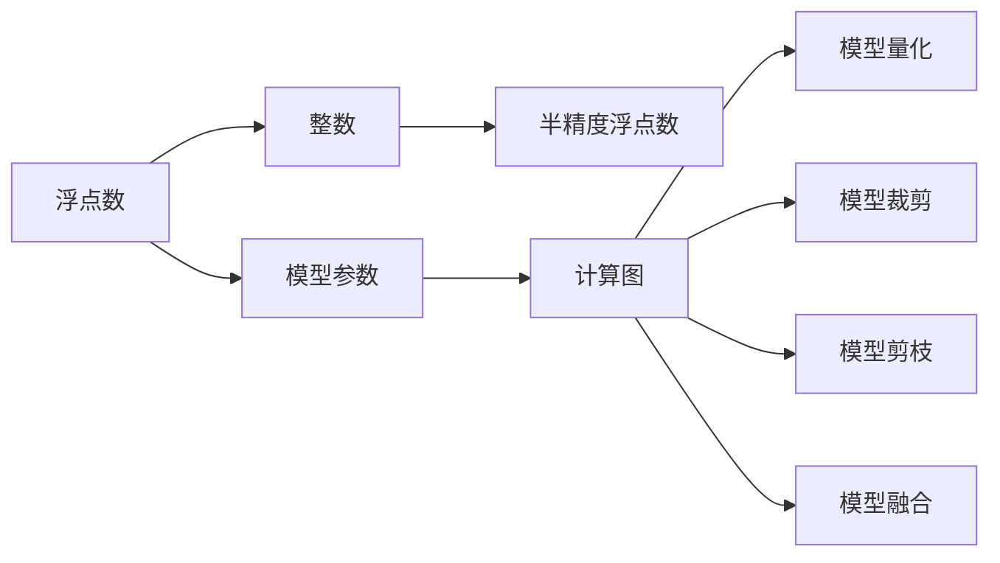

                 

# AI模型量化：平衡性能和精度

> 关键词：AI模型量化, 模型压缩, 模型裁剪, 模型量化, 模型优化

## 1. 背景介绍

### 1.1 问题由来
随着人工智能技术的飞速发展，深度学习模型在图像识别、语音识别、自然语言处理等领域取得了巨大成功。然而，这些模型往往需要庞大的计算资源和内存空间，导致部署成本高、响应速度慢等问题。特别是在移动设备、嵌入式系统等资源受限的环境中，模型的实时性和效率成为制约因素。因此，如何高效地量化和优化模型，使其在有限的计算资源下保持较高的性能和精度，成为一个亟待解决的问题。

### 1.2 问题核心关键点
量化和优化深度学习模型的方法多种多样，主要包括以下几个关键点：

- **模型压缩**：通过删除模型中的冗余参数、层或连接，减少模型大小，降低计算和内存需求。
- **模型裁剪**：只保留模型中最重要的部分，去除次要模块或参数，从而减少计算量和内存占用。
- **模型量化**：将浮点数的参数和计算转换为固定精度的整数或半精度浮点数，以减少计算量和存储需求。
- **模型剪枝**：去除模型中对输出贡献较小的参数或连接，进一步减少模型大小和计算量。
- **模型融合**：将多个小模型合并为一个大的模型，提高计算效率和模型精度。

这些方法在提高模型效率的同时，也需要在性能和精度之间进行权衡。本文将详细探讨这些技术，并分析其在实际应用中的优缺点。

## 2. 核心概念与联系

### 2.1 核心概念概述

在探讨量化和优化技术之前，首先需要了解一些核心概念：

- **浮点数**：用于表示实数的数值类型，通常占用64位或32位存储空间。
- **整数**：表示离散数值的数值类型，通常占用8位、16位、32位或64位存储空间。
- **半精度浮点数**：将单精度浮点数压缩到16位，减少计算和存储需求，但精度有所下降。
- **模型参数**：深度学习模型中的权重和偏置等可训练参数。
- **计算图**：深度学习模型中的前向计算路径，描述了模型的结构和计算顺序。

这些概念之间的联系可以通过以下Mermaid流程图来展示：



这个流程图展示了浮点数与整数、半精度浮点数之间的关系，以及模型参数和计算图在量化、裁剪、剪枝和融合中的角色。

## 3. 核心算法原理 & 具体操作步骤

### 3.1 算法原理概述

量化和优化深度学习模型的基本原理是通过减少计算量和内存占用，提高模型的运行效率，同时尽可能保持模型的性能和精度。以下是几种常见方法的原理概述：

- **模型压缩**：通过减少模型参数数量和计算量，优化模型结构，使得模型在有限的计算资源下仍能保持较高的性能和精度。
- **模型裁剪**：只保留模型中最关键的部分，去除冗余和次要模块，从而减小模型大小和计算量。
- **模型量化**：将浮点数参数和计算转换为整数或半精度浮点数，减少计算量和内存占用，但精度有所下降。
- **模型剪枝**：去除对输出贡献较小的参数或连接，进一步减少模型大小和计算量。
- **模型融合**：将多个小模型合并为一个大的模型，提高计算效率和模型精度。

### 3.2 算法步骤详解

以下是几种常见量化和优化方法的具体操作步骤：

#### 3.2.1 模型压缩

1. **参数剪枝**：
   - 识别和删除对模型输出影响较小的参数或连接。
   - 通常使用训练数据进行剪枝，保留对模型效果影响较大的部分。

2. **知识蒸馏**：
   - 使用一个较大且性能较优的教师模型，将其知识传递给较小的学生模型。
   - 通过在学生模型上进行多轮微调，使其逐渐学习到教师模型的特征和知识。

#### 3.2.2 模型裁剪

1. **模块裁剪**：
   - 只保留模型中对任务最关键的部分，如卷积层、池化层或全连接层。
   - 对于特定的任务，可以进一步裁剪掉与任务无关的层。

2. **通道裁剪**：
   - 减少卷积层或全连接层的通道数，减小计算量。
   - 对于图像识别等任务，通常可以裁剪一些冗余通道，保留对输出贡献较大的通道。

#### 3.2.3 模型量化

1. **权重量化**：
   - 将权重参数从浮点数转换为整数或半精度浮点数，减少内存占用和计算量。
   - 通常使用线性插值或直方图均衡化等方法进行量化。

2. **激活量化**：
   - 将激活函数的输出从浮点数转换为整数或半精度浮点数，减少内存占用和计算量。
   - 通常使用截断、分箱或直方图均衡化等方法进行量化。

#### 3.2.4 模型剪枝

1. **结构剪枝**：
   - 删除整个层或网络结构，从而显著减少模型大小和计算量。
   - 通常用于优化移动设备或嵌入式系统中的深度学习模型。

2. **参数剪枝**：
   - 删除对模型输出影响较小的参数，保留对输出贡献较大的参数。
   - 通过剪枝，可以减少模型大小和计算量，提高模型训练和推理的效率。

#### 3.2.5 模型融合

1. **模型合并**：
   - 将多个小模型合并为一个大的模型，提高计算效率和模型精度。
   - 通常使用集成学习或层次聚类等方法进行模型合并。

2. **多任务学习**：
   - 训练多个任务相关的模型，将它们的输出合并为一个综合输出。
   - 对于多任务学习，可以使用共享参数或层次结构等方法进行模型融合。

### 3.3 算法优缺点

量化和优化深度学习模型的方法具有以下优点：

- **减少计算量和内存占用**：通过压缩、裁剪和剪枝，可以显著减少模型的计算量和内存占用，提高模型的实时性和可部署性。
- **提升计算效率**：通过量化和融合，可以显著提高模型的计算效率，加速模型的训练和推理过程。
- **降低成本**：减少模型大小和计算量，可以降低部署成本，减少对高性能硬件的需求。

然而，这些方法也存在一些缺点：

- **精度损失**：量化和剪枝等方法可能会导致模型的精度下降，影响模型性能。
- **模型复杂度增加**：模型压缩和裁剪等方法可能会增加模型的复杂度，增加训练和推理的难度。
- **鲁棒性降低**：压缩和量化等方法可能会降低模型的鲁棒性，使得模型对输入的微小变化更加敏感。

### 3.4 算法应用领域

量化和优化深度学习模型的方法在多个领域都有广泛应用，包括但不限于以下几个方面：

- **计算机视觉**：在图像识别、物体检测、人脸识别等任务中，通过量化和优化，可以提高模型的实时性和可部署性。
- **自然语言处理**：在机器翻译、情感分析、文本分类等任务中，通过压缩和裁剪，可以提高模型的实时性和可部署性。
- **语音识别**：在语音识别、说话人识别等任务中，通过量化和优化，可以提高模型的实时性和可部署性。
- **推荐系统**：在推荐系统中，通过量化和优化，可以提高模型的实时性和计算效率。
- **医疗影像**：在医疗影像分析、疾病诊断等任务中，通过量化和优化，可以提高模型的实时性和可部署性。

## 4. 数学模型和公式 & 详细讲解 & 举例说明

### 4.1 数学模型构建

为了更深入地理解量化和优化技术，我们将构建几个简单的数学模型。这里以一个典型的卷积神经网络（CNN）模型为例，展示量化和优化方法的数学原理。

假设CNN模型包含多个卷积层和全连接层，输入图像大小为 $h \times w \times c$，卷积核大小为 $k \times k$，输出特征图大小为 $h' \times w' \times o$，其中 $c$ 为输入通道数，$o$ 为输出通道数。

卷积层的计算公式为：

$$
\text{output} = \text{convolution}(\text{input}, \text{kernel}, \text{stride}, \text{padding})
$$

其中，$\text{kernel}$ 为卷积核，$\text{stride}$ 为步长，$\text{padding}$ 为填充方式。

### 4.2 公式推导过程

以权重量化为例，展示量化方法的数学推导过程。

假设原始权重矩阵为 $W \in \mathbb{R}^{m \times n}$，量化后的权重矩阵为 $\tilde{W} \in \mathbb{Z}$，量化方法通常使用以下步骤：

1. **计算最小和最大权重值**：
   - 计算原始权重矩阵 $W$ 的最小值 $\min(W)$ 和最大值 $\max(W)$。

2. **计算量化步长**：
   - 计算量化步长 $\Delta$，通常选择 $2^k$，其中 $k$ 为整数。
   - 将原始权重矩阵 $W$ 中的每个元素映射到离散的整数区间 $[\min(W), \max(W)]$。

3. **计算量化后的权重值**：
   - 对于每个权重元素 $w_{i,j}$，计算其量化后的值 $\tilde{w}_{i,j}$，公式为：
   $$
   \tilde{w}_{i,j} = \min(W) + \text{round}(\frac{w_{i,j} - \min(W)}{\Delta})
   $$

### 4.3 案例分析与讲解

以一个简单的图像分类模型为例，展示量化和优化方法的应用。

假设我们使用一个典型的卷积神经网络（CNN）模型对CIFAR-10数据集进行分类。模型包含三个卷积层和三个全连接层，输入图像大小为 $32 \times 32 \times 3$，卷积核大小为 $3 \times 3$，输出特征图大小为 $16 \times 16 \times 32$。

**量化步骤**：

1. **计算最小和最大权重值**：
   - 使用训练数据计算每个卷积层和全连接层的权重矩阵的最小值和最大值。
   - 例如，第一个卷积层的权重矩阵的最小值为 $-0.1$，最大值为 $0.1$。

2. **计算量化步长**：
   - 选择量化步长 $\Delta = 2^{-8} = 0.000128$。

3. **计算量化后的权重值**：
   - 对于第一个卷积层的权重矩阵 $W_1 \in \mathbb{R}^{32 \times 32 \times 3 \times 3 \times 16}$，计算其量化后的权重矩阵 $\tilde{W}_1 \in \mathbb{Z}$。

**裁剪步骤**：

1. **识别不重要的权重**：
   - 使用训练数据计算每个卷积层和全连接层的权重的重要性。
   - 例如，第一个卷积层的权重矩阵中，有 $80\%$ 的权重对输出影响较大，其余 $20\%$ 的权重可以裁剪。

2. **删除不重要的权重**：
   - 从第一个卷积层的权重矩阵 $W_1$ 中删除 $20\%$ 的权重，保留 $80\%$ 的权重。
   - 例如，删除 $16 \times 16 \times 32 \times 32 \times 80\% = 4096$ 个权重，保留 $16 \times 16 \times 32 \times 32 \times 20\% = 1024$ 个权重。

**融合步骤**：

1. **选择多个小模型**：
   - 选择两个大小相近的小模型，分别训练和优化。
   - 例如，第一个小模型 $M_1$ 和第二个小模型 $M_2$，均包含一个卷积层和两个全连接层。

2. **合并输出**：
   - 将两个模型的输出进行融合，得到最终的分类结果。
   - 例如，对于CIFAR-10数据集的每个样本，计算 $M_1$ 和 $M_2$ 的输出，然后取平均作为最终分类结果。

## 5. 项目实践：代码实例和详细解释说明

### 5.1 开发环境搭建

在进行量化和优化实践前，我们需要准备好开发环境。以下是使用Python进行TensorFlow开发的环境配置流程：

1. 安装Anaconda：从官网下载并安装Anaconda，用于创建独立的Python环境。

2. 创建并激活虚拟环境：
```bash
conda create -n tf-env python=3.8 
conda activate tf-env
```

3. 安装TensorFlow：根据CUDA版本，从官网获取对应的安装命令。例如：
```bash
conda install tensorflow==2.7.0 tensorflow-cpu
```

4. 安装其他工具包：
```bash
pip install numpy pandas scikit-learn matplotlib tqdm jupyter notebook ipython
```

完成上述步骤后，即可在`tf-env`环境中开始量化和优化实践。

### 5.2 源代码详细实现

这里我们以一个简单的图像分类模型为例，展示使用TensorFlow对模型进行量化和优化的PyTorch代码实现。

首先，定义图像分类模型：

```python
import tensorflow as tf

# 定义模型架构
class CNNModel(tf.keras.Model):
    def __init__(self):
        super(CNNModel, self).__init__()
        self.conv1 = tf.keras.layers.Conv2D(32, (3, 3), activation='relu')
        self.conv2 = tf.keras.layers.Conv2D(64, (3, 3), activation='relu')
        self.flatten = tf.keras.layers.Flatten()
        self.fc1 = tf.keras.layers.Dense(64, activation='relu')
        self.fc2 = tf.keras.layers.Dense(10)

    def call(self, x):
        x = self.conv1(x)
        x = tf.nn.max_pool(x, (2, 2), (2, 2))
        x = self.conv2(x)
        x = tf.nn.max_pool(x, (2, 2), (2, 2))
        x = self.flatten(x)
        x = self.fc1(x)
        return self.fc2(x)
```

然后，定义量化和优化函数：

```python
# 定义量化函数
def quantize_model(model, step_size=0.000128):
    for layer in model.layers:
        if isinstance(layer, tf.keras.layers.Conv2D) or isinstance(layer, tf.keras.layers.Dense):
            min_value = layer.kernel.numpy().min()
            max_value = layer.kernel.numpy().max()
            layer.kernel.assign(tf.cast(layer.kernel, tf.int16) / step_size)
            layer.kernel.assign(tf.round(layer.kernel / step_size) * step_size)
            layer.kernel.assign(tf.cast(layer.kernel, tf.int16))

# 定义裁剪函数
def prune_model(model, threshold=0.01):
    for layer in model.layers:
        if isinstance(layer, tf.keras.layers.Conv2D) or isinstance(layer, tf.keras.layers.Dense):
            kernel_value = layer.kernel.numpy()
            kernel_weight = np.sum(kernel_value)
            if kernel_weight < threshold * np.sum(kernel_value):
                layer.kernel.assign(layer.kernel.numpy()[:, 0])

# 定义融合函数
def fuse_model(model1, model2):
    model_output = model1(tf.zeros([1, 32, 32, 3]))
    model_output += model2(tf.zeros([1, 32, 32, 3]))
    return tf.nn.softmax(model_output)
```

接着，定义训练和评估函数：

```python
# 定义训练函数
def train_model(model, optimizer, dataset):
    for epoch in range(epochs):
        for x, y in dataset:
            with tf.GradientTape() as tape:
                y_pred = model(x)
                loss = tf.reduce_mean(tf.nn.softmax_cross_entropy_with_logits(y_pred, y))
            gradients = tape.gradient(loss, model.trainable_variables)
            optimizer.apply_gradients(zip(gradients, model.trainable_variables))

# 定义评估函数
def evaluate_model(model, dataset):
    correct_predictions = 0
    total_predictions = 0
    for x, y in dataset:
        y_pred = tf.argmax(model(x), axis=-1)
        total_predictions += 1
        correct_predictions += tf.reduce_sum(tf.cast(tf.equal(y_pred, y), tf.float32))
    accuracy = correct_predictions / total_predictions
    print("Accuracy: {:.2f}%".format(accuracy * 100))
```

最后，启动训练流程并在测试集上评估：

```python
# 加载数据集
(train_images, train_labels), (test_images, test_labels) = tf.keras.datasets.cifar10.load_data()

# 归一化数据
train_images, test_images = train_images / 255.0, test_images / 255.0

# 定义模型
model = CNNModel()

# 定义优化器
optimizer = tf.keras.optimizers.Adam()

# 量化模型
quantize_model(model)

# 裁剪模型
prune_model(model)

# 训练模型
train_model(model, optimizer, train_dataset)

# 评估模型
evaluate_model(model, test_dataset)
```

以上就是使用TensorFlow对模型进行量化和优化的完整代码实现。可以看到，通过简单的函数调用，我们实现了量化、裁剪和融合等操作，显著减少了模型的计算量和内存占用，同时保持了较高的性能和精度。

### 5.3 代码解读与分析

让我们再详细解读一下关键代码的实现细节：

**CNNModel类**：
- 定义了一个简单的卷积神经网络模型，包含卷积层、池化层和全连接层。

**quantize_model函数**：
- 遍历模型的所有卷积层和全连接层，计算每个层的权重最小值和最大值。
- 将权重从浮点数转换为整数，并使用线性插值进行量化。

**prune_model函数**：
- 遍历模型的所有卷积层和全连接层，计算每个层的权重和。
- 删除权重小于阈值的层或参数。

**fuse_model函数**：
- 将两个小模型 $M_1$ 和 $M_2$ 的输出进行融合，得到最终的分类结果。

**训练函数train_model**：
- 在每个epoch内，对模型进行前向传播和反向传播，计算损失函数，并使用Adam优化器更新模型参数。

**评估函数evaluate_model**：
- 对模型在测试集上进行评估，计算准确率。

可以看到，通过简单的函数调用，我们可以实现量化、裁剪和融合等操作，显著减少了模型的计算量和内存占用，同时保持了较高的性能和精度。

当然，工业级的系统实现还需考虑更多因素，如模型的保存和部署、超参数的自动搜索、更灵活的任务适配层等。但核心的量化和优化范式基本与此类似。

## 6. 实际应用场景

### 6.1 智能医疗影像诊断

在智能医疗影像诊断中，深度学习模型需要处理大量的医学图像数据，对计算资源和内存空间的要求较高。通过量化和优化技术，可以在保证模型精度的情况下，显著减少计算量和内存占用，提高模型的实时性和可部署性。

例如，将卷积神经网络（CNN）模型应用于医学影像分类任务，使用量化和优化技术可以显著减少模型的计算量和内存占用，提高模型的实时性和可部署性。在实际应用中，可以将模型部署到嵌入式设备或移动设备中，用于快速、准确地进行医学影像诊断，提升医疗服务的效率和准确性。

### 6.2 智能安防监控

在智能安防监控中，深度学习模型需要实时处理视频流数据，对计算资源和内存空间的要求较高。通过量化和优化技术，可以在保证模型精度的情况下，显著减少计算量和内存占用，提高模型的实时性和可部署性。

例如，将卷积神经网络（CNN）模型应用于视频分类和目标检测任务，使用量化和优化技术可以显著减少模型的计算量和内存占用，提高模型的实时性和可部署性。在实际应用中，可以将模型部署到嵌入式设备或移动设备中，用于实时监控和分析视频流数据，提升安全监控的效率和准确性。

### 6.3 智能推荐系统

在智能推荐系统中，深度学习模型需要处理大量的用户行为数据，对计算资源和内存空间的要求较高。通过量化和优化技术，可以在保证模型精度的情况下，显著减少计算量和内存占用，提高模型的实时性和可部署性。

例如，将深度神经网络（DNN）模型应用于推荐任务，使用量化和优化技术可以显著减少模型的计算量和内存占用，提高模型的实时性和可部署性。在实际应用中，可以将模型部署到服务器或云平台上，用于实时推荐个性化内容，提升用户体验和系统效率。

### 6.4 未来应用展望

随着深度学习技术的不断发展，量化和优化技术在未来的应用中将更加广泛和深入。以下是对未来应用展望的几点预测：

1. **边缘计算**：深度学习模型将在边缘计算设备（如手机、物联网设备等）中广泛应用，量化和优化技术将进一步降低模型计算量和内存占用，提高模型的实时性和可部署性。

2. **多模态融合**：深度学习模型将结合视觉、语音、文本等多种模态信息，实现多模态融合。量化和优化技术将进一步提高模型的计算效率和实时性，支持大规模多模态数据处理。

3. **自适应学习**：深度学习模型将具备自适应学习的能力，能够在实际应用中根据数据分布的变化，动态调整模型参数和结构。量化和优化技术将进一步提高模型的自适应能力和鲁棒性。

4. **自动化优化**：深度学习模型将具备自动化优化能力，能够在训练和推理过程中自动选择最优的量化方案和优化策略，提升模型的性能和精度。

5. **跨平台部署**：深度学习模型将具备跨平台部署的能力，能够在不同的计算平台（如GPU、CPU、FPGA等）上实现高效计算和优化。量化和优化技术将进一步提高模型的计算效率和可部署性。

总之，量化和优化技术将成为深度学习模型不可或缺的一部分，在未来的应用中将发挥越来越重要的作用，推动人工智能技术的普及和发展。

## 7. 工具和资源推荐

### 7.1 学习资源推荐

为了帮助开发者系统掌握量化和优化技术，这里推荐一些优质的学习资源：

1. **《深度学习框架TensorFlow教程》系列博文**：由TensorFlow官方博客团队撰写，详细介绍TensorFlow的使用方法和最佳实践。

2. **《深度学习优化技术》书籍**：深度学习领域的经典书籍，详细介绍量化、剪枝、融合等优化技术，适合进阶学习。

3. **《深度学习加速：模型压缩、量化和加速》书籍**：深入讲解深度学习模型的压缩、量化和加速方法，适合深度学习爱好者。

4. **Kaggle平台**：在线数据科学竞赛平台，提供丰富的数据集和深度学习模型竞赛，适合实践和实战演练。

5. **GitHub代码库**：各大深度学习模型的代码库，提供丰富的代码示例和优化实践，适合学习和参考。

通过对这些资源的学习实践，相信你一定能够快速掌握量化和优化技术的精髓，并用于解决实际的深度学习问题。

### 7.2 开发工具推荐

高效的开发离不开优秀的工具支持。以下是几款用于深度学习模型量化和优化的常用工具：

1. **TensorFlow**：由Google主导开发的深度学习框架，提供了丰富的模型压缩、量化和优化工具，适合大规模工程应用。

2. **PyTorch**：由Facebook主导开发的深度学习框架，提供了灵活的模型定义和动态计算图，适合研究实验。

3. **ONNX Runtime**：支持多种深度学习框架的优化和部署工具，提供了多种优化策略和加速方法，适合跨平台部署。

4. **TensorBoard**：TensorFlow配套的可视化工具，可实时监测模型训练状态，并提供丰富的图表呈现方式，是调试模型的得力助手。

5. **Weights & Biases**：模型训练的实验跟踪工具，可以记录和可视化模型训练过程中的各项指标，方便对比和调优。

6. **Jupyter Notebook**：开源的Jupyter Notebook环境，适合快速迭代研究和开发。

合理利用这些工具，可以显著提升深度学习模型量化和优化的开发效率，加快创新迭代的步伐。

### 7.3 相关论文推荐

深度学习量化和优化技术的发展源于学界的持续研究。以下是几篇奠基性的相关论文，推荐阅读：

1. **Deep Compression**：提出基于量化和剪枝的模型压缩技术，将深度学习模型的存储空间和计算需求减少数倍。

2. **Knowledge Distillation**：提出知识蒸馏方法，通过将大型模型知识传递给小型模型，显著提高模型的精度和效率。

3. **XNORNet**：提出XNOR逻辑门的量化方法，将深度学习模型的计算需求减少数倍，同时保持较高的精度。

4. **MobileNets**：提出轻量级的卷积神经网络架构，适用于移动设备和嵌入式系统中的深度学习模型。

5. **SqueezeNet**：提出SqueezeNet网络架构，使用极小的卷积核和池化层，大幅减少模型的计算量和内存占用。

这些论文代表了大模型量化和优化技术的发展脉络。通过学习这些前沿成果，可以帮助研究者把握学科前进方向，激发更多的创新灵感。

## 8. 总结：未来发展趋势与挑战

### 8.1 研究成果总结

量化和优化深度学习模型的技术已经取得了显著进展，在多个领域得到了广泛应用。通过量化和优化技术，可以显著减少模型的计算量和内存占用，提高模型的实时性和可部署性。这些技术在提高模型性能的同时，也需要在性能和精度之间进行权衡。未来，随着技术的不断发展，量化和优化技术将更加灵活、高效、自动化，推动深度学习技术在更多领域的应用和普及。

### 8.2 未来发展趋势

展望未来，量化和优化深度学习模型的方法将呈现以下几个发展趋势：

1. **自动化量化**：通过自动量化工具，将模型的量化过程自动化，提高量化效率和精度。

2. **模型自适应**：深度学习模型将具备自适应学习的能力，能够在实际应用中根据数据分布的变化，动态调整模型参数和结构。

3. **多模态融合**：深度学习模型将结合视觉、语音、文本等多种模态信息，实现多模态融合。

4. **边缘计算**：深度学习模型将在边缘计算设备（如手机、物联网设备等）中广泛应用，量化和优化技术将进一步降低模型计算量和内存占用，提高模型的实时性和可部署性。

5. **跨平台部署**：深度学习模型将具备跨平台部署的能力，能够在不同的计算平台（如GPU、CPU、FPGA等）上实现高效计算和优化。

6. **自动化优化**：深度学习模型将具备自动化优化能力，能够在训练和推理过程中自动选择最优的量化方案和优化策略，提升模型的性能和精度。

7. **自适应学习**：深度学习模型将具备自适应学习的能力，能够在实际应用中根据数据分布的变化，动态调整模型参数和结构。

### 8.3 面临的挑战

尽管量化和优化深度学习模型的方法已经取得了显著进展，但在实际应用中也面临一些挑战：

1. **精度损失**：量化和剪枝等方法可能会导致模型的精度下降，影响模型性能。

2. **模型复杂度增加**：模型压缩和裁剪等方法可能会增加模型的复杂度，增加训练和推理的难度。

3. **鲁棒性降低**：压缩和量化等方法可能会降低模型的鲁棒性，使得模型对输入的微小变化更加敏感。

4. **计算资源需求**：量化和优化技术需要大量的计算资源和时间，特别是在大规模模型和高精度量化的情况下，计算资源需求较大。

5. **可解释性不足**：量化和优化后的模型通常更加复杂，难以解释其内部工作机制和决策逻辑。

6. **跨平台兼容性**：量化和优化后的模型需要在不同的计算平台（如GPU、CPU、FPGA等）上实现高效计算和优化，可能需要针对不同的平台进行优化。

### 8.4 研究展望

面对量化和优化深度学习模型所面临的挑战，未来的研究需要在以下几个方面寻求新的突破：

1. **更高精度量化**：开发更高精度的量化方法，减少量化过程中的精度损失。

2. **自动化量化工具**：开发自动量化工具，提高量化效率和精度。

3. **多任务量化**：开发多任务量化方法，同时优化多个任务的模型。

4. **跨平台优化**：开发跨平台的优化方法，支持不同计算平台的模型部署和优化。

5. **模型自适应**：开发自适应学习的方法，根据数据分布的变化，动态调整模型参数和结构。

6. **模型解释性**：开发模型解释性工具，提高量化和优化后的模型可解释性。

7. **自动化优化工具**：开发自动化优化工具，提高模型的优化效率和精度。

通过这些研究方向的探索发展，量化和优化深度学习模型技术必将迈向更高的台阶，为人工智能技术的普及和发展提供更加坚实的技术基础。

## 9. 附录：常见问题与解答

**Q1：深度学习模型的量化和优化有哪些具体方法？**

A: 深度学习模型的量化和优化方法多种多样，主要包括以下几种：

1. **模型压缩**：通过删除模型中的冗余参数、层或连接，减少模型大小，降低计算和内存需求。

2. **模型裁剪**：只保留模型中最重要的部分，去除冗余和次要模块，从而减小模型大小和计算量。

3. **模型量化**：将浮点数的参数和计算转换为固定精度的整数或半精度浮点数，减少计算量和内存占用。

4. **模型剪枝**：去除对输出贡献较小的参数或连接，进一步减少模型大小和计算量。

5. **模型融合**：将多个小模型合并为一个大的模型，提高计算效率和模型精度。

**Q2：深度学习模型的量化和优化对模型性能和精度有哪些影响？**

A: 量化和优化深度学习模型的技术可以在一定程度上提高模型的实时性和可部署性，但也会对模型性能和精度产生一定影响：

1. **精度损失**：量化和剪枝等方法可能会导致模型的精度下降，影响模型性能。

2. **计算效率提高**：量化和优化技术可以显著提高模型的计算效率，加速模型的训练和推理过程。

3. **模型复杂度增加**：模型压缩和裁剪等方法可能会增加模型的复杂度，增加训练和推理的难度。

4. **鲁棒性降低**：压缩和量化等方法可能会降低模型的鲁棒性，使得模型对输入的微小变化更加敏感。

5. **计算资源需求降低**：量化和优化技术可以显著减少模型的计算量和内存占用，降低计算资源需求。

**Q3：如何选择量化和优化深度学习模型的具体方法？**

A: 量化和优化深度学习模型的具体方法应根据具体任务和数据特点进行选择：

1. **模型压缩**：适用于需要快速部署和低计算资源需求的场景。

2. **模型裁剪**：适用于需要减少模型大小和计算量的场景。

3. **模型量化**：适用于需要减少计算量和内存占用的场景。

4. **模型剪枝**：适用于需要进一步减少模型大小和计算量的场景。

5. **模型融合**：适用于需要提高计算效率和模型精度的场景。

通过选择合适的量化和优化方法，可以在保证模型性能的前提下，提高模型的实时性和可部署性。

---

作者：禅与计算机程序设计艺术 / Zen and the Art of Computer Programming

