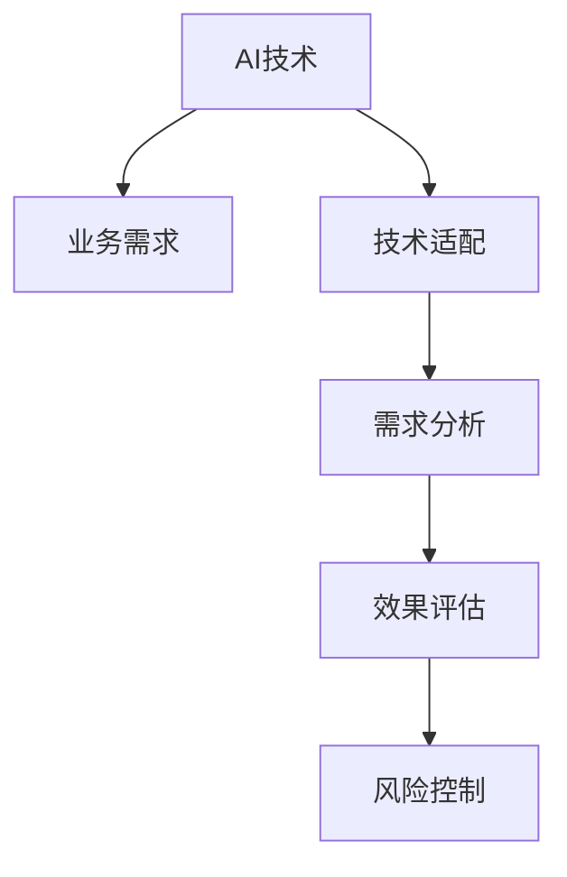

                 

# AI的业务场景：工程师与产品经理的对话，找到AI的应用边界与需求结合

## 1. 背景介绍

### 1.1 问题由来

近年来，人工智能(AI)技术迅猛发展，逐步渗透到各行各业，成为推动数字化转型和产业升级的重要引擎。随着AI应用的深入，AI与业务需求的结合成为企业关注的焦点。在这一背景下，工程师与产品经理之间的对话，变得尤为关键。

### 1.2 问题核心关键点

1. **技术适用性**：AI技术是否能适用于具体的业务场景？
2. **需求匹配度**：业务需求与AI技术之间是否存在匹配点？
3. **实现可行性**：现有技术能否满足业务需求？
4. **效果评估**：如何评估AI应用的效果？
5. **风险控制**：应用AI技术可能带来的风险有哪些？

### 1.3 问题研究意义

1. **加速业务创新**：通过明确AI技术与业务需求的结合点，可以加速产品迭代和业务创新。
2. **优化资源配置**：合理配置AI资源，避免过度投资和技术浪费。
3. **提高用户体验**：AI技术的应用可以提升产品的智能化水平，提升用户体验。
4. **增强竞争力**：通过AI应用，企业可以提升核心竞争力，实现差异化竞争。
5. **促进产业升级**：AI技术在传统行业的深度应用，可以推动产业升级和结构调整。

## 2. 核心概念与联系

### 2.1 核心概念概述

在讨论AI与业务需求的结合时，需要理解以下几个核心概念：

- **AI技术**：包括机器学习、深度学习、自然语言处理、计算机视觉等，是实现智能化的技术手段。
- **业务需求**：企业根据市场变化和用户反馈，对产品功能、性能、用户体验等提出的具体要求。
- **技术适配**：将AI技术应用于业务场景，解决实际问题的过程。
- **需求分析**：通过调查研究、用户反馈、市场分析等手段，明确业务需求的本质和关键点。
- **效果评估**：通过实验测试、用户反馈、业务指标等手段，衡量AI应用的效果。
- **风险控制**：在应用AI技术时，需要识别和评估潜在风险，采取相应的风险控制措施。

这些概念之间的关系可以通过以下Mermaid流程图来展示：



这个流程图展示了AI技术与业务需求之间的逻辑关系：

1. AI技术提供智能化的解决方案。
2. 业务需求定义具体的应用目标。
3. 需求分析帮助明确需求的本质和关键点。
4. 技术适配将AI技术应用于业务场景。
5. 效果评估衡量应用的效果。
6. 风险控制保障应用的稳定性和安全性。

## 3. 核心算法原理 & 具体操作步骤

### 3.1 算法原理概述

AI与业务需求的结合，通常需要经历以下几个步骤：

1. **需求识别**：通过调查研究、用户反馈、市场分析等手段，明确业务需求。
2. **需求匹配**：将业务需求与AI技术进行匹配，确定哪些问题可以通过AI技术解决。
3. **技术选型**：根据需求特点和技术能力，选择适合的AI技术和工具。
4. **模型训练**：使用业务数据训练AI模型，获取初始模型参数。
5. **模型优化**：根据业务需求和评估结果，对模型进行调优。
6. **模型部署**：将优化后的模型部署到实际业务环境中，进行实时应用。

### 3.2 算法步骤详解

**Step 1: 需求识别与分析**
- 调查市场趋势、行业报告、用户反馈等，识别业务问题。
- 确定问题的重要性和紧急性，明确需求优先级。
- 与利益相关者沟通，确保需求的全面性和准确性。

**Step 2: 需求匹配与技术选型**
- 将业务需求与AI技术进行匹配，识别匹配点。
- 根据技术成熟度和实现难度，选择合适的AI技术和工具。
- 评估技术的成本和效益，进行技术方案的比较和选择。

**Step 3: 模型训练与优化**
- 收集业务数据，清洗和处理数据，准备训练数据集。
- 选择合适的模型架构和算法，进行模型训练。
- 根据评估结果，调整模型参数和结构，进行模型优化。
- 在业务数据集上进行测试，评估模型的效果和鲁棒性。

**Step 4: 模型部署与监控**
- 将优化后的模型部署到实际业务环境中，进行实时应用。
- 监控模型的性能和运行状态，收集反馈数据。
- 根据反馈数据，进一步优化模型，迭代改进。

### 3.3 算法优缺点

**优点：**
1. **高效性**：AI技术可以自动化处理大量数据，提高工作效率。
2. **智能化**：AI模型可以自主学习和优化，提高决策的智能性。
3. **灵活性**：AI技术可以应用于各种业务场景，具有广泛的适用性。
4. **可扩展性**：AI技术可以随着数据和业务的变化不断更新和优化。

**缺点：**
1. **数据依赖**：AI模型需要大量高质量数据进行训练，数据获取和处理成本高。
2. **技术复杂**：AI技术的应用需要专业技能，对人才和资源要求较高。
3. **模型解释**：AI模型通常作为"黑盒"系统，难以解释其决策过程。
4. **风险控制**：AI应用可能带来数据隐私、安全等问题，需要严格的风险控制。

### 3.4 算法应用领域

AI技术在各个业务领域都有广泛的应用，例如：

- **金融行业**：通过AI进行风险评估、欺诈检测、客户服务等工作。
- **医疗健康**：使用AI进行疾病诊断、医疗影像分析、个性化治疗等工作。
- **制造业**：利用AI进行质量检测、设备维护、生产优化等工作。
- **零售电商**：通过AI进行商品推荐、库存管理、客户行为分析等工作。
- **交通运输**：应用AI进行智能调度、交通流量预测、自动驾驶等工作。

## 4. 数学模型和公式 & 详细讲解 & 举例说明

### 4.1 数学模型构建

在AI应用中，通常需要构建数学模型来描述问题。例如，在推荐系统中的协同过滤模型，可以使用矩阵分解的形式表示用户与商品之间的关联关系：

$$
\mathbf{P} \approx \mathbf{U}\mathbf{V}^T
$$

其中，$\mathbf{P}$为商品评分矩阵，$\mathbf{U}$和$\mathbf{V}$分别为用户和商品的特征向量矩阵。

### 4.2 公式推导过程

以协同过滤模型为例，其推导过程如下：

1. 假设用户i对商品j的评分$R_{ij}$可以表示为用户i对商品j的特征向量和商品j的特征向量的点积：

$$
R_{ij} \approx \mathbf{u}_i^T\mathbf{v}_j
$$

2. 假设$\mathbf{u}_i$和$\mathbf{v}_j$是低维稀疏向量，可以进一步假设用户特征向量和商品特征向量可以分别表示为矩阵$\mathbf{U}$和$\mathbf{V}$的列向量：

$$
\mathbf{P} \approx \mathbf{U}\mathbf{V}^T
$$

3. 假设$\mathbf{U}$和$\mathbf{V}$的维度较大，可以进行矩阵分解：

$$
\mathbf{U} \approx \mathbf{U}_k\mathbf{W}^T_k
$$
$$
\mathbf{V} \approx \mathbf{V}_k\mathbf{H}^T_k
$$

其中$\mathbf{U}_k$和$\mathbf{V}_k$是较小的用户和商品特征向量矩阵，$\mathbf{W}_k$和$\mathbf{H}_k$是用户和商品特征的权重矩阵。

4. 将上式代入协同过滤模型公式，得到：

$$
\mathbf{P} \approx \mathbf{U}_k\mathbf{W}^T_k\mathbf{V}_k\mathbf{H}^T_k
$$

5. 进一步简化，得到：

$$
\mathbf{P} \approx \mathbf{U}_k\mathbf{V}^T_k
$$

这样，协同过滤模型的数学模型就得到了推导。

### 4.3 案例分析与讲解

以智能客服系统为例，使用AI技术进行智能对话和情感分析：

1. 需求识别：客户需要快速、准确地获得问题的解答，提升用户体验。
2. 需求匹配：可以通过自然语言处理技术，识别用户意图，自动生成答案。
3. 技术选型：使用预训练的BERT模型，进行微调，用于意图识别和情感分析。
4. 模型训练：使用历史客户对话数据，训练模型，获取初始参数。
5. 模型优化：根据用户反馈，调整模型参数，进行模型优化。
6. 模型部署：将优化后的模型部署到实际客服系统中，进行实时对话和情感分析。

## 5. 项目实践：代码实例和详细解释说明

### 5.1 开发环境搭建

在进行AI项目实践前，需要准备好开发环境。以下是使用Python进行PyTorch开发的环境配置流程：

1. 安装Anaconda：从官网下载并安装Anaconda，用于创建独立的Python环境。

2. 创建并激活虚拟环境：
```bash
conda create -n pytorch-env python=3.8 
conda activate pytorch-env
```

3. 安装PyTorch：根据CUDA版本，从官网获取对应的安装命令。例如：
```bash
conda install pytorch torchvision torchaudio cudatoolkit=11.1 -c pytorch -c conda-forge
```

4. 安装Transformers库：
```bash
pip install transformers
```

5. 安装各类工具包：
```bash
pip install numpy pandas scikit-learn matplotlib tqdm jupyter notebook ipython
```

完成上述步骤后，即可在`pytorch-env`环境中开始AI项目实践。

### 5.2 源代码详细实现

以下是一个简单的AI项目代码实现示例，以智能客服系统为例：

```python
import torch
import torch.nn as nn
import torch.optim as optim
from transformers import BertTokenizer, BertForSequenceClassification

# 加载预训练模型和tokenizer
model = BertForSequenceClassification.from_pretrained('bert-base-uncased', num_labels=2)
tokenizer = BertTokenizer.from_pretrained('bert-base-uncased')

# 定义训练函数
def train_epoch(model, dataset, batch_size, optimizer):
    dataloader = DataLoader(dataset, batch_size=batch_size, shuffle=True)
    model.train()
    epoch_loss = 0
    for batch in dataloader:
        input_ids = batch['input_ids'].to(device)
        attention_mask = batch['attention_mask'].to(device)
        labels = batch['labels'].to(device)
        model.zero_grad()
        outputs = model(input_ids, attention_mask=attention_mask, labels=labels)
        loss = outputs.loss
        epoch_loss += loss.item()
        loss.backward()
        optimizer.step()
    return epoch_loss / len(dataloader)

# 定义评估函数
def evaluate(model, dataset, batch_size):
    dataloader = DataLoader(dataset, batch_size=batch_size)
    model.eval()
    preds, labels = [], []
    with torch.no_grad():
        for batch in dataloader:
            input_ids = batch['input_ids'].to(device)
            attention_mask = batch['attention_mask'].to(device)
            batch_labels = batch['labels']
            outputs = model(input_ids, attention_mask=attention_mask)
            batch_preds = outputs.logits.argmax(dim=2).to('cpu').tolist()
            batch_labels = batch_labels.to('cpu').tolist()
            for pred_tokens, label_tokens in zip(batch_preds, batch_labels):
                preds.append(pred_tokens[:len(label_tokens)])
                labels.append(label_tokens)
    return preds, labels

# 准备数据集
train_dataset = ...
dev_dataset = ...
test_dataset = ...

# 训练模型
device = torch.device('cuda') if torch.cuda.is_available() else torch.device('cpu')
model.to(device)

epochs = 5
batch_size = 16

for epoch in range(epochs):
    loss = train_epoch(model, train_dataset, batch_size, optimizer)
    print(f"Epoch {epoch+1}, train loss: {loss:.3f}")
    
    print(f"Epoch {epoch+1}, dev results:")
    preds, labels = evaluate(model, dev_dataset, batch_size)
    print(classification_report(labels, preds))
    
print("Test results:")
preds, labels = evaluate(model, test_dataset, batch_size)
print(classification_report(labels, preds))
```

以上就是使用PyTorch对BERT进行智能客服系统微调的完整代码实现。可以看到，Transformers库的强大封装使得模型的加载和微调过程变得简洁高效。

### 5.3 代码解读与分析

让我们再详细解读一下关键代码的实现细节：

**train_epoch函数**：
- 加载数据集，定义损失函数和优化器。
- 循环遍历训练集，前向传播计算损失函数，反向传播更新模型参数。
- 在验证集上评估模型性能，输出损失和分类报告。

**evaluate函数**：
- 加载数据集，定义评估指标。
- 循环遍历验证集，前向传播计算预测结果和真实标签。
- 输出分类报告，用于模型评估和调整。

**训练流程**：
- 定义总迭代次数和批次大小，开始循环训练。
- 在每个epoch内，在训练集上训练模型，输出损失。
- 在验证集上评估模型性能，输出分类报告。
- 所有epoch结束后，在测试集上评估模型性能，输出分类报告。

可以看到，PyTorch配合Transformers库使得模型微调的代码实现变得简洁高效。开发者可以将更多精力放在数据处理、模型改进等高层逻辑上，而不必过多关注底层的实现细节。

当然，工业级的系统实现还需考虑更多因素，如模型的保存和部署、超参数的自动搜索、更灵活的任务适配层等。但核心的微调范式基本与此类似。

## 6. 实际应用场景

### 6.1 智能客服系统

智能客服系统是AI技术在客户服务中的应用之一。传统客服系统依赖人力，成本高、效率低，且难以保证服务质量。通过AI技术，可以实现7x24小时不间断服务，快速响应客户咨询，提升用户体验。

具体实现方式如下：

1. 收集历史客服对话记录，将其转化为监督数据。
2. 使用BERT等预训练模型，对其进行微调，用于意图识别和情感分析。
3. 在实时获取的客户对话中，使用模型自动分析用户意图和情感，生成合适的回复。
4. 结合检索系统，实时搜索相关内容，动态组织生成回复。

### 6.2 金融舆情监测

金融机构需要实时监测市场舆论动向，以便及时应对负面信息传播，规避金融风险。传统人工监测方式成本高、效率低，难以应对网络时代海量信息爆发的挑战。

具体实现方式如下：

1. 收集金融领域相关的新闻、报道、评论等文本数据，并对其进行主题标注和情感标注。
2. 使用BERT等预训练模型，对其进行微调，用于情感分类和主题抽取。
3. 在实时抓取的网络文本数据上，使用模型自动判断文本情感和主题。
4. 一旦发现负面信息激增等异常情况，系统自动预警，帮助金融机构快速应对潜在风险。

### 6.3 个性化推荐系统

个性化推荐系统是AI技术在电商、内容平台等领域的重要应用。当前的推荐系统往往只依赖用户的历史行为数据进行物品推荐，无法深入理解用户的真实兴趣偏好。

具体实现方式如下：

1. 收集用户浏览、点击、评论、分享等行为数据，提取和用户交互的物品标题、描述、标签等文本内容。
2. 使用BERT等预训练模型，对其进行微调，用于用户兴趣分析。
3. 在生成推荐列表时，先用候选物品的文本描述作为输入，由模型预测用户的兴趣匹配度。
4. 结合其他特征综合排序，便可以得到个性化程度更高的推荐结果。

### 6.4 未来应用展望

随着AI技术的不断进步，未来在更多领域将会有新的AI应用场景。以下是几个可能的未来应用：

1. **智慧医疗**：通过AI进行疾病诊断、医疗影像分析、个性化治疗等工作。
2. **智能制造**：利用AI进行质量检测、设备维护、生产优化等工作。
3. **智能交通**：应用AI进行智能调度、交通流量预测、自动驾驶等工作。
4. **智能安防**：通过AI进行人脸识别、行为分析、异常检测等工作。
5. **智能营销**：利用AI进行客户画像、行为分析、推荐生成等工作。

## 7. 工具和资源推荐

### 7.1 学习资源推荐

为了帮助开发者系统掌握AI与业务需求的结合技术，这里推荐一些优质的学习资源：

1. **《深度学习》课程**：斯坦福大学开设的深度学习课程，详细介绍了深度学习的理论基础和应用。
2. **《机器学习实战》书籍**：详细介绍了机器学习的基本概念和实现方法，适合入门学习。
3. **Kaggle竞赛**：参加Kaggle数据科学竞赛，通过实践提升AI应用能力。
4. **Github开源项目**：浏览和参与开源项目，学习优秀的AI应用案例。
5. **PyTorch官方文档**：PyTorch的官方文档，提供了详细的API文档和教程，适合深入学习。

通过对这些资源的学习实践，相信你一定能够快速掌握AI与业务需求的结合技术，并用于解决实际的业务问题。

### 7.2 开发工具推荐

高效的开发离不开优秀的工具支持。以下是几款用于AI开发常用的工具：

1. **PyTorch**：基于Python的开源深度学习框架，灵活动态的计算图，适合快速迭代研究。
2. **TensorFlow**：由Google主导开发的开源深度学习框架，生产部署方便，适合大规模工程应用。
3. **Jupyter Notebook**：交互式的编程环境，适合进行数据分析和模型实验。
4. **Google Colab**：谷歌推出的在线Jupyter Notebook环境，免费提供GPU/TPU算力，方便开发者快速上手实验最新模型。
5. **Weights & Biases**：模型训练的实验跟踪工具，可以记录和可视化模型训练过程中的各项指标，方便对比和调优。
6. **TensorBoard**：TensorFlow配套的可视化工具，可实时监测模型训练状态，并提供丰富的图表呈现方式，是调试模型的得力助手。

合理利用这些工具，可以显著提升AI项目的开发效率，加快创新迭代的步伐。

### 7.3 相关论文推荐

AI技术在各个领域的应用已经取得了丰硕成果。以下是几篇奠基性的相关论文，推荐阅读：

1. **《深度学习》书籍**：由Ian Goodfellow、Yoshua Bengio和Aaron Courville合著，全面介绍了深度学习的理论基础和实践方法。
2. **《TensorFlow：原理与实践》书籍**：详细介绍了TensorFlow的原理和应用，适合深入学习。
3. **《自然语言处理综论》书籍**：涵盖了自然语言处理的基本概念和前沿技术，适合学习自然语言处理。
4. **《强化学习》书籍**：由Richard Sutton和Andrew Barto合著，全面介绍了强化学习的理论基础和实践方法。
5. **《机器学习实战》书籍**：详细介绍了机器学习的基本概念和实现方法，适合入门学习。

这些论文代表了大规模AI技术的发展脉络。通过学习这些前沿成果，可以帮助研究者把握学科前进方向，激发更多的创新灵感。

## 8. 总结：未来发展趋势与挑战

### 8.1 总结

本文对AI技术与业务需求的结合进行了全面系统的介绍。首先阐述了AI技术在各个业务领域的应用场景，明确了AI技术与业务需求的结合点。其次，从原理到实践，详细讲解了AI项目开发的具体步骤，提供了完整的代码实现示例。同时，本文还探讨了AI应用在智能客服、金融舆情、个性化推荐等多个行业领域的前景，展示了AI技术的巨大潜力。最后，本文精选了AI技术的各类学习资源，力求为读者提供全方位的技术指引。

通过本文的系统梳理，可以看到，AI技术在各个业务领域的深度应用，为传统行业带来了创新与变革。AI技术的应用将推动产业升级，提升产品智能化水平，优化资源配置，提高用户体验，增强企业竞争力。未来，AI技术将在更多领域得到广泛应用，推动经济社会的发展。

### 8.2 未来发展趋势

展望未来，AI技术在各个业务领域的应用将呈现以下几个趋势：

1. **多模态融合**：AI技术将融合视觉、语音、文本等多模态信息，提升对复杂场景的理解能力。
2. **跨领域应用**：AI技术将跨越行业边界，实现跨领域的知识迁移和应用。
3. **自动化决策**：AI技术将实现自动化的决策支持，提高决策的效率和准确性。
4. **个性化服务**：AI技术将实现个性化定制，满足用户的个性化需求。
5. **实时响应**：AI技术将实现实时响应，提升用户体验。

### 8.3 面临的挑战

尽管AI技术在各个领域的应用取得了显著成果，但仍面临诸多挑战：

1. **数据获取**：高质量数据的获取和处理成本高，数据质量难以保障。
2. **模型解释**：AI模型的决策过程难以解释，难以进行有效的监督和管理。
3. **隐私保护**：AI技术的应用涉及大量数据隐私问题，需要严格的隐私保护措施。
4. **伦理道德**：AI技术的滥用可能带来伦理道德问题，需要严格的伦理约束。
5. **安全保障**：AI技术的应用可能带来安全问题，需要严格的安全保障措施。

### 8.4 研究展望

面对AI技术在各个领域的应用，未来的研究需要在以下几个方面寻求新的突破：

1. **数据获取**：探索更高效、更可靠的数据获取和处理技术，降低数据成本。
2. **模型解释**：研究可解释的AI模型，增强模型的透明度和可理解性。
3. **隐私保护**：研究隐私保护技术，保障用户数据的安全和隐私。
4. **伦理道德**：研究伦理道德约束，制定AI技术的伦理标准和规范。
5. **安全保障**：研究安全保障技术，提升AI系统的安全性和鲁棒性。

这些研究方向将进一步推动AI技术的发展，提升其在各领域的实际应用能力。

## 9. 附录：常见问题与解答

**Q1: 在AI项目开发中，如何评估模型的效果？**

A: 评估模型的效果通常需要以下步骤：
1. 定义评估指标：根据任务类型，选择适合的评估指标，如准确率、召回率、F1值等。
2. 准备测试集：从原始数据集中划分出独立的测试集，确保测试集与训练集无关。
3. 运行测试：在测试集上运行模型，获取预测结果。
4. 计算评估指标：使用评估指标计算模型的性能，生成评估报告。

**Q2: 如何选择合适的AI技术？**

A: 选择AI技术需要考虑以下几个因素：
1. 任务特点：根据任务的本质和特点，选择适合的AI技术。
2. 数据特点：根据数据的类型和规模，选择适合的AI技术。
3. 技术成熟度：选择技术成熟度高的AI技术，降低技术风险。
4. 实现难度：考虑技术的实现难度，选择易于实现的技术。

**Q3: 如何降低AI项目的开发成本？**

A: 降低AI项目的开发成本可以从以下几个方面入手：
1. 数据共享：共享数据资源，降低数据获取和处理成本。
2. 技术复用：利用开源技术和工具，降低技术开发成本。
3. 自动化部署：使用自动化部署工具，降低部署成本。
4. 云服务：利用云服务资源，降低硬件和运维成本。

**Q4: 在AI项目开发中，如何处理数据隐私问题？**

A: 处理数据隐私问题可以从以下几个方面入手：
1. 数据匿名化：对数据进行匿名化处理，降低隐私泄露风险。
2. 加密技术：使用加密技术保护数据传输和存储的安全性。
3. 隐私计算：利用隐私计算技术，在不泄露隐私数据的前提下进行数据分析。
4. 合规管理：遵守相关法律法规，保障数据隐私和合规性。

**Q5: 在AI项目开发中，如何确保模型的鲁棒性？**

A: 确保模型的鲁棒性可以从以下几个方面入手：
1. 数据多样性：确保训练数据的多样性和代表性，降低过拟合风险。
2. 正则化技术：使用正则化技术，如L2正则、Dropout等，防止模型过拟合。
3. 对抗训练：引入对抗样本，提高模型的鲁棒性。
4. 多模型集成：训练多个模型，取平均输出，降低单一模型的风险。

这些问题与解答，可以帮助开发者更好地理解AI技术与业务需求的结合，并用于指导实际的AI项目开发和应用。

---

作者：禅与计算机程序设计艺术 / Zen and the Art of Computer Programming

