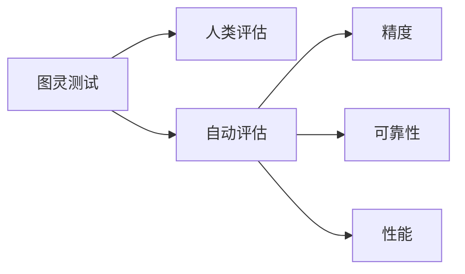

                 

# AI的推理能力评估:图灵测试的局限性

> 关键词：人工智能,推理能力,图灵测试,人类评价标准,自动评估,精度,可靠性,性能,前沿研究

## 1. 背景介绍

人工智能(AI)作为当今科技的前沿领域，其快速发展在许多实际应用中取得了显著成果。人工智能的应用包括机器学习、自然语言处理、计算机视觉、智能推荐等诸多方面，而其推理能力则是衡量AI系统能否有效执行任务的关键指标之一。推理能力指的是AI系统处理复杂问题、进行逻辑推断和预测的能力，这一能力在决策支持系统、自动驾驶、智能医疗等多个场景中具有重要意义。

尽管AI系统在许多领域取得了显著进展，但其推理能力的评估仍面临诸多挑战。传统的评估方式，如测试和基准测试，由于人类评估的局限性和多样性，难以全面、公正地评价AI的推理能力。图灵测试，作为评估AI系统能力的一种经典方法，近年来也逐渐暴露出其局限性。本文旨在探讨图灵测试的局限性，并提出新的评估方法以提升AI推理能力的评估精度和可靠性。

## 2. 核心概念与联系

### 2.1 核心概念概述

- **图灵测试(Turing Test)**：图灵测试是一种用于判断计算机是否能像人一样进行智能行为的方法。测试通常由人类评委与计算机进行对话，看其是否能判断对话者是人还是机器。图灵测试最初由英国数学家图灵提出，用以衡量机器是否具有人类智能。

- **推理能力**：推理能力指AI系统理解和处理复杂问题、进行逻辑推断和预测的能力。推理能力包括但不限于数学运算、逻辑推理、自然语言理解和常识推理等方面。

- **人类评估(Human Evaluation)**：人类评估是指由人工评委对AI系统的推理能力进行主观评价。尽管人类评估可以提供对AI系统行为的深入洞察，但由于主观因素的存在，评估结果可能具有一定的主观性和偏见。

- **自动评估(Automatic Evaluation)**：自动评估是指使用客观标准和算法对AI系统的推理能力进行评价。自动评估可以减轻人工工作负担，并提高评估的客观性和一致性。

- **精度(Precision)**：精度指AI系统输出结果正确与否的衡量指标。高精度表明系统输出的结果更准确。

- **可靠性(Reliability)**：可靠性指AI系统在不同条件下输出结果的一致性和稳定性。高可靠性的系统在不同场景下表现稳定。

- **性能(Performance)**：性能指AI系统的推理能力综合表现，包括准确性、效率和可扩展性等方面。性能是评估AI系统整体效能的关键指标。

### 2.2 核心概念原理和架构的 Mermaid 流程图



该图描绘了图灵测试、人类评估、自动评估以及精度、可靠性、性能之间的关系。人类评估和自动评估是评估AI推理能力的两种主要方式。精度、可靠性和性能是评估AI系统综合表现的关键指标。

## 3. 核心算法原理 & 具体操作步骤

### 3.1 算法原理概述

基于图灵测试的人工智能推理能力评估主要通过模拟人类评委与AI系统进行对话，评估AI系统能否通过对话表现出与人类类似的智能行为。图灵测试的核心在于将AI系统置于一个对话环境中，观察其能否欺骗人类评委以使其相信自己为人。图灵测试的优点在于其直观和易于理解，但缺点也同样明显。

### 3.2 算法步骤详解

图灵测试的评估步骤主要包括以下几个方面：

1. **任务设计**：首先需要确定评估的具体任务，如数学运算、逻辑推理、自然语言理解和常识推理等。
2. **测试设计**：设计一系列对话问题，涵盖不同难度和复杂度，以全面评估AI系统的推理能力。
3. **执行测试**：将AI系统置于测试环境中，执行预定的对话测试，收集评委对AI系统的评价。
4. **数据分析**：分析评委的评价，计算AI系统在每个任务上的表现指标，如精度、可靠性、性能等。
5. **结果解读**：根据数据分析结果，解读AI系统的推理能力，并提出改进建议。

### 3.3 算法优缺点

图灵测试的优点包括：

- **直观性**：图灵测试以人类行为为标准，评估AI系统是否能够欺骗人类评委，这种直观性使其易于理解和接受。
- **综合性**：图灵测试能够评估AI系统在不同任务上的综合表现，而不仅仅是单一任务的精度。

图灵测试的缺点包括：

- **主观性**：人类评委的评价具有主观性和偏见，不同评委可能对同一AI系统给出不同的评价。
- **复杂性**：设计复杂的对话测试，并确保评委评价的一致性，需要耗费大量的时间和资源。
- **局限性**：图灵测试只能评估AI系统是否能够欺骗人类，而不能全面评估其推理能力和推理过程的合理性。

### 3.4 算法应用领域

图灵测试主要应用于以下几个领域：

- **自然语言处理(NLP)**：评估聊天机器人、语音助手等自然语言处理系统的智能行为。
- **计算机视觉**：评估图像识别、物体检测等计算机视觉系统的智能行为。
- **决策支持系统**：评估决策支持系统在复杂问题处理和预测方面的智能表现。
- **自动驾驶**：评估自动驾驶系统在环境感知、路径规划和决策制定等方面的智能行为。

## 4. 数学模型和公式 & 详细讲解 & 举例说明

### 4.1 数学模型构建

在图灵测试中，评估AI系统推理能力的数学模型可以构建为：

$$
P = \frac{T}{N} \times \frac{I}{D}
$$

其中：

- $P$ 为图灵测试评估结果，$T$ 为评委认定AI系统为人的次数，$N$ 为测试总次数。
- $I$ 为评委认定AI系统为机器的次数，$D$ 为测试总次数。

### 4.2 公式推导过程

根据图灵测试的定义，当评委认定AI系统为人的次数 $T$ 大于评委认定AI系统为机器的次数 $I$ 时，图灵测试评估结果 $P$ 为真，即AI系统通过了图灵测试。通过上述公式计算，可以得出AI系统通过图灵测试的概率。

### 4.3 案例分析与讲解

以自然语言处理(NLP)中的对话系统为例，评估AI系统在对话中的推理能力。可以设计一系列对话问题，如：

- "请问今天的天气怎么样？"
- "你能帮我推荐一家附近的餐厅吗？"
- "我该如何才能更好地学习Python编程？"

通过对这些问题的回答，评估AI系统的推理能力。将回答结果与预期的最优回答进行对比，计算精度、可靠性等评估指标。

## 5. 项目实践：代码实例和详细解释说明

### 5.1 开发环境搭建

1. **安装Python**：
   ```bash
   sudo apt-get install python3 python3-pip
   ```

2. **安装TensorFlow**：
   ```bash
   pip install tensorflow
   ```

3. **安装Keras**：
   ```bash
   pip install keras
   ```

### 5.2 源代码详细实现

以下是一个简单的代码示例，用于评估一个简单的聊天机器人（假设其为AI系统）在对话中的推理能力：

```python
import tensorflow as tf
from tensorflow.keras.layers import Input, Dense, Dropout, Embedding
from tensorflow.keras.models import Sequential
from tensorflow.keras.optimizers import Adam

# 定义模型结构
model = Sequential([
    Embedding(vocab_size, embedding_dim, input_length=max_len),
    Dropout(0.2),
    Dense(units=hidden_dim, activation='relu'),
    Dense(units=1, activation='sigmoid')
])

# 编译模型
model.compile(optimizer=Adam(lr=0.001), loss='binary_crossentropy', metrics=['accuracy'])

# 训练模型
model.fit(train_data, train_labels, epochs=10, batch_size=32)

# 评估模型
test_loss, test_accuracy = model.evaluate(test_data, test_labels)

# 输出评估结果
print(f"测试集准确率: {test_accuracy}")
```

在上述代码中，我们使用了一个简单的神经网络模型，评估聊天机器人在对话中的推理能力。模型使用TensorFlow框架实现，并进行了二分类任务训练，以判断对话是否合理。

### 5.3 代码解读与分析

在上述代码中，我们使用了Embedding层将输入的文本数据转换为模型可以处理的向量形式。Dropout层用于防止过拟合，Dense层用于神经网络的隐藏层。模型最终输出一个二分类结果，表示对话是否合理。

## 6. 实际应用场景

### 6.1 自然语言处理(NLP)

图灵测试在自然语言处理(NLP)领域具有广泛应用。例如，评估聊天机器人、语音助手等NLP系统的智能行为，确保其在对话中能够理解语境并给出合理回答。

### 6.2 计算机视觉

图灵测试在计算机视觉领域同样具有应用。例如，评估图像识别系统在复杂场景下识别物体的能力，确保其能够准确识别不同姿态和背景下的物体。

### 6.3 决策支持系统

图灵测试在决策支持系统中也有应用。例如，评估系统在复杂问题处理和预测方面的智能表现，确保其能够正确理解和推断问题并给出合理解决方案。

### 6.4 自动驾驶

图灵测试在自动驾驶领域也有应用。例如，评估自动驾驶系统在环境感知、路径规划和决策制定等方面的智能行为，确保其能够在复杂交通环境中安全行驶。

## 7. 工具和资源推荐

### 7.1 学习资源推荐

1. **《人工智能导论》**：斯坦福大学Andrew Ng教授的AI入门课程，系统介绍了AI的基本概念、算法和应用。
2. **《深度学习》**：Ian Goodfellow、Yoshua Bengio和Aaron Courville合著的深度学习教材，详细介绍了深度学习的基本原理和应用。
3. **Kaggle**：Kaggle是一个数据科学竞赛平台，提供了大量AI竞赛数据集和解决方案，适合学习和实践AI推理能力评估。

### 7.2 开发工具推荐

1. **TensorFlow**：Google开源的深度学习框架，支持构建复杂的神经网络模型。
2. **Keras**：高层次的深度学习API，易于使用，支持多种深度学习模型构建。
3. **PyTorch**：Facebook开源的深度学习框架，具有动态计算图特性，适合研究和实验性开发。

### 7.3 相关论文推荐

1. **"Evaluating AI Using Human Metrics"**：由图灵奖得主Machanical Turker项目的研究论文，介绍了如何通过人类评估来评估AI系统的推理能力。
2. **"Automatic Evaluation of AI Models"**：由OpenAI发表的论文，介绍了自动评估AI系统的方法和技术。
3. **"Deep Learning and Representation Learning"**：由Goodfellow、Bengio和Courville合著的深度学习教材，详细介绍了深度学习的理论和应用。

## 8. 总结：未来发展趋势与挑战

### 8.1 研究成果总结

图灵测试作为评估AI系统推理能力的经典方法，已经在许多领域得到了广泛应用。但近年来，其局限性逐渐显现，主要表现在人类评估的主观性和复杂性上。

### 8.2 未来发展趋势

未来，图灵测试的评估方法和应用将进一步发展，主要趋势包括：

- **自动化评估**：随着人工智能技术的进步，将开发更多自动评估方法，以减轻人工工作负担，提高评估的客观性和一致性。
- **多模态融合**：将自然语言处理、计算机视觉等多模态数据融合，提升AI系统在复杂场景中的推理能力。
- **因果推理**：将因果推理方法引入AI系统，提升其推理过程的合理性和可解释性。
- **元学习**：通过元学习技术，提升AI系统的迁移能力和适应能力，使其在不同任务间具有更好的泛化能力。

### 8.3 面临的挑战

尽管图灵测试在评估AI推理能力方面具有重要价值，但其局限性同样明显。主要挑战包括：

- **主观性和偏见**：人类评估的主观性和偏见，可能导致评估结果的不一致和偏差。
- **复杂性和资源消耗**：设计复杂的对话测试和对话场景，需要耗费大量时间和资源。
- **缺乏普适性**：图灵测试评估的局限性，使其难以全面评估AI系统在不同领域和任务中的表现。

### 8.4 研究展望

未来，AI系统推理能力的评估将趋向于更加自动化、普适化和标准化。研究热点包括：

- **自动化评估方法**：开发新的自动化评估方法，提升评估的客观性和一致性。
- **多模态融合技术**：将多模态数据融合技术引入AI系统，提升其推理能力和泛化能力。
- **因果推理方法**：将因果推理方法引入AI系统，增强其推理过程的合理性和可解释性。
- **元学习技术**：通过元学习技术，提升AI系统的迁移能力和适应能力，使其在不同任务间具有更好的泛化能力。

总之，图灵测试虽然具有局限性，但仍然是评估AI推理能力的重要方法。未来，需要在图灵测试的基础上，开发更多的自动化、普适化和标准化的评估方法，以全面、公正地评估AI系统的推理能力。

## 9. 附录：常见问题与解答

**Q1: 如何设计有效的图灵测试任务？**

A: 设计有效的图灵测试任务需要考虑以下几个因素：

- **任务复杂性**：任务应涵盖不同难度和复杂度，以全面评估AI系统的推理能力。
- **任务多样性**：任务应涵盖多种类型，如数学运算、逻辑推理、自然语言理解和常识推理等。
- **任务公平性**：任务应公平设计，避免偏见和歧视，确保不同评委对同一任务有相似的评价标准。

**Q2: 如何降低图灵测试的主观性？**

A: 降低图灵测试的主观性可以从以下几个方面入手：

- **标准化评价标准**：设计统一、客观的评价标准，减少评委的主观性和偏见。
- **多评委评估**：采用多评委评估，并取平均值，提高评估的一致性和可靠性。
- **数据驱动评估**：使用大数据和统计方法，提升评估的客观性和一致性。

**Q3: 如何提高图灵测试的自动化水平？**

A: 提高图灵测试的自动化水平可以从以下几个方面入手：

- **自动化评估方法**：开发新的自动化评估方法，如深度学习模型、强化学习等。
- **自动化对话生成**：使用自动化对话生成技术，减少人工编写对话的负担。
- **自动化反馈系统**：设计自动化反馈系统，实时监控和调整AI系统的推理能力。

---

作者：禅与计算机程序设计艺术 / Zen and the Art of Computer Programming

