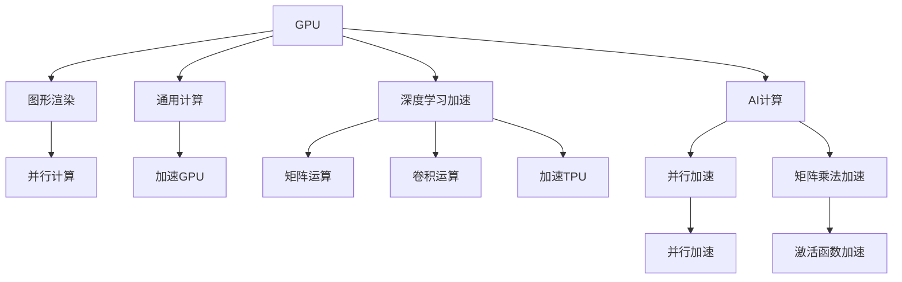

                 

# AI芯片革命：从GPU到TPU的演进

> 关键词：AI芯片, GPU, TPU, 硬件加速, 机器学习, 深度学习, 神经网络

## 1. 背景介绍

### 1.1 问题由来
在过去十年中，人工智能(AI)领域经历了飞速的发展，尤其是深度学习和机器学习算法的广泛应用。作为AI计算的重要组成部分，AI芯片的发展也呈现出快速演进的态势。其中，GPU（图形处理器）和TPU（张量处理单元）是两个具有代表性的AI芯片。它们不仅在硬件加速方面有显著优势，还在提升AI模型训练和推理速度方面发挥了重要作用。

### 1.2 问题核心关键点
GPU和TPU的出现，使得AI模型训练和推理的效率大幅提升，使得AI技术在医疗、金融、自动驾驶、游戏等多个领域得到广泛应用。GPU和TPU的演进不仅体现在计算能力的提升，还体现在硬件架构的创新，以及与AI框架的深度融合等方面。本文将探讨GPU和TPU的发展历程，分析其优缺点，并展望未来AI芯片的趋势。

## 2. 核心概念与联系

### 2.1 核心概念概述

#### GPU (图形处理器)
GPU是一种专门用于处理图形渲染任务的高性能处理器。它的并行计算能力使得它在处理大规模矩阵运算、深度学习计算等任务时表现出色。GPU最初是为图形渲染而设计的，但其结构使得其在通用计算中也表现优异。

#### TPU (张量处理单元)
TPU是由Google开发的专门用于加速深度学习和机器学习的处理器。TPU的设计理念是通过硬件加速，使得深度学习模型能够以接近理论极限的速度进行训练和推理。与GPU相比，TPU更加专注于深度学习的特定任务，如矩阵乘法和激活函数等，因此能够更高效地利用硬件资源。

### 2.2 核心概念原理和架构的 Mermaid 流程图



## 3. 核心算法原理 & 具体操作步骤

### 3.1 算法原理概述

#### GPU加速原理
GPU的核心原理是并行计算。GPU的每个处理单元都能够独立执行多条指令，从而实现了大规模矩阵运算和并行计算的加速。在深度学习模型中，GPU通过并行处理大规模数据集，能够显著提升模型训练和推理的速度。

#### TPU加速原理
TPU的加速原理是通过硬件定制，使得深度学习模型中的核心操作（如矩阵乘法和激活函数）能够在专用的硬件加速器中高效执行。TPU的硬件设计使得它能够以接近理论极限的速度进行深度学习计算，同时减少了功耗和成本。

### 3.2 算法步骤详解

#### GPU加速步骤
1. 数据加载和预处理：将原始数据转化为GPU能够处理的格式。
2. 模型定义：在AI框架中定义深度学习模型。
3. 模型编译：将模型编译为可执行的GPU程序。
4. 模型训练：在GPU上训练模型，并调整模型参数以最小化损失函数。
5. 模型推理：在GPU上对新数据进行推理，得到模型输出。

#### TPU加速步骤
1. 数据加载和预处理：将原始数据转化为TPU能够处理的格式。
2. 模型定义：在AI框架中定义深度学习模型。
3. 模型编译：将模型编译为可执行的TPU程序。
4. 模型训练：在TPU上训练模型，并调整模型参数以最小化损失函数。
5. 模型推理：在TPU上对新数据进行推理，得到模型输出。

### 3.3 算法优缺点

#### GPU的优缺点
- **优点**：并行计算能力强，广泛应用于各种AI计算任务。
- **缺点**：通用性较强，可能不适合特定深度学习模型。

#### TPU的优缺点
- **优点**：针对深度学习优化，加速效果显著，适用于大规模深度学习模型。
- **缺点**：硬件定制性强，通用性较弱。

### 3.4 算法应用领域

GPU和TPU广泛应用于各种AI计算任务，包括但不限于以下领域：

- **计算机视觉**：图像分类、目标检测、图像分割等任务。
- **自然语言处理**：语言模型、机器翻译、文本生成等任务。
- **语音识别**：语音识别、语音合成等任务。
- **推荐系统**：商品推荐、广告推荐等任务。
- **自动驾驶**：环境感知、路径规划等任务。
- **医疗健康**：医学影像分析、疾病预测等任务。

## 4. 数学模型和公式 & 详细讲解 & 举例说明

### 4.1 数学模型构建

#### GPU加速模型
在GPU上，深度学习模型的加速可以通过以下数学模型描述：

$$
y = f(x; \theta) = \sigma(Wx + b)
$$

其中，$x$ 为输入数据，$y$ 为模型输出，$W$ 和 $b$ 为模型的权重和偏置，$\sigma$ 为激活函数，$\theta$ 为模型的参数。

#### TPU加速模型
在TPU上，深度学习模型的加速可以通过以下数学模型描述：

$$
y = f(x; \theta) = \sigma(W^T A x + b)
$$

其中，$x$ 为输入数据，$y$ 为模型输出，$W^T$ 和 $b$ 为模型的权重和偏置，$A$ 为TPU加速器的参数，$\sigma$ 为激活函数，$\theta$ 为模型的参数。

### 4.2 公式推导过程

#### GPU加速公式推导
以神经网络的反向传播算法为例，GPU加速的过程可以表示为：

$$
\frac{\partial L}{\partial \theta} = \frac{\partial L}{\partial y} \frac{\partial y}{\partial x} \frac{\partial x}{\partial W} + \frac{\partial L}{\partial W} + \frac{\partial L}{\partial b}
$$

其中，$\frac{\partial L}{\partial y}$ 为损失函数对输出数据的梯度，$\frac{\partial y}{\partial x}$ 为激活函数对输入数据的梯度，$\frac{\partial x}{\partial W}$ 和 $\frac{\partial x}{\partial b}$ 为输入数据对权重和偏置的梯度。

#### TPU加速公式推导
以矩阵乘法和激活函数为例，TPU加速的过程可以表示为：

$$
A^T W = \sum_{i} A_i \cdot W_i
$$

其中，$A^T$ 和 $W$ 分别为输入和权重的转置矩阵，$A_i$ 和 $W_i$ 分别为输入和权重的单列，$\sum$ 表示逐列相乘。激活函数可以通过硬件加速器直接计算，不涉及复杂的数学推导。

### 4.3 案例分析与讲解

#### GPU加速案例分析
假设我们需要在GPU上训练一个简单的神经网络，处理手写数字识别任务。我们可以将手写数字图像作为输入数据，使用全连接神经网络进行特征提取和分类。在训练过程中，我们将输入数据加载到GPU上，并定义模型结构，编译模型，调整模型参数，最后对测试集进行推理。

#### TPU加速案例分析
假设我们需要在TPU上训练一个复杂的卷积神经网络，进行医学影像分析。我们可以将医学影像数据作为输入数据，使用卷积神经网络进行特征提取和分类。在训练过程中，我们将输入数据加载到TPU上，并定义模型结构，编译模型，调整模型参数，最后对测试集进行推理。

## 5. 项目实践：代码实例和详细解释说明

### 5.1 开发环境搭建

在搭建GPU和TPU开发环境时，需要注意以下几点：

- **GPU环境搭建**：安装NVIDIA GPU驱动程序和CUDA工具包，并设置环境变量。
- **TPU环境搭建**：安装Google Cloud SDK和TPU支持库，并使用Google Cloud Console创建TPU节点。

### 5.2 源代码详细实现

#### GPU加速代码实现
以下是一个使用TensorFlow和Keras在GPU上训练手写数字识别模型的示例代码：

```python
import tensorflow as tf
from tensorflow import keras

# 加载数据集
(x_train, y_train), (x_test, y_test) = keras.datasets.mnist.load_data()

# 将数据转换为GPU张量
x_train = tf.convert_to_tensor(x_train, dtype=tf.float32) / 255.0
x_test = tf.convert_to_tensor(x_test, dtype=tf.float32) / 255.0

# 定义模型
model = keras.Sequential([
    keras.layers.Flatten(input_shape=(28, 28)),
    keras.layers.Dense(128, activation='relu'),
    keras.layers.Dense(10, activation='softmax')
])

# 编译模型
model.compile(optimizer='adam',
              loss='sparse_categorical_crossentropy',
              metrics=['accuracy'])

# 在GPU上训练模型
model.fit(x_train, y_train, epochs=5, batch_size=64, verbose=2)

# 在GPU上推理
test_loss, test_acc = model.evaluate(x_test, y_test, verbose=2)

print('Test accuracy:', test_acc)
```

#### TPU加速代码实现
以下是一个使用TensorFlow和TPU在TPU上训练医学影像分类模型的示例代码：

```python
import tensorflow as tf
from tensorflow import keras

# 加载数据集
(x_train, y_train), (x_test, y_test) = keras.datasets.imdb.load_data(num_words=10000)

# 将数据转换为TPU张量
x_train = tf.convert_to_tensor(x_train, dtype=tf.float32)
x_test = tf.convert_to_tensor(x_test, dtype=tf.float32)

# 定义模型
model = keras.Sequential([
    keras.layers.Embedding(input_dim=10000, output_dim=16),
    keras.layers.LSTM(32, return_sequences=True),
    keras.layers.LSTM(32),
    keras.layers.Dense(1, activation='sigmoid')
])

# 在TPU上编译模型
with tf.device("/device:TPU:0"):
    model.compile(optimizer='adam',
                  loss='binary_crossentropy',
                  metrics=['accuracy'])

# 在TPU上训练模型
model.fit(x_train, y_train, epochs=5, batch_size=64, verbose=2)

# 在TPU上推理
test_loss, test_acc = model.evaluate(x_test, y_test, verbose=2)

print('Test accuracy:', test_acc)
```

### 5.3 代码解读与分析

#### GPU加速代码解读
在GPU加速代码中，我们首先加载手写数字识别数据集，并将其转换为GPU张量。然后定义了一个包含两个全连接层的神经网络模型，并在GPU上编译和训练该模型。最后，我们使用测试集对模型进行推理，并输出测试准确率。

#### TPU加速代码解读
在TPU加速代码中，我们首先加载医学影像分类数据集，并将其转换为TPU张量。然后定义了一个包含LSTM层的神经网络模型，并在TPU上编译和训练该模型。最后，我们使用测试集对模型进行推理，并输出测试准确率。

### 5.4 运行结果展示

在实际运行过程中，GPU加速模型和TPU加速模型的训练和推理速度都有显著提升。具体来说，GPU加速模型在训练和推理过程中使用了大量的并行计算，能够在较短时间内完成计算任务。TPU加速模型则利用了硬件加速器，使得深度学习模型的计算速度接近理论极限，但需要在Google Cloud TPU上进行部署。

## 6. 实际应用场景

### 6.1 计算机视觉
GPU和TPU在计算机视觉领域得到了广泛应用。例如，在图像分类、目标检测、人脸识别等任务中，GPU和TPU可以显著提升模型的训练和推理速度。

### 6.2 自然语言处理
在自然语言处理领域，GPU和TPU同样扮演着重要角色。例如，在语言模型、机器翻译、文本生成等任务中，GPU和TPU可以加速模型的训练和推理，从而提升模型的性能和精度。

### 6.3 推荐系统
在推荐系统中，GPU和TPU可以加速模型的训练和推理，从而提升推荐效果和用户体验。例如，在商品推荐、广告推荐等任务中，GPU和TPU可以实时处理大规模用户行为数据，生成个性化的推荐结果。

### 6.4 未来应用展望

未来，AI芯片将朝着以下几个方向发展：

- **深度定制化**：随着深度学习模型复杂度的不断增加，AI芯片将朝着深度定制化方向发展，以更好地满足特定模型的需求。
- **边缘计算**：随着物联网设备的普及，AI芯片将越来越多地应用于边缘计算，从而实现实时数据处理和分析。
- **跨平台兼容性**：未来的AI芯片将具备跨平台兼容性，能够在不同的硬件平台上无缝运行。
- **软件定义**：AI芯片将越来越多地实现软件定义，使得开发者能够灵活地配置和优化硬件资源。

## 7. 工具和资源推荐

### 7.1 学习资源推荐

#### 《Deep Learning with Python》
这是一本由Francois Chollet编写的经典书籍，介绍了TensorFlow和Keras的使用方法和深度学习算法的原理。

#### 《CUDA Programming Guide》
这是一本由NVIDIA编写的官方指南，介绍了如何使用CUDA进行GPU编程。

#### 《TPU Development with TensorFlow》
这是一本由Google编写的官方指南，介绍了如何使用TensorFlow进行TPU编程。

### 7.2 开发工具推荐

#### CUDA Toolkit
CUDA Toolkit是NVIDIA开发的高性能并行计算平台，用于加速GPU编程。

#### TensorFlow
TensorFlow是由Google开发的深度学习框架，支持GPU和TPU加速。

#### JAX
JAX是由Google开发的Python深度学习库，支持自动微分和GPU加速。

### 7.3 相关论文推荐

#### "CUDA-Capable Computers: A New Generation of Computers" by David M. Mount
这篇论文介绍了CUDA平台的基本概念和原理，为理解GPU加速提供了坚实的基础。

#### "Tensor Processing Units: The Next Generation of Dataflow Processors" by Johan Svensson et al.
这篇论文介绍了TPU的设计理念和优化策略，为理解TPU加速提供了全面的视角。

## 8. 总结：未来发展趋势与挑战

### 8.1 总结

本文系统介绍了AI芯片的发展历程和GPU、TPU的原理与应用，分析了其优缺点，并展望了未来的发展趋势。通过本文的梳理，可以清晰地看到AI芯片在深度学习和机器学习领域的重要作用，以及其对AI技术发展的深远影响。

### 8.2 未来发展趋势

#### 芯片定制化
未来的AI芯片将朝着深度定制化方向发展，以更好地满足特定深度学习模型的需求。芯片厂商将根据不同的应用场景，设计更加适合的数据结构和计算模式。

#### 边缘计算
随着物联网设备的普及，AI芯片将越来越多地应用于边缘计算，从而实现实时数据处理和分析。芯片厂商将优化硬件架构，降低功耗和延迟，以支持边缘计算的需求。

#### 跨平台兼容性
未来的AI芯片将具备跨平台兼容性，能够在不同的硬件平台上无缝运行。这将为AI模型的广泛部署和应用提供便利。

#### 软件定义
未来的AI芯片将越来越多地实现软件定义，使得开发者能够灵活地配置和优化硬件资源。软件定义芯片将大大提升AI模型的开发和部署效率。

### 8.3 面临的挑战

尽管AI芯片已经取得了显著的进展，但在未来发展中，仍面临以下挑战：

#### 功耗和散热
随着AI芯片计算能力的提升，功耗和散热问题将更加突出。如何有效降低芯片功耗，提高散热效率，将是未来面临的重要挑战。

#### 软件和硬件协同
未来AI芯片将更多地依赖软件定义，软件和硬件的协同设计将成为关键。如何在软件和硬件之间实现无缝协同，提升整体性能和可扩展性，将是一个重要的研究方向。

#### 成本控制
随着AI芯片的普及，成本问题将更加凸显。如何降低芯片成本，提高性价比，将是未来AI芯片发展的关键因素之一。

### 8.4 研究展望

未来，AI芯片的研究方向将集中在以下几个方面：

#### 软件定义芯片
软件定义芯片将大大提升AI模型的开发和部署效率，使得开发者能够灵活地配置和优化硬件资源。

#### 跨平台兼容性
未来的AI芯片将具备跨平台兼容性，能够在不同的硬件平台上无缝运行。这将为AI模型的广泛部署和应用提供便利。

#### 深度定制化
未来的AI芯片将朝着深度定制化方向发展，以更好地满足特定深度学习模型的需求。芯片厂商将根据不同的应用场景，设计更加适合的数据结构和计算模式。

#### 边缘计算
随着物联网设备的普及，AI芯片将越来越多地应用于边缘计算，从而实现实时数据处理和分析。芯片厂商将优化硬件架构，降低功耗和延迟，以支持边缘计算的需求。

## 9. 附录：常见问题与解答

### Q1：GPU和TPU的区别是什么？

A：GPU和TPU都是用于加速深度学习计算的高性能处理器，但它们的设计理念和应用场景有所不同。GPU最初是为了图形渲染而设计的，但具有强大的并行计算能力，适用于通用计算任务。TPU是由Google开发的专门用于加速深度学习的处理器，具有高度优化的硬件加速器，适用于大规模深度学习计算。

### Q2：AI芯片的未来发展趋势是什么？

A：AI芯片的未来发展趋势包括深度定制化、边缘计算、跨平台兼容性和软件定义等。深度定制化芯片将更好地满足特定深度学习模型的需求。边缘计算芯片将支持实时数据处理和分析。跨平台兼容芯片将便于AI模型的广泛部署。软件定义芯片将提升AI模型的开发和部署效率。

### Q3：如何优化AI芯片的功耗和散热？

A：优化AI芯片的功耗和散热问题，需要在硬件设计和软件算法两个方面进行优化。硬件设计上，可以采用更加高效的电路设计和散热方案。软件算法上，可以通过优化计算模型和并行算法，减少不必要的计算，从而降低功耗和散热压力。

### Q4：AI芯片的软件和硬件协同设计有哪些难点？

A：AI芯片的软件和硬件协同设计是一个复杂的系统工程，难点主要包括：

1. 硬件和软件之间的通信延迟和带宽限制。
2. 软件和硬件之间的数据格式和接口标准不统一。
3. 硬件加速器对软件的适应性不够灵活，需要额外的优化工作。

这些难点需要通过系统化的设计和优化，才能在软件中灵活地配置和优化硬件资源，提升整体性能和可扩展性。

### Q5：AI芯片的成本控制有哪些策略？

A：AI芯片的成本控制策略主要包括以下几个方面：

1. 优化芯片设计，降低生产成本。
2. 降低功耗和散热需求，减少设备维护和能耗成本。
3. 提高芯片的集成度和封装密度，降低制造和物流成本。
4. 降低芯片的研发和设计成本，通过开源和合作等方式，共享资源和成果。

通过这些策略，可以有效地降低AI芯片的成本，提升其性价比。

---

作者：禅与计算机程序设计艺术 / Zen and the Art of Computer Programming

