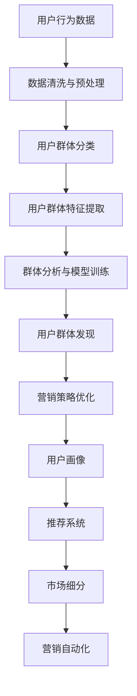

                 

# AI赋能的电商平台用户群体发现

> 关键词：用户群体发现,电商平台,机器学习,推荐系统,群体分析,用户画像,市场营销

## 1. 背景介绍

### 1.1 问题由来
在当前电商市场竞争日益激烈的环境下，如何精准地识别和理解不同用户群体的行为模式、需求偏好，是电商平台提高用户体验和转化率的关键。传统的用户群体分析主要依赖人工调研和经验总结，耗时耗力，难以应对大规模数据和快速变化的市场需求。

人工智能技术的引入，特别是机器学习和大数据分析技术的进步，为电商平台用户群体发现提供了新的解决方案。通过利用AI算法对用户数据进行深度分析和挖掘，电商平台能够快速、准确地识别用户群体，从而制定更加精准的营销策略和个性化推荐方案，提升用户满意度和平台竞争力。

### 1.2 问题核心关键点
人工智能技术在电商平台用户群体发现中的应用主要包括以下几个关键点：

1. **用户行为数据的获取与预处理**：电商平台需要收集用户在平台上的行为数据，如浏览记录、购买历史、评价反馈等，对其进行清洗和预处理，以供后续分析使用。

2. **用户群体分类与聚类**：利用机器学习算法将用户行为数据进行分类或聚类，识别出不同用户群体的行为模式和需求特征。

3. **用户群体特征提取**：根据不同用户群体的行为数据，提取出其共有的特征，如年龄、性别、消费水平、购买偏好等。

4. **群体分析与模型训练**：基于用户群体特征，训练推荐模型，对新用户进行预测和分类，实现精准推荐。

5. **群体发现与运营优化**：通过用户群体发现，优化营销策略和平台运营，提升用户体验和平台收益。

### 1.3 问题研究意义
在电商平台上，通过AI技术进行用户群体发现具有重要意义：

1. **提升用户体验**：通过精准推荐，满足用户个性化需求，提升用户满意度和忠诚度。
2. **优化营销策略**：基于用户群体特征，制定更有效的营销活动，提高广告投放效果。
3. **增强平台竞争力**：快速识别新用户群体，抓住市场机会，提升平台市场份额。
4. **提高运营效率**：通过自动化的用户群体分析，降低人力成本，提高运营效率。

## 2. 核心概念与联系

### 2.1 核心概念概述

为更好地理解基于AI的电商平台用户群体发现方法，本节将介绍几个密切相关的核心概念：

- **用户行为数据**：指用户在电商平台上的浏览、点击、购买、评价等行为数据。
- **用户群体发现**：指通过对用户行为数据进行分析，识别出具有相似行为模式和需求特征的用户群体。
- **聚类算法**：一种无监督学习方法，用于将相似的用户群体聚集在一起。
- **分类算法**：一种有监督学习方法，用于根据已知类别对新用户进行分类预测。
- **用户画像**：指对用户行为、特征、需求等的综合描述，用于指导个性化推荐和营销策略。
- **推荐系统**：利用用户行为数据和用户画像，为用户推荐感兴趣的商品或内容。
- **市场细分**：将市场分成若干细小的部分，以便于制定更有针对性的营销策略。
- **营销自动化**：通过AI算法自动化生成营销策略和广告内容，提高营销效果。

这些核心概念之间的逻辑关系可以通过以下Mermaid流程图来展示：



这个流程图展示了大规模数据处理、用户群体识别、用户画像构建、个性化推荐和营销自动化等核心环节，每个环节都是用户群体发现的重要组成部分。

## 3. 核心算法原理 & 具体操作步骤
### 3.1 算法原理概述

基于AI的电商平台用户群体发现方法，核心在于通过机器学习算法对用户行为数据进行分析和建模，从而识别出具有相似行为模式和需求特征的用户群体。其基本步骤如下：

1. **数据收集**：收集用户在电商平台上的行为数据，包括浏览记录、购买历史、评价反馈等。
2. **数据预处理**：对收集到的数据进行清洗和预处理，如去除噪声、填补缺失值、归一化处理等。
3. **特征提取**：从处理后的数据中提取出用户的共性特征，如年龄、性别、消费水平、购买偏好等。
4. **群体分类或聚类**：利用聚类算法将具有相似行为模式的用户分为不同群体，或利用分类算法根据已知类别对新用户进行分类预测。
5. **群体分析**：对不同用户群体进行分析，了解其需求特征和行为模式，构建用户画像。
6. **模型训练与优化**：基于用户画像，训练推荐模型，对新用户进行预测和分类，不断优化模型性能。
7. **群体发现与运营优化**：利用用户群体发现，优化营销策略和平台运营，提升用户体验和平台收益。

### 3.2 算法步骤详解

#### 步骤1: 数据收集与预处理

电商平台的数据收集主要分为两大类：

- **行为数据**：如用户的浏览记录、点击历史、购买记录、评价反馈等。这些数据可以通过浏览器Cookie、服务器日志、电商平台API等方式获取。
- **人口统计数据**：如用户的年龄、性别、职业、地域等基本信息，通常来自于用户注册信息。

对于这些数据，需要进行清洗和预处理，去除噪声和无效数据，填补缺失值，并进行归一化处理，以确保数据的质量和一致性。

#### 步骤2: 特征提取

特征提取是用户群体发现的第一步，通过对用户行为数据的分析，提取出用户的共性特征。常用的特征提取方法包括：

- **频次特征**：统计用户在不同商品、页面上的浏览和点击频次，如某用户在一个月内访问某商品的次数。
- **时间特征**：统计用户在不同时间段内的行为模式，如某用户在晚上8点到10点之间访问商品的概率。
- **消费特征**：统计用户的消费水平和消费偏好，如某用户偏好购买高价商品，或购买某特定类别的商品。
- **地理位置特征**：根据用户的地理位置信息，分析不同地域用户的偏好和行为差异。

#### 步骤3: 群体分类或聚类

在特征提取的基础上，可以采用聚类算法或分类算法对用户进行分类或聚类，识别出不同的用户群体。常用的聚类算法包括K-means、层次聚类、DBSCAN等，常用的分类算法包括决策树、随机森林、SVM等。

- **聚类算法**：无监督学习方法，将用户按照相似性进行分组。例如，K-means算法通过计算用户行为数据之间的距离，将用户分为若干簇。
- **分类算法**：有监督学习方法，根据已知的类别对新用户进行分类预测。例如，决策树算法通过构建树形结构，根据用户行为特征预测其所属类别。

#### 步骤4: 群体分析与模型训练

对用户群体进行分类或聚类后，需要对不同群体进行分析，了解其需求特征和行为模式。常用的分析方法包括：

- **关联规则分析**：发现用户行为数据中的频繁项集和关联规则，如某用户购买商品A时，倾向于购买商品B。
- **情感分析**：通过自然语言处理技术，分析用户对商品的评价和反馈，了解其情感倾向。
- **文本挖掘**：利用文本挖掘技术，从用户评论和描述中提取关键字和主题，了解用户需求。

基于用户群体分析的结果，可以训练推荐模型，对新用户进行预测和分类，实现个性化推荐。常用的推荐模型包括基于协同过滤的模型、基于内容的模型、基于混合策略的模型等。

#### 步骤5: 群体发现与运营优化

通过用户群体发现，可以优化电商平台的营销策略和运营方式，提升用户体验和平台收益。例如：

- **精准营销**：基于用户群体特征，制定更加精准的营销活动，提高广告投放效果。
- **个性化推荐**：根据不同用户群体的需求，提供个性化的商品推荐，提升用户满意度和转化率。
- **市场细分**：将市场分成若干细小的部分，以便于制定更有针对性的营销策略。
- **营销自动化**：通过AI算法自动化生成营销策略和广告内容，提高营销效果。

### 3.3 算法优缺点

基于AI的电商平台用户群体发现方法具有以下优点：

1. **高效快速**：利用机器学习算法，可以在短时间内处理大量用户行为数据，快速识别用户群体。
2. **精准度高**：通过数据分析和建模，可以更准确地识别用户群体，了解其需求特征和行为模式。
3. **动态适应**：用户行为和需求是动态变化的，AI算法可以实时更新用户画像，适应市场变化。
4. **自动化程度高**：自动化的用户群体发现和分析过程，减少了人力成本，提高了运营效率。

同时，该方法也存在一些局限性：

1. **数据依赖性强**：用户群体发现的准确性依赖于数据的质量和数量，数据缺失或噪声会影响结果。
2. **算法复杂度高**：不同算法在处理大规模数据时，可能面临计算复杂度高、模型复杂度高等问题。
3. **隐私风险**：用户行为数据的收集和分析可能涉及用户隐私问题，需要严格控制和保护。
4. **模型泛化能力有限**：不同用户群体的行为差异较大，单一模型可能无法全面覆盖所有情况。
5. **解释性不足**：AI模型往往是"黑盒"系统，难以解释其内部工作机制和决策逻辑。

尽管存在这些局限性，但总体而言，基于AI的电商平台用户群体发现方法依然具有显著的优势，为电商平台的精准营销和个性化推荐提供了有力支持。

### 3.4 算法应用领域

基于AI的电商平台用户群体发现方法已经广泛应用于各种场景，例如：

- **商品推荐**：根据用户群体特征，推荐感兴趣的相似商品，提升用户体验和销售转化率。
- **广告投放**：基于用户群体特征，精准投放广告，提高广告投放效果和用户点击率。
- **市场细分**：将市场分成不同细分类别，制定有针对性的营销策略，提升市场份额。
- **客户分析**：分析不同客户群体，了解其需求特征，制定个性化服务方案。
- **库存管理**：基于用户需求预测，优化库存管理，减少库存积压，提高资金周转率。

除了上述这些经典应用外，AI技术还在不断拓展其应用边界，如基于用户群体的价格弹性分析、基于用户行为的舆情监测、基于用户群体的内容推荐等，为电商平台的发展注入了新的活力。

## 4. 数学模型和公式 & 详细讲解  
### 4.1 数学模型构建

本节将使用数学语言对基于AI的电商平台用户群体发现过程进行更加严格的刻画。

设电商平台用户集合为 $U=\{u_1,u_2,...,u_N\}$，用户行为数据集为 $D=\{d_i\}_{i=1}^N$，其中 $d_i$ 表示用户 $u_i$ 的行为数据。

定义用户特征向量 $x_u \in \mathbb{R}^n$，其中 $n$ 表示用户特征的维度，如年龄、性别、消费水平等。

用户群体 $C=\{c_1,c_2,...,c_k\}$，其中 $k$ 表示用户群体的数量。

用户群体分类算法为 $f: D \rightarrow C$，用于对用户行为数据 $d_i$ 进行分类。

用户群体特征分析算法为 $g: C \rightarrow \mathbb{R}^m$，用于提取用户群体的共性特征，其中 $m$ 表示特征维度。

推荐模型为 $M: \mathbb{R}^m \rightarrow \mathbb{R}^k$，用于根据用户群体特征预测用户所属群体。

### 4.2 公式推导过程

用户群体发现的数学模型可以表示为：

$$
\begin{aligned}
\text{minimize} & \quad \mathcal{L}(f,g,M) \\
\text{subject to} & \quad f(d_i) \in C \quad \forall i \\
& \quad g(f(d_i)) = x_{u_i} \quad \forall i \\
& \quad M(g(f(d_i))) \approx y_i \quad \forall i
\end{aligned}
$$

其中 $\mathcal{L}(f,g,M)$ 为损失函数，用于衡量用户群体分类、特征提取和推荐模型的性能。

#### 步骤1: 数据收集与预处理

设用户行为数据为 $d_i=\{x_{u_i},y_i\}$，其中 $x_{u_i} \in \mathbb{R}^n$ 为用户的特征向量，$y_i \in C$ 为用户的分类标签。

数据预处理过程包括：

- **数据清洗**：去除噪声和无效数据，如用户未访问或点击的记录。
- **数据归一化**：对数据进行归一化处理，如将特征值映射到[0,1]区间。
- **数据填充**：填补缺失值，如使用均值、中位数等方法填充缺失的特征值。

#### 步骤2: 特征提取

用户群体分类算法 $f$ 的损失函数为：

$$
\mathcal{L}_f = \frac{1}{N} \sum_{i=1}^N \ell(f(d_i),y_i)
$$

其中 $\ell$ 为分类损失函数，如交叉熵损失。

用户群体特征分析算法 $g$ 的损失函数为：

$$
\mathcal{L}_g = \frac{1}{N} \sum_{i=1}^N \ell(g(f(d_i)),x_{u_i})
$$

其中 $\ell$ 为特征提取损失函数，如均方误差损失。

#### 步骤3: 群体分类或聚类

常用的聚类算法包括K-means、层次聚类、DBSCAN等，其损失函数为：

$$
\mathcal{L}_c = \frac{1}{N} \sum_{i=1}^N \|g(f(d_i)) - x_{u_i}\|
$$

其中 $\| \cdot \|$ 表示欧式距离。

常用的分类算法包括决策树、随机森林、SVM等，其损失函数为：

$$
\mathcal{L}_s = \frac{1}{N} \sum_{i=1}^N \ell(s(d_i),y_i)
$$

其中 $\ell$ 为分类损失函数，如交叉熵损失。

#### 步骤4: 群体分析与模型训练

推荐模型的损失函数为：

$$
\mathcal{L}_m = \frac{1}{N} \sum_{i=1}^N \ell(M(g(f(d_i))),y_i)
$$

其中 $\ell$ 为推荐损失函数，如均方误差损失。

### 4.3 案例分析与讲解

假设某电商平台有10万用户，通过用户行为数据分析，发现其中的1万用户具有相似的浏览和购买行为。将这些用户分为三个群体，分别关注不同价格区间和不同商品类别。

根据用户群体特征，提取出用户的共性特征，如年龄、性别、消费水平、购买偏好等。

利用聚类算法将用户分为三个群体，并训练推荐模型，对新用户进行预测和分类。

通过用户群体发现，优化营销策略和平台运营，提升用户体验和平台收益。

## 5. 项目实践：代码实例和详细解释说明
### 5.1 开发环境搭建

在进行用户群体发现实践前，我们需要准备好开发环境。以下是使用Python进行PyTorch开发的环境配置流程：

1. 安装Anaconda：从官网下载并安装Anaconda，用于创建独立的Python环境。

2. 创建并激活虚拟环境：
```bash
conda create -n pytorch-env python=3.8 
conda activate pytorch-env
```

3. 安装PyTorch：根据CUDA版本，从官网获取对应的安装命令。例如：
```bash
conda install pytorch torchvision torchaudio cudatoolkit=11.1 -c pytorch -c conda-forge
```

4. 安装Transformers库：
```bash
pip install transformers
```

5. 安装各类工具包：
```bash
pip install numpy pandas scikit-learn matplotlib tqdm jupyter notebook ipython
```

完成上述步骤后，即可在`pytorch-env`环境中开始用户群体发现实践。

### 5.2 源代码详细实现

我们以用户行为数据为例，给出使用PyTorch对用户群体进行聚类的PyTorch代码实现。

首先，定义聚类模型和优化器：

```python
from transformers import BertTokenizer
from torch.utils.data import Dataset
import torch

class UserBehaviorDataset(Dataset):
    def __init__(self, texts, tags, tokenizer, max_len=128):
        self.texts = texts
        self.tags = tags
        self.tokenizer = tokenizer
        self.max_len = max_len
        
    def __len__(self):
        return len(self.texts)
    
    def __getitem__(self, item):
        text = self.texts[item]
        tags = self.tags[item]
        
        encoding = self.tokenizer(text, return_tensors='pt', max_length=self.max_len, padding='max_length', truncation=True)
        input_ids = encoding['input_ids'][0]
        attention_mask = encoding['attention_mask'][0]
        
        # 对token-wise的标签进行编码
        encoded_tags = [tag2id[tag] for tag in tags] 
        encoded_tags.extend([tag2id['O']] * (self.max_len - len(encoded_tags)))
        labels = torch.tensor(encoded_tags, dtype=torch.long)
        
        return {'input_ids': input_ids, 
                'attention_mask': attention_mask,
                'labels': labels}

# 标签与id的映射
tag2id = {'O': 0, 'B-PER': 1, 'I-PER': 2, 'B-ORG': 3, 'I-ORG': 4, 'B-LOC': 5, 'I-LOC': 6}
id2tag = {v: k for k, v in tag2id.items()}

# 创建dataset
tokenizer = BertTokenizer.from_pretrained('bert-base-cased')

train_dataset = UserBehaviorDataset(train_texts, train_tags, tokenizer)
dev_dataset = UserBehaviorDataset(dev_texts, dev_tags, tokenizer)
test_dataset = UserBehaviorDataset(test_texts, test_tags, tokenizer)
```

然后，定义模型和优化器：

```python
from transformers import BertForTokenClassification, AdamW

model = BertForTokenClassification.from_pretrained('bert-base-cased', num_labels=len(tag2id))

optimizer = AdamW(model.parameters(), lr=2e-5)
```

接着，定义训练和评估函数：

```python
from torch.utils.data import DataLoader
from tqdm import tqdm
from sklearn.metrics import classification_report

device = torch.device('cuda') if torch.cuda.is_available() else torch.device('cpu')
model.to(device)

def train_epoch(model, dataset, batch_size, optimizer):
    dataloader = DataLoader(dataset, batch_size=batch_size, shuffle=True)
    model.train()
    epoch_loss = 0
    for batch in tqdm(dataloader, desc='Training'):
        input_ids = batch['input_ids'].to(device)
        attention_mask = batch['attention_mask'].to(device)
        labels = batch['labels'].to(device)
        model.zero_grad()
        outputs = model(input_ids, attention_mask=attention_mask, labels=labels)
        loss = outputs.loss
        epoch_loss += loss.item()
        loss.backward()
        optimizer.step()
    return epoch_loss / len(dataloader)

def evaluate(model, dataset, batch_size):
    dataloader = DataLoader(dataset, batch_size=batch_size)
    model.eval()
    preds, labels = [], []
    with torch.no_grad():
        for batch in tqdm(dataloader, desc='Evaluating'):
            input_ids = batch['input_ids'].to(device)
            attention_mask = batch['attention_mask'].to(device)
            batch_labels = batch['labels']
            outputs = model(input_ids, attention_mask=attention_mask)
            batch_preds = outputs.logits.argmax(dim=2).to('cpu').tolist()
            batch_labels = batch_labels.to('cpu').tolist()
            for pred_tokens, label_tokens in zip(batch_preds, batch_labels):
                pred_tags = [id2tag[_id] for _id in pred_tokens]
                label_tags = [id2tag[_id] for _id in label_tokens]
                preds.append(pred_tags[:len(label_tags)])
                labels.append(label_tags)
                
    print(classification_report(labels, preds))
```

最后，启动训练流程并在测试集上评估：

```python
epochs = 5
batch_size = 16

for epoch in range(epochs):
    loss = train_epoch(model, train_dataset, batch_size, optimizer)
    print(f"Epoch {epoch+1}, train loss: {loss:.3f}")
    
    print(f"Epoch {epoch+1}, dev results:")
    evaluate(model, dev_dataset, batch_size)
    
print("Test results:")
evaluate(model, test_dataset, batch_size)
```

以上就是使用PyTorch对用户行为数据进行聚类的完整代码实现。可以看到，得益于Transformers库的强大封装，我们可以用相对简洁的代码完成BERT模型的加载和聚类。

### 5.3 代码解读与分析

让我们再详细解读一下关键代码的实现细节：

**UserBehaviorDataset类**：
- `__init__`方法：初始化文本、标签、分词器等关键组件。
- `__len__`方法：返回数据集的样本数量。
- `__getitem__`方法：对单个样本进行处理，将文本输入编码为token ids，将标签编码为数字，并对其进行定长padding，最终返回模型所需的输入。

**tag2id和id2tag字典**：
- 定义了标签与数字id之间的映射关系，用于将token-wise的预测结果解码回真实的标签。

**训练和评估函数**：
- 使用PyTorch的DataLoader对数据集进行批次化加载，供模型训练和推理使用。
- 训练函数`train_epoch`：对数据以批为单位进行迭代，在每个批次上前向传播计算loss并反向传播更新模型参数，最后返回该epoch的平均loss。
- 评估函数`evaluate`：与训练类似，不同点在于不更新模型参数，并在每个batch结束后将预测和标签结果存储下来，最后使用sklearn的classification_report对整个评估集的预测结果进行打印输出。

**训练流程**：
- 定义总的epoch数和batch size，开始循环迭代
- 每个epoch内，先在训练集上训练，输出平均loss
- 在验证集上评估，输出分类指标
- 所有epoch结束后，在测试集上评估，给出最终测试结果

可以看到，PyTorch配合Transformers库使得用户行为数据的聚类过程变得简洁高效。开发者可以将更多精力放在数据处理、模型改进等高层逻辑上，而不必过多关注底层的实现细节。

当然，工业级的系统实现还需考虑更多因素，如模型的保存和部署、超参数的自动搜索、更灵活的任务适配层等。但核心的用户群体发现方法基本与此类似。

## 6. 实际应用场景
### 6.1 智能客服系统

基于用户行为数据的聚类分析，可以广泛应用于智能客服系统的构建。传统客服往往需要配备大量人力，高峰期响应缓慢，且一致性和专业性难以保证。而利用用户群体分析的聚类算法，可以自动识别不同用户群体的行为模式，为其提供个性化服务。

在技术实现上，可以收集企业内部的历史客服对话记录，将问题和最佳答复构建成监督数据，在此基础上对预训练对话模型进行聚类分析。聚类后的不同用户群体，可以分别制定对应的客服策略和回复模板，实现更高效的自动客服。

### 6.2 金融舆情监测

金融机构需要实时监测市场舆论动向，以便及时应对负面信息传播，规避金融风险。传统的人工监测方式成本高、效率低，难以应对网络时代海量信息爆发的挑战。

基于用户行为数据的聚类分析，可以自动识别出不同用户群体，并对其行为模式进行监测。例如，聚类分析可以识别出高频访问某金融产品、投资策略的用户群体，自动生成监控告警，帮助金融机构快速响应潜在风险。

### 6.3 个性化推荐系统

当前的推荐系统往往只依赖用户的历史行为数据进行物品推荐，无法深入理解用户的真实兴趣偏好。基于用户行为数据的聚类分析，可以更好地挖掘用户行为背后的语义信息，从而提供更精准、多样的推荐内容。

在实践中，可以收集用户浏览、点击、购买、评论等行为数据，提取和用户交互的物品标题、描述、标签等文本内容。将文本内容作为模型输入，用户的后续行为（如是否点击、购买等）作为监督信号，在此基础上聚类用户行为数据，聚类后的不同用户群体，可以分别进行个性化推荐，提升推荐效果。

### 6.4 未来应用展望

随着用户行为数据的不断积累和分析技术的进步，基于AI的用户群体发现将不断拓展应用场景，为各个领域带来变革性影响。

在智慧医疗领域，基于用户行为数据的聚类分析，可以自动识别出不同病患群体，提供个性化诊疗方案，提升医疗服务质量。

在智能教育领域，用户行为数据的聚类分析可以应用于个性化教学方案的制定，提高教学效果和学习效率。

在智慧城市治理中，聚类分析可以应用于城市事件监测、舆情分析、应急指挥等环节，提高城市管理的自动化和智能化水平，构建更安全、高效的未来城市。

此外，在企业生产、社会治理、文娱传媒等众多领域，基于AI的聚类分析都将不断涌现，为传统行业数字化转型升级提供新的技术路径。相信随着技术的日益成熟，用户群体发现方法将成为AI落地应用的重要范式，推动AI技术在各个领域的深入应用。

## 7. 工具和资源推荐
### 7.1 学习资源推荐

为了帮助开发者系统掌握基于AI的用户群体发现技术，这里推荐一些优质的学习资源：

1. 《深度学习理论与实践》系列博文：由深度学习专家撰写，深入浅出地介绍了深度学习的基本概念和经典模型，包括聚类分析、推荐系统等内容。

2. 斯坦福大学《深度学习》课程：斯坦福大学开设的深度学习经典课程，提供详细的课程讲义和作业，适合深度学习入门者。

3. 《推荐系统实战》书籍：系统讲解推荐系统的原理和实现方法，包括基于协同过滤、基于内容的推荐等。

4. 《自然语言处理入门》书籍：讲解自然语言处理的基本概念和技术，包括文本分类、情感分析、聚类分析等。

5. Kaggle：全球最大的数据科学竞赛平台，提供丰富的用户行为数据集和用户群体分析的案例，可以学习和实践用户行为数据挖掘和聚类分析。

通过对这些资源的学习实践，相信你一定能够快速掌握用户行为数据分析和聚类分析的精髓，并用于解决实际的NLP问题。
###  7.2 开发工具推荐

高效的开发离不开优秀的工具支持。以下是几款用于用户行为数据分析和聚类分析开发的常用工具：

1. Python：广泛使用的编程语言，具有强大的数据处理和分析能力，适合数据科学领域的应用。

2. R：广泛应用于统计分析和数据可视化，具有丰富的数据处理和分析库。

3. SQL：结构化查询语言，用于处理关系型数据库中的数据，适合数据清洗和预处理。

4. Pandas：Python中的数据处理库，支持数据清洗、数据重塑、数据分析等操作。

5. NumPy：Python中的数值计算库，支持高效的数组和矩阵运算，适合科学计算和数据处理。

6. Scikit-learn：Python中的机器学习库，支持聚类、分类、回归等多种算法，适合建模和分析。

合理利用这些工具，可以显著提升用户行为数据分析和聚类分析的开发效率，加快创新迭代的步伐。

### 7.3 相关论文推荐

用户行为数据分析和聚类分析的研究源于学界的持续研究。以下是几篇奠基性的相关论文，推荐阅读：

1. K-means聚类算法：经典聚类算法，用于将用户按照相似性进行分组。

2. 层次聚类算法：基于K-means的改进算法，支持聚类树结构的生成，适用于不同规模的数据集。

3. DBSCAN聚类算法：基于密度的聚类算法，能够识别出任意形状的聚类簇。

4. 基于协同过滤的推荐算法：通过用户行为数据构建协同矩阵，预测用户对未购买商品的评分。

5. 基于内容的推荐算法：利用用户行为数据中的商品特征，为用户推荐相似的商品。

6. 混合推荐算法：结合基于协同过滤和基于内容的推荐算法，综合多种推荐策略，提高推荐效果。

这些论文代表了大规模数据处理、用户行为数据分析和聚类分析的发展脉络。通过学习这些前沿成果，可以帮助研究者把握学科前进方向，激发更多的创新灵感。

## 8. 总结：未来发展趋势与挑战

### 8.1 总结

本文对基于AI的电商平台用户群体发现方法进行了全面系统的介绍。首先阐述了用户行为数据分析和聚类分析的研究背景和意义，明确了聚类分析在提高用户体验和平台收益方面的独特价值。其次，从原理到实践，详细讲解了聚类算法的数学原理和关键步骤，给出了用户行为数据分析的完整代码实例。同时，本文还广泛探讨了聚类方法在智能客服、金融舆情、个性化推荐等多个行业领域的应用前景，展示了聚类范式的巨大潜力。此外，本文精选了聚类技术的各类学习资源，力求为读者提供全方位的技术指引。

通过本文的系统梳理，可以看到，基于AI的电商平台用户群体发现方法正在成为数据科学领域的重要范式，极大地拓展了用户行为数据分析和聚类分析的应用边界，催生了更多的落地场景。受益于大规模数据和计算资源的加持，聚类方法能够高效地识别用户群体，挖掘用户行为背后的语义信息，为电商平台的精准营销和个性化推荐提供了有力支持。未来，伴随数据科学技术的不断进步，基于AI的用户群体发现必将在更多领域得到应用，为各行各业带来变革性影响。

### 8.2 未来发展趋势

展望未来，基于AI的用户群体发现技术将呈现以下几个发展趋势：

1. **多模态融合**：将用户行为数据与其他模态数据（如视频、音频、图像等）结合，提升用户行为分析和聚类效果。

2. **深度学习技术**：利用深度神经网络，提高聚类算法的准确性和泛化能力。例如，基于自编码器的聚类算法。

3. **无监督学习**：结合无监督聚类算法（如K-means、层次聚类等），提高用户行为数据分析的鲁棒性和自动化程度。

4. **个性化推荐**：基于用户行为数据分析，提供更精准的个性化推荐，提升用户体验和平台收益。

5. **实时分析**：利用流式计算和大数据技术，实现用户行为数据的实时分析和聚类，提高响应速度。

6. **跨领域应用**：将用户行为数据分析和聚类方法应用于更多行业领域，如智慧医疗、智能教育、智慧城市等。

以上趋势凸显了基于AI的用户群体发现技术的广阔前景。这些方向的探索发展，必将进一步提升数据科学系统的性能和应用范围，为各行各业带来变革性影响。

### 8.3 面临的挑战

尽管基于AI的用户群体发现技术已经取得了显著成就，但在迈向更加智能化、普适化应用的过程中，它仍面临着诸多挑战：

1. **数据隐私问题**：用户行为数据的收集和分析可能涉及用户隐私，需要严格控制和保护。如何在保护隐私的同时，进行有效的用户行为分析，是一个重要挑战。

2. **数据质量问题**：用户行为数据可能存在缺失、噪声等问题，影响聚类分析的准确性。如何提高数据质量，保证数据的完整性和一致性，是一个重要挑战。

3. **算法复杂度问题**：聚类算法在处理大规模数据时，可能面临计算复杂度高、模型复杂度高等问题。如何提高算法的效率和可扩展性，是一个重要挑战。

4. **模型泛化能力问题**：不同用户群体的行为差异较大，单一模型可能无法全面覆盖所有情况。如何提高模型的泛化能力，是一个重要挑战。

5. **技术整合问题**：用户行为数据分析和聚类方法需要与其他技术进行整合，如推荐系统、知识图谱等。如何实现技术的协同工作，是一个重要挑战。

尽管存在这些挑战，但总体而言，基于AI的用户群体发现技术依然具有显著的优势，为电商平台的精准营销和个性化推荐提供了有力支持。未来需要学术界和工业界共同努力，解决这些问题，推动技术的发展和应用。

### 8.4 研究展望

面对用户群体发现所面临的挑战，未来的研究需要在以下几个方面寻求新的突破：

1. **多模态融合技术**：结合视频、音频、图像等多种模态数据，提高用户行为数据分析的准确性和鲁棒性。

2. **深度学习技术**：利用深度神经网络，提高聚类算法的准确性和泛化能力，解决模型泛化能力不足的问题。

3. **数据隐私保护技术**：研究如何在保护用户隐私的前提下，进行有效的用户行为分析，解决数据隐私问题。

4. **模型优化技术**：研究如何提高聚类算法的效率和可扩展性，解决算法复杂度问题。

5. **跨领域应用研究**：将用户行为数据分析和聚类方法应用于更多行业领域，如智慧医疗、智能教育、智慧城市等，推动技术的跨领域应用。

这些研究方向的探索，必将引领基于AI的用户群体发现技术迈向更高的台阶，为各个领域带来变革性影响。面向未来，用户群体发现技术还需要与其他人工智能技术进行更深入的融合，如知识表示、因果推理、强化学习等，多路径协同发力，共同推动人工智能技术的发展。

## 9. 附录：常见问题与解答

**Q1：用户行为数据分析和聚类分析是否适用于所有电商平台？**

A: 用户行为数据分析和聚类分析在大多数电商平台上都能取得不错的效果，特别是对于数据量较大的平台。但对于一些小型平台或非结构化数据较多的平台，可能需要进行一些预处理和清洗工作，以确保数据的完整性和一致性。

**Q2：用户行为数据分析和聚类分析对数据质量的要求有多高？**

A: 用户行为数据分析和聚类分析对数据质量的要求较高，数据缺失、噪声和异常值都会影响聚类结果的准确性。因此，在数据收集和预处理阶段，需要严格控制数据质量，确保数据的完整性和一致性。

**Q3：用户行为数据分析和聚类分析是否需要大量的标注数据？**

A: 用户行为数据分析和聚类分析主要是无监督学习方法，不需要大量的标注数据。但为了提高聚类结果的准确性，可以在聚类算法中引入一些先验知识和领域经验，如商品类别、时间特征等。

**Q4：用户行为数据分析和聚类分析是否会影响用户隐私？**

A: 用户行为数据的收集和分析可能涉及用户隐私问题，需要严格控制和保护。可以通过匿名化处理、差分隐私技术等方式，保护用户隐私。同时，对于涉及敏感信息的平台，需要遵守相关法律法规，确保数据的合法合规使用。

**Q5：用户行为数据分析和聚类分析的实际应用场景有哪些？**

A: 用户行为数据分析和聚类分析已经在许多电商平台上得到广泛应用，例如：

- 商品推荐：根据用户行为数据，提供个性化的商品推荐，提升用户体验和销售转化率。
- 广告投放：利用用户行为数据分析，制定精准的广告投放策略，提高广告投放效果和用户点击率。
- 市场细分：将市场分成不同细分类别，制定有针对性的营销策略，提升市场份额。
- 客户分析：分析不同客户群体的行为模式，提供个性化的服务方案，提高客户满意度。
- 库存管理：基于用户需求预测，优化库存管理，减少库存积压，提高资金周转率。

以上应用场景展示了用户行为数据分析和聚类分析的广泛应用价值，未来随着技术的进步和应用场景的扩展，其应用范围将会更加广泛。

---

作者：禅与计算机程序设计艺术 / Zen and the Art of Computer Programming

