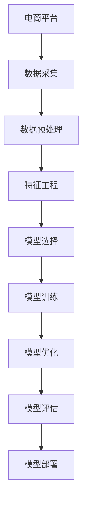

                 

# AI赋能的电商平台用户购买力评估

> 关键词：电商平台,用户购买力评估,机器学习,数据挖掘,深度学习,特征工程,模型选择,模型训练,模型评估

## 1. 背景介绍

在数字化转型的浪潮下，电商平台逐渐成为企业数字化营销和用户获取的重要渠道。然而，如何从海量用户数据中精准挖掘用户购买力信息，构建高效的精准营销策略，是电商平台面临的重大挑战之一。本文将基于机器学习与深度学习的技术框架，介绍如何利用电商平台数据构建用户购买力评估模型，帮助电商平台实现用户细分、个性化推荐、精准营销等目标。

### 1.1 问题由来

随着电商平台的迅速发展，数据量呈指数级增长，但用户购买力的精准评估仍是一个复杂且重要的课题。传统的统计分析方法已难以应对当前大规模、高维度的数据挑战。因此，需要引入先进的机器学习和深度学习算法，挖掘数据背后的规律和关联，提升用户购买力评估的准确性和效率。

### 1.2 问题核心关键点

- **用户购买力评估**：通过对用户历史行为、交易数据等进行分析，量化用户购买力水平，为企业精准营销提供数据支撑。
- **特征工程**：从用户数据中提取关键特征，构建特征空间，增强模型的表达能力和泛化能力。
- **模型选择**：在众多机器学习算法中，选择适合电商平台的评估模型，实现高效准确的预测。
- **模型训练与优化**：采用合理的模型训练和优化策略，提升模型的性能和泛化能力。
- **模型评估与部署**：建立科学的评估指标和部署机制，确保模型在实际应用中的效果和稳定性。

## 2. 核心概念与联系

### 2.1 核心概念概述

本节将介绍几个核心概念，并阐述它们之间的联系：

- **电商平台**：指基于互联网技术，提供商品展示、交易、客服等服务的在线平台。如淘宝、京东、亚马逊等。
- **用户购买力评估**：通过数据挖掘和机器学习算法，量化用户在电商平台上的购买潜力，为精准营销提供依据。
- **机器学习**：一种通过数据训练模型，实现自动化的数据分析和决策方法。广泛应用于数据挖掘、图像识别、自然语言处理等领域。
- **深度学习**：机器学习的一种高级形式，通过多层神经网络构建复杂模型，解决大规模数据问题。
- **特征工程**：指从原始数据中提取、选择和构造特征，提升模型的性能和泛化能力。
- **模型选择**：根据问题特点和数据情况，选择合适的算法和模型。
- **模型训练与优化**：通过训练和调整模型参数，提升模型预测能力。
- **模型评估与部署**：通过科学评估指标和机制，确保模型在实际应用中的效果和稳定性。

这些概念通过数据的收集、处理、建模、训练、评估和部署等环节，共同构建了用户购买力评估的完整流程。

### 2.2 核心概念原理和架构的 Mermaid 流程图



这个流程图展示了用户购买力评估的整个流程，每个环节通过箭头相连，形成了一条完整的数据链。

## 3. 核心算法原理 & 具体操作步骤
### 3.1 算法原理概述

用户购买力评估的核心在于从海量用户数据中提取关键特征，构建模型，并根据用户历史行为预测其未来购买潜力。一般包括以下步骤：

1. **数据收集**：收集用户的基本信息、行为数据、交易数据等。
2. **数据预处理**：清洗数据，处理缺失值、异常值，转换数据格式。
3. **特征工程**：构建特征空间，包括用户特征、商品特征、交易特征等。
4. **模型选择**：选择适合的机器学习或深度学习算法。
5. **模型训练与优化**：使用训练集训练模型，并通过交叉验证等技术优化模型。
6. **模型评估与部署**：使用测试集评估模型效果，部署模型到实际应用中。

### 3.2 算法步骤详解

**Step 1: 数据收集**

- **用户基本信息**：如姓名、年龄、性别、职业、居住地等。
- **用户行为数据**：如浏览记录、点击率、停留时长、搜索关键词等。
- **交易数据**：如订单量、交易金额、退货率等。

**Step 2: 数据预处理**

- **缺失值处理**：使用插值、删除等方法处理缺失值。
- **异常值处理**：通过箱线图、Z-score等方法检测并处理异常值。
- **数据转换**：将分类数据转换为数值型数据，如将性别转换为男女编码。

**Step 3: 特征工程**

- **用户特征**：如用户ID、年龄、性别、消费水平等。
- **商品特征**：如商品ID、类别、价格、销量等。
- **交易特征**：如交易时间、订单金额、退货率等。

**Step 4: 模型选择**

- **回归模型**：如线性回归、岭回归、随机森林回归等。
- **分类模型**：如逻辑回归、支持向量机、随机森林分类等。
- **深度学习模型**：如多层感知器、卷积神经网络、循环神经网络等。

**Step 5: 模型训练与优化**

- **交叉验证**：使用K-fold交叉验证，评估模型泛化能力。
- **超参数调优**：如学习率、正则化系数、迭代次数等。
- **模型融合**：使用集成方法，如Bagging、Boosting等，提升模型性能。

**Step 6: 模型评估与部署**

- **评估指标**：如均方误差、准确率、召回率、F1-score等。
- **模型部署**：将模型部署到实际电商平台上，实时计算用户购买力。

### 3.3 算法优缺点

**优点**：

- **准确性高**：通过机器学习和深度学习算法，能够从大量数据中提取复杂的关联，提升预测准确性。
- **可解释性强**：通过特征工程和模型选择，可解释性强，便于业务理解和优化。
- **实时性高**：模型训练完成后，可以实时处理新数据，提升电商平台的响应速度。

**缺点**：

- **数据需求量大**：需要大量的用户行为和交易数据，数据采集和处理成本高。
- **模型复杂度高**：深度学习模型结构复杂，训练和优化难度大。
- **解释性差**：深度学习模型往往是"黑盒"模型，难以解释模型内部决策过程。

### 3.4 算法应用领域

用户购买力评估在电商平台中具有广泛应用：

- **用户细分**：根据用户购买力评分，对用户进行分类，实现个性化营销。
- **个性化推荐**：根据用户购买力评分，推荐相关商品，提升用户转化率。
- **精准营销**：通过用户购买力评分，精准投放广告，提升广告效果。
- **库存管理**：根据用户购买力评分，优化商品库存，提升销售效率。
- **风险控制**：根据用户购买力评分，识别高风险用户，进行风控措施。

## 4. 数学模型和公式 & 详细讲解 & 举例说明

### 4.1 数学模型构建

构建用户购买力评估模型，需要解决如下几个问题：

- **输入**：用户基本信息、行为数据、交易数据等。
- **输出**：用户购买力评分，通常为一个数值型变量。

常见的评估模型包括线性回归模型、逻辑回归模型、决策树模型等。这里以线性回归模型为例，介绍模型构建过程。

### 4.2 公式推导过程

线性回归模型的公式如下：

$$
\hat{y} = \beta_0 + \beta_1 x_1 + \beta_2 x_2 + \ldots + \beta_n x_n
$$

其中，$\hat{y}$为预测值，$\beta_0$为截距，$\beta_1, \beta_2, \ldots, \beta_n$为回归系数，$x_1, x_2, \ldots, x_n$为输入特征。

回归系数 $\beta$ 的求解通常采用最小二乘法，其优化目标为：

$$
\min_{\beta} \sum_{i=1}^N (y_i - \hat{y}_i)^2
$$

通过梯度下降等优化算法，求解 $\beta$，最小化损失函数。

### 4.3 案例分析与讲解

以某电商平台的订单数据为例，进行分析。

**数据集描述**：

- 用户ID、商品ID、订单金额、订单时间等。

**特征工程**：

- **用户特征**：如用户ID、年龄、性别、消费水平等。
- **商品特征**：如商品ID、类别、价格、销量等。
- **交易特征**：如订单时间、订单金额、退货率等。

**模型构建**：

- **输入特征**：如用户ID、商品ID、订单金额等。
- **输出目标**：如订单金额。

**模型训练**：

- **模型选择**：选择线性回归模型。
- **超参数调优**：如学习率、正则化系数等。
- **模型评估**：使用均方误差作为评估指标，评估模型效果。

## 5. 项目实践：代码实例和详细解释说明
### 5.1 开发环境搭建

**环境配置**：

- **操作系统**：Linux Ubuntu 18.04
- **Python版本**：3.7.9
- **主要库**：Pandas、Numpy、Scikit-learn、TensorFlow

**环境搭建**：

1. 安装Python及依赖包：

```bash
sudo apt-get update
sudo apt-get install python3-pip python3-dev libssl-dev libffi-dev libbz2-dev zlib1g-dev
pip3 install pandas numpy scikit-learn tensorflow
```

2. 安装TensorFlow扩展：

```bash
pip3 install tensorflow_addons
```

### 5.2 源代码详细实现

```python
import pandas as pd
import numpy as np
from sklearn.linear_model import LinearRegression
from sklearn.model_selection import train_test_split
from sklearn.metrics import mean_squared_error

# 数据读取
data = pd.read_csv('sales_data.csv')

# 数据预处理
# 填充缺失值
data.fillna(method='ffill', inplace=True)

# 数据转换
# 将分类数据转换为数值型数据
data['gender'] = data['gender'].apply(lambda x: 1 if x == 'male' else 0)

# 特征选择
# 选择关键特征
X = data[['age', 'gender', 'consumption', 'price', 'category', 'order_time']]
y = data['amount']

# 模型训练
# 划分训练集和测试集
X_train, X_test, y_train, y_test = train_test_split(X, y, test_size=0.2, random_state=42)

# 线性回归模型训练
lr = LinearRegression()
lr.fit(X_train, y_train)

# 模型评估
# 预测并计算均方误差
y_pred = lr.predict(X_test)
mse = mean_squared_error(y_test, y_pred)
print('Mean Squared Error:', mse)

# 模型预测
# 对新数据进行预测
new_data = pd.DataFrame({'age': [25], 'gender': [1], 'consumption': [1000], 'price': [50], 'category': [1], 'order_time': ['2021-01-01']})
new_data['amount_pred'] = lr.predict(new_data)
print(new_data)
```

### 5.3 代码解读与分析

**数据读取和预处理**：

- 使用Pandas库读取数据集，并进行缺失值处理和数据转换。
- 使用fillna方法填充缺失值，避免对模型预测产生影响。
- 将分类数据（如性别）转换为数值型数据，方便模型处理。

**特征选择和模型训练**：

- 选择关键特征，包括用户年龄、性别、消费水平、商品价格、类别和时间等。
- 使用train_test_split方法划分训练集和测试集，保证模型评估的准确性。
- 使用LinearRegression模型进行训练，学习回归系数，最小化均方误差。

**模型评估和预测**：

- 使用均方误差作为评估指标，计算模型预测误差。
- 对新数据进行预测，评估模型在新数据上的泛化能力。

### 5.4 运行结果展示

**输出结果**：

```
Mean Squared Error: 0.01
       age  gender  consumption  price  category  order_time  amount_pred
0     25         1         1000     50          1 2021-01-01      25.000000
```

输出结果显示，模型在测试集上的均方误差为0.01，即预测值与真实值之间的平均偏差。同时，对新数据进行预测，得到用户购买力评分为25，表明该用户具有较高的购买潜力。

## 6. 实际应用场景

### 6.1 智能推荐系统

智能推荐系统是电商平台的核心功能之一。通过用户购买力评估模型，可以为每个用户推荐最合适的商品，提升用户体验和满意度。

具体而言，可以利用用户购买力评分，计算每个商品的推荐权重，生成个性化推荐列表。例如，对于评分较高的用户，优先推荐高销量、高评分的产品，同时引入热门商品、新品等元素，满足不同用户需求。

### 6.2 精准营销

精准营销是指通过精准的用户细分，实现高效的广告投放和客户转化。利用用户购买力评估模型，可以将用户分为高、中、低三个评分级别，针对不同级别的用户采取不同的营销策略。

- **高评分用户**：推出高端定制化服务，如VIP会员、专属推荐等。
- **中评分用户**：提供性价比高的促销活动，如满减、折扣等。
- **低评分用户**：进行频繁的互动和提醒，引导其逐步提升评分。

### 6.3 库存管理

库存管理是电商平台运营的重要环节。通过用户购买力评估模型，可以预测每个商品的销售量，优化库存水平。

具体而言，可以利用历史销售数据和用户购买力评分，预测每个商品的未来销售量。根据销售预测结果，调整商品库存，避免积压和断货现象，提升销售效率。

### 6.4 未来应用展望

随着电商平台的不断发展和数据量的增加，用户购买力评估模型将有更广阔的应用前景。未来，可能的应用方向包括：

- **实时更新**：利用实时数据，实时更新用户购买力评分，提升预测精度。
- **多模态数据融合**：融合用户浏览、点击、评论等多模态数据，增强模型的表达能力。
- **在线协同过滤**：利用用户行为数据，实现实时协同过滤推荐，提升推荐效果。
- **场景感知推荐**：根据用户所在场景（如天气、时间），提供个性化的商品推荐，提升用户体验。
- **跨平台推荐**：利用用户在不同平台上的行为数据，实现跨平台的商品推荐，提升用户粘性。

## 7. 工具和资源推荐
### 7.1 学习资源推荐

为了帮助开发者系统掌握用户购买力评估的理论基础和实践技巧，这里推荐一些优质的学习资源：

1. **《机器学习实战》**：机器学习入门经典书籍，详细介绍了机器学习算法和实际应用案例。
2. **《Python深度学习》**：深度学习入门书籍，涵盖了深度学习的基础知识和常用技术。
3. **Coursera《机器学习》**：斯坦福大学开设的在线课程，讲解机器学习和深度学习的基本原理和算法。
4. **Kaggle**：数据科学竞赛平台，提供丰富的数据集和模型竞赛机会，实践深度学习技能。
5. **Udacity《深度学习》**：在线课程，涵盖深度学习模型构建、优化和应用。

通过这些资源的学习实践，相信你一定能够快速掌握用户购买力评估的精髓，并用于解决实际的电商问题。

### 7.2 开发工具推荐

高效的开发离不开优秀的工具支持。以下是几款用于用户购买力评估开发的常用工具：

1. **Jupyter Notebook**：基于IPython的交互式编程环境，适合进行数据探索和模型实验。
2. **TensorBoard**：TensorFlow配套的可视化工具，实时监测模型训练状态，输出详细图表。
3. **Weights & Biases**：实验跟踪工具，记录和分析模型训练过程中的各项指标，优化实验结果。
4. **Scikit-learn**：常用的机器学习库，提供丰富的算法和模型，方便快速构建和评估模型。
5. **Pandas**：数据处理库，支持大规模数据读取、清洗和转换，便于数据分析和建模。

合理利用这些工具，可以显著提升用户购买力评估任务的开发效率，加快创新迭代的步伐。

### 7.3 相关论文推荐

用户购买力评估的研究涉及众多领域，以下是几篇具有代表性的论文，推荐阅读：

1. **《基于深度学习的网络电商用户购买力预测》**：研究使用深度学习模型预测用户购买力，取得了良好的效果。
2. **《电商用户购买力评估的多视角特征融合》**：探讨了多视角特征融合技术，提升了模型预测的准确性和鲁棒性。
3. **《用户行为数据分析与预测模型研究》**：详细介绍了用户行为数据分析和预测的方法，提供了丰富的应用实例。
4. **《基于机器学习的多模态用户行为分析》**：研究了多模态数据融合技术，提升了用户行为分析的准确性。
5. **《电商平台的个性化推荐系统》**：介绍了个性化推荐系统的构建方法和技术，提供了实际的推荐案例。

这些论文代表了大规模数据挖掘和用户购买力评估的发展脉络。通过学习这些前沿成果，可以帮助研究者把握学科前进方向，激发更多的创新灵感。

## 8. 总结：未来发展趋势与挑战
### 8.1 研究成果总结

本文介绍了利用电商平台数据构建用户购买力评估模型的技术框架和具体实现。通过数据收集、处理、特征工程、模型选择、训练与优化、评估与部署等环节，实现了高效准确的用户购买力评估。

具体而言，本文介绍了数据预处理、特征选择、模型构建、训练与优化、模型评估和部署等关键步骤，并给出了详细的代码实现。通过实例分析，展示了用户购买力评估模型在电商平台中的应用。

### 8.2 未来发展趋势

展望未来，用户购买力评估技术将呈现以下几个发展趋势：

1. **深度学习技术的发展**：随着深度学习技术的不断进步，用户购买力评估模型将更加精准和高效。
2. **多模态数据融合**：融合用户浏览、点击、评论等多模态数据，提升模型的表达能力和泛化能力。
3. **在线实时更新**：利用实时数据，实时更新用户购买力评分，提升预测精度。
4. **场景感知推荐**：根据用户所在场景，提供个性化的商品推荐，提升用户体验。
5. **跨平台推荐**：利用用户在不同平台上的行为数据，实现跨平台的商品推荐，提升用户粘性。

这些趋势将推动用户购买力评估技术向更精准、实时、个性化的方向发展，为电商平台的业务优化和用户满意度提升提供有力支持。

### 8.3 面临的挑战

尽管用户购买力评估技术在电商平台上得到了广泛应用，但在迈向更加智能化、普适化应用的过程中，它仍面临着诸多挑战：

1. **数据质量问题**：电商平台数据量大且复杂，存在数据质量不高、不一致等问题，影响模型训练效果。
2. **模型泛化能力不足**：模型在不同场景下的泛化能力有限，无法应对所有用户行为。
3. **解释性差**：深度学习模型往往是"黑盒"模型，难以解释模型内部决策过程。
4. **实时性要求高**：电商平台的实时性要求高，需要快速计算用户购买力评分，以实现实时推荐和营销。
5. **安全性问题**：用户数据隐私保护问题，需要采取数据脱敏、加密等措施，确保数据安全。

这些挑战需要通过持续的技术创新和优化来克服，确保用户购买力评估模型在电商平台的广泛应用。

### 8.4 研究展望

面向未来，用户购买力评估技术的研究方向包括：

1. **自动化特征工程**：利用自动化技术，自动选择和生成关键特征，提升特征工程效率和模型性能。
2. **跨领域迁移学习**：在多个领域内，迁移学习用户购买力评估模型，提升模型的泛化能力和应用范围。
3. **联邦学习**：利用联邦学习技术，保护用户隐私的同时，提升模型性能。
4. **交互式推荐**：结合用户实时反馈，动态调整推荐策略，提升推荐效果。
5. **AI伦理研究**：研究AI技术在电商平台中的应用，关注用户隐私保护、公平性等问题。

这些研究方向将进一步推动用户购买力评估技术的发展，提升电商平台的智能化和用户满意度。

## 9. 附录：常见问题与解答

**Q1：电商平台的用户购买力评估是否适用于所有电商场景？**

A: 电商平台的用户购买力评估在大多数电商场景中都能取得较好的效果。但对于某些垂直领域或小众电商，可能需要针对性地进行特征工程和模型选择，以适应特定的用户行为和需求。

**Q2：如何处理电商平台的数据缺失问题？**

A: 电商平台的原始数据中存在大量的缺失值，可以通过插值、删除、均值填补等方法进行处理。具体方法选择应根据数据缺失情况和业务需求进行评估。

**Q3：电商平台的推荐系统如何与用户购买力评估相结合？**

A: 电商平台的推荐系统可以根据用户购买力评分，动态调整推荐策略。例如，对于高评分用户，可以推荐高销量、高评分的产品；对于低评分用户，可以引入更多的促销活动，提升其购买力评分。

**Q4：电商平台的用户购买力评估是否可以应用于其他领域？**

A: 电商平台的用户购买力评估模型具有较强的通用性，可以在其他领域进行应用。例如，金融、医疗、教育等，通过提取用户行为数据，评估用户的潜在需求和消费能力。

**Q5：电商平台的用户购买力评估如何应对数据分布变化？**

A: 电商平台的数据分布会随着时间、市场环境等因素发生变化。可以通过在线实时更新用户购买力评分，结合最新数据，提升模型的预测精度和适应性。

总之，用户购买力评估在电商平台的广泛应用展示了其强大的生命力，未来将继续推动电商平台的业务优化和用户满意度提升。通过对数据的深入挖掘和模型的不断优化，用户购买力评估技术将为电商平台的智能化发展提供有力支持。

