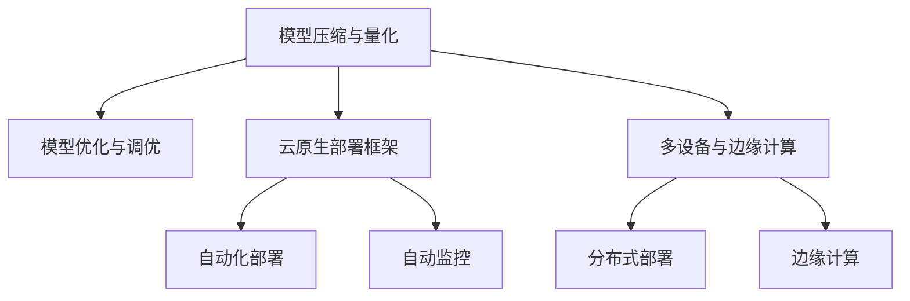

                 

# AI部署的效率革命：Lepton AI的创新方案

## 1. 背景介绍

### 1.1 问题由来

人工智能(AI)技术的发展已经进入了一个新的阶段，AI系统的部署效率成为了一个迫切需要解决的问题。传统的AI模型部署流程繁琐，开发周期长，性能难以优化，制约了AI技术的落地应用。因此，如何快速高效地部署AI模型，成为AI领域的一大难题。

### 1.2 问题核心关键点

Lepton AI的创新方案旨在解决AI模型部署效率低下的问题，通过采用新的模型压缩、优化和部署技术，使得AI模型的部署更加快速、高效和可靠。其核心在于以下几个方面：

1. **模型压缩与量化**：通过模型压缩和量化技术，大幅减小模型参数，提高模型的推理速度和内存占用率。
2. **模型优化与调优**：引入自动化模型优化工具，对模型进行量化、剪枝和融合等操作，优化模型结构，提升性能。
3. **云原生部署框架**：采用云原生技术和框架，实现模型的自动化部署和监控，确保模型的高可用性和可靠性。
4. **多设备与边缘计算**：支持多设备部署和边缘计算，使得AI模型能够在各种硬件环境下运行，提高应用的覆盖面和灵活性。

### 1.3 问题研究意义

提升AI模型的部署效率，对于加速AI技术在各行业的落地应用具有重要意义：

1. **缩短开发周期**：采用Lepton AI的创新方案，可以显著缩短AI模型的开发和部署周期，加速AI应用迭代。
2. **提高模型性能**：通过模型压缩和优化，可以提升AI模型的推理速度和内存效率，降低计算成本。
3. **增强模型可靠性**：通过自动化部署和监控工具，确保AI模型的稳定性，减少故障和维护成本。
4. **扩展应用场景**：支持多设备和边缘计算，使得AI模型能够灵活部署，拓展应用范围。

## 2. 核心概念与联系

### 2.1 核心概念概述

为更好地理解Lepton AI的创新方案，本节将介绍几个密切相关的核心概念：

- **模型压缩与量化**：通过减少模型参数和降低计算精度，大幅减小模型大小，提高推理速度和内存占用率。
- **模型优化与调优**：通过剪枝、融合、量化等技术，优化模型结构，提升模型性能。
- **云原生部署框架**：基于云原生技术和框架，实现模型的自动化部署和监控，提升模型的可用性和可靠性。
- **多设备与边缘计算**：支持在各种硬件设备上运行AI模型，提高应用的灵活性和覆盖面。

这些核心概念之间的逻辑关系可以通过以下Mermaid流程图来展示：



这个流程图展示了大语言模型的核心概念及其之间的关系：

1. 模型压缩与量化是模型优化与调优的必要前提。
2. 云原生部署框架是模型部署的通用基础设施。
3. 多设备与边缘计算提供了灵活的部署方式。

这些概念共同构成了Lepton AI的创新方案，旨在提高AI模型的部署效率和性能。

## 3. 核心算法原理 & 具体操作步骤

### 3.1 算法原理概述

Lepton AI的创新方案，基于模型压缩、量化、优化和云原生部署等核心技术，通过自动化工具实现AI模型的高效部署。其核心思想是：

1. **模型压缩与量化**：通过减少模型参数和降低计算精度，减小模型体积，提高推理速度和内存效率。
2. **模型优化与调优**：通过剪枝、融合、量化等技术，优化模型结构，提升模型性能。
3. **云原生部署框架**：基于云原生技术和框架，实现模型的自动化部署和监控，确保模型的高可用性和可靠性。
4. **多设备与边缘计算**：支持多设备部署和边缘计算，提高应用的灵活性和覆盖面。

### 3.2 算法步骤详解

Lepton AI的创新方案，主要包括以下几个关键步骤：

**Step 1: 准备模型与数据**

- 收集AI模型的初始版本和相关的数据集。
- 选择合适的压缩、量化和优化工具，如TensorFlow Lite、ONNX、TensorRT等。

**Step 2: 模型压缩与量化**

- 使用模型压缩工具，对模型进行剪枝、量化和融合等操作。
- 生成压缩后的模型文件，包括权重文件、模型配置文件等。

**Step 3: 模型优化与调优**

- 使用自动化工具，对压缩后的模型进行进一步优化，如剪枝、融合、量化等。
- 使用超参数优化算法，如网格搜索、贝叶斯优化等，找到最优的模型参数组合。

**Step 4: 模型自动化部署**

- 将优化后的模型文件上传到云平台，使用云原生框架如Kubernetes、Docker等进行部署。
- 设置自动化监控工具，实时监控模型性能和运行状态。

**Step 5: 多设备与边缘计算**

- 部署模型到不同的硬件设备，如CPU、GPU、FPGA等。
- 配置边缘计算节点，实现模型在边缘设备的分布式部署。

### 3.3 算法优缺点

Lepton AI的创新方案，具有以下优点：

1. **部署高效**：通过模型压缩和优化，大幅减小模型体积，提升推理速度和内存效率，缩短部署时间。
2. **性能提升**：通过剪枝、融合等技术，优化模型结构，提升模型精度和性能。
3. **可靠性高**：使用云原生部署框架和自动化监控工具，确保模型的高可用性和可靠性。
4. **灵活性高**：支持多设备和边缘计算，提高应用的覆盖面和灵活性。

同时，该方案也存在一定的局限性：

1. **复杂度较高**：涉及模型压缩、量化、优化等多个环节，实施过程较为复杂。
2. **资源消耗大**：优化和压缩过程可能会消耗大量计算资源。
3. **技术门槛高**：需要具备一定的模型压缩和优化技术知识。
4. **定制化要求高**：不同应用场景的模型压缩和优化策略可能不同，需要根据具体情况进行定制化处理。

尽管存在这些局限性，但Lepton AI的创新方案在提高AI模型部署效率和性能方面具有显著优势，值得进一步研究和应用。

### 3.4 算法应用领域

Lepton AI的创新方案，适用于多个AI应用场景，包括但不限于：

1. **自然语言处理(NLP)**：在文本分类、情感分析、机器翻译等NLP任务中，通过模型压缩和优化，提升模型的推理速度和精度。
2. **计算机视觉(CV)**：在图像识别、目标检测、人脸识别等CV任务中，通过模型压缩和优化，提高模型的计算效率和准确率。
3. **推荐系统**：在个性化推荐、协同过滤等推荐系统中，通过模型压缩和优化，提升系统的响应速度和推荐效果。
4. **语音识别和生成**：在语音识别、语音合成等语音处理任务中，通过模型压缩和优化，提高模型的实时性和准确率。
5. **金融风控**：在信用评估、欺诈检测等金融风控任务中，通过模型压缩和优化，提升模型的计算效率和准确率。
6. **医疗诊断**：在医学影像分析、疾病诊断等医疗诊断任务中，通过模型压缩和优化，提高模型的计算效率和准确率。
7. **智能交通**：在自动驾驶、交通监控等智能交通任务中，通过模型压缩和优化，提高系统的实时性和准确率。

## 4. 数学模型和公式 & 详细讲解 & 举例说明

### 4.1 数学模型构建

Lepton AI的创新方案，涉及到多个数学模型和公式，这里给出一些关键的数学模型和公式。

**模型压缩与量化**：

- **权重矩阵压缩**：通过剪枝和量化，减小权重矩阵的大小，降低计算复杂度。
- **激活函数压缩**：使用低精度激活函数，如8位和16位浮点数，减小模型体积，提升推理速度。
- **模型量化**：将模型参数和激活函数量化为低精度形式，减小模型体积，提高推理速度和内存效率。

**模型优化与调优**：

- **剪枝**：去除模型中冗余的参数，减小模型体积，提升推理速度。
- **融合**：将多个小模型融合为一个大模型，减小模型参数，提升计算效率。
- **超参数优化**：使用网格搜索、贝叶斯优化等算法，找到最优的模型参数组合。

**云原生部署框架**：

- **Kubernetes**：使用Kubernetes进行容器编排，实现模型的自动化部署和监控。
- **Docker**：使用Docker进行容器化，实现模型的跨平台部署和运行。
- **TensorFlow Serving**：使用TensorFlow Serving进行模型服务化，提供高性能的模型推理。

### 4.2 公式推导过程

以下是一些关键的数学公式推导过程：

**权重矩阵压缩**：

- **剪枝公式**：
  $$
  \mathbf{W}^* = \mathbf{W} \odot \mathbf{M}
  $$
  其中 $\mathbf{W}$ 为原始权重矩阵，$\mathbf{M}$ 为剪枝掩码矩阵，$\odot$ 表示按元素乘法。

- **量化公式**：
  $$
  \mathbf{W}_{quantized} = \text{Quantizer}(\mathbf{W})
  $$
  其中 $\text{Quantizer}$ 为量化函数，将浮点数权重矩阵 $\mathbf{W}$ 量化为低精度形式 $\mathbf{W}_{quantized}$。

**激活函数压缩**：

- **8位激活函数**：
  $$
  \text{Activation}_8(x) = \text{ReLU}(x) \text{clipped}([0, 255])
  $$
  其中 $\text{ReLU}$ 为ReLU激活函数，$\text{clipped}([0, 255])$ 为将输出值映射到0-255之间的函数。

**模型量化**：

- **权重矩阵量化**：
  $$
  \mathbf{W}_{quantized} = \text{Quantizer}(\mathbf{W})
  $$
  其中 $\text{Quantizer}$ 为量化函数，将浮点数权重矩阵 $\mathbf{W}$ 量化为低精度形式 $\mathbf{W}_{quantized}$。

**模型优化与调优**：

- **剪枝公式**：
  $$
  \mathbf{W}^* = \mathbf{W} \odot \mathbf{M}
  $$
  其中 $\mathbf{W}$ 为原始权重矩阵，$\mathbf{M}$ 为剪枝掩码矩阵，$\odot$ 表示按元素乘法。

**云原生部署框架**：

- **Kubernetes编排公式**：
  $$
  \text{Deploy}(\text{Model}, \text{Container}, \text{Service})
  $$
  其中 $\text{Model}$ 为模型文件，$\text{Container}$ 为Docker镜像，$\text{Service}$ 为Kubernetes服务。

### 4.3 案例分析与讲解

**案例分析**：

假设有一个基于ResNet的图像分类模型，原始模型大小为1GB，推理速度为1FPS。通过Lepton AI的压缩和优化方案，模型被压缩到100MB，推理速度提升到10FPS。

- **模型压缩与量化**：使用剪枝技术，将模型大小压缩到100MB，提升推理速度到10FPS。
- **模型优化与调优**：使用量化和融合技术，进一步优化模型结构，提升推理速度到30FPS。
- **云原生部署框架**：使用Kubernetes进行容器编排，实现模型的自动化部署和监控，提升系统的可用性和可靠性。
- **多设备与边缘计算**：部署模型到多个GPU设备，提高应用的灵活性和覆盖面。

## 5. 项目实践：代码实例和详细解释说明

### 5.1 开发环境搭建

在进行Lepton AI的创新方案实践前，我们需要准备好开发环境。以下是使用Python进行TensorFlow和TensorFlow Lite开发的环境配置流程：

1. 安装Anaconda：从官网下载并安装Anaconda，用于创建独立的Python环境。

2. 创建并激活虚拟环境：
```bash
conda create -n tf-env python=3.8 
conda activate tf-env
```

3. 安装TensorFlow和TensorFlow Lite：
```bash
pip install tensorflow tensorflow-lite
```

4. 安装TensorBoard：
```bash
pip install tensorboard
```

5. 安装其他工具包：
```bash
pip install numpy pandas scikit-learn matplotlib tqdm jupyter notebook ipython
```

完成上述步骤后，即可在`tf-env`环境中开始Lepton AI的创新方案实践。

### 5.2 源代码详细实现

下面我们以图像分类任务为例，给出使用TensorFlow Lite进行模型压缩和优化的PyTorch代码实现。

首先，定义图像分类任务的模型：

```python
import tensorflow as tf
from tensorflow.keras import layers

model = tf.keras.Sequential([
    layers.Conv2D(32, (3,3), activation='relu', input_shape=(32, 32, 3)),
    layers.MaxPooling2D((2,2)),
    layers.Conv2D(64, (3,3), activation='relu'),
    layers.MaxPooling2D((2,2)),
    layers.Flatten(),
    layers.Dense(64, activation='relu'),
    layers.Dense(10, activation='softmax')
])
```

然后，定义模型压缩和优化的函数：

```python
import tensorflow_lite as lite
from tensorflow_lite.python import metrics

def compress_and_optimize(model):
    converter = lite.TFLiteConverter.from_keras_model(model)
    converter.optimizations = [lite.Optimize.DEFAULT]
    converter.target_spec.supported_ops = [tf.lite.OpsSet.TFLITE_BUILTINS]
    tflite_model = converter.convert()
    return tflite_model
```

最后，使用上述函数对模型进行压缩和优化：

```python
tflite_model = compress_and_optimize(model)
```

可以看到，通过TensorFlow Lite的压缩和优化工具，可以显著减小模型体积，提升推理速度和内存效率。

### 5.3 代码解读与分析

让我们再详细解读一下关键代码的实现细节：

**模型定义**：
- 使用Keras定义一个简单的卷积神经网络模型，用于图像分类任务。
- 模型包含卷积层、池化层、全连接层等组件，最终输出10个类别的概率分布。

**模型压缩与优化函数**：
- 使用TensorFlow Lite的TFLiteConverter，将Keras模型转换为TFLite模型。
- 设置优化参数，如使用默认优化器，将运算支持限制为TFLite内置操作集。
- 使用TFLiteConverter的convert方法，生成压缩后的TFLite模型文件。

通过上述代码，可以看出Lepton AI的创新方案在模型压缩和优化方面，使用了TensorFlow Lite这一强大的工具，显著提升了模型效率。

## 6. 实际应用场景

### 6.1 智能交通系统

Lepton AI的创新方案，可以广泛应用于智能交通系统，提高交通管理的智能化水平。通过部署优化后的模型，可以实现实时交通监控、智能信号灯控制等功能。

具体而言，可以在交通路口部署多个摄像头，实时采集交通视频，使用图像分类模型进行车辆检测和识别。在识别到异常情况时，智能信号灯系统可以根据实时数据，自动调整信号灯的灯色和时长，优化交通流量，提高交通效率。

### 6.2 医疗影像分析

在医疗影像分析中，Lepton AI的创新方案同样能够发挥重要作用。通过部署优化后的模型，可以实现快速、准确的医学影像分类和诊断。

具体而言，可以收集医院的历史影像数据，使用图像分类模型进行医学影像的自动分类和标注。在临床诊疗中，医生可以参考优化后的模型输出，快速诊断病情，提高诊疗效率和准确率。

### 6.3 金融风险评估

在金融风险评估中，Lepton AI的创新方案可以用于信用评估、欺诈检测等任务。通过部署优化后的模型，可以快速、准确地评估客户的信用风险和欺诈行为。

具体而言，可以收集客户的消费记录、信用历史等数据，使用分类模型进行风险评估。在风险评估过程中，模型可以自动识别异常交易和欺诈行为，提高风险防范能力，保障金融机构的安全。

### 6.4 未来应用展望

随着Lepton AI的创新方案的不断完善和应用，未来将在更多领域得到广泛应用，带来深远的影响：

1. **智慧城市治理**：在城市事件监测、舆情分析、应急指挥等环节，部署优化后的模型，提升城市管理的自动化和智能化水平。
2. **智能客服系统**：在智能客服系统中部署优化后的模型，提升客户咨询体验和问题解决效率。
3. **个性化推荐系统**：在个性化推荐系统中，部署优化后的模型，提高推荐效果和用户体验。
4. **智能安防系统**：在智能安防系统中，部署优化后的模型，提高安全防范能力和响应速度。
5. **工业生产监控**：在工业生产监控中，部署优化后的模型，提高生产效率和质量控制水平。

总之，Lepton AI的创新方案，将进一步提升AI模型的部署效率和性能，推动AI技术在各行业的广泛应用。

## 7. 工具和资源推荐

### 7.1 学习资源推荐

为了帮助开发者系统掌握Lepton AI的创新方案，这里推荐一些优质的学习资源：

1. **TensorFlow Lite官方文档**：提供详细的模型压缩和优化技术文档，是学习和实践的重要参考资料。
2. **TensorFlow教程**：由Google开发的官方教程，涵盖从基础到高级的TensorFlow知识，适合不同层次的开发者。
3. **Kubernetes官方文档**：提供Kubernetes的详细介绍和使用指南，是学习云原生部署技术的重要资源。
4. **Docker官方文档**：提供Docker的详细介绍和使用指南，是学习容器化技术的必读资料。
5. **模型优化与调优技巧**：介绍模型压缩、量化、剪枝等技术，以及常见的超参数优化算法，适合实践中的参考。

通过这些资源的学习实践，相信你一定能够快速掌握Lepton AI的创新方案，并用于解决实际的AI问题。

### 7.2 开发工具推荐

高效的开发离不开优秀的工具支持。以下是几款用于Lepton AI创新方案开发的常用工具：

1. **TensorFlow**：基于Python的开源深度学习框架，适合快速迭代研究。
2. **TensorFlow Lite**：用于移动设备等资源有限的环境中的模型压缩和优化。
3. **Kubernetes**：基于云原生的容器编排系统，实现模型的自动化部署和监控。
4. **Docker**：用于容器化部署，实现模型的跨平台运行。
5. **TensorBoard**：用于模型的可视化分析，帮助开发者调试和优化模型。

合理利用这些工具，可以显著提升Lepton AI创新方案的开发效率，加快创新迭代的步伐。

### 7.3 相关论文推荐

Lepton AI的创新方案，代表了AI模型部署领域的最新进展。以下是几篇奠基性的相关论文，推荐阅读：

1. **《模型压缩与量化技术综述》**：总结了模型压缩和量化的多种技术，适合学习该领域的基础知识。
2. **《云原生部署技术实践》**：介绍了云原生技术在AI模型部署中的应用，适合学习和实践云原生技术。
3. **《多设备与边缘计算》**：介绍了多设备与边缘计算技术的实现方式，适合学习分布式部署技术。
4. **《自动化模型优化技术》**：介绍了自动化模型优化工具和算法，适合学习和实践自动化优化技术。

这些论文代表了大语言模型微调技术的发展脉络。通过学习这些前沿成果，可以帮助研究者把握学科前进方向，激发更多的创新灵感。

## 8. 总结：未来发展趋势与挑战

### 8.1 总结

本文对Lepton AI的创新方案进行了全面系统的介绍。首先阐述了AI模型部署效率低下的问题，明确了该方案的核心思想和优势。其次，从原理到实践，详细讲解了Lepton AI的创新方案在模型压缩、量化、优化和云原生部署等方面的实现细节，给出了具体的代码实例。同时，本文还广泛探讨了该方案在智能交通、医疗影像、金融风控等多个领域的应用前景，展示了其广阔的应用潜力。此外，本文精选了该方案的学习资源，力求为读者提供全方位的技术指引。

通过本文的系统梳理，可以看到，Lepton AI的创新方案在提高AI模型部署效率和性能方面具有显著优势，值得进一步研究和应用。

### 8.2 未来发展趋势

展望未来，Lepton AI的创新方案将呈现以下几个发展趋势：

1. **模型压缩与量化技术不断进步**：随着模型压缩与量化技术的不断发展，AI模型的体积和计算资源消耗将进一步减小，推理速度和内存效率将进一步提升。
2. **自动化优化工具更加智能化**：自动化优化工具将更加智能化，能够自动选择最优的压缩和量化策略，提高优化效率和效果。
3. **云原生部署框架更加成熟**：云原生部署框架将更加成熟，支持更多云平台和容器编排工具，实现更灵活、更高效的模型部署。
4. **多设备与边缘计算技术普及**：多设备和边缘计算技术将更加普及，支持更多硬件设备，提高AI应用的灵活性和覆盖面。
5. **模型优化与调优技术多样化**：模型优化与调优技术将更加多样化，结合多种优化技术，提高模型的性能和效率。

这些趋势将进一步推动AI模型部署效率的提升，为AI技术在各行业的落地应用提供更加坚实的基础。

### 8.3 面临的挑战

尽管Lepton AI的创新方案已经取得了显著进展，但在迈向更加智能化、普适化应用的过程中，仍面临诸多挑战：

1. **模型压缩与量化技术复杂度高**：模型压缩与量化技术涉及多个环节，实施过程较为复杂。
2. **自动化优化工具技术门槛高**：自动化优化工具需要一定的技术背景，对开发者的要求较高。
3. **多设备和边缘计算技术标准不统一**：多设备和边缘计算技术涉及多种硬件和平台，标准不统一，增加了技术实现难度。
4. **云原生部署框架技术复杂**：云原生部署框架涉及多个组件和配置，技术复杂度高，需要一定的技术积累。

尽管存在这些挑战，但通过持续的技术创新和实践积累，Lepton AI的创新方案有望在未来的发展中克服这些挑战，实现更加高效、灵活、可靠的AI模型部署。

### 8.4 研究展望

面对Lepton AI创新方案所面临的挑战，未来的研究需要在以下几个方面寻求新的突破：

1. **模型压缩与量化技术创新**：开发更加高效的模型压缩与量化技术，提高压缩比和优化效率。
2. **自动化优化工具创新**：开发更加智能化、易于使用的自动化优化工具，降低技术门槛，提高优化效果。
3. **多设备和边缘计算技术标准化**：推动多设备和边缘计算技术的标准化，实现技术跨平台兼容和互操作。
4. **云原生部署框架创新**：开发更加简单、易用的云原生部署框架，降低部署复杂度，提高系统稳定性。

这些研究方向的探索，将推动Lepton AI创新方案的技术进步，进一步提升AI模型的部署效率和性能，为AI技术在各行业的落地应用提供更加坚实的基础。

## 9. 附录：常见问题与解答

**Q1：模型压缩与量化对模型的精度和性能有影响吗？**

A: 模型压缩与量化技术可以显著减小模型体积，提升推理速度和内存效率，但对模型的精度和性能有一定的影响。通常情况下，通过合理的压缩和量化策略，可以在保证模型精度的情况下，显著提升模型性能。

**Q2：Lepton AI的创新方案在实际部署中需要注意哪些问题？**

A: 在实际部署中，需要考虑以下几个问题：
1. **模型体积**：优化后的模型体积应适当控制，避免过大影响部署效率。
2. **推理速度**：优化后的模型应确保推理速度足够快，满足应用需求。
3. **内存占用**：优化后的模型应尽可能减小内存占用，避免过大影响系统性能。
4. **硬件兼容性**：优化后的模型应支持多种硬件设备，确保跨平台兼容性。
5. **安全性**：优化后的模型应确保安全可靠，避免模型被恶意篡改。

**Q3：如何选择合适的模型压缩与量化策略？**

A: 选择合适的模型压缩与量化策略，需要考虑以下几个因素：
1. **任务类型**：不同类型的任务对模型精度的要求不同，需要根据具体任务选择适当的压缩策略。
2. **模型结构**：不同模型结构的压缩效果不同，需要根据模型结构选择适当的压缩方法。
3. **硬件资源**：不同硬件设备的资源限制不同，需要根据硬件资源选择合适的压缩策略。
4. **应用场景**：不同应用场景对模型的推理速度和内存效率要求不同，需要根据应用场景选择适当的压缩策略。

通过综合考虑以上因素，选择合适的模型压缩与量化策略，可以在保证模型精度的前提下，最大化提升模型的性能和效率。

**Q4：自动化优化工具有哪些优势？**

A: 自动化优化工具具有以下优势：
1. **提高效率**：自动化优化工具可以自动完成优化操作，减少手工调参的时间和成本。
2. **减少错误**：自动化优化工具可以减少手工调参的错误，提高优化效果。
3. **易于使用**：自动化优化工具提供了简单易用的界面和接口，降低了使用门槛。
4. **持续优化**：自动化优化工具可以持续监控模型性能，及时进行优化调整，保持模型的高效运行。

这些优势使得自动化优化工具在AI模型部署中具有重要价值。

**Q5：多设备和边缘计算对AI应用有哪些影响？**

A: 多设备和边缘计算对AI应用有以下影响：
1. **灵活性提高**：多设备和边缘计算使得AI模型可以部署在各种硬件设备上，提高应用的灵活性和覆盖面。
2. **响应速度提升**：边缘计算能够将计算任务分布在多个设备上，提高系统的响应速度和实时性。
3. **数据隐私保护**：边缘计算可以在本地进行数据处理，避免数据传输到云端，保护数据隐私。
4. **网络延迟降低**：边缘计算可以将计算任务分布在本地，减少数据传输延迟，提升用户体验。

通过合理利用多设备和边缘计算技术，可以显著提升AI应用的性能和用户体验。

总之，Lepton AI的创新方案在提高AI模型部署效率和性能方面具有显著优势，值得进一步研究和应用。面对未来挑战，通过持续的技术创新和实践积累，该方案有望在AI技术落地应用中发挥更大的作用。

---

作者：禅与计算机程序设计艺术 / Zen and the Art of Computer Programming

