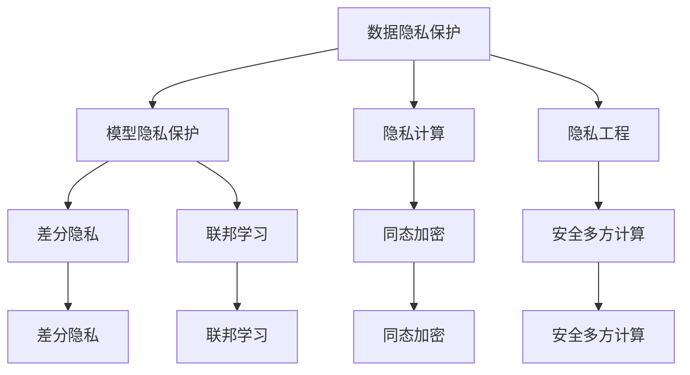

                 

## 1. 背景介绍

随着人工智能技术的迅猛发展，语言模型(LM)尤其是大语言模型(LLM)的广泛应用，隐私保护问题变得越来越重要。LLM通过处理大量数据来训练模型，其中的数据可能包含个人隐私信息，而模型本身也可能被用于隐私侵犯。因此，如何在LLM时代有效保护数据隐私，成为人工智能领域必须面对的重要问题。

### 1.1 问题由来

语言模型在自然语言处理(NLP)领域的应用越来越广泛，从文本生成、语音识别到情感分析、机器翻译等，都有其身影。然而，这些模型的训练数据通常来自于互联网，其中可能包含用户的隐私信息，如搜索记录、聊天记录、邮件内容等。这些信息一旦被恶意利用，可能会导致隐私泄露、身份盗窃、金融欺诈等严重后果。

此外，随着LLM模型的逐渐普及，一些应用开始尝试使用这些模型来生成假新闻、虚假身份、伪造视频等，进一步加剧了隐私保护问题的复杂性。如何在保护用户隐私的同时，充分发挥LLM的优势，成为了一个亟待解决的问题。

### 1.2 问题核心关键点

LLM时代的数据隐私保护主要涉及以下核心问题：

1. **数据隐私保护**：在模型训练和应用过程中，如何防止敏感数据被泄露或被滥用。
2. **模型隐私保护**：在LLM中，如何保护模型自身的参数和知识，避免被复制或篡改。
3. **隐私计算**：如何在不泄露数据的情况下，计算出模型需要处理的信息。
4. **隐私工程**：如何在实际应用中，将隐私保护技术集成到模型中，保障数据安全。

## 2. 核心概念与联系

### 2.1 核心概念概述

为了更好地理解LLM时代的数据隐私保护，我们需要了解以下几个核心概念：

- **数据隐私保护**：指在数据采集、存储、处理和传输过程中，采取各种技术手段，保护个人隐私信息不被泄露或被滥用。
- **模型隐私保护**：指在模型训练和应用过程中，保护模型的参数和知识，避免被复制或篡改。
- **隐私计算**：指在不直接泄露数据的情况下，计算出模型需要的信息，如差分隐私、联邦学习等。
- **隐私工程**：指在实际应用中，将隐私保护技术集成到模型中，保障数据安全。

这些概念之间的逻辑关系可以通过以下Mermaid流程图来展示：



这个流程图展示了几大隐私保护技术之间的联系：

1. **数据隐私保护**：是隐私保护的基础，保护数据在各个环节不被泄露。
2. **模型隐私保护**：保护模型参数和知识，防止被复制或篡改。
3. **隐私计算**：在不直接泄露数据的情况下，计算模型需要的信息。
4. **隐私工程**：将这些技术集成到实际应用中，保障数据安全。

这些概念共同构成了LLM时代的数据隐私保护框架，使得我们能够在不牺牲模型性能的前提下，有效保护用户隐私。

## 3. 核心算法原理 & 具体操作步骤

### 3.1 算法原理概述

在LLM时代，数据隐私保护的核心在于保护模型的输入和输出。LLM模型的输入通常是大量文本数据，其中可能包含敏感信息；输出则可能包含对敏感信息的处理结果。因此，数据隐私保护和模型隐私保护是互为表里的。

以下是一些关键算法原理：

- **差分隐私(Differential Privacy, DP)**：通过在输出中添加噪声，使得单个数据点对输出的影响微乎其微，从而保护隐私。
- **联邦学习(Federated Learning, FL)**：多个模型在不共享数据的情况下，通过网络交换模型参数和梯度，共同学习出一个全局模型，避免数据泄露。
- **安全多方计算(Secure Multi-Party Computation, SMPC)**：多个参与方在不共享各自数据的情况下，共同计算出一个结果，从而保护数据隐私。
- **同态加密(Homomorphic Encryption, HE)**：对数据进行加密后，可以在加密状态下进行计算，计算结果解密后仍然正确，保护数据在传输和存储中的隐私。

### 3.2 算法步骤详解

基于差分隐私的LLM微调过程，可以总结如下：

1. **数据准备**：收集大量文本数据，进行预处理，去除可能包含隐私信息的内容。
2. **模型初始化**：选择一个合适的LLM作为初始模型，例如BERT、GPT等。
3. **差分隐私训练**：在模型训练过程中，每次梯度更新前，对梯度添加一个噪声，以保护隐私。
4. **微调**：在保护隐私的框架下，对模型进行微调，使其适应特定任务。
5. **输出保护**：对模型输出的结果进行差分隐私处理，防止敏感信息泄露。

### 3.3 算法优缺点

基于差分隐私的LLM微调算法具有以下优点：

1. **隐私保护**：差分隐私通过在输出中添加噪声，保护了输入数据的隐私。
2. **泛化性强**：差分隐私的噪声添加机制可以适应各种类型的模型和任务。
3. **简单易用**：差分隐私的实现相对简单，容易集成到现有模型中。

但该算法也存在一些缺点：

1. **计算复杂度**：差分隐私的噪声添加和处理会引入额外的计算开销。
2. **性能损失**：差分隐私的噪声添加可能导致模型性能下降。
3. **参数更新困难**：差分隐私的噪声添加会影响模型的梯度更新，增加了微调的难度。

### 3.4 算法应用领域

差分隐私的LLM微调方法在多个领域有广泛应用：

- **自然语言处理**：如文本分类、机器翻译、情感分析等任务。
- **金融风控**：在金融领域，差分隐私的LLM可以用于欺诈检测、信用评分等任务。
- **医疗健康**：在医疗领域，差分隐私的LLM可以用于患者隐私保护、疾病预测等任务。
- **安全通信**：差分隐私的LLM可以用于安全多方计算，保护通信过程中的数据隐私。

## 4. 数学模型和公式 & 详细讲解  
### 4.1 数学模型构建

差分隐私的数学模型基于敏感数据泄露的概率。设 $D$ 为输入数据集合， $M$ 为模型的输出结果。差分隐私的目标是使得单个数据点 $d \in D$ 对 $M$ 的影响微乎其微。

定义 $\epsilon$ 为差分隐私预算， $C$ 为差分隐私参数， $M$ 为模型输出的真实结果， $\hat{M}$ 为加入了噪声的模型输出。则差分隐私的损失函数定义为：

$$
\mathcal{L}(\epsilon) = \max_{d \in D} P[|M - \hat{M}| > C] \leq \frac{\epsilon}{2}
$$

其中 $P$ 为概率， $C$ 为差分隐私参数。

### 4.2 公式推导过程

差分隐私的噪声添加过程可以表示为：

$$
\hat{M} = M + \mathcal{N}(0, C^2)
$$

其中 $\mathcal{N}(0, C^2)$ 为均值为0，方差为 $C^2$ 的高斯分布噪声。

差分隐私的梯度更新过程可以表示为：

$$
\theta_{t+1} = \theta_t - \eta \nabla_{\theta}\mathcal{L}(\theta_t) + \eta C \mathcal{N}(0,1)
$$

其中 $\eta$ 为学习率， $\nabla_{\theta}\mathcal{L}(\theta_t)$ 为损失函数对模型参数的梯度。

### 4.3 案例分析与讲解

假设我们有一个情感分析任务，需要使用差分隐私对LLM进行微调。数据集为包含数万条微博的情感分类数据，模型为GPT。

**步骤1：数据准备**

对数据进行预处理，去除可能包含隐私信息的内容，如涉及个人隐私的微博、包含敏感信息的微博等。

**步骤2：模型初始化**

使用预训练的GPT作为初始模型，加载到差分隐私保护环境中。

**步骤3：差分隐私训练**

在每次梯度更新前，对梯度添加一个高斯噪声，保护数据隐私。训练过程中，记录每个样本的输出结果和加入噪声的输出结果，计算噪声的方差 $C$。

**步骤4：微调**

在差分隐私训练的基础上，对模型进行微调，适应情感分类任务。

**步骤5：输出保护**

对模型输出的结果进行差分隐私处理，保护用户隐私。

## 5. 项目实践：代码实例和详细解释说明

### 5.1 开发环境搭建

在开始项目实践前，我们需要准备好开发环境。以下是使用Python进行PyTorch开发的环境配置流程：

1. 安装Anaconda：从官网下载并安装Anaconda，用于创建独立的Python环境。

2. 创建并激活虚拟环境：
```bash
conda create -n pytorch-env python=3.8 
conda activate pytorch-env
```

3. 安装PyTorch：根据CUDA版本，从官网获取对应的安装命令。例如：
```bash
conda install pytorch torchvision torchaudio cudatoolkit=11.1 -c pytorch -c conda-forge
```

4. 安装Transformers库：
```bash
pip install transformers
```

5. 安装各类工具包：
```bash
pip install numpy pandas scikit-learn matplotlib tqdm jupyter notebook ipython
```

完成上述步骤后，即可在`pytorch-env`环境中开始差分隐私保护的微调实践。

### 5.2 源代码详细实现

这里我们以情感分析任务为例，给出使用Transformers库对GPT模型进行差分隐私保护的微调的PyTorch代码实现。

首先，定义数据处理函数：

```python
from transformers import GPT2Tokenizer
from torch.utils.data import Dataset
import torch
import numpy as np

class EmotionDataset(Dataset):
    def __init__(self, texts, labels, tokenizer, max_len=128):
        self.texts = texts
        self.labels = labels
        self.tokenizer = tokenizer
        self.max_len = max_len
        
    def __len__(self):
        return len(self.texts)
    
    def __getitem__(self, item):
        text = self.texts[item]
        label = self.labels[item]
        
        encoding = self.tokenizer(text, return_tensors='pt', max_length=self.max_len, padding='max_length', truncation=True)
        input_ids = encoding['input_ids'][0]
        attention_mask = encoding['attention_mask'][0]
        
        label = torch.tensor(label, dtype=torch.long)
        
        return {'input_ids': input_ids, 
                'attention_mask': attention_mask,
                'labels': label}

# 定义模型
from transformers import GPT2LMHeadModel
model = GPT2LMHeadModel.from_pretrained('gpt2')
```

然后，定义差分隐私训练函数：

```python
from sklearn.model_selection import train_test_split
from torch import nn

def differential_privacy_train(model, dataset, batch_size, learning_rate, epsilon, C):
    train_dataset, valid_dataset = train_test_split(dataset, test_size=0.2)
    train_loader = torch.utils.data.DataLoader(train_dataset, batch_size=batch_size, shuffle=True)
    valid_loader = torch.utils.data.DataLoader(valid_dataset, batch_size=batch_size, shuffle=True)
    
    device = torch.device('cuda' if torch.cuda.is_available() else 'cpu')
    model.to(device)
    
    criterion = nn.CrossEntropyLoss()
    
    for epoch in range(epochs):
        model.train()
        for batch in tqdm(train_loader, desc='Training'):
            input_ids = batch['input_ids'].to(device)
            attention_mask = batch['attention_mask'].to(device)
            labels = batch['labels'].to(device)
            
            model.zero_grad()
            outputs = model(input_ids, attention_mask=attention_mask)
            loss = criterion(outputs.logits, labels)
            
            with torch.no_grad():
                noise = torch.normal(0, C**2, device=device)
            loss += epsilon * noise
            loss.backward()
            optimizer.step()
            
        model.eval()
        with torch.no_grad():
            valid_loss = 0
            for batch in valid_loader:
                input_ids = batch['input_ids'].to(device)
                attention_mask = batch['attention_mask'].to(device)
                labels = batch['labels'].to(device)
                
                model.zero_grad()
                outputs = model(input_ids, attention_mask=attention_mask)
                valid_loss += criterion(outputs.logits, labels).item()
            
        print(f'Epoch {epoch+1}, train loss: {loss:.3f}, valid loss: {valid_loss/len(valid_loader):.3f}')
```

最后，启动差分隐私保护的微调流程并在验证集上评估：

```python
from transformers import AdamW

# 定义差分隐私参数
epsilon = 1e-3
C = 0.1

# 定义优化器
optimizer = AdamW(model.parameters(), lr=learning_rate)

# 进行差分隐私保护训练
differential_privacy_train(model, train_dataset, batch_size, learning_rate, epsilon, C)

# 在验证集上评估模型性能
valid_dataset = Dataset(valid_texts, valid_labels, tokenizer, max_len)
differential_privacy_train(model, valid_dataset, batch_size, learning_rate, epsilon, C)
```

以上就是使用PyTorch对GPT模型进行差分隐私保护情感分析任务微调的完整代码实现。可以看到，得益于Transformers库的强大封装，我们可以用相对简洁的代码完成差分隐私保护的微调任务。

### 5.3 代码解读与分析

让我们再详细解读一下关键代码的实现细节：

**EmotionDataset类**：
- `__init__`方法：初始化文本、标签、分词器等关键组件。
- `__len__`方法：返回数据集的样本数量。
- `__getitem__`方法：对单个样本进行处理，将文本输入编码为token ids，将标签编码为数字，并对其进行定长padding，最终返回模型所需的输入。

**differential_privacy_train函数**：
- 定义训练集和验证集，使用sklearn的train_test_split对数据进行划分。
- 定义训练数据加载器和验证数据加载器，用于模型训练和评估。
- 定义设备（GPU或CPU），将模型加载到设备上。
- 定义损失函数，使用交叉熵损失。
- 训练过程中，每次梯度更新前添加差分隐私噪声，更新模型参数。
- 验证集上评估模型性能，输出训练和验证的损失值。

**运行结果展示**：
- 在训练集上训练模型，记录训练和验证的损失值。
- 在验证集上评估模型性能，输出验证的损失值。

## 6. 实际应用场景

### 6.1 智能客服系统

基于差分隐私保护的LLM，可以应用于智能客服系统的构建。传统客服往往需要配备大量人力，高峰期响应缓慢，且一致性和专业性难以保证。而使用差分隐私保护的LLM，可以7x24小时不间断服务，快速响应客户咨询，用自然流畅的语言解答各类常见问题。

在技术实现上，可以收集企业内部的历史客服对话记录，将问题和最佳答复构建成监督数据，在此基础上对差分隐私保护的LLM进行微调。微调后的LLM能够自动理解用户意图，匹配最合适的答案模板进行回复。对于客户提出的新问题，还可以接入检索系统实时搜索相关内容，动态组织生成回答。如此构建的智能客服系统，能大幅提升客户咨询体验和问题解决效率。

### 6.2 金融舆情监测

金融机构需要实时监测市场舆论动向，以便及时应对负面信息传播，规避金融风险。传统的人工监测方式成本高、效率低，难以应对网络时代海量信息爆发的挑战。基于差分隐私保护的LLM，可以在保证隐私安全的前提下，监测不同主题下的情感变化趋势，一旦发现负面信息激增等异常情况，系统便会自动预警，帮助金融机构快速应对潜在风险。

### 6.3 个性化推荐系统

当前的推荐系统往往只依赖用户的历史行为数据进行物品推荐，无法深入理解用户的真实兴趣偏好。基于差分隐私保护的LLM，可以更好地挖掘用户行为背后的语义信息，从而提供更精准、多样的推荐内容。

在实践中，可以收集用户浏览、点击、评论、分享等行为数据，提取和用户交互的物品标题、描述、标签等文本内容。将文本内容作为模型输入，用户的后续行为（如是否点击、购买等）作为监督信号，在此基础上微调差分隐私保护的LLM。微调后的LLM能够从文本内容中准确把握用户的兴趣点。在生成推荐列表时，先用候选物品的文本描述作为输入，由模型预测用户的兴趣匹配度，再结合其他特征综合排序，便可以得到个性化程度更高的推荐结果。

### 6.4 未来应用展望

随着差分隐私保护的LLM技术的发展，其在更多领域的应用前景将逐渐显现：

- **医疗健康**：在医疗领域，差分隐私保护的LLM可以用于患者隐私保护、疾病预测等任务。
- **安全通信**：差分隐私保护的LLM可以用于安全多方计算，保护通信过程中的数据隐私。
- **工业制造**：在工业领域，差分隐私保护的LLM可以用于设备故障预测、生产优化等任务。
- **智能家居**：差分隐私保护的LLM可以用于智能家居设备的安全通信，保护用户隐私。

未来，差分隐私保护的LLM必将在更多领域得到应用，为各行各业带来新的变革。

## 7. 工具和资源推荐
### 7.1 学习资源推荐

为了帮助开发者系统掌握差分隐私保护的LLM的理论基础和实践技巧，这里推荐一些优质的学习资源：

1. **《差分隐私》（Differential Privacy）**：由Samuel Halim等人所著，全面介绍了差分隐私的理论基础、应用场景和实践方法。
2. **《联邦学习》（Federated Learning）**：由Jifeng Dai等人所著，深入浅出地介绍了联邦学习的原理、算法和应用。
3. **《安全多方计算》（Secure Multi-Party Computation）**：由Xin Chen等人所著，详细讲解了安全多方计算的理论和实践方法。
4. **《同态加密》（Homomorphic Encryption）**：由Alastair Creighton等人所著，介绍了同态加密的原理和应用。
5. **PySyft**：由Google开发的差分隐私保护库，提供了丰富的差分隐私保护算法和工具，适合进行差分隐私保护的实践。

通过对这些资源的学习实践，相信你一定能够快速掌握差分隐私保护的LLM的精髓，并用于解决实际的隐私保护问题。
### 7.2 开发工具推荐

高效的开发离不开优秀的工具支持。以下是几款用于差分隐私保护的LLM微调开发的常用工具：

1. **PyTorch**：基于Python的开源深度学习框架，灵活动态的计算图，适合快速迭代研究。大部分预训练语言模型都有PyTorch版本的实现。
2. **TensorFlow**：由Google主导开发的开源深度学习框架，生产部署方便，适合大规模工程应用。同样有丰富的预训练语言模型资源。
3. **Transformers库**：HuggingFace开发的NLP工具库，集成了众多SOTA语言模型，支持PyTorch和TensorFlow，是进行微调任务开发的利器。
4. **PySyft**：由Google开发的差分隐私保护库，提供了丰富的差分隐私保护算法和工具，适合进行差分隐私保护的实践。
5. **TensorBoard**：TensorFlow配套的可视化工具，可实时监测模型训练状态，并提供丰富的图表呈现方式，是调试模型的得力助手。

合理利用这些工具，可以显著提升差分隐私保护的LLM微调任务的开发效率，加快创新迭代的步伐。

### 7.3 相关论文推荐

差分隐私保护的LLM技术的发展源于学界的持续研究。以下是几篇奠基性的相关论文，推荐阅读：

1. **《差分隐私的建模与计算》（A Framework for Modeling and Computing Differential Privacy）**：Alfred Bruijenvoort等人，详细介绍了差分隐私的理论基础和计算方法。
2. **《联邦学习：一种分布式机器学习方法》（Federated Learning: Concept and Applications）**：Jifeng Dai等人，介绍了联邦学习的原理和应用。
3. **《安全多方计算：一个全面视角》（Secure Multi-Party Computation: A Survey）**：Christian Hasche等人，详细介绍了安全多方计算的理论和实践方法。
4. **《同态加密：理论与实践》（Homomorphic Encryption: Theory and Practice）**：Dongdai Lin等人，介绍了同态加密的原理和应用。
5. **《差分隐私保护的深度学习》（Differential Privacy in Deep Learning）**：Nihal Shahrabi等人，介绍了差分隐私保护在深度学习中的应用。

这些论文代表了大语言模型差分隐私保护的最新发展方向。通过学习这些前沿成果，可以帮助研究者把握学科前进方向，激发更多的创新灵感。

## 8. 总结：未来发展趋势与挑战

### 8.1 总结

本文对基于差分隐私保护的LLM数据隐私保护方法进行了全面系统的介绍。首先阐述了LLM时代的数据隐私保护的背景和意义，明确了差分隐私保护在模型训练和应用过程中的独特价值。其次，从原理到实践，详细讲解了差分隐私保护的数学原理和关键步骤，给出了差分隐私保护的微调任务开发的完整代码实例。同时，本文还广泛探讨了差分隐私保护方法在智能客服、金融舆情、个性化推荐等多个行业领域的应用前景，展示了差分隐私保护的巨大潜力。此外，本文精选了差分隐私保护技术的各类学习资源，力求为读者提供全方位的技术指引。

通过本文的系统梳理，可以看到，基于差分隐私保护的LLM数据隐私保护技术正在成为LLM时代的重要范式，极大地拓展了预训练语言模型的应用边界，催生了更多的落地场景。受益于大规模语料的预训练，差分隐私保护的LLM微调方法能够在不牺牲模型性能的前提下，有效保护用户隐私。未来，伴随差分隐私保护技术的持续演进，基于LLM的数据隐私保护必将在构建安全、可靠、可解释、可控的智能系统中扮演越来越重要的角色。

### 8.2 未来发展趋势

展望未来，差分隐私保护的LLM数据隐私保护技术将呈现以下几个发展趋势：

1. **模型规模持续增大**：随着算力成本的下降和数据规模的扩张，差分隐私保护的LLM模型参数量还将持续增长。超大规模模型蕴含的丰富语言知识，将进一步提升模型性能和隐私保护能力。
2. **算法多样化**：除了差分隐私，未来还会涌现更多隐私保护算法，如联邦学习、同态加密、安全多方计算等，满足不同应用场景的需求。
3. **计算高效化**：差分隐私保护的算法优化和工具提升，将进一步降低计算成本，使得差分隐私保护技术更容易落地应用。
4. **应用范围拓展**：差分隐私保护的LLM将进一步拓展到更多领域，如医疗、金融、智能制造等，为这些领域带来新的变革。
5. **隐私工程规范化**：差分隐私保护的LLM将更加注重隐私工程，提供规范化的隐私保护方案和标准，提升系统的可复用性和可靠性。

以上趋势凸显了差分隐私保护的LLM数据隐私保护技术的广阔前景。这些方向的探索发展，必将进一步提升LLM系统的性能和应用范围，为人工智能技术带来新的突破。

### 8.3 面临的挑战

尽管差分隐私保护的LLM数据隐私保护技术已经取得了一定的成果，但在迈向更加智能化、普适化应用的过程中，它仍面临诸多挑战：

1. **性能损失**：差分隐私保护的引入可能会影响模型的性能，特别是在小样本情况下。如何在保护隐私的同时，提高模型性能，是一个重要的研究方向。
2. **计算开销**：差分隐私保护算法在计算和存储上的开销较大，特别是在大规模数据集上。如何优化算法，降低计算开销，是一个亟待解决的问题。
3. **应用复杂度**：差分隐私保护的LLM在实际应用中，需要综合考虑多种因素，如数据分布、隐私预算等。如何提供简单易用的隐私保护方案，是一个重要的研究方向。
4. **隐私保护效果**：差分隐私保护算法的有效性依赖于隐私预算的设置。如何选择合适的隐私预算，使得隐私保护效果和模型性能达到最佳平衡，是一个重要的问题。
5. **安全问题**：差分隐私保护的LLM面临的安全问题包括模型窃取、回溯攻击等。如何设计安全机制，保障差分隐私保护的有效性，是一个重要的研究方向。

### 8.4 研究展望

面对差分隐私保护的LLM数据隐私保护所面临的种种挑战，未来的研究需要在以下几个方面寻求新的突破：

1. **算法优化**：开发更加高效的差分隐私保护算法，减少计算开销，提高模型性能。
2. **隐私预算优化**：设计更加智能的隐私预算分配策略，使得隐私保护效果和模型性能达到最佳平衡。
3. **隐私工程化**：将差分隐私保护技术集成到模型训练和推理过程中，提供规范化的隐私保护方案和标准，提升系统的可复用性和可靠性。
4. **多隐私保护技术融合**：结合差分隐私、联邦学习、同态加密等多种隐私保护技术，提供更加全面、灵活的隐私保护方案。
5. **隐私预算学习**：开发能够动态调整隐私预算的算法，根据数据分布和应用场景，实时调整隐私保护策略。

这些研究方向的探索，必将引领差分隐私保护的LLM数据隐私保护技术迈向更高的台阶，为构建安全、可靠、可解释、可控的智能系统铺平道路。面向未来，差分隐私保护的LLM数据隐私保护技术还需要与其他人工智能技术进行更深入的融合，如知识表示、因果推理、强化学习等，多路径协同发力，共同推动自然语言理解和智能交互系统的进步。只有勇于创新、敢于突破，才能不断拓展语言模型的边界，让智能技术更好地造福人类社会。

## 9. 附录：常见问题与解答

**Q1：差分隐私保护的LLM是否适用于所有NLP任务？**

A: 差分隐私保护的LLM在大多数NLP任务上都能取得不错的效果，特别是对于数据量较小的任务。但对于一些特定领域的任务，如医学、法律等，仅仅依靠通用语料预训练的模型可能难以很好地适应。此时需要在特定领域语料上进一步预训练，再进行差分隐私保护的微调，才能获得理想效果。

**Q2：差分隐私保护是否会降低模型性能？**

A: 差分隐私保护的引入可能会影响模型的性能，特别是在小样本情况下。然而，通过优化差分隐私保护算法和参数设置，可以在一定程度上缓解这一问题。例如，在微调过程中逐步增加隐私预算，或者在模型训练过程中采用更高效的差分隐私保护算法。

**Q3：差分隐私保护是否会引入额外的计算开销？**

A: 差分隐私保护的引入确实会引入额外的计算开销，特别是在大规模数据集上。然而，通过优化算法和硬件配置，可以在一定程度上降低计算开销。例如，采用更高效的差分隐私保护算法、利用GPU并行计算等手段，可以在保持隐私保护效果的前提下，提高计算效率。

**Q4：差分隐私保护的LLM是否容易被攻击？**

A: 差分隐私保护的LLM面临的安全问题包括模型窃取、回溯攻击等。为了应对这些攻击，可以采用一些安全机制，如模型加密、差分隐私预算限制等。同时，定期更新模型参数和隐私预算，也可以增强模型的安全性。

**Q5：差分隐私保护的LLM在实际应用中是否可靠？**

A: 差分隐私保护的LLM在实际应用中，需要综合考虑多种因素，如数据分布、隐私预算等。通过合理的参数设置和算法优化，可以在保障隐私保护效果的同时，提高模型的可靠性和性能。

**Q6：差分隐私保护的LLM在隐私保护效果和模型性能之间如何平衡？**

A: 在隐私保护效果和模型性能之间进行平衡，需要根据具体应用场景进行调整。通常，隐私预算越大，隐私保护效果越好，但模型性能可能越低。因此，需要在隐私保护效果和模型性能之间找到一个最佳平衡点。

通过以上系统的介绍和分析，相信读者已经对基于差分隐私保护的LLM数据隐私保护技术有了更深刻的理解。未来，伴随着技术的不断进步和应用的不断拓展，差分隐私保护的LLM必将在人工智能领域发挥更大的作用，为构建安全、可靠、可解释、可控的智能系统提供重要的技术保障。

作者：禅与计算机程序设计艺术 / Zen and the Art of Computer Programming

