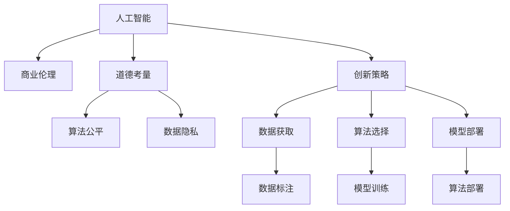

                 

# AI驱动的创新：人类计算在商业中的道德考虑因素与策略预测

> 关键词：人工智能,商业伦理,道德考量,创新策略,商业决策,可持续发展

## 1. 背景介绍

### 1.1 问题由来
随着人工智能(AI)技术的迅猛发展，其在商业领域的应用也日益广泛。AI驱动的创新不仅提高了企业的运营效率和盈利能力，也带来了新的商业模式和市场机会。然而，随着AI技术的深入应用，一系列道德考量和伦理问题逐渐浮现。如何在追求商业利益的同时，保持对道德和伦理的敬畏，成为企业必须面对的挑战。

### 1.2 问题核心关键点
AI在商业中的应用，涵盖了数据分析、决策支持、个性化推荐、供应链优化等多个方面。其关键点在于：
- 数据隐私和安全：如何在数据采集和使用过程中保护用户隐私。
- 算法透明度和可解释性：如何让算法决策过程透明，提高用户对AI的信任。
- 公平性和无偏见：如何避免算法偏见，确保AI决策的公平性。
- 负责任的创新：如何在创新过程中考虑长期社会影响，避免对环境和社会的负面影响。
- 合法合规：如何在合规框架下合理使用AI技术。

这些问题不仅影响到企业自身的健康发展，也直接关系到公众对AI技术的接受度和信任度。因此，企业需要综合考虑商业利益与道德伦理的平衡，制定合理的AI策略。

### 1.3 问题研究意义
研究和制定AI驱动的创新策略，对于提升企业的核心竞争力，推动商业伦理的发展，具有重要意义：

1. 提升企业声誉：遵循道德伦理的AI应用，可以提升企业的社会形象，赢得消费者和监管机构的信任。
2. 实现可持续发展：负责任的AI策略有助于企业在追求短期盈利的同时，实现长期可持续发展的目标。
3. 优化商业决策：AI辅助的决策过程，可以提供更为准确和全面的信息支持，帮助企业做出明智的商业决策。
4. 构建竞争优势：通过合理利用AI技术，企业可以构筑独特的竞争优势，在市场中占据领先地位。
5. 推动行业进步：AI技术在商业领域的应用，可以促进整个行业的发展，带来新的商业模式和商业价值。

## 2. 核心概念与联系

### 2.1 核心概念概述

为更好地理解AI驱动的商业创新和道德考量，本节将介绍几个密切相关的核心概念：

- 人工智能(AI)：以模拟人类智能行为为目标的技术，涵盖机器学习、深度学习、自然语言处理等多个子领域。
- 商业伦理：企业在商业活动中应当遵循的道德准则，包括但不限于数据隐私、算法公平、责任归属等。
- 道德考量：在决策过程中，企业应当考虑的社会和环境影响，如就业、隐私、公平等。
- 创新策略：企业为提升竞争力，制定和实施的AI应用策略，包括数据获取、算法选择、模型部署等。
- 商业决策：企业基于数据和算法支持的决策过程，旨在实现最大化利润的目标。

这些概念之间的逻辑关系可以通过以下Mermaid流程图来展示：



这个流程图展示了这个系统的主要组件及其相互关系：

1. 人工智能作为系统的基础技术。
2. 商业伦理和道德考量指导AI的应用。
3. 创新策略涵盖数据获取、算法选择和模型部署等环节。
4. 数据隐私和算法公平是其中重要的道德问题。
5. 数据标注、模型训练和算法部署是实现创新策略的关键步骤。

## 3. 核心算法原理 & 具体操作步骤

### 3.1 算法原理概述

AI驱动的商业创新，本质上是一个基于数据和算法的决策过程。其核心思想是：通过收集和分析海量数据，利用机器学习等AI技术，建立预测模型，辅助企业做出更为精准的商业决策。

形式化地，假设企业面临一个业务问题，如客户流失预测、库存管理优化等，通过以下步骤建立AI驱动的决策支持系统：

1. 数据收集：收集相关业务数据，如用户行为数据、销售记录、供应链信息等。
2. 数据预处理：对原始数据进行清洗、归一化、特征工程等处理，提高数据质量。
3. 模型选择：根据业务需求选择合适的机器学习算法，如分类、回归、聚类等。
4. 模型训练：使用历史数据对模型进行训练，优化模型参数，提高预测准确度。
5. 模型部署：将训练好的模型部署到生产环境中，支持实时决策。
6. 模型监控和更新：持续监控模型性能，根据业务变化进行模型更新和调优。

### 3.2 算法步骤详解

AI驱动的商业创新具体步骤包括：

**Step 1: 数据收集与预处理**
- 收集业务相关数据，确保数据的完整性和一致性。
- 清洗数据，去除噪音和异常值，确保数据质量。
- 特征工程，提取有意义的特征，提高模型的预测能力。

**Step 2: 模型选择与训练**
- 选择合适的机器学习算法，如随机森林、神经网络、梯度提升树等。
- 利用历史数据对模型进行训练，优化模型参数，如学习率、正则化系数等。
- 交叉验证，评估模型性能，选择最优模型。

**Step 3: 模型部署与监控**
- 将训练好的模型部署到生产环境中，支持实时决策。
- 实时监控模型性能，记录关键指标，如精度、召回率、F1值等。
- 根据业务变化进行模型更新和调优，确保模型始终保持最佳状态。

**Step 4: 商业决策与反馈**
- 利用AI模型辅助商业决策，提高决策的效率和准确性。
- 定期收集业务反馈，评估AI模型的实际效果和应用价值。
- 根据反馈信息调整AI策略，不断优化AI应用。

### 3.3 算法优缺点

AI驱动的商业创新具有以下优点：
1. 提高决策效率：AI可以处理大量数据，提供实时决策支持，提高决策效率。
2. 提升决策质量：AI模型可以综合考虑多方面因素，提供更全面、准确的决策支持。
3. 促进创新：AI技术可以发现数据中的模式和规律，推动企业创新，开拓新的业务领域。
4. 优化资源配置：AI可以优化资源分配，提高企业的运营效率。

然而，AI驱动的商业创新也存在一些局限性：
1. 数据依赖：AI模型的性能高度依赖于数据质量，数据偏差可能带来决策偏差。
2. 算法复杂：复杂的AI模型难以理解和解释，增加了商业决策的风险。
3. 道德风险：AI模型的决策可能缺乏透明度和可解释性，引发道德风险。
4. 过度依赖：过度依赖AI可能导致企业失去对业务逻辑的深入理解，降低企业竞争力。
5. 技术门槛高：开发和维护AI系统需要高水平的技术人员，增加了企业的技术成本。

### 3.4 算法应用领域

AI驱动的商业创新已经应用于众多领域，如金融、零售、制造、物流等，具体包括：

- 金融风控：利用AI模型进行信用评估、风险预测、欺诈检测等。
- 智能制造：通过AI优化生产流程，提高生产效率，降低成本。
- 零售个性化推荐：利用AI分析用户行为，提供个性化的产品推荐，提升用户满意度。
- 供应链优化：通过AI分析供应链数据，优化库存管理，提高供应链的效率和稳定性。
- 客户服务：利用AI构建智能客服系统，提升客户服务体验，减少人工成本。

这些应用不仅提升了企业的运营效率，也带来了新的商业机会。未来，AI在商业中的应用领域将进一步拓展，为企业带来更多创新可能性。

## 4. 数学模型和公式 & 详细讲解 & 举例说明

### 4.1 数学模型构建

为了更加严格地表述AI驱动的商业创新，本节将使用数学语言进行详细解释。

假设企业面临的业务问题可以用二分类问题表示，即：根据历史数据，预测客户是否会流失。记数据集为 $D=\{(x_i, y_i)\}_{i=1}^N$，其中 $x_i$ 为输入特征向量，$y_i$ 为输出标签，$y \in \{0, 1\}$。

定义模型 $M$ 在数据样本 $(x,y)$ 上的损失函数为 $\ell(M(x),y)$，则在数据集 $D$ 上的经验风险为：

$$
\mathcal{L}(M) = \frac{1}{N} \sum_{i=1}^N \ell(M(x_i),y_i)
$$

微调的目标是最小化经验风险，即找到最优模型：

$$
M^* = \mathop{\arg\min}_{M} \mathcal{L}(M)
$$

在实践中，我们通常使用基于梯度的优化算法（如SGD、Adam等）来近似求解上述最优化问题。设 $\eta$ 为学习率，则参数的更新公式为：

$$
\theta \leftarrow \theta - \eta \nabla_{\theta}\mathcal{L}(\theta)
$$

其中 $\nabla_{\theta}\mathcal{L}(\theta)$ 为损失函数对模型参数 $\theta$ 的梯度，可通过反向传播算法高效计算。

### 4.2 公式推导过程

以下我们以客户流失预测为例，推导逻辑回归模型的损失函数及其梯度的计算公式。

假设模型 $M$ 在输入 $x$ 上的输出为 $\hat{y}=M(x) \in [0,1]$，表示客户流失的概率。真实标签 $y \in \{0,1\}$。则二分类逻辑回归损失函数定义为：

$$
\ell(M(x),y) = -[y\log \hat{y} + (1-y)\log (1-\hat{y})]
$$

将其代入经验风险公式，得：

$$
\mathcal{L}(M) = -\frac{1}{N}\sum_{i=1}^N [y_i\log M(x_i)+(1-y_i)\log(1-M(x_i))]
$$

根据链式法则，损失函数对模型参数 $\theta_k$ 的梯度为：

$$
\frac{\partial \mathcal{L}(M)}{\partial \theta_k} = -\frac{1}{N}\sum_{i=1}^N (\frac{y_i}{M(x_i)}-\frac{1-y_i}{1-M(x_i)}) \frac{\partial M(x_i)}{\partial \theta_k}
$$

其中 $\frac{\partial M(x_i)}{\partial \theta_k}$ 可进一步递归展开，利用自动微分技术完成计算。

在得到损失函数的梯度后，即可带入参数更新公式，完成模型的迭代优化。重复上述过程直至收敛，最终得到适应业务需求的预测模型 $M^*$。

## 5. 项目实践：代码实例和详细解释说明

### 5.1 开发环境搭建

在进行商业决策AI应用开发前，我们需要准备好开发环境。以下是使用Python进行PyTorch开发的环境配置流程：

1. 安装Anaconda：从官网下载并安装Anaconda，用于创建独立的Python环境。

2. 创建并激活虚拟环境：
```bash
conda create -n pytorch-env python=3.8 
conda activate pytorch-env
```

3. 安装PyTorch：根据CUDA版本，从官网获取对应的安装命令。例如：
```bash
conda install pytorch torchvision torchaudio cudatoolkit=11.1 -c pytorch -c conda-forge
```

4. 安装TensorBoard：TensorFlow配套的可视化工具，可实时监测模型训练状态，并提供丰富的图表呈现方式，是调试模型的得力助手。

```bash
pip install tensorboard
```

5. 安装各类工具包：
```bash
pip install numpy pandas scikit-learn matplotlib tqdm jupyter notebook ipython
```

完成上述步骤后，即可在`pytorch-env`环境中开始商业决策AI应用的开发。

### 5.2 源代码详细实现

下面我们以客户流失预测任务为例，给出使用PyTorch进行逻辑回归模型训练和评估的PyTorch代码实现。

首先，定义数据处理函数：

```python
import pandas as pd
from sklearn.model_selection import train_test_split
from sklearn.preprocessing import StandardScaler
from torch.utils.data import TensorDataset, DataLoader
from torch import nn, optim

def load_data():
    # 读取数据集
    df = pd.read_csv('churn_data.csv')
    # 数据预处理
    features = df.drop(['Churn'], axis=1)
    target = df['Churn']
    features = StandardScaler().fit_transform(features)
    # 划分训练集和测试集
    train_features, test_features, train_target, test_target = train_test_split(features, target, test_size=0.2, random_state=42)
    # 构建数据集
    train_dataset = TensorDataset(torch.tensor(train_features), torch.tensor(train_target))
    test_dataset = TensorDataset(torch.tensor(test_features), torch.tensor(test_target))
    # 构建数据加载器
    train_loader = DataLoader(train_dataset, batch_size=32, shuffle=True)
    test_loader = DataLoader(test_dataset, batch_size=32, shuffle=False)
    return train_loader, test_loader
```

然后，定义模型和优化器：

```python
class LogisticRegression(nn.Module):
    def __init__(self, input_size, output_size):
        super(LogisticRegression, self).__init__()
        self.fc = nn.Linear(input_size, output_size)
    
    def forward(self, x):
        return self.fc(x)

# 定义模型和优化器
model = LogisticRegression(input_size=8, output_size=1)
optimizer = optim.SGD(model.parameters(), lr=0.01)
```

接着，定义训练和评估函数：

```python
import torch.nn.functional as F

def train_epoch(model, data_loader, optimizer):
    model.train()
    for batch_idx, (features, targets) in enumerate(data_loader):
        optimizer.zero_grad()
        features = features.to(device)
        targets = targets.to(device)
        outputs = model(features)
        loss = F.binary_cross_entropy_with_logits(outputs, targets)
        loss.backward()
        optimizer.step()

def evaluate(model, data_loader):
    model.eval()
    with torch.no_grad():
        correct = 0
        total = 0
        for batch_idx, (features, targets) in enumerate(data_loader):
            features = features.to(device)
            targets = targets.to(device)
            outputs = model(features)
            _, predicted = torch.max(outputs, 1)
            total += targets.size(0)
            correct += (predicted == targets).sum().item()
        print('Accuracy of the model on the 10000 test images: {} %'.format(100 * correct / total))
```

最后，启动训练流程并在测试集上评估：

```python
from torch.utils.tensorboard import SummaryWriter

# 设备选择
device = torch.device('cuda' if torch.cuda.is_available() else 'cpu')

# 数据加载器
train_loader, test_loader = load_data()

# 训练
epochs = 10
for epoch in range(epochs):
    train_epoch(model, train_loader, optimizer)
    evaluate(model, test_loader)

# 模型保存
torch.save(model.state_dict(), 'model.pth')

# TensorBoard可视化
writer = SummaryWriter()
writer.add_graph(model, features)
```

以上就是使用PyTorch进行客户流失预测任务的完整代码实现。可以看到，借助TensorBoard，我们可以直观地监控训练过程中的损失值、准确率等关键指标，及时发现和优化问题。

### 5.3 代码解读与分析

让我们再详细解读一下关键代码的实现细节：

**load_data函数**：
- 读取数据集，并进行标准化处理。
- 划分训练集和测试集，构建数据集和数据加载器。

**LogisticRegression模型**：
- 定义一个简单的逻辑回归模型，用于二分类任务。

**train_epoch和evaluate函数**：
- 训练函数train_epoch：在每个epoch内，迭代训练集，计算损失值并反向传播更新模型参数。
- 评估函数evaluate：在测试集上评估模型性能，计算准确率并输出结果。

**TensorBoard可视化**：
- 使用TensorBoard记录训练过程，生成可视化图表，方便实时监控模型表现。

## 6. 实际应用场景

### 6.1 金融风险管理

在金融领域，AI驱动的商业创新可以帮助企业进行风险预测和风险管理。通过分析客户的历史交易数据、信用记录等信息，AI模型可以预测客户的违约风险，提前采取措施，降低风险。

例如，一家银行可以使用AI模型分析客户的交易行为、收入水平等数据，预测客户的违约概率，并根据预测结果调整信用额度、利率等政策，确保银行的财务稳健。

### 6.2 智能制造

AI驱动的商业创新在制造业中的应用，可以优化生产流程，提高生产效率，降低成本。通过分析生产数据、设备状态等信息，AI模型可以预测设备故障，优化生产计划，减少停机时间。

例如，一家汽车制造企业可以使用AI模型分析生产线上的设备数据，预测设备故障，及时进行维护，避免生产中断，提高生产线的稳定性和效率。

### 6.3 零售个性化推荐

AI驱动的商业创新在零售业中的应用，可以帮助企业提供个性化的产品推荐，提升用户满意度和销售额。通过分析用户的浏览记录、购买历史等信息，AI模型可以预测用户的购买意愿，推荐合适的产品。

例如，一家电子商务平台可以使用AI模型分析用户的浏览和购买数据，预测用户的购买意愿，并根据预测结果推荐相关产品，提高用户的购买转化率。

### 6.4 未来应用展望

随着AI技术的不断发展，其在商业领域的应用也将更加广泛和深入。未来，AI驱动的商业创新将在以下方面取得突破：

1. 全栈自动化：AI将覆盖企业的业务全链条，从客户获取、销售、服务到客户反馈，全面提升企业运营效率。
2. 人机协同：AI将与人类专家协同工作，共同做出更准确、更合理的商业决策。
3. 实时决策：AI将能够实时处理海量数据，提供即时决策支持，帮助企业在动态环境中保持竞争力。
4. 可解释性：AI模型将具备更高的可解释性，提高企业的决策透明度和可信度。
5. 跨界融合：AI将与其他新兴技术（如区块链、物联网等）深度融合，推动更多创新应用场景的涌现。

## 7. 工具和资源推荐

### 7.1 学习资源推荐

为了帮助开发者系统掌握AI驱动的商业创新的理论基础和实践技巧，这里推荐一些优质的学习资源：

1. 《深度学习》系列书籍：Ian Goodfellow等人合著的深度学习教材，全面系统地介绍了深度学习的基本概念和核心算法。
2. 《Python机器学习》书籍：Sebastian Raschka等人合著的机器学习教材，介绍了Python在机器学习中的应用，涵盖数据预处理、模型选择、评估等多个方面。
3. Kaggle平台：全球最大的数据科学竞赛平台，提供丰富的数据集和算法竞赛，可以实践并检验AI模型的实际效果。
4. Coursera平台：与世界顶级大学和机构合作，提供高质量的在线课程，涵盖AI、机器学习、商业分析等多个领域。
5. GitHub开源社区：全球最大的代码托管平台，汇聚了众多优秀的AI项目和开源库，方便开发者学习和使用。

通过对这些资源的学习实践，相信你一定能够快速掌握AI驱动的商业创新的精髓，并用于解决实际的商业问题。

### 7.2 开发工具推荐

高效的开发离不开优秀的工具支持。以下是几款用于AI驱动的商业创新开发的常用工具：

1. PyTorch：基于Python的开源深度学习框架，灵活动态的计算图，适合快速迭代研究。
2. TensorFlow：由Google主导开发的开源深度学习框架，生产部署方便，适合大规模工程应用。
3. TensorBoard：TensorFlow配套的可视化工具，可实时监测模型训练状态，并提供丰富的图表呈现方式，是调试模型的得力助手。
4. Jupyter Notebook：免费的开源编辑器，支持多种编程语言，适合进行快速原型设计和代码共享。
5. Git和GitHub：版本控制工具和代码托管平台，便于团队协作和代码管理。

合理利用这些工具，可以显著提升AI驱动的商业创新开发的效率，加快创新迭代的步伐。

### 7.3 相关论文推荐

AI驱动的商业创新相关研究发展迅速，以下是几篇奠基性的相关论文，推荐阅读：

1. 《Deep Learning》（Ian Goodfellow等）：介绍了深度学习的基本概念和核心算法，涵盖神经网络、卷积神经网络、循环神经网络等多个子领域。
2. 《Machine Learning Yearning》（Andrew Ng）：Andrew Ng的机器学习实战指南，涵盖数据预处理、模型选择、评估等多个方面。
3. 《Human-Computer Interaction》（Bertolt Brecht）：经典的交互设计理论，介绍了人与机器交互的心理学和设计原则，对AI驱动的商业创新有重要参考价值。
4. 《Data-Driven Product Development》（Alistair Smith）：数据分析驱动的产品创新指南，介绍了如何利用数据驱动商业决策和产品设计。
5. 《AI and Data-Driven Innovation: A Study of Advanced Analytics》（Mikael Styrkan）：关于AI和数据驱动创新的学术研究，涵盖数据驱动创新理论、实践案例等多个方面。

这些论文代表了大规模AI驱动的商业创新的研究脉络，通过学习这些前沿成果，可以帮助研究者把握学科前进方向，激发更多的创新灵感。

## 8. 总结：未来发展趋势与挑战

### 8.1 总结

本文对AI驱动的商业创新和道德考量进行了全面系统的介绍。首先阐述了AI驱动的商业创新的研究背景和意义，明确了商业决策中AI的应用价值。其次，从原理到实践，详细讲解了AI驱动的商业创新的数学模型和核心步骤，给出了具体的代码实现和解释。同时，本文还广泛探讨了AI驱动的商业创新在金融、制造、零售等多个领域的应用前景，展示了AI技术的广泛应用潜力。最后，本文推荐了相关的学习资源和开发工具，力求为读者提供全方位的技术指引。

通过本文的系统梳理，可以看到，AI驱动的商业创新在提升企业效率和竞争力方面具有重要价值。然而，在追求商业利益的同时，企业也需要关注数据隐私、算法透明、公平性和道德责任等问题。只有综合考虑商业利益和道德伦理，制定合理的AI策略，才能真正实现AI技术的可持续发展。

### 8.2 未来发展趋势

展望未来，AI驱动的商业创新将呈现以下几个发展趋势：

1. 全栈自动化：AI将覆盖企业的业务全链条，从客户获取、销售、服务到客户反馈，全面提升企业运营效率。
2. 人机协同：AI将与人类专家协同工作，共同做出更准确、更合理的商业决策。
3. 实时决策：AI将能够实时处理海量数据，提供即时决策支持，帮助企业在动态环境中保持竞争力。
4. 可解释性：AI模型将具备更高的可解释性，提高企业的决策透明度和可信度。
5. 跨界融合：AI将与其他新兴技术（如区块链、物联网等）深度融合，推动更多创新应用场景的涌现。

以上趋势凸显了AI驱动的商业创新技术的广阔前景。这些方向的探索发展，必将进一步提升企业的运营效率和竞争力，推动产业的升级和创新。

### 8.3 面临的挑战

尽管AI驱动的商业创新取得了诸多进展，但在迈向更加智能化、普适化应用的过程中，它仍面临诸多挑战：

1. 数据依赖：AI模型的性能高度依赖于数据质量，数据偏差可能带来决策偏差。
2. 算法复杂：复杂的AI模型难以理解和解释，增加了商业决策的风险。
3. 道德风险：AI模型的决策可能缺乏透明度和可解释性，引发道德风险。
4. 过度依赖：过度依赖AI可能导致企业失去对业务逻辑的深入理解，降低企业竞争力。
5. 技术门槛高：开发和维护AI系统需要高水平的技术人员，增加了企业的技术成本。
6. 隐私保护：在数据驱动的商业创新中，如何保护用户隐私，是一个亟待解决的问题。

### 8.4 研究展望

面对AI驱动的商业创新所面临的挑战，未来的研究需要在以下几个方面寻求新的突破：

1. 探索无监督和半监督学习算法：摆脱对大规模标注数据的依赖，利用自监督学习、主动学习等无监督和半监督范式，最大限度利用非结构化数据，实现更加灵活高效的AI应用。
2. 开发更透明的AI模型：通过引入可解释性和因果推断方法，提高AI模型的透明性和可信度，让用户更好地理解和信任AI决策。
3. 增强AI模型的公平性和鲁棒性：通过引入公平性约束和对抗样本技术，提高AI模型的公平性和鲁棒性，确保模型决策的公正性。
4. 结合多模态数据：将视觉、语音、文本等多种模态数据融合，提高AI模型的感知能力和决策准确度。
5. 引入伦理道德约束：在AI模型训练和应用过程中引入伦理导向的评估指标，过滤和惩罚有偏见、有害的输出倾向，确保AI系统的道德合法性。

这些研究方向的探索，必将引领AI驱动的商业创新技术迈向更高的台阶，为构建安全、可靠、可解释、可控的智能系统铺平道路。面向未来，AI驱动的商业创新技术还需要与其他人工智能技术进行更深入的融合，如知识表示、因果推理、强化学习等，多路径协同发力，共同推动自然语言理解和智能交互系统的进步。只有勇于创新、敢于突破，才能不断拓展AI技术的边界，让智能技术更好地造福人类社会。

## 9. 附录：常见问题与解答

**Q1：AI驱动的商业创新如何平衡商业利益和道德伦理？**

A: 平衡商业利益和道德伦理，需要企业在制定AI应用策略时，综合考虑以下几个方面：
1. 数据隐私：保护用户数据隐私，确保数据收集和使用合法合规。
2. 算法透明：通过可解释性技术和可视化工具，提高AI模型的透明性，让用户理解AI决策过程。
3. 公平性：确保AI模型不产生歧视性偏见，对所有用户公平对待。
4. 可解释性：在AI决策过程中，提供足够的解释和理由，提高决策的可信度。
5. 负责任：制定明确的AI应用准则，明确责任归属，确保AI应用负责任。

**Q2：AI驱动的商业创新对企业运营有哪些影响？**

A: AI驱动的商业创新对企业运营的影响主要体现在以下几个方面：
1. 提高运营效率：AI可以处理大量数据，提供实时决策支持，提升运营效率。
2. 降低成本：AI可以减少人力成本，自动化流程，降低运营成本。
3. 优化资源配置：AI可以优化资源分配，提高资源利用率，降低浪费。
4. 提升决策质量：AI模型可以综合考虑多方面因素，提供更全面、准确的决策支持。
5. 推动创新：AI可以发现数据中的模式和规律，推动企业创新，开拓新的业务领域。

**Q3：AI驱动的商业创新在实际应用中面临哪些挑战？**

A: 实际应用中，AI驱动的商业创新面临以下挑战：
1. 数据依赖：AI模型的性能高度依赖于数据质量，数据偏差可能带来决策偏差。
2. 算法复杂：复杂的AI模型难以理解和解释，增加了商业决策的风险。
3. 道德风险：AI模型的决策可能缺乏透明度和可解释性，引发道德风险。
4. 过度依赖：过度依赖AI可能导致企业失去对业务逻辑的深入理解，降低企业竞争力。
5. 技术门槛高：开发和维护AI系统需要高水平的技术人员，增加了企业的技术成本。
6. 隐私保护：在数据驱动的商业创新中，如何保护用户隐私，是一个亟待解决的问题。

**Q4：AI驱动的商业创新在跨界融合中有哪些可能性？**

A: AI驱动的商业创新在跨界融合中有以下可能性：
1. 结合区块链技术：利用区块链的不可篡改性和透明性，提高AI系统的可信度和安全性。
2. 结合物联网技术：利用物联网的实时数据采集和处理能力，提高AI系统的感知能力和决策准确度。
3. 结合大数据分析：利用大数据分析方法，发现数据中的模式和规律，推动企业创新。
4. 结合自然语言处理：利用自然语言处理技术，提高AI系统对人类语言的理解和处理能力。
5. 结合机器视觉：利用机器视觉技术，提高AI系统对视觉数据的处理和分析能力。

**Q5：AI驱动的商业创新如何实现可持续发展？**

A: AI驱动的商业创新实现可持续发展，需要综合考虑以下几个方面：
1. 数据伦理：确保数据收集和使用合法合规，保护用户隐私。
2. 算法透明：提高AI模型的透明性，让用户理解AI决策过程，增强信任。
3. 公平性：确保AI模型不产生歧视性偏见，对所有用户公平对待。
4. 可解释性：在AI决策过程中，提供足够的解释和理由，提高决策的可信度。
5. 负责任：制定明确的AI应用准则，明确责任归属，确保AI应用负责任。
6. 环境保护：在AI应用过程中，考虑环境保护和可持续发展，减少对环境的影响。

总之，AI驱动的商业创新需要在追求商业利益的同时，注重道德伦理和社会责任，确保技术的可持续发展。只有这样，才能真正实现AI技术的普适化和人性化，为人类社会的进步做出积极贡献。

