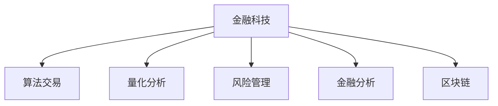

                 

# AI驱动的创新：人类计算在金融中的应用

> 关键词：人工智能,金融科技,数据驱动决策,人类计算,算法交易,风险管理,金融分析,区块链

## 1. 背景介绍

### 1.1 问题由来

在当今这个快速发展的时代，金融行业面临着前所未有的挑战和机遇。从传统的银行、证券、保险到互联网金融，再到新兴的区块链、数字货币等，金融业务的形态和模式正在发生深刻变革。在这一过程中，技术尤其是人工智能(AI)技术的推动作用愈发显著。

金融行业对AI的需求主要体现在以下几个方面：

- **自动化**：自动化交易、自动化风险评估、自动化客户服务等，通过AI技术提升金融服务的效率和准确性。
- **智能决策**：智能投资分析、智能资产管理、智能客户行为预测等，通过AI技术优化金融决策。
- **数据驱动**：基于大数据和AI算法，进行精准的市场预测、信用评估、反欺诈检测等，提升金融产品的设计和风控水平。

金融行业对AI的依赖日益增强，AI驱动的创新正在重新定义人类计算的边界。本文将探讨AI技术在金融中的应用，从核心概念、算法原理、具体实践到未来展望，深入解析人类计算在金融领域带来的革新。

### 1.2 问题核心关键点

在金融科技的浪潮下，AI技术已成为推动行业发展的核心动力。AI技术在金融中的应用，核心关键点在于：

- **数据驱动决策**：利用大数据和机器学习算法，优化金融决策过程。
- **实时计算**：通过实时数据处理和分析，提升交易和风险管理的响应速度。
- **跨领域融合**：AI技术在金融与区块链、物联网、云计算等领域的应用，形成协同效应，推动全产业链升级。
- **智能算法**：从深度学习、强化学习到因果推断等算法，在金融领域的应用，提升模型的预测能力和泛化性能。

## 2. 核心概念与联系

### 2.1 核心概念概述

为更好地理解AI技术在金融中的应用，本节将介绍几个关键概念：

- **金融科技(Fintech)**：指通过技术手段创新金融产品和服务，提升金融效率和客户体验。
- **算法交易(Algorithmic Trading)**：利用计算机算法进行自动交易决策，提高交易速度和效率。
- **量化分析(Quantitative Analysis)**：通过数学模型和计算机算法，进行市场分析和投资决策。
- **风险管理(Risk Management)**：通过AI技术进行风险预测和评估，优化资产配置，防范金融风险。
- **金融分析(Financial Analysis)**：利用AI技术进行财务报表分析、市场预测等，提升决策的准确性。
- **区块链(Blockchain)**：一种分布式账本技术，具有去中心化、透明性、不可篡改等特点，在金融领域应用广泛。

这些概念之间的逻辑关系可以通过以下Mermaid流程图来展示：



这个流程图展示了大语言模型的核心概念及其之间的关系：

1. 金融科技将AI技术应用于金融领域，提升效率和体验。
2. 算法交易和量化分析是AI在金融投资中的两个重要应用，提升交易速度和决策准确性。
3. 风险管理和金融分析是AI在金融风险控制和决策支持中的两个核心应用，提升风险管理和投资决策的科学性。
4. 区块链是AI在金融技术创新中的重要应用，提升金融系统的安全性和透明度。

## 3. 核心算法原理 & 具体操作步骤
### 3.1 算法原理概述

AI在金融中的应用，核心在于利用数据驱动的算法模型，提升金融决策和管理的智能化水平。其核心算法原理包括：

- **机器学习算法**：通过历史数据训练模型，预测未来的市场趋势和投资机会。
- **深度学习算法**：通过多层神经网络模型，学习复杂的非线性关系，提升模型的泛化能力。
- **强化学习算法**：通过与环境的互动，学习最优的决策策略，优化交易策略和风险管理。
- **因果推断算法**：通过因果分析，揭示因果关系，提升决策的因果性和可靠性。

这些算法原理的融合，使得AI技术在金融领域能够应对各种复杂的场景和问题。

### 3.2 算法步骤详解

AI在金融中的应用，一般包括以下几个关键步骤：

**Step 1: 数据准备与预处理**
- 收集历史交易数据、市场数据、财务数据等。
- 进行数据清洗、缺失值填补、特征工程等预处理操作。

**Step 2: 模型训练与评估**
- 选择合适的机器学习或深度学习模型。
- 利用历史数据训练模型，优化模型参数。
- 在验证集上评估模型性能，调整模型超参数。

**Step 3: 模型部署与监控**
- 将训练好的模型部署到生产环境中。
- 实时监控模型性能，根据反馈数据调整模型。
- 定期更新模型，保持模型性能和数据分布的一致性。

### 3.3 算法优缺点

AI在金融中的应用，具有以下优点：

- **效率提升**：通过自动化的算法交易和决策支持，提升金融服务的效率。
- **决策优化**：利用大数据和AI算法，优化金融决策过程，提升决策准确性。
- **风险控制**：通过实时数据监控和风险预测，提升风险管理的科学性和及时性。
- **跨领域应用**：AI技术在金融、区块链、物联网等领域的融合应用，推动行业创新。

同时，AI技术在金融中的应用也存在一些局限性：

- **数据依赖**：AI模型的性能依赖于数据的质量和数量，数据获取和处理成本较高。
- **模型复杂性**：复杂的AI模型需要大量的计算资源和专业知识，对技术门槛要求较高。
- **透明性不足**：黑盒模型缺乏可解释性，难以理解模型内部决策逻辑。
- **伦理风险**：AI模型的决策过程可能存在偏见，影响公平性和公正性。

尽管存在这些局限性，但AI技术在金融中的应用已经取得了显著的成效，被广泛应用于算法交易、量化分析、风险管理等多个领域。未来，随着技术的不断进步，这些挑战将逐步得到解决。

### 3.4 算法应用领域

AI技术在金融领域的应用，主要集中在以下几个方面：

- **算法交易**：利用计算机算法进行高频交易、套利交易等，提升交易效率和收益。
- **量化分析**：通过机器学习和深度学习算法，进行市场预测、资产定价等，优化投资组合。
- **风险管理**：利用AI技术进行风险预测和评估，优化资产配置，防范金融风险。
- **金融分析**：利用AI技术进行财务报表分析、市场趋势预测等，提升决策的科学性。
- **客户服务**：通过自然语言处理(NLP)和机器学习算法，提供智能客服、智能投顾等服务。
- **区块链应用**：利用区块链技术进行跨境支付、资产托管等，提升金融系统的安全性和透明度。

这些应用领域展示了AI技术在金融领域的广泛应用和巨大潜力。未来，随着AI技术的不断演进，金融行业必将迎来更加智能、高效、安全的发展新局面。

## 4. 数学模型和公式 & 详细讲解 & 举例说明

### 4.1 数学模型构建

在金融领域，AI模型的构建通常涉及以下关键步骤：

1. **数据集划分**：将数据集划分为训练集、验证集和测试集。
2. **特征工程**：选择合适的特征，并进行特征提取、归一化等预处理。
3. **模型选择**：选择合适的机器学习或深度学习模型。
4. **模型训练**：利用历史数据训练模型，优化模型参数。
5. **模型评估**：在验证集上评估模型性能，调整模型超参数。

以算法交易为例，假设交易数据集为 $D=\{(x_i, y_i)\}_{i=1}^N$，其中 $x_i$ 为历史交易数据，$y_i$ 为交易结果。假设模型的预测结果为 $\hat{y}_i$，则预测误差为 $\epsilon_i = y_i - \hat{y}_i$。

定义模型 $M$ 在数据样本 $(x,y)$ 上的损失函数为 $\ell(M(x),y)$，则在数据集 $D$ 上的经验风险为：

$$
\mathcal{L}(M) = \frac{1}{N} \sum_{i=1}^N \ell(M(x_i),y_i)
$$

常用的损失函数包括均方误差损失函数：

$$
\ell(M(x),y) = \frac{1}{2}(y - \hat{y})^2
$$

最小化经验风险，得到最优模型：

$$
M^* = \mathop{\arg\min}_{M} \mathcal{L}(M)
$$

在训练过程中，利用梯度下降等优化算法更新模型参数：

$$
\theta \leftarrow \theta - \eta \nabla_{\theta}\mathcal{L}(\theta)
$$

其中 $\eta$ 为学习率，$\nabla_{\theta}\mathcal{L}(\theta)$ 为损失函数对模型参数的梯度。

### 4.2 公式推导过程

以深度学习中的多层感知器(Multilayer Perceptron, MLP)为例，推导其前向传播和反向传播的计算公式。

设 $x$ 为输入，$h$ 为隐藏层输出，$y$ 为输出，$W_i$ 为权重矩阵，$b_i$ 为偏置向量。MLP的前向传播计算公式为：

$$
h = f(W_1 x + b_1)
$$

$$
y = g(W_2 h + b_2)
$$

其中 $f$ 为激活函数，$g$ 为输出层的非线性映射函数。

反向传播的计算公式为：

$$
\frac{\partial \mathcal{L}}{\partial W_1} = \frac{\partial \mathcal{L}}{\partial y} \frac{\partial y}{\partial h} \frac{\partial h}{\partial W_1}
$$

$$
\frac{\partial \mathcal{L}}{\partial W_2} = \frac{\partial \mathcal{L}}{\partial y} \frac{\partial y}{\partial h} \frac{\partial h}{\partial W_2}
$$

其中 $\frac{\partial \mathcal{L}}{\partial y}$ 为输出层对损失函数的梯度，$\frac{\partial y}{\partial h}$ 为输出层对隐藏层的梯度，$\frac{\partial h}{\partial W_1}$ 和 $\frac{\partial h}{\partial W_2}$ 分别为隐藏层对权重矩阵的梯度。

通过上述推导，可以看到深度学习模型的前向传播和反向传播计算公式是可以通过链式法则递归展开的。

### 4.3 案例分析与讲解

以量化分析中的时间序列预测为例，假设历史价格数据为 $D=\{(x_i, y_i)\}_{i=1}^N$，其中 $x_i$ 为时间序列数据，$y_i$ 为下一个时间点的价格。

假设模型的预测结果为 $\hat{y}_i$，则预测误差为 $\epsilon_i = y_i - \hat{y}_i$。

定义模型 $M$ 在数据样本 $(x,y)$ 上的损失函数为 $\ell(M(x),y)$，则在数据集 $D$ 上的经验风险为：

$$
\mathcal{L}(M) = \frac{1}{N} \sum_{i=1}^N \ell(M(x_i),y_i)
$$

常用的损失函数包括均方误差损失函数：

$$
\ell(M(x),y) = \frac{1}{2}(y - \hat{y})^2
$$

最小化经验风险，得到最优模型：

$$
M^* = \mathop{\arg\min}_{M} \mathcal{L}(M)
$$

在训练过程中，利用梯度下降等优化算法更新模型参数：

$$
\theta \leftarrow \theta - \eta \nabla_{\theta}\mathcal{L}(\theta)
$$

其中 $\eta$ 为学习率，$\nabla_{\theta}\mathcal{L}(\theta)$ 为损失函数对模型参数的梯度。

以LSTM为例，LSTM通过长短时记忆网络，解决时间序列预测中的梯度消失和梯度爆炸问题。LSTM的前向传播计算公式为：

$$
h_t = f(W_1 x_t + W_2 h_{t-1} + b_1)
$$

$$
c_t = f(W_3 h_t + W_4 c_{t-1} + b_2)
$$

$$
\hat{y}_t = g(W_5 h_t + b_3)
$$

其中 $h_t$ 为隐藏状态，$c_t$ 为细胞状态，$\hat{y}_t$ 为输出。

LSTM的反向传播计算公式为：

$$
\frac{\partial \mathcal{L}}{\partial W_1} = \frac{\partial \mathcal{L}}{\partial y} \frac{\partial y}{\partial \hat{y}_t} \frac{\partial \hat{y}_t}{\partial h_t} \frac{\partial h_t}{\partial x_t} \frac{\partial h_t}{\partial h_{t-1}} \frac{\partial h_{t-1}}{\partial c_{t-1}} \frac{\partial c_{t-1}}{\partial h_{t-1}} \frac{\partial h_{t-1}}{\partial W_1} + \frac{\partial \mathcal{L}}{\partial y} \frac{\partial y}{\partial \hat{y}_t} \frac{\partial \hat{y}_t}{\partial c_t} \frac{\partial c_t}{\partial h_t} \frac{\partial h_t}{\partial x_t} \frac{\partial h_t}{\partial h_{t-1}} \frac{\partial h_{t-1}}{\partial c_{t-1}} \frac{\partial c_{t-1}}{\partial h_{t-1}} \frac{\partial h_{t-1}}{\partial W_1}
$$

其中 $\frac{\partial \mathcal{L}}{\partial y}$ 为输出层对损失函数的梯度，$\frac{\partial y}{\partial \hat{y}_t}$ 为输出层对预测值的梯度，$\frac{\partial \hat{y}_t}{\partial h_t}$ 为预测值对隐藏状态的梯度，$\frac{\partial h_t}{\partial x_t}$ 为隐藏状态对输入数据的梯度，$\frac{\partial h_t}{\partial h_{t-1}}$ 为隐藏状态对上一时刻隐藏状态的梯度，$\frac{\partial h_{t-1}}{\partial c_{t-1}}$ 为隐藏状态对细胞状态的梯度，$\frac{\partial c_{t-1}}{\partial h_{t-1}}$ 为细胞状态对隐藏状态的梯度。

通过上述推导，可以看到LSTM的前向传播和反向传播计算公式是可以通过链式法则递归展开的。

## 5. 项目实践：代码实例和详细解释说明
### 5.1 开发环境搭建

在进行AI在金融中的应用开发前，我们需要准备好开发环境。以下是使用Python进行TensorFlow开发的环境配置流程：

1. 安装Anaconda：从官网下载并安装Anaconda，用于创建独立的Python环境。

2. 创建并激活虚拟环境：
```bash
conda create -n tf-env python=3.8 
conda activate tf-env
```

3. 安装TensorFlow：根据CUDA版本，从官网获取对应的安装命令。例如：
```bash
conda install tensorflow==2.7
```

4. 安装各类工具包：
```bash
pip install numpy pandas scikit-learn matplotlib tqdm jupyter notebook ipython
```

完成上述步骤后，即可在`tf-env`环境中开始AI在金融中的应用开发。

### 5.2 源代码详细实现

下面我们以量化分析中的时间序列预测为例，给出使用TensorFlow对LSTM模型进行训练和预测的Python代码实现。

首先，定义时间序列数据：

```python
import numpy as np
import tensorflow as tf

# 生成时间序列数据
def generate_time_series(length, num_features):
    X = np.linspace(0, 10, length)
    y = np.sin(X)
    return X.reshape(-1, 1), y.reshape(-1, 1)

# 将数据划分为训练集和测试集
train_X, train_y = generate_time_series(1000, 1)
test_X, test_y = generate_time_series(200, 1)

# 划分时间序列为输入和输出
def create_sequences(X, y, seq_length):
    X_seq, y_seq = [], []
    for i in range(len(X) - seq_length - 1):
        X_seq.append(X[i:i+seq_length])
        y_seq.append(y[i+seq_length])
    return np.array(X_seq), np.array(y_seq)

# 定义序列长度
seq_length = 3

# 生成训练和测试序列
train_X_seq, train_y_seq = create_sequences(train_X, train_y, seq_length)
test_X_seq, test_y_seq = create_sequences(test_X, test_y, seq_length)
```

然后，定义LSTM模型：

```python
# 定义LSTM模型
class LSTMModel(tf.keras.Model):
    def __init__(self, num_features, num_units):
        super(LSTMModel, self).__init__()
        self.lstm = tf.keras.layers.LSTM(num_units, return_sequences=True, stateful=True)
        self.dense = tf.keras.layers.Dense(1)

    def call(self, x, state):
        x = self.lstm(x, initial_state=state)
        x = self.dense(x)
        return x, state
```

接着，定义训练和评估函数：

```python
# 定义训练和评估函数
def train_model(model, train_X_seq, train_y_seq, test_X_seq, test_y_seq, batch_size, num_epochs, learning_rate):
    # 构建数据集
    train_dataset = tf.data.Dataset.from_tensor_slices((train_X_seq, train_y_seq))
    train_dataset = train_dataset.shuffle(1000).batch(batch_size).repeat(num_epochs)

    test_dataset = tf.data.Dataset.from_tensor_slices((test_X_seq, test_y_seq))
    test_dataset = test_dataset.batch(batch_size)

    # 定义优化器
    optimizer = tf.keras.optimizers.Adam(learning_rate)

    # 定义损失函数
    loss_fn = tf.keras.losses.MeanSquaredError()

    # 定义评估指标
    mse = tf.keras.metrics.MeanSquaredError()

    # 训练模型
    model.compile(optimizer=optimizer, loss=loss_fn, metrics=[mse])
    model.fit(train_dataset, epochs=num_epochs, validation_data=test_dataset)

    # 评估模型
    test_loss, test_mse = model.evaluate(test_dataset)
    return test_mse.numpy()

# 定义预测函数
def predict(model, X_seq, num_steps):
    sequences = []
    for i in range(len(X_seq) - num_steps):
        sequences.append(X_seq[i:i+num_steps])
    X_seq = np.array(sequences)

    y_pred = []
    for x in X_seq:
        x = np.reshape(x, (1, num_features, seq_length))
        y_pred.append(model.predict(x))

    y_pred = np.array(y_pred).flatten()
    return y_pred
```

最后，启动训练流程并在测试集上评估：

```python
# 定义超参数
num_features = 1
num_units = 64
num_epochs = 50
batch_size = 32
learning_rate = 0.001

# 定义模型
model = LSTMModel(num_features, num_units)

# 训练模型
mse = train_model(model, train_X_seq, train_y_seq, test_X_seq, test_y_seq, batch_size, num_epochs, learning_rate)
print(f"Mean Squared Error on Test Set: {mse:.3f}")

# 预测序列
pred_y_seq = predict(model, test_X_seq, seq_length)
```

以上就是使用TensorFlow对LSTM模型进行时间序列预测的完整代码实现。可以看到，TensorFlow提供了强大的计算图和自动微分功能，使得模型的训练和推理过程变得简单高效。

### 5.3 代码解读与分析

让我们再详细解读一下关键代码的实现细节：

**generate_time_series函数**：
- 生成时间序列数据，并划分为训练集和测试集。

**create_sequences函数**：
- 将时间序列划分为输入和输出序列。

**LSTMModel类**：
- 定义LSTM模型，包括LSTM层和全连接层。

**train_model函数**：
- 定义数据集、优化器、损失函数和评估指标。
- 使用TensorFlow的fit方法进行模型训练。
- 在测试集上评估模型性能。

**predict函数**：
- 使用模型进行预测，返回预测结果。

在实际应用中，还需要进一步完善模型，如添加正则化技术、使用Dropout、引入时间延迟等，以进一步提升模型性能。TensorFlow提供了丰富的API和工具，开发者可以根据实际需求灵活使用。

## 6. 实际应用场景
### 6.1 算法交易

算法交易是AI在金融领域的重要应用之一。利用AI技术，可以实现高频交易、套利交易等，提升交易效率和收益。

以高频交易为例，假设历史交易数据为 $D=\{(x_i, y_i)\}_{i=1}^N$，其中 $x_i$ 为历史交易数据，$y_i$ 为交易结果。利用机器学习或深度学习算法，构建预测模型：

$$
\hat{y}_i = M(x_i)
$$

其中 $M$ 为预测模型。通过训练模型，预测未来的交易结果，并根据预测结果进行自动化交易决策。

### 6.2 量化分析

量化分析通过机器学习和大数据技术，对市场进行分析和预测，优化投资组合。

以时间序列预测为例，假设历史价格数据为 $D=\{(x_i, y_i)\}_{i=1}^N$，其中 $x_i$ 为时间序列数据，$y_i$ 为下一个时间点的价格。利用LSTM等深度学习算法，构建预测模型：

$$
\hat{y}_i = M(x_i)
$$

其中 $M$ 为预测模型。通过训练模型，预测未来的市场价格，优化投资组合，降低投资风险。

### 6.3 风险管理

风险管理通过AI技术进行风险预测和评估，优化资产配置，防范金融风险。

以信用风险评估为例，假设贷款申请数据为 $D=\{(x_i, y_i)\}_{i=1}^N$，其中 $x_i$ 为贷款申请信息，$y_i$ 为违约概率。利用机器学习或深度学习算法，构建预测模型：

$$
\hat{y}_i = M(x_i)
$$

其中 $M$ 为预测模型。通过训练模型，预测贷款申请的违约概率，优化资产配置，降低信用风险。

### 6.4 金融分析

金融分析通过AI技术进行财务报表分析、市场趋势预测等，提升决策的科学性。

以财务报表分析为例，假设财务报表数据为 $D=\{(x_i, y_i)\}_{i=1}^N$，其中 $x_i$ 为财务报表信息，$y_i$ 为财务指标。利用机器学习或深度学习算法，构建预测模型：

$$
\hat{y}_i = M(x_i)
$$

其中 $M$ 为预测模型。通过训练模型，预测财务报表的财务指标，优化投资决策，提升投资收益。

### 6.5 客户服务

客户服务通过自然语言处理(NLP)和机器学习算法，提供智能客服、智能投顾等服务。

以智能客服为例，假设客户咨询数据为 $D=\{(x_i, y_i)\}_{i=1}^N$，其中 $x_i$ 为客户咨询信息，$y_i$ 为系统回复。利用机器学习或深度学习算法，构建预测模型：

$$
\hat{y}_i = M(x_i)
$$

其中 $M$ 为预测模型。通过训练模型，预测客户咨询的回复，提升客户服务体验。

### 6.6 区块链应用

区块链技术通过分布式账本和智能合约，提升金融系统的安全性和透明度。

以智能合约为例，假设区块链上的交易数据为 $D=\{(x_i, y_i)\}_{i=1}^N$，其中 $x_i$ 为交易数据，$y_i$ 为交易状态。利用区块链的智能合约功能，构建自动执行的交易规则：

$$
y_i = M(x_i)
$$

其中 $M$ 为智能合约。通过训练模型，实现自动执行的交易规则，提升金融系统的安全性和透明度。

## 7. 工具和资源推荐
### 7.1 学习资源推荐

为了帮助开发者系统掌握AI技术在金融中的应用，这里推荐一些优质的学习资源：

1. 《Python深度学习》系列书籍：深入讲解深度学习在金融中的应用，涵盖算法交易、量化分析、风险管理等诸多领域。

2. 《金融机器学习》系列课程：由国际知名金融学家和数据科学家开设，讲解机器学习在金融数据分析和预测中的应用。

3. 《TensorFlow实战》书籍：详细介绍了TensorFlow的使用方法和实战案例，涵盖金融领域的应用。

4. 《深度学习金融》系列论文：精选多篇深度学习在金融领域的论文，涵盖算法交易、量化分析、风险管理等诸多方向。

5. Kaggle金融数据集：提供丰富的金融数据集，涵盖股票、债券、货币等多种金融数据，适合进行金融数据分析和预测。

通过对这些资源的学习实践，相信你一定能够快速掌握AI技术在金融中的应用，并用于解决实际的金融问题。
###  7.2 开发工具推荐

高效的开发离不开优秀的工具支持。以下是几款用于AI在金融领域的应用开发的常用工具：

1. TensorFlow：基于Python的开源深度学习框架，生产部署方便，适合大规模工程应用。

2. PyTorch：基于Python的开源深度学习框架，灵活动态的计算图，适合快速迭代研究。

3. Scikit-learn：基于Python的机器学习库，提供了丰富的机器学习算法和工具，适合数据处理和特征工程。

4. Jupyter Notebook：开源的交互式笔记本工具，适合进行代码编写和数据分析，易于分享和协作。

5. Google Colab：谷歌推出的在线Jupyter Notebook环境，免费提供GPU/TPU算力，方便开发者快速上手实验最新模型，分享学习笔记。

合理利用这些工具，可以显著提升AI在金融领域的应用开发效率，加快创新迭代的步伐。

### 7.3 相关论文推荐

AI技术在金融领域的应用研究源于学界的持续研究。以下是几篇奠基性的相关论文，推荐阅读：

1. "Deep Learning in Asset Pricing" by Longstaff (2015)：提出深度学习在资产定价中的应用，探讨深度学习模型在金融预测中的优势。

2. "Algorithmic Trading: An Overview" by Zhang et al. (2021)：综述算法交易的技术和应用，包括高频交易、套利交易等，是理解算法交易的入门读物。

3. "Machine Learning in Finance: From Credit Risk to Algorithmic Trading" by Leung (2016)：全面介绍机器学习在金融领域的应用，涵盖信用风险评估、量化分析、算法交易等。

4. "Deep Learning for Financial Time Series Analysis" by Howell et al. (2018)：探讨深度学习在金融时间序列预测中的应用，提出多种深度学习模型。

5. "Blockchain Technology in Finance: A Survey" by Gomez et al. (2021)：综述区块链技术在金融领域的应用，包括智能合约、去中心化交易所等。

这些论文代表了大语言模型微调技术的发展脉络。通过学习这些前沿成果，可以帮助研究者把握学科前进方向，激发更多的创新灵感。

## 8. 总结：未来发展趋势与挑战
### 8.1 研究成果总结

本文对AI技术在金融领域的应用进行了全面系统的介绍。首先阐述了AI技术在金融中的应用背景和核心关键点，明确了AI技术在金融中的重要性和应用方向。其次，从原理到实践，详细讲解了AI在金融中的算法原理和具体步骤，给出了AI在金融中的应用代码实例。最后，本文还广泛探讨了AI在金融领域的实际应用场景，展示了AI技术在金融领域的广泛应用和巨大潜力。

通过本文的系统梳理，可以看到，AI技术在金融领域的应用正在快速崛起，为金融行业带来前所未有的变革。AI技术在金融中的深度融合，将推动金融行业向智能化、高效化、安全化的方向发展，引领金融科技的创新浪潮。

### 8.2 未来发展趋势

展望未来，AI在金融领域的应用将呈现以下几个发展趋势：

1. **智能算法升级**：未来，随着深度学习、强化学习等智能算法的发展，AI在金融中的应用将更加精准、高效，提升金融决策的科学性和合理性。

2. **多模态融合**：未来，AI技术将融合多模态数据，如金融数据、社交媒体数据、物联网数据等，提升金融系统的实时性和可靠性。

3. **数据驱动决策**：未来，AI将更加依赖数据驱动决策，通过大数据和机器学习算法，优化金融决策过程，提升决策的科学性和准确性。

4. **自动化交易**：未来，AI将更加深入应用于算法交易，通过深度学习和强化学习算法，实现高频交易、套利交易等，提升交易效率和收益。

5. **风险管理**：未来，AI将更加深入应用于风险管理，通过机器学习和深度学习算法，进行风险预测和评估，优化资产配置，降低金融风险。

6. **区块链应用**：未来，AI将与区块链技术深度融合，提升金融系统的安全性和透明度，推动金融科技的创新发展。

7. **人机协同**：未来，AI将更加注重人机协同，通过与人类专家的协同工作，提升金融决策的质量和效率。

这些趋势展示了AI在金融领域的应用前景，AI技术将在金融科技的创新发展中发挥越来越重要的作用。

### 8.3 面临的挑战

尽管AI在金融领域的应用取得了显著的成效，但在迈向更加智能化、普适化应用的过程中，仍面临诸多挑战：

1. **数据质量**：AI模型性能依赖于高质量的数据，但金融数据往往存在缺失、噪声等问题，数据获取和处理成本较高。

2. **模型复杂性**：AI模型结构复杂，对计算资源和专业知识要求较高，开发和维护成本较高。

3. **可解释性不足**：AI模型的决策过程缺乏可解释性，难以理解模型内部工作机制，影响模型的可信度和公平性。

4. **伦理风险**：AI模型的决策过程可能存在偏见，影响公平性和公正性，需要进行严格的伦理审查和监管。

5. **技术成熟度**：AI技术在金融领域的应用尚处于起步阶段，技术成熟度有待提高，需要进一步的研究和探索。

尽管存在这些挑战，但AI技术在金融领域的应用前景广阔，有望带来更加智能、高效、安全的金融服务。未来，通过持续的技术创新和应用实践，AI技术在金融领域的应用将进一步深入，推动金融行业的智能化升级。

### 8.4 研究展望

面对AI在金融领域的应用挑战，未来的研究方向需要包括以下几个方面：

1. **数据增强与预处理**：开发更高效的数据增强和预处理技术，提升数据质量和处理效率。

2. **模型压缩与优化**：开发更高效、更轻量级的AI模型，提升模型的可部署性和推理效率。

3. **可解释性与透明性**：开发更可解释的AI模型，增强模型的可信度和公平性。

4. **伦理与安全**：引入伦理导向的评估指标，过滤和惩罚有偏见、有害的输出倾向，确保模型的安全性和可靠性。

5. **多模态融合**：探索金融领域多模态数据的融合应用，提升金融系统的实时性和可靠性。

6. **跨领域融合**：探索AI技术在金融与区块链、物联网、云计算等领域的融合应用，推动行业创新。

这些研究方向的探索，将进一步推动AI技术在金融领域的应用，为金融行业的智能化升级提供更多的技术支撑和创新思路。

## 9. 附录：常见问题与解答

**Q1：AI技术在金融中的应用是否会影响就业？**

A: AI技术在金融中的应用，虽然可以提高工作效率和准确性，但也会对一些传统的金融岗位产生影响。AI技术主要用于算法交易、量化分析、风险管理等领域，对人工干预的需求会减少。然而，AI技术也需要维护、优化、监管，同时也需要与人类专家协同工作，因此AI技术在金融中的应用也会创造新的就业机会。

**Q2：AI在金融领域的应用是否存在隐私风险？**

A: AI在金融领域的应用，尤其是在大数据和机器学习算法中，需要收集和处理大量的金融数据，可能会涉及用户的隐私和数据安全。因此，金融机构需要采取严格的数据保护措施，如数据匿名化、加密等，确保数据安全性和隐私保护。

**Q3：AI在金融领域的应用是否存在伦理风险？**

A: AI在金融领域的应用，如果存在偏见和歧视，可能会影响公平性和公正性。例如，AI模型可能会根据历史数据学习到某些群体的偏见，导致不公平的决策。因此，在应用AI技术时，需要引入伦理导向的评估指标，进行严格审查和监管，确保模型的公平性和透明性。

**Q4：AI在金融领域的应用是否存在技术壁垒？**

A: AI在金融领域的应用，需要具备较高的技术门槛，如数据处理、算法实现、模型训练等。因此，对于没有相关技术背景的金融机构，需要引入专业的技术团队，或者与技术公司合作，共同推进AI技术的应用。

**Q5：AI在金融领域的应用是否存在安全性问题？**

A: AI在金融领域的应用，可能会受到网络攻击、数据泄露等安全威胁。因此，金融机构需要采取严格的安全措施，如加密传输、访问控制、入侵检测等，确保系统的安全性。

通过以上常见问题的解答，我们可以看到，AI技术在金融领域的应用虽然面临一些挑战，但通过技术创新和应用实践，可以逐步克服这些挑战，为金融行业的智能化升级提供更多的技术支撑和创新思路。

---

作者：禅与计算机程序设计艺术 / Zen and the Art of Computer Programming

